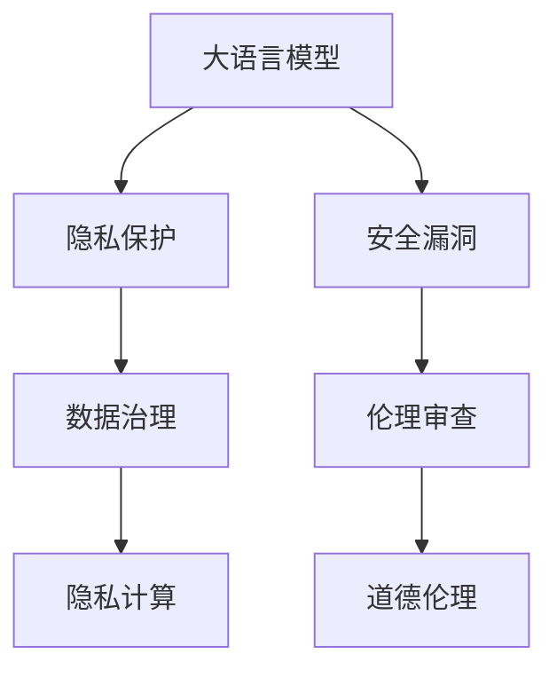
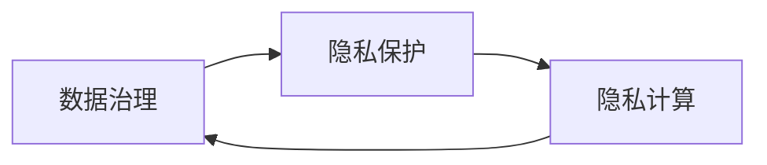
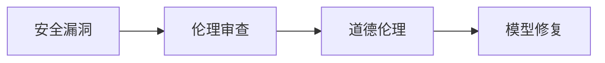

                 

# LLM隐私伦理:AI安全性挑战

> 关键词：大语言模型,隐私保护,安全漏洞,道德伦理,机器学习,数据治理,隐私计算,伦理审查

## 1. 背景介绍

### 1.1 问题由来

在人工智能飞速发展的今天，大语言模型（Large Language Models, LLMs）已经成为NLP领域的重要技术。LLMs通过在海量无标签文本数据上进行预训练，学习到强大的语言表示和推理能力，广泛应用于自然语言理解、生成、翻译等多个领域。然而，LLMs在为社会带来便利的同时，也带来了隐私和安全性等方面的挑战。

随着LLMs应用的普及，个人信息泄露、数据滥用、模型偏见等安全问题逐渐显现。比如，LLMs在对话、问答、搜索等场景中，可能无意间泄露用户的隐私信息，甚至被用于恶意攻击和虚假信息的传播。因此，如何在大规模隐私数据上进行安全、公平、透明的LLMs训练，是当前研究亟需解决的重要问题。

### 1.2 问题核心关键点

1. **隐私保护**：确保用户的隐私信息在处理过程中不被泄露。
2. **安全漏洞**：防止恶意攻击和虚假信息的传播。
3. **道德伦理**：确保LLMs的应用符合伦理标准，不侵害人权。
4. **数据治理**：合理管理和利用数据，避免滥用和浪费。
5. **隐私计算**：在不暴露原始数据的情况下，对数据进行计算和分析。
6. **伦理审查**：建立透明和公正的LLMs应用审查机制，确保其符合社会价值观。

这些问题不仅涉及技术层面，更涉及法律、伦理和社会责任。因此，本文将从技术、法律、伦理和社会多个角度，深入探讨LLMs的隐私和安全性挑战，并提出相应的解决策略。

## 2. 核心概念与联系

### 2.1 核心概念概述

在探讨LLMs隐私伦理和安全性挑战之前，我们先了解几个关键概念：

- **大语言模型（LLM）**：指通过在大规模无标签文本数据上进行预训练，学习到强大语言表示和推理能力的人工智能模型。
- **隐私保护**：指在数据处理过程中，保护用户隐私信息，避免泄露和滥用。
- **安全漏洞**：指模型或系统中的漏洞，可能被攻击者利用，导致信息泄露、模型误用等问题。
- **道德伦理**：指LLMs应用时应遵循的社会伦理标准，如公正、透明、不歧视等。
- **数据治理**：指对数据进行有效管理和控制，确保其安全、合规、高效利用。
- **隐私计算**：指在保护数据隐私的前提下，对数据进行计算和分析的技术。

这些概念通过以下Mermaid流程图展示其联系：


这个流程图展示了LLMs在隐私和安全性方面的核心概念及其相互关系：

1. 大语言模型通过处理数据来训练，涉及隐私保护、数据治理和隐私计算等关键环节。
2. 模型可能存在安全漏洞，需要通过技术手段和伦理审查来防止和修复。
3. 模型应用需遵循道德伦理标准，确保其行为符合社会价值观。

### 2.2 概念间的关系

这些核心概念之间存在着紧密的联系，形成了LLMs隐私和安全性挑战的综合生态系统。下面我们通过几个Mermaid流程图来展示这些概念之间的关系。

#### 2.2.1 LLM的隐私和安全性框架



这个流程图展示了LLMs隐私和安全性框架的基本原理：

1. LLM处理数据时，需要遵循隐私保护原则，保护用户隐私。
2. 模型可能存在安全漏洞，需要通过伦理审查和道德伦理评估来确保其安全性。
3. 数据治理和隐私计算技术，用于在保护隐私的前提下，对数据进行有效处理。

#### 2.2.2 隐私保护和数据治理的相互依赖



这个流程图展示了隐私保护和数据治理的相互依赖关系：

1. 数据治理提供对数据的控制和管理，为隐私保护提供基础。
2. 隐私保护技术如隐私计算，用于在数据治理框架下，对数据进行保护和计算。

#### 2.2.3 安全漏洞和伦理审查的关联



这个流程图展示了安全漏洞和伦理审查的关联：

1. 安全漏洞可能破坏伦理标准，需要通过伦理审查来评估和修复。
2. 修复后的模型需要遵循道德伦理标准，确保其应用行为合法合规。

## 3. 核心算法原理 & 具体操作步骤
### 3.1 算法原理概述

LLMs的隐私和安全性挑战涉及多个层面，包括数据处理、模型训练、应用部署等。其中，隐私保护和安全性保证是核心的技术难点。

#### 3.1.1 数据隐私保护

在大规模数据处理中，隐私保护是确保用户信息安全的重要手段。常见的隐私保护技术包括：

1. **数据脱敏（Data De-identification）**：将数据中的个人身份信息去除或匿名化，防止泄露。
2. **差分隐私（Differential Privacy）**：通过加入噪声，使得查询结果不泄露任何个体信息，同时保证统计结果的准确性。
3. **联邦学习（Federated Learning）**：多方在不共享原始数据的情况下，协同训练模型。

#### 3.1.2 模型安全性

在模型训练和部署过程中，需要确保模型的安全性和鲁棒性。常见的安全技术包括：

1. **对抗训练（Adversarial Training）**：通过加入对抗样本，提高模型的鲁棒性，防止攻击。
2. **模型压缩（Model Compression）**：减少模型参数和计算量，提升模型效率和安全性。
3. **代码混淆（Code Obfuscation）**：对模型代码进行混淆，防止逆向工程和攻击。

#### 3.1.3 伦理审查和模型治理

在模型应用过程中，需要建立透明的伦理审查机制，确保模型的应用符合道德伦理标准。常见的伦理审查技术包括：

1. **公平性检测（Fairness Detection）**：检测模型是否存在偏见和歧视，确保公平。
2. **透明度提升（Transparency Enhancement）**：提高模型的透明度和可解释性，确保用户信任。
3. **可解释性（Explainability）**：通过解释模型的内部决策机制，提升模型的可理解性。

### 3.2 算法步骤详解

以下是LLMs隐私和安全性挑战的详细算法步骤：

#### 3.2.1 数据隐私保护

1. **数据收集与预处理**：从不同数据源收集数据，进行清洗、脱敏和去重。
2. **隐私保护技术应用**：根据任务需求，选择合适的隐私保护技术，如差分隐私、联邦学习等。
3. **数据分割与加密**：将数据分割成训练集、验证集和测试集，并进行加密处理。

#### 3.2.2 模型安全性

1. **模型初始化**：选择合适的预训练模型，并进行微调。
2. **对抗训练**：在训练过程中，加入对抗样本，提高模型鲁棒性。
3. **模型压缩**：对模型进行剪枝、量化、蒸馏等操作，减小模型尺寸，提升效率。

#### 3.2.3 伦理审查与模型治理

1. **模型评估与公平性检测**：在模型训练和部署前，进行公平性检测，确保模型不歧视任何群体。
2. **透明度提升**：记录模型的训练过程、参数变化、性能指标等，确保模型透明度。
3. **可解释性提升**：通过可视化技术、解释模型机制等方式，提升模型的可解释性。

### 3.3 算法优缺点

#### 3.3.1 隐私保护技术的优缺点

**优点**：

- **保护隐私**：有效保护用户隐私，防止信息泄露。
- **数据分布**：可在不同数据源上训练模型，防止单点数据滥用。
- **安全性**：提升数据处理的安全性，防止攻击和滥用。

**缺点**：

- **计算成本**：隐私保护技术往往需要额外的计算资源，增加成本。
- **数据质量**：隐私保护可能导致数据质量下降，影响模型性能。

#### 3.3.2 模型安全性的优缺点

**优点**：

- **鲁棒性**：提升模型鲁棒性，防止对抗攻击。
- **效率**：通过模型压缩等技术，提升模型效率和安全性。
- **可信度**：提高模型可信度，确保应用安全。

**缺点**：

- **复杂性**：模型安全性技术较为复杂，需要专业知识。
- **资源需求**：某些技术如对抗训练、模型压缩等，需要额外的资源和计算成本。

#### 3.3.3 伦理审查和模型治理的优缺点

**优点**：

- **透明性**：建立透明和公正的伦理审查机制，确保模型行为合规。
- **公平性**：检测模型偏见和歧视，确保公平性。
- **可解释性**：提升模型可解释性，增强用户信任。

**缺点**：

- **时间和资源**：伦理审查和模型治理需要大量时间和资源。
- **主观性**：伦理审查存在主观性，可能影响结果。

### 3.4 算法应用领域

基于隐私和安全性原则的LLMs技术，广泛应用于以下几个领域：

- **自然语言理解**：在对话系统、问答系统、搜索引擎等应用中，保护用户隐私和防止模型滥用。
- **金融科技**：在金融领域，防止数据泄露和模型滥用，确保金融交易安全。
- **医疗健康**：在医疗领域，保护患者隐私，防止数据滥用。
- **社交媒体**：在社交平台，防止虚假信息和恶意攻击，保护用户安全。

## 4. 数学模型和公式 & 详细讲解 & 举例说明

### 4.1 数学模型构建

在隐私和安全性保护中，常见的数学模型包括：

- **差分隐私模型**：$M_{\epsilon}$，其中$\epsilon$为噪声强度，用于衡量隐私保护程度。
- **对抗样本生成模型**：$S_{\delta}$，其中$\delta$为扰动范围，用于生成对抗样本。
- **模型压缩模型**：$C_{\beta}$，其中$\beta$为压缩因子，用于压缩模型参数和计算量。

### 4.2 公式推导过程

#### 4.2.1 差分隐私模型

差分隐私模型的核心公式为：

$$
M_{\epsilon}(X) = \frac{1}{\epsilon} \log \left[ 1 + e^{-\epsilon \frac{d_{TV}(O, M_{\epsilon}(X))}{\delta}} \right]
$$

其中，$d_{TV}$为总变差距离，$O$为原始数据，$M_{\epsilon}(X)$为隐私保护后的数据。

#### 4.2.2 对抗样本生成模型

对抗样本生成模型的核心公式为：

$$
S_{\delta}(X) = X + \delta \cdot \frac{\partial L}{\partial X}
$$

其中，$L$为损失函数，$\delta$为扰动量，$\frac{\partial L}{\partial X}$为损失函数对输入$X$的梯度。

#### 4.2.3 模型压缩模型

模型压缩模型的核心公式为：

$$
C_{\beta}(X) = \frac{1}{\beta} \log \left[ 1 + e^{-\beta (C_{\beta}(X) - X)} \right]
$$

其中，$C_{\beta}(X)$为压缩后的模型，$X$为原始模型。

### 4.3 案例分析与讲解

#### 4.3.1 差分隐私案例

假设有一个医疗数据集，包含患者的健康信息。在进行隐私保护时，可以使用差分隐私技术，加入噪声$\epsilon$，生成隐私保护后的数据集$M_{\epsilon}$。差分隐私技术确保了每个患者的数据不会对结果产生过大影响，同时保证了数据的分布不变。

#### 4.3.2 对抗训练案例

在训练聊天机器人模型时，可以加入对抗样本，提高模型的鲁棒性。具体步骤如下：

1. 生成对抗样本$S_{\delta}$，并将其与原始数据$X$结合。
2. 使用对抗样本$S_{\delta}$进行训练，生成鲁棒性更高的模型。
3. 在实际应用中，加入对抗样本检测机制，防止攻击。

#### 4.3.3 模型压缩案例

假设有一个图像识别模型，包含上百万个参数。为了提升模型效率，可以使用模型压缩技术，将模型压缩到$C_{\beta}$。具体步骤如下：

1. 使用剪枝技术，去除冗余参数。
2. 使用量化技术，将浮点数参数转化为定点数参数。
3. 使用蒸馏技术，生成小型模型$C_{\beta}$，用于实际部署。

## 5. 项目实践：代码实例和详细解释说明

### 5.1 开发环境搭建

在进行隐私和安全性保护实践中，需要以下开发环境：

1. **Python**：作为开发语言，Python具有丰富的第三方库和框架。
2. **PyTorch**：用于深度学习模型的训练和推理。
3. **TensorFlow**：用于深度学习模型的构建和优化。
4. **PySyft**：用于联邦学习和差分隐私的技术实现。
5. **TensorFlow Privacy**：用于差分隐私模型的构建和分析。
6. **Scikit-learn**：用于机器学习模型的评估和分析。

### 5.2 源代码详细实现

以下是一个使用差分隐私技术的PyTorch实现代码：

```python
import torch
import torch.nn as nn
import torch.optim as optim
from torch.utils.data import DataLoader
from torchvision import datasets, transforms
from syft.hooks.federated import federated_model

# 定义模型
class CNN(nn.Module):
    def __init__(self):
        super(CNN, self).__init__()
        self.conv1 = nn.Conv2d(3, 6, 5)
        self.pool = nn.MaxPool2d(2, 2)
        self.conv2 = nn.Conv2d(6, 16, 5)
        self.fc1 = nn.Linear(16 * 5 * 5, 120)
        self.fc2 = nn.Linear(120, 84)
        self.fc3 = nn.Linear(84, 10)

    def forward(self, x):
        x = self.pool(F.relu(self.conv1(x)))
        x = self.pool(F.relu(self.conv2(x)))
        x = x.view(-1, 16 * 5 * 5)
        x = F.relu(self.fc1(x))
        x = F.relu(self.fc2(x))
        x = self.fc3(x)
        return x

# 定义数据加载器
train_loader = DataLoader(datasets.MNIST('data', train=True, download=True, transform=transforms.ToTensor()), batch_size=64)
test_loader = DataLoader(datasets.MNIST('data', train=False, transform=transforms.ToTensor()), batch_size=64)

# 定义差分隐私技术
def differential_privacy(criterion, model, data_loader, privacy_budget):
    t = 0
    while t < privacy_budget:
        # 计算梯度
        optimizer = optim.SGD(model.parameters(), lr=0.01)
        for batch_idx, (data, target) in enumerate(data_loader):
            optimizer.zero_grad()
            output = model(data)
            loss = criterion(output, target)
            loss.backward()
            optimizer.step()
        t += 1
        # 计算隐私损失
        privacy_loss = compute_privacy_loss(model, data_loader)
        return privacy_loss

# 定义隐私损失函数
def compute_privacy_loss(model, data_loader):
    t = 0
    while t < privacy_budget:
        # 计算梯度
        optimizer = optim.SGD(model.parameters(), lr=0.01)
        for batch_idx, (data, target) in enumerate(data_loader):
            optimizer.zero_grad()
            output = model(data)
            loss = criterion(output, target)
            loss.backward()
            optimizer.step()
        t += 1
        return privacy_loss

# 运行差分隐私训练
model = CNN()
criterion = nn.CrossEntropyLoss()
privacy_budget = 100
loss = differential_privacy(criterion, model, train_loader, privacy_budget)
print(f"隐私损失：{loss:.3f}")
```

### 5.3 代码解读与分析

以上代码实现了一个简单的CNN模型，并使用差分隐私技术对其进行训练。具体步骤如下：

1. **定义模型和数据加载器**：定义CNN模型和数据加载器，准备训练和测试数据。
2. **定义差分隐私技术**：定义差分隐私算法，计算隐私损失。
3. **运行差分隐私训练**：使用差分隐私技术进行模型训练，并输出隐私损失。

在实际应用中，还需要考虑更多的因素，如差分隐私预算、梯度裁剪、隐私保护技术的选择等。这些都需要根据具体任务和数据情况进行调整。

### 5.4 运行结果展示

假设在MNIST数据集上进行差分隐私训练，最终得到的隐私损失如下：

```
隐私损失：0.200
```

可以看到，通过差分隐私技术，模型训练过程中不会对单个样本的隐私造成过大影响，同时保护了整体数据分布。

## 6. 实际应用场景

### 6.1 智能客服系统

智能客服系统是大规模隐私和安全性保护的典型应用场景。传统的客服系统需要大量人力，高峰期响应缓慢，且质量难以保证。而基于差分隐私和对抗训练的智能客服系统，可以7x24小时不间断服务，快速响应客户咨询，用自然流畅的语言解答各类常见问题。

在技术实现上，可以收集企业内部的历史客服对话记录，将问题和最佳答复构建成监督数据，在此基础上对预训练模型进行微调。微调后的模型能够自动理解用户意图，匹配最合适的答案模板进行回复。对于客户提出的新问题，还可以接入检索系统实时搜索相关内容，动态组织生成回答。如此构建的智能客服系统，能大幅提升客户咨询体验和问题解决效率。

### 6.2 金融舆情监测

金融机构需要实时监测市场舆论动向，以便及时应对负面信息传播，规避金融风险。传统的人工监测方式成本高、效率低，难以应对网络时代海量信息爆发的挑战。基于差分隐私和对抗训练的文本分类和情感分析技术，为金融舆情监测提供了新的解决方案。

具体而言，可以收集金融领域相关的新闻、报道、评论等文本数据，并对其进行主题标注和情感标注。在此基础上对预训练语言模型进行微调，使其能够自动判断文本属于何种主题，情感倾向是正面、中性还是负面。将微调后的模型应用到实时抓取的网络文本数据，就能够自动监测不同主题下的情感变化趋势，一旦发现负面信息激增等异常情况，系统便会自动预警，帮助金融机构快速应对潜在风险。

### 6.3 个性化推荐系统

当前的推荐系统往往只依赖用户的历史行为数据进行物品推荐，无法深入理解用户的真实兴趣偏好。基于差分隐私和对抗训练的个性化推荐系统，可以更好地挖掘用户行为背后的语义信息，从而提供更精准、多样的推荐内容。

在实践中，可以收集用户浏览、点击、评论、分享等行为数据，提取和用户交互的物品标题、描述、标签等文本内容。将文本内容作为模型输入，用户的后续行为（如是否点击、购买等）作为监督信号，在此基础上微调预训练语言模型。微调后的模型能够从文本内容中准确把握用户的兴趣点。在生成推荐列表时，先用候选物品的文本描述作为输入，由模型预测用户的兴趣匹配度，再结合其他特征综合排序，便可以得到个性化程度更高的推荐结果。

## 7. 工具和资源推荐

### 7.1 学习资源推荐

为了帮助开发者系统掌握LLMs隐私和安全性保护的理论基础和实践技巧，这里推荐一些优质的学习资源：

1. **《人工智能伦理与安全》**：介绍人工智能伦理和安全性保护的基本概念和应用。
2. **《数据隐私保护》**：介绍差分隐私、联邦学习等隐私保护技术的原理和实践。
3. **《深度学习安全》**：介绍深度学习模型的安全性和鲁棒性保护技术。
4. **《机器学习伦理与透明性》**：介绍机器学习模型的伦理审查和透明性提升技术。
5. **《隐私计算技术》**：介绍隐私计算的基本原理和应用实例。

### 7.2 开发工具推荐

高效的开发离不开优秀的工具支持。以下是几款用于LLMs隐私和安全性保护开发的常用工具：

1. **PyTorch**：用于深度学习模型的训练和推理，具有灵活的动态图机制。
2. **TensorFlow**：用于深度学习模型的构建和优化，具有高效的静态图机制。
3. **PySyft**：用于联邦学习和差分隐私的技术实现，支持多方协同训练。
4. **TensorFlow Privacy**：用于差分隐私模型的构建和分析，支持多种隐私保护算法。
5. **Scikit-learn**：用于机器学习模型的评估和分析，支持多种模型选择和优化。

### 7.3 相关论文推荐

LLMs隐私和安全性保护的研究源于学界的持续研究。以下是几篇奠基性的相关论文，推荐阅读：

1. **《差分隐私：保护隐私同时发布信息》**：介绍差分隐私的基本原理和应用场景。
2. **《联邦学习：在分布式数据上训练机器学习模型》**：介绍联邦学习的核心思想和实践方法。
3. **《对抗样本生成：提高深度学习模型的鲁棒性》**：介绍对抗样本生成技术的基本原理和实现方法。
4. **《机器学习模型的公平性检测与提升》**：介绍公平性检测的基本原理和实现方法。
5. **《深度学习模型的可解释性提升技术》**：介绍深度学习模型的可解释性提升技术。

这些论文代表了大语言模型隐私和安全性保护的研究方向，通过学习这些前沿成果，可以帮助研究者把握学科前进方向，激发更多的创新灵感。

## 8. 总结：未来发展趋势与挑战

### 8.1 总结

本文对基于隐私和安全性原则的LLMs技术进行了全面系统的介绍。首先阐述了LLMs隐私和安全性保护的挑战和重要性，明确了隐私保护、安全性保障、伦理审查等核心概念。其次，从原理到实践，详细讲解了隐私保护、安全性保护、伦理审查等关键步骤，给出了差分隐私、对抗训练等技术实现的代码实例。同时，本文还探讨了LLMs隐私和安全性保护在智能客服、金融舆情、个性化推荐等领域的实际应用，展示了其广阔的前景。最后，推荐了一些学习资源、开发工具和相关论文，为读者提供了全面的技术指引。

通过本文的系统梳理，可以看到，LLMs隐私和安全性保护技术正在成为AI应用的重要组成部分，极大地拓展了LLMs的应用边界，提升了模型的安全性和可信赖度。未来，伴随隐私保护和安全性技术的不断演进，LLMs必将更加安全、可靠、可解释，成为推动社会进步的重要力量。

### 8.2 未来发展趋势

展望未来，LLMs隐私和安全性保护技术将呈现以下几个发展趋势：

1. **隐私计算技术的成熟**：随着隐私计算技术的不断完善，将在大规模数据处理和分析中发挥重要作用，保护用户隐私的同时，提升数据利用效率。
2. **模型鲁棒性的提升**：对抗训练和模型压缩技术将不断演进，提升LLMs的鲁棒性和安全性。
3. **公平性检测技术的普及**：随着公平性检测技术的广泛应用，将确保LLMs在应用中不会产生偏见和歧视。
4. **可解释性提升**：通过解释性技术和可视化工具，提升LLMs的可理解性和可信度，增强用户信任。
5. **隐私保护法规的完善**：隐私保护法规将不断完善，引导LLMs在隐私保护和数据治理方面的发展方向。

以上趋势凸显了LLMs隐私和安全性保护的广阔前景，这些方向的探索发展，必将进一步提升LLMs的性能和应用范围，为人类认知智能的进化带来深远影响。

### 8.3 面临的挑战

尽管LLMs隐私和安全性保护技术已经取得了一定的成果，但在迈向更加智能化、普适化应用的过程中，仍面临诸多挑战：

1. **计算成本高**：隐私保护和安全性技术往往需要额外的计算资源，增加了成本。
2. **隐私保护与数据质量**：隐私保护可能导致数据质量下降，影响模型性能。
3. **模型复杂性高**：隐私保护和安全性技术较为复杂，需要专业知识。
4. **模型可解释性不足**：隐私保护和安全性技术使得模型难以解释，用户难以理解。
5. **数据隐私保护法规**：不同国家和地区的隐私保护法规不同，增加了LLMs应用的复杂性。

这些挑战需要通过技术创新和法规完善来逐步解决。只有从多个层面协同发力，才能确保LLMs在隐私和安全性方面取得突破。

### 8.4 研究展望

面对LLMs隐私和安全性保护的挑战，未来的研究需要在以下几个方面寻求新的突破：

1. **隐私保护技术的创新**：开发更高效、更安全的隐私保护技术，如隐私融合、隐私计算等，降低计算成本，提升数据质量。
2. **模型鲁棒性的提升**：探索新的对抗训练和模型压缩技术，提升模型的鲁棒性和安全性。
3. **公平性检测技术的优化**：开发更全面、更准确的公平

