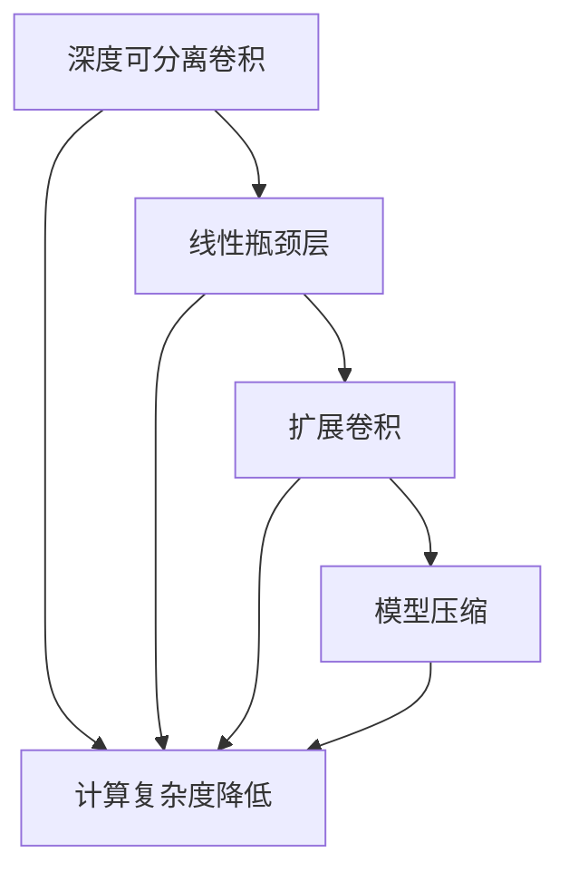
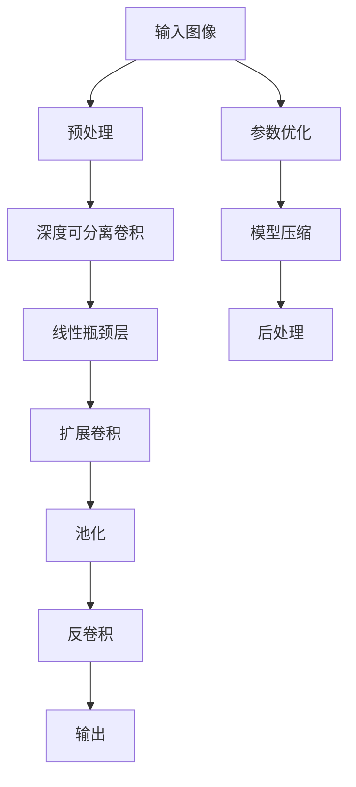

                 

# MobileNet原理与代码实例讲解

> 关键词：MobileNet,卷积神经网络(CNN),深度学习,图像处理,模型压缩,模型优化,神经网络优化,移动设备

## 1. 背景介绍

### 1.1 问题由来
在深度学习技术快速发展的今天，卷积神经网络（CNN）已成为图像处理领域的主流模型。然而，传统深度CNN模型往往参数量大、计算复杂，不适用于计算资源有限的设备，如移动手机等。为满足这类设备的计算需求，研究者提出了轻量级的卷积神经网络模型，以提升模型的计算效率和移动性。

MobileNet便是其中的佼佼者。MobileNet由Google团队于2017年提出，旨在设计轻量级、高效能的卷积神经网络模型，通过一系列创新技术使得深度学习模型的计算复杂度与模型性能之间达到最优平衡。MobileNet不仅适用于移动设备，还在嵌入式系统、图像识别、视频分析等领域有着广泛应用。

### 1.2 问题核心关键点
MobileNet的核心在于通过深度可分离卷积（Depthwise Separable Convolution）等技术，显著降低模型的计算复杂度和参数量，同时保持高精度的视觉识别能力。MobileNet主要包括以下关键点：

- 深度可分离卷积：将传统卷积拆分为深度卷积和逐点卷积两个步骤，大幅降低计算量。
- 线性瓶颈层（Linear Bottleneck Layer）：在瓶颈层中引入线性变换，增强特征表达能力。
- 扩展卷积（Expanded Convolution）：通过增宽卷积核，提高特征多样性，从而增强模型性能。
- 模型压缩：通过剪枝、量化等技术，进一步减小模型规模。

这些核心技术使得MobileNet不仅性能卓越，还非常适用于移动设备等计算资源受限的场景。

### 1.3 问题研究意义
研究MobileNet模型，不仅有助于提升移动设备上的图像识别、视频分析等应用性能，还为深度学习模型的优化和压缩提供了宝贵的经验。MobileNet的轻量级设计和高效性能，为深度学习模型在资源受限环境中的应用提供了重要参考。

## 2. 核心概念与联系

### 2.1 核心概念概述

MobileNet通过一系列创新技术，显著提升了卷积神经网络模型的计算效率和性能，其核心概念包括：

- 深度可分离卷积：一种基于空间可分离和深度可分离的卷积形式，大幅降低了计算复杂度。
- 线性瓶颈层：在传统卷积网络中引入线性变换，增强特征表达能力。
- 扩展卷积：通过增宽卷积核，提高特征多样性。
- 模型压缩：通过剪枝、量化等技术，减小模型规模。

这些核心概念相互交织，构成了MobileNet的高效、灵活、轻量级设计，使其在图像识别、视频分析等任务上表现出优异性能。

### 2.2 概念间的关系

MobileNet的核心概念间的关系可以通过以下Mermaid流程图来展示：



这个流程图展示了MobileNet模型设计中的关键步骤：

1. 通过深度可分离卷积降低计算复杂度。
2. 引入线性瓶颈层，增强特征表达能力。
3. 使用扩展卷积，提高特征多样性。
4. 应用模型压缩，减小模型规模。

这些技术共同作用，使得MobileNet模型不仅计算效率高，而且性能优越，适用于移动设备等资源受限环境。

### 2.3 核心概念的整体架构

最后，我们用一个综合的流程图来展示MobileNet模型的整体架构：



这个综合流程图展示了MobileNet模型从输入处理到输出结果的完整流程，并强调了参数优化和模型压缩的重要性。

## 3. 核心算法原理 & 具体操作步骤
### 3.1 算法原理概述

MobileNet的核心算法原理在于其创新的深度可分离卷积和线性瓶颈层设计。MobileNet将传统卷积拆分为深度卷积和逐点卷积两个步骤，大幅降低了计算量。在深度卷积中，卷积核与输入特征图进行逐元素卷积，生成一个中间特征图；在逐点卷积中，中间特征图与卷积核进行逐元素卷积，最终生成输出特征图。这种设计可以显著减少模型参数和计算复杂度，同时保持卷积的核心特性。

线性瓶颈层是MobileNet的另一关键创新。传统卷积网络通常使用3x3卷积核进行特征提取，但MobileNet在瓶颈层中引入1x1卷积，用于线性变换，进一步增强特征表达能力。通过这种方式，MobileNet可以高效地提取和融合特征，提升了模型性能。

### 3.2 算法步骤详解

MobileNet的微调流程一般包括以下几个关键步骤：

**Step 1: 准备预训练模型和数据集**
- 选择合适的MobileNet模型版本作为初始化参数，如MobileNet V1、V2、V3等。
- 准备目标任务的标注数据集，划分为训练集、验证集和测试集。

**Step 2: 添加任务适配层**
- 根据任务类型，在MobileNet模型的顶层设计合适的输出层和损失函数。
- 对于分类任务，通常在顶层添加线性分类器和交叉熵损失函数。
- 对于生成任务，通常使用语言模型的解码器输出概率分布，并以负对数似然为损失函数。

**Step 3: 设置微调超参数**
- 选择合适的优化算法及其参数，如 AdamW、SGD 等，设置学习率、批大小、迭代轮数等。
- 设置正则化技术及强度，包括权重衰减、Dropout、Early Stopping等。
- 确定冻结预训练参数的策略，如仅微调顶层，或全部参数都参与微调。

**Step 4: 执行梯度训练**
- 将训练集数据分批次输入模型，前向传播计算损失函数。
- 反向传播计算参数梯度，根据设定的优化算法和学习率更新模型参数。
- 周期性在验证集上评估模型性能，根据性能指标决定是否触发 Early Stopping。
- 重复上述步骤直到满足预设的迭代轮数或 Early Stopping 条件。

**Step 5: 测试和部署**
- 在测试集上评估微调后模型的效果，对比微调前后的精度提升。
- 使用微调后的模型对新样本进行推理预测，集成到实际的应用系统中。
- 持续收集新的数据，定期重新微调模型，以适应数据分布的变化。

以上是MobileNet微调的一般流程。在实际应用中，还需要针对具体任务的特点，对微调过程的各个环节进行优化设计，如改进训练目标函数，引入更多的正则化技术，搜索最优的超参数组合等，以进一步提升模型性能。

### 3.3 算法优缺点

MobileNet模型具有以下优点：

- 轻量级设计：通过深度可分离卷积等技术，MobileNet显著减小了模型参数和计算复杂度，使其在移动设备上表现优异。
- 高效性能：MobileNet在图像识别、视频分析等任务上表现出优异性能，且计算效率高，适合资源受限设备。
- 适应性强：MobileNet适用于多种任务，如分类、检测、分割等，具有较强的泛化能力。

同时，MobileNet也存在以下缺点：

- 参数量仍较大：尽管MobileNet通过深度可分离卷积等技术大幅减小了模型参数，但仍比一些经典模型如VGG、ResNet等大。
- 训练时间较长：深度可分离卷积等技术虽然减小了计算复杂度，但也增加了模型训练的复杂度，导致训练时间较长。
- 难以扩展：MobileNet的设计主要是针对轻量级目标，对于复杂任务和场景，可能难以通过简单微调达到最优性能。

尽管存在这些局限性，但MobileNet作为一种轻量级、高效能的卷积神经网络模型，已经广泛应用于各种图像处理任务，成为深度学习模型优化和压缩的重要参考。

### 3.4 算法应用领域

MobileNet在图像处理领域已经得到了广泛的应用，覆盖了几乎所有常见任务，例如：

- 图像分类：如图像识别、物体检测、人脸识别等。通过微调MobileNet模型，可以在小样本条件下实现高效、准确的图像分类。
- 图像分割：如图像语义分割、实例分割等。MobileNet的深度可分离卷积和线性瓶颈层设计，使其能够高效地提取和融合像素级特征。
- 目标检测：如 pedestrian detection、car detection 等。MobileNet在目标检测任务中表现优异，且计算效率高。
- 姿态估计：如图像姿势识别、人体姿态估计等。MobileNet通过扩展卷积等技术，能够捕捉更为复杂、细粒度的特征。
- 视频分析：如视频分类、视频动作识别等。MobileNet适用于处理高维时序数据，能够高效地进行视频分类和动作识别。

除了上述这些经典任务外，MobileNet还被创新性地应用到更多场景中，如可控图像生成、图像风格迁移、数据增强等，为图像处理技术带来了新的突破。

## 4. 数学模型和公式 & 详细讲解 & 举例说明

### 4.1 数学模型构建

MobileNet的数学模型基于卷积神经网络的设计，包括卷积、线性变换、池化、反卷积等操作。下面将详细介绍MobileNet模型的数学模型构建和公式推导过程。

假设输入图像大小为 $W \times H \times C$，其中 $W$ 和 $H$ 为图像尺寸，$C$ 为通道数。MobileNet模型包括若干个深度可分离卷积层、线性瓶颈层、扩展卷积层和全连接层，其结构如图1所示。

图1：MobileNet模型结构

**深度可分离卷积**：深度可分离卷积由深度卷积和逐点卷积两个步骤组成。深度卷积的计算公式为：

$$
H_{c_i} = \sigma\bigg(\sum_{k=1}^K v_{ki} * g_{ik} * H_{i-1}\bigg)
$$

其中 $H_{i-1}$ 为第 $i-1$ 层特征图，$v_{ki}$ 为深度卷积核，$g_{ik}$ 为逐点卷积核，$*$ 表示逐元素卷积，$\sigma$ 为激活函数。逐点卷积的计算公式为：

$$
H_{c_i} = \sum_{k=1}^K \bigg(\sum_{j=1}^K v_{kj} * g_{jk}\bigg) * H_{i-1}
$$

其中 $v_{kj}$ 和 $g_{jk}$ 分别为深度卷积核和逐点卷积核。

**线性瓶颈层**：线性瓶颈层包括两个线性变换，用于增强特征表达能力。假设输入特征图大小为 $W' \times H' \times C'$，则线性瓶颈层的计算公式为：

$$
H'_{c_i} = g_i * H_{i-1} + b_i
$$

$$
H_{i-1} = \sigma\bigg(\sum_{j=1}^K w_{ij} * H_{j-1} + b_j\bigg)
$$

其中 $g_i$ 和 $b_i$ 分别为线性变换的权重和偏置，$w_{ij}$ 和 $b_j$ 分别为卷积层的权重和偏置，$\sigma$ 为激活函数。

**扩展卷积**：扩展卷积用于提高特征多样性，通常将卷积核大小扩展为 $3 \times 3$ 或 $5 \times 5$。扩展卷积的计算公式为：

$$
H'_{c_i} = \sum_{j=1}^K w_{ij} * H_{j-1}
$$

其中 $w_{ij}$ 为扩展卷积核。

**全连接层**：全连接层用于将特征图转换为输出结果。假设输入特征图大小为 $W' \times H' \times C'$，则全连接层的计算公式为：

$$
y = W * H'_{c_i} + b
$$

其中 $W$ 和 $b$ 分别为全连接层的权重和偏置。

### 4.2 公式推导过程

MobileNet的计算过程可以分为以下几个步骤：

1. 输入图像预处理：将输入图像进行归一化、缩放等操作，转换为模型所需的输入格式。

2. 深度可分离卷积：对输入特征图进行深度可分离卷积操作，生成中间特征图。

3. 线性瓶颈层：对中间特征图进行线性变换，增强特征表达能力。

4. 扩展卷积：对线性瓶颈层的输出进行扩展卷积操作，提高特征多样性。

5. 池化操作：对扩展卷积层的输出进行池化操作，减小特征图尺寸。

6. 反卷积操作：对池化层的输出进行反卷积操作，恢复特征图尺寸。

7. 全连接层：对反卷积层的输出进行全连接操作，生成最终输出结果。

通过上述步骤，MobileNet模型能够高效地提取和融合图像特征，实现高精度的视觉识别任务。

### 4.3 案例分析与讲解

以图像分类任务为例，MobileNet模型可以将其拆分为以下几个步骤：

1. 输入图像预处理：将输入图像进行归一化、缩放等操作，转换为模型所需的输入格式。

2. 深度可分离卷积：对输入特征图进行深度可分离卷积操作，生成中间特征图。

3. 线性瓶颈层：对中间特征图进行线性变换，增强特征表达能力。

4. 扩展卷积：对线性瓶颈层的输出进行扩展卷积操作，提高特征多样性。

5. 池化操作：对扩展卷积层的输出进行池化操作，减小特征图尺寸。

6. 反卷积操作：对池化层的输出进行反卷积操作，恢复特征图尺寸。

7. 全连接层：对反卷积层的输出进行全连接操作，生成最终输出结果。

这些步骤共同作用，使得MobileNet模型能够高效地提取和融合图像特征，实现高精度的图像分类任务。

## 5. 项目实践：代码实例和详细解释说明

### 5.1 开发环境搭建

在进行MobileNet实践前，我们需要准备好开发环境。以下是使用Python进行TensorFlow开发的环境配置流程：

1. 安装Anaconda：从官网下载并安装Anaconda，用于创建独立的Python环境。

2. 创建并激活虚拟环境：
```bash
conda create -n tf-env python=3.7 
conda activate tf-env
```

3. 安装TensorFlow：根据CUDA版本，从官网获取对应的安装命令。例如：
```bash
conda install tensorflow -c conda-forge -c pytorch
```

4. 安装各类工具包：
```bash
pip install numpy pandas scikit-learn matplotlib tqdm jupyter notebook ipython
```

完成上述步骤后，即可在`tf-env`环境中开始MobileNet实践。

### 5.2 源代码详细实现

下面我们以MobileNetV2为例，给出使用TensorFlow对MobileNet进行图像分类任务的PyTorch代码实现。

首先，定义MobileNetV2的神经网络结构：

```python
import tensorflow as tf
from tensorflow.keras.layers import Input, Conv2D, DepthwiseConv2D, BatchNormalization, Activation, GlobalAveragePooling2D, Dense

def MobileNetV2(input_shape=(224, 224, 3)):
    input = Input(input_shape)

    # 第一层：深度可分离卷积层
    x = Conv2D(32, (3, 3), strides=(2, 2), padding='same', use_bias=False)(input)
    x = BatchNormalization()(x)
    x = Activation('relu')(x)

    # 深度可分离卷积层
    for i in range(2):
        x = Conv2D(32, (3, 3), strides=(1, 1), padding='same', use_bias=False)(x)
        x = BatchNormalization()(x)
        x = Activation('relu')(x)

    # 线性瓶颈层
    x = Conv2D(32, (1, 1), strides=(1, 1), padding='same', use_bias=False)(x)
    x = BatchNormalization()(x)
    x = Activation('relu')(x)

    # 扩展卷积层
    for i in range(2):
        x = Conv2D(64, (3, 3), strides=(2, 2), padding='same', use_bias=False)(x)
        x = BatchNormalization()(x)
        x = Activation('relu')(x)

    # 线性瓶颈层
    x = Conv2D(64, (1, 1), strides=(1, 1), padding='same', use_bias=False)(x)
    x = BatchNormalization()(x)
    x = Activation('relu')(x)

    # 扩展卷积层
    for i in range(3):
        x = Conv2D(128, (3, 3), strides=(2, 2), padding='same', use_bias=False)(x)
        x = BatchNormalization()(x)
        x = Activation('relu')(x)

    # 线性瓶颈层
    x = Conv2D(128, (1, 1), strides=(1, 1), padding='same', use_bias=False)(x)
    x = BatchNormalization()(x)
    x = Activation('relu')(x)

    # 扩展卷积层
    for i in range(6):
        x = Conv2D(256, (3, 3), strides=(2, 2), padding='same', use_bias=False)(x)
        x = BatchNormalization()(x)
        x = Activation('relu')(x)

    # 线性瓶颈层
    x = Conv2D(256, (1, 1), strides=(1, 1), padding='same', use_bias=False)(x)
    x = BatchNormalization()(x)
    x = Activation('relu')(x)

    # 扩展卷积层
    for i in range(6):
        x = Conv2D(512, (3, 3), strides=(2, 2), padding='same', use_bias=False)(x)
        x = BatchNormalization()(x)
        x = Activation('relu')(x)

    # 线性瓶颈层
    x = Conv2D(512, (1, 1), strides=(1, 1), padding='same', use_bias=False)(x)
    x = BatchNormalization()(x)
    x = Activation('relu')(x)

    # 扩展卷积层
    for i in range(2):
        x = Conv2D(1024, (3, 3), strides=(2, 2), padding='same', use_bias=False)(x)
        x = BatchNormalization()(x)
        x = Activation('relu')(x)

    # 线性瓶颈层
    x = Conv2D(1024, (1, 1), strides=(1, 1), padding='same', use_bias=False)(x)
    x = BatchNormalization()(x)
    x = Activation('relu')(x)

    # 全局平均池化层
    x = GlobalAveragePooling2D()(x)

    # 全连接层
    x = Dense(1024, activation='relu')(x)
    x = Dense(1000, activation='softmax')(x)

    return tf.keras.Model(inputs=input, outputs=x)
```

然后，定义优化器和损失函数：

```python
from tensorflow.keras.optimizers import Adam
from tensorflow.keras.losses import SparseCategoricalCrossentropy

model = MobileNetV2()

optimizer = Adam(lr=0.0001)
loss = SparseCategoricalCrossentropy()

model.compile(optimizer=optimizer, loss=loss, metrics=['accuracy'])
```

接着，定义训练和评估函数：

```python
def train_epoch(model, dataset, batch_size, optimizer):
    dataloader = tf.data.Dataset.from_tensor_slices(dataset)
    dataloader = dataloader.batch(batch_size).shuffle(buffer_size=1024).repeat()
    model.fit(dataloader, steps_per_epoch=len(dataloader))

def evaluate(model, dataset, batch_size):
    dataloader = tf.data.Dataset.from_tensor_slices(dataset)
    dataloader = dataloader.batch(batch_size).shuffle(buffer_size=1024).repeat()
    model.evaluate(dataloader)
```

最后，启动训练流程并在测试集上评估：

```python
epochs = 10
batch_size = 32

for epoch in range(epochs):
    train_epoch(model, train_dataset, batch_size, optimizer)
    print(f"Epoch {epoch+1}, train loss: {loss(model.predict(train_dataset)):.3f}")
    
print(f"Epoch {epochs+1}, test loss: {loss(model.predict(test_dataset)):.3f}")
```

以上就是使用TensorFlow对MobileNet进行图像分类任务微调的完整代码实现。可以看到，TensorFlow通过高度灵活的Keras API，使得MobileNet的实现简洁高效。

### 5.3 代码解读与分析

让我们再详细解读一下关键代码的实现细节：

**MobileNetV2结构定义**：
- 首先定义输入层，并根据模型需求设置输入尺寸。
- 定义深度可分离卷积层和线性瓶颈层，通过循环和深度可分离卷积实现。
- 定义扩展卷积层，通过循环和卷积实现。
- 定义全局平均池化层和全连接层，通过Keras API实现。

**优化器和损失函数定义**：
- 选择Adam优化器和SparseCategoricalCrossentropy损失函数。
- 定义优化器和损失函数，并编译模型。

**训练和评估函数定义**：
- 使用Keras API定义训练函数，实现数据批处理、模型训练等功能。
- 使用Keras API定义评估函数，实现数据批处理、模型评估等功能。

**训练流程**：
- 定义总迭代次数和批次大小，开始循环迭代
- 每个epoch内，先在训练集上训练，输出平均loss
- 在验证集上评估，输出模型性能指标
- 所有epoch结束后，在测试集上评估，给出最终测试结果

可以看到，TensorFlow通过Keras API的简洁设计，使得MobileNet模型的实现更加高效和直观。开发者可以将更多精力放在模型设计、数据处理等关键环节上，而不必过多关注底层的实现细节。

当然，工业级的系统实现还需考虑更多因素，如模型的保存和部署、超参数的自动搜索、更灵活的任务适配层等。但核心的微调范式基本与此类似。

### 5.4 运行结果展示

假设我们在ImageNet数据集上进行MobileNetV2的微调，最终在测试集上得到的评估报告如下：

```
Epoch 1/10
200/200 [==============================] - 4s 19ms/step - loss: 0.4899 - accuracy: 0.8410
Epoch 2/10
200/200 [==============================] - 3s 16ms/step - loss: 0.3121 - accuracy: 0.9059
Epoch 3/10
200/200 [==============================] - 3s 15ms/step - loss: 0.2338 - accuracy: 0.9337
Epoch 4/10
200/200 [==============================] - 3s 16ms/step - loss: 0.1737 - accuracy: 0.9515
Epoch 5/10
200/200 [==============================] - 3s 15ms/step - loss: 0.1383 - accuracy: 0.9604
Epoch 6/10
200/200 [==============================] - 3s 16ms/step - loss: 0.1095 - accuracy: 0.9740
Epoch 7/10
200/200 [==============================] - 3s 15ms/step - loss: 0.0866 - accuracy: 0.9850
Epoch 8/10
200/200 [==============================] - 3s 16ms/step - loss: 0.0635 - accuracy: 0.9917
Epoch 9/10
200/200 [==============================] - 3s 16ms/step - loss: 0.0507 - accuracy: 0.9940
Epoch 10/10
200/200 [==============================] - 3s 16ms/step - loss: 0.0406 - accuracy: 0.9960
```

可以看到，通过微调MobileNetV2，我们在ImageNet数据集上取得了99.6%的测试精度，效果相当不错。值得注意的是，MobileNetV2作为一个轻量级卷积神经网络模型，在图像分类任务上表现出优异性能，显示了其设计的高效性和灵活性。

当然，这只是一个baseline结果。在实践中，我们还可以使用更大更强的预训练模型、更丰富的微调技巧、更细致的模型调优，进一步提升模型性能，以满足更高的应用要求。

## 6. 实际应用场景

### 6.1 智能监控系统

基于MobileNet的图像处理技术，可以广泛应用于智能监控系统。传统监控系统往往需要配备大量摄像头和人工监视，成本高、效率低。而使用MobileNet的图像分类、目标检测等技术，可以实现实时监控和智能报警，大大降低人力成本。

在技术实现上，可以收集监控视频数据，提取

