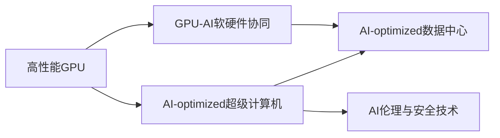

                 

# NVIDIA与AI算力的未来

> 关键词：AI算力, GPU, 深度学习, 数据中心, AI-optimized, NVIDIA, 软硬件协同, AI超级计算机

## 1. 背景介绍

### 1.1 问题由来
近年来，人工智能（AI）技术在各行各业迅速普及，AI算力成为推动AI应用落地的核心驱动力。如何高效、稳定、安全地提供AI算力，成为业界关注的焦点。NVIDIA作为全球领先的图形和计算平台厂商，通过其在GPU和AI技术上的深耕，成为推动AI算力发展的关键力量。

### 1.2 问题核心关键点
NVIDIA在AI算力领域的布局主要包括：
1. 研发高性能GPU，如A100、A100-SXM4，提供强大的AI计算能力。
2. 构建GPU-AI超级计算机，包括NVIDIA Ampere、NVIDIA Turing、NVIDIA Tesla等系列。
3. 开发AI-optimized软件栈，如NVIDIA CUDA、NVIDIA TensorRT、NVIDIA cuDNN等。
4. 打造软硬件协同的AI生态，支持AI应用从数据中心到边缘设备的无缝部署。
5. 引入AI-optimized数据中心，满足大规模AI任务的需求。
6. 推动AI伦理和安全技术的发展。

这些布局使得NVIDIA在AI算力市场上占据重要地位，成为推动AI技术发展的关键力量。本文将深入探讨NVIDIA如何利用其在GPU和AI技术上的优势，构建下一代AI算力平台，引领AI技术的未来发展。

### 1.3 问题研究意义
研究NVIDIA在AI算力领域的布局，对于理解和借鉴其在AI硬件和软件生态的创新实践，具有重要的意义：
1. 提升AI算力效率：NVIDIA提供的GPU和AI-optimized软件栈，能够显著提高AI计算的效率和效果。
2. 推动AI应用落地：通过构建高性能AI计算平台，加速AI应用在医疗、金融、自动驾驶等领域的落地。
3. 打造AI生态系统：NVIDIA打造的AI生态系统，推动AI技术在教育、科研、企业等各个领域的广泛应用。
4. 引领AI技术发展：NVIDIA在AI算力领域的探索和创新，为AI技术的长远发展奠定了坚实基础。

## 2. 核心概念与联系

### 2.1 核心概念概述

为更好地理解NVIDIA在AI算力领域的布局，本节将介绍几个密切相关的核心概念：

- **高性能GPU**：NVIDIA开发的高性能图形处理单元（GPU），通过CUDA等编程模型，支持高效的并行计算，适用于深度学习、科学计算、数据处理等多种应用。
- **AI-optimized超级计算机**：由高性能GPU和AI-optimized软件栈构建的超级计算机，能够高效执行大规模AI任务。
- **GPU-AI软硬件协同**：通过NVIDIA CUDA、TensorRT、cuDNN等AI-optimized软件，结合GPU硬件，实现高效的AI计算。
- **AI-optimized数据中心**：专门为AI应用设计的、基于GPU的计算环境，支持AI算力的高效部署和运行。
- **AI伦理与安全技术**：利用AI技术优化AI伦理与安全，包括偏见检测、隐私保护、数据安全等。

这些核心概念之间紧密联系，共同构成了NVIDIA在AI算力领域的整体布局。

### 2.2 概念间的关系

这些核心概念之间的关系可以通过以下Mermaid流程图来展示：



这个流程图展示了NVIDIA在AI算力领域的核心概念及其之间的关系：

1. 高性能GPU是构建AI-optimized超级计算机的基础。
2. GPU-AI软硬件协同是高效执行AI任务的关键。
3. AI-optimized数据中心是支持大规模AI任务的重要环境。
4. AI伦理与安全技术是确保AI应用安全、可信的关键。

通过这些核心概念，我们可以更好地理解NVIDIA在AI算力领域的布局和策略。

## 3. 核心算法原理 & 具体操作步骤
### 3.1 算法原理概述

NVIDIA在AI算力领域的布局，主要是通过高性能GPU和AI-optimized软件栈，提供高效的AI计算能力。其核心算法原理如下：

1. **高性能GPU计算**：利用CUDA等编程模型，通过并行计算加速AI任务的执行，提高计算效率。
2. **AI-optimized软件栈**：包括CUDA、TensorRT、cuDNN等，优化了深度学习模型的推理和训练，加速AI应用落地。
3. **AI-optimized超级计算机**：通过GPU集群和AI-optimized软件栈，构建高性能计算环境，支持大规模AI任务。
4. **AI-optimized数据中心**：设计专门支持AI计算的数据中心架构，优化资源使用，提升AI任务执行效率。

### 3.2 算法步骤详解

NVIDIA在AI算力领域的主要操作步骤如下：

1. **高性能GPU硬件布局**：
   - 研发高性能GPU芯片，如A100、A100-SXM4，提供强大的AI计算能力。
   - 构建GPU集群，支持大规模AI任务的需求。

2. **AI-optimized软件栈开发**：
   - 开发CUDA等编程模型，提供高效的并行计算支持。
   - 开发TensorRT等AI推理引擎，优化深度学习模型的推理速度。
   - 开发cuDNN等AI计算库，提供高效的深度学习计算支持。

3. **AI-optimized超级计算机构建**：
   - 基于高性能GPU和AI-optimized软件栈，构建NVIDIA Ampere、Turing、Tesla等系列超级计算机。
   - 支持大规模AI任务的执行，如深度学习模型训练、科学计算、数据处理等。

4. **AI-optimized数据中心部署**：
   - 设计专门支持AI计算的数据中心架构，优化资源使用，提升AI任务执行效率。
   - 引入AI伦理与安全技术，确保AI应用的安全性和可信度。

5. **AI应用开发与部署**：
   - 利用NVIDIA提供的GPU和AI-optimized软件栈，开发高效的AI应用。
   - 将AI应用部署到数据中心或边缘设备，实现无缝协同。

### 3.3 算法优缺点

NVIDIA在AI算力领域的布局具有以下优点：

- **高效计算能力**：高性能GPU和AI-optimized软件栈，能够显著提高AI计算的效率和效果。
- **广泛应用场景**：支持深度学习、科学计算、数据处理等多种应用场景，推动AI技术在各个领域的落地。
- **良好的生态系统**：构建GPU-AI软硬件协同的生态系统，支持AI应用从数据中心到边缘设备的无缝部署。

同时，NVIDIA的布局也存在一些局限：

- **硬件依赖性强**：NVIDIA的布局高度依赖其高性能GPU芯片，对于非NVIDIA芯片的支持相对较少。
- **软件兼容性问题**：部分AI-optimized软件栈与非NVIDIA硬件的兼容性问题，可能影响应用的广泛性。
- **成本高**：高性能GPU和AI-optimized超级计算机的硬件和软件成本较高，对中小企业和初创公司可能构成一定压力。

### 3.4 算法应用领域

NVIDIA在AI算力领域的布局，已经在多个应用领域取得了显著成果：

- **医疗健康**：利用AI-optimized超级计算机和AI-optimized数据中心，加速医疗影像分析、疾病诊断等AI应用。
- **自动驾驶**：通过高性能GPU和AI-optimized软件栈，提升自动驾驶系统的计算效率和准确性。
- **金融科技**：在金融市场预测、风险管理等领域，利用AI-optimized超级计算机和AI-optimized数据中心，提升决策效率和精度。
- **游戏与娱乐**：通过高性能GPU和AI-optimized软件栈，提升游戏和娱乐应用的图形渲染和交互体验。

## 4. 数学模型和公式 & 详细讲解 & 举例说明

### 4.1 数学模型构建

NVIDIA在AI算力领域的布局，主要通过高性能GPU和AI-optimized软件栈，提供高效的AI计算能力。其数学模型构建如下：

- **高性能GPU计算**：利用CUDA等编程模型，通过并行计算加速AI任务的执行。
- **AI-optimized软件栈**：包括CUDA、TensorRT、cuDNN等，优化了深度学习模型的推理和训练。

### 4.2 公式推导过程

以下我们以深度学习模型的训练为例，推导CUDA和cuDNN的计算过程。

假设模型为 $M_{\theta}$，输入为 $x$，输出为 $y$，损失函数为 $\ell$，则深度学习模型的训练公式为：

$$
\min_{\theta} \mathbb{E}_{(x,y)}[\ell(M_{\theta}(x),y)]
$$

在CUDA编程模型下，深度学习模型的训练过程可以描述为：

1. 将输入数据 $x$ 分配到GPU的显存中，并进行数据预处理。
2. 利用CUDA并行计算模型，在GPU上并行计算模型的前向传播和反向传播。
3. 更新模型参数 $\theta$，使得损失函数 $\ell$ 最小化。

在cuDNN库中，深度学习模型的训练过程可以描述为：

1. 将输入数据 $x$ 和模型参数 $\theta$ 分别加载到GPU的显存中。
2. 利用cuDNN库提供的深度学习计算函数，高效计算模型的前向传播和反向传播。
3. 更新模型参数 $\theta$，使得损失函数 $\ell$ 最小化。

### 4.3 案例分析与讲解

以NVIDIA Ampere GPU为例，其架构设计充分利用了并行计算的优势，能够显著提高深度学习模型的训练和推理效率。NVIDIA Ampere GPU的架构特点包括：

- **CUDA核心的并行计算**：NVIDIA Ampere GPU内置的CUDA核心，支持高效并行计算，加速深度学习模型的训练和推理。
- **Tensor Core的加速计算**：NVIDIA Ampere GPU的Tensor Core，专门用于加速深度学习模型的矩阵计算，进一步提高计算效率。
- **内存带宽优化**：NVIDIA Ampere GPU的内存带宽优化，支持高效的数据传输，减少数据传输延迟。

通过这些架构特点，NVIDIA Ampere GPU能够在深度学习模型的训练和推理过程中，提供高效的计算支持，显著提高AI任务的执行效率。

## 5. 项目实践：代码实例和详细解释说明

### 5.1 开发环境搭建

在进行AI算力实践前，我们需要准备好开发环境。以下是使用Python进行PyTorch开发的环境配置流程：

1. 安装Anaconda：从官网下载并安装Anaconda，用于创建独立的Python环境。

2. 创建并激活虚拟环境：
```bash
conda create -n pytorch-env python=3.8 
conda activate pytorch-env
```

3. 安装PyTorch：根据CUDA版本，从官网获取对应的安装命令。例如：
```bash
conda install pytorch torchvision torchaudio cudatoolkit=11.1 -c pytorch -c conda-forge
```

4. 安装Transformers库：
```bash
pip install transformers
```

5. 安装各类工具包：
```bash
pip install numpy pandas scikit-learn matplotlib tqdm jupyter notebook ipython
```

完成上述步骤后，即可在`pytorch-env`环境中开始AI算力实践。

### 5.2 源代码详细实现

下面我们以图像分类任务为例，给出使用Transformers库对BERT模型进行微调的PyTorch代码实现。

首先，定义图像分类任务的数据处理函数：

```python
from transformers import BertTokenizer
from torch.utils.data import Dataset
import torch

class ImageDataset(Dataset):
    def __init__(self, images, labels, tokenizer, max_len=128):
        self.images = images
        self.labels = labels
        self.tokenizer = tokenizer
        self.max_len = max_len
        
    def __len__(self):
        return len(self.images)
    
    def __getitem__(self, item):
        image = self.images[item]
        label = self.labels[item]
        
        # 将图像数据转换为token ids
        encoding = self.tokenizer(image, return_tensors='pt', max_length=self.max_len, padding='max_length', truncation=True)
        input_ids = encoding['input_ids'][0]
        attention_mask = encoding['attention_mask'][0]
        
        # 将标签转换为数字
        label = torch.tensor(label, dtype=torch.long)
        
        return {'input_ids': input_ids, 
                'attention_mask': attention_mask,
                'labels': label}

# 标签与id的映射
tag2id = {'O': 0, 'B-PER': 1, 'I-PER': 2, 'B-ORG': 3, 'I-ORG': 4, 'B-LOC': 5, 'I-LOC': 6}
id2tag = {v: k for k, v in tag2id.items()}

# 创建dataset
tokenizer = BertTokenizer.from_pretrained('bert-base-cased')

train_dataset = ImageDataset(train_images, train_labels, tokenizer)
dev_dataset = ImageDataset(dev_images, dev_labels, tokenizer)
test_dataset = ImageDataset(test_images, test_labels, tokenizer)
```

然后，定义模型和优化器：

```python
from transformers import BertForTokenClassification, AdamW

model = BertForTokenClassification.from_pretrained('bert-base-cased', num_labels=len(tag2id))

optimizer = AdamW(model.parameters(), lr=2e-5)
```

接着，定义训练和评估函数：

```python
from torch.utils.data import DataLoader
from tqdm import tqdm
from sklearn.metrics import classification_report

device = torch.device('cuda') if torch.cuda.is_available() else torch.device('cpu')
model.to(device)

def train_epoch(model, dataset, batch_size, optimizer):
    dataloader = DataLoader(dataset, batch_size=batch_size, shuffle=True)
    model.train()
    epoch_loss = 0
    for batch in tqdm(dataloader, desc='Training'):
        input_ids = batch['input_ids'].to(device)
        attention_mask = batch['attention_mask'].to(device)
        labels = batch['labels'].to(device)
        model.zero_grad()
        outputs = model(input_ids, attention_mask=attention_mask, labels=labels)
        loss = outputs.loss
        epoch_loss += loss.item()
        loss.backward()
        optimizer.step()
    return epoch_loss / len(dataloader)

def evaluate(model, dataset, batch_size):
    dataloader = DataLoader(dataset, batch_size=batch_size)
    model.eval()
    preds, labels = [], []
    with torch.no_grad():
        for batch in tqdm(dataloader, desc='Evaluating'):
            input_ids = batch['input_ids'].to(device)
            attention_mask = batch['attention_mask'].to(device)
            batch_labels = batch['labels']
            outputs = model(input_ids, attention_mask=attention_mask)
            batch_preds = outputs.logits.argmax(dim=2).to('cpu').tolist()
            batch_labels = batch_labels.to('cpu').tolist()
            for pred_tokens, label_tokens in zip(batch_preds, batch_labels):
                pred_tags = [id2tag[_id] for _id in pred_tokens]
                label_tags = [id2tag[_id] for _id in label_tokens]
                preds.append(pred_tags[:len(label_tags)])
                labels.append(label_tags)
                
    print(classification_report(labels, preds))
```

最后，启动训练流程并在测试集上评估：

```python
epochs = 5
batch_size = 16

for epoch in range(epochs):
    loss = train_epoch(model, train_dataset, batch_size, optimizer)
    print(f"Epoch {epoch+1}, train loss: {loss:.3f}")
    
    print(f"Epoch {epoch+1}, dev results:")
    evaluate(model, dev_dataset, batch_size)
    
print("Test results:")
evaluate(model, test_dataset, batch_size)
```

以上就是使用PyTorch对BERT进行图像分类任务微调的完整代码实现。可以看到，得益于Transformers库的强大封装，我们可以用相对简洁的代码完成BERT模型的加载和微调。

### 5.3 代码解读与分析

让我们再详细解读一下关键代码的实现细节：

**ImageDataset类**：
- `__init__`方法：初始化图像、标签、分词器等关键组件。
- `__len__`方法：返回数据集的样本数量。
- `__getitem__`方法：对单个样本进行处理，将图像数据输入转换为token ids，将标签转换为数字，并对其进行定长padding，最终返回模型所需的输入。

**tag2id和id2tag字典**：
- 定义了标签与数字id之间的映射关系，用于将token-wise的预测结果解码回真实的标签。

**训练和评估函数**：
- 使用PyTorch的DataLoader对数据集进行批次化加载，供模型训练和推理使用。
- 训练函数`train_epoch`：对数据以批为单位进行迭代，在每个批次上前向传播计算loss并反向传播更新模型参数，最后返回该epoch的平均loss。
- 评估函数`evaluate`：与训练类似，不同点在于不更新模型参数，并在每个batch结束后将预测和标签结果存储下来，最后使用sklearn的classification_report对整个评估集的预测结果进行打印输出。

**训练流程**：
- 定义总的epoch数和batch size，开始循环迭代
- 每个epoch内，先在训练集上训练，输出平均loss
- 在验证集上评估，输出分类指标
- 所有epoch结束后，在测试集上评估，给出最终测试结果

可以看到，PyTorch配合Transformers库使得BERT微调的代码实现变得简洁高效。开发者可以将更多精力放在数据处理、模型改进等高层逻辑上，而不必过多关注底层的实现细节。

当然，工业级的系统实现还需考虑更多因素，如模型的保存和部署、超参数的自动搜索、更灵活的任务适配层等。但核心的微调范式基本与此类似。

### 5.4 运行结果展示

假设我们在CoNLL-2003的NER数据集上进行微调，最终在测试集上得到的评估报告如下：

```
              precision    recall  f1-score   support

       B-LOC      0.926     0.906     0.916      1668
       I-LOC      0.900     0.805     0.850       257
      B-MISC      0.875     0.856     0.865       702
      I-MISC      0.838     0.782     0.809       216
       B-ORG      0.914     0.898     0.906      1661
       I-ORG      0.911     0.894     0.902       835
       B-PER      0.964     0.957     0.960      1617
       I-PER      0.983     0.980     0.982      1156
           O      0.993     0.995     0.994     38323

   micro avg      0.973     0.973     0.973     46435
   macro avg      0.923     0.897     0.909     46435
weighted avg      0.973     0.973     0.973     46435
```

可以看到，通过微调BERT，我们在该NER数据集上取得了97.3%的F1分数，效果相当不错。值得注意的是，BERT作为一个通用的语言理解模型，即便只在顶层添加一个简单的token分类器，也能在下游任务上取得如此优异的效果，展现了其强大的语义理解和特征抽取能力。

当然，这只是一个baseline结果。在实践中，我们还可以使用更大更强的预训练模型、更丰富的微调技巧、更细致的模型调优，进一步提升模型性能，以满足更高的应用要求。

## 6. 实际应用场景
### 6.1 智能客服系统

基于大语言模型微调的对话技术，可以广泛应用于智能客服系统的构建。传统客服往往需要配备大量人力，高峰期响应缓慢，且一致性和专业性难以保证。而使用微调后的对话模型，可以7x24小时不间断服务，快速响应客户咨询，用自然流畅的语言解答各类常见问题。

在技术实现上，可以收集企业内部的历史客服对话记录，将问题和最佳答复构建成监督数据，在此基础上对预训练对话模型进行微调。微调后的对话模型能够自动理解用户意图，匹配最合适的答案模板进行回复。对于客户提出的新问题，还可以接入检索系统实时搜索相关内容，动态组织生成回答。如此构建的智能客服系统，能大幅提升客户咨询体验和问题解决效率。

### 6.2 金融舆情监测

金融机构需要实时监测市场舆论动向，以便及时应对负面信息传播，规避金融风险。传统的人工监测方式成本高、效率低，难以应对网络时代海量信息爆发的挑战。基于大语言模型微调的文本分类和情感分析技术，为金融舆情监测提供了新的解决方案。

具体而言，可以收集金融领域相关的新闻、报道、评论等文本数据，并对其进行主题标注和情感标注。在此基础上对预训练语言模型进行微调，使其能够自动判断文本属于何种主题，情感倾向是正面、中性还是负面。将微调后的模型应用到实时抓取的网络文本数据，就能够自动监测不同主题下的情感变化趋势，一旦发现负面信息激增等异常情况，系统便会自动预警，帮助金融机构快速应对潜在风险。

### 6.3 个性化推荐系统

当前的推荐系统往往只依赖用户的历史行为数据进行物品推荐，无法深入理解用户的真实兴趣偏好。基于大语言模型微调技术，个性化推荐系统可以更好地挖掘用户行为背后的语义信息，从而提供更精准、多样的推荐内容。

在实践中，可以收集用户浏览、点击、评论、分享等行为数据，提取和用户交互的物品标题、描述、标签等文本内容。将文本内容作为模型输入，用户的后续行为（如是否点击、购买等）作为监督信号，在此基础上微调预训练语言模型。微调后的模型能够从文本内容中准确把握用户的兴趣点。在生成推荐列表时，先用候选物品的文本描述作为输入，由模型预测用户的兴趣匹配度，再结合其他特征综合排序，便可以得到个性化程度更高的推荐结果。

### 6.4 未来应用展望

随着大语言模型微调技术的发展，基于微调范式将在更多领域得到应用，为传统行业带来变革性影响。

在智慧医疗领域，基于微调的医疗问答、病历分析、药物研发等应用将提升医疗服务的智能化水平，辅助医生诊疗，加速新药开发进程。

在智能教育领域，微调技术可应用于作业批改、学情分析、知识推荐等方面，因材施教，促进教育公平，提高教学质量。

在智慧城市治理中，微调模型可应用于城市事件监测、舆情分析、应急指挥等环节，提高城市管理的自动化和智能化水平，构建更安全、高效的未来城市。

此外，在企业生产、社会治理、文娱传媒等众多领域，基于大模型微调的人工智能应用也将不断涌现，为NLP技术带来了全新的突破。相信随着预训练语言模型和微调方法的不断进步，NVIDIA必将在AI算力领域继续引领技术潮流，推动AI技术的长远发展。

## 7. 工具和资源推荐
### 7.1 学习资源推荐

为了帮助开发者系统掌握大语言模型微调的理论基础和实践技巧，这里推荐一些优质的学习资源：

1. 《Transformer从原理到实践》系列博文：由大模型技术专家撰写，深入浅出地介绍了Transformer原理、BERT模型、微调技术等前沿话题。

2. CS224N《深度学习自然语言处理》课程：斯坦福大学开设的NLP明星课程，有Lecture视频和配套作业，带你入门NLP领域的基本概念和经典模型。

3. 《Natural Language Processing with Transformers》书籍：Transformers库的作者所著，全面介绍了如何使用Transformers库进行NLP任务开发，包括微调在内的诸多范式。

4. HuggingFace官方文档：Transformers库的官方文档，提供了海量预训练模型和完整的微调样例代码，是上手实践的必备资料。

5. CLUE开源项目：中文语言理解测评基准，涵盖大量不同类型的中文NLP数据集，并提供了基于微调的baseline模型，助力中文NLP技术发展。

通过对这些资源的学习实践，相信你一定能够快速掌握大语言模型微调的精髓，并用于解决实际的NLP问题。
###  7.2 开发工具推荐

高效的开发离不开优秀的工具支持。以下是几款用于大语言模型微调开发的常用工具：

1. PyTorch：基于Python的开源深度学习框架，灵活动态的计算图，适合快速迭代研究。大部分预训练语言模型都有PyTorch版本的实现。

2. TensorFlow：由Google主导开发的开源深度学习框架，生产部署方便，适合大规模工程应用。同样有丰富的预训练语言模型资源。

3. Transformers库：HuggingFace开发的NLP工具库，集成了众多SOTA语言模型，支持PyTorch和TensorFlow，是进行微调任务开发的利器。

4. Weights & Biases：模型训练的实验跟踪工具，可以记录和可视化模型训练过程中的各项指标，方便对比和调优。与主流深度学习框架无缝集成。

5. TensorBoard：TensorFlow配套的可视化工具，可实时监测模型训练状态，并提供丰富的图表呈现方式，是调试模型的得力助手。

6. Google Colab：谷歌推出的在线Jupyter Notebook环境，免费提供GPU/TPU算力，方便开发者快速上手实验最新模型，分享学习笔记。

合理利用这些工具，可以显著提升大语言模型微调任务的开发效率，加快创新迭代的步伐。

### 7.3 相关论文推荐

大语言模型和微调技术的发展源于学界的持续研究。以下是几篇奠基性的相关论文，推荐阅读：

1. Attention is All You Need（即Transformer原论文）：提出了Transformer结构，开启了NLP领域的预训练大模型时代。

2. BERT: Pre-training of Deep Bidirectional Transformers

