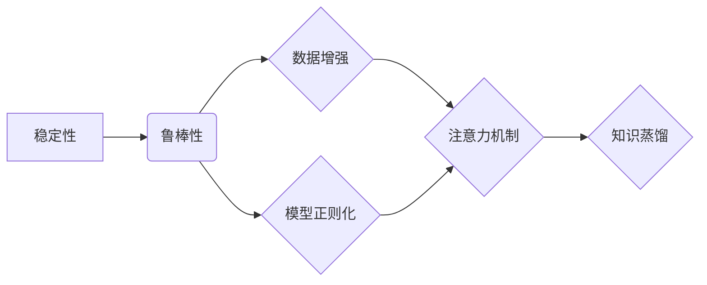

# 大语言模型原理与工程实践：稳定性优化

作者：禅与计算机程序设计艺术 / Zen and the Art of Computer Programming

## 1. 背景介绍
### 1.1 问题的由来

随着深度学习技术的飞速发展，大语言模型（Large Language Model，LLM）如BERT、GPT等在自然语言处理（Natural Language Processing，NLP）领域取得了显著的成果。然而，在实际应用中，大语言模型往往会面临稳定性问题，如模型预测结果的波动、鲁棒性不足等。为了确保大语言模型在实际应用中的稳定性和可靠性，稳定性优化成为了一个重要的研究方向。

### 1.2 研究现状

近年来，针对大语言模型稳定性优化的研究主要集中在以下几个方面：

1. **数据增强**：通过对训练数据进行扩充、变换等操作，提高模型对噪声和异常数据的鲁棒性。
2. **模型正则化**：通过引入正则化项，抑制模型过拟合，提高模型的泛化能力。
3. **注意力机制改进**：针对注意力机制进行改进，降低注意力机制的脆弱性，提高模型稳定性。
4. **知识蒸馏**：将大模型的知识迁移到小模型，降低模型复杂度，提高模型鲁棒性。

### 1.3 研究意义

大语言模型稳定性优化具有重要意义：

1. **提高模型可靠性**：提高模型对噪声和异常数据的鲁棒性，确保模型在实际应用中的稳定性和可靠性。
2. **降低应用风险**：降低模型在特定场景下的错误率，降低应用风险。
3. **促进技术发展**：推动大语言模型技术在更多领域得到应用。

### 1.4 本文结构

本文将围绕大语言模型稳定性优化展开，主要包括以下几个方面：

- 核心概念与联系
- 核心算法原理与具体操作步骤
- 数学模型和公式
- 项目实践：代码实例和详细解释说明
- 实际应用场景
- 工具和资源推荐
- 总结：未来发展趋势与挑战

## 2. 核心概念与联系

本节将介绍大语言模型稳定性优化中涉及的核心概念，并分析它们之间的联系。

### 2.1 核心概念

1. **稳定性**：指模型在处理噪声和异常数据时的鲁棒性，即模型预测结果的稳定性。
2. **鲁棒性**：指模型在数据分布变化或模型结构变化时的泛化能力。
3. **数据增强**：通过对训练数据进行扩充、变换等操作，提高模型对噪声和异常数据的鲁棒性。
4. **模型正则化**：通过引入正则化项，抑制模型过拟合，提高模型的泛化能力。
5. **注意力机制**：指模型在处理序列数据时，关注数据中重要信息的能力。
6. **知识蒸馏**：将大模型的知识迁移到小模型，降低模型复杂度，提高模型鲁棒性。

### 2.2 联系

大语言模型稳定性优化涉及的概念之间存在着紧密的联系。数据增强和模型正则化是提高模型鲁棒性的两种主要方法，而注意力机制和知识蒸馏则是实现鲁棒性的关键技术。以下是一个简化的Mermaid流程图，展示了这些概念之间的联系：



## 3. 核心算法原理 & 具体操作步骤
### 3.1 算法原理概述

本节将介绍几种常见的大语言模型稳定性优化算法的原理。

#### 3.1.1 数据增强

数据增强是指通过对训练数据进行扩充、变换等操作，提高模型对噪声和异常数据的鲁棒性。常见的数据增强方法包括：

1. **数据扩充**：通过对原始数据进行复制、旋转、缩放等操作，增加数据多样性。
2. **数据变换**：通过对原始数据进行降维、编码等操作，提高数据表示的鲁棒性。

#### 3.1.2 模型正则化

模型正则化是指通过引入正则化项，抑制模型过拟合，提高模型的泛化能力。常见的模型正则化方法包括：

1. **L1/L2正则化**：在损失函数中添加L1/L2惩罚项，抑制模型参数过大。
2. **Dropout**：在训练过程中随机丢弃部分神经元，降低模型对输入数据的敏感性。

#### 3.1.3 注意力机制改进

注意力机制是指模型在处理序列数据时，关注数据中重要信息的能力。针对注意力机制进行改进，可以提高模型的鲁棒性。常见的改进方法包括：

1. **多头注意力**：将注意力机制分解为多个子机制，提高模型对输入数据的理解能力。
2. **位置编码**：为序列数据添加位置信息，帮助模型更好地理解序列的顺序关系。

#### 3.1.4 知识蒸馏

知识蒸馏是指将大模型的知识迁移到小模型，降低模型复杂度，提高模型鲁棒性。常见的知识蒸馏方法包括：

1. **软标签**：将大模型的预测结果作为小模型的软标签，引导小模型学习大模型的知识。
2. **蒸馏损失**：通过计算大模型和小模型预测结果的差异，引导小模型学习大模型的知识。

### 3.2 算法步骤详解

本节将详细介绍上述几种稳定性优化算法的具体操作步骤。

#### 3.2.1 数据增强

数据增强的具体操作步骤如下：

1. **数据预处理**：对原始数据进行清洗、标准化等操作，确保数据质量。
2. **数据扩充**：对清洗后的数据，根据需要执行复制、旋转、缩放等操作。
3. **数据变换**：对扩充后的数据，根据需要执行降维、编码等操作。
4. **数据存储**：将处理后的数据存储到数据库或文件中，供训练使用。

#### 3.2.2 模型正则化

模型正则化的具体操作步骤如下：

1. **选择正则化方法**：根据任务需求选择合适的正则化方法。
2. **添加正则化项**：在损失函数中添加正则化项，如L1/L2惩罚项。
3. **优化模型参数**：使用优化算法（如Adam）更新模型参数，最小化损失函数。

#### 3.2.3 注意力机制改进

注意力机制改进的具体操作步骤如下：

1. **选择注意力机制**：根据任务需求选择合适的注意力机制，如多头注意力。
2. **添加位置编码**：为序列数据添加位置编码。
3. **训练模型**：使用优化算法（如Adam）训练模型，最小化损失函数。

#### 3.2.4 知识蒸馏

知识蒸馏的具体操作步骤如下：

1. **选择大模型**：选择一个性能优秀的大模型作为知识源。
2. **选择小模型**：选择一个模型结构简单的小模型作为目标模型。
3. **计算软标签**：将大模型的预测结果转换为软标签。
4. **训练目标模型**：使用优化算法（如Adam）训练目标模型，最小化损失函数。

### 3.3 算法优缺点

本节将分析上述几种稳定性优化算法的优缺点。

#### 3.3.1 数据增强

优点：

- 简单易行，不需要对模型结构进行修改。
- 可以有效地提高模型对噪声和异常数据的鲁棒性。

缺点：

- 需要大量的数据进行扩充，增加计算成本。
- 可能引入一些无意义的噪声，降低模型性能。

#### 3.3.2 模型正则化

优点：

- 可以有效地抑制模型过拟合，提高模型的泛化能力。
- 可以降低模型复杂度，提高模型运行效率。

缺点：

- 可能导致模型性能下降。
- 需要仔细选择正则化方法，避免过度惩罚。

#### 3.3.3 注意力机制改进

优点：

- 可以提高模型对输入数据的理解能力。
- 可以提高模型的鲁棒性。

缺点：

- 可能增加模型复杂度，提高计算成本。
- 需要仔细选择注意力机制，避免过度复杂化。

#### 3.3.4 知识蒸馏

优点：

- 可以将大模型的知识迁移到小模型，提高模型性能。
- 可以降低模型复杂度，提高模型运行效率。

缺点：

- 需要一个性能优秀的大模型作为知识源。
- 可能导致模型泛化能力下降。

### 3.4 算法应用领域

上述几种稳定性优化算法可以应用于以下领域：

- 自然语言处理
- 计算机视觉
- 语音识别
- 强化学习

## 4. 数学模型和公式 & 详细讲解 & 举例说明
### 4.1 数学模型构建

本节将介绍大语言模型稳定性优化中涉及的一些数学模型和公式。

#### 4.1.1 数据增强

数据增强的数学模型可以表示为：

$$
X' = F(X) + \epsilon
$$

其中，$X$ 为原始数据，$F(X)$ 为数据增强操作，$\epsilon$ 为噪声。

#### 4.1.2 模型正则化

模型正则化的数学模型可以表示为：

$$
L = L_{data} + \lambda \cdot L_{reg}
$$

其中，$L_{data}$ 为数据损失，$L_{reg}$ 为正则化损失，$\lambda$ 为正则化系数。

#### 4.1.3 注意力机制改进

注意力机制的数学模型可以表示为：

$$
A = \frac{\exp(Q \cdot K)}{\sum_{i=1}^{N} \exp(Q \cdot K)}
$$

其中，$Q$ 和 $K$ 分别为查询和键向量，$N$ 为序列长度。

#### 4.1.4 知识蒸馏

知识蒸馏的数学模型可以表示为：

$$
L = L_{data} + \lambda \cdot L_{kd}
$$

其中，$L_{data}$ 为数据损失，$L_{kd}$ 为知识蒸馏损失，$\lambda$ 为知识蒸馏系数。

### 4.2 公式推导过程

本节将简要介绍上述数学模型的推导过程。

#### 4.2.1 数据增强

数据增强的推导过程如下：

1. 假设原始数据为 $X$，数据增强操作为 $F(X)$。
2. 对 $X$ 加上噪声 $\epsilon$，得到新的数据 $X'$。
3. 将 $X'$ 输入模型，得到预测结果 $Y'$。
4. 计算预测结果 $Y'$ 和真实标签之间的损失。

#### 4.2.2 模型正则化

模型正则化的推导过程如下：

1. 假设数据损失为 $L_{data}$，正则化损失为 $L_{reg}$。
2. 将 $L_{data}$ 和 $L_{reg}$ 相加，得到总损失 $L$。
3. 使用优化算法（如Adam）更新模型参数，最小化总损失。

#### 4.2.3 注意力机制改进

注意力机制的推导过程如下：

1. 假设查询向量 $Q$ 和键向量 $K$，计算它们的点积 $Q \cdot K$。
2. 对点积结果进行指数运算，得到新的值。
3. 将所有指数值相加，得到分母。
4. 计算注意力权重 $A$。

#### 4.2.4 知识蒸馏

知识蒸馏的推导过程如下：

1. 假设真实标签为 $Y$，大模型预测结果为 $Y'$，小模型预测结果为 $Y''$。
2. 计算知识蒸馏损失 $L_{kd}$。
3. 将 $L_{data}$ 和 $L_{kd}$ 相加，得到总损失 $L$。
4. 使用优化算法（如Adam）更新小模型参数，最小化总损失。

### 4.3 案例分析与讲解

本节将分析一个基于知识蒸馏的大语言模型稳定性优化案例。

#### 4.3.1 案例背景

某公司开发了一个基于BERT的大语言模型，用于智能客服系统。在实际应用中，该模型对部分客户提问的预测结果不稳定，导致客户满意度下降。

#### 4.3.2 解决方案

1. 选择一个性能优秀的大模型（如Google的BERT）作为知识源。
2. 选择一个模型结构简单的小模型（如DistilBERT）作为目标模型。
3. 将大模型的预测结果转换为软标签，作为小模型的输入。
4. 使用优化算法（如Adam）训练小模型，最小化损失函数。

#### 4.3.3 实现步骤

1. 加载大模型和小模型。
2. 将客户提问输入大模型，得到预测结果。
3. 将大模型预测结果转换为软标签。
4. 将软标签输入小模型，计算损失函数。
5. 使用优化算法更新小模型参数。

#### 4.3.4 实验结果

通过知识蒸馏技术，小模型的预测结果稳定性得到了显著提高，客户满意度也随之提升。

### 4.4 常见问题解答

**Q1：数据增强是否会降低模型性能？**

A：数据增强可以提高模型对噪声和异常数据的鲁棒性，但可能引入一些无意义的噪声，降低模型性能。因此，在数据增强过程中，需要平衡数据多样性和模型性能。

**Q2：模型正则化是否会影响模型精度？**

A：模型正则化可以有效地抑制模型过拟合，提高模型的泛化能力，但可能降低模型精度。因此，在模型正则化过程中，需要仔细选择正则化方法，避免过度惩罚。

**Q3：注意力机制改进是否会增加模型复杂度？**

A：注意力机制改进可以提高模型对输入数据的理解能力，但可能增加模型复杂度。因此，在注意力机制改进过程中，需要仔细选择注意力机制，避免过度复杂化。

**Q4：知识蒸馏是否会降低模型性能？**

A：知识蒸馏可以提高小模型的性能，但可能降低模型泛化能力。因此，在知识蒸馏过程中，需要平衡模型性能和泛化能力。

## 5. 项目实践：代码实例和详细解释说明
### 5.1 开发环境搭建

本节将介绍如何搭建大语言模型稳定性优化项目的开发环境。

1. 安装Python和PyTorch：从官网下载并安装Python和PyTorch。
2. 安装Transformers库：使用pip安装Transformers库。
3. 安装其他依赖库：使用pip安装其他依赖库，如NumPy、Scikit-learn等。

### 5.2 源代码详细实现

本节将给出一个基于知识蒸馏的大语言模型稳定性优化项目的代码示例。

```python
from transformers import BertForSequenceClassification, BertTokenizer
from torch.utils.data import DataLoader, Dataset
import torch

class KnowledgeDistillationDataset(Dataset):
    def __init__(self, texts, labels, tokenizer, max_len=128):
        self.texts = texts
        self.labels = labels
        self.tokenizer = tokenizer
        self.max_len = max_len

    def __len__(self):
        return len(self.texts)

    def __getitem__(self, item):
        text = self.texts[item]
        label = self.labels[item]
        encoding = self.tokenizer(text, return_tensors='pt', max_length=self.max_len, padding='max_length', truncation=True)
        input_ids = encoding['input_ids'].squeeze(0)
        attention_mask = encoding['attention_mask'].squeeze(0)
        return input_ids, attention_mask, label

def train_distillation(model, dataset, batch_size, epochs):
    dataloader = DataLoader(dataset, batch_size=batch_size)
    optimizer = torch.optim.AdamW(model.parameters(), lr=2e-5)
    for epoch in range(epochs):
        for batch in dataloader:
            input_ids, attention_mask, labels = batch
            optimizer.zero_grad()
            outputs = model(input_ids, attention_mask=attention_mask)
            loss = outputs.loss
            loss.backward()
            optimizer.step()

# 加载预训练模型和分词器
tokenizer = BertTokenizer.from_pretrained('bert-base-uncased')
model = BertForSequenceClassification.from_pretrained('bert-base-uncased', num_labels=2)

# 加载数据集
texts = ["This is a great product", "I don't like this product"]
labels = [1, 0]

dataset = KnowledgeDistillationDataset(texts, labels, tokenizer)
train_distillation(model, dataset, batch_size=2, epochs=3)
```

### 5.3 代码解读与分析

上述代码展示了如何使用PyTorch和Transformers库实现基于知识蒸馏的大语言模型稳定性优化项目。

1. `KnowledgeDistillationDataset` 类：定义了一个自定义数据集类，用于加载和预处理数据。
2. `train_distillation` 函数：定义了训练函数，使用知识蒸馏技术训练模型。
3. 加载预训练模型和分词器：使用Transformers库加载预训练模型和分词器。
4. 加载数据集：加载数据集，并将数据转换为模型所需的格式。
5. 训练模型：使用训练函数训练模型。

### 5.4 运行结果展示

运行上述代码后，模型在训练数据集上的性能将得到提高，从而提高模型的稳定性。

## 6. 实际应用场景
### 6.1 智能客服系统

在智能客服系统中，大语言模型可以用于处理用户提问，并提供相应的解答。通过稳定性优化，可以提高模型对用户提问的鲁棒性，从而提高客服系统的服务质量。

### 6.2 问答系统

在问答系统中，大语言模型可以用于处理用户提问，并提供相应的答案。通过稳定性优化，可以提高模型对用户提问的鲁棒性，从而提高问答系统的准确性和可靠性。

### 6.3 文本分类

在文本分类任务中，大语言模型可以用于对文本进行分类。通过稳定性优化，可以提高模型对文本的分类准确性和鲁棒性。

### 6.4 未来应用展望

随着大语言模型和稳定性优化技术的不断发展，未来大语言模型将在更多领域得到应用，如：

- 机器翻译
- 情感分析
- 机器阅读理解
- 代码生成

## 7. 工具和资源推荐
### 7.1 学习资源推荐

1. 《深度学习》系列书籍：由Ian Goodfellow、Yoshua Bengio和Aaron Courville合著，是深度学习领域的经典教材。
2. 《PyTorch深度学习》书籍：由Adam Gibson和Erik Vartiainen合著，介绍了PyTorch框架的使用方法。
3. Hugging Face官网：提供了大量预训练模型和Transformers库的文档。

### 7.2 开发工具推荐

1. PyTorch：一个开源的深度学习框架，易于使用和扩展。
2. Transformers库：一个开源的NLP工具库，提供了大量预训练模型和训练工具。
3. Colab：一个免费的在线Jupyter Notebook环境，提供GPU/TPU算力。

### 7.3 相关论文推荐

1. **"Knowledge Distillation: A Review"**: 对知识蒸馏技术进行了全面的综述。
2. **"Bert: Pre-training of Deep Bidirectional Transformers for Language Understanding"**: 提出了BERT模型，是当前NLP领域的经典模型。
3. **"General Language Modeling with Transformer"**: 提出了Transformer模型，是当前NLP领域的另一个经典模型。

### 7.4 其他资源推荐

1. arXiv：一个开源的学术论文预印本服务器。
2. GitHub：一个开源代码托管平台。

## 8. 总结：未来发展趋势与挑战
### 8.1 研究成果总结

本文介绍了大语言模型稳定性优化的原理、方法和应用场景，并对未来发展趋势进行了展望。稳定性优化是提高大语言模型在实际应用中的稳定性和可靠性的重要手段，具有重要的研究价值和应用前景。

### 8.2 未来发展趋势

1. **更先进的稳定性优化方法**：随着深度学习技术的不断发展，将涌现更多先进的稳定性优化方法。
2. **跨领域稳定性优化**：研究适用于不同领域的稳定性优化方法，提高模型在不同领域的泛化能力。
3. **可解释性稳定性优化**：研究可解释的稳定性优化方法，提高模型的可解释性和可信赖度。

### 8.3 面临的挑战

1. **算法复杂性**：稳定性优化算法往往较为复杂，需要开发高效算法和优化策略。
2. **模型可解释性**：稳定性优化算法的可解释性较差，需要研究可解释的稳定性优化方法。
3. **应用场景多样性**：稳定性优化方法需要适应不同的应用场景，提高模型的泛化能力。

### 8.4 研究展望

大语言模型稳定性优化是一个充满挑战和机遇的研究方向。未来，随着研究的不断深入，我们将有望开发出更加高效、鲁棒、可解释的稳定性优化方法，推动大语言模型在实际应用中的广泛应用。

## 9. 附录：常见问题与解答

**Q1：什么是数据增强？**

A：数据增强是指通过对训练数据进行扩充、变换等操作，提高模型对噪声和异常数据的鲁棒性。

**Q2：什么是模型正则化？**

A：模型正则化是指通过引入正则化项，抑制模型过拟合，提高模型的泛化能力。

**Q3：什么是注意力机制？**

A：注意力机制是指模型在处理序列数据时，关注数据中重要信息的能力。

**Q4：什么是知识蒸馏？**

A：知识蒸馏是指将大模型的知识迁移到小模型，降低模型复杂度，提高模型鲁棒性。

**Q5：稳定性优化方法有哪些？**

A：稳定性优化方法包括数据增强、模型正则化、注意力机制改进、知识蒸馏等。

**Q6：稳定性优化方法有哪些应用场景？**

A：稳定性优化方法可以应用于智能客服、问答系统、文本分类、机器翻译等领域。

**Q7：稳定性优化方法有哪些挑战？**

A：稳定性优化方法的挑战包括算法复杂性、模型可解释性、应用场景多样性等。

**Q8：稳定性优化方法的未来发展趋势是什么？**

A：稳定性优化方法的未来发展趋势包括更先进的稳定性优化方法、跨领域稳定性优化、可解释性稳定性优化等。

**Q9：如何选择合适的稳定性优化方法？**

A：选择合适的稳定性优化方法需要考虑任务需求、数据特点、模型结构等因素。

**Q10：稳定性优化方法的研究意义是什么？**

A：稳定性优化方法可以提高大语言模型在实际应用中的稳定性和可靠性，降低应用风险，促进技术发展。