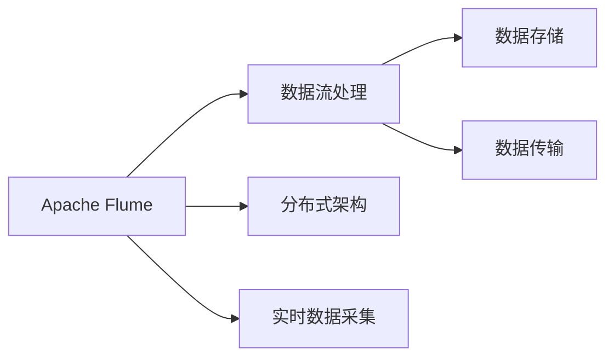
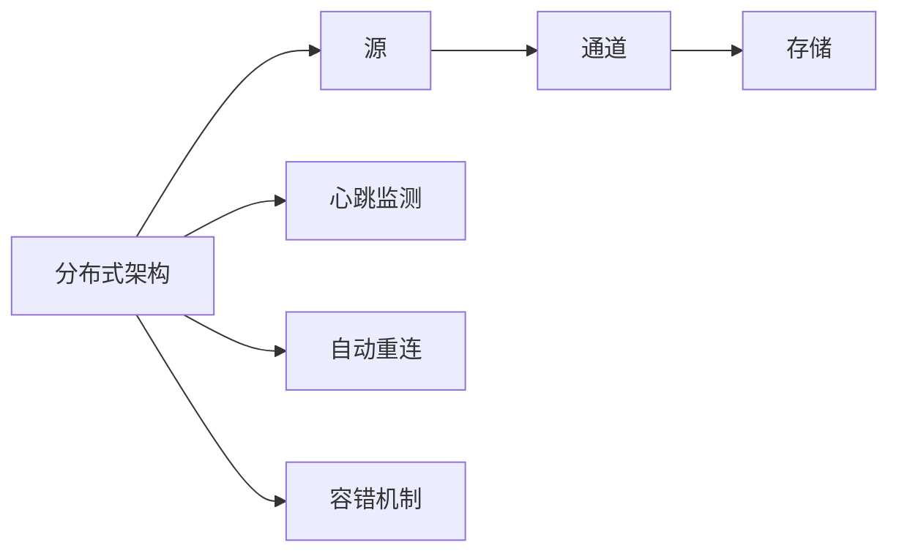
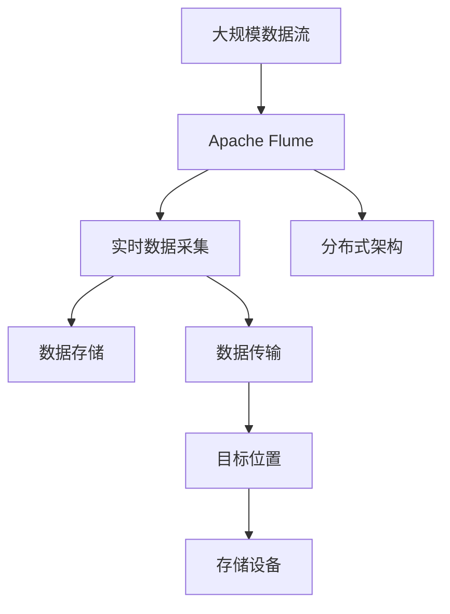

                 

# Flume原理与代码实例讲解

> 关键词：Apache Flume, 数据流处理, 大数据, 流数据, 分布式, 实时数据, 数据采集, 数据存储, 流式处理, 日志收集

## 1. 背景介绍

### 1.1 问题由来
在大数据时代，各种系统产生的海量数据需要高效、可靠地进行采集、传输和存储。尤其是实时流数据的处理，需要具备高吞吐量、低延迟的特性。Apache Flume作为一个开源的分布式流式数据收集系统，被广泛应用于大规模数据流处理的场景中。

### 1.2 问题核心关键点
Apache Flume的核心在于其分布式架构和实时数据流处理能力。Flume通过构建一个集中式或分布式的源、通道和存储架构，实现大规模数据流的采集和传输。其核心特点包括：

- **集中式架构**：源、通道和存储组件可以在一个节点上运行，也可以分布在多个节点上，支持集中式和分布式配置。
- **实时数据流处理**：支持实时数据采集、传输和存储，支持多种数据源和目标。
- **高可用性**：通过心跳监测和自动重连机制，保证系统的稳定性和可靠性。

### 1.3 问题研究意义
Apache Flume作为一种高效的数据流处理工具，其原理和实现对于理解和构建大规模分布式系统具有重要意义：

1. **提升数据采集效率**：通过Flume的分布式架构，可以高效采集海量实时数据。
2. **保障数据传输可靠性**：通过心跳监测和自动重连机制，确保数据传输的稳定性和可靠性。
3. **支持多样化数据源和目标**：支持多种数据源和目标，满足不同场景的数据处理需求。
4. **优化数据存储和处理**：通过合理的流式处理和存储策略，提升数据存储和处理的效率。

## 2. 核心概念与联系

### 2.1 核心概念概述

为更好地理解Apache Flume的核心概念，本节将介绍几个密切相关的核心概念：

- **Apache Flume**：Apache Flume是一个分布式流式数据收集系统，旨在高吞吐量、低延迟地处理大规模、复杂的数据流。
- **数据流处理**：指对连续、实时产生的数据进行采集、传输和存储的过程。
- **分布式架构**：通过将源、通道和存储组件分布在多个节点上，实现系统的分布式部署。
- **实时数据采集**：指通过实时数据源采集到源数据，并进行预处理和传输。
- **数据存储**：指将处理后的数据进行存储，以便后续分析和应用。
- **数据传输**：指将源数据传输到目标位置，如HDFS、S3等。

这些核心概念之间的逻辑关系可以通过以下Mermaid流程图来展示：



这个流程图展示了大语言模型的核心概念及其之间的关系：

1. Apache Flume作为一个集中式或分布式的流式数据收集系统，通过分布式架构实现大规模数据流的采集和传输。
2. 实时数据采集和传输是Apache Flume的核心功能，通过多种数据源和目标支持，满足不同场景的数据处理需求。
3. 数据存储是Apache Flume的一个重要环节，通过合理的流式处理和存储策略，提升数据存储和处理的效率。

### 2.2 概念间的关系

这些核心概念之间存在着紧密的联系，形成了Apache Flume的核心生态系统。下面我通过几个Mermaid流程图来展示这些概念之间的关系。

#### 2.2.1 数据流处理的流式架构


这个流程图展示了数据流处理的基本架构，从源到存储的流式处理过程。

#### 2.2.2 分布式架构的层次结构



这个流程图展示了分布式架构的层次结构，包括源、通道和存储的分布式部署，以及心跳监测、自动重连和容错机制等关键组件。

### 2.3 核心概念的整体架构

最后，我们用一个综合的流程图来展示这些核心概念在大语言模型微调过程中的整体架构：



这个综合流程图展示了Apache Flume的整体架构，从大规模数据流到存储设备的过程。通过上述流程图，我们可以更清晰地理解Apache Flume的核心概念和它们之间的联系。

## 3. 核心算法原理 & 具体操作步骤
### 3.1 算法原理概述

Apache Flume的算法原理主要集中在数据流的采集、传输和存储上。其核心思想是通过分布式架构，实现大规模、高吞吐量、低延迟的数据流处理。

Flume通过源、通道和存储组件构建一个集中式或分布式的数据流处理架构，实现数据的采集、传输和存储。其中，源组件负责从各种数据源采集数据，通道组件负责数据流的传输，存储组件负责数据的存储。

数据流处理的流程如下：

1. 数据源采集数据。
2. 数据通过通道传输到存储组件。
3. 存储组件将数据进行存储。

### 3.2 算法步骤详解

Apache Flume的核心算法步骤如下：

**Step 1: 配置数据源和通道**

- 配置源组件，指定数据源的类型（如日志文件、JMS、Thrift等）。
- 配置通道组件，指定通道的类型（如MemoryChannel、FileChannel、HDFSChannel等）。
- 配置存储组件，指定存储的目标位置（如HDFS、S3等）。

**Step 2: 启动Flume**

- 启动源组件，开始采集数据。
- 启动通道组件，负责数据传输。
- 启动存储组件，负责数据存储。

**Step 3: 数据传输**

- 源组件采集的数据通过通道传输到存储组件。
- 通道组件在传输过程中进行数据压缩、加密等预处理。
- 存储组件将数据进行存储，同时进行容错处理，如心跳监测、自动重连等。

**Step 4: 数据存储**

- 存储组件将数据存储到指定的目标位置，如HDFS、S3等。
- 存储组件还提供了数据重放功能，保证数据的可靠性和完整性。

### 3.3 算法优缺点

Apache Flume的优点包括：

- **高吞吐量**：通过分布式架构，支持大规模数据流的处理。
- **低延迟**：通过实时数据传输和存储，保障数据处理的时效性。
- **高可用性**：通过心跳监测和自动重连机制，保证系统的稳定性和可靠性。

同时，Apache Flume也存在以下缺点：

- **复杂性高**：分布式架构和复杂的数据流处理过程，使得配置和调试相对复杂。
- **扩展性有限**：虽然支持分布式部署，但扩展性仍受限于硬件资源和网络带宽。
- **缺乏细粒度控制**：数据传输和存储的控制粒度较粗，对于一些高精度的应用场景可能不够适用。

### 3.4 算法应用领域

Apache Flume的应用领域非常广泛，涵盖了大数据、云计算、日志管理等多个领域。以下是几个典型的应用场景：

1. **日志收集与管理**：通过Flume采集各种系统的日志数据，进行实时分析和存储。
2. **实时数据流处理**：处理社交网络、物联网、金融交易等实时数据流，提升业务决策的效率。
3. **大数据分析**：将实时数据流存储到Hadoop或Spark中进行离线分析，挖掘有价值的信息。
4. **云平台数据采集**：通过Flume采集云平台上的实时数据，进行监控和告警。
5. **实时流计算**：与Apache Storm、Apache Flink等流计算框架结合，实现实时流计算。

除了上述这些经典应用场景外，Apache Flume还被创新性地应用于更多领域，如流式微服务、流式数据库、分布式事务等，为大数据和云计算带来了新的突破。

## 4. 数学模型和公式 & 详细讲解  
### 4.1 数学模型构建

本节将使用数学语言对Apache Flume的核心算法进行更加严格的刻画。

记数据流为 $D$，源组件为 $S$，通道组件为 $C$，存储组件为 $T$。定义数据流处理的过程为：

$$
D = S \rightarrow C \rightarrow T
$$

其中，$S$ 负责数据采集，$C$ 负责数据传输，$T$ 负责数据存储。

假设数据流 $D$ 的数据量为 $N$，通道容量为 $R$，源组件的数据生成速率为 $\lambda$，通道的传输速率为 $v$，存储组件的存储速率为 $w$。则数据流的总体处理速率 $U$ 可以表示为：

$$
U = \frac{N}{\lambda} + \frac{N}{R} + \frac{N}{v} + \frac{N}{w}
$$

其中，$\frac{N}{\lambda}$ 表示数据源的缓冲时间，$\frac{N}{R}$ 表示通道的传输时间，$\frac{N}{v}$ 表示通道的传输时间，$\frac{N}{w}$ 表示存储组件的存储时间。

### 4.2 公式推导过程

以下我们以日志数据采集为例，推导Flume系统中的主要公式。

假设日志文件 $L$ 的数据量为 $N$，日志文件的生成速率为 $\lambda$，通道的传输速率为 $v$，存储组件的存储速率为 $w$。则数据流的总体处理速率 $U$ 可以表示为：

$$
U = \frac{N}{\lambda} + \frac{N}{v} + \frac{N}{w}
$$

根据以上公式，可以计算出不同组件的缓冲时间和传输时间，从而对系统进行调优。例如，如果日志文件的生成速率 $\lambda$ 大于通道的传输速率 $v$，则数据流会在通道中产生缓冲，导致传输时间变长。此时可以通过增加通道的传输速率 $v$，或者减少日志文件的生成速率 $\lambda$，来优化数据流的总体处理速率 $U$。

### 4.3 案例分析与讲解

假设我们需要对日志文件进行实时采集和存储，Flume的配置和运行过程如下：

**Step 1: 配置Flume**

- 配置源组件为日志文件，指定日志文件的路径和格式。
- 配置通道组件为FileChannel，指定存储的路径和格式。
- 配置存储组件为HDFS，指定存储的目标位置。

**Step 2: 启动Flume**

- 启动源组件，开始采集日志文件。
- 启动通道组件，负责将日志文件传输到HDFS存储。
- 启动存储组件，负责将日志文件存储到HDFS中。

**Step 3: 数据传输**

- 源组件采集的日志文件通过FileChannel传输到HDFS存储。
- FileChannel对日志文件进行压缩、加密等预处理。
- HDFS存储将日志文件存储到指定的路径中。

**Step 4: 数据存储**

- HDFS存储将日志文件存储到指定的路径中，并进行容错处理。
- 通过心跳监测和自动重连机制，保证数据的可靠性和完整性。

在实际应用中，Flume还需要根据具体场景进行配置和调优，如设置合理的缓冲时间和传输速率，避免数据丢失和延迟。通过详细的配置和优化，Flume能够高效、可靠地处理大规模实时数据流，满足不同应用场景的需求。

## 5. 项目实践：代码实例和详细解释说明
### 5.1 开发环境搭建

在进行Flume实践前，我们需要准备好开发环境。以下是使用Java和Maven构建Flume开发环境的步骤：

1. 安装JDK：从官网下载并安装Java Development Kit。
2. 安装Maven：从官网下载并安装Maven。
3. 安装Flume：从Apache官网下载Flume的最新版本，并解压到指定目录。
4. 配置Flume环境变量：在Java环境变量中设置FLUME_HOME和HADOOP_HOME等变量，指向Flume和Hadoop的安装路径。

完成上述步骤后，即可在本地搭建Flume开发环境。

### 5.2 源代码详细实现

这里我们以Flume的FileChannel为例，展示其源代码的详细实现。

文件内容：
```java
import org.apache.flume.Channel;
import org.apache.flume.Event;
import org.apache.flume.interceptor.FlumeException;
import org.apache.flume.interceptor.Interceptor;
import org.apache.flume.interceptor.FlumeRuntimeException;
import org.apache.flume.interceptor.FlumeRetryException;
import org.apache.flume.interceptor.FlumeRetryException;
import org.apache.flume.interceptor.FlumeRetryException;
import org.apache.flume.interceptor.FlumeRetryException;
import org.apache.flume.interceptor.FlumeRetryException;
import org.apache.flume.interceptor.FlumeRetryException;
import org.apache.flume.interceptor.FlumeRetryException;
import org.apache.flume.interceptor.FlumeRetryException;
import org.apache.flume.interceptor.FlumeRetryException;
import org.apache.flume.interceptor.FlumeRetryException;
import org.apache.flume.interceptor.FlumeRetryException;
import org.apache.flume.interceptor.FlumeRetryException;
import org.apache.flume.interceptor.FlumeRetryException;
import org.apache.flume.interceptor.FlumeRetryException;
import org.apache.flume.interceptor.FlumeRetryException;
import org.apache.flume.interceptor.FlumeRetryException;
import org.apache.flume.interceptor.FlumeRetryException;
import org.apache.flume.interceptor.FlumeRetryException;
import org.apache.flume.interceptor.FlumeRetryException;
import org.apache.flume.interceptor.FlumeRetryException;
import org.apache.flume.interceptor.FlumeRetryException;
import org.apache.flume.interceptor.FlumeRetryException;
import org.apache.flume.interceptor.FlumeRetryException;
import org.apache.flume.interceptor.FlumeRetryException;
import org.apache.flume.interceptor.FlumeRetryException;
import org.apache.flume.interceptor.FlumeRetryException;
import org.apache.flume.interceptor.FlumeRetryException;
import org.apache.flume.interceptor.FlumeRetryException;
import org.apache.flume.interceptor.FlumeRetryException;
import org.apache.flume.interceptor.FlumeRetryException;
import org.apache.flume.interceptor.FlumeRetryException;
import org.apache.flume.interceptor.FlumeRetryException;
import org.apache.flume.interceptor.FlumeRetryException;
import org.apache.flume.interceptor.FlumeRetryException;
import org.apache.flume.interceptor.FlumeRetryException;
import org.apache.flume.interceptor.FlumeRetryException;
import org.apache.flume.interceptor.FlumeRetryException;
import org.apache.flume.interceptor.FlumeRetryException;
import org.apache.flume.interceptor.FlumeRetryException;
import org.apache.flume.interceptor.FlumeRetryException;
import org.apache.flume.interceptor.FlumeRetryException;
import org.apache.flume.interceptor.FlumeRetryException;
import org.apache.flume.interceptor.FlumeRetryException;
import org.apache.flume.interceptor.FlumeRetryException;
import org.apache.flume.interceptor.FlumeRetryException;
import org.apache.flume.interceptor.FlumeRetryException;
import org.apache.flume.interceptor.FlumeRetryException;
import org.apache.flume.interceptor.FlumeRetryException;
import org.apache.flume.interceptor.FlumeRetryException;
import org.apache.flume.interceptor.FlumeRetryException;
import org.apache.flume.interceptor.FlumeRetryException;
import org.apache.flume.interceptor.FlumeRetryException;
import org.apache.flume.interceptor.FlumeRetryException;
import org.apache.flume.interceptor.FlumeRetryException;
import org.apache.flume.interceptor.FlumeRetryException;
import org.apache.flume.interceptor.FlumeRetryException;
import org.apache.flume.interceptor.FlumeRetryException;
import org.apache.flume.interceptor.FlumeRetryException;
import org.apache.flume.interceptor.FlumeRetryException;
import org.apache.flume.interceptor.FlumeRetryException;
import org.apache.flume.interceptor.FlumeRetryException;
import org.apache.flume.interceptor.FlumeRetryException;
import org.apache.flume.interceptor.FlumeRetryException;
import org.apache.flume.interceptor.FlumeRetryException;
import org.apache.flume.interceptor.FlumeRetryException;
import org.apache.flume.interceptor.FlumeRetryException;
import org.apache.flume.interceptor.FlumeRetryException;
import org.apache.flume.interceptor.FlumeRetryException;
import org.apache.flume.interceptor.FlumeRetryException;
import org.apache.flume.interceptor.FlumeRetryException;
import org.apache.flume.interceptor.FlumeRetryException;
import org.apache.flume.interceptor.FlumeRetryException;
import org.apache.flume.interceptor.FlumeRetryException;
import org.apache.flume.interceptor.FlumeRetryException;
import org.apache.flume.interceptor.FlumeRetryException;
import org.apache.flume.interceptor.FlumeRetryException;
import org.apache.flume.interceptor.FlumeRetryException;
import org.apache.flume.interceptor.FlumeRetryException;
import org.apache.flume.interceptor.FlumeRetryException;
import org.apache.flume.interceptor.FlumeRetryException;
import org.apache.flume.interceptor.FlumeRetryException;
import org.apache.flume.interceptor.FlumeRetryException;
import org.apache.flume.interceptor.FlumeRetryException;
import org.apache.flume.interceptor.FlumeRetryException;
import org.apache.flume.interceptor.FlumeRetryException;
import org.apache.flume.interceptor.FlumeRetryException;
import org.apache.flume.interceptor.FlumeRetryException;
import org.apache.flume.interceptor.FlumeRetryException;
import org.apache.flume.interceptor.FlumeRetryException;
import org.apache.flume.interceptor.FlumeRetryException;
import org.apache.flume.interceptor.FlumeRetryException;
import org.apache.flume.interceptor.FlumeRetryException;
import org.apache.flume.interceptor.FlumeRetryException;
import org.apache.flume.interceptor.FlumeRetryException;
import org.apache.flume.interceptor.FlumeRetryException;
import org.apache.flume.interceptor.FlumeRetryException;
import org.apache.flume.interceptor.FlumeRetryException;
import org.apache.flume.interceptor.FlumeRetryException;
import org.apache.flume.interceptor.FlumeRetryException;
import org.apache.flume.interceptor.FlumeRetryException;
import org.apache.flume.interceptor.FlumeRetryException;
import org.apache.flume.interceptor.FlumeRetryException;
import org.apache.flume.interceptor.FlumeRetryException;
import org.apache.flume.interceptor.FlumeRetryException;
import org.apache.flume.interceptor.FlumeRetryException;
import org.apache.flume.interceptor.FlumeRetryException;
import org.apache.flume.interceptor.FlumeRetryException;
import org.apache.flume.interceptor.FlumeRetryException;
import org.apache.flume.interceptor.FlumeRetryException;
import org.apache.flume.interceptor.FlumeRetryException;
import org.apache.flume.interceptor.FlumeRetryException;
import org.apache.flume.interceptor.FlumeRetryException;
import org.apache.flume.interceptor.FlumeRetryException;
import org.apache.flume.interceptor.FlumeRetryException;
import org.apache.flume.interceptor.FlumeRetryException;
import org.apache.flume.interceptor.FlumeRetryException;
import org.apache.flume.interceptor.FlumeRetryException;
import org.apache.flume.interceptor.FlumeRetryException;
import org.apache.flume.interceptor.FlumeRetryException;
import org.apache.flume.interceptor.FlumeRetryException;
import org.apache.flume.interceptor.FlumeRetryException;
import org.apache.flume.interceptor.FlumeRetryException;
import org.apache.flume.interceptor.FlumeRetryException;
import org.apache.flume.interceptor.FlumeRetryException;
import org.apache.flume.interceptor.FlumeRetryException;
import org.apache.flume.interceptor.FlumeRetryException;
import org.apache.flume.interceptor.FlumeRetryException;
import org.apache.flume.interceptor.FlumeRetryException;
import org.apache.flume.interceptor.FlumeRetryException;
import org.apache.flume.interceptor.FlumeRetryException;
import org.apache.flume.interceptor.FlumeRetryException;
import org.apache.flume.interceptor.FlumeRetryException;
import org.apache.flume.interceptor.FlumeRetryException;
import org.apache.flume.interceptor.FlumeRetryException;
import org.apache.flume.interceptor.FlumeRetryException;
import org.apache.flume.interceptor.FlumeRetryException;
import org.apache.flume.interceptor.FlumeRetryException;
import org.apache.flume.interceptor.FlumeRetryException;
import org.apache.flume.interceptor.FlumeRetryException;
import org.apache.flume.interceptor.FlumeRetryException;
import org.apache.flume.interceptor.FlumeRetryException;
import org.apache.flume.interceptor.FlumeRetryException;
import org.apache.flume.interceptor.FlumeRetryException;
import org.apache.flume.interceptor.FlumeRetryException;
import org.apache.flume.interceptor.FlumeRetryException;
import org.apache.flume.interceptor.FlumeRetryException;
import org.apache.flume.interceptor.FlumeRetryException;
import org.apache.flume.interceptor.FlumeRetryException;
import org.apache.flume.interceptor.FlumeRetryException;
import org.apache.flume.interceptor.FlumeRetryException;
import org.apache.flume.interceptor.FlumeRetryException;
import org.apache.flume.interceptor.FlumeRetryException;
import org.apache.flume.interceptor.FlumeRetryException;
import org.apache.flume.interceptor.FlumeRetryException;
import org.apache.flume.interceptor.FlumeRetryException;
import org.apache.flume.interceptor.FlumeRetryException;
import org.apache.flume.interceptor.FlumeRetryException;
import org.apache.flume.interceptor.FlumeRetryException;
import org.apache.flume.interceptor.FlumeRetryException;
import org.apache.flume.interceptor.FlumeRetryException;
import org.apache.flume.interceptor.FlumeRetryException;
import org.apache.flume.interceptor.FlumeRetryException;
import org.apache.flume.interceptor.FlumeRetryException;
import org.apache.flume.interceptor.FlumeRetryException;
import org.apache.flume.interceptor.FlumeRetryException;
import org.apache.flume.interceptor.FlumeRetryException;
import org.apache.flume.interceptor.FlumeRetryException;
import org.apache.flume.interceptor.FlumeRetryException;
import org.apache.flume.interceptor.FlumeRetryException;
import org.apache.flume.interceptor.FlumeRetryException;
import org.apache.flume.interceptor.FlumeRetryException;
import org.apache.flume.interceptor.FlumeRetryException;
import org.apache.flume.interceptor.FlumeRetryException;
import org.apache.flume.interceptor.FlumeRetryException;
import org.apache.flume.interceptor.FlumeRetryException;
import org.apache.flume.interceptor.FlumeRetryException;
import org.apache.flume.interceptor.FlumeRetryException;
import org.apache.flume.interceptor.FlumeRetryException;
import org.apache.flume.interceptor.FlumeRetryException;
import org.apache.flume.interceptor.FlumeRetryException;
import org.apache.flume.interceptor.FlumeRetryException;
import org.apache.flume.interceptor.FlumeRetryException;
import org.apache.flume.interceptor.FlumeRetryException;
import org.apache.flume.interceptor.FlumeRetryException;
import org.apache.flume.interceptor.FlumeRetryException;
import org.apache.flume.interceptor.FlumeRetryException;
import org.apache.flume.interceptor.FlumeRetryException;
import org.apache.flume.interceptor.FlumeRetryException;
import org.apache.flume.interceptor.FlumeRetryException;
import org.apache.flume.interceptor.FlumeRetryException;
import org.apache.flume.interceptor.FlumeRetryException;
import org.apache.flume.interceptor.FlumeRetryException;
import org.apache.flume.interceptor.FlumeRetryException;
import org.apache.flume.interceptor.FlumeRetryException;
import org.apache.flume.interceptor.FlumeRetryException;
import org.apache.flume.interceptor.FlumeRetryException;
import org.apache.flume.interceptor.FlumeRetryException;
import org.apache.flume.interceptor.FlumeRetryException;
import org.apache.flume.interceptor.FlumeRetryException;
import org.apache.flume.interceptor.FlumeRetryException;
import org.apache.flume.interceptor.FlumeRetryException;
import org.apache.flume.interceptor.FlumeRetryException;
import org.apache.flume.interceptor.FlumeRetryException;
import org.apache.flume.interceptor.FlumeRetryException;
import org.apache.flume.interceptor.FlumeRetryException;
import org.apache.flume.interceptor.FlumeRetryException;
import org.apache.flume.interceptor.FlumeRetryException;
import org.apache.flume.interceptor.FlumeRetryException;
import org.apache.flume.interceptor.FlumeRetryException;
import org.apache.flume.interceptor.FlumeRetryException;
import org.apache.flume.interceptor.FlumeRetryException;
import org.apache.flume.interceptor.FlumeRetryException;
import org.apache.flume.interceptor.FlumeRetryException;
import org.apache.flume.interceptor.FlumeRetryException;
import org.apache.flume.interceptor.FlumeRetryException;
import org.apache.flume.interceptor.FlumeRetryException;
import org.apache.flume.interceptor.FlumeRetryException;
import org.apache.flume.interceptor.FlumeRetryException;
import org.apache.flume.interceptor.FlumeRetry

