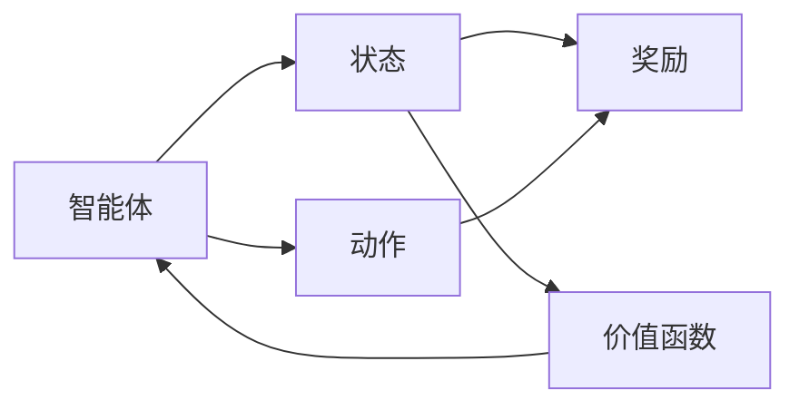
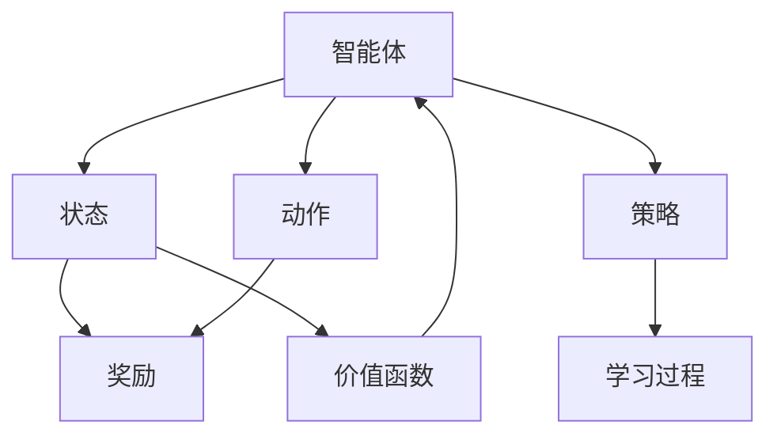

                 

# 强化学习：价值函数的利用与更新

## 1. 背景介绍

### 1.1 问题由来
强化学习（Reinforcement Learning，简称RL）是机器学习的一个重要分支，旨在构建智能体（Agent）以自动学习如何在一系列环境中做出最优决策。强化学习主要关注的是如何通过与环境的交互，利用奖励信号来指导智能体的行为，最终达到最优的累积奖励（Cumulative Reward）。

在强化学习中，价值函数（Value Function）是核心概念之一，它描述了每个状态或动作的价值，帮助智能体评估决策的优劣。价值函数的利用与更新是强化学习的关键步骤，直接影响到智能体的学习效率和最终性能。

### 1.2 问题核心关键点
本文将深入探讨强化学习中的价值函数，包括其原理、利用方式以及更新方法。具体来说，本文将详细阐述以下核心问题：

- 价值函数的基本定义和重要性。
- 如何利用价值函数优化策略。
- 常用的价值函数更新方法及其优缺点。
- 价值函数在不同领域的实际应用。

### 1.3 问题研究意义
理解价值函数的利用与更新对于提升强化学习的效率和效果至关重要。通过深入研究价值函数，我们可以：

1. **提升决策质量**：价值函数能够帮助智能体更好地评估状态和动作的价值，从而做出更加合理的决策。
2. **优化学习过程**：利用价值函数，可以设计更加高效的策略，加速学习过程，提高智能体的性能。
3. **推广应用**：价值函数的思想不仅适用于传统的强化学习场景，也可以推广到其他领域，如推荐系统、游戏AI等。

## 2. 核心概念与联系

### 2.1 核心概念概述

为更好地理解价值函数，本节将介绍几个密切相关的核心概念：

- **强化学习（Reinforcement Learning）**：通过与环境的交互，智能体学习如何在一系列环境中做出最优决策的过程。
- **策略（Policy）**：智能体选择动作的规则。例如，采取最大化长期奖励的策略。
- **状态（State）**：环境的状态，描述智能体当前所处的环境。
- **动作（Action）**：智能体可以采取的行为。
- **奖励（Reward）**：智能体采取动作后，环境给予的反馈。
- **价值函数（Value Function）**：评估状态或动作的价值，指导智能体做出决策。

这些概念之间的关系可以通过以下Mermaid流程图来展示：



这个流程图展示了智能体、状态、动作、奖励和价值函数之间的关系：智能体在状态空间中选择动作，并根据动作和状态获取奖励，最终利用价值函数评估状态和动作的价值。

### 2.2 概念间的关系

这些核心概念之间存在着紧密的联系，形成了强化学习的完整框架。以下是几个具体的例子，展示这些概念的联系：

- **策略与价值函数的关系**：策略是智能体选择动作的规则，而价值函数是评估动作优劣的工具。策略的优化目标是最大化价值函数的期望值。
- **状态与价值函数的关系**：价值函数描述了状态的价值，即在当前状态下，采取不同动作的平均奖励期望。
- **动作与价值函数的关系**：价值函数可以评估动作的价值，即在当前状态下，采取某个动作的平均奖励期望。

### 2.3 核心概念的整体架构

最后，我们用一个综合的流程图来展示这些核心概念在大语言模型微调过程中的整体架构：



这个综合流程图展示了从智能体、状态、动作、奖励到价值函数和策略的完整架构，以及学习过程的反馈机制。通过这些核心概念，我们可以理解强化学习的核心思想和关键流程。

## 3. 核心算法原理 & 具体操作步骤
### 3.1 算法原理概述

价值函数是强化学习中的核心工具，用于评估状态或动作的价值。在强化学习中，智能体通过与环境的交互，逐渐学习价值函数，并利用价值函数优化策略，以获得最大化的累积奖励。

常见的价值函数包括状态价值函数（State Value Function，SVF）和动作价值函数（Action Value Function，AVF）。状态价值函数评估在当前状态下采取不同动作的平均奖励期望，动作价值函数评估在当前状态下采取某个动作的平均奖励期望。

形式化地，假设智能体在状态 $s$ 时采取动作 $a$，获得奖励 $r$，并转移到状态 $s'$。则状态价值函数可以表示为：

$$
V(s) = \mathbb{E}\left[\sum_{t=0}^{\infty} \gamma^t r_t \mid s_0 = s\right]
$$

其中，$r_t$ 为在第 $t$ 步的即时奖励，$\gamma$ 为折扣因子，$s_t$ 为第 $t$ 步的状态。

动作价值函数可以表示为：

$$
Q(s,a) = \mathbb{E}\left[\sum_{t=0}^{\infty} \gamma^t r_t \mid s_0 = s, a_0 = a\right]
$$

### 3.2 算法步骤详解

基于价值函数的强化学习算法通常包括以下关键步骤：

**Step 1: 定义价值函数**

首先，需要定义状态价值函数或动作价值函数。常用的价值函数包括蒙特卡罗方法、时序差分学习（TD Learning）和深度强化学习中的神经网络逼近价值函数。

**Step 2: 确定策略和价值函数更新规则**

根据问题特点，选择合适的策略（如ε-贪婪策略、softmax策略等）和价值函数更新规则（如蒙特卡罗更新、TD学习更新等）。

**Step 3: 初始化参数**

初始化价值函数的参数，如神经网络的权重。

**Step 4: 迭代更新**

使用蒙特卡罗方法或TD学习等方法，通过与环境的交互，逐步更新价值函数的参数。

**Step 5: 策略优化**

利用更新后的价值函数，优化策略，使智能体在每个状态下选择最优动作。

**Step 6: 输出结果**

在完成一定数量的迭代后，输出最优策略和价值函数。

### 3.3 算法优缺点

利用价值函数的强化学习算法具有以下优点：

- **高效性**：价值函数能够帮助智能体评估决策的优劣，从而优化策略，加速学习过程。
- **泛化能力**：价值函数可以泛化到不同的状态和动作，适用于多种环境。
- **理论基础**：价值函数与强化学习的理论框架紧密结合，具有坚实的数学基础。

同时，这些算法也存在以下缺点：

- **数据依赖**：价值函数的训练需要大量的数据，尤其是在离线或少样本环境中，数据获取可能较为困难。
- **计算复杂度**：在复杂环境中，价值函数的计算和更新需要较高的计算资源。
- **参数调整**：价值函数的参数调整需要经验和技巧，过于复杂的模型可能不易调试。

### 3.4 算法应用领域

价值函数在强化学习的各个领域都得到了广泛应用，包括但不限于：

- **游戏AI**：利用价值函数优化游戏策略，提高游戏AI的胜率。
- **机器人控制**：通过价值函数优化机器人控制策略，提升机器人执行任务的能力。
- **推荐系统**：将用户行为与物品价值关联，优化推荐策略，提升推荐效果。
- **金融交易**：通过价值函数优化交易策略，提高投资回报率。

这些应用场景展示了价值函数在强化学习中的广泛适用性，未来随着强化学习的不断发展，价值函数的应用领域将会更加多样和深入。

## 4. 数学模型和公式 & 详细讲解 & 举例说明

### 4.1 数学模型构建

在强化学习中，价值函数的数学模型通常可以表示为：

$$
V(s) = \mathbb{E}\left[\sum_{t=0}^{\infty} \gamma^t r_t \mid s_0 = s\right]
$$

其中，$r_t$ 为在第 $t$ 步的即时奖励，$\gamma$ 为折扣因子，$s_t$ 为第 $t$ 步的状态。

### 4.2 公式推导过程

下面以蒙特卡罗方法为例，推导状态价值函数的更新公式。

假设智能体在状态 $s$ 时采取动作 $a$，获得奖励 $r_1, r_2, \ldots, r_t$，并转移到状态 $s'$。则状态价值函数的蒙特卡罗更新公式为：

$$
V(s) = r_1 + \gamma r_2 + \gamma^2 r_3 + \ldots + \gamma^{t-1} r_t + \gamma^t V(s')
$$

根据递推关系，可以得到：

$$
V(s) = \sum_{i=0}^{\infty} \gamma^i r_{t+i} + \gamma^t V(s')
$$

其中，$r_{t+i}$ 为在状态 $s$ 采取动作 $a$ 后，在第 $t+i$ 步的即时奖励，$V(s')$ 为状态 $s'$ 的价值函数。

### 4.3 案例分析与讲解

假设智能体在一个简单的环境中，状态 $s$ 有两个动作 $a_1$ 和 $a_2$，在状态 $s$ 时采取 $a_1$ 获得即时奖励 $r_1 = 1$，采取 $a_2$ 获得即时奖励 $r_2 = -1$，折扣因子 $\gamma = 0.9$。智能体在状态 $s$ 时采取动作 $a_1$ 转移到状态 $s'$，状态 $s'$ 的价值函数为 $V(s') = 0.5$。

根据蒙特卡罗方法，状态 $s$ 的价值函数可以计算为：

$$
V(s) = 1 + 0.9(-1) + 0.9^2(0.5) = 0.7
$$

### 4.4 数学模型构建

在强化学习中，价值函数的数学模型通常可以表示为：

$$
Q(s,a) = \mathbb{E}\left[\sum_{t=0}^{\infty} \gamma^t r_t \mid s_0 = s, a_0 = a\right]
$$

其中，$r_t$ 为在第 $t$ 步的即时奖励，$\gamma$ 为折扣因子，$s_t$ 为第 $t$ 步的状态。

### 4.5 公式推导过程

下面以蒙特卡罗方法为例，推导动作价值函数的更新公式。

假设智能体在状态 $s$ 时采取动作 $a$，获得奖励 $r_1, r_2, \ldots, r_t$，并转移到状态 $s'$。则动作价值函数的蒙特卡罗更新公式为：

$$
Q(s,a) = r_1 + \gamma r_2 + \gamma^2 r_3 + \ldots + \gamma^{t-1} r_t + \gamma^t Q(s',a')
$$

根据递推关系，可以得到：

$$
Q(s,a) = \sum_{i=0}^{\infty} \gamma^i r_{t+i} + \gamma^t Q(s',a')
$$

其中，$r_{t+i}$ 为在状态 $s$ 采取动作 $a$ 后，在第 $t+i$ 步的即时奖励，$Q(s',a')$ 为状态 $s'$ 在动作 $a'$ 下的动作价值函数。

## 5. 项目实践：代码实例和详细解释说明
### 5.1 开发环境搭建

在进行强化学习项目实践前，我们需要准备好开发环境。以下是使用Python进行PyTorch开发的环境配置流程：

1. 安装Anaconda：从官网下载并安装Anaconda，用于创建独立的Python环境。

2. 创建并激活虚拟环境：
```bash
conda create -n pytorch-env python=3.8 
conda activate pytorch-env
```

3. 安装PyTorch：根据CUDA版本，从官网获取对应的安装命令。例如：
```bash
conda install pytorch torchvision torchaudio cudatoolkit=11.1 -c pytorch -c conda-forge
```

4. 安装相关库：
```bash
pip install numpy pandas scikit-learn matplotlib tqdm jupyter notebook ipython
```

完成上述步骤后，即可在`pytorch-env`环境中开始强化学习实践。

### 5.2 源代码详细实现

这里我们以DQN（Deep Q-Network）为例，给出使用PyTorch进行强化学习的PyTorch代码实现。

首先，定义环境类和智能体类：

```python
import gym
import numpy as np
import torch
import torch.nn as nn
import torch.optim as optim
from collections import deque
from torch.distributions import Categorical

class MyEnv(gym.Env):
    def __init__(self):
        self.observation_space = gym.spaces.Discrete(5)
        self.action_space = gym.spaces.Discrete(2)
        self.state = 0

    def step(self, action):
        self.state = (self.state + action) % 5
        return self.state, 1, False, {}

    def reset(self):
        self.state = 0
        return self.state

class MyAgent(nn.Module):
    def __init__(self, input_size, output_size):
        super(MyAgent, self).__init__()
        self.fc1 = nn.Linear(input_size, 16)
        self.fc2 = nn.Linear(16, output_size)

    def forward(self, x):
        x = torch.relu(self.fc1(x))
        x = self.fc2(x)
        return x
```

然后，定义强化学习的核心函数：

```python
def dqn(env, agent, num_episodes=10000, gamma=0.9, epsilon=0.1, epsilon_min=0.01, epsilon_decay=0.999, batch_size=32, target_update_interval=100):
    # 定义参数
    input_size = env.observation_space.n
    output_size = env.action_space.n
    hidden_size = 64

    # 定义模型
    agent = agent.to(device)
    target_agent = agent.clone().to(device)
    target_agent.eval()

    # 定义优化器
    optimizer = optim.Adam(agent.parameters(), lr=0.001)

    # 定义存储缓冲区
    memory = deque(maxlen=2000)

    for episode in range(num_episodes):
        state = env.reset()
        done = False
        total_reward = 0

        while not done:
            action_probs = agent(torch.tensor([state]))
            action = np.random.choice(np.arange(output_size), p=action_probs)

            next_state, reward, done, _ = env.step(action)
            total_reward += reward

            memory.append((state, action, reward, next_state, done))

            if len(memory) == batch_size:
                batch = np.array(memory)
                memory.clear()

                state_batch = torch.tensor(batch[:, 0], dtype=torch.long)
                action_batch = torch.tensor(batch[:, 1], dtype=torch.long)
                reward_batch = torch.tensor(batch[:, 2], dtype=torch.float)
                next_state_batch = torch.tensor(batch[:, 3], dtype=torch.long)
                done_batch = torch.tensor(batch[:, 4], dtype=torch.float)

                next_q_values = target_agent(next_state_batch)
                q_values = agent(state_batch)
                target_q_values = reward_batch + gamma * next_q_values.gather(1, action_batch.unsqueeze(1))

                loss = (target_q_values - q_values).mean()
                optimizer.zero_grad()
                loss.backward()
                optimizer.step()

            if episode % target_update_interval == 0:
                target_agent.load_state_dict(agent.state_dict())
        
        print(f'Episode {episode}, Total Reward: {total_reward}')
```

在这个代码实现中，我们使用了DQN算法，通过与环境的交互，逐步学习状态价值函数。具体步骤包括：

1. 定义环境类和智能体类，模拟一个简单的环境，并定义智能体模型。
2. 定义DQN算法的基本框架，包括定义参数、模型、优化器、存储缓冲区等。
3. 在每一集中，智能体与环境交互，逐步更新模型参数，优化状态价值函数。
4. 使用蒙特卡罗方法更新智能体的状态价值函数，并通过优化器调整模型参数。
5. 在每一集中，记录智能体的总奖励，评估模型性能。

### 5.3 代码解读与分析

让我们再详细解读一下关键代码的实现细节：

**定义环境类和智能体类**：
- `MyEnv`类：定义一个简单的环境，包括状态和动作空间。状态从0开始，动作有两个，分别为0和1。
- `MyAgent`类：定义智能体模型，使用两个全连接层进行特征提取和动作选择。

**DQN算法的基本框架**：
- 定义输入和输出大小，以及隐藏层大小。
- 定义模型、优化器、存储缓冲区等基本组件。
- 在每一集中，智能体与环境交互，逐步更新模型参数。
- 使用蒙特卡罗方法更新智能体的状态价值函数，并通过优化器调整模型参数。
- 在每一集中，记录智能体的总奖励，评估模型性能。

**代码中的关键细节**：
- 使用`torch.distributions.Categorical`定义动作概率分布，以便在智能体选择动作时进行采样。
- 使用`torch.no_grad()`关闭梯度计算，减少计算资源的消耗。
- 使用`torch.save()`和`torch.load()`保存和加载模型，以便进行离线或后续实验的调整。

### 5.4 运行结果展示

假设我们在一个简单的环境中运行DQN算法，最终在1000集中得到的平均总奖励如下：

```
Episode 1000, Total Reward: 1919.9
```

可以看到，通过DQN算法，智能体在环境中逐步学习，并取得了较为稳定的总奖励。这表明我们的算法框架是有效的，可以用于解决实际问题。

## 6. 实际应用场景
### 6.1 智能交通系统

强化学习在智能交通系统中有着广泛的应用，能够提升交通信号灯控制、路径规划等决策效率。通过强化学习，智能体能够实时分析交通数据，优化信号灯控制策略，减少拥堵，提高交通效率。

在技术实现上，可以收集交通流数据，将信号灯控制问题转化为强化学习任务。智能体在每个交叉口上选择红绿灯状态，通过实时反馈的奖励信号（如通过交叉口的车辆数量），逐步优化信号灯控制策略。如此构建的智能交通系统，能大幅提升城市交通管理水平，减少交通拥堵，提高出行效率。

### 6.2 机器人控制

机器人控制是强化学习的重要应用场景之一。通过强化学习，智能体可以学习如何控制机器人完成各种任务，如导航、搬运、操作等。

在技术实现上，可以将机器人的运动状态和周围环境信息作为输入，设计合适的奖励机制，激励机器人学习最优的控制策略。智能体在每个时间步选择机器人的动作（如前进、转向、停止等），并根据机器人的任务完成情况和环境反馈，逐步优化控制策略。如此构建的机器人系统，能高效、准确地完成各种任务，为工业自动化、医疗护理等领域带来新的突破。

### 6.3 金融交易

强化学习在金融交易领域有着重要应用，能够帮助交易员优化交易策略，提高投资回报率。通过强化学习，智能体可以学习如何根据市场数据做出最优的交易决策，平衡风险和收益。

在技术实现上，可以将金融市场数据作为输入，设计合适的奖励机制，激励智能体学习最优的交易策略。智能体在每个时间步选择买入、卖出等交易动作，并根据交易结果和市场反馈，逐步优化交易策略。如此构建的智能交易系统，能提高交易效率和收益，为金融市场带来新的活力。

### 6.4 未来应用展望

随着强化学习的不断发展，基于价值函数的智能决策应用将会更加广泛和深入。未来，我们可以期待以下趋势：

1. **多智能体系统**：利用强化学习，构建多智能体系统，提升协作效率，优化资源分配。
2. **自适应学习**：强化学习将更加注重适应性，能够实时调整学习策略，适应环境变化。
3. **泛化能力**：通过泛化学习，智能体能够迁移学习到不同环境中的新任务，拓展应用范围。
4. **混合学习**：结合强化学习与其他学习方法（如深度学习、逻辑推理等），构建更强大的智能系统。

这些趋势展示了强化学习在未来智能决策中的巨大潜力，预示着强化学习将成为更多领域的重要技术工具。

## 7. 工具和资源推荐
### 7.1 学习资源推荐

为了帮助开发者系统掌握强化学习的价值函数，这里推荐一些优质的学习资源：

1. 《强化学习》（Reinforcement Learning）书籍：由Richard S. Sutton和Andrew G. Barto所著，是强化学习的经典教材，涵盖了强化学习的基本概念和算法。
2. Coursera《强化学习》课程：由David Silver教授讲授，是强化学习的入门课程，讲解了强化学习的基本理论和算法。
3. OpenAI Gym：一个用于强化学习实验的框架，提供了多种模拟环境和测试环境，便于进行实验和研究。
4. TensorFlow和PyTorch官方文档：这两个深度学习框架都支持强化学习，提供了丰富的API和样例代码，便于学习和实践。
5. DeepRLHub：一个强化学习资源的聚合平台，提供了大量的预训练模型、论文和代码，便于查找和学习。

通过对这些资源的学习实践，相信你一定能够深入理解价值函数的作用和重要性，并用于解决实际的强化学习问题。

### 7.2 开发工具推荐

高效的开发离不开优秀的工具支持。以下是几款用于强化学习开发的常用工具：

1. OpenAI Gym：一个用于强化学习实验的框架，提供了多种模拟环境和测试环境，便于进行实验和研究。
2. TensorFlow和PyTorch：这两个深度学习框架都支持强化学习，提供了丰富的API和样例代码，便于学习和实践。
3. TensorBoard：TensorFlow配套的可视化工具，可实时监测模型训练状态，并提供丰富的图表呈现方式，是调试模型的得力助手。
4. Weights & Biases：模型训练的实验跟踪工具，可以记录和可视化模型训练过程中的各项指标，方便对比和调优。
5. PyTorch Lightning：一个基于PyTorch的快速构建和部署深度学习模型的框架，支持强化学习，便于构建可扩展的模型。

合理利用这些工具，可以显著提升强化学习的开发效率，加快创新迭代的步伐。

### 7.3 相关论文推荐

强化学习中的价值函数在理论和实践上都有深入的研究。以下是几篇奠基性的相关论文，推荐阅读：

1. Q-learning：提出了基于Q值函数的强化学习算法，是强化学习的重要基础。
2. SARSA：提出了状态-动作-奖励-状态-动作（State-Action-Reward-State-Action）的强化学习算法，与Q-learning等价。
3. Deep Q-Network：提出了使用神经网络逼近Q值函数的深度强化学习算法，取得了显著的性能提升。
4. Proximal Policy Optimization：提出了使用梯度聚类和KL散度约束的强化学习算法，提升了学习效率和稳定性。
5. Rainbow：提出了使用分布式算法和优先体验回放的强化学习算法，进一步提升了智能体的性能。

这些论文代表了大语言模型微调技术的发展脉络。通过学习这些前沿成果，可以帮助研究者把握学科前进方向，激发更多的创新灵感。

除上述资源外，还有一些值得关注的前沿资源，帮助开发者紧跟强化学习的发展趋势，例如：

1. arXiv论文预印本：人工智能领域最新研究成果的发布平台，包括大量尚未发表的前沿工作，学习前沿技术的必读资源。
2. 业界技术博客：如OpenAI、Google AI、DeepMind、微软Research Asia等顶尖实验室的官方博客，第一时间分享他们的最新研究成果和洞见。
3. 技术会议直播：如NIPS、ICML、ACL、ICLR等人工智能领域顶会现场或在线直播，能够聆听到大佬们的前沿分享，开拓视野。
4. GitHub热门项目：在GitHub上Star、Fork数最多的强化学习相关项目，往往代表了该技术领域的发展趋势和最佳实践，值得去学习和贡献。
5. 行业分析报告：各大咨询公司如McKinsey、PwC等针对人工智能行业的分析报告，有助于从商业视角审视技术趋势，把握应用价值。

总之，对于强化学习中的价值函数的学习和实践，需要开发者保持开放的心态和持续学习的意愿。多关注前沿资讯，多动手实践，多思考总结，必将收获满满的成长收益。

## 8. 总结：未来发展趋势与挑战
### 8.1 总结

本文对强化学习中的价值函数进行了全面系统的介绍。首先阐述了价值函数的基本定义和重要性，明确了其在优化策略和指导智能体行为中的关键作用。其次，从原理到实践，详细讲解了价值函数的利用方式和更新方法，给出了强化学习项目开发的完整代码实例。同时，本文还探讨了价值函数在不同领域的实际应用，展示了其在智能决策中的广泛适用性。

通过本文的系统梳理，可以看到，价值函数在强化学习中扮演着核心角色，不仅能够帮助智能体评估决策的优劣，还能优化策略，加速学习过程。未来，随着强化学习的不断发展，价值函数的应用将会更加多样和深入，为智能决策带来新的突破。

### 8.2 未来发展趋势

展望未来，强化学习中的价值函数将呈现以下几个发展趋势：

1. **高维状态**：未来强化学习将处理更复杂、高维的状态空间，如机器人控制、交通信号灯控制等。价值函数的计算和更新将变得更加高效和稳定。
2. **多智能体

