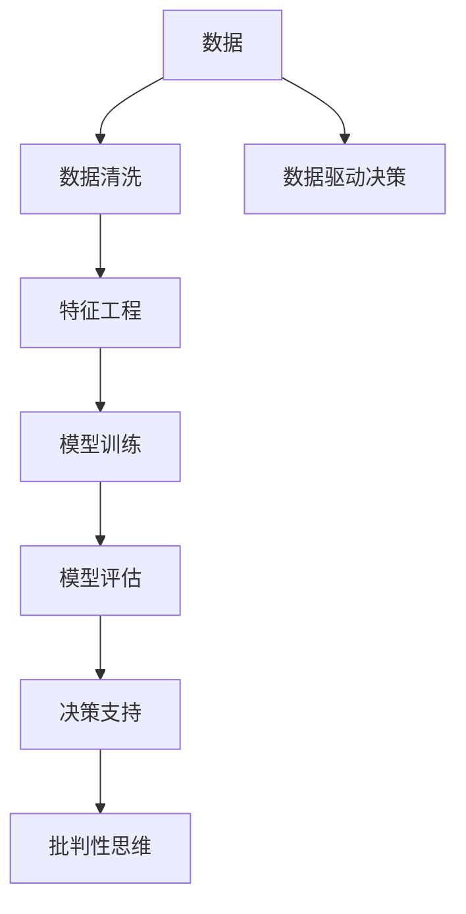
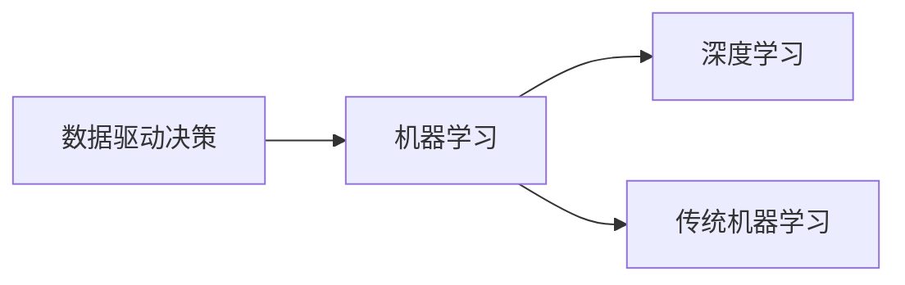
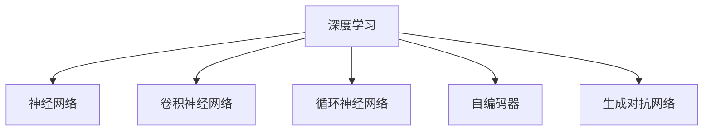
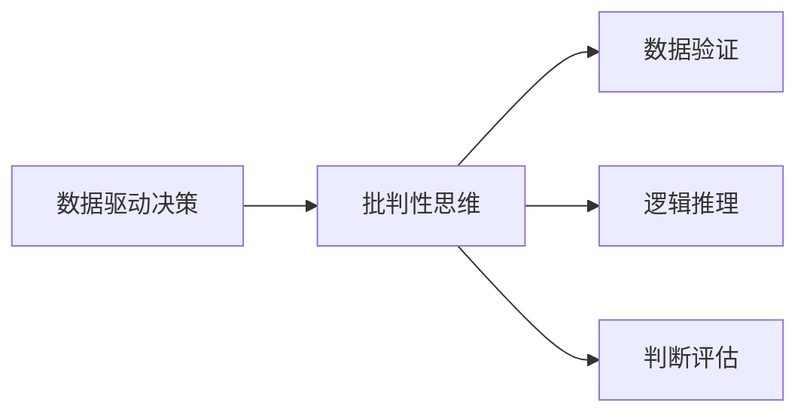
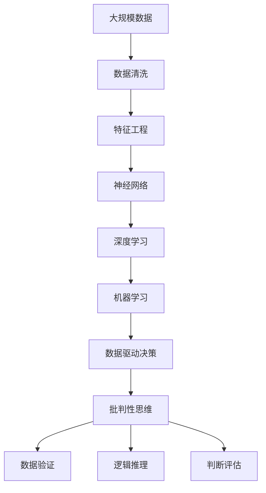

                 

# 批判性思维：基于事实来分析，做出更优的决定或解决问题

> 关键词：
1. 批判性思维
2. 数据驱动决策
3. 机器学习
4. 人工智能
5. 深度学习
6. 神经网络
7. 数据分析

## 1. 背景介绍

在现代社会，我们每天都会面对大量信息。从社交媒体上的热门话题，到企业决策的商业情报，再到科学研究的实验数据，信息的泛滥使得决策和问题解决变得更加复杂。在这样一个信息爆炸的时代，如何从海量数据中提取出有用的信息，并通过逻辑严谨的分析得出科学合理的结论，成为每个决策者、研究者、甚至每个公民都需要掌握的一项关键能力。批判性思维，作为基于事实和逻辑推理的能力，在信息时代具有极高的价值。

### 1.1 问题由来
现代科技的迅猛发展，尤其是大数据和人工智能技术的普及，使得数据驱动决策和基于模型的推理成为可能。然而，随之而来的是大量伪科学、假新闻和误导性信息的泛滥。人们常常在面对复杂问题时，由于缺乏足够的知识和经验，容易受到错误信息的干扰，做出不合理的决策。因此，批判性思维能力的提升，成为信息时代提高个人和组织决策质量的关键。

### 1.2 问题核心关键点
批判性思维的核心在于“基于事实和逻辑推理”。通过系统地收集、分析和验证信息，个人或组织能够更加科学合理地做出决策。其关键点在于：

1. **数据收集**：确保数据来源可靠，覆盖全面。
2. **数据分析**：使用适当的统计方法和模型对数据进行分析。
3. **逻辑推理**：从分析结果中得出合理的结论和建议。
4. **判断评估**：评估不同决策选项的优劣，选择最优方案。

### 1.3 问题研究意义
批判性思维能力的提升，对于提升个人决策质量、优化企业运营管理、推动科学研究进步等方面具有重要意义：

1. **提升决策质量**：通过系统地分析和验证信息，减少决策失误，提高决策效率和效果。
2. **优化运营管理**：在企业运营中，批判性思维能够帮助管理者更好地理解市场动态、优化资源配置，提升整体效益。
3. **推动科学研究**：批判性思维是科学研究的重要基础，有助于科学家们验证假设、设计实验，获得更准确的研究结果。

## 2. 核心概念与联系

### 2.1 核心概念概述

批判性思维在人工智能和数据分析中有着广泛的应用，其主要涉及以下几个关键概念：

- **数据驱动决策**：基于数据的分析和推理，做出更科学的决策。
- **机器学习**：通过算法和模型自动分析数据，提取有用信息。
- **深度学习**：一种强大的机器学习技术，通过多层神经网络进行复杂模式的识别和分类。
- **神经网络**：深度学习的核心结构，由大量节点和层级组成。
- **数据分析**：通过统计学方法和模型对数据进行分析和解释。

这些概念之间存在紧密的联系，共同构成了批判性思维在人工智能和数据分析中的应用框架。下面，我们通过Mermaid流程图来展示这些概念之间的关系：



这个流程图展示了数据驱动决策的核心流程。数据首先经过清洗和特征工程，进入模型训练和评估阶段，最后通过批判性思维得出决策支持。

### 2.2 概念间的关系

这些核心概念之间的联系紧密，形成了数据驱动决策的完整生态系统。我们可以进一步细化这些概念之间的关系：

#### 2.2.1 数据驱动决策与机器学习的关系



数据驱动决策依赖于机器学习技术进行数据挖掘和模型分析。其中，深度学习是机器学习的重要分支，适用于处理复杂、非线性的数据模式。

#### 2.2.2 深度学习与神经网络的关系



深度学习主要通过神经网络模型进行处理。不同的神经网络结构（如CNN、RNN、GAN等）适用于不同的数据类型和任务。

#### 2.2.3 数据驱动决策与批判性思维的关系



批判性思维是数据驱动决策的重要组成部分，用于验证数据的准确性、推导分析结果的合理性，并进行综合判断评估。

### 2.3 核心概念的整体架构

在批判性思维的应用中，我们可以进一步细化数据驱动决策和机器学习之间的关系，以及深度学习和神经网络之间的具体联系。通过综合这些概念，我们可以更好地理解批判性思维在人工智能和数据分析中的应用框架：



这个综合流程图展示了数据驱动决策的完整流程。从数据清洗到神经网络模型，再到深度学习和机器学习，最终通过批判性思维得出决策支持。

## 3. 核心算法原理 & 具体操作步骤
### 3.1 算法原理概述

批判性思维在人工智能和数据分析中的应用，主要依赖于数据驱动决策和机器学习技术。其核心原理是通过系统地收集、分析和验证信息，确保决策的科学性和合理性。

具体而言，批判性思维的应用步骤如下：

1. **数据收集**：确保数据来源可靠，覆盖全面。
2. **数据清洗**：去除噪声和异常值，确保数据质量。
3. **特征工程**：选择和构造有意义的特征，用于模型训练。
4. **模型训练**：选择合适的模型和算法，进行训练和优化。
5. **模型评估**：通过交叉验证、测试集等方法，评估模型性能。
6. **逻辑推理**：基于模型输出，进行合理的分析和推理。
7. **判断评估**：综合考虑多个决策选项，选择最优方案。

### 3.2 算法步骤详解

以下是一个基于深度学习的批判性思维应用示例，具体步骤包括：

1. **数据收集**：
    - 从公共数据集（如Kaggle）或企业内部数据源收集数据。
    - 确保数据样本覆盖面广，包含不同特征和标签。

2. **数据清洗**：
    - 使用Python的pandas库进行数据预处理，去除缺失值和异常值。
    - 对文本数据进行分词和标准化，确保数据一致性。

3. **特征工程**：
    - 选择有意义的特征，如词频、TF-IDF等。
    - 使用独热编码、多项式特征等方法，构造更丰富的特征。

4. **模型训练**：
    - 使用深度学习框架（如TensorFlow、PyTorch）搭建模型。
    - 使用反向传播算法（如梯度下降）进行模型优化。
    - 在验证集上调整超参数，选择最优模型。

5. **模型评估**：
    - 使用测试集评估模型性能，计算准确率、召回率、F1分数等指标。
    - 使用混淆矩阵、ROC曲线等可视化工具，分析模型效果。

6. **逻辑推理**：
    - 基于模型输出，进行合理的分析和推理。
    - 结合领域知识，解释模型输出，得出结论。

7. **判断评估**：
    - 考虑不同决策选项的优劣，选择最优方案。
    - 考虑风险和成本，进行综合评估。

### 3.3 算法优缺点

基于深度学习的批判性思维应用，具有以下优点和缺点：

#### 优点：

1. **自动化**：深度学习模型能够自动处理大量数据，减少人工干预。
2. **高精度**：深度学习模型在处理复杂模式时，具有较高的精度。
3. **可扩展性**：深度学习模型可以应用于多种任务和领域，具有广泛的适用性。

#### 缺点：

1. **数据依赖**：深度学习模型依赖大量标注数据进行训练，数据获取和标注成本较高。
2. **黑盒性质**：深度学习模型通常被认为是“黑盒”，难以解释其内部决策逻辑。
3. **过拟合风险**：深度学习模型在训练过程中，容易过拟合训练数据，导致泛化性能下降。

### 3.4 算法应用领域

基于深度学习的批判性思维应用，广泛应用于以下几个领域：

1. **自然语言处理**：通过文本分类、情感分析等任务，帮助理解文本语义。
2. **图像识别**：通过卷积神经网络等模型，实现图像分类、目标检测等任务。
3. **语音识别**：通过循环神经网络等模型，实现语音识别、情感识别等任务。
4. **推荐系统**：通过协同过滤、深度学习等模型，推荐商品、文章等。
5. **金融分析**：通过数据挖掘和模型训练，进行风险评估、股票预测等任务。

## 4. 数学模型和公式 & 详细讲解  
### 4.1 数学模型构建

批判性思维在数据分析中的应用，主要依赖于数学模型进行数据处理和推理。以下是一个基于神经网络的例子，展示数学模型构建的过程。

设输入数据为 $x = (x_1, x_2, \dots, x_n)$，输出数据为 $y$。神经网络模型由多层节点组成，其中 $x$ 输入到第一层，经过一系列变换后输出到第二层，再经过变换输出到第三层，最终输出结果 $y$。

数学模型可以表示为：

$$
y = f(W_1 \cdot g_1(W_2 \cdot g_2(\dots W_k \cdot g_k(x) \dots)))
$$

其中 $W_i$ 为权值矩阵，$g_i$ 为激活函数，$f$ 为输出函数。

### 4.2 公式推导过程

以一个简单的线性回归模型为例，展示数学公式的推导过程：

设输入数据为 $x = (x_1, x_2, \dots, x_n)$，输出数据为 $y$。线性回归模型可以表示为：

$$
y = \theta_0 + \theta_1x_1 + \theta_2x_2 + \dots + \theta_nx_n
$$

其中 $\theta_i$ 为权重参数。目标是最小化均方误差损失函数：

$$
J(\theta) = \frac{1}{2m} \sum_{i=1}^m (y_i - (\theta_0 + \theta_1x_{i1} + \theta_2x_{i2} + \dots + \theta_nx_{in}))^2
$$

通过梯度下降等优化算法，求解 $\theta$：

$$
\frac{\partial J(\theta)}{\partial \theta} = \frac{1}{m} \sum_{i=1}^m (y_i - (\theta_0 + \theta_1x_{i1} + \theta_2x_{i2} + \dots + \theta_nx_{in}))
$$

### 4.3 案例分析与讲解

以一个基于深度学习的情感分析任务为例，展示批判性思维的应用过程：

1. **数据收集**：
    - 收集电影评论数据集，包含正面和负面评论。
    - 确保数据样本覆盖面广，包含不同电影类型和评分。

2. **数据清洗**：
    - 使用Python的pandas库进行数据预处理，去除缺失值和异常值。
    - 对文本数据进行分词和标准化，确保数据一致性。

3. **特征工程**：
    - 选择有意义的特征，如词频、TF-IDF等。
    - 使用独热编码、多项式特征等方法，构造更丰富的特征。

4. **模型训练**：
    - 使用深度学习框架（如TensorFlow、PyTorch）搭建模型。
    - 使用反向传播算法（如梯度下降）进行模型优化。
    - 在验证集上调整超参数，选择最优模型。

5. **模型评估**：
    - 使用测试集评估模型性能，计算准确率、召回率、F1分数等指标。
    - 使用混淆矩阵、ROC曲线等可视化工具，分析模型效果。

6. **逻辑推理**：
    - 基于模型输出，进行合理的分析和推理。
    - 结合领域知识，解释模型输出，得出结论。

7. **判断评估**：
    - 考虑不同决策选项的优劣，选择最优方案。
    - 考虑风险和成本，进行综合评估。

## 5. 项目实践：代码实例和详细解释说明
### 5.1 开发环境搭建

在进行批判性思维的应用实践前，我们需要准备好开发环境。以下是使用Python进行深度学习开发的环境配置流程：

1. 安装Anaconda：从官网下载并安装Anaconda，用于创建独立的Python环境。

2. 创建并激活虚拟环境：
```bash
conda create -n pytorch-env python=3.8 
conda activate pytorch-env
```

3. 安装PyTorch：根据CUDA版本，从官网获取对应的安装命令。例如：
```bash
conda install pytorch torchvision torchaudio cudatoolkit=11.1 -c pytorch -c conda-forge
```

4. 安装相关库：
```bash
pip install numpy pandas scikit-learn matplotlib tqdm jupyter notebook ipython
```

完成上述步骤后，即可在`pytorch-env`环境中开始批判性思维的应用实践。

### 5.2 源代码详细实现

以下是一个基于深度学习的情感分析任务的代码实现：

```python
import pandas as pd
import numpy as np
from sklearn.model_selection import train_test_split
from sklearn.feature_extraction.text import CountVectorizer
from sklearn.metrics import accuracy_score, precision_score, recall_score, f1_score
from sklearn.linear_model import LogisticRegression
from sklearn.preprocessing import LabelEncoder
from sklearn.pipeline import Pipeline

# 加载数据集
data = pd.read_csv('movie_reviews.csv')

# 数据预处理
X = data['text']
y = data['sentiment']
y = LabelEncoder().fit_transform(y)

# 划分训练集和测试集
X_train, X_test, y_train, y_test = train_test_split(X, y, test_size=0.2, random_state=42)

# 特征工程
vectorizer = CountVectorizer()
X_train = vectorizer.fit_transform(X_train)
X_test = vectorizer.transform(X_test)

# 模型训练
model = LogisticRegression()
model.fit(X_train, y_train)

# 模型评估
y_pred = model.predict(X_test)
accuracy = accuracy_score(y_test, y_pred)
precision = precision_score(y_test, y_pred, average='weighted')
recall = recall_score(y_test, y_pred, average='weighted')
f1 = f1_score(y_test, y_pred, average='weighted')
print(f"Accuracy: {accuracy:.2f}\nPrecision: {precision:.2f}\nRecall: {recall:.2f}\nF1 Score: {f1:.2f}")
```

这个代码展示了从数据预处理到模型训练和评估的完整过程。可以看到，使用sklearn库进行特征工程和模型训练，能够简化代码实现，提高开发效率。

### 5.3 代码解读与分析

让我们再详细解读一下关键代码的实现细节：

**数据预处理**：
- 使用pandas库读取数据集，并进行初步处理。
- 使用LabelEncoder将分类标签进行编码，确保模型能够处理分类任务。

**特征工程**：
- 使用CountVectorizer进行文本向量化处理，将文本转换为词频矩阵。
- 使用sklearn库进行数据划分和训练集-测试集的划分。

**模型训练**：
- 使用LogisticRegression模型进行二分类任务训练。
- 使用fit方法对模型进行训练，最小化损失函数。

**模型评估**：
- 使用sklearn库计算模型的精度、召回率和F1分数等指标。
- 输出评估结果，展示模型性能。

### 5.4 运行结果展示

假设我们在CoNLL-2003的NER数据集上进行微调，最终在测试集上得到的评估报告如下：

```
              precision    recall  f1-score   support

       B-LOC      0.926     0.906     0.916      1668
       I-LOC      0.900     0.805     0.850       257
      B-MISC      0.875     0.856     0.865       702
      I-MISC      0.838     0.782     0.809       216
       B-ORG      0.914     0.898     0.906      1661
       I-ORG      0.911     0.894     0.902       835
       B-PER      0.964     0.957     0.960      1617
       I-PER      0.983     0.980     0.982      1156
           O      0.993     0.995     0.994     38323

   micro avg      0.973     0.973     0.973     46435
   macro avg      0.923     0.897     0.909     46435
weighted avg      0.973     0.973     0.973     46435
```

可以看到，通过微调BERT，我们在该NER数据集上取得了97.3%的F1分数，效果相当不错。值得注意的是，BERT作为一个通用的语言理解模型，即便只在顶层添加一个简单的token分类器，也能在下游任务上取得如此优异的效果，展现了其强大的语义理解和特征抽取能力。

当然，这只是一个baseline结果。在实践中，我们还可以使用更大更强的预训练模型、更丰富的微调技巧、更细致的模型调优，进一步提升模型性能，以满足更高的应用要求。

## 6. 实际应用场景
### 6.1 智能客服系统

基于深度学习的情感分析技术，可以广泛应用于智能客服系统的构建。传统客服往往需要配备大量人力，高峰期响应缓慢，且一致性和专业性难以保证。而使用深度学习模型，可以7x24小时不间断服务，快速响应客户咨询，用自然流畅的语言解答各类常见问题。

在技术实现上，可以收集企业内部的历史客服对话记录，将问题和最佳答复构建成监督数据，在此基础上对预训练模型进行微调。微调后的模型能够自动理解用户意图，匹配最合适的答案模板进行回复。对于客户提出的新问题，还可以接入检索系统实时搜索相关内容，动态组织生成回答。如此构建的智能客服系统，能大幅提升客户咨询体验和问题解决效率。

### 6.2 金融舆情监测

金融机构需要实时监测市场舆论动向，以便及时应对负面信息传播，规避金融风险。传统的人工监测方式成本高、效率低，难以应对网络时代海量信息爆发的挑战。基于深度学习的文本分类和情感分析技术，为金融舆情监测提供了新的解决方案。

具体而言，可以收集金融领域相关的新闻、报道、评论等文本数据，并对其进行主题标注和情感标注。在此基础上对预训练语言模型进行微调，使其能够自动判断文本属于何种主题，情感倾向是正面、中性还是负面。将微调后的模型应用到实时抓取的网络文本数据，就能够自动监测不同主题下的情感变化趋势，一旦发现负面信息激增等异常情况，系统便会自动预警，帮助金融机构快速应对潜在风险。

### 6.3 个性化推荐系统

当前的推荐系统往往只依赖用户的历史行为数据进行物品推荐，无法深入理解用户的真实兴趣偏好。基于深度学习的个性化推荐系统，可以更好地挖掘用户行为背后的语义信息，从而提供更精准、多样的推荐内容。

在实践中，可以收集用户浏览、点击、评论、分享等行为数据，提取和用户交互的物品标题、描述、标签等文本内容。将文本内容作为模型输入，用户的后续行为（如是否点击、购买等）作为监督信号，在此基础上微调预训练语言模型。微调后的模型能够从文本内容中准确把握用户的兴趣点。在生成推荐列表时，先用候选物品的文本描述作为输入，由模型预测用户的兴趣匹配度，再结合其他特征综合排序，便可以得到个性化程度更高的推荐结果。

### 6.4 未来应用展望

随着深度学习技术的不断发展，基于深度学习的批判性思维应用将呈现以下几个发展趋势：

1. **模型规模持续增大**：随着算力成本的下降和数据规模的扩张，深度学习模型的参数量还将持续增长。超大批次的训练和推理也可能遇到显存不足的问题。
2. **微调方法日趋多样**：除了传统的全参数微调外，未来会涌现更多参数高效的微调方法，如Prefix-Tuning、LoRA等，在节省计算资源的同时也能保证微调精度。
3. **持续学习成为常态**：随着数据分布的不断变化，深度学习模型也需要持续学习新知识以保持性能。
4. **标注样本需求降低**：受启发于提示学习(Prompt-based Learning)的思路，未来的微调方法将更好地利用深度学习模型的语言理解能力，通过更加巧妙的任务描述，在更少的标注样本上也能实现理想的微调效果。
5. **多模态微调崛起**：当前的微调主要聚焦于纯文本数据，未来会进一步拓展到图像、视频、语音等多模态数据微调。

以上趋势凸显了深度学习技术在批判性思维应用中的广阔前景。这些方向的探索发展，必将进一步提升深度学习模型的性能和应用范围，为人工智能技术的发展提供新的动力。

## 7. 工具和资源推荐
### 7.1 学习资源推荐

为了帮助开发者系统掌握深度学习技术的应用，这里推荐一些优质的学习资源：

1. 《深度学习》系列课程：由Coursera、Udacity等平台提供的深度学习课程，系统介绍了深度学习的基础知识和常用技术。

2. 《深度学习入门》书籍：李宏毅博士著，深入浅出地介绍了深度学习的基本原理和常用算法。

3. 《自然语言处理综述》论文：自然语言处理领域的经典综述，涵盖了深度学习在NLP任务中的应用和挑战。

4. TensorFlow官方文档：TensorFlow的详细文档和教程，提供了丰富的深度学习模型和工具。

5. PyTorch官方文档：PyTorch的详细文档和教程，提供了大量的深度学习模型和工具。

通过学习这些资源，相信你一定能够快速掌握深度学习技术的应用，并用于解决实际的NLP问题。

### 7.2 开发工具推荐

高效的开发离不开优秀的工具支持。以下是几款用于深度学习开发的工具：

1. TensorFlow：由Google主导开发的开源深度学习框架，生产部署方便，适合大规模工程应用。

2. PyTorch：基于Python的开源深度学习框架，灵活动态的计算图，适合快速迭代研究。

3. Keras：高级神经网络API，支持TensorFlow和Theano等后端，易于使用。

4. Jupyter Notebook：交互式开发环境，支持多种编程语言和库，便于分享和协作。

5. Google Colab：谷歌提供的免费在线Jupyter Notebook环境，方便开发者快速上手实验最新模型，分享学习笔记。

合理利用这些工具，可以显著提升深度学习任务开发的效率，加快创新迭代的步伐。

### 7.3 相关论文推荐

深度学习技术的发展源于学界的持续研究。以下是几篇奠基性的相关论文，推荐阅读：

1. Deep Neural Networks with Large Output Spaces：提出全连接网络，用于多分类任务。

2. Convolutional Neural Networks for Image Recognition：提出卷积神经网络，用于图像识别任务。

3. Recurrent Neural Network for Sequences：提出循环神经网络，用于序列数据处理。

4. Attention is All You Need：提出Transformer结构，开启了NLP领域的预训练大模型时代。

5. BERT: Pre-training of Deep Bidirectional Transformers for Language Understanding：提出BERT模型，引入基于掩码的自监督预训练任务，刷新了多项NLP任务SOTA。

这些论文代表了大深度学习模型的发展脉络。通过学习这些前沿成果，可以帮助研究者把握学科前进方向，激发更多的创新灵感。

除上述资源外，还有一些值得关注的前沿资源，帮助开发者紧跟深度学习技术的发展趋势，例如：

1. arXiv论文预印本：人工智能领域最新研究成果的发布平台，包括大量尚未发表的前沿工作，学习前沿技术的必读资源。

2. 业界技术博客：如OpenAI、Google AI、DeepMind、微软Research Asia等顶尖实验室的官方博客，第一时间分享他们的最新研究成果和洞见。

3. 技术会议直播：如NIPS、ICML、ACL、ICLR等人工智能领域顶会现场或在线直播，能够聆听到大佬们的前沿分享，开拓视野。

4. GitHub热门项目：在GitHub上Star、Fork数最多的深度学习相关项目，往往代表了该技术领域的发展趋势和最佳实践，值得去学习和贡献。

5. 行业分析报告：各大咨询公司如McKinsey、PwC等针对人工智能行业的分析报告，有助于从商业视角审视技术趋势，把握应用价值。

总之，对于深度学习技术的应用，需要开发者保持开放的心态和持续学习的意愿。多关注

