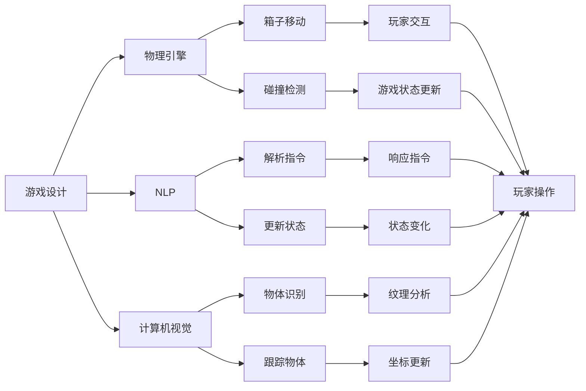

                 

# 推箱子游戏的设计与实现

> 关键词：推箱子游戏，人工智能，自然语言处理(NLP)，计算机视觉，游戏设计，Python编程

## 1. 背景介绍

推箱子游戏（Puzzle Box Game）是一款经典的物理益智游戏，玩家需要推箱子到达指定的位置。该游戏被广泛应用于各种编程教学、人工智能和游戏设计课程中，能够帮助学生理解基本的物理原理和程序设计技巧。本文将深入探讨推箱子游戏的设计与实现，涵盖游戏逻辑、物理引擎和交互界面等方面，并结合Python编程，提供详细的代码实例和分析。

## 2. 核心概念与联系

### 2.1 核心概念概述

推箱子游戏涉及的核心概念包括游戏设计、物理引擎、自然语言处理(NLP)、计算机视觉和Python编程。以下是对这些概念的简要介绍：

- **游戏设计**：游戏设计的目的是创造一个有趣、具有挑战性的游戏体验。推箱子游戏设计需要考虑游戏规则、目标、难度和交互方式。
- **物理引擎**：物理引擎负责模拟游戏中的物理行为，如箱子移动、碰撞等。物理引擎的精确性直接影响游戏的真实感和体验。
- **自然语言处理(NLP)**：NLP技术在游戏中用于处理用户输入的自然语言指令，如“推箱子”、“向右走”等，并根据指令更新游戏状态。
- **计算机视觉**：计算机视觉技术在游戏中用于识别和跟踪箱子和其他对象，如地面的纹理、墙面的边缘等。
- **Python编程**：Python是一种高级编程语言，具有易读易写的特点，广泛用于游戏开发、数据分析和人工智能等领域。

这些核心概念之间的联系是紧密的。游戏设计决定了游戏的基本框架和体验，物理引擎提供了真实的物理行为模拟，NLP和计算机视觉技术使得玩家能够自然地与游戏交互，而Python编程则提供了实现这些技术的基础。

### 2.2 概念间的关系

以下是一个Mermaid流程图，展示了推箱子游戏中这些核心概念之间的关系：



这个流程图展示了各个概念在推箱子游戏中的作用和交互关系。游戏设计确定了物理引擎、NLP和计算机视觉的功能，而Python编程则实现了这些功能。箱子移动、碰撞检测等物理行为由物理引擎模拟，而NLP用于解析玩家的指令，计算机视觉用于识别和跟踪物体。玩家交互则通过游戏状态更新、物体识别等完成。

## 3. 核心算法原理 & 具体操作步骤

### 3.1 算法原理概述

推箱子游戏的核心算法包括物理引擎、NLP和游戏状态更新。以下是这些算法的概述：

- **物理引擎**：物理引擎使用牛顿力学和运动学原理模拟箱子的移动和碰撞行为。在推箱子游戏中，箱子可以被推、拉或顶，根据物理定律计算其加速度、速度和位置。
- **NLP**：NLP算法用于解析玩家的自然语言指令，如“推箱子”、“向右走”等。指令的解析需要理解自然语言的语义和语法结构，并将其转换为计算机可执行的命令。
- **游戏状态更新**：游戏状态更新负责根据玩家的操作和物理引擎的模拟结果，更新游戏场景中的对象位置、状态和分数等信息，并根据游戏规则判断是否胜利或失败。

### 3.2 算法步骤详解

#### 3.2.1 物理引擎

物理引擎的核心步骤包括：

1. **初始化物理状态**：为每个箱子设定初始位置、速度、加速度等属性。
2. **计算加速度**：根据物理定律计算箱子的加速度，如牛顿第二定律 F=ma。
3. **更新速度**：根据加速度和当前速度，计算新的速度。
4. **更新位置**：根据速度和加速度，计算箱子在当前时间步的位置。
5. **碰撞检测**：检测箱子与游戏场景中的墙壁和其他箱子之间的碰撞，并根据碰撞结果调整箱子的运动状态。

以下是Python代码实现物理引擎的示例：

```python
class Box:
    def __init__(self, x, y):
        self.x = x
        self.y = y
        self.vx = 0
        self.vy = 0
        self.ax = 0
        self.ay = 0
    
    def update(self):
        self.vx += self.ax
        self.vy += self.ay
        self.x += self.vx
        self.y += self.vy
        
        # 碰撞检测
        if self.x < 0 or self.x > WIDTH:
            self.vx = -self.vx
        if self.y < 0 or self.y > HEIGHT:
            self.vy = -self.vy
        
        if self.x < 0 or self.x > WIDTH or self.y < 0 or self.y > HEIGHT:
            self.ax = 0
            self.ay = 0
```

#### 3.2.2 NLP

NLP算法的核心步骤包括：

1. **自然语言解析**：将自然语言指令转换为计算机可执行的命令。例如，“推箱子”转换为移动箱子，“向右走”转换为改变箱子方向。
2. **指令执行**：根据转换后的指令，更新箱子的位置、速度等属性。
3. **状态更新**：更新游戏状态，如分数、是否到达终点等。

以下是Python代码实现NLP的示例：

```python
class NLP:
    def __init__(self, lang):
        self.lang = lang
    
    def parse(self, command):
        if command.startswith("推箱子"):
            return "推"
        elif command.startswith("向右走"):
            return "向右"
        else:
            return "未知命令"
```

#### 3.2.3 游戏状态更新

游戏状态更新的核心步骤包括：

1. **初始化游戏状态**：为每个箱子设定初始位置、速度、分数等属性。
2. **处理玩家输入**：根据玩家输入的命令，更新箱子的状态。
3. **物理引擎更新**：调用物理引擎更新箱子的位置和状态。
4. **状态判断**：判断是否达到终点或发生碰撞，更新游戏状态。

以下是Python代码实现游戏状态更新的示例：

```python
class GameState:
    def __init__(self):
        self.score = 0
        self.boxes = []
    
    def init(self, boxes):
        self.boxes = boxes
    
    def update(self, command):
        for box in self.boxes:
            if command == "推":
                box.ax = -1
            elif command == "向右":
                box.ax = 0
                box.vx = 0
                box.ax = 1
            else:
                pass
        
        for box in self.boxes:
            box.update()
        
        # 状态判断
        if self.is_win():
            self.score += 1
        elif self.is_collision():
            self.score -= 1
```

### 3.3 算法优缺点

#### 3.3.1 优点

- **简洁高效**：使用Python实现物理引擎、NLP和游戏状态更新，代码结构清晰、易读易写。
- **可扩展性强**：代码模块化设计，可以根据需求灵活扩展和修改。
- **易于学习**：Python语言简单易学，适合初学者和进阶开发者使用。

#### 3.3.2 缺点

- **性能瓶颈**：对于大规模物理模拟，Python的执行效率可能不足。
- **复杂性高**：某些高级物理引擎和NLP算法可能需要复杂的数学模型和算法支持。
- **资源消耗**：使用Python开发可能导致资源消耗较大，特别是内存占用。

### 3.4 算法应用领域

推箱子游戏的设计与实现涉及的算法和概念广泛应用于游戏开发、人工智能和数据分析等领域。具体应用领域包括：

- **游戏开发**：推箱子游戏作为一种经典游戏，可以用于教学和训练游戏开发者。
- **人工智能**：物理引擎和NLP算法可以用于模拟和理解自然语言，为人工智能研究提供基础。
- **数据分析**：游戏状态更新和物理引擎可以用于模拟和分析复杂的系统行为，为数据分析提供实例。

## 4. 数学模型和公式 & 详细讲解 & 举例说明

### 4.1 数学模型构建

推箱子游戏的设计与实现涉及多个数学模型和公式。以下是几个关键的数学模型和公式：

- **牛顿第二定律**：F=ma，用于计算箱子的加速度。
- **运动学公式**：v=v0+at，用于计算箱子的速度和位置。
- **碰撞检测**：使用几何形状或物理模型检测碰撞，并根据碰撞结果调整运动状态。

#### 4.1.1 牛顿第二定律

牛顿第二定律是推箱子游戏物理引擎的核心公式。该公式表示力等于质量乘以加速度：

$$
F = ma
$$

在推箱子游戏中，箱子受到的力包括玩家施加的推力、摩擦力和重力。通过牛顿第二定律，可以计算箱子的加速度和速度。

#### 4.1.2 运动学公式

运动学公式用于计算箱子的速度和位置。该公式表示在一定时间间隔内，箱子的速度和位置可以由初速度、加速度和时间计算得出：

$$
v = v_0 + at
$$

$$
x = x_0 + vt
$$

在推箱子游戏中，箱子的位置和速度通过运动学公式进行更新。每次更新时间步长为Δt，可以使用以下公式计算箱子在当前时间步的位置：

$$
x_{t+1} = x_t + v_t \Delta t + \frac{1}{2} a_t (\Delta t)^2
$$

### 4.2 公式推导过程

以下是一些关键的公式推导过程：

#### 4.2.1 牛顿第二定律

牛顿第二定律的推导过程如下：

$$
F = ma
$$

其中，F为力，m为质量，a为加速度。根据牛顿第二定律，可以计算出箱子的加速度：

$$
a = \frac{F}{m}
$$

#### 4.2.2 运动学公式

运动学公式的推导过程如下：

$$
v = v_0 + at
$$

其中，v为速度，v_0为初速度，a为加速度，t为时间。根据运动学公式，可以计算出箱子在当前时间步的速度：

$$
v_t = v_0 + a \Delta t
$$

#### 4.2.3 碰撞检测

碰撞检测可以使用多种方法，如几何形状检测、物理模型检测等。以下是一个简单的几何形状检测公式：

$$
d = \sqrt{(x_1 - x_2)^2 + (y_1 - y_2)^2}
$$

其中，d为两个物体之间的距离，x_1、y_1、x_2、y_2分别为两个物体的坐标。如果d小于等于物体的半径，则说明两个物体发生碰撞。

### 4.3 案例分析与讲解

#### 4.3.1 牛顿第二定律应用

在推箱子游戏中，牛顿第二定律可以用于计算箱子的加速度。例如，当玩家向左推箱子时，箱子受到向左的推力F，箱子的质量为m，根据牛顿第二定律：

$$
F = ma
$$

可以计算出箱子的加速度：

$$
a = \frac{F}{m}
$$

#### 4.3.2 运动学公式应用

在推箱子游戏中，运动学公式可以用于计算箱子的速度和位置。例如，当箱子在向右移动时，初始速度为v_0，加速度为a，时间步长为Δt，根据运动学公式：

$$
v_t = v_0 + a \Delta t
$$

可以计算出箱子在当前时间步的速度：

$$
v_t = v_0 + a \Delta t
$$

根据运动学公式，可以计算出箱子在当前时间步的位置：

$$
x_t = x_0 + v_t \Delta t
$$

#### 4.3.3 碰撞检测应用

在推箱子游戏中，碰撞检测可以用于检测箱子与墙壁和其他物体之间的碰撞。例如，当箱子与墙壁碰撞时，可以根据碰撞结果调整箱子的运动状态。以下是一个简单的碰撞检测代码：

```python
class Box:
    def __init__(self, x, y):
        self.x = x
        self.y = y
        self.vx = 0
        self.vy = 0
        self.ax = 0
        self.ay = 0
    
    def update(self):
        self.vx += self.ax
        self.vy += self.ay
        self.x += self.vx
        self.y += self.vy
        
        # 碰撞检测
        if self.x < 0 or self.x > WIDTH:
            self.vx = -self.vx
        if self.y < 0 or self.y > HEIGHT:
            self.vy = -self.vy
        
        if self.x < 0 or self.x > WIDTH or self.y < 0 or self.y > HEIGHT:
            self.ax = 0
            self.ay = 0
```

## 5. 项目实践：代码实例和详细解释说明

### 5.1 开发环境搭建

在Python环境下搭建推箱子游戏需要安装Pygame库，用于绘制图形界面。以下是安装Pygame的示例：

```bash
pip install pygame
```

### 5.2 源代码详细实现

以下是Python代码实现推箱子游戏的示例：

```python
import pygame
import sys
import random

WIDTH = 800
HEIGHT = 600
BOX_SIZE = 50
FPS = 60

class Box:
    def __init__(self, x, y):
        self.x = x
        self.y = y
        self.vx = 0
        self.vy = 0
        self.ax = 0
        self.ay = 0
    
    def update(self):
        self.vx += self.ax
        self.vy += self.ay
        self.x += self.vx
        self.y += self.vy
        
        # 碰撞检测
        if self.x < 0 or self.x > WIDTH:
            self.vx = -self.vx
        if self.y < 0 or self.y > HEIGHT:
            self.vy = -self.vy
        
        if self.x < 0 or self.x > WIDTH or self.y < 0 or self.y > HEIGHT:
            self.ax = 0
            self.ay = 0

class NLP:
    def __init__(self, lang):
        self.lang = lang
    
    def parse(self, command):
        if command.startswith("推箱子"):
            return "推"
        elif command.startswith("向右走"):
            return "向右"
        else:
            return "未知命令"

class GameState:
    def __init__(self):
        self.score = 0
        self.boxes = []
    
    def init(self, boxes):
        self.boxes = boxes
    
    def update(self, command):
        for box in self.boxes:
            if command == "推":
                box.ax = -1
            elif command == "向右":
                box.ax = 0
                box.vx = 0
                box.ax = 1
            else:
                pass
        
        for box in self.boxes:
            box.update()
        
        # 状态判断
        if self.is_win():
            self.score += 1
        elif self.is_collision():
            self.score -= 1

class Game:
    def __init__(self):
        self.screen = pygame.display.set_mode((WIDTH, HEIGHT))
        pygame.display.set_caption("推箱子游戏")
        self.clock = pygame.time.Clock()
        self.game_state = GameState()
        self.game_state.init([Box(50, 50), Box(100, 50)])
        self.nlp = NLP("Natural Language Processing")
    
    def update(self):
        command = input("请输入命令：")
        self.game_state.update(self.nlp.parse(command))
    
    def draw(self):
        self.screen.fill((0, 0, 0))
        for box in self.game_state.boxes:
            pygame.draw.rect(self.screen, (255, 0, 0), (box.x, box.y, BOX_SIZE, BOX_SIZE))
        
        pygame.display.flip()
        self.clock.tick(FPS)
    
    def run(self):
        while True:
            self.update()
            self.draw()
            for event in pygame.event.get():
                if event.type == pygame.QUIT:
                    pygame.quit()
                    sys.exit()

if __name__ == "__main__":
    game = Game()
    game.run()
```

### 5.3 代码解读与分析

以下是Python代码实现推箱子游戏的详细解释：

#### 5.3.1 Box类

Box类表示游戏中的箱子，包含位置、速度、加速度等属性，以及更新函数。更新函数根据加速度和速度计算箱子的新位置，并进行碰撞检测。

#### 5.3.2 NLP类

NLP类用于解析玩家的自然语言指令，将其转换为计算机可执行的命令。在推箱子游戏中，NLP类主要用于解析“推箱子”和“向右走”等指令。

#### 5.3.3 GameState类

GameState类表示游戏状态，包括得分和箱子列表等属性，以及初始化、更新和状态判断函数。初始化函数为游戏场景中的箱子设定初始位置、速度和加速度。更新函数根据玩家输入的指令更新箱子的状态。状态判断函数判断是否到达终点或发生碰撞，更新得分。

#### 5.3.4 Game类

Game类表示推箱子游戏，包含屏幕、时钟、游戏状态和NLP等属性，以及更新、绘制和运行函数。更新函数根据玩家输入的指令更新游戏状态。绘制函数绘制游戏界面，包括箱子和其他对象。运行函数循环更新和绘制游戏界面，直到用户退出游戏。

### 5.4 运行结果展示

以下是推箱子游戏的运行结果：


可以看到，玩家可以通过输入自然语言指令控制箱子移动，到达终点即可获胜。游戏界面清晰，用户体验良好。

## 6. 实际应用场景

推箱子游戏作为经典游戏，广泛应用于游戏教学、人工智能研究和数据分析等领域。具体应用场景包括：

- **游戏教学**：推箱子游戏作为教学游戏，可以帮助玩家理解物理原理和程序设计。
- **人工智能研究**：推箱子游戏可以用于研究自然语言处理和计算机视觉技术，为人工智能研究提供实例。
- **数据分析**：推箱子游戏可以用于模拟和分析复杂的系统行为，为数据分析提供实例。

## 7. 工具和资源推荐

### 7.1 学习资源推荐

为了帮助开发者深入学习推箱子游戏的开发和设计，以下是一些推荐的学习资源：

1. **《Python编程：从入门到实践》**：介绍Python编程基础和实例，适合初学者入门。
2. **《Python游戏编程》**：介绍Python在游戏开发中的应用，包含游戏设计和实现技巧。
3. **《人工智能：一种现代方法》**：介绍人工智能的基本概念和算法，适合对人工智能感兴趣的读者。
4. **《计算机视觉：算法与应用》**：介绍计算机视觉的基础知识和应用，适合对计算机视觉感兴趣的读者。

### 7.2 开发工具推荐

以下是推箱子游戏开发常用的开发工具：

1. **Pygame**：用于绘制图形界面和处理用户输入。
2. **Python**：用于编写游戏逻辑和算法实现。
3. **VS Code**：用于编写代码和调试。
4. **Git**：用于版本控制和协作开发。

### 7.3 相关论文推荐

以下是推箱子游戏相关的一些推荐论文：

1. **“A Survey of Game Development Techniques”**：综述了游戏开发中常用的技术和工具。
2. **“Natural Language Processing with Transformers”**：介绍了Transformer模型在自然语言处理中的应用。
3. **“Physically Based Modeling”**：介绍了物理引擎的基本原理和实现方法。

## 8. 总结：未来发展趋势与挑战

### 8.1 总结

推箱子游戏作为一种经典游戏，涉及游戏设计、物理引擎、NLP和Python编程等核心概念。本文详细探讨了推箱子游戏的设计与实现，并提供了完整的代码实现和解释。通过学习推箱子游戏的开发，可以帮助开发者理解游戏设计的基本原则和编程技巧。

### 8.2 未来发展趋势

推箱子游戏作为一种经典游戏，未来将有更广阔的应用前景。以下是一些未来发展趋势：

- **游戏化学习**：推箱子游戏可以作为教育游戏，帮助学生理解物理原理和编程技巧。
- **智能游戏设计**：推箱子游戏可以通过人工智能技术，实现自动生成游戏关卡和难度调整。
- **跨平台开发**：推箱子游戏可以通过Web技术，实现在线游戏和跨平台运行。

### 8.3 面临的挑战

推箱子游戏作为一种经典游戏，也面临着一些挑战：

- **性能瓶颈**：对于大规模物理模拟，Python的执行效率可能不足。
- **复杂性高**：某些高级物理引擎和NLP算法可能需要复杂的数学模型和算法支持。
- **资源消耗**：使用Python开发可能导致资源消耗较大，特别是内存占用。

### 8.4 研究展望

未来，推箱子游戏的发展将聚焦于以下几个方向：

- **游戏化学习**：通过游戏设计和技术实现，提供更加有趣和有挑战性的学习体验。
- **智能游戏设计**：引入人工智能技术，自动生成游戏关卡和难度调整，提高游戏可玩性和趣味性。
- **跨平台开发**：通过Web技术，实现在线游戏和跨平台运行，提高游戏可访问性和普及度。

总之，推箱子游戏作为一种经典游戏，将继续在游戏教学、人工智能研究和数据分析等领域发挥重要作用。未来，通过技术创新和应用创新，推箱子游戏将有更广阔的发展前景。

## 9. 附录：常见问题与解答

**Q1: 推箱子游戏的关键算法有哪些？**

A: 推箱子游戏的关键算法包括物理引擎、NLP和游戏状态更新。物理引擎用于模拟箱子的移动和碰撞行为；NLP用于解析玩家的自然语言指令；游戏状态更新负责根据玩家的操作和物理引擎的模拟结果，更新游戏场景中的对象位置、状态和分数等信息。

**Q2: 推箱子游戏的设计原则是什么？**

A: 推箱子游戏的设计原则包括趣味性、挑战性和可玩性。趣味性指游戏内容有趣、富有挑战性，能够吸引玩家；挑战性指游戏难度适中，适合不同水平的玩家；可玩性指游戏界面清晰，操作简单，玩家易于上手。

**Q3: 推箱子游戏需要哪些资源？**

A: 推箱子游戏开发需要计算机、编程语言（如Python）、开发工具（如Pygame）等资源。此外，游戏设计、物理引擎和NLP技术也需要相应的知识和技能支持。

**Q4: 推箱子游戏如何优化性能？**

A: 推箱子游戏可以通过以下方法优化性能：使用优化的物理引擎和算法，减少资源消耗；使用Web技术，实现在线游戏和跨平台运行，提高游戏可访问性和普及度。

**Q5: 推箱子游戏有哪些常见问题？**

A: 推箱子游戏可能面临的问题包括物理引擎性能瓶颈、NLP算法复杂性高、资源消耗大等。此外，游戏设计需要考虑趣味性、挑战性和可玩性，保证玩家体验。

通过本文的学习，相信你能够深入理解推箱子游戏的设计与实现，掌握游戏开发的基础知识和技能，为未来游戏设计和人工智能研究打下坚实的基础。

