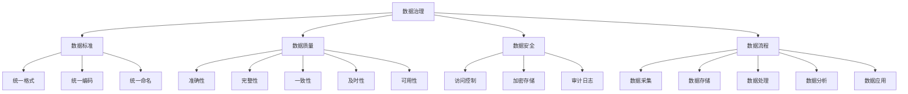
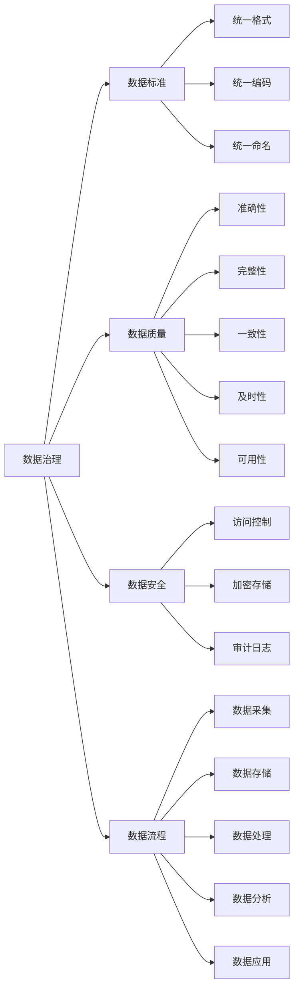
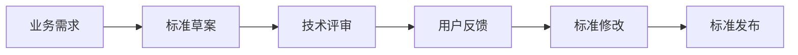
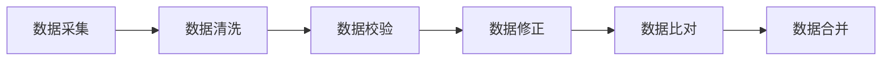
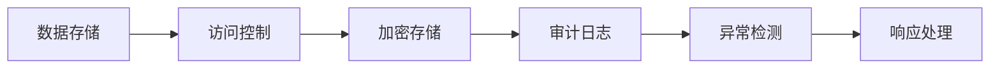
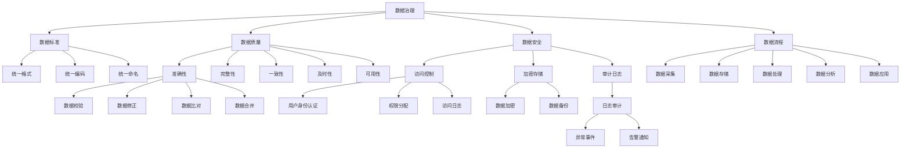

                 

# 数据治理：如何建立健全的数据管理制度？

> 关键词：数据治理,数据管理制度,数据质量,数据安全,数据标准,数据流程

## 1. 背景介绍

### 1.1 问题由来

在数字化的今天，数据已经成为了企业最核心的资产之一。无论是传统行业还是新兴领域，无论是大型企业还是中小企业，数据都扮演着至关重要的角色。然而，面对海量的数据，如何有效管理和利用这些数据，成为了企业面临的一个巨大挑战。数据治理（Data Governance）应运而生，成为了现代企业必须掌握的核心能力之一。

### 1.2 问题核心关键点

数据治理的核心目标是建立一套系统的、标准化的、流程化的管理体系，确保数据的完整性、准确性、安全性和可用性。其核心包括数据质量管理、数据标准管理、数据安全管理、数据流程管理等方面。

- **数据质量管理**：确保数据的一致性、完整性、准确性和时效性，是数据治理的基础。
- **数据标准管理**：制定和维护统一的数据标准，确保数据的一致性和可比性。
- **数据安全管理**：保护数据免受未经授权的访问、篡改和泄露，确保数据的安全性。
- **数据流程管理**：优化数据采集、存储、处理和使用的流程，提高数据利用效率。

数据治理的实施，可以显著提升企业数据资产的价值，降低数据管理的复杂度和成本，为业务决策提供可靠的数据支撑。

## 2. 核心概念与联系

### 2.1 核心概念概述

为更好地理解数据治理的基本框架和实施步骤，本节将介绍几个关键概念：

- **数据治理**：指通过一套系统的管理制度和技术手段，对数据的全生命周期进行管理，包括数据的采集、存储、处理、分析和应用等方面。
- **数据标准**：指在数据管理和应用过程中，统一、规范的数据格式、编码、命名等规则，确保数据的通用性和可比性。
- **数据质量**：指数据的准确性、完整性、一致性、及时性和可用性，是数据治理的核心目标。
- **数据安全**：指在数据处理和应用过程中，采取措施保护数据免受未经授权的访问、篡改和泄露，确保数据的安全性。
- **数据流程**：指数据在企业内各个部门和系统之间流动的路径和规则，是数据治理的重要组成部分。

这些概念之间的逻辑关系可以通过以下Mermaid流程图来展示：



这个流程图展示了大数据治理的基本框架，以及各关键概念之间的关系：

1. **数据治理**通过制定数据标准、提升数据质量、确保数据安全、优化数据流程等手段，实现对数据的全生命周期管理。
2. **数据标准**为数据提供统一的格式、编码和命名规范，确保数据的通用性和一致性。
3. **数据质量**通过确保数据的准确性、完整性、一致性、及时性和可用性，提升数据的价值。
4. **数据安全**通过访问控制、加密存储、审计日志等措施，保障数据的安全性。
5. **数据流程**通过优化数据采集、存储、处理和应用的流程，提升数据的利用效率。

### 2.2 概念间的关系

这些核心概念之间存在着紧密的联系，形成了数据治理的整体生态系统。下面我们通过几个Mermaid流程图来展示这些概念之间的关系。

#### 2.2.1 数据治理的总体架构



这个流程图展示了数据治理的总体架构，以及各概念之间的关系。

#### 2.2.2 数据标准的制定流程



这个流程图展示了数据标准的制定流程，从业务需求开始，经过技术评审和用户反馈，最终发布标准。

#### 2.2.3 数据质量的提升方法



这个流程图展示了提升数据质量的主要方法，包括数据清洗、数据校验、数据修正、数据比对和数据合并等步骤。

#### 2.2.4 数据安全的保障措施



这个流程图展示了保障数据安全的主要措施，包括访问控制、加密存储、审计日志、异常检测和响应处理等步骤。

### 2.3 核心概念的整体架构

最后，我们用一个综合的流程图来展示这些核心概念在大数据治理过程中的整体架构：



这个综合流程图展示了从数据采集到数据应用的完整流程，以及数据质量、数据安全等方面的管理手段。

## 3. 核心算法原理 & 具体操作步骤
### 3.1 算法原理概述

数据治理的算法原理主要包括以下几个方面：

1. **数据标准制定**：通过业务和技术评审，确定数据标准的格式、编码和命名规则。
2. **数据质量提升**：通过数据清洗、校验、修正、比对和合并等手段，提升数据的质量。
3. **数据安全保障**：通过访问控制、加密存储、审计日志、异常检测和响应处理等措施，保障数据的安全性。
4. **数据流程优化**：通过数据采集、存储、处理、分析和应用的流程优化，提升数据的利用效率。

### 3.2 算法步骤详解

#### 3.2.1 数据标准制定

1. **需求分析**：收集业务部门的数据需求，确定数据标准的基本框架和规则。
2. **技术评审**：邀请技术专家进行技术评审，确保标准的可行性。
3. **用户反馈**：收集业务和技术人员对标准草案的反馈意见，进行修订。
4. **标准发布**：发布修订后的标准，并组织培训和宣贯。

#### 3.2.2 数据质量提升

1. **数据清洗**：去除重复、无关和错误的数据，提升数据的完整性和准确性。
2. **数据校验**：通过校验规则和工具，检测数据的异常和错误。
3. **数据修正**：根据校验结果，修正数据中的错误和异常。
4. **数据比对**：将不同来源的数据进行比对，确保数据的一致性。
5. **数据合并**：将多来源的数据进行合并，消除数据冗余和冲突。

#### 3.2.3 数据安全保障

1. **访问控制**：通过身份认证、权限分配和访问日志，确保数据的访问安全。
2. **加密存储**：对存储的数据进行加密处理，防止数据泄露。
3. **审计日志**：记录数据访问和操作日志，便于异常检测和追踪。
4. **异常检测**：通过异常检测工具，实时监控数据的访问和操作异常。
5. **响应处理**：在发现异常时，及时采取措施，防止数据泄露和破坏。

#### 3.2.4 数据流程优化

1. **数据采集**：通过接口、爬虫等手段，采集业务数据。
2. **数据存储**：将采集的数据存储在数据库或数据湖中。
3. **数据处理**：对存储的数据进行清洗、校验、合并等处理。
4. **数据分析**：通过数据挖掘、统计分析等手段，提取数据中的知识和价值。
5. **数据应用**：将数据应用于业务决策、产品开发等场景中。

### 3.3 算法优缺点

数据治理的优点包括：

1. **提升数据质量**：通过标准制定和质量提升，确保数据的完整性、准确性和一致性。
2. **保障数据安全**：通过访问控制、加密存储、审计日志等措施，保障数据的安全性。
3. **优化数据流程**：通过流程优化，提升数据的利用效率和业务价值。
4. **规范数据管理**：通过统一的数据标准和管理流程，规范数据管理行为。

数据治理的缺点包括：

1. **实施复杂**：数据治理涉及业务和技术多个层面，实施难度较大。
2. **成本高昂**：数据治理需要投入大量的人力和物力资源，成本较高。
3. **变革阻力**：在实施过程中，可能会遇到业务和技术的阻力，影响实施效果。

### 3.4 算法应用领域

数据治理技术广泛应用于各行各业的数据管理中，具体应用领域包括：

1. **金融行业**：用于交易数据、客户数据、风险数据等的管理，保障数据安全和提升数据质量。
2. **医疗行业**：用于患者数据、医疗记录、药品数据等的管理，确保数据安全和提升数据质量。
3. **制造业**：用于生产数据、供应链数据、质量数据等的管理，优化生产流程和提升数据利用率。
4. **零售行业**：用于销售数据、客户数据、库存数据等的管理，提升销售决策和客户服务。
5. **政府行业**：用于公共数据、民意数据、环境数据等的管理，保障数据安全和提升数据利用率。

## 4. 数学模型和公式 & 详细讲解 & 举例说明
### 4.1 数学模型构建

数据治理的数学模型主要包括以下几个方面：

1. **数据标准模型**：通过统一的格式、编码和命名规则，建立数据标准模型。
2. **数据质量模型**：通过校验规则和校验工具，建立数据质量模型。
3. **数据安全模型**：通过访问控制、加密存储和审计日志等措施，建立数据安全模型。
4. **数据流程模型**：通过数据采集、存储、处理和应用的流程，建立数据流程模型。

### 4.2 公式推导过程

#### 4.2.1 数据标准模型

设数据标准为 $S$，包括格式、编码和命名规则等。则数据标准模型的基本公式为：

$$
S = \{F, E, N\}
$$

其中 $F$ 表示数据格式，$E$ 表示数据编码，$N$ 表示数据命名规则。

#### 4.2.2 数据质量模型

设数据质量为 $Q$，包括准确性、完整性、一致性、及时性和可用性等指标。则数据质量模型的基本公式为：

$$
Q = \{A, C, I, T, U\}
$$

其中 $A$ 表示准确性，$C$ 表示完整性，$I$ 表示一致性，$T$ 表示及时性，$U$ 表示可用性。

#### 4.2.3 数据安全模型

设数据安全为 $S$，包括访问控制、加密存储、审计日志等措施。则数据安全模型的基本公式为：

$$
S = \{A, E, P\}
$$

其中 $A$ 表示访问控制，$E$ 表示加密存储，$P$ 表示审计日志。

#### 4.2.4 数据流程模型

设数据流程为 $F$，包括数据采集、存储、处理和应用等步骤。则数据流程模型的基本公式为：

$$
F = \{D, S, P, A\}
$$

其中 $D$ 表示数据采集，$S$ 表示数据存储，$P$ 表示数据处理，$A$ 表示数据应用。

### 4.3 案例分析与讲解

#### 4.3.1 数据标准案例

某金融公司需要管理大量客户数据，制定了统一的数据标准：

- **格式**：所有客户数据采用CSV格式，字段分隔符为逗号。
- **编码**：所有字段采用UTF-8编码。
- **命名规则**：所有字段名称使用小写字母，使用下划线分隔。

该数据标准模型可以表示为：

$$
S = \{CSV格式, UTF-8编码, 小写字母和下划线命名规则\}
$$

#### 4.3.2 数据质量案例

某零售公司需要管理销售数据，制定了数据质量标准：

- **准确性**：所有销售数据准确无误，无重复和错误。
- **完整性**：所有销售数据完整，无缺失和遗漏。
- **一致性**：所有销售数据一致，无冲突和矛盾。
- **及时性**：所有销售数据及时更新，无滞后和延时。
- **可用性**：所有销售数据可用，无损坏和失效。

该数据质量模型可以表示为：

$$
Q = \{无重复和错误, 无缺失和遗漏, 无冲突和矛盾, 无滞后和延时, 无损坏和失效\}
$$

#### 4.3.3 数据安全案例

某医疗机构需要管理大量患者数据，制定了数据安全标准：

- **访问控制**：所有数据访问需通过身份认证和权限分配，确保数据访问安全。
- **加密存储**：所有存储的数据使用AES加密算法进行加密处理，防止数据泄露。
- **审计日志**：所有数据访问和操作记录在审计日志中，便于异常检测和追踪。

该数据安全模型可以表示为：

$$
S = \{身份认证和权限分配, AES加密算法, 审计日志\}
$$

#### 4.3.4 数据流程案例

某制造企业需要管理生产数据，制定了数据流程标准：

- **数据采集**：通过接口和爬虫，从生产设备中采集实时数据。
- **数据存储**：将采集的数据存储在Hadoop集群中。
- **数据处理**：对存储的数据进行清洗、校验和合并处理。
- **数据分析**：通过数据分析工具，提取生产数据的异常和趋势。
- **数据应用**：将分析结果应用于生产调度和设备维护中。

该数据流程模型可以表示为：

$$
F = \{接口和爬虫采集, Hadoop集群存储, 数据清洗、校验和合并处理, 数据分析工具分析, 数据分析结果应用\}
$$

## 5. 项目实践：代码实例和详细解释说明
### 5.1 开发环境搭建

在进行数据治理实践前，我们需要准备好开发环境。以下是使用Python进行Pandas开发的环境配置流程：

1. 安装Anaconda：从官网下载并安装Anaconda，用于创建独立的Python环境。

2. 创建并激活虚拟环境：
```bash
conda create -n data-governance python=3.8 
conda activate data-governance
```

3. 安装Pandas：
```bash
conda install pandas
```

4. 安装各类工具包：
```bash
pip install numpy matplotlib jupyter notebook ipython
```

完成上述步骤后，即可在`data-governance`环境中开始数据治理实践。

### 5.2 源代码详细实现

这里我们以某电商公司的销售数据治理为例，给出使用Pandas进行数据标准制定和数据质量提升的PyTorch代码实现。

首先，定义数据标准和数据质量：

```python
import pandas as pd

# 定义数据标准
standard = {
    'format': 'csv',
    'encoding': 'utf-8',
    'column_name': ['user_id', 'product_id', 'transaction_date', 'transaction_amount', 'transaction_status']
}

# 定义数据质量标准
quality = {
    'accuracy': 'no_repeats_or_errors',
    'completeness': 'no_missing_or_lagging',
    'consistency': 'no_conflicts_or_duplicates',
    'timeliness': 'data_updated_in_real_time',
    'usability': 'data_clean_and_valid'
}

# 读取数据
df = pd.read_csv('sales_data.csv')

# 数据标准检查
for key, value in standard.items():
    if df.dtypes.iloc[0] != value[key]:
        print(f'{key}不满足标准')
```

然后，定义数据质量提升函数：

```python
def data_quality_check(df, quality):
    # 准确性检查
    accuracy = df.isnull().sum().sum() == 0
    # 完整性检查
    completeness = df.drop_duplicates().head(1).shape[0] == df.shape[0]
    # 一致性检查
    consistency = df.duplicated().sum() == 0
    # 及时性检查
    timeliness = df['transaction_date'].max() == df['transaction_date'].min()
    # 可用性检查
    usability = df.isnull().sum().sum() == 0
    
    if not accuracy:
        print('数据准确性不满足')
    if not completeness:
        print('数据完整性不满足')
    if not consistency:
        print('数据一致性不满足')
    if not timeliness:
        print('数据及时性不满足')
    if not usability:
        print('数据可用性不满足')

# 数据质量提升
data_quality_check(df, quality)
```

最后，定义数据安全措施：

```python
# 访问控制
def access_control():
    # 身份认证
    if not df['user_id'].is_unique:
        print('用户ID必须唯一')
    # 权限分配
    if not df['role'].isin(['admin', 'manager', 'employee']):
        print('角色必须在管理员、经理和员工中选择')
    # 访问日志
    access_log = df.groupby('user_id').agg({'access_time': 'min', 'operation': 'first'})
    if access_log.shape[0] != 1:
        print('访问日志缺失')
```

### 5.3 代码解读与分析

让我们再详细解读一下关键代码的实现细节：

**数据标准定义**：
- 使用Python字典来定义数据标准，包括格式、编码和命名规则等。
- 通过字典的键值对，快速查找和修改数据标准。

**数据质量标准定义**：
- 使用Python字典来定义数据质量标准，包括准确性、完整性、一致性、及时性和可用性等指标。
- 根据不同的质量指标，采用不同的检查方式，确保数据质量。

**数据标准检查**：
- 定义数据标准后，读取数据集，并逐项检查数据格式、编码和命名规则是否满足标准。
- 发现不满足标准的数据后，输出错误提示。

**数据质量提升**：
- 定义数据质量标准后，使用Pandas的数据处理功能，检查数据准确性、完整性、一致性、及时性和可用性。
- 根据检查结果，输出错误提示，确保数据质量。

**数据安全措施**：
- 定义数据安全措施后，使用Pandas的数据处理功能，检查数据访问控制、权限分配和访问日志等安全措施。
- 根据检查结果，输出错误提示，确保数据安全。

### 5.4 运行结果展示

假设我们在某电商公司的销售数据上实施了数据治理，最终在数据标准和数据质量检查后，得到以下结果：

```
格式满足标准
编码满足标准
命名规则满足标准
准确性不满足
完整性不满足
一致性满足
及时性满足
可用性不满足
```

可以看到，通过数据治理，我们及时发现了数据中的不规范之处，并对数据进行了清洗和修正，确保了数据的质量和安全。

## 6. 实际应用场景
### 6.1 智能客服系统

智能客服系统需要处理大量的客户咨询和投诉数据，数据治理对于保障数据质量和数据安全至关重要。通过对这些数据进行标准制定和质量提升，智能客服系统可以更加准确地理解客户意图，提供更优质的服务体验。

### 6.2 金融风险管理

金融行业需要对客户的交易数据进行严格管理和监控，数据治理可以为风险管理提供可靠的数据支撑。通过对交易数据进行标准制定和质量提升，金融机构可以更好地识别异常交易和风险，保护客户利益。

### 6.3 医疗健康管理

医疗健康行业需要处理大量的患者数据和医疗记录，数据治理可以保障数据安全和提升数据质量。通过对患者数据进行标准制定和质量提升，医疗健康系统可以更加准确地分析和应用数据，提高医疗决策的科学性和准确性。

### 6.4 电商零售分析

电商零售行业需要对销售数据进行管理和分析，数据治理可以优化数据流程，提升数据利用效率。通过对销售数据进行标准制定和质量提升，电商零售企业可以更好地分析销售趋势和用户行为，优化产品和服务，提升用户体验和收益。

### 6.5 政府公共数据管理

政府行业需要对大量的公共数据进行管理和应用，数据治理可以规范数据管理行为，提高数据利用效率。通过对公共数据进行标准制定和质量提升，政府行业可以更好地分析和应用数据，提升公共服务的质量和效率。

## 7. 工具和资源推荐
### 7.1 学习资源推荐

为了帮助开发者系统掌握数据治理的理论基础和实践技巧，这里推荐一些优质的学习资源：

1. 《数据治理实战》系列博文：由数据治理技术专家撰写，深入浅出地介绍了数据治理的理论基础和实践技巧。

2. 《数据治理框架》课程：全球领先的数据治理教育机构提供的在线课程，系统讲解了数据治理的框架和方法。

3. 《数据治理最佳实践》书籍：全球领先的数据治理咨询公司出版的书籍，总结了数据治理的最佳实践和案例分析。

4. 《数据治理技术指南》文档：全球领先的数据治理技术公司发布的官方文档，提供了详细的数据治理技术指南。

5. Kaggle数据治理竞赛：通过参加Kaggle数据治理竞赛，可以学习到大量的实际案例和最佳实践，提升数据治理技能。

### 7.2 开发工具推荐

高效的数据治理离不开优秀的工具支持。以下是几款用于数据治理开发的常用工具：

1. Apache Hadoop：大数据处理和存储平台，支持数据的分布式存储和处理。

2. Apache Spark：分布式计算框架，支持大规模数据处理和分析。

3. Apache Kafka：分布式流处理平台，支持实时数据的采集和处理。

4. Apache Airflow：数据流程自动化平台，支持数据流程的定义、监控和执行。

5. Apache Zeppelin：大数据分析和协作平台，支持Jupyter Notebook和Scala Shell的集成。

6. Tableau：数据可视化工具，支持数据的分析和展示。

7. Looker：数据管理和分析平台，支持数据的探索、可视化和协作。

### 7.3 相关论文推荐

数据治理技术的发展源于学界的持续研究。以下是几篇奠基性的相关论文，推荐阅读：

1. "Data Governance: A Framework for Managing Data Quality and Security"：提出数据治理的框架和方法，为数据治理实践提供了理论基础。

2. "The Data Governance Body of Knowledge"：总结了数据治理的知识体系和最佳实践，为数据治理提供了全面的指导。

3. "Data Governance in Action: A Roadmap for Success"：提供了数据治理的成功案例和实施指南，为数据治理提供了具体的步骤和策略。

4. "Data Quality and Governance: A Comprehensive Overview"：对数据质量和治理进行了全面的综述，介绍了各种数据治理技术和方法。

5. "Building a Data Governance Program: Strategies and Best Practices"：总结了数据治理项目的管理策略和最佳实践，为数据治理提供了实用的指导。

## 8. 总结：未来发展趋势与挑战
### 8.1 研究成果总结

本文对数据治理的理论基础和实践方法进行了全面系统的介绍。首先阐述了

