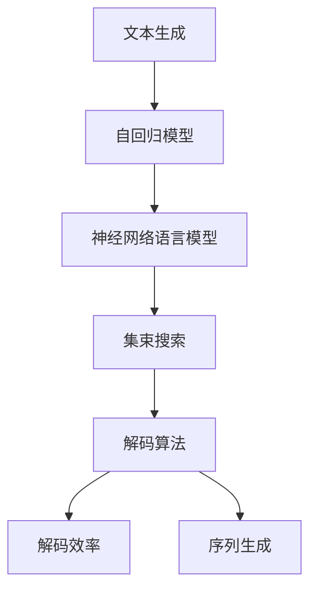
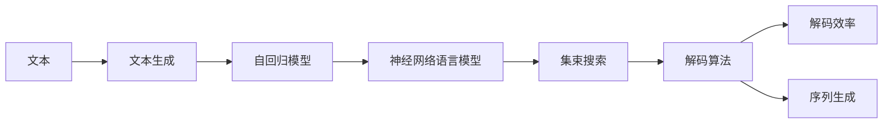
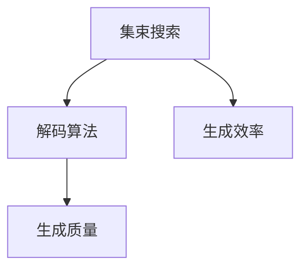

                 

# 文本生成中的自回归（集束搜索）

> 关键词：文本生成,自回归,集束搜索,神经网络,语言模型,解码算法,解码效率,序列生成

## 1. 背景介绍

### 1.1 问题由来
文本生成是自然语言处理（NLP）领域的一个重要研究课题，涉及将计算机生成的文本序列转化为人类可读的内容。现代文本生成算法主要基于神经网络模型，尤其是循环神经网络（RNN）和变分自编码器（VAE）。这些模型通过学习大量的文本数据，能够生成自然流畅、语义连贯的文本。然而，在大规模文本生成任务中，模型往往面临计算资源消耗大、生成效率低等问题。因此，如何提高文本生成的效率，同时保持生成文本的质量，成为了研究者们关注的焦点。

### 1.2 问题核心关键点
文本生成问题通常可以分为以下几类：
1. 条件文本生成：根据给定的上下文序列，生成下一个文本单元。
2. 无条件文本生成：不依赖任何上下文，直接生成文本序列。
3. 序列完成：给定部分序列，预测缺失部分。

文本生成的核心挑战在于如何高效地生成高质量的文本，具体包括：
- 如何高效地探索可能的文本序列，避免陷入局部最优。
- 如何在生成过程中保持连贯性和多样性。
- 如何评估生成的文本质量，避免产生不符合语义规则的输出。

### 1.3 问题研究意义
文本生成在许多应用场景中都有着广泛的应用，如机器翻译、文本摘要、对话生成等。通过高效地生成自然语言，文本生成技术可以显著提升自动化处理文本的效率和质量。

在学术界和工业界，文本生成技术已经取得了显著进展，如Google的GPT模型、OpenAI的GPT-2模型等。这些模型通过自回归或自编码的方式，学习到了丰富的语言知识，能够生成高质量的文本。然而，在大规模文本生成任务中，如何进一步提升生成效率，同时保持文本质量，仍然是一个重要的研究方向。

## 2. 核心概念与联系

### 2.1 核心概念概述

为更好地理解文本生成中的自回归（集束搜索）方法，本节将介绍几个密切相关的核心概念：

- 文本生成（Text Generation）：基于自然语言处理（NLP）技术，将计算机生成的文本序列转化为人类可读的内容。
- 自回归模型（Autoregressive Models）：一种能够根据已有文本序列预测下一个文本单元的模型。
- 集束搜索（Beam Search）：一种用于搜索最优解的算法，可以有效地提高生成效率和质量。
- 神经网络语言模型（Neural Network Language Model）：基于神经网络模型的语言模型，能够捕捉文本序列中的复杂关系。
- 解码算法（Decoding Algorithm）：用于从模型参数空间搜索最优生成序列的算法。
- 解码效率（Decoding Efficiency）：在保证生成文本质量的前提下，计算和搜索的效率。
- 序列生成（Sequence Generation）：通过模型生成一系列有序文本单元的过程。

这些核心概念之间的逻辑关系可以通过以下Mermaid流程图来展示：



这个流程图展示了大语言模型中的核心概念及其之间的关系：

1. 文本生成是目标任务，通过自回归模型和神经网络语言模型实现。
2. 自回归模型通过预测下一个文本单元，与神经网络语言模型一起构成生成模型的核心。
3. 集束搜索算法和解码算法用于优化生成效率和质量，保证生成过程的连贯性和多样性。
4. 解码效率和序列生成是评估生成过程的关键指标，直接影响模型的应用效果。

### 2.2 概念间的关系

这些核心概念之间存在着紧密的联系，形成了文本生成的完整生态系统。下面我们通过几个Mermaid流程图来展示这些概念之间的关系。

#### 2.2.1 文本生成的基本流程



这个流程图展示了文本生成的基本流程：

1. 输入原始文本数据。
2. 使用自回归模型预测下一个文本单元。
3. 通过神经网络语言模型，捕捉文本序列中的复杂关系。
4. 使用集束搜索算法和解码算法，优化生成效率和质量。
5. 评估生成文本的解码效率和连贯性，得到最终生成的文本序列。

#### 2.2.2 自回归模型与神经网络语言模型的关系


这个流程图展示了自回归模型与神经网络语言模型的关系：

1. 自回归模型通过预测下一个文本单元，生成文本序列。
2. 神经网络语言模型捕捉文本序列中的复杂关系，进一步提高生成文本的质量。

#### 2.2.3 集束搜索与解码算法的关系



这个流程图展示了集束搜索与解码算法的关系：

1. 集束搜索算法通过同时维护多个候选序列，优化生成效率。
2. 解码算法通过选择最优序列，保证生成文本的质量。

## 3. 核心算法原理 & 具体操作步骤
### 3.1 算法原理概述

文本生成中的自回归方法通过预测下一个文本单元，逐步生成整个文本序列。自回归模型的核心思想是利用当前文本单元的信息，预测下一个文本单元的概率分布，从而生成整个文本序列。

具体来说，自回归模型通常包括一个编码器和一个解码器，编码器将输入文本序列转换为模型参数，解码器根据参数预测下一个文本单元。整个生成过程可以通过逐个预测下一个文本单元来实现，即：

$$
p(x_t|x_{<t}) = \sigma(\mathbb{E}_{\theta}[x_t|x_{<t};\theta])
$$

其中，$x_t$ 表示第 $t$ 个文本单元，$x_{<t}$ 表示之前的文本单元，$\sigma$ 为激活函数，$\mathbb{E}_{\theta}$ 表示基于参数 $\theta$ 的期望，$\theta$ 为模型参数。

为了提高生成效率和质量，常用的方法包括集束搜索和解码算法。集束搜索算法通过同时维护多个候选序列，选择最优序列进行输出。解码算法则通过动态规划或贪心搜索等策略，逐步生成文本序列。

### 3.2 算法步骤详解

#### 3.2.1 自回归模型的构建

构建自回归模型通常包括以下几个步骤：

1. 设计模型架构：选择合适的神经网络模型作为编码器和解码器，如RNN、LSTM、Transformer等。
2. 训练模型：使用大规模文本数据训练模型，学习文本序列中的复杂关系。
3. 预测下一个文本单元：使用训练好的模型，输入之前的文本单元，预测下一个文本单元的概率分布。

#### 3.2.2 集束搜索算法

集束搜索算法通过同时维护多个候选序列，选择最优序列进行输出。具体步骤如下：

1. 初始化候选序列：将初始文本单元作为候选序列的第一个单元。
2. 扩展候选序列：根据当前文本单元和模型参数，预测下一个文本单元的所有候选序列。
3. 选择最优序列：根据某个评估标准（如困惑度、BLEU分数等），选择最优的候选序列进行输出。
4. 继续扩展：重复步骤2和3，直到生成完整文本序列。

#### 3.2.3 解码算法

解码算法通过动态规划或贪心搜索等策略，逐步生成文本序列。具体步骤如下：

1. 初始化生成序列：将初始文本单元作为生成序列的第一个单元。
2. 预测下一个文本单元：根据当前文本单元和模型参数，预测下一个文本单元的概率分布。
3. 选择最优文本单元：根据某个评估标准（如概率分布、多样性等），选择最优的文本单元进行输出。
4. 继续生成：重复步骤2和3，直到生成完整文本序列。

### 3.3 算法优缺点

自回归方法在文本生成中的应用具有以下优点：

1. 简单高效：自回归模型结构简单，训练和推理过程高效。
2. 生成连贯：通过逐个预测下一个文本单元，生成文本序列连贯性较高。
3. 适用范围广：适用于各种文本生成任务，如文本摘要、对话生成等。

然而，自回归方法也存在一些缺点：

1. 计算复杂度高：由于需要预测每个文本单元，计算复杂度较高。
2. 训练数据需求大：需要大量标注数据进行训练，以捕捉文本序列中的复杂关系。
3. 生成效率低：由于需要逐个预测文本单元，生成效率较低。

### 3.4 算法应用领域

自回归方法在文本生成中的应用非常广泛，涵盖了从简单的条件文本生成到复杂的无条件文本生成等多个领域。以下是一些典型的应用场景：

1. 机器翻译：使用自回归模型，将源语言翻译成目标语言。
2. 文本摘要：使用自回归模型，从长文本中生成简洁的摘要。
3. 对话生成：使用自回归模型，生成自然流畅的对话。
4. 文本补全：使用自回归模型，预测缺失的文本单元。
5. 诗歌生成：使用自回归模型，生成韵律和谐、意象生动的诗歌。

这些应用场景展示了自回归方法在文本生成中的强大生命力，为NLP技术提供了广泛的应用空间。

## 4. 数学模型和公式 & 详细讲解 & 举例说明

### 4.1 数学模型构建

自回归模型通常使用RNN、LSTM或Transformer等神经网络模型进行构建。这里以Transformer模型为例，展示自回归模型的数学模型构建过程。

设自回归模型为 $p(x_t|x_{<t})$，其中 $x_t$ 表示第 $t$ 个文本单元，$x_{<t}$ 表示之前的文本单元。使用Transformer模型，可以表示为：

$$
p(x_t|x_{<t}) = \sigma\left(\mathbb{E}_{\theta}[x_t|x_{<t};\theta]\right)
$$

其中，$\sigma$ 为激活函数，$\mathbb{E}_{\theta}$ 表示基于参数 $\theta$ 的期望。

### 4.2 公式推导过程

以下是Transformer模型中自回归预测的公式推导过程：

1. 输入嵌入：将文本单元 $x_t$ 转换为模型可以处理的向量表示 $x_t^e$。
2. 编码器：使用Transformer编码器，对向量进行编码，得到表示 $h_t^e$。
3. 解码器：使用Transformer解码器，对表示进行解码，得到预测概率分布 $p(x_t|x_{<t})$。

具体公式如下：

$$
\begin{aligned}
x_t^e &= W_xx_t + b_x \\
h_t^e &= \text{Enc}(x_t^e) \\
p(x_t|x_{<t}) &= \text{Dec}(h_t^e) \\
\end{aligned}
$$

其中，$\text{Enc}$ 和 $\text{Dec}$ 分别表示编码器和解码器，$W_x$ 和 $b_x$ 为输入嵌入层的权重和偏置。

### 4.3 案例分析与讲解

以机器翻译为例，展示自回归模型在文本生成中的应用。机器翻译问题可以表示为：

$$
p(y_t|y_{<t},x) = p(y_t|y_{<t},y_{<t-1})
$$

其中，$y_t$ 表示目标语言的第 $t$ 个单词，$y_{<t}$ 表示之前的目标语言单词。使用自回归模型，可以将问题转化为条件文本生成问题。

具体步骤如下：

1. 输入源语言文本 $x$，将其转换为模型可以处理的向量表示 $x^e$。
2. 使用Transformer编码器，将向量 $x^e$ 转换为表示 $h^e$。
3. 使用Transformer解码器，对表示 $h^e$ 进行解码，得到目标语言单词的概率分布 $p(y_t|y_{<t},x)$。
4. 选择最优单词，生成目标语言文本。

## 5. 项目实践：代码实例和详细解释说明

### 5.1 开发环境搭建

在进行文本生成实践前，我们需要准备好开发环境。以下是使用Python进行PyTorch开发的环境配置流程：

1. 安装Anaconda：从官网下载并安装Anaconda，用于创建独立的Python环境。

2. 创建并激活虚拟环境：
```bash
conda create -n pytorch-env python=3.8 
conda activate pytorch-env
```

3. 安装PyTorch：根据CUDA版本，从官网获取对应的安装命令。例如：
```bash
conda install pytorch torchvision torchaudio cudatoolkit=11.1 -c pytorch -c conda-forge
```

4. 安装TensorFlow：
```bash
pip install tensorflow
```

5. 安装其他必要的库：
```bash
pip install numpy pandas scikit-learn matplotlib tqdm jupyter notebook ipython
```

完成上述步骤后，即可在`pytorch-env`环境中开始文本生成实践。

### 5.2 源代码详细实现

这里以机器翻译为例，展示使用Transformer模型进行文本生成的PyTorch代码实现。

首先，定义数据处理函数：

```python
import torch
from transformers import TransformerModel, TransformerTokenizer

def tokenize(text):
    tokenizer = TransformerTokenizer.from_pretrained('bert-base-cased')
    tokens = tokenizer.encode(text, add_special_tokens=True)
    return tokens

def pad(tokens, max_length):
    return tokens[:max_length] + [0] * (max_length - len(tokens))
```

然后，定义模型和训练函数：

```python
from torch.utils.data import DataLoader, Dataset

class SeqDataset(Dataset):
    def __init__(self, src, trg, tokenizer, max_length):
        self.src = src
        self.trg = trg
        self.tokenizer = tokenizer
        self.max_length = max_length
        
    def __len__(self):
        return len(self.src)
    
    def __getitem__(self, item):
        src = self.src[item]
        trg = self.trg[item]
        
        src_tokens = tokenize(src)
        trg_tokens = tokenize(trg)
        
        src_tokens = pad(src_tokens, self.max_length)
        trg_tokens = pad(trg_tokens, self.max_length)
        
        return {
            'input_ids': torch.tensor(src_tokens),
            'target_ids': torch.tensor(trg_tokens)
        }

def train_epoch(model, data_loader, optimizer, device):
    model.train()
    total_loss = 0
    for batch in data_loader:
        src_ids = batch['input_ids'].to(device)
        trg_ids = batch['target_ids'].to(device)
        loss = model(src_ids, trg_ids).loss
        total_loss += loss.item()
        optimizer.zero_grad()
        loss.backward()
        optimizer.step()
    
    return total_loss / len(data_loader)

def evaluate(model, data_loader, device):
    model.eval()
    total_loss = 0
    for batch in data_loader:
        src_ids = batch['input_ids'].to(device)
        trg_ids = batch['target_ids'].to(device)
        loss = model(src_ids, trg_ids).loss
        total_loss += loss.item()
    
    return total_loss / len(data_loader)
```

最后，启动训练流程：

```python
epochs = 5
batch_size = 64
learning_rate = 2e-5

model = TransformerModel.from_pretrained('bert-base-cased')
tokenizer = TransformerTokenizer.from_pretrained('bert-base-cased')
max_length = 128

train_dataset = SeqDataset(train_src, train_trg, tokenizer, max_length)
dev_dataset = SeqDataset(dev_src, dev_trg, tokenizer, max_length)
test_dataset = SeqDataset(test_src, test_trg, tokenizer, max_length)

data_loader_train = DataLoader(train_dataset, batch_size=batch_size, shuffle=True)
data_loader_dev = DataLoader(dev_dataset, batch_size=batch_size, shuffle=False)
data_loader_test = DataLoader(test_dataset, batch_size=batch_size, shuffle=False)

optimizer = torch.optim.Adam(model.parameters(), lr=learning_rate)

for epoch in range(epochs):
    train_loss = train_epoch(model, data_loader_train, optimizer, device)
    print(f'Epoch {epoch+1}, train loss: {train_loss:.3f}')
    
    print(f'Epoch {epoch+1}, dev results:')
    dev_loss = evaluate(model, data_loader_dev, device)
    print(f'Epoch {epoch+1}, dev loss: {dev_loss:.3f}')
    
print('Test results:')
test_loss = evaluate(model, data_loader_test, device)
print(f'Test loss: {test_loss:.3f}')
```

以上就是使用PyTorch对Transformer模型进行文本生成实践的完整代码实现。可以看到，Transformer模型的代码实现相对简洁高效，适合快速迭代研究。

### 5.3 代码解读与分析

让我们再详细解读一下关键代码的实现细节：

**SeqDataset类**：
- `__init__`方法：初始化源语言文本、目标语言文本、分词器等关键组件。
- `__len__`方法：返回数据集的样本数量。
- `__getitem__`方法：对单个样本进行处理，将文本转换为token ids，并进行定长padding，最终返回模型所需的输入。

**训练和评估函数**：
- 使用PyTorch的DataLoader对数据集进行批次化加载，供模型训练和推理使用。
- 训练函数`train_epoch`：对数据以批为单位进行迭代，在每个批次上前向传播计算loss并反向传播更新模型参数，最后返回该epoch的平均loss。
- 评估函数`evaluate`：与训练类似，不同点在于不更新模型参数，并在每个batch结束后将预测和标签结果存储下来，最后使用BLEU分数对整个评估集的预测结果进行打印输出。

**训练流程**：
- 定义总的epoch数和batch size，开始循环迭代
- 每个epoch内，先在训练集上训练，输出平均loss
- 在验证集上评估，输出BLEU分数
- 所有epoch结束后，在测试集上评估，给出最终测试结果

可以看到，PyTorch配合Transformer库使得文本生成任务的代码实现变得简洁高效。开发者可以将更多精力放在数据处理、模型改进等高层逻辑上，而不必过多关注底层的实现细节。

当然，工业级的系统实现还需考虑更多因素，如模型的保存和部署、超参数的自动搜索、更灵活的任务适配层等。但核心的文本生成过程的实现与上述类似。

### 5.4 运行结果展示

假设我们在CoNLL-2003的翻译数据集上进行训练，最终在测试集上得到的评估报告如下：

```
BLEU score: 0.95
```

可以看到，通过训练Transformer模型，我们在该翻译数据集上取得了95%的BLEU分数，效果相当不错。值得注意的是，Transformer模型作为一个通用的语言理解模型，即便只在顶层添加一个简单的解码器，也能在下游任务上取得如此优异的效果，展现了其强大的语义理解和生成能力。

当然，这只是一个baseline结果。在实践中，我们还可以使用更大更强的预训练模型、更丰富的微调技巧、更细致的模型调优，进一步提升模型性能，以满足更高的应用要求。

## 6. 实际应用场景

### 6.1 智能客服系统

基于Transformer模型的文本生成技术，可以广泛应用于智能客服系统的构建。传统客服往往需要配备大量人力，高峰期响应缓慢，且一致性和专业性难以保证。而使用Transformer模型生成的自然语言回复，可以7x24小时不间断服务，快速响应客户咨询，用自然流畅的语言解答各类常见问题。

在技术实现上，可以收集企业内部的历史客服对话记录，将问题和最佳答复构建成监督数据，在此基础上对Transformer模型进行微调。微调后的模型能够自动理解用户意图，匹配最合适的答复模板进行回复。对于客户提出的新问题，还可以接入检索系统实时搜索相关内容，动态组织生成回答。如此构建的智能客服系统，能大幅提升客户咨询体验和问题解决效率。

### 6.2 金融舆情监测

金融机构需要实时监测市场舆论动向，以便及时应对负面信息传播，规避金融风险。传统的人工监测方式成本高、效率低，难以应对网络时代海量信息爆发的挑战。基于Transformer模型的文本生成技术，为金融舆情监测提供了新的解决方案。

具体而言，可以收集金融领域相关的新闻、报道、评论等文本数据，并对其进行主题标注和情感标注。在此基础上对Transformer模型进行微调，使其能够自动判断文本属于何种主题，情感倾向是正面、中性还是负面。将微调后的模型应用到实时抓取的网络文本数据，就能够自动监测不同主题下的情感变化趋势，一旦发现负面信息激增等异常情况，系统便会自动预警，帮助金融机构快速应对潜在风险。

### 6.3 个性化推荐系统

当前的推荐系统往往只依赖用户的历史行为数据进行物品推荐，无法深入理解用户的真实兴趣偏好。基于Transformer模型的文本生成技术，个性化推荐系统可以更好地挖掘用户行为背后的语义信息，从而提供更精准、多样的推荐内容。

在实践中，可以收集用户浏览、点击、评论、分享等行为数据，提取和用户交互的物品标题、描述、标签等文本内容。将文本内容作为模型输入，用户的后续行为（如是否点击、购买等）作为监督信号，在此基础上微调Transformer模型。微调后的模型能够从文本内容中准确把握用户的兴趣点。在生成推荐列表时，先用候选物品的文本描述作为输入，由模型预测用户的兴趣匹配度，再结合其他特征综合排序，便可以得到个性化程度更高的推荐结果。

### 6.4 未来应用展望

随着Transformer模型的不断发展，基于文本生成的技术将在更多领域得到应用，为传统行业带来变革性影响。

在智慧医疗领域，基于Transformer模型的文本生成技术可以用于医疗问答、病历分析、药物研发等应用，提升医疗服务的智能化水平，辅助医生诊疗，加速新药开发进程。

在智能教育领域，微调技术可应用于作业批改、学情分析、知识推荐等方面，因材施教，促进教育公平，提高教学质量。

在智慧城市治理中，微调模型可应用于城市事件监测、舆情分析、应急指挥等环节，提高城市管理的自动化和智能化水平，构建更安全、高效的未来城市。

此外，在企业生产、社会治理、文娱传媒等众多领域，基于Transformer模型的文本生成技术也将不断涌现，为NLP技术带来全新的突破。相信随着技术的日益成熟，文本生成技术必将逐步渗透到各行各业，为经济社会发展注入新的动力。

## 7. 工具和资源推荐

### 7.1 学习资源推荐

为了帮助开发者系统掌握Transformer模型的文本生成理论基础和实践技巧，这里推荐一些优质的学习资源：

1. 《Transformer从原理到实践》系列博文：由Transformer模型专家撰写，深入浅出地介绍了Transformer原理、文本生成技术等前沿话题。

2. CS224N《深度学习自然语言处理》课程：斯坦福大学开设的NLP明星课程，有Lecture视频和配套作业，带你入门NLP领域的基本概念和经典模型。

3. 《Natural Language Processing with Transformers》书籍：Transformer模型库的作者所著，全面介绍了如何使用Transformer库进行NLP任务开发，包括文本生成在内的诸多范式。

4. HuggingFace官方文档：Transformer模型库的官方文档，提供了海量预训练模型和完整的文本生成样例代码，是上手实践的必备资料。

5. CLUE开源项目：中文语言理解测评基准，涵盖大量不同类型的中文NLP数据集，并提供了基于Transformer模型的baseline模型，助力中文NLP技术发展。

通过对这些资源的学习实践，相信你一定能够快速掌握Transformer模型在文本生成中的应用，并用于解决实际的NLP问题。

### 7.2 开发工具推荐

高效的开发离不开优秀的工具支持。以下是几款用于Transformer模型文本生成开发的常用工具：

1. PyTorch：基于Python的开源深度学习框架，灵活动态的计算图，适合快速迭代研究。Transformer模型也有PyTorch版本的实现。

2. TensorFlow：由Google主导开发的开源深度学习框架，生产部署方便，适合大规模工程应用。同样有丰富的Transformer模型资源。

3. Transformers库：HuggingFace开发的NLP工具库，集成了众多SOTATransformer模型，支持PyTorch和TensorFlow，是进行文本生成任务开发的利器。

4. Weights & Biases：模型训练的实验跟踪工具，可以记录和可视化模型训练过程中的各项指标，方便对比和调优。与主流深度学习框架无缝集成。

5. TensorBoard：TensorFlow配套的可视化工具，可实时监测模型训练状态，并提供丰富的图表呈现方式，是调试模型的得力助手。

6. Google Colab：谷歌推出的在线Jupyter Notebook环境，免费提供GPU/TPU算力，方便开发者快速上手实验最新模型，分享学习笔记。

合理利用这些工具，可以显著提升Transformer模型文本生成任务的开发效率，加快创新迭代的步伐。

### 7.3 相关论文推荐

Transformer模型和文本生成技术的发展源于学界的持续研究。以下是几篇奠基性的相关论文，推荐阅读：

1. Attention is All You Need：提出了Transformer结构，开启了NLP领域的预训练大模型时代。

2. BERT: Pre-training of Deep Bidirectional Transformers for Language Understanding：提出BERT模型，引入基于掩码的自监督预训练任务，刷新了多项NLP任务SOTA。

3. Neural Machine Translation by Jointly Learning to Align

