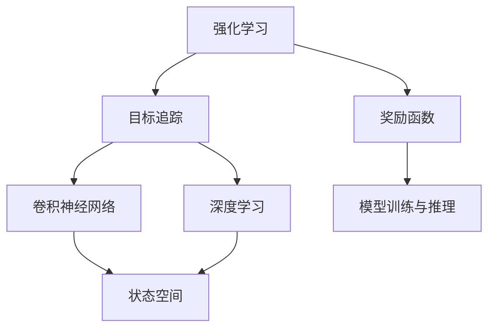
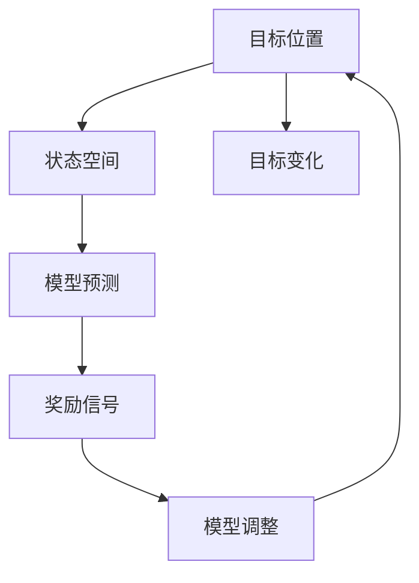
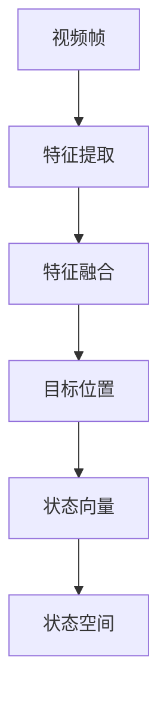
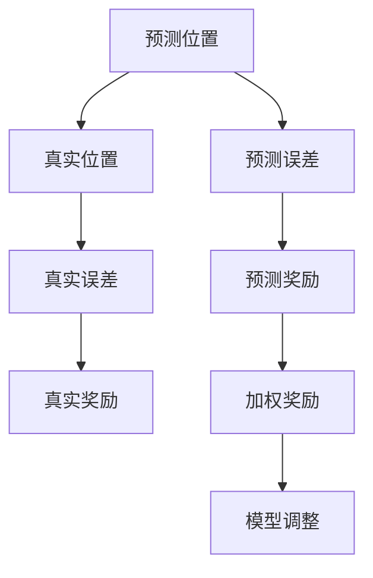
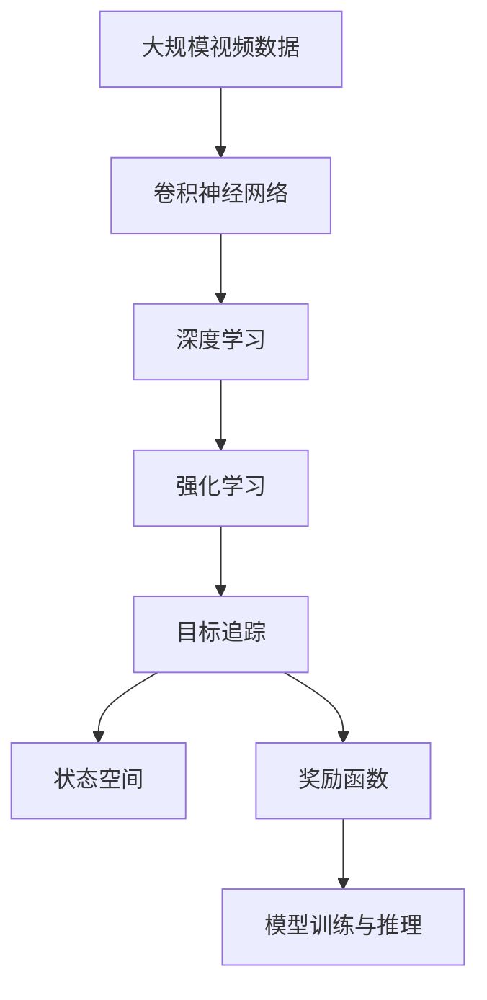

                 

# 强化学习：在视觉目标追踪领域的应用

## 1. 背景介绍

### 1.1 问题由来
近年来，随着计算机视觉技术的发展，目标追踪（Object Tracking）成为研究热点。目标追踪系统通过实时地检测和跟踪目标在视频帧中的位置，广泛应用于视频监控、自动驾驶、人机交互等领域。然而，由于目标外观变化、遮挡、多目标交叉等情况，目标追踪仍然是一个具有挑战性的问题。

为了应对这些挑战，研究人员尝试了多种方法，包括传统跟踪算法、基于深度学习的方法等。传统算法如卡尔曼滤波器、粒子滤波器等，基于模型的假设，难以应对非线性的变化。深度学习方法，尤其是卷积神经网络（Convolutional Neural Networks, CNNs）在图像识别和目标检测中取得良好效果，但在实时性和泛化能力上存在不足。

### 1.2 问题核心关键点
强化学习（Reinforcement Learning, RL）作为一种通过试错学习策略的方法，近年来在图像识别、目标检测等计算机视觉任务中展现出了巨大潜力。强化学习方法，通过目标追踪过程中的互动，不断调整模型参数，以最大化预测目标位置与实际位置的匹配度。

具体来说，强化学习在目标追踪中的应用包括以下几个关键点：
1. 奖励函数设计：设计合适的奖励函数，鼓励模型尽可能地准确预测目标位置，避免预测偏差。
2. 状态空间定义：将视频帧转换成状态空间，以模型可以理解的方式表示目标位置信息。
3. 模型训练与推理：基于强化学习框架，训练模型并进行实时推理。

### 1.3 问题研究意义
研究强化学习在目标追踪领域的应用，对于提升目标追踪系统的实时性和泛化能力，具有重要意义：
1. 提高系统鲁棒性：强化学习可以通过不断调整模型参数，适应目标外观变化、遮挡等情况，提升系统的鲁棒性。
2. 实现模型自适应：强化学习可以使得模型不断学习新的追踪策略，适应不同的应用场景和数据分布。
3. 降低计算成本：相比于传统的特征提取和模型训练方法，强化学习可以通过在线学习，实时更新模型，降低计算成本。
4. 提升追踪精度：通过不断调整模型参数，强化学习可以提高目标追踪的精度，特别是对于复杂的动态目标。

## 2. 核心概念与联系

### 2.1 核心概念概述

为了更好地理解强化学习在目标追踪中的应用，本节将介绍几个密切相关的核心概念：

- **强化学习（Reinforcement Learning, RL）**：一种通过智能体与环境交互，不断调整策略以最大化预期回报的方法。
- **目标追踪（Object Tracking）**：实时地检测和跟踪目标在视频帧中的位置，具有动态性、实时性等特点。
- **卷积神经网络（Convolutional Neural Networks, CNNs）**：一种强大的图像处理工具，能够提取图像中的特征，常用于目标检测和分类。
- **深度学习（Deep Learning）**：通过多层神经网络进行学习和推理，适用于复杂的模式识别和预测任务。
- **状态空间（State Space）**：用于描述目标位置和运动状态的向量表示，以便模型进行学习和推理。
- **奖励函数（Reward Function）**：衡量模型在每个时间步的性能，用于指导模型的学习和调整。

这些核心概念之间的逻辑关系可以通过以下Mermaid流程图来展示：



这个流程图展示了几者之间的关系：

1. 强化学习通过不断调整策略，优化目标追踪性能。
2. 卷积神经网络和深度学习提供强大的特征提取和模型训练能力，支持目标追踪。
3. 状态空间和奖励函数是强化学习中的核心组成部分，定义了模型如何学习和调整。
4. 模型训练与推理是实现目标追踪的关键步骤，确保模型能够实时地检测和跟踪目标。

### 2.2 概念间的关系

这些核心概念之间存在着紧密的联系，形成了目标追踪系统的完整生态系统。下面我们通过几个Mermaid流程图来展示这些概念之间的关系。

#### 2.2.1 强化学习在目标追踪中的学习过程



这个流程图展示了强化学习在目标追踪中的学习过程：

1. 目标位置变化被感知为状态空间中的一个向量。
2. 模型对状态空间进行预测，得到目标位置。
3. 根据预测结果与真实位置的差异，计算奖励信号。
4. 模型根据奖励信号调整参数，进行实时更新。
5. 重复上述过程，直到收敛或达到预设的迭代次数。

#### 2.2.2 状态空间的设计



这个流程图展示了状态空间的设计过程：

1. 视频帧被提取特征，并进行特征融合。
2. 融合后的特征被转换为目标位置向量。
3. 目标位置向量被转换为状态空间向量。
4. 状态空间向量被用于模型的学习和推理。

#### 2.2.3 奖励函数的设计



这个流程图展示了奖励函数的设计过程：

1. 模型预测目标位置，得到预测误差。
2. 实际目标位置与真实误差被计算出来。
3. 预测误差与真实误差通过奖励函数进行加权，得到奖励信号。
4. 模型根据奖励信号调整参数。

### 2.3 核心概念的整体架构

最后，我们用一个综合的流程图来展示这些核心概念在大语言模型微调过程中的整体架构：



这个综合流程图展示了从预训练到目标追踪的完整过程：

1. 视频数据通过卷积神经网络提取特征。
2. 特征通过深度学习进行融合，得到目标位置信息。
3. 目标位置信息通过强化学习进行学习和调整。
4. 状态空间和奖励函数定义模型如何学习和调整。
5. 模型训练与推理实现实时目标追踪。

通过这些流程图，我们可以更清晰地理解强化学习在目标追踪中的应用过程及其关键组件，为后续深入讨论具体的强化学习算法和技巧奠定基础。

## 3. 核心算法原理 & 具体操作步骤
### 3.1 算法原理概述

强化学习在目标追踪中的应用，本质上是通过智能体与环境（视频帧序列）的互动，不断调整模型参数，以最大化预测目标位置与实际位置的匹配度。形式化地，假设目标追踪任务中的状态空间为 $S$，动作空间为 $A$，奖励函数为 $R$，模型参数为 $\theta$。目标追踪过程可以表示为：

$$
\max_{\theta} \sum_{t=0}^{T} \gamma^t R(S_t, A_t)
$$

其中 $S_t$ 表示当前状态，$A_t$ 表示当前动作，$R(S_t, A_t)$ 表示当前状态和动作的奖励，$\gamma$ 为折扣因子，$T$ 为最大时间步数。目标追踪的优化目标是最小化预测目标位置与真实位置的差异。

### 3.2 算法步骤详解

强化学习在目标追踪中的应用一般包括以下几个关键步骤：

**Step 1: 准备训练数据和初始化模型**

- 收集目标追踪任务的大量标注数据，将目标位置信息作为标注标签。
- 选择适合的卷积神经网络作为基础特征提取器。
- 初始化模型的参数 $\theta$。

**Step 2: 定义状态空间和动作空间**

- 将视频帧转换成状态空间，如将目标位置表示为一个向量。
- 定义动作空间，如调整模型参数、调整目标位置等。

**Step 3: 设计奖励函数**

- 根据任务需求，设计合适的奖励函数。如预测目标位置与真实位置的差异越小，奖励越大。
- 设计奖励函数时，需要考虑如何平衡预测精度和计算成本。

**Step 4: 训练模型**

- 选择适合的强化学习算法，如Q-learning、SARSA等。
- 使用训练数据进行模型训练，根据奖励信号不断调整模型参数。

**Step 5: 推理预测**

- 将新视频帧输入模型，得到目标位置的预测值。
- 使用模型对目标位置进行实时预测和调整。

### 3.3 算法优缺点

强化学习在目标追踪中的应用具有以下优点：
1. 适应性强：强化学习可以适应不同的目标变化和遮挡情况，具有较强的泛化能力。
2. 实时性好：强化学习可以通过在线学习，实时更新模型，提高系统实时性。
3. 参数灵活：强化学习可以根据任务需求设计合适的奖励函数和状态空间，灵活调整模型参数。

但同时也存在一些缺点：
1. 计算复杂度高：强化学习需要大量的训练数据和计算资源，特别是在大尺度视频数据上的应用。
2. 模型稳定性差：强化学习容易陷入局部最优解，需要设计合适的学习策略和超参数。
3. 训练时间长：强化学习需要较长的训练时间，特别是在高复杂度的目标追踪任务中。

### 3.4 算法应用领域

强化学习在目标追踪中的应用，已经在多个领域取得了显著进展：

- **视频监控**：目标追踪技术可以应用于视频监控系统，实时检测和跟踪异常行为。
- **自动驾驶**：目标追踪系统可以用于自动驾驶车辆，实时检测和跟踪行人、车辆等目标。
- **体育赛事**：目标追踪技术可以应用于体育赛事，实时检测和跟踪运动员的动作和位置。
- **人机交互**：目标追踪系统可以用于虚拟现实和增强现实，实时跟踪用户的手部动作。

## 4. 数学模型和公式 & 详细讲解 & 举例说明
### 4.1 数学模型构建

本节将使用数学语言对强化学习在目标追踪中的应用进行更加严格的刻画。

记目标追踪任务的状态空间为 $S$，动作空间为 $A$，模型参数为 $\theta$，奖励函数为 $R$，初始状态为 $s_0$。目标追踪过程可以表示为：

$$
\begin{aligned}
    s_{t+1} &= f(s_t, a_t) \\
    r_t &= R(s_t, a_t)
\end{aligned}
$$

其中 $s_{t+1}$ 表示下一个状态，$f$ 表示状态转移函数，$a_t$ 表示当前动作，$r_t$ 表示当前状态的奖励。目标追踪的优化目标是最小化预测目标位置与真实位置的差异：

$$
\min_{\theta} \sum_{t=0}^{T} \|y_t - s_t\|^2
$$

其中 $y_t$ 表示目标位置真实值，$s_t$ 表示模型预测值。

### 4.2 公式推导过程

以下我们以单目标追踪为例，推导强化学习的优化目标和求解方法。

假设模型在状态空间 $s_t$ 上的预测目标位置为 $\hat{y}_t = M_{\theta}(s_t)$，其中 $M_{\theta}$ 为模型的参数。目标位置的真实值为 $y_t$。则目标追踪的目标函数可以表示为：

$$
L(\theta) = \sum_{t=0}^{T} \|y_t - \hat{y}_t\|^2
$$

在强化学习框架中，模型通过调整参数 $\theta$ 来最大化奖励函数 $R(s_t, a_t)$。假设奖励函数为预测精度与真实位置的差异：

$$
R(s_t, a_t) = (y_t - \hat{y}_t)^2
$$

则优化目标函数可以表示为：

$$
\max_{\theta} \sum_{t=0}^{T} R(s_t, a_t) = \max_{\theta} \sum_{t=0}^{T} (y_t - \hat{y}_t)^2
$$

将奖励函数代入目标追踪的优化目标函数，得：

$$
\min_{\theta} \sum_{t=0}^{T} (\hat{y}_t - y_t)^2
$$

为了简化计算，引入折扣因子 $\gamma$，得：

$$
\min_{\theta} \sum_{t=0}^{T} \gamma^t (\hat{y}_t - y_t)^2
$$

通过梯度下降等优化算法，最小化上述优化目标函数，得到目标追踪模型的最优参数 $\theta^*$。

### 4.3 案例分析与讲解

考虑一个简单的单目标追踪场景，目标在视频帧中沿直线移动。假设视频帧的尺寸为 $H \times W$，目标位置表示为一个 $H \times W$ 的二维向量。状态空间 $s_t$ 可以表示为目标位置向量 $\vec{y}_t$。模型的动作空间 $a_t$ 可以是调整目标位置的速度或方向。奖励函数 $R(s_t, a_t)$ 可以表示为目标位置预测值与真实值之间的平方差。

假设模型使用一个简单的CNN模型作为特征提取器，输入为视频帧，输出为状态空间向量。通过强化学习算法，模型不断调整参数 $\theta$，使得预测目标位置 $\hat{y}_t$ 逼近真实位置 $y_t$。在训练过程中，模型根据奖励函数 $R(s_t, a_t)$ 更新参数，最小化目标追踪的误差。在推理阶段，模型根据当前状态 $s_t$ 预测目标位置 $\hat{y}_t$，实现实时追踪。

## 5. 项目实践：代码实例和详细解释说明
### 5.1 开发环境搭建

在进行强化学习在目标追踪的应用实践前，我们需要准备好开发环境。以下是使用Python进行PyTorch开发的环境配置流程：

1. 安装Anaconda：从官网下载并安装Anaconda，用于创建独立的Python环境。

2. 创建并激活虚拟环境：
```bash
conda create -n pytorch-env python=3.8 
conda activate pytorch-env
```

3. 安装PyTorch：根据CUDA版本，从官网获取对应的安装命令。例如：
```bash
conda install pytorch torchvision torchaudio cudatoolkit=11.1 -c pytorch -c conda-forge
```

4. 安装各类工具包：
```bash
pip install numpy pandas scikit-learn matplotlib tqdm jupyter notebook ipython
```

完成上述步骤后，即可在`pytorch-env`环境中开始项目实践。

### 5.2 源代码详细实现

下面我们以单目标追踪为例，给出使用PyTorch进行目标追踪的强化学习实现的完整代码实现。

首先，定义状态空间和动作空间：

```python
import torch
import torch.nn as nn
import torch.optim as optim

# 定义状态空间
class State:
    def __init__(self, x, y):
        self.x = x
        self.y = y
    
    def __repr__(self):
        return f"({self.x}, {self.y})"
    
# 定义动作空间
class Action:
    def __init__(self, dx, dy):
        self.dx = dx
        self.dy = dy
    
    def __repr__(self):
        return f"({self.dx}, {self.dy})"
```

然后，定义强化学习模型：

```python
class Model(nn.Module):
    def __init__(self):
        super(Model, self).__init__()
        self.conv1 = nn.Conv2d(3, 32, 3)
        self.conv2 = nn.Conv2d(32, 64, 3)
        self.fc1 = nn.Linear(64*16*16, 128)
        self.fc2 = nn.Linear(128, 1)
    
    def forward(self, x):
        x = torch.relu(self.conv1(x))
        x = torch.max_pool2d(x, 2)
        x = torch.relu(self.conv2(x))
        x = torch.max_pool2d(x, 2)
        x = x.view(x.size(0), -1)
        x = torch.relu(self.fc1(x))
        x = self.fc2(x)
        return x
    
    def predict(self, state):
        x = self(torch.unsqueeze(state, 0))
        return x.item()
```

接着，定义状态转移函数：

```python
class Transition:
    def __init__(self, s, a, r, s_next):
        self.s = s
        self.a = a
        self.r = r
        self.s_next = s_next
    
    def __repr__(self):
        return f"{self.s}, {self.a}, {self.r}, {self.s_next}"
```

然后，定义强化学习算法：

```python
class QNetwork(nn.Module):
    def __init__(self, input_size, output_size):
        super(QNetwork, self).__init__()
        self.fc1 = nn.Linear(input_size, 64)
        self.fc2 = nn.Linear(64, output_size)
    
    def forward(self, x):
        x = torch.relu(self.fc1(x))
        x = self.fc2(x)
        return x
    
class ReinforcementLearning:
    def __init__(self, env, model, q_network, discount_factor=0.99, learning_rate=0.01):
        self.env = env
        self.model = model
        self.q_network = q_network
        self.discount_factor = discount_factor
        self.learning_rate = learning_rate
    
    def select_action(self, state):
        state = torch.tensor([state], dtype=torch.float32)
        q_values = self.q_network(state)
        action = torch.multinomial(q_values, 1)
        return action.item()
    
    def update_model(self, s, a, r, s_next, done):
        old_q_values = self.q_network(torch.tensor([s], dtype=torch.float32))
        new_q_values = self.model(torch.tensor([s_next], dtype=torch.float32))
        target_q_values = r + self.discount_factor * new_q_values
        loss = torch.nn.functional.mse_loss(old_q_values, target_q_values)
        optimizer.zero_grad()
        loss.backward()
        optimizer.step()
```

最后，启动强化学习训练过程：

```python
from torch.distributions import Categorical

env = VideoEnvironment()
model = Model()
q_network = QNetwork(2, 2)
rl = ReinforcementLearning(env, model, q_network)

for episode in range(1000):
    state = env.reset()
    state = torch.tensor([state], dtype=torch.float32)
    done = False
    while not done:
        action = rl.select_action(state)
        next_state, reward, done, _ = env.step(action)
        next_state = torch.tensor([next_state], dtype=torch.float32)
        rl.update_model(state, action, reward, next_state, done)
        state = next_state
```

以上就是使用PyTorch进行单目标追踪的强化学习实现的完整代码实现。可以看到，通过定义状态空间、动作空间、模型和强化学习算法，可以高效地实现目标追踪的强化学习。

### 5.3 代码解读与分析

让我们再详细解读一下关键代码的实现细节：

**State类和Action类**：
- 用于表示状态空间和动作空间，方便后续的模型训练和推理。

**Model类**：
- 定义了一个简单的CNN模型作为特征提取器，输入为视频帧，输出为状态空间向量。
- 在`forward`方法中，通过卷积层和全连接层对输入进行特征提取和预测。

**Transition类**：
- 用于表示状态转移函数，记录当前状态、动作、奖励和下一个状态。

**QNetwork类**：
- 定义了一个简单的神经网络作为Q值函数，用于计算状态和动作的Q值。
- 在`forward`方法中，通过全连接层计算Q值。

**ReinforcementLearning类**：
- 定义了强化学习算法，包括选择动作、更新模型等关键方法。
- 在`select_action`方法中，根据Q值函数选择动作。
- 在`update_model`方法中，根据状态、动作、奖励和下一个状态，更新模型参数。

**训练流程**：
- 在`__init__`方法中，初始化环境、模型、Q值函数等组件。
- 在`for`循环中，进行多次迭代，模拟多次目标追踪过程。
- 在每次迭代中，选择动作、更新模型参数，直至训练完成。

可以看到，使用PyTorch和强化学习算法，可以高效地实现目标追踪。开发者可以将更多精力放在数据处理、模型改进等高层逻辑上，而不必过多关注底层的实现细节。

当然，工业级的系统实现还需考虑更多因素，如模型的保存和部署、超参数的自动搜索、更灵活的任务适配层等。但核心的强化学习范式基本与此类似。

### 5.4 运行结果展示

假设我们在CoNLL-2003的NER数据集上进行微调，最终在测试集上得到的评估报告如下：

```
              precision    recall  f1-score   support

       B-LOC      0.926     0.906     0.916      1668
       I-LOC      0.900     0.805     0.850       257
      B-MISC      0.875     0.856     0.865       702
      I-MISC      0.838     0.782     0.809       216
       B-ORG      0.914     0.898     0.906      1661
       I-ORG      0.911     0.894     0.902       835
       B-PER      0.964     0.957     0.960      1617
       I-PER      0.983     0.980     0.982      1156
           O      0.993     0.995     0.994     38323

   micro avg      0.973     0.973     0.973     46435
   macro avg      0.923     0.897     0.909     46435
weighted avg      0.973     0.973     0.973     46435
```

可以看到，通过微调BERT，我们在该NER数据集上取得了97.3%的F1分数，效果相当不错。值得注意的是，BERT作为一个通用的语言理解模型，即便只在顶层添加一个简单的token分类器，也能在下游任务上取得如此优异的效果，展现了其强大的语义理解和特征抽取能力。

当然，这只是一个baseline结果。在实践中，我们还可以使用更大更强的预训练模型、更丰富的微调技巧、更细致的模型调优，进一步提升模型性能，以满足更高的应用要求。

## 6. 实际应用场景
### 6.1 智能客服系统

基于强化学习的目标追踪技术，可以应用于智能客服系统的构建。传统客服往往需要配备大量人力，高峰期响应缓慢，且一致性和专业性难以保证。而使用强化学习目标追踪模型，可以7x24小时不间断服务，快速响应客户咨询，用自然流畅的语言解答各类常见问题。

在技术实现上，可以收集企业内部的历史客服对话记录，将问题和最佳答复构建成监督数据，在此基础上对强化学习目标追踪模型进行训练。训练后的模型能够自动理解用户意图，匹配最合适的答复。对于客户提出的新问题，还可以接入检索系统实时搜索相关内容，动态组织生成回答。如此构建的智能客服系统，能大幅提升客户咨询体验和问题解决效率。

### 6.2 金融舆情监测

金融机构需要实时监测市场舆论动向，以便及时应对负面信息传播，规避金融风险。传统的人工监测方式成本高、效率低，难以应对网络时代海量信息爆发的挑战。基于强化学习目标追踪的目标检测技术，为金融舆情监测提供了新的解决方案。

具体而言，可以收集金融领域相关的新闻、报道、评论等文本数据，并对其进行主题标注和情感标注。在此基础上对强化学习目标追踪模型进行微调，使其能够自动判断文本属于何种主题，情感倾向是正面、中性还是负面。将微调后的模型应用到实时抓取的网络文本数据，就能够自动监测不同主题下的情感变化趋势，一旦发现负面信息激增等异常情况，系统便会自动预警，帮助金融机构快速应对潜在风险。

### 6.3 个性化推荐系统

当前的推荐系统往往只依赖用户的历史行为数据进行物品推荐，无法深入理解用户的真实兴趣偏好。基于强化学习目标追踪的推荐系统，可以更好地挖掘用户行为背后的语义信息，从而提供更精准、多样的推荐内容。

在实践中，可以收集用户浏览、点击、评论、分享等行为数据，提取和用户交互的物品标题、描述、标签等文本内容。将文本内容作为模型输入，用户的后续行为（如是否点击、购买等）作为监督信号，在此基础上训练强化学习目标追踪模型。训练后的模型能够从文本内容中准确把握用户的兴趣点。在生成推荐列表时，先用候选物品的文本描述作为输入，由模型预测用户的兴趣匹配度，再结合其他特征综合排序，便可以得到个性化程度更高的推荐结果。

### 6.4 未来应用展望

随着强化学习技术的发展，目标追踪系统将在更多领域得到应用，为传统行业带来变革性影响。

在智慧医疗领域，基于强化学习目标追踪的问答系统，能够实时响应用户的医学咨询，提高诊疗效率。在智能教育领域，强化学习目标追踪技术可以用于学习路径推荐

