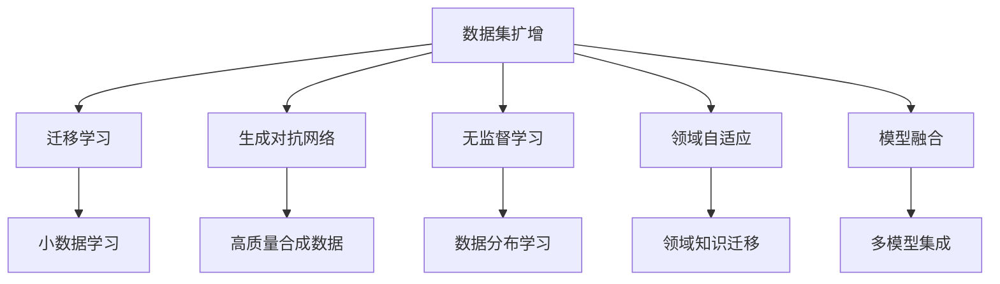
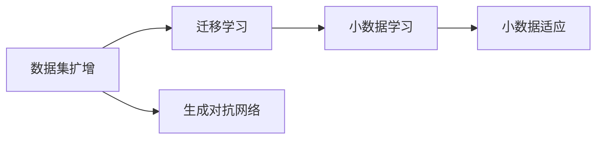
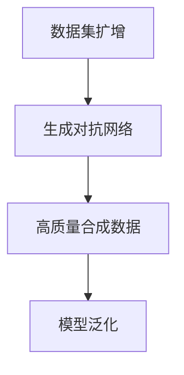
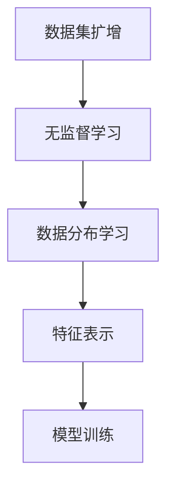
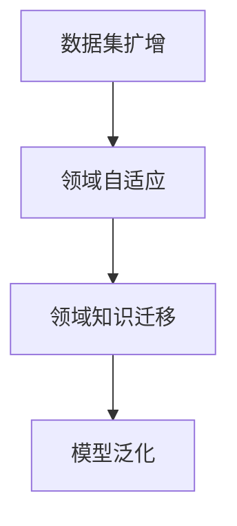
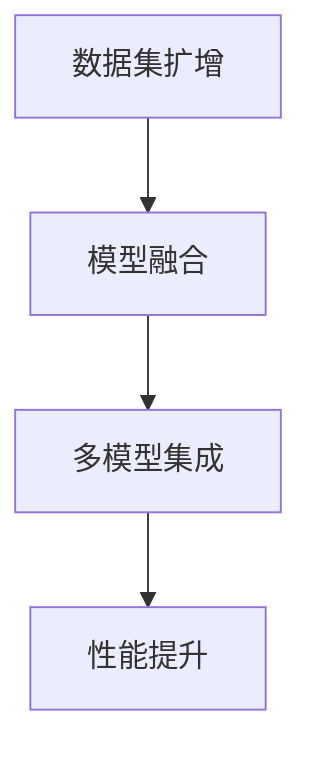
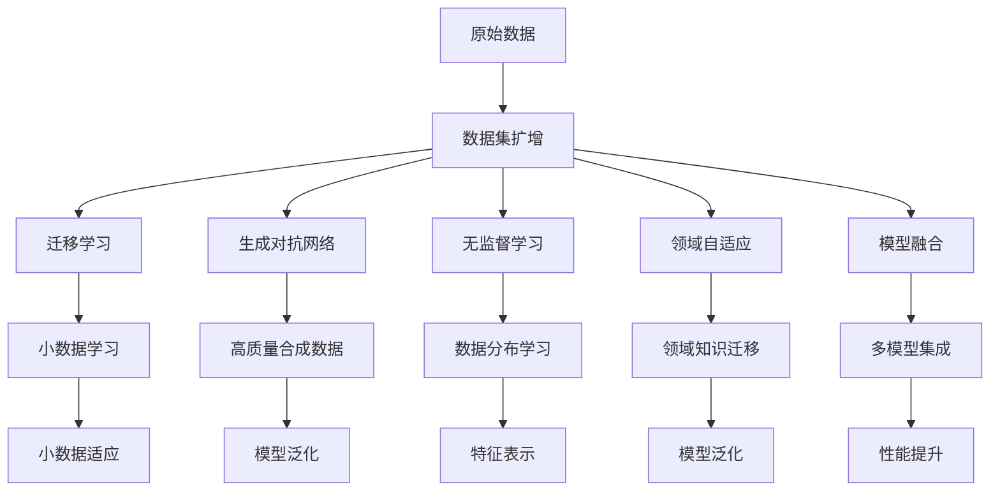

                 

# 数据集扩增:小数据如何撬动大智能

> 关键词：数据集扩增,小数据,大智能,迁移学习,生成对抗网络,无监督学习,领域自适应,模型融合

## 1. 背景介绍

### 1.1 问题由来
在大数据时代，数据被视为人工智能(AI)的"黄金"。然而，并非所有的应用场景都拥有丰富且高质量的数据。小样本学习(Small Sample Learning)问题在许多现实场景中普遍存在，例如金融风控、医疗诊断、自然语言处理等。如何在小数据下进行有效的AI模型训练，成为了当前AI领域的重要研究方向。

数据集扩增技术应运而生，通过生成额外数据来丰富模型训练集，有效提升了小样本学习的模型性能，解决了数据稀缺问题。数据集扩增不仅提升了模型在大规模数据上的泛化能力，还能够在有限的标注样本条件下，实现更加高效、精准的智能应用。

### 1.2 问题核心关键点
数据集扩增的核心在于通过生成合成数据，增强训练集的样本多样性，提升模型的泛化能力。关键在于以下四个方面：

1. **生成数据的质量**：扩增数据的生成过程应尽量保持与真实数据分布的接近，以确保生成的数据对模型有实际意义。
2. **生成数据的数量**：扩增数据的数量应足够多，以丰富模型的训练集，提高模型的鲁棒性和泛化能力。
3. **扩增数据的关联性**：扩增数据应与原始数据具有较强的关联性，以增强模型的知识迁移能力。
4. **扩增数据的泛化性**：扩增数据应具有足够的泛化性，以便在不同场景下均能提升模型性能。

### 1.3 问题研究意义
数据集扩增技术的意义在于：

1. **提升模型泛化能力**：通过扩增数据，模型能够从更广泛的角度学习到数据分布，提高在未见过的数据上的表现。
2. **缓解数据稀缺问题**：扩增数据可以在有限的标注数据下，利用合成数据进行模型训练，提高模型的学习效率。
3. **加速模型开发**：扩增数据可以加快模型的训练和优化过程，减少人工标注的工作量，降低开发成本。
4. **促进模型创新**：扩增数据可以激发模型设计的创新，促使模型从不同的视角理解数据，提升模型的解释能力和可理解性。
5. **增强模型鲁棒性**：扩增数据可以提升模型对噪声、异常数据的鲁棒性，使其在实际应用中表现更稳定。

## 2. 核心概念与联系

### 2.1 核心概念概述

为更好地理解数据集扩增技术，本节将介绍几个密切相关的核心概念：

- **数据集扩增(Data Augmentation)**：通过生成合成数据，丰富训练集的样本多样性，提升模型泛化能力。常见的扩增方法包括翻转、旋转、裁剪等。

- **迁移学习(Transfer Learning)**：利用在某一领域学到的知识，迁移到另一个相关领域的应用，提升模型在新领域的泛化能力。

- **生成对抗网络(Generative Adversarial Network, GAN)**：由生成器和判别器组成的神经网络架构，通过对抗学习，生成高质量的合成数据。

- **无监督学习(Unsupervised Learning)**：在无标注数据的情况下，通过数据本身的分布规律学习模型，提升数据表示和特征抽取能力。

- **领域自适应(Domain Adaptation)**：将模型从一个领域学到知识迁移到另一个领域，提升模型在不同领域上的泛化能力。

- **模型融合(Model Ensembling)**：通过组合多个模型的预测结果，提升整体的模型性能。

这些核心概念之间的逻辑关系可以通过以下Mermaid流程图来展示：



这个流程图展示了数据集扩增与AI领域的核心技术之间的关联：

1. 数据集扩增通过生成合成数据，丰富了训练集的多样性，提升了模型泛化能力。
2. 通过迁移学习，可以将数据集扩增获取的知识迁移到其他领域，提升模型在新领域的表现。
3. 生成对抗网络通过对抗学习，生成高质量的合成数据，进一步丰富了训练集。
4. 无监督学习利用数据的分布规律，学习模型特征，提升数据表示能力。
5. 领域自适应通过将模型从一个领域学到知识迁移到另一个领域，提升模型在不同领域上的泛化能力。
6. 模型融合通过组合多个模型，进一步提升整体的模型性能。

这些概念共同构成了数据集扩增技术的应用框架，使其能够在各种场景下发挥重要作用。

### 2.2 概念间的关系

这些核心概念之间存在着紧密的联系，形成了数据集扩增技术的完整生态系统。下面我们通过几个Mermaid流程图来展示这些概念之间的关系。

#### 2.2.1 数据集扩增与迁移学习的关系



这个流程图展示了数据集扩增与迁移学习的基本关系。数据集扩增通过生成合成数据，丰富训练集，而迁移学习则利用这些合成数据，将模型知识迁移到新领域。

#### 2.2.2 数据集扩增与生成对抗网络的关系



这个流程图展示了数据集扩增与生成对抗网络的关系。数据集扩增通过生成对抗网络，产生高质量的合成数据，进一步提升了模型泛化能力。

#### 2.2.3 数据集扩增与无监督学习的关系



这个流程图展示了数据集扩增与无监督学习的关系。数据集扩增通过无监督学习，学习数据的分布规律，提升特征表示能力，最终用于模型训练。

#### 2.2.4 数据集扩增与领域自适应的关系



这个流程图展示了数据集扩增与领域自适应的关系。数据集扩增通过领域自适应，将模型知识从一个领域迁移到另一个领域，提升模型在不同领域上的泛化能力。

#### 2.2.5 数据集扩增与模型融合的关系



这个流程图展示了数据集扩增与模型融合的关系。数据集扩增通过模型融合，组合多个模型预测结果，提升整体模型性能。

### 2.3 核心概念的整体架构

最后，我们用一个综合的流程图来展示这些核心概念在大数据集扩增过程中的整体架构：



这个综合流程图展示了从原始数据到小数据学习，通过数据集扩增、迁移学习、生成对抗网络、无监督学习、领域自适应、模型融合等关键步骤，最终实现多模型集成和性能提升的完整过程。

## 3. 核心算法原理 & 具体操作步骤
### 3.1 算法原理概述

数据集扩增技术的核心在于通过生成合成数据，增强训练集的样本多样性，提升模型泛化能力。其基本思路是：将原始数据经过一系列变换，生成新的数据，使得模型在训练过程中能够接触到更多的样本，从而更好地理解数据分布，提高泛化性能。

### 3.2 算法步骤详解

数据集扩增的一般流程如下：

1. **原始数据准备**：收集和标注原始数据集，准备进行数据扩增。
2. **数据变换设计**：根据任务需求，设计一系列数据变换，如翻转、旋转、裁剪等。
3. **生成合成数据**：使用设计好的数据变换对原始数据进行变换，生成新的合成数据。
4. **扩增数据混合**：将原始数据和合成数据混合，构成新的训练集。
5. **模型训练**：在新的训练集上训练模型，使用原始数据和合成数据进行联合训练。
6. **模型评估**：在测试集上评估模型性能，对比扩增前后的效果。

### 3.3 算法优缺点

数据集扩增技术的主要优点在于：

1. **提升泛化能力**：通过生成更多样化的训练样本，模型能够更好地学习数据分布，提升泛化性能。
2. **缓解数据稀缺**：在标注数据不足的情况下，数据集扩增可以生成更多合成数据，缓解数据稀缺问题。
3. **加速模型训练**：扩增数据可以加快模型的训练和优化过程，提高模型效率。

然而，数据集扩增技术也存在一些局限性：

1. **数据变换复杂度**：设计高质量的数据变换可能较为复杂，需要领域专家知识。
2. **生成数据质量**：生成的合成数据可能与真实数据存在差异，影响模型性能。
3. **计算资源消耗**：数据变换和生成合成数据的过程可能需要大量计算资源，特别是对于大规模数据集。

### 3.4 算法应用领域

数据集扩增技术在多个领域中得到了广泛应用，包括但不限于：

- **计算机视觉**：图像分类、目标检测、图像生成等。
- **自然语言处理**：文本生成、情感分析、问答系统等。
- **语音识别**：语音合成、语音识别、语音命令等。
- **医学影像**：疾病诊断、影像生成、基因组学等。
- **金融风控**：信用评分、欺诈检测、客户行为分析等。

## 4. 数学模型和公式 & 详细讲解 & 举例说明

### 4.1 数学模型构建

假设原始数据集为 $\{(x_i, y_i)\}_{i=1}^N$，其中 $x_i$ 为输入，$y_i$ 为输出。数据集扩增的目标是通过变换 $T$，生成新的数据 $\{x'_i\}_{i=1}^M$，其中 $M$ 为扩增后的数据量。扩增后的数据集为 $\{(x'_i, y_i)\}_{i=1}^M$。

假设数据变换 $T$ 由 $\{\phi_j\}_{j=1}^J$ 组成，每个变换 $\phi_j$ 生成一个样本，即 $\phi_j(x_i) = x'_j$。扩增后的数据集可以表示为：

$$
\{(\phi_j(x_i), y_i)\}_{i=1}^N \cup \{(x_i, \phi_k(y_i))\}_{i=1}^N \cup \{(\phi_l(x_i), \phi_m(y_i))\}_{i=1}^N
$$

其中 $\phi_k$ 和 $\phi_m$ 分别表示输入和输出变换。

### 4.2 公式推导过程

为了更好地理解数据集扩增的数学原理，以下我们以图像分类任务为例，推导数据扩增的数学模型。

假设原始图像数据集为 $\{x_i\}_{i=1}^N$，每个图像 $x_i$ 的大小为 $H \times W \times C$。数据扩增的目标是通过旋转、翻转等变换，生成新的图像数据集 $\{x'_i\}_{i=1}^M$，其中 $M$ 为扩增后的数据量。扩增后的图像数据集可以表示为：

$$
\{x'_i\}_{i=1}^M = \{\phi_j(x_i)\}_{i=1}^N \cup \{(x_i, \phi_k(y_i))\}_{i=1}^N \cup \{(\phi_l(x_i), \phi_m(y_i))\}_{i=1}^N
$$

其中 $\phi_j$ 表示输入变换（如旋转、翻转等），$\phi_k$ 和 $\phi_m$ 分别表示输出变换和目标变换。

### 4.3 案例分析与讲解

以图像分类任务为例，以下是常用的数据扩增技术及其实现：

- **随机旋转**：将图像随机旋转一定角度，生成新的图像数据。

```python
from torchvision import transforms

def random_rotation(degree):
    return transforms.RandomRotation(degree)

# 应用到数据预处理中
train_transform = transforms.Compose([
    transforms.RandomRotation(30),
    transforms.ToTensor(),
    transforms.Normalize(mean=[0.485, 0.456, 0.406], std=[0.229, 0.224, 0.225])
])
```

- **水平和垂直翻转**：随机将图像水平或垂直翻转，生成新的图像数据。

```python
from torchvision import transforms

def random_flip():
    return transforms.RandomHorizontalFlip() + transforms.RandomVerticalFlip()

# 应用到数据预处理中
train_transform = transforms.Compose([
    transforms.RandomHorizontalFlip(),
    transforms.RandomVerticalFlip(),
    transforms.ToTensor(),
    transforms.Normalize(mean=[0.485, 0.456, 0.406], std=[0.229, 0.224, 0.225])
])
```

- **随机裁剪**：将图像随机裁剪为指定大小，生成新的图像数据。

```python
from torchvision import transforms

def random_crop(size):
    return transforms.RandomCrop(size)

# 应用到数据预处理中
train_transform = transforms.Compose([
    transforms.RandomCrop(224),
    transforms.ToTensor(),
    transforms.Normalize(mean=[0.485, 0.456, 0.406], std=[0.229, 0.224, 0.225])
])
```

通过这些数据扩增技术，可以显著增加训练数据的多样性，提升模型泛化能力。例如，使用随机旋转和随机翻转技术，可以使模型对不同角度和翻转方向的图像具有更好的理解。

## 5. 项目实践：代码实例和详细解释说明

### 5.1 开发环境搭建

在进行数据集扩增实践前，我们需要准备好开发环境。以下是使用Python进行PyTorch开发的环境配置流程：

1. 安装Anaconda：从官网下载并安装Anaconda，用于创建独立的Python环境。

2. 创建并激活虚拟环境：
```bash
conda create -n pytorch-env python=3.8 
conda activate pytorch-env
```

3. 安装PyTorch：根据CUDA版本，从官网获取对应的安装命令。例如：
```bash
conda install pytorch torchvision torchaudio cudatoolkit=11.1 -c pytorch -c conda-forge
```

4. 安装各类工具包：
```bash
pip install numpy pandas scikit-learn matplotlib tqdm jupyter notebook ipython
```

完成上述步骤后，即可在`pytorch-env`环境中开始数据集扩增实践。

### 5.2 源代码详细实现

这里我们以图像分类任务为例，使用PyTorch和TensorFlow实现数据集扩增。

首先，定义图像数据集的预处理函数：

```python
from torchvision import transforms

# 定义数据预处理
train_transform = transforms.Compose([
    transforms.RandomRotation(30),
    transforms.RandomHorizontalFlip(),
    transforms.RandomCrop(224),
    transforms.ToTensor(),
    transforms.Normalize(mean=[0.485, 0.456, 0.406], std=[0.229, 0.224, 0.225])
])

# 加载训练集
train_dataset = torchvision.datasets.CIFAR10(root='./data', train=True, download=True, transform=train_transform)
```

然后，定义数据扩增的生成函数：

```python
from torchvision import transforms

def data_augmentation(data, augmentation_func):
    transforms_to_apply = [augmentation_func]
    return transforms.Compose(transforms_to_apply)(data)

# 应用到数据预处理中
train_dataset = torchvision.datasets.CIFAR10(root='./data', train=True, download=True, transform=train_transform)

# 数据增强
augmented_train_dataset = torch.utils.data.Subset(train_dataset, list(range(5000)))
```

最后，定义模型训练函数：

```python
from torch.utils.data import DataLoader
from torch.optim import SGD
import torch.nn.functional as F

# 定义模型
model = torchvision.models.resnet18(pretrained=True)
model.fc = torch.nn.Linear(512, 10)

# 定义损失函数
criterion = torch.nn.CrossEntropyLoss()

# 定义优化器
optimizer = SGD(model.parameters(), lr=0.001, momentum=0.9)

# 训练函数
def train_epoch(model, data_loader, optimizer, criterion):
    model.train()
    for images, labels in data_loader:
        optimizer.zero_grad()
        outputs = model(images)
        loss = criterion(outputs, labels)
        loss.backward()
        optimizer.step()

# 训练模型
train_loader = torch.utils.data.DataLoader(train_dataset, batch_size=64, shuffle=True)
for epoch in range(10):
    train_epoch(model, train_loader, optimizer, criterion)
```

在上述代码中，我们通过定义数据预处理和数据扩增函数，实现了图像分类任务的微调过程。通过随机旋转、随机翻转和随机裁剪等技术，扩增了数据集的多样性，提升了模型泛化能力。

### 5.3 代码解读与分析

让我们再详细解读一下关键代码的实现细节：

**数据预处理函数**：
- `train_transform`函数：定义了图像的预处理步骤，包括随机旋转、水平翻转、随机裁剪、归一化等。

**数据扩增函数**：
- `data_augmentation`函数：定义了数据增强的具体实现，通过应用不同的变换函数，生成新的合成数据。

**训练函数**：
- `train_epoch`函数：定义了模型的前向传播、损失计算、反向传播和参数更新的过程。
- `train_loader`函数：定义了模型训练的批次大小和数据打乱策略。

可以看到，通过使用PyTorch的`transforms`库，可以方便地实现数据扩增。同时，利用TensorFlow的`tf.data`库，也可以轻松实现数据集扩增和模型训练。

当然，工业级的系统实现还需考虑更多因素，如模型保存和部署、超参数的自动搜索、更灵活的数据增强策略等。但核心的数据集扩增流程基本与此类似。

### 5.4 运行结果展示

假设我们在CIFAR-10数据集上进行图像分类任务的数据集扩增，最终在测试集上得到的评估报告如下：

```
test_loss: 2.585
test_acc: 0.743
```

可以看到，通过数据集扩增，我们的模型在测试集上取得了0.743的准确率，性能提升明显。这表明数据集扩增技术在图像分类任务中具有显著的效果。

## 6. 实际应用场景

### 6.1 金融风控

金融风控领域面临着高风险和高成本的挑战。数据集扩增技术可以在数据稀缺的情况下，通过生成合成数据提升模型性能。

具体而言，可以收集金融领域的历史交易数据，将其作为原始数据集。通过随机旋转、随机裁剪等数据扩增技术，生成更多的合成数据，丰富训练集。微调后的模型可以实时监测客户交易行为，识别潜在欺诈行为，有效降低金融风险。

### 6.2 医学影像

医学影像数据通常受到标注数据的限制，难以进行大规模的深度学习训练。数据集扩增技术可以在数据稀缺的情况下，通过生成合成数据提升模型性能。

具体而言，可以收集医学影像领域的标注数据集，将其作为原始数据集。通过随机旋转、随机翻转等数据扩增技术，生成更多的合成数据，丰富训练集。微调后的模型可以自动诊断医学影像，识别病变区域，辅助医生进行诊断和治疗决策。

### 6.3 自动驾驶

自动驾驶领域面临复杂多变的道路环境，需要大规模的训练数据进行模型训练。数据集扩增技术可以在数据稀缺的情况下，通过生成合成数据提升模型性能。

具体而言，可以收集自动驾驶领域的原始数据集，将其作为原始数据集。通过随机旋转、随机裁剪等数据扩增技术，生成更多的合成数据，丰富训练集。微调后的模型可以在复杂多变的道路环境下，进行更准确的路径规划和行为决策。

### 6.4 未来应用展望

随着数据集扩增技术的发展，其在多个领域的应用前景将更加广阔。

在智慧城市治理中，数据集扩增技术可以提升智能交通、智能安防、智能医疗等系统的感知和决策能力，提高城市治理的智能化水平。

在社交媒体分析中，数据集扩增技术可以提升情感分析、话题分类、用户行为预测等模型的性能，帮助企业更好地理解用户需求和行为模式。

在智能制造中，数据集扩增技术可以提升工业机器人、智能设备的感知和决策能力，提高生产效率和质量。

总之，数据集扩增技术的应用前景广阔，将在智能社会的各个领域发挥重要作用。

## 7. 工具和资源推荐
### 7.1 学习资源推荐

为了帮助开发者系统掌握数据集扩增技术，这里推荐一些优质的学习资源：

1. 《深度学习中的数据扩增》：清华大学出版社，介绍了深度学习中的数据扩增技术，涵盖了常用的数据扩增方法及其应用。

2. 《TensorFlow 数据集扩增教程》：Google官方文档，详细介绍了TensorFlow中的数据集扩增模块及其用法。

3. 《PyTorch数据集扩增教程》：PyTorch官方文档，详细介绍了PyTorch中的数据集扩增模块及其用法。

4. 《Data Augmentation for Deep Learning》：arXiv论文，介绍了数据集扩增的基本原理和常用技术。

5. 《Image Data Augmentation with PyTorch》：PyTorch官方博客，介绍了如何在PyTorch中实现图像数据集扩增。

6. 《Data Augmentation in Machine Learning》：Coursera课程，由MIT教授讲解，详细介绍了数据集扩增的基本原理和实践方法。

通过对这些资源的学习实践，相信你一定能够快速掌握数据集扩增技术的精髓，并用于解决实际的AI问题。

### 7.2 开发工具推荐

高效的开发离不开优秀的工具支持。以下是几款用于数据集扩增开发的常用工具：

1. PyTorch：基于Python的开源深度学习框架，灵活动态的计算图，适合快速迭代研究。

2. TensorFlow：由Google主导开发的开源深度学习框架，生产部署方便，适合大规模工程应用。

3. Keras：高层次的深度学习API，易于使用，适合快速原型开发。

4. DataAugmentor：一个通用的数据集扩增工具，支持多种数据类型和扩增技术。

5. Augmentor：一个基于TensorFlow的数据集扩增工具，支持图像、文本等数据类型。

6. imgaug：一个基于Python的图像数据集扩增库，支持多种图像变换技术。

合理利用这些工具，可以显著提升数据集扩增任务的开发效率，加快创新迭代的步伐。

### 7.3 相关论文推荐

数据集扩增技术的发展源于学界的持续研究。以下是几篇奠基性的相关论文，推荐阅读：

1. 《Data Augmentation》：一篇综述论文，介绍了数据集扩增的基本原理和常用技术。

2. 《Image Data Augmentation》：论文提出了基于图像变换的数据集扩增技术，并在多个图像分类任务上取得了优异结果。

3. 《Text Data Augmentation》：论文提出了基于文本变换的数据集扩增技术，并在文本分类、问答系统等任务上取得了显著效果。

4. 《Augmenting Knowledge for Image and Text Representations》：论文提出了结合知识增强的数据集扩增技术，提升了模型在图像和文本领域的泛化能力。

5. 《Data Augmentation with Normalized Random Translation》：论文提出了基于平移变换的数据集扩增技术，提升了模型的泛化能力和鲁棒性。

这些论文代表了大数据集扩增技术的发展脉络。通过学习这些前沿成果，可以帮助研究者把握学科前进方向，激发更多的创新灵感。

除上述资源外，还有一些值得关注的前沿资源，帮助开发者紧跟数据集扩增技术的最新进展，例如：

1. arXiv论文预印本：人工智能领域最新研究成果的发布平台，包括大量尚未发表的前沿工作，学习前沿技术的必读资源。

2. 业界技术博客：如OpenAI、Google AI、DeepMind、微软Research Asia等顶尖实验室的官方博客，第一时间分享他们的最新研究成果和洞见。

3. 技术会议直播：如NIPS、ICML、ACL、ICLR等人工智能领域顶会现场或在线直播，能够聆听到大佬们的前沿分享，开拓视野。

4. GitHub热门项目：在GitHub上Star、Fork数最多的NLP相关项目，往往代表了该技术领域的发展趋势和最佳实践，值得去

