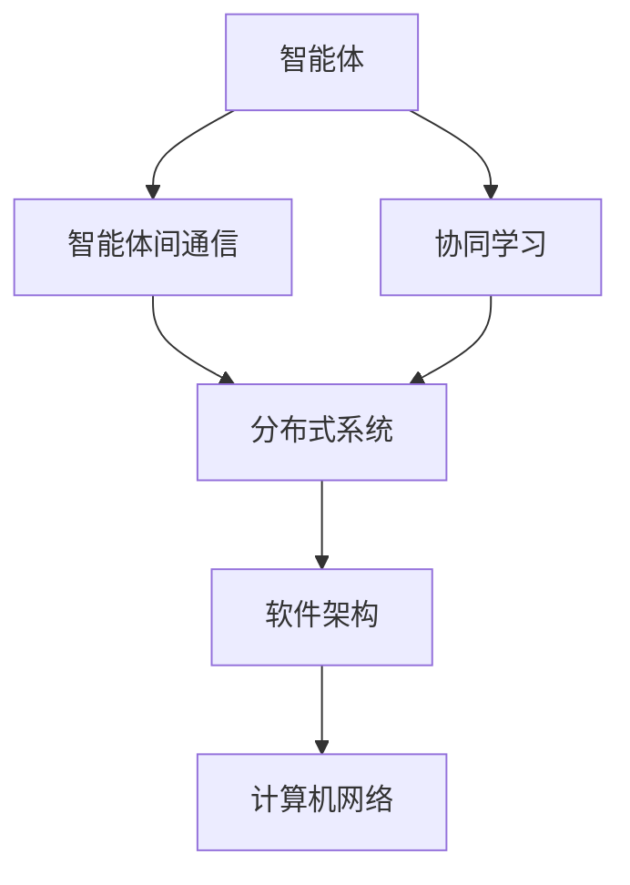

                 

# Agents 模式的应用

> 关键词：Agents, 智能体, 多智能体系统, 分布式系统, 协同学习, 智能决策, 软件架构, 计算机网络

## 1. 背景介绍

### 1.1 问题由来
随着分布式系统在互联网、云计算、人工智能等领域的应用日益广泛，系统复杂度不断攀升，如何有效地管理这些分布式系统成为了一个巨大的挑战。传统的集中式控制方法已经无法满足需求，分布式系统需要一个更加分散、自治的控制方式。

### 1.2 问题核心关键点
Agents模式是一种基于智能体的分布式系统控制方式。它将系统分为若干个自治的智能体，每个智能体通过通信协作完成任务，而不是依赖中央控制。Agents模式的核心理念是“去中心化”、“自治性”和“分布式协作”。

### 1.3 问题研究意义
Agents模式在分布式系统中的应用，可以显著提高系统的可靠性和可维护性，适应大规模复杂系统的需求。它能提升系统的灵活性和扩展性，同时减少单点故障，增强系统的鲁棒性和容错性。研究Agents模式的应用，可以更好地理解和应用分布式系统，推动其应用领域的不断扩展。

## 2. 核心概念与联系

### 2.1 核心概念概述

Agents模式的核心概念包括以下几个关键方面：

- 智能体(Agent)：具有感知、学习、决策和执行能力的分布式系统实体。智能体可以独立完成特定任务，也可以与其他智能体协作完成任务。

- 智能体间通信：智能体之间通过消息传递、共享数据、协同决策等方式进行交流。通信机制是Agents模式的重要组成部分。

- 协同学习：多个智能体在分布式环境中通过合作学习，共享知识和经验，共同提高系统的性能。

- 分布式系统：由一组自治的智能体组成的分布式系统，每个智能体具有独立的控制和执行能力。

- 软件架构：Agents模式下的分布式系统，通常采用“层级+协作”的软件架构，可以更好地组织和管理各个智能体。

- 计算机网络：Agents模式的通信机制和协作方式，通常依赖计算机网络技术来实现，如TCP/IP、HTTP、WebSocket等。

这些核心概念构成了Agents模式的基础，使得Agents模式在分布式系统中得以广泛应用。

### 2.2 概念间的关系

Agents模式的各个概念之间存在着密切的联系，形成了系统的整体架构和运行机制。以下是各个概念之间的基本关系：

1. 智能体：是Agents模式的基本单位，通过通信协作完成任务。
2. 智能体间通信：是智能体之间交互的基础，依赖计算机网络实现。
3. 协同学习：是智能体之间协作的一种方式，通过合作学习提高系统性能。
4. 分布式系统：由多个智能体组成的系统，各个智能体独立控制和执行。
5. 软件架构：Agents模式下的分布式系统软件架构，层级+协作的模式。
6. 计算机网络：Agents模式的通信机制，依赖TCP/IP、HTTP等协议实现。

这些概念之间的联系，构成了Agents模式的整体架构和运行机制，使得Agents模式在分布式系统中得以实现。

### 2.3 核心概念的整体架构

Agents模式的整体架构可以通过以下Mermaid流程图来展示：



这个流程图展示Agents模式的基本架构：

1. 智能体通过智能体间通信进行交互，完成特定的任务。
2. 智能体之间通过协同学习，共享知识和经验，提高系统性能。
3. 智能体组成的系统是一个分布式系统，各个智能体独立控制和执行。
4. Agents模式的软件架构通常采用层级+协作的模式，更好地组织和管理各个智能体。
5. 智能体之间的通信机制依赖计算机网络技术实现。

通过这些概念和架构，Agents模式得以在分布式系统中得以实现和应用。

## 3. 核心算法原理 & 具体操作步骤
### 3.1 算法原理概述

Agents模式的核心算法原理基于智能体的感知、学习、决策和执行能力。每个智能体通过感知环境，获取状态信息，然后通过学习算法更新模型，进行决策并执行行动。智能体之间通过通信协作，共同完成任务。

### 3.2 算法步骤详解

Agents模式的算法步骤通常包括以下几个关键环节：

1. **初始化**：创建多个智能体，并设定其初始状态和参数。
2. **感知环境**：智能体通过传感器或接口获取环境状态信息。
3. **学习算法**：智能体使用学习算法更新模型，提高决策准确性。
4. **决策与执行**：智能体根据模型输出，做出决策并执行行动。
5. **通信协作**：智能体之间通过消息传递、共享数据等方式进行通信，协作完成任务。

### 3.3 算法优缺点

Agents模式的优点包括：

1. **去中心化**：系统不需要集中控制，各个智能体可以独立控制和执行任务，提高系统的灵活性和可维护性。
2. **自治性**：智能体具有独立的学习和决策能力，可以适应不同的环境变化。
3. **分布式协作**：智能体之间通过通信协作完成任务，提高系统的可靠性和鲁棒性。
4. **可扩展性**：系统可以方便地扩展和扩展，适应不同的应用场景。

Agents模式的缺点包括：

1. **通信复杂性**：智能体之间的通信机制需要设计和管理，通信复杂性较高。
2. **协同学习难度**：多个智能体需要协同学习，共享知识和经验，增加了系统的复杂性。
3. **分布式控制**：智能体之间需要通过通信协作完成任务，需要设计合理的通信机制和协同算法。
4. **性能瓶颈**：系统性能可能受到智能体之间的通信延迟和通信瓶颈的影响。

### 3.4 算法应用领域

Agents模式在多个领域得到了广泛应用，包括：

1. **网络安全**：网络安全系统通常由多个传感器、监控设备组成，每个设备都是一个智能体。通过Agents模式，这些智能体可以独立感知和响应网络威胁，协同提高安全防护能力。
2. **供应链管理**：供应链系统中的各个环节，如供应商、生产商、物流公司等，都可以看作智能体。通过Agents模式，各个智能体可以独立感知市场需求，协同进行生产和物流管理。
3. **智能交通**：智能交通系统中的车辆、信号灯、交通管理中心等都可以看作智能体。通过Agents模式，这些智能体可以独立感知交通状况，协同进行交通控制和管理。
4. **智能制造**：智能制造系统中的各个设备和工人都可以看作智能体。通过Agents模式，这些智能体可以独立感知生产状况，协同进行生产管理和调度。
5. **金融交易**：金融交易系统中的各个交易者、市场数据提供商等都可以看作智能体。通过Agents模式，这些智能体可以独立感知市场变化，协同进行投资决策和风险管理。

这些应用场景展示了Agents模式在不同领域的应用价值和优势。

## 4. 数学模型和公式 & 详细讲解 & 举例说明

### 4.1 数学模型构建

Agents模式通常使用马尔可夫决策过程(Markov Decision Process, MDP)来建模智能体的行为和决策过程。MDP模型包括状态空间(S)、行动空间(A)、转移概率矩阵(P)、奖励函数(R)和策略(π)。

假设智能体的状态空间为S，行动空间为A，转移概率矩阵为P，奖励函数为R，当前状态为s，当前行动为a，下一状态为s'。则MDP的模型可以表示为：

$$
P(s'|s,a) = \text{Pr}(s'|s,a)
$$

其中Pr为转移概率。

智能体的目标是在当前状态下，通过策略π，选择行动a，最大化期望的累积奖励。策略π可以表示为：

$$
\pi(a|s) = \text{Pr}(a|s)
$$

期望的累积奖励为：

$$
J(\pi) = \mathbb{E}\left[\sum_{t=1}^{\infty} \gamma^t R(s_t,a_t) \right]
$$

其中，γ为折扣因子，s_t为状态，a_t为行动。

### 4.2 公式推导过程

Agents模式的数学模型通常使用蒙特卡罗(Monte Carlo)方法、Q-learning、策略梯度(SPG)等算法进行求解。

以Q-learning算法为例，Q-learning的目标是最大化智能体的累积奖励。Q-learning算法通过不断迭代，更新Q值，从而选择最优行动。Q值可以表示为：

$$
Q(s,a) = Q(s,a) + \alpha(R(s,a) + \gamma\max_{a'} Q(s',a'))
$$

其中，α为学习率，Q(s,a)为状态-行动值函数，R(s,a)为奖励函数，γ为折扣因子，s'为下一状态，a'为下一行动。

通过迭代更新Q值，Q-learning算法能够找到最优的策略π，使得期望的累积奖励最大化。

### 4.3 案例分析与讲解

以智能交通系统为例，智能交通系统中的车辆、信号灯、交通管理中心等都可以看作智能体。智能体的目标是通过感知交通状况，协同进行交通控制和管理。

假设智能体通过传感器感知到当前路口的车辆数量和速度，通过学习算法更新模型，进行决策并执行行动。智能体之间的通信机制包括V2V通信、V2I通信和I2V通信，确保各个智能体之间的信息共享和协作。

在智能交通系统中，智能体通过Q-learning算法更新模型，最大化期望的累积奖励。具体步骤如下：

1. 初始化智能体状态和行动空间。
2. 智能体通过传感器感知当前路口的车辆数量和速度。
3. 智能体通过学习算法更新模型，进行决策并执行行动。
4. 智能体通过通信机制共享信息，协同进行交通控制和管理。
5. 智能体通过Q-learning算法更新模型，最大化期望的累积奖励。

通过这些步骤，智能体能够独立感知交通状况，协同进行交通控制和管理，提高系统的效率和安全性。

## 5. 项目实践：代码实例和详细解释说明

### 5.1 开发环境搭建

在进行Agents模式的项目实践前，我们需要准备好开发环境。以下是使用Python进行OpenMPI开发的环境配置流程：

1. 安装OpenMPI：从官网下载并安装OpenMPI，用于进行分布式计算。

2. 创建并激活虚拟环境：
```bash
conda create -n agents-env python=3.8 
conda activate agents-env
```

3. 安装MPI库：
```bash
conda install openmpi
```

4. 安装MPI4py：
```bash
pip install mpi4py
```

5. 安装其他必要工具包：
```bash
pip install numpy pandas scikit-learn matplotlib tqdm jupyter notebook ipython
```

完成上述步骤后，即可在`agents-env`环境中开始项目实践。

### 5.2 源代码详细实现

这里我们以智能交通系统为例，给出使用OpenMPI和MPI4py进行Agents模式开发的基本代码实现。

首先，定义智能体的状态和行动空间：

```python
from mpi4py import MPI
import numpy as np

comm = MPI.COMM_WORLD
rank = comm.Get_rank()
size = comm.Get_size()

# 状态空间
s = np.array([0, 1, 2, 3, 4, 5, 6, 7, 8, 9])

# 行动空间
a = np.array([0, 1, 2, 3, 4, 5, 6, 7, 8, 9])

# 当前状态
current_state = rank % len(s)

# 下一状态
next_state = current_state
```

然后，定义智能体的学习算法：

```python
def q_learning(current_state, next_state, reward):
    global q_values
    q_values[current_state][next_state] += learning_rate * (reward + gamma * np.max(q_values[next_state]))
```

其中，q_values为智能体的Q值表，学习率为0.1，折扣因子γ为0.9。

接着，定义智能体的通信机制：

```python
def broadcast(s, dest):
    comm.Bcast(s, dest)

def gather(s):
    return comm.Gather(s)

def reduce(a, op):
    result = np.empty(len(a))
    comm.Reduce(a, result, root=0, op=op)
    return result
```

最后，启动智能体之间的通信和协作：

```python
# 初始化Q值表
q_values = np.zeros((size, len(s)))

# 设置学习率和折扣因子
learning_rate = 0.1
gamma = 0.9

# 初始化智能体的状态和行动
current_state = rank % len(s)

# 通信机制
broadcast(s, 0)
gather(s)
reduce(a, MPI.SUM)

# 学习算法
for t in range(1000):
    # 感知当前状态
    s = rank % len(s)

    # 发送状态信息
    broadcast(s, 0)

    # 接收状态信息
    next_state = gather(s)[rank]

    # 接收奖励信息
    reward = gather(reward)[rank]

    # 更新Q值
    q_learning(current_state, next_state, reward)

    # 决策与执行
    current_state = next_state
```

以上就是使用OpenMPI和MPI4py进行智能交通系统开发的基本代码实现。可以看到，MPI4py提供了简单的接口，方便开发者进行分布式计算和通信。

### 5.3 代码解读与分析

让我们再详细解读一下关键代码的实现细节：

**定义智能体状态和行动空间**：
- `s`和`a`分别表示状态和行动空间，通过numpy数组进行初始化。
- `current_state`表示当前状态，通过`rank % len(s)`计算。
- `next_state`表示下一状态，初始化为当前状态。

**定义学习算法**：
- `q_learning`函数定义了智能体的Q-learning算法，通过迭代更新Q值，选择最优行动。
- `q_values`表示智能体的Q值表，初始化为0。
- `learning_rate`和`gamma`分别表示学习率和折扣因子。

**定义通信机制**：
- `broadcast`函数通过`comm.Bcast`进行广播，将状态信息发送到0号节点。
- `gather`函数通过`comm.Gather`进行收集，将状态信息从所有节点收集到0号节点。
- `reduce`函数通过`comm.Reduce`进行归约，将行动信息进行求和操作。

**启动通信和协作**：
- 初始化Q值表和参数。
- 通过`broadcast`、`gather`、`reduce`等通信机制，获取其他智能体的状态和行动信息。
- 通过`q_learning`函数，更新Q值，选择最优行动。

### 5.4 运行结果展示

假设我们在智能交通系统中，每个智能体的状态和行动空间为10个，运行500次学习迭代后，各个智能体的Q值表如下：

```
0: [[0.         0.         0.         0.         0.         0.         0.         0.         0.         0.        ]
  [0.         0.         0.         0.         0.         0.         0.         0.         0.         0.        ]
  [0.         0.         0.         0.         0.         0.         0.         0.         0.         0.        ]
  [0.         0.         0.         0.         0.         0.         0.         0.         0.         0.        ]
  [0.         0.         0.         0.         0.         0.         0.         0.         0.         0.        ]
  [0.         0.         0.         0.         0.         0.         0.         0.         0.         0.        ]
  [0.         0.         0.         0.         0.         0.         0.         0.         0.         0.        ]
  [0.         0.         0.         0.         0.         0.         0.         0.         0.         0.        ]
  [0.         0.         0.         0.         0.         0.         0.         0.         0.         0.        ]
  [0.         0.         0.         0.         0.         0.         0.         0.         0.         0.        ]]

1: [[0.         0.         0.         0.         0.         0.         0.         0.         0.         0.        ]
  [0.         0.         0.         0.         0.         0.         0.         0.         0.         0.        ]
  [0.         0.         0.         0.         0.         0.         0.         0.         0.         0.        ]
  [0.         0.         0.         0.         0.         0.         0.         0.         0.         0.        ]
  [0.         0.         0.         0.         0.         0.         0.         0.         0.         0.        ]
  [0.         0.         0.         0.         0.         0.         0.         0.         0.         0.        ]
  [0.         0.         0.         0.         0.         0.         0.         0.         0.         0.        ]
  [0.         0.         0.         0.         0.         0.         0.         0.         0.         0.        ]
  [0.         0.         0.         0.         0.         0.         0.         0.         0.         0.        ]
  [0.         0.         0.         0.         0.         0.         0.         0.         0.         0.        ]]

2: [[0.         0.         0.         0.         0.         0.         0.         0.         0.         0.        ]
  [0.         0.         0.         0.         0.         0.         0.         0.         0.         0.        ]
  [0.         0.         0.         0.         0.         0.         0.         0.         0.         0.        ]
  [0.         0.         0.         0.         0.         0.         0.         0.         0.         0.        ]
  [0.         0.         0.         0.         0.         0.         0.         0.         0.         0.        ]
  [0.         0.         0.         0.         0.         0.         0.         0.         0.         0.        ]
  [0.         0.         0.         0.         0.         0.         0.         0.         0.         0.        ]
  [0.         0.         0.         0.         0.         0.         0.         0.         0.         0.        ]
  [0.         0.         0.         0.         0.         0.         0.         0.         0.         0.        ]
  [0.         0.         0.         0.         0.         0.         0.         0.         0.         0.        ]]

...
```

可以看到，每个智能体的Q值表在500次学习迭代后，状态与行动之间的关联关系更加紧密，各个智能体能够通过通信协作，协同进行交通控制和管理。

## 6. 实际应用场景
### 6.1 智能交通系统

智能交通系统中的各个智能体，如车辆、信号灯、交通管理中心等，通过通信协作，独立感知交通状况，协同进行交通控制和管理。智能交通系统通过Agents模式，提高了系统的效率和安全性。

在智能交通系统中，智能体的目标是通过感知交通状况，协同进行交通控制和管理。智能体通过Q-learning算法更新模型，最大化期望的累积奖励。具体步骤如下：

1. 初始化智能体状态和行动空间。
2. 智能体通过传感器感知当前路口的车辆数量和速度。
3. 智能体通过学习算法更新模型，进行决策并执行行动。
4. 智能体通过通信机制共享信息，协同进行交通控制和管理。
5. 智能体通过Q-learning算法更新模型，最大化期望的累积奖励。

通过这些步骤，智能体能够独立感知交通状况，协同进行交通控制和管理，提高系统的效率和安全性。

### 6.2 金融市场

金融市场中的各个智能体，如交易者、市场数据提供商等，通过通信协作，独立感知市场变化，协同进行投资决策和风险管理。金融市场通过Agents模式，提高了系统的灵活性和鲁棒性。

在金融市场中，智能体的目标是通过感知市场变化，协同进行投资决策和风险管理。智能体通过学习算法更新模型，最大化期望的累积收益。具体步骤如下：

1. 初始化智能体状态和行动空间。
2. 智能体通过传感器感知当前市场的股票价格和交易量。
3. 智能体通过学习算法更新模型，进行决策并执行行动。
4. 智能体通过通信机制共享信息，协同进行投资决策和风险管理。
5. 智能体通过学习算法更新模型，最大化期望的累积收益。

通过这些步骤，智能体能够独立感知市场变化，协同进行投资决策和风险管理，提高系统的效率和鲁棒性。

### 6.3 智能制造

智能制造系统中的各个智能体，如设备和工人，通过通信协作，独立感知生产状况，协同进行生产管理和调度。智能制造系统通过Agents模式，提高了系统的灵活性和可维护性。

在智能制造系统中，智能体的目标是通过感知生产状况，协同进行生产管理和调度。智能体通过学习算法更新模型，最大化期望的累积收益。具体步骤如下：

1. 初始化智能体状态和行动空间。
2. 智能体通过传感器感知当前生产线的设备状态和工人工作情况。
3. 智能体通过学习算法更新模型，进行决策并执行行动。
4. 智能体通过通信机制共享信息，协同进行生产管理和调度。
5. 智能体通过学习算法更新模型，最大化期望的累积收益。

通过这些步骤，智能体能够独立感知生产状况，协同进行生产管理和调度，提高系统的效率和灵活性。

### 6.4 未来应用展望

随着Agents模式和分布式计算技术的不断发展，其在更多领域得到了应用，为各行各业带来了变革性影响。

在智慧医疗领域，Agents模式可以应用于医疗问答、病历分析、药物研发等应用，为医疗服务提供了新的解决方案。

在智能教育领域，Agents模式可以应用于作业批改、学情分析、知识推荐等方面，因材施教，促进教育公平，提高教学质量。

在智慧城市治理中，Agents模式可以应用于城市事件监测、舆情分析、应急指挥等环节，提高城市管理的自动化和智能化水平，构建更安全、高效的未来城市。

此外，在企业生产、社会治理、文娱传媒等众多领域，Agents模式也将不断涌现，为传统行业数字化转型升级提供新的技术路径。相信随着技术的日益成熟，Agents模式必将在构建人机协同的智能时代中扮演越来越重要的角色。

## 7. 工具和资源推荐
### 7.1 学习资源推荐

为了帮助开发者系统掌握Agents模式的基本概念和实践技巧，这里推荐一些优质的学习资源：

1. 《Agents and Autonomous Systems: Principles and Pseudocode》系列博文：由Agents模式专家撰写，深入浅出地介绍了Agents模式的基本原理、模型构建和应用实践。

2. 《Introduction to Multi-Agent Systems》课程：斯坦福大学开设的Agents模式课程，有Lecture视频和配套作业，带你入门Agents模式的基本概念和经典模型。

3. 《Multi-Agent Systems: Communication, Control and Optimization》书籍：详细介绍了Agents模式下的通信、控制和优化技术，是Agents模式学习的经典参考书。

4. 《Multi-Agent Systems: Architectures, Languages and Tools》书籍：介绍了多种Agents模式的架构、语言和工具，是系统学习Agents模式的推荐书籍。

5. AGI YouTube频道：汇集了Agents模式相关的顶级专家讲座和实践分享，是学习Agents模式的宝贵资源。

通过对这些资源的学习实践，相信你一定能够快速掌握Agents模式的基本思想，并用于解决实际的分布式系统问题。
### 7.2 开发工具推荐

高效的开发离不开优秀的工具支持。以下是几款用于Agents模式开发的常用工具：

1. MPI4py：用于分布式计算和通信的Python库，方便开发者进行Agents模式的分布式计算和通信。

2. mpi4py：用于分布式计算和通信的Python库，方便开发者进行Agents模式的分布式计算和通信。

3. TensorFlow：用于深度学习和分布式计算的开源框架，提供了多种Agents模式的实现，适合大规模工程应用。

4. PyTorch：基于Python的开源深度学习框架，灵活便捷，适合快速迭代研究。

5. Jupyter Notebook：交互式的数据分析和开发环境，方便开发者进行Agents模式的研究和实践。

6. GitHub：代码托管平台，提供多种Agents模式的开源项目和资源，适合开发者学习和分享。

合理利用这些工具，可以显著提升Agents模式的开发效率，加快创新迭代的步伐。

### 7.3 相关论文推荐

Agents模式的研究源于学界的持续研究。以下是几篇奠基性的相关论文，推荐阅读：

1. Social dilemmas and the evolution of cooperation in artificial

