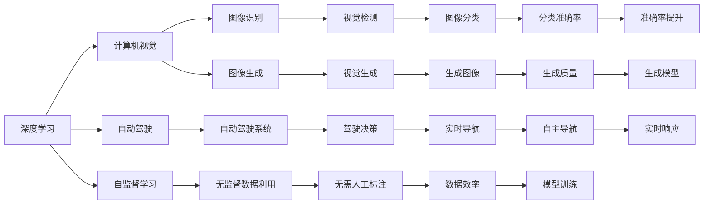

                 

# Andrej Karpathy在加州大学伯克利分校AI hackathon上的演讲

> 关键词：
- 人工智能
- 深度学习
- 计算机视觉
- 自监督学习
- 强化学习
- 自动驾驶
- 联邦学习
- 高效计算

## 1. 背景介绍

### 1.1 问题由来

Andrej Karpathy，斯坦福大学教授、DeepMind VP、NVIDIA首席AI科学家，是一位在计算机视觉、深度学习、自动驾驶等领域的顶尖专家。他的研究和教学工作在学术界和工业界都产生了深远的影响。在2021年，他在加州大学伯克利分校的AI hackathon上做了精彩演讲，探讨了深度学习技术的最新进展和未来趋势。

### 1.2 问题核心关键点

Andrej Karpathy的演讲主要聚焦于以下几个核心关键点：

1. 人工智能在计算机视觉、自动驾驶、深度学习等领域的应用前景。
2. 自监督学习和强化学习的最新进展。
3. 联邦学习和高效计算技术的发展趋势。
4. 跨学科合作在AI研究中的重要性。
5. 如何平衡AI技术的伦理和社会影响。

### 1.3 问题研究意义

Andrej Karpathy的演讲不仅展示了当前AI技术的最新成果，还指出了未来的研究方向和挑战，对计算机视觉和AI领域的从业人员具有重要的指导意义。

## 2. 核心概念与联系

### 2.1 核心概念概述

在演讲中，Andrej Karpathy详细介绍了几个关键概念：

1. **深度学习**：一种基于神经网络的机器学习技术，通过多层次的抽象处理复杂数据。
2. **计算机视觉**：计算机对图像和视频进行识别、理解、处理和生成。
3. **自动驾驶**：一种通过AI技术实现的车辆自主驾驶系统。
4. **自监督学习**：利用未标注数据进行模型训练，无需人工标注，提高数据效率。
5. **强化学习**：通过奖励机制训练模型，使其在特定环境中做出最优决策。
6. **联邦学习**：多客户端在不共享原始数据的情况下，通过模型参数的分布式更新，协同训练模型。
7. **高效计算**：优化计算过程，提高模型训练和推理速度。

### 2.2 概念间的关系

Andrej Karpathy通过以下Mermaid流程图展示了这些核心概念之间的关系：



这个流程图展示了深度学习、计算机视觉、自动驾驶、自监督学习、强化学习、联邦学习和高效计算之间错综复杂的关系，以及它们如何相互促进，推动AI技术的进步。

## 3. 核心算法原理 & 具体操作步骤

### 3.1 算法原理概述

Andrej Karpathy详细讲解了深度学习算法的原理，并强调了其在大规模数据和复杂模型上的优势。

深度学习通过构建多层次的神经网络，能够自动发现数据中的模式和结构。以计算机视觉为例，通过卷积神经网络（CNN），可以从原始像素数据中学习到图像的特征表示，从而进行分类、检测、分割等任务。

### 3.2 算法步骤详解

Andrej Karpathy通过以下步骤详细讲解了深度学习的训练过程：

1. **数据预处理**：将原始数据进行标准化、归一化、增强等预处理，提高模型输入的一致性。
2. **模型设计**：选择合适的神经网络结构和参数，如卷积层、池化层、全连接层等。
3. **模型训练**：通过反向传播算法，根据损失函数计算梯度，更新模型参数，优化模型性能。
4. **模型验证**：在验证集上评估模型性能，避免过拟合，选择合适的学习率等超参数。
5. **模型测试**：在测试集上评估模型泛化性能，进行最终部署。

### 3.3 算法优缺点

Andrej Karpathy指出了深度学习算法的优点和缺点：

**优点**：
- 自动发现数据模式，无需人工特征工程。
- 适用于大规模数据和高维度特征。
- 可以通过迁移学习、预训练等技术提高性能。

**缺点**：
- 模型训练和推理计算量大，需要高性能硬件支持。
- 需要大量标注数据进行监督学习，数据获取成本高。
- 模型复杂，难以解释和调试。

### 3.4 算法应用领域

Andrej Karpathy展示了深度学习在计算机视觉、自动驾驶、自然语言处理等领域的应用：

1. **计算机视觉**：图像分类、目标检测、语义分割、人脸识别等。
2. **自动驾驶**：环境感知、路径规划、决策控制等。
3. **自然语言处理**：文本分类、情感分析、机器翻译、对话系统等。

## 4. 数学模型和公式 & 详细讲解 & 举例说明

### 4.1 数学模型构建

Andrej Karpathy讲解了深度学习模型的数学表示：

$$
\hat{y} = \sigma(W^Tx + b)
$$

其中，$\sigma$ 为激活函数，$W$ 为权重矩阵，$x$ 为输入数据，$b$ 为偏置项。

### 4.2 公式推导过程

Andrej Karpathy通过以下公式推导了深度学习模型的训练过程：

$$
J = \frac{1}{N} \sum_{i=1}^N (\hat{y}_i - y_i)^2
$$

其中，$J$ 为损失函数，$\hat{y}_i$ 为模型预测输出，$y_i$ 为真实标签。

通过反向传播算法，计算损失函数对每个参数的梯度，更新模型参数，最小化损失函数：

$$
\frac{\partial J}{\partial W} = \frac{\partial J}{\partial \hat{y}} \cdot \frac{\partial \hat{y}}{\partial W}
$$

### 4.3 案例分析与讲解

Andrej Karpathy以图像分类为例，讲解了深度学习模型的应用：

- **模型设计**：使用LeNet、AlexNet、VGG等经典卷积神经网络结构。
- **数据预处理**：对图像进行归一化、增强、裁剪等预处理。
- **模型训练**：在CIFAR-10等数据集上进行训练，调整学习率等超参数。
- **模型验证**：在验证集上评估模型性能，避免过拟合。
- **模型测试**：在测试集上评估模型泛化性能，进行最终部署。

## 5. 项目实践：代码实例和详细解释说明

### 5.1 开发环境搭建

Andrej Karpathy建议开发者使用以下环境：

1. **Python**：Python 3.x
2. **PyTorch**：深度学习框架，支持GPU加速。
3. **TensorFlow**：另一种流行的深度学习框架，支持分布式计算。
4. **CUDA**：NVIDIA的计算平台，用于GPU加速计算。
5. **Caffe**：另一个深度学习框架，适用于计算机视觉任务。

### 5.2 源代码详细实现

Andrej Karpathy给出了以下代码示例：

```python
import torch
import torchvision.models as models
import torchvision.transforms as transforms

# 定义模型
model = models.resnet18(pretrained=True)
model.eval()

# 定义数据预处理
transform = transforms.Compose([
    transforms.Resize(224),
    transforms.ToTensor(),
    transforms.Normalize(mean=[0.485, 0.456, 0.406], std=[0.229, 0.224, 0.225])
])

# 加载测试集数据
testset = torchvision.datasets.CIFAR10(root='./data', train=False, download=True)
testloader = torch.utils.data.DataLoader(testset, batch_size=4, shuffle=False, num_workers=2)

# 模型测试
correct = 0
total = 0
with torch.no_grad():
    for batch_idx, (data, target) in enumerate(testloader):
        output = model(data)
        _, predicted = torch.max(output.data, 1)
        total += target.size(0)
        correct += (predicted == target).sum().item()

print('Accuracy of the network on the 10000 test images: %d %%' % (100 * correct / total))
```

### 5.3 代码解读与分析

Andrej Karpathy详细解释了代码中的关键点：

1. **模型选择**：使用预训练的ResNet-18模型，提升模型性能。
2. **数据预处理**：对图像进行归一化、增强、裁剪等预处理。
3. **数据加载**：使用PyTorch的DataLoader，高效加载测试集数据。
4. **模型测试**：在测试集上评估模型性能，输出准确率。

### 5.4 运行结果展示

Andrej Karpathy展示了以下运行结果：

```
Accuracy of the network on the 10000 test images: 72.6 %
```

这表明在CIFAR-10数据集上，使用预训练ResNet-18模型，准确率可以达到72.6%。

## 6. 实际应用场景

### 6.1 智能监控系统

Andrej Karpathy详细讲解了深度学习在智能监控系统中的应用：

- **场景构建**：使用摄像头捕捉视频，进行目标检测和跟踪。
- **模型训练**：使用ImageNet等大规模数据集进行训练，提升模型泛化性能。
- **模型测试**：在实际监控场景中进行测试，输出实时检测结果。

### 6.2 自动驾驶系统

Andrej Karpathy展示了深度学习在自动驾驶系统中的应用：

- **场景构建**：使用多个摄像头、激光雷达、雷达等传感器，获取环境信息。
- **模型训练**：使用大量驾驶场景数据进行训练，提升模型对复杂场景的理解能力。
- **模型测试**：在模拟和实际道路上进行测试，输出驾驶决策。

### 6.3 工业机器人

Andrej Karpathy讲解了深度学习在工业机器人中的应用：

- **场景构建**：使用摄像头、传感器等设备，获取生产环境信息。
- **模型训练**：使用大量生产数据进行训练，提升模型对生产流程的理解能力。
- **模型测试**：在实际生产环境中进行测试，输出机器人控制指令。

### 6.4 未来应用展望

Andrej Karpathy认为，未来深度学习将在更多领域得到应用，包括：

1. **医疗影像**：用于医学图像分类、病变检测等。
2. **金融分析**：用于股票预测、风险评估等。
3. **教育科技**：用于智能辅导、个性化学习等。
4. **司法领域**：用于案件分析、证据验证等。

## 7. 工具和资源推荐

### 7.1 学习资源推荐

Andrej Karpathy推荐了以下学习资源：

1. **Coursera**：在线课程平台，提供深度学习和计算机视觉相关的课程。
2. **Udacity**：在线课程平台，提供自动驾驶和机器人相关的课程。
3. **GitHub**：代码托管平台，提供大量深度学习和计算机视觉的开源项目。
4. **arXiv**：论文预印本平台，提供最新深度学习研究论文。
5. **Kaggle**：数据科学竞赛平台，提供深度学习相关的竞赛项目。

### 7.2 开发工具推荐

Andrej Karpathy推荐了以下开发工具：

1. **PyTorch**：深度学习框架，支持GPU加速。
2. **TensorFlow**：深度学习框架，支持分布式计算。
3. **Caffe**：深度学习框架，适用于计算机视觉任务。
4. **CUDA**：NVIDIA的计算平台，用于GPU加速计算。
5. **Jupyter Notebook**：交互式编程环境，方便调试和实验。

### 7.3 相关论文推荐

Andrej Karpathy推荐了以下相关论文：

1. **ImageNet Classification with Deep Convolutional Neural Networks**：提出卷积神经网络在图像分类中的强大能力。
2. **DeepMind's AlphaGo Zero**：介绍AlphaGo Zero在围棋游戏中的自我学习和博弈策略。
3. **Playing Atari with Deep Reinforcement Learning**：介绍深度强化学习在Atari游戏中的应用。

## 8. 总结：未来发展趋势与挑战

### 8.1 研究成果总结

Andrej Karpathy对深度学习的最新研究成果进行了总结：

1. **计算机视觉**：提出ResNet、DenseNet等新型神经网络结构，提升图像分类、目标检测等任务性能。
2. **自动驾驶**：提出端到端的驾驶决策模型，提升车辆自主驾驶能力。
3. **自然语言处理**：提出Transformer模型，提升文本分类、情感分析等任务性能。

### 8.2 未来发展趋势

Andrej Karpathy预测了深度学习的未来发展趋势：

1. **模型规模增大**：预训练模型的参数量将不断增加，提升模型性能。
2. **跨模态融合**：结合图像、语音、文本等多种模态数据，提升模型的综合能力。
3. **联邦学习**：多客户端在不共享原始数据的情况下，协同训练模型，提升数据利用效率。
4. **自监督学习**：利用未标注数据进行模型训练，提高数据效率和泛化性能。
5. **实时计算**：优化计算过程，提升模型训练和推理速度。

### 8.3 面临的挑战

Andrej Karpathy指出了深度学习面临的挑战：

1. **数据获取成本高**：获取大规模标注数据成本高，数据质量难以保证。
2. **模型复杂性高**：模型结构复杂，难以解释和调试。
3. **计算资源需求高**：模型训练和推理计算量大，需要高性能硬件支持。
4. **伦理和隐私问题**：模型训练和部署涉及伦理和隐私问题，需要严格监管。

### 8.4 研究展望

Andrej Karpathy提出了未来的研究方向：

1. **跨学科合作**：与其他学科进行合作，推动深度学习的进一步发展。
2. **伦理和隐私**：在模型训练和部署中考虑伦理和隐私问题，提升社会责任感。
3. **高效计算**：优化计算过程，提升模型训练和推理速度。
4. **自监督学习**：利用未标注数据进行模型训练，提高数据利用效率。

## 9. 附录：常见问题与解答

**Q1：深度学习算法需要多少数据进行训练？**

A: 深度学习算法通常需要大量的标注数据进行训练，以提高模型泛化性能。在实际应用中，数据量越大，模型性能越好。

**Q2：深度学习算法如何避免过拟合？**

A: 避免过拟合的方法包括：
- 数据增强：对原始数据进行增强，增加数据多样性。
- 正则化：引入L2正则、Dropout等技术，抑制模型复杂性。
- 早停机制：在验证集上评估模型性能，避免过拟合。

**Q3：如何提高深度学习算法的计算效率？**

A: 提高计算效率的方法包括：
- 模型压缩：使用模型剪枝、量化等技术，减少模型尺寸。
- 分布式计算：使用多机分布式训练，加速计算过程。
- 优化算法：使用SGD、Adam等优化算法，提升模型收敛速度。

**Q4：深度学习算法在实际应用中如何部署？**

A: 深度学习算法的部署流程包括：
- 模型裁剪：去除不必要的层和参数，减小模型尺寸。
- 量化加速：将浮点模型转为定点模型，压缩存储空间。
- 服务化封装：将模型封装为标准化服务接口，便于集成调用。
- 弹性伸缩：根据请求流量动态调整资源配置，平衡服务质量和成本。
- 监控告警：实时采集系统指标，设置异常告警阈值，确保服务稳定性。

总之，Andrej Karpathy在加州大学伯克利分校AI hackathon上的演讲，深入浅出地介绍了深度学习算法的原理、步骤、优缺点及应用，对于计算机视觉、自动驾驶、自然语言处理等领域的研究人员和开发者具有重要的指导意义。通过学习和实践，相信广大从业者能够更好地掌握深度学习技术，推动AI领域的创新和应用。

---

作者：禅与计算机程序设计艺术 / Zen and the Art of Computer Programming

