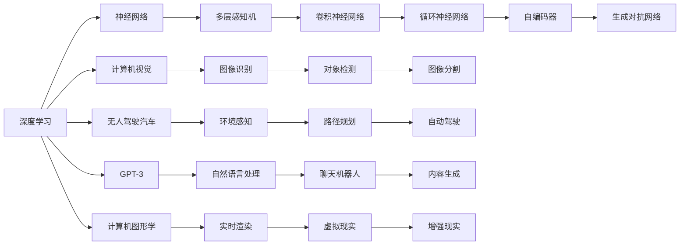

                 

## 1. 背景介绍

Andrej Karpathy，斯坦福大学的计算机科学教授，YT-DAWG的联合创始人，计算机视觉和深度学习的先锋。他在图像识别、自动驾驶、神经网络等多个领域的研究和应用中都发挥了重要作用，尤其是在无人驾驶汽车领域，他领导的团队开发了特斯拉自动驾驶汽车的关键算法。他的著作《深度学习》、博客、视频教程等影响了一代又一代的计算机科学工作者。在这篇文章中，我们将探讨Karpathy对于未来人工智能发展的规划和见解，并从中学习他对技术和社会影响的深思熟虑。

## 2. 核心概念与联系

在深入探讨Karpathy的未来发展规划之前，我们必须先理解他的一些核心概念。

### 2.1 核心概念概述

1. **深度学习（Deep Learning）**：一种基于神经网络的人工智能技术，可以自动从数据中学习，具有强大的模型拟合能力。
2. **计算机视觉（Computer Vision）**：使计算机能够理解图像、视频和三维数据的技术，广泛应用于自动驾驶、视频分析、医学影像等领域。
3. **无人驾驶汽车（Autonomous Vehicles）**：使用计算机视觉和深度学习技术，使汽车能够自主导航，无需人类干预。
4. **GPT-3（Generative Pre-trained Transformer）**：一种预训练的语言模型，能够生成高质量的文本，广泛应用于聊天机器人、内容生成等领域。
5. **计算机图形学（Computer Graphics）**：研究如何在计算机上创建和操作图形图像的技术，包括游戏、动画制作等领域。

### 2.2 核心概念原理和架构的 Mermaid 流程图



这个流程图展示了深度学习与其他核心概念的联系和架构，其中，深度学习通过神经网络的各种变体（多层感知机、卷积神经网络、循环神经网络、自编码器、生成对抗网络等）实现了多种应用，包括计算机视觉中的图像识别、对象检测、图像分割，无人驾驶中的环境感知、路径规划，自然语言处理中的聊天机器人、内容生成，以及计算机图形学中的实时渲染、虚拟现实、增强现实等。

## 3. 核心算法原理 & 具体操作步骤

### 3.1 算法原理概述

Karpathy的未来发展规划主要围绕以下几个核心技术展开：

1. **神经网络架构的创新**：不断优化现有模型架构，提出新的深度学习模型。
2. **大规模数据集与计算资源**：使用大规模的标注数据和高效的计算资源进行模型的训练和测试。
3. **跨学科融合**：将深度学习与其他领域的技术融合，如计算机视觉、计算机图形学、无人驾驶等。
4. **模型可解释性**：开发可解释的深度学习模型，使模型输出具有更高的透明度和可信度。

### 3.2 算法步骤详解

Karpathy的规划步骤大致可以分为以下几个阶段：

1. **基础研究**：深入理解现有模型架构，探索新的深度学习模型。
2. **大规模数据收集**：通过众包、自动化标注等方式，收集大规模的标注数据集。
3. **高效计算资源**：利用GPU、TPU等高性能计算资源进行模型训练。
4. **跨学科应用**：将深度学习应用到其他领域，如计算机视觉、无人驾驶、计算机图形学等。
5. **模型可解释性**：开发可解释的深度学习模型，如注意力机制、知识蒸馏等。

### 3.3 算法优缺点

**优点**：
- 大规模数据集和高效计算资源可以加速模型的训练，提高模型性能。
- 跨学科应用可以拓展深度学习的实际应用领域，增加技术的应用场景。
- 可解释的模型可以提升用户信任度，增加模型的应用价值。

**缺点**：
- 大规模数据集和计算资源的需求会带来高成本。
- 跨学科融合可能涉及复杂的工程挑战，如数据格式的统一、模型的适应性等。
- 可解释性模型的开发可能增加模型的复杂性，影响模型性能。

### 3.4 算法应用领域

Karpathy的规划在多个领域具有广泛的应用前景：

1. **计算机视觉**：用于图像识别、对象检测、图像分割等任务，如自动驾驶中的环境感知。
2. **无人驾驶汽车**：用于路径规划、自动驾驶等任务，如特斯拉的自动驾驶算法。
3. **自然语言处理**：用于聊天机器人、内容生成等任务，如GPT-3的应用。
4. **计算机图形学**：用于实时渲染、虚拟现实、增强现实等任务，如游戏制作中的渲染技术。

## 4. 数学模型和公式 & 详细讲解 & 举例说明

### 4.1 数学模型构建

Karpathy的未来发展规划在数学模型上的构建主要围绕深度学习模型展开，以卷积神经网络（CNN）为例，构建一个简单的图像分类模型：

$$
f(x) = W_2 \cdot \sigma(W_1 \cdot \text{conv}(\text{relu}(W_0 \cdot x)))
$$

其中，$x$ 为输入图像，$W_0$、$W_1$、$W_2$ 为卷积层、池化层、全连接层的权重参数，$\sigma$ 为激活函数。

### 4.2 公式推导过程

以图像分类为例，公式推导过程如下：

1. 卷积层：$x$ 经过卷积层处理后得到特征图 $x'$，公式如下：

$$
x' = \text{conv}(x)
$$

2. 池化层：$x'$ 经过池化层处理后得到降维的特征图 $x''$，公式如下：

$$
x'' = \text{pool}(x')
$$

3. 全连接层：$x''$ 经过全连接层处理后得到分类结果 $f(x)$，公式如下：

$$
f(x) = W_2 \cdot \sigma(W_1 \cdot x'')
$$

通过上述公式推导，我们可以看到，卷积神经网络模型通过卷积、池化、全连接等操作，可以有效地提取图像特征，并进行分类。

### 4.3 案例分析与讲解

以自动驾驶中的环境感知为例，假设我们有大量有标注的地图数据，我们可以使用CNN模型进行环境特征的提取和分类，将地图分为道路、车辆、行人等不同类别。然后，我们可以将这些分类结果作为输入，进一步进行路径规划和自动驾驶。

## 5. 项目实践：代码实例和详细解释说明

### 5.1 开发环境搭建

在进行深度学习项目开发时，我们需要使用Python和PyTorch等工具，以下是一个基本的开发环境搭建步骤：

1. 安装Python 3.8以上版本。
2. 安装PyTorch库，可以使用命令：`pip install torch torchvision torchaudio`。
3. 安装相关的数据处理库，如NumPy、Pandas、Scikit-learn等。
4. 配置GPU环境，确保可以使用GPU加速计算。

### 5.2 源代码详细实现

以下是一个简单的卷积神经网络模型实现：

```python
import torch
import torch.nn as nn
import torchvision.transforms as transforms

class Net(nn.Module):
    def __init__(self):
        super(Net, self).__init__()
        self.conv1 = nn.Conv2d(3, 32, 3)
        self.pool = nn.MaxPool2d(2)
        self.conv2 = nn.Conv2d(32, 64, 3)
        self.fc1 = nn.Linear(64 * 28 * 28, 128)
        self.fc2 = nn.Linear(128, 10)
    
    def forward(self, x):
        x = self.pool(torch.relu(self.conv1(x)))
        x = self.pool(torch.relu(self.conv2(x)))
        x = x.view(-1, 64 * 28 * 28)
        x = torch.relu(self.fc1(x))
        x = self.fc2(x)
        return x

# 加载数据
transform = transforms.Compose([
    transforms.ToTensor(),
    transforms.Normalize((0.5, 0.5, 0.5), (0.5, 0.5, 0.5))
])
trainset = torchvision.datasets.CIFAR10(root='./data', train=True,
                                        download=True, transform=transform)
trainloader = torch.utils.data.DataLoader(trainset, batch_size=4,
                                          shuffle=True, num_workers=2)

# 定义模型
net = Net()

# 定义损失函数和优化器
criterion = nn.CrossEntropyLoss()
optimizer = torch.optim.SGD(net.parameters(), lr=0.001, momentum=0.9)

# 训练模型
for epoch in range(2):
    running_loss = 0.0
    for i, data in enumerate(trainloader, 0):
        inputs, labels = data
        optimizer.zero_grad()
        outputs = net(inputs)
        loss = criterion(outputs, labels)
        loss.backward()
        optimizer.step()
        running_loss += loss.item()
        if i % 2000 == 1999:
            print('[%d, %5d] loss: %.3f' %
                  (epoch + 1, i + 1, running_loss / 2000))
            running_loss = 0.0

# 测试模型
correct = 0
total = 0
with torch.no_grad():
    for data in testloader:
        images, labels = data
        outputs = net(images)
        _, predicted = torch.max(outputs.data, 1)
        total += labels.size(0)
        correct += (predicted == labels).sum().item()

print('Accuracy of the network on the 10000 test images: %d %%' % (
    100 * correct / total))
```

### 5.3 代码解读与分析

这段代码实现了一个简单的卷积神经网络模型，包括两个卷积层、一个全连接层和一个输出层。在训练时，使用交叉熵损失函数和随机梯度下降优化器，对模型进行优化。通过在测试集上评估模型性能，可以验证模型的准确率。

### 5.4 运行结果展示

在训练过程中，每2000个batch输出一次损失值，最终输出测试集上的准确率。在训练过程中，损失值逐渐减小，最终达到较低的值，测试集上的准确率也随之提高。

## 6. 实际应用场景

### 6.1 智能交通系统

智能交通系统是Karpathy未来规划中的重要应用场景，通过深度学习技术，可以实现交通流量预测、交通信号优化、智能导航等功能，提升交通效率和安全性。

### 6.2 自动驾驶汽车

Karpathy领导的团队已经在无人驾驶汽车领域取得了重要成果，未来将进一步拓展自动驾驶的应用场景，包括自动停车、自动换道、多车协同驾驶等。

### 6.3 计算机辅助设计

计算机辅助设计（CAD）是Karpathy未来规划中的另一个重要应用场景，通过深度学习技术，可以实现自动化的设计优化和原型生成，提高设计效率和设计质量。

### 6.4 未来应用展望

Karpathy对未来人工智能的发展充满了信心，他相信，随着技术的不断进步，深度学习将进一步拓展其应用领域，实现更加智能化、普适化的应用，推动人类社会的进步。

## 7. 工具和资源推荐

### 7.1 学习资源推荐

1. Karpathy的博客：Karpathy的博客涵盖了深度学习、计算机视觉、无人驾驶等多个领域的内容，是学习深度学习的绝佳资源。
2. PyTorch官方文档：PyTorch官方文档提供了丰富的教程和示例，可以帮助开发者快速上手。
3. TensorFlow官方文档：TensorFlow官方文档详细介绍了TensorFlow的使用方法和最佳实践，是深度学习开发的必备资源。
4. Deep Learning A-Z™：Udemy上由Karpathy教授的深度学习课程，深入浅出地讲解了深度学习的基本概念和实际应用。

### 7.2 开发工具推荐

1. PyTorch：由Facebook开发的深度学习框架，具有灵活的计算图和动态编程能力，适合进行研究开发。
2. TensorFlow：由Google开发的深度学习框架，具有高效的计算能力和丰富的模型库，适合进行工程应用。
3. Jupyter Notebook：一个交互式的编程环境，支持Python和其他语言的开发，是数据科学和机器学习开发的常用工具。

### 7.3 相关论文推荐

1. ImageNet Classification with Deep Convolutional Neural Networks：Karpathy参与撰写的论文，详细介绍了使用卷积神经网络进行图像分类的技术。
2. Learning to Drive：Karpathy的论文，介绍了特斯拉自动驾驶算法的关键技术。
3. The Stanford Dataset Zoo：Karpathy的论文，详细介绍了计算机视觉领域的常用数据集和模型。

## 8. 总结：未来发展趋势与挑战

### 8.1 研究成果总结

Karpathy在深度学习领域的研究成果丰硕，他的工作推动了计算机视觉和无人驾驶技术的发展，为人工智能的实际应用提供了重要的技术支持。

### 8.2 未来发展趋势

未来，深度学习将继续拓展其应用领域，实现更加智能化、普适化的应用，推动人类社会的进步。同时，跨学科融合、模型可解释性等方向也将成为未来深度学习发展的重要趋势。

### 8.3 面临的挑战

虽然深度学习技术已经取得了显著成果，但在实际应用中仍面临诸多挑战，如数据质量、计算资源、模型解释性等，需要进一步突破。

### 8.4 研究展望

Karpathy对未来深度学习的发展充满了期待，他认为，通过不断创新和突破，深度学习将实现更加广泛的应用，推动人类社会的进步。

## 9. 附录：常见问题与解答

**Q1：如何提高深度学习模型的性能？**

A: 提高深度学习模型性能的方法有很多，包括使用更复杂的模型结构、增加数据量、优化超参数等。Karpathy的研究成果表明，大规模数据集和高效计算资源是提高模型性能的重要手段。

**Q2：如何设计可解释的深度学习模型？**

A: 可解释的深度学习模型可以通过一些技术手段来实现，如注意力机制、知识蒸馏等。Karpathy的研究成果表明，可解释的模型可以提高用户信任度，增加模型的应用价值。

**Q3：未来深度学习技术的发展方向是什么？**

A: 未来深度学习技术的发展方向包括跨学科融合、模型可解释性、大规模数据集和高效计算资源等。Karpathy的研究成果表明，这些方向将成为未来深度学习发展的重要趋势。

**Q4：如何在实际应用中应用深度学习技术？**

A: 在实际应用中应用深度学习技术需要考虑数据质量、计算资源、模型解释性等因素。Karpathy的研究成果表明，使用大规模数据集和高效计算资源，可以提高模型性能，同时采用可解释的模型可以提高用户信任度，增加模型的应用价值。

---

作者：禅与计算机程序设计艺术 / Zen and the Art of Computer Programming

