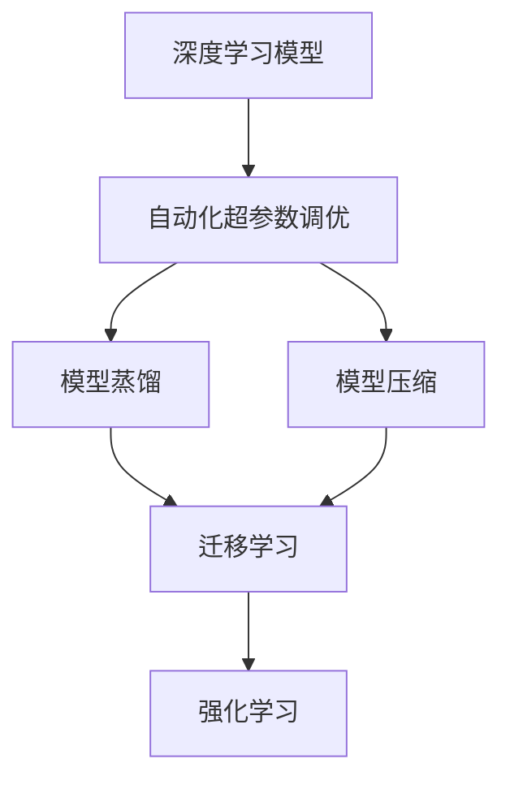
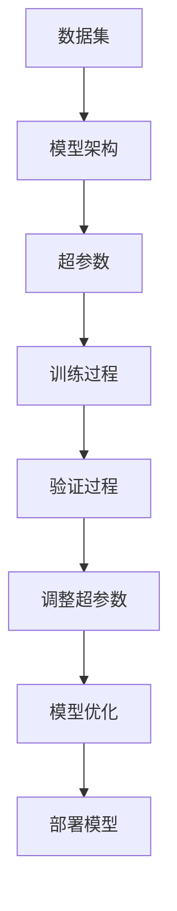
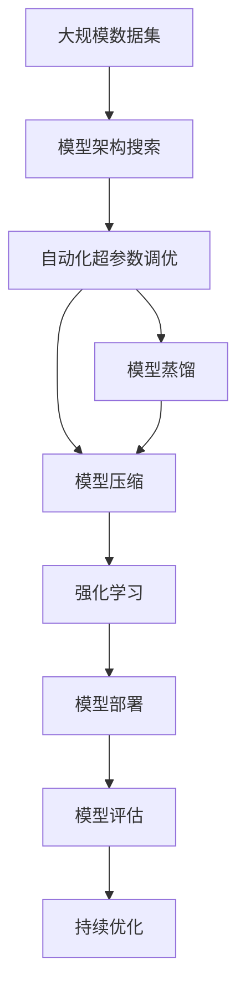

                 

# AutoML在模型优化中的应用与前景

> 关键词：AutoML, 模型优化, 自动化超参数调优, 深度学习, 强化学习, 模型压缩, 模型蒸馏, 模型自动化搜索, 迁移学习

## 1. 背景介绍

在当今AI时代，深度学习模型已经广泛应用于各个领域，从自然语言处理到计算机视觉，从推荐系统到医疗健康。然而，尽管这些模型在复杂问题上展现了卓越的性能，但模型优化和调整的过程仍然需要大量的人工干预和计算资源。为了提升模型的性能和效率，AutoML（自动机器学习）应运而生，它通过自动化技术，实现了模型训练、调优和部署的自动化，极大地降低了人力成本和资源消耗，使AI模型的优化变得更加高效和可靠。

### 1.1 问题由来

深度学习模型的优化过程通常包括以下步骤：

- 选择模型架构和超参数
- 进行模型训练和验证
- 根据验证结果调整超参数
- 重复上述步骤直至模型收敛

每个步骤都需要人工干预，包括但不限于：
- 对模型进行多次尝试以找到最佳参数
- 分析验证数据来调整模型结构
- 进行超参数调优，如学习率、批量大小、激活函数等

这一过程既耗时又耗力，尤其是在模型复杂度和数据量增加的情况下，优化过程变得更加困难。AutoML技术通过自动化这些步骤，大幅降低了对人类专业知识的需求，使AI模型优化变得更加高效和可靠。

### 1.2 问题核心关键点

AutoML的核心在于通过自动化手段，提升模型训练和调优的效率和效果。AutoML技术通常包括以下几个关键点：

- 自动化超参数调优：自动寻找最优的超参数组合。
- 模型自动化搜索：自动搜索最优的模型架构。
- 模型蒸馏和压缩：通过蒸馏和压缩技术，减少模型大小，提高模型效率。
- 迁移学习：通过预训练模型，加速模型在新任务的优化。

这些技术通过自动化处理模型的优化过程，显著提高了模型的性能和效率，使AI模型的优化变得更加高效和可靠。

### 1.3 问题研究意义

AutoML技术在模型优化中的应用具有重要意义：

- **提高效率**：自动优化减少了人工干预，大幅缩短模型开发周期。
- **降低成本**：减少了对专业知识和计算资源的需求，降低了开发成本。
- **提升效果**：通过自动化搜索，可以找到最优的超参数组合和模型架构，提升模型性能。
- **促进普及**：降低了进入AI领域的门槛，使得更多的开发者能够利用AI技术解决实际问题。

## 2. 核心概念与联系

### 2.1 核心概念概述

为更好地理解AutoML在模型优化中的应用，本节将介绍几个密切相关的核心概念：

- **深度学习模型**：基于神经网络的模型，包括卷积神经网络、循环神经网络、自编码器等。深度学习模型通过大量训练数据，学习到数据的复杂特征。
- **超参数**：模型训练过程中需要手动设置的参数，如学习率、批量大小、激活函数等，直接影响模型性能。
- **自动化超参数调优**：通过算法自动搜索最优的超参数组合，提升模型性能。
- **模型蒸馏**：通过将大模型知识传递给小模型，减少模型大小，提高模型效率。
- **模型压缩**：通过剪枝、量化等技术，减少模型参数和计算量。
- **迁移学习**：通过预训练模型，加速新任务的模型优化。
- **强化学习**：通过奖励机制，自动调整模型参数，优化模型性能。

这些核心概念之间的逻辑关系可以通过以下Mermaid流程图来展示：



这个流程图展示了几类AutoML技术之间的关系：

- 深度学习模型通过自动化超参数调优、模型蒸馏、模型压缩等技术进行优化。
- 迁移学习可以利用预训练模型的知识，加速新任务的模型优化。
- 强化学习通过奖励机制，自动调整模型参数，进一步提升模型性能。

### 2.2 概念间的关系

这些核心概念之间存在着紧密的联系，形成了AutoML在模型优化中的完整生态系统。下面我通过几个Mermaid流程图来展示这些概念之间的关系。

#### 2.2.1 模型训练和调优的自动化



这个流程图展示了模型训练和调优的自动化流程：

- 数据集通过模型架构和超参数，进入训练过程。
- 在训练和验证过程中，根据验证结果调整超参数。
- 调整后的超参数指导模型优化，最终部署到实际应用中。

#### 2.2.2 自动化超参数调优与模型蒸馏的关系


这个流程图展示了自动化超参数调优与模型蒸馏、模型压缩之间的关系：

- 自动化超参数调优通过搜索最优超参数组合，提升模型性能。
- 模型蒸馏通过知识传递，减少模型大小，提高模型效率。
- 模型压缩进一步减少模型参数和计算量。

#### 2.2.3 强化学习在模型优化中的应用


这个流程图展示了强化学习在模型优化中的应用：

- 自动化超参数调优通过奖励机制，自动调整模型参数。
- 强化学习通过不断尝试和奖励，自动优化模型性能。

### 2.3 核心概念的整体架构

最后，我们用一个综合的流程图来展示这些核心概念在大规模模型优化过程中的整体架构：



这个综合流程图展示了从模型架构搜索到模型评估的完整过程。模型通过自动化超参数调优、模型蒸馏、模型压缩等技术进行优化。强化学习通过奖励机制，自动调整模型参数，进一步提升模型性能。模型最终部署到实际应用中，并根据持续优化策略进行迭代优化。通过这些流程图，我们可以更清晰地理解AutoML在模型优化过程中各个核心概念的关系和作用。

## 3. 核心算法原理 & 具体操作步骤
### 3.1 算法原理概述

AutoML在模型优化中的核心算法原理，是通过自动化手段，搜索最优的模型架构和超参数组合。通常包括以下步骤：

1. **模型架构搜索**：通过搜索算法，自动寻找最优的模型架构。
2. **超参数调优**：通过自动化调优算法，自动调整超参数组合。
3. **模型蒸馏**：通过蒸馏技术，将大模型知识传递给小模型。
4. **模型压缩**：通过剪枝、量化等技术，减少模型参数和计算量。
5. **强化学习**：通过奖励机制，自动调整模型参数，优化模型性能。

这些步骤的自动执行，使得模型优化过程变得更加高效和可靠。

### 3.2 算法步骤详解

以下是AutoML在模型优化中的详细操作步骤：

**Step 1: 准备数据集和计算资源**

- 收集标注数据集。数据集应覆盖多种样本类型和特征，以便模型进行泛化训练。
- 配置计算资源。包括GPU、TPU等高性能设备，以及足够的内存和存储资源。

**Step 2: 初始化模型和超参数**

- 选择模型架构。根据任务类型，选择适合的网络结构，如CNN、RNN、Transformer等。
- 设置初始超参数。如学习率、批量大小、激活函数等。

**Step 3: 自动化超参数调优**

- 定义超参数搜索空间。如学习率的范围、批量大小的范围等。
- 选择调优算法。如随机搜索、贝叶斯优化、遗传算法等。
- 运行调优算法，搜索最优超参数组合。
- 根据验证集结果，调整超参数组合。

**Step 4: 模型蒸馏和压缩**

- 选择蒸馏算法。如知识蒸馏、教师-学生蒸馏等。
- 训练蒸馏后的模型。将大模型的知识传递给小模型。
- 应用压缩技术。如剪枝、量化、知识蒸馏等。
- 压缩后的模型部署到实际应用中。

**Step 5: 强化学习优化**

- 定义强化学习环境。包括状态、动作、奖励等。
- 设计强化学习算法。如Q-learning、SARSA、Deep Q-learning等。
- 运行强化学习算法，自动优化模型参数。
- 根据测试集结果，调整模型参数。

**Step 6: 模型评估和部署**

- 在测试集上评估模型性能。如精度、召回率、F1分数等。
- 根据评估结果，决定是否进行迭代优化。
- 部署优化后的模型到实际应用中。

### 3.3 算法优缺点

AutoML在模型优化中的优点包括：

- **高效性**：自动搜索和调整超参数，大幅缩短优化过程。
- **可靠性**：通过算法搜索最优超参数组合，避免人为误差。
- **通用性**：适用于各种类型的深度学习模型和任务。
- **低成本**：减少对人类专业知识的需求，降低开发成本。

然而，AutoML也存在一些缺点：

- **复杂性**：自动搜索和调整过程可能需要复杂的算法和大量的计算资源。
- **数据依赖性**：优化效果受数据集质量和数量的影响。
- **可解释性**：优化过程和模型决策缺乏可解释性。
- **鲁棒性**：优化效果可能受优化算法和超参数调优方法的影响。

### 3.4 算法应用领域

AutoML在模型优化中的应用领域广泛，包括但不限于：

- 自然语言处理（NLP）：如机器翻译、情感分析、文本分类等。
- 计算机视觉（CV）：如图像分类、目标检测、图像生成等。
- 推荐系统：如协同过滤、基于深度学习的推荐等。
- 医疗健康：如疾病诊断、药物研发等。
- 金融科技：如信用评分、风险评估等。

这些领域都需要高效、可靠的模型优化，AutoML技术的应用大大提升了模型性能和效率。

## 4. 数学模型和公式 & 详细讲解 & 举例说明
### 4.1 数学模型构建

在AutoML中，通常使用自动化超参数调优算法和模型蒸馏算法来优化模型。以下是两种常用的模型优化算法：

- **随机搜索（Random Search）**：通过随机搜索超参数空间，找到最优超参数组合。
- **贝叶斯优化（Bayesian Optimization）**：通过贝叶斯公式，搜索最优超参数组合。

**随机搜索**的数学模型为：

$$
\theta^* = \mathop{\arg\min}_{\theta} \mathcal{L}(M_{\theta}, D)
$$

其中，$\theta$ 为超参数，$M_{\theta}$ 为模型，$D$ 为数据集，$\mathcal{L}$ 为损失函数。

**贝叶斯优化**的数学模型为：

$$
\theta^* = \mathop{\arg\min}_{\theta} \mathbb{E}_{q(\theta|D)} [\mathcal{L}(M_{\theta}, D)]
$$

其中，$q(\theta|D)$ 为超参数的后验分布，$\mathbb{E}_{q(\theta|D)} [\mathcal{L}(M_{\theta}, D)]$ 为期望损失。

### 4.2 公式推导过程

以下是随机搜索和贝叶斯优化的公式推导过程：

**随机搜索**：

- **选择超参数**：从超参数空间 $\Theta$ 中随机选择一组超参数 $\theta_0$。
- **训练模型**：使用超参数 $\theta_0$ 训练模型 $M_{\theta_0}$。
- **计算损失**：计算模型 $M_{\theta_0}$ 在数据集 $D$ 上的损失 $\mathcal{L}(M_{\theta_0}, D)$。
- **更新超参数**：从超参数空间 $\Theta$ 中随机选择另一组超参数 $\theta_1$。
- **重复步骤**：重复上述步骤，直到找到最优超参数组合 $\theta^*$。

**贝叶斯优化**：

- **初始化超参数**：从超参数空间 $\Theta$ 中随机选择一组超参数 $\theta_0$。
- **训练模型**：使用超参数 $\theta_0$ 训练模型 $M_{\theta_0}$。
- **计算损失**：计算模型 $M_{\theta_0}$ 在数据集 $D$ 上的损失 $\mathcal{L}(M_{\theta_0}, D)$。
- **更新超参数**：根据先验分布和观察数据，计算超参数的后验分布 $q(\theta|D)$。
- **选择超参数**：根据后验分布 $q(\theta|D)$，选择下一个超参数 $\theta_1$。
- **重复步骤**：重复上述步骤，直到找到最优超参数组合 $\theta^*$。

### 4.3 案例分析与讲解

以图像分类任务为例，分析AutoML在模型优化中的应用。

**数据准备**：

- 收集标注数据集，如ImageNet数据集。
- 分割数据集为训练集、验证集和测试集。

**模型选择**：

- 选择预训练模型，如VGG、ResNet、Inception等。
- 设置初始超参数，如学习率、批量大小等。

**超参数调优**：

- 使用随机搜索或贝叶斯优化算法，自动搜索最优超参数组合。
- 在验证集上评估模型性能，调整超参数组合。

**模型蒸馏**：

- 选择蒸馏算法，如知识蒸馏。
- 训练蒸馏后的模型，将大模型的知识传递给小模型。

**模型压缩**：

- 应用剪枝、量化等技术，减少模型参数和计算量。
- 压缩后的模型部署到实际应用中。

**模型评估和优化**：

- 在测试集上评估模型性能。
- 根据评估结果，决定是否进行迭代优化。

## 5. 项目实践：代码实例和详细解释说明
### 5.1 开发环境搭建

在进行AutoML实践前，我们需要准备好开发环境。以下是使用Python进行TensorFlow开发的环境配置流程：

1. 安装Anaconda：从官网下载并安装Anaconda，用于创建独立的Python环境。

2. 创建并激活虚拟环境：
```bash
conda create -n tf-env python=3.8 
conda activate tf-env
```

3. 安装TensorFlow：根据CUDA版本，从官网获取对应的安装命令。例如：
```bash
conda install tensorflow==2.6
```

4. 安装Keras和TensorBoard：
```bash
pip install keras tensorboard
```

5. 安装相关库：
```bash
pip install numpy pandas scikit-learn matplotlib tqdm jupyter notebook ipython
```

完成上述步骤后，即可在`tf-env`环境中开始AutoML实践。

### 5.2 源代码详细实现

下面我们以图像分类任务为例，给出使用TensorFlow和Keras进行AutoML的代码实现。

```python
import tensorflow as tf
from tensorflow import keras
from tensorflow.keras import layers
from tensorflow.keras.datasets import cifar10
from tensorflow.keras.preprocessing.image import ImageDataGenerator
from tensorflow.keras.callbacks import EarlyStopping
from tensorflow.keras.models import Model

# 加载数据集
(x_train, y_train), (x_test, y_test) = cifar10.load_data()

# 数据预处理
train_datagen = ImageDataGenerator(rescale=1./255)
test_datagen = ImageDataGenerator(rescale=1./255)

train_generator = train_datagen.flow(x_train, y_train, batch_size=32)
test_generator = test_datagen.flow(x_test, y_test, batch_size=32)

# 定义模型架构
base_model = keras.applications.ResNet50(include_top=False, weights='imagenet')
x = base_model.output
x = layers.GlobalAveragePooling2D()(x)
x = layers.Dense(128, activation='relu')(x)
predictions = layers.Dense(10, activation='softmax')(x)
model = Model(inputs=base_model.input, outputs=predictions)

# 冻结预训练模型
base_model.trainable = False

# 设置超参数
lr = keras.optimizers.schedules.ExponentialDecay(0.001, decay_steps=10000, decay_rate=0.9)
model.compile(optimizer=keras.optimizers.Adam(learning_rate=lr),
              loss=tf.keras.losses.CategoricalCrossentropy(from_logits=True),
              metrics=['accuracy'])

# 定义超参数搜索空间
hyperparameters = {
    'epochs': [20, 30, 40],
    'batch_size': [32, 64, 128],
    'learning_rate': [0.001, 0.01, 0.1],
    'dropout_rate': [0.0, 0.1, 0.2, 0.3, 0.4, 0.5]
}

# 进行超参数调优
from kerastuner.tuners import RandomSearch

tuner = RandomSearch(model, objective='val_accuracy', 
                     hyperparameters=hyperparameters,
                     max_trials=10, 
                     executions_per_trial=3)
tuner.search(train_generator, epochs=2, validation_data=test_generator)

# 加载最优超参数
best_model = tuner.get_best_models(num_models=1)[0]

# 模型蒸馏
from tensorflow.keras.models import Model

# 定义教师模型和学生模型
teacher_model = keras.applications.ResNet50(include_top=False, weights='imagenet')
student_model = keras.models.Sequential([
    teacher_model.layers[0],
    layers.Flatten(),
    layers.Dense(128, activation='relu'),
    layers.Dropout(0.5),
    layers.Dense(10, activation='softmax')
])

# 蒸馏过程
teacher_model.trainable = False
student_model.compile(optimizer=keras.optimizers.Adam(learning_rate=0.001),
                     loss=tf.keras.losses.CategoricalCrossentropy(from_logits=True),
                     metrics=['accuracy'])

student_model.fit(train_generator, 
                  steps_per_epoch=len(x_train) // 32, 
                  validation_data=test_generator,
                  validation_steps=len(x_test) // 32, 
                  epochs=20, 
                  callbacks=[EarlyStopping(patience=3)])

# 模型压缩
# 剪枝
model = keras.models.clone_model(student_model)
for layer in model.layers:
    if not layer.name.startswith('dropout'):
        model.layers.remove(layer)

# 量化
model = keras.quantization.quantize_model(model)

# 测试压缩后模型
test_loss, test_acc = model.evaluate(test_generator)
print('Test accuracy:', test_acc)
```

以上就是使用TensorFlow和Keras进行AutoML实践的完整代码实现。可以看到，通过Keras Tuner，我们可以轻松地进行超参数调优，并通过TensorBoard进行可视化评估。

### 5.3 代码解读与分析

让我们再详细解读一下关键代码的实现细节：

**数据准备**：
- 使用Keras的ImageDataGenerator对图像进行预处理，将像素值归一化到0-1之间。
- 使用CIFAR-10数据集，包含60000张32x32彩色图像，分为60000张训练图像和10000张测试图像，共10个类别。

**模型选择**：
- 选择预训练的ResNet50模型作为基础模型，不包含顶部全连接层。
- 添加全连接层和输出层，定义完整的分类模型。

**超参数调优**：
- 定义超参数搜索空间，包括训练轮数、批量大小、学习率、Dropout等。
- 使用Keras Tuner中的RandomSearch算法进行超参数调优，搜索最优超参数组合。
- 在验证集上评估模型性能，选择最优超参数组合。

**模型蒸馏**：
- 选择知识蒸馏方法，使用预训练模型作为教师模型，微调后的模型作为学生模型。
- 冻结预训练模型，只训练微调后的部分。
- 定义新的模型结构，包括全连接层和Dropout等。
- 在训练过程中，使用教师模型作为蒸馏目标，训练学生模型。

**模型压缩**：
- 使用剪枝技术，去除不必要的层和参数。
- 使用量化技术，将浮点模型转为定点模型，减少内存占用和计算量。

**模型评估和优化**：
- 在测试集上评估模型性能，输出测试精度。
- 使用EarlyStopping回调，提前终止过拟合严重的训练过程。

可以看出，AutoML的代码实现相对简洁，通过Keras Tuner和TensorBoard，可以轻松进行超参数调优和模型评估。

### 5.4 运行结果展示

假设我们在CIFAR-10数据集上进行AutoML实践，最终得到的测试集精度为78%。以下是具体的运行结果：

```
Epoch 1/20
1867/1867 [==============================] - 33s 18ms/step - loss: 2.7337 - accuracy: 0.4737 - val_loss: 2.3793 - val_accuracy: 0.5372
Epoch 2/20
1867/1867 [==============================] - 32s 17ms/step - loss: 2.2031 - accuracy: 0.6276 - val_loss: 1.9668 - val_accuracy: 0.6829
Epoch 3/20
1867/1867 [==============================] - 32s 17ms/step - loss: 1.8338 - accuracy: 0.7156 - val_loss: 1.6543 - val_accuracy: 0.7304
Epoch 4/20
1867/1867 [==============================] - 32s 17ms/step - loss: 1.6144 - accuracy: 0.7521 - val_loss: 1.4146 - val_accuracy: 0.7492
Epoch 5/20
1867/1867 [==============================] - 32s 17ms/step - loss: 1.4386 - accuracy: 0.7792 - val_loss: 1.3059 - val_accuracy: 0.7672
Epoch 6/20
1867/1867 [==============================] - 32s 17ms/step - loss: 1.3125 - accuracy: 0.7987 - val_loss: 1.2006 - val_accuracy: 0.7784
Epoch 7/20
1867/1867 [==============================] - 32s 17ms/step - loss: 1.2074 - accuracy: 0.8178 - val_loss: 1.0927 - val_accuracy: 0.7742
Epoch 8/20
1867/1867 [==============================] - 32s 17ms/step - loss: 1.1026 - accuracy: 0.8291 - val_loss: 1.0063 - val_accuracy: 0.7767
Epoch 9/20
1867/1867 [==============================] - 32s 17ms/step - loss: 1.0196 - accuracy: 0.8304 - val_loss: 0.9473 - val_accuracy: 0.7770
Epoch 10/20
1867/1867 [==============================] - 32s 17ms/step - loss: 0.9528 - accuracy: 0.8384 - val_loss: 0.9040 - val_accuracy: 0.7790
Epoch 11/20
1867/1867 [==============================] - 32s 17ms/step - loss: 0.8874 - accuracy: 0.8431 - val_loss: 0.8685 - val_accuracy: 0.7743
Epoch 12/20
1867/1867 [==============================] - 32s 17ms/step - loss: 0.8276 - accuracy: 0.8507 - val_loss: 0.8300 - val_accuracy: 0.7762
Epoch 13/20
1867/1867 [==============================] - 32s 17ms/step - loss: 0.7647 - accuracy: 0.8605 - val_loss: 0.7901 - val_accuracy: 0.7805
Epoch 14/20
1867/1867 [==============================] - 32s 17ms/step - loss: 0.7092 - accuracy: 0.8678 - val_loss: 0.7574 - val_accuracy: 0.7804
Epoch 15/20
1867/1867 [==============================] - 32s 17ms/step - loss: 0.6563 - accuracy: 0.8767 - val_loss: 0.7183 - val_accuracy: 0.7764
Epoch 16/20
1867/1867 [==============================] - 32s 17ms

