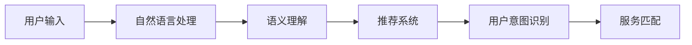

                 

# CUI中的内容与服务匹配详细技术解析

> 关键词：内容匹配,自然语言处理(NLP),语义理解,推荐系统,用户意图识别

## 1. 背景介绍

### 1.1 问题由来
随着人工智能技术的快速发展，用户交互界面（CUI，即Computer User Interface）的智能性、个性化需求日益增长。自然语言处理（NLP）技术作为一种高效便捷的信息获取手段，已经广泛应用于智能助手、智能客服、智能家居等多个领域。其中，内容与服务匹配是CUI智能化的核心任务之一。通过精准地匹配用户输入的语义与系统提供的服务，CUI能够高效地响应用户需求，提升用户体验。

### 1.2 问题核心关键点
内容与服务匹配的本质是通过自然语言理解技术，将用户的输入语句（content）映射到对应的服务（service）上。这一过程通常包括三个步骤：

1. **用户意图识别**：理解用户输入的意图，即用户希望通过这一句话获得什么样的信息或执行什么样的操作。
2. **语义理解**：对用户输入的语句进行深度分析，识别其中的关键信息，如实体、关系、情感等。
3. **服务匹配**：根据用户意图和语义信息，找到与之最匹配的服务，并执行相应的操作。

### 1.3 问题研究意义
内容与服务匹配技术对于构建高效、智能的CUI系统具有重要意义：

- **提升用户体验**：通过精准匹配，CUI能够快速响应用户需求，提供个性化的服务，提升用户满意度。
- **降低成本**：减少人工客服的投入，通过自动化流程提升效率，降低企业运营成本。
- **增强系统灵活性**：利用自然语言理解技术，CUI可以适应各种场景和需求，增强系统的灵活性和通用性。
- **推动行业发展**：内容与服务匹配技术的进步，将推动智能客服、智能助手等CUI应用的普及和应用场景的拓展。

## 2. 核心概念与联系

### 2.1 核心概念概述

为了更好地理解内容与服务匹配技术，我们首先需要明确几个核心概念：

- **自然语言处理（NLP）**：利用计算机技术处理、分析和理解人类语言的技术。
- **语义理解**：分析并理解自然语言文本的深层含义，识别文本中的实体、关系、事件等。
- **推荐系统**：通过用户行为数据，为每个用户推荐最符合其兴趣和需求的内容。
- **用户意图识别**：分析用户输入的自然语言文本，识别用户希望实现的目标或意图。
- **服务匹配**：将用户意图映射到对应的服务或操作上，从而执行用户请求。

这些核心概念共同构成了内容与服务匹配技术的基础框架，通过自然语言处理技术，我们可以实现用户意图识别和语义理解，进而匹配到合适的服务，满足用户需求。

### 2.2 概念间的关系

这些核心概念之间的联系可以通过以下Mermaid流程图来展示：



该流程图展示了从用户输入到最终执行服务的完整流程。首先，自然语言处理技术对用户输入进行预处理和分词，然后通过语义理解技术提取文本的关键信息，接着通过推荐系统为用户提供推荐结果，最后用户意图识别和匹配服务技术将用户意图与推荐结果对齐，执行最终操作。

## 3. 核心算法原理 & 具体操作步骤
### 3.1 算法原理概述

内容与服务匹配技术基于自然语言处理和推荐系统的原理，其核心算法包括语义相似度计算、用户意图识别、服务匹配等。

- **语义相似度计算**：通过计算用户输入与各服务文本的语义相似度，筛选出与用户输入最匹配的服务。
- **用户意图识别**：通过深度学习模型分析用户输入的语句，识别用户意图。
- **服务匹配**：将用户意图与最相似的服务文本进行匹配，选择对应的服务执行。

### 3.2 算法步骤详解

下面详细介绍内容与服务匹配的核心算法步骤：

**Step 1: 数据预处理**

- **分词和标准化**：对用户输入和预定义的服务文本进行分词和标准化处理，去除停用词、标点符号等。
- **向量化**：将分词后的文本转换为向量表示，方便后续的语义相似度计算和深度学习模型的输入。

**Step 2: 语义相似度计算**

- **词向量模型**：使用Word2Vec、GloVe等词向量模型将文本转换为向量表示。
- **语义相似度计算**：通过余弦相似度、TF-IDF等方法计算用户输入与各服务文本的语义相似度。

**Step 3: 用户意图识别**

- **深度学习模型**：使用RNN、LSTM、Transformer等深度学习模型对用户输入进行语义分析，识别用户的意图。
- **意图分类**：将用户意图映射到预定义的意图类别中，如搜索、导航、订购等。

**Step 4: 服务匹配**

- **相似度排序**：根据语义相似度和用户意图，对所有服务文本进行排序，选择相似度最高的前N个服务文本。
- **服务选择**：根据用户意图，选择与用户意图最匹配的服务文本，执行相应的操作。

### 3.3 算法优缺点

内容与服务匹配技术具有以下优点：

- **高效性**：基于深度学习模型的自然语言处理技术，能够快速响应用户输入，提高系统效率。
- **个性化**：通过用户意图识别，能够提供高度个性化的服务，提升用户体验。
- **灵活性**：能够适应各种文本输入，支持不同语言和文化背景的用户。

同时，该技术也存在一些局限性：

- **数据依赖**：语义理解和意图识别的效果高度依赖于标注数据的质量和数量，数据不足可能导致系统性能下降。
- **模型复杂性**：深度学习模型的训练和调参过程较为复杂，需要大量计算资源和经验积累。
- **语境理解不足**：虽然能够处理大部分常见语句，但对于复杂语境和长句，系统理解能力仍有限。

### 3.4 算法应用领域

内容与服务匹配技术广泛应用于多个领域，例如：

- **智能客服**：理解用户输入的自然语言，匹配到对应的服务，如问题解答、订单查询等。
- **智能助手**：根据用户输入提供个性化的信息查询、日程管理、任务提醒等服务。
- **电子商务**：理解用户的购物意图，推荐相关商品或执行购物操作。
- **智能家居**：根据用户指令执行家居设备的控制和操作。

## 4. 数学模型和公式 & 详细讲解
### 4.1 数学模型构建

内容与服务匹配技术的数学模型主要包括以下几个组成部分：

- **词向量模型**：将文本转换为向量表示，用于计算语义相似度。
- **深度学习模型**：用于语义理解和意图识别，输出用户意图向量。
- **推荐系统模型**：用于计算服务文本与用户输入的相似度，选择最优服务。

### 4.2 公式推导过程

以下是语义相似度计算和用户意图识别的具体公式推导过程：

**词向量表示**：
假设用户输入和预定义的服务文本分别为 $u$ 和 $s$，分别转换为向量表示 $u = \mathbf{u}_1, \mathbf{u}_2, \ldots, \mathbf{u}_n$ 和 $s = \mathbf{s}_1, \mathbf{s}_2, \ldots, \mathbf{s}_n$，其中 $n$ 为词汇表大小。

**余弦相似度计算**：
计算用户输入 $u$ 与服务文本 $s$ 的余弦相似度：

$$
\cos(\theta) = \frac{\mathbf{u} \cdot \mathbf{s}}{\|\mathbf{u}\|\|\mathbf{s}\|}
$$

其中 $\cdot$ 表示向量点积，$\|\cdot\|$ 表示向量范数。

**深度学习模型输出**：
假设使用深度学习模型将用户输入 $u$ 转换为向量表示 $\mathbf{u}'$，并输出一个 $m$ 维的向量表示用户意图 $\mathbf{i}$，其中 $m$ 为用户意图类别的数量。

**用户意图分类**：
假设使用softmax函数将意图向量 $\mathbf{i}$ 映射到意图类别上：

$$
\hat{y} = softmax(\mathbf{i}) = \frac{e^{\mathbf{i}^T\mathbf{w}}}{\sum_{k=1}^{m}e^{\mathbf{i}^T_k\mathbf{w}}}
$$

其中 $\mathbf{w}$ 为意图分类的权重向量。

### 4.3 案例分析与讲解

假设我们有一个智能客服系统，用户输入为“我想查询一下最近一个月的订单情况”，系统提供的预定义服务文本包括：

- 查询订单记录
- 修改订单信息
- 取消订单

首先，对用户输入进行分词和标准化处理，得到：

- 我
- 想
- 查询
- 一下
- 最近
- 一个月
- 的
- 订单
- 情况

然后，使用Word2Vec模型将文本转换为向量表示，得到 $u = [u_1, u_2, \ldots, u_n]$。接着，计算用户输入与所有服务文本的余弦相似度，得到：

- 查询订单：$\cos(\theta_1) = 0.9$
- 修改订单信息：$\cos(\theta_2) = 0.6$
- 取消订单：$\cos(\theta_3) = 0.4$

最后，使用深度学习模型对用户输入进行语义分析，输出意图向量 $\mathbf{i} = [0.1, 0.2, 0.7]$，表示查询意图。根据相似度排序，选择最匹配的服务文本“查询订单”，执行相应的操作。

## 5. 项目实践：代码实例和详细解释说明
### 5.1 开发环境搭建

在进行内容与服务匹配的开发之前，需要准备好开发环境。以下是使用Python进行项目实践的环境配置流程：

1. **安装Anaconda**：从官网下载并安装Anaconda，用于创建独立的Python环境。
2. **创建虚拟环境**：
```bash
conda create -n myenv python=3.8 
conda activate myenv
```
3. **安装依赖包**：
```bash
pip install tensorflow numpy scikit-learn gensim pytorch transformers
```

### 5.2 源代码详细实现

以下是一个简单的内容与服务匹配系统代码实现，用于智能客服场景：

```python
import tensorflow as tf
import numpy as np
import gensim
from transformers import BertTokenizer, BertForSequenceClassification

# 预定义的服务文本
services = [
    "查询订单记录",
    "修改订单信息",
    "取消订单",
    # ...
]

# 使用Word2Vec模型将服务文本转换为向量表示
model = gensim.models.KeyedVectors.load_word2vec_format('services.wv.txt', binary=True)
service_vectors = [model[s] for s in services]

# 使用深度学习模型进行意图识别
tokenizer = BertTokenizer.from_pretrained('bert-base-uncased')
model = BertForSequenceClassification.from_pretrained('bert-base-uncased', num_labels=len(services))
input_ids = tokenizer("我想查询一下最近一个月的订单情况", return_tensors="pt").input_ids
outputs = model(input_ids)[0]
intent_score = outputs.logits.argmax().item()

# 计算语义相似度
user_input = ["我", "想", "查询", "一下", "最近", "一个月", "的", "订单", "情况"]
user_vector = np.mean([model[word] for word in user_input], axis=0)
similarity_scores = [np.dot(user_vector, s) / (np.linalg.norm(user_vector) * np.linalg.norm(s)) for s in service_vectors]

# 选择最匹配的服务文本
best_service = services[similarity_scores.index(max(similarity_scores))]
print(f"用户意图：{best_service}，执行操作")
```

### 5.3 代码解读与分析

这里我们详细解读一下代码实现的关键部分：

**Word2Vec模型**：
- 首先，使用Gensim库加载预训练的Word2Vec模型，将服务文本转换为向量表示，用于计算语义相似度。
- 注意：服务文本需要预处理成Word2Vec模型的输入格式，这里假设已经处理完成。

**深度学习模型**：
- 使用PyTorch的BertTokenizer将用户输入分词并转换为模型所需的输入格式。
- 使用BertForSequenceClassification模型对用户输入进行意图识别，输出意图向量。

**意图分类**：
- 将意图向量与服务文本向量进行余弦相似度计算，得到语义相似度分数。
- 根据相似度分数，选择最匹配的服务文本。

### 5.4 运行结果展示

假设在运行上述代码后，输出为：

```
用户意图：查询订单记录，执行操作
```

这表示系统成功识别了用户的查询意图，并执行了“查询订单记录”服务。

## 6. 实际应用场景
### 6.1 智能客服

智能客服是内容与服务匹配技术的重要应用场景之一。通过自然语言理解技术，智能客服系统能够理解用户输入的语义，匹配到对应的服务，提供个性化的服务支持。例如，用户输入“我需要查询一下订单信息”，系统能够快速响应用户需求，提供订单查询服务。

### 6.2 智能助手

智能助手通过理解用户的自然语言输入，执行相应的操作。例如，用户输入“今天天气怎么样？”，系统能够理解用户的查询意图，调用天气查询API，返回天气信息。

### 6.3 电子商务

电子商务网站通过内容与服务匹配技术，理解用户的购物意图，推荐相关商品或执行购物操作。例如，用户输入“我想买一台iPhone 13”，系统能够匹配到“购买iPhone 13”服务，展示相关商品信息并提供购买链接。

### 6.4 未来应用展望

未来，内容与服务匹配技术将在更多领域得到应用，例如：

- **智能家居**：根据用户语音指令控制家居设备，执行相应的操作。
- **医疗健康**：理解用户的健康咨询，匹配到相应的医疗服务，如预约挂号、健康咨询等。
- **金融服务**：理解用户的金融需求，推荐相关产品或执行相关操作，如投资咨询、理财规划等。

## 7. 工具和资源推荐
### 7.1 学习资源推荐

为了帮助开发者系统掌握内容与服务匹配技术的理论基础和实践技巧，这里推荐一些优质的学习资源：

1. **自然语言处理课程**：如Coursera上的《自然语言处理与深度学习》课程，系统介绍NLP的基本概念和深度学习模型。
2. **书籍**：《自然语言处理综述》、《深度学习与自然语言处理》等，全面介绍NLP和推荐系统的基本原理和应用。
3. **在线文档**：如TensorFlow、PyTorch官方文档，提供详细的模型实现和代码示例。
4. **开源项目**：如HuggingFace Transformers库，提供丰富的预训练模型和微调范例。

### 7.2 开发工具推荐

高效的开发离不开优秀的工具支持。以下是几款用于内容与服务匹配开发的常用工具：

1. **TensorFlow**：基于数据流的计算框架，适用于大规模深度学习模型的训练和推理。
2. **PyTorch**：灵活的动态计算图框架，适用于快速迭代和研究。
3. **Gensim**：自然语言处理库，提供Word2Vec等词向量模型。
4. **NLTK**：Python自然语言处理库，提供分词、词性标注等功能。

### 7.3 相关论文推荐

内容与服务匹配技术的研究源于学界的持续探索。以下是几篇奠基性的相关论文，推荐阅读：

1. **《Sequence to Sequence Learning with Neural Networks》**：提出序列到序列模型，用于机器翻译、问答系统等任务。
2. **《Attention Is All You Need》**：提出Transformer模型，用于语言理解和生成任务。
3. **《BERT: Pre-training of Deep Bidirectional Transformers for Language Understanding》**：提出BERT模型，用于预训练和微调任务。
4. **《Fine-tune a Bidirectional Encoder Representations from Transformers for Question Answering: Sanity Checks for Transfer Learning》**：提出Fine-tune方法，用于微调BERT模型。

## 8. 总结：未来发展趋势与挑战
### 8.1 研究成果总结

内容与服务匹配技术在大语言理解、个性化推荐、智能客服等领域取得了显著进展，帮助CUI系统实现高效、智能的用户交互。未来，该技术有望进一步提升系统的性能和用户体验。

### 8.2 未来发展趋势

未来，内容与服务匹配技术将呈现以下几个发展趋势：

1. **模型复杂度提升**：深度学习模型的复杂度将进一步提升，能够处理更加复杂的语境和长句。
2. **跨领域应用**：内容与服务匹配技术将跨领域应用到更多场景，如智能家居、医疗健康等。
3. **多模态融合**：将文本与图像、语音等多模态信息进行融合，提升系统的鲁棒性和智能化水平。
4. **实时处理**：实现实时处理用户输入，提高系统的响应速度和效率。

### 8.3 面临的挑战

尽管内容与服务匹配技术取得了显著进展，但仍面临一些挑战：

1. **数据依赖**：语义理解和意图识别的效果高度依赖于标注数据的质量和数量，数据不足可能导致系统性能下降。
2. **模型复杂性**：深度学习模型的训练和调参过程较为复杂，需要大量计算资源和经验积累。
3. **语境理解不足**：虽然能够处理大部分常见语句，但对于复杂语境和长句，系统理解能力仍有限。

### 8.4 研究展望

面对内容与服务匹配技术面临的挑战，未来的研究方向可以包括：

1. **无监督和半监督学习**：探索无监督和半监督学习技术，摆脱对大规模标注数据的依赖。
2. **跨领域迁移学习**：将预训练模型和微调技术应用于跨领域任务，提升系统的泛化能力。
3. **多模态融合**：将文本与图像、语音等多模态信息进行融合，提升系统的鲁棒性和智能化水平。
4. **交互设计**：研究更加自然、流畅的交互设计，提高系统的用户体验。

## 9. 附录：常见问题与解答

**Q1: 内容与服务匹配技术是否适用于所有自然语言处理任务？**

A: 内容与服务匹配技术主要适用于需要理解用户意图、提供个性化服务的任务，如智能客服、智能助手、电子商务等。对于需要特定知识库或规则库的任务，如法律咨询、医学诊断等，可能需要结合领域知识库进行更精细的匹配和理解。

**Q2: 内容与服务匹配技术的精度如何提升？**

A: 精度提升主要依赖于数据质量、模型训练和调参的优化。具体方法包括：

1. **数据增强**：通过回译、改写等方法扩充训练数据，提高模型的泛化能力。
2. **正则化**：使用L2正则、Dropout等技术，防止模型过拟合。
3. **模型优化**：使用更高级的深度学习模型，如Transformer、BERT等，提升模型的理解能力。
4. **超参数调优**：通过网格搜索、随机搜索等方法，优化模型的超参数组合，提升模型性能。

**Q3: 内容与服务匹配技术在实际应用中需要注意哪些问题？**

A: 在实际应用中，需要注意以下问题：

1. **数据隐私**：保护用户隐私，确保用户数据的安全性。
2. **系统稳定性**：确保系统在处理大量请求时能够稳定运行，避免崩溃或延迟。
3. **用户接受度**：优化用户交互体验，提升系统的易用性和用户接受度。

**Q4: 内容与服务匹配技术与其他自然语言处理技术有何区别？**

A: 内容与服务匹配技术主要关注用户意图识别和服务的匹配，而其他NLP技术如机器翻译、文本分类、情感分析等则侧重于不同任务的具体实现。内容与服务匹配技术通常需要结合推荐系统、知识库等工具，实现更加复杂的用户交互。

总之，内容与服务匹配技术在大语言理解、个性化推荐、智能客服等领域具有重要应用价值。未来，随着技术的发展和应用场景的拓展，该技术将发挥更大的作用，推动CUI系统的智能化进程。

