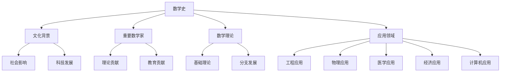
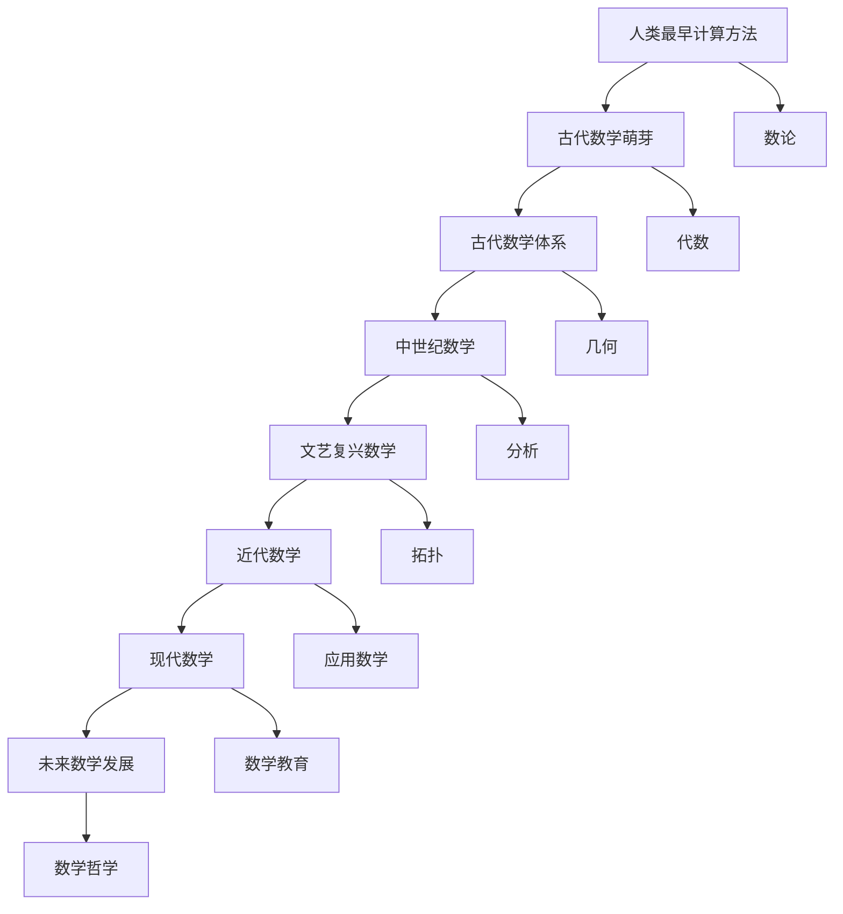

                 

# 数学史的文化背景与发展

> 关键词：数学史,文化背景,发展历程,重大事件,数学贡献,未来展望

## 1. 背景介绍

### 1.1 问题的由来

数学是一门古老而复杂的科学，其历史可以追溯到数万年前人类最早的计算和记数方法。数学的发展不仅是人类智慧的结晶，更是文化、科技和社会进步的重要推动者。探讨数学史的文化背景与发展，不仅有助于理解数学的起源与演进，还能洞察其在人类文明进步中的独特作用。

### 1.2 问题核心关键点

数学史的研究涉及多方面的内容，包括数学思想的萌芽、重要数学家的贡献、数学理论与实践的结合，以及数学在人类社会中的广泛应用。理解这些关键点，能够更全面地把握数学发展的脉络，认识到其在不同文化背景下所起到的作用。

### 1.3 问题研究意义

探讨数学史的文化背景与发展，对理解人类文明的进步、科技创新的源泉、教育体系的构建等具有重要意义。通过研究数学史，可以更深刻地认识到数学在人类社会中的重要作用，激发对数学学习的热情，促进科学和技术的进一步发展。

## 2. 核心概念与联系

### 2.1 核心概念概述

本节将介绍几个与数学史研究密切相关的核心概念：

- **数学史**：记录数学思想、理论、方法的发展历程，以及对社会、科学和文化的影响。
- **文化背景**：特定历史时期的社会、经济、政治、科技背景对数学发展的影响。
- **重要数学家**：如毕达哥拉斯、欧几里得、牛顿、欧拉、高斯、爱因斯坦等，他们在数学领域的贡献对后世产生了深远影响。
- **数学理论**：如数论、代数、几何、分析、拓扑等基础数学理论，及其在不同历史阶段的发展。
- **应用领域**：数学在工程、物理、医学、经济学、计算机科学等领域的广泛应用。

### 2.2 概念间的关系

这些核心概念之间的关系通过以下Mermaid流程图展示：



这个流程图展示了数学史与文化背景、重要数学家、数学理论、应用领域之间的关系，以及这些概念如何相互作用，推动数学的发展。

### 2.3 核心概念的整体架构

最后，用一个综合的流程图来展示这些核心概念在大数学史中的整体架构：



这个综合流程图展示了数学从萌芽到现代的发展历程，以及各个重要数学理论的诞生和应用。

## 3. 核心算法原理 & 具体操作步骤

### 3.1 算法原理概述

数学史的研究涉及对数学思想、方法和理论的梳理与理解，需要从历史、文化和社会等多个角度进行深入分析。其核心算法原理可以归纳为以下几个方面：

1. **文献挖掘**：通过整理和研究古代文献、手稿和历史记录，还原数学发展的历史脉络。
2. **思想重构**：对古代数学家的思想和理论进行现代解读，理解其在当时的文化背景下对数学的贡献。
3. **比较研究**：比较不同文化和时期数学的发展，分析其差异和联系，揭示数学发展的一般规律。
4. **影响评估**：评估数学思想和理论对社会、科技和教育的影响，认识其深远的历史意义。

### 3.2 算法步骤详解

基于上述算法原理，数学史的研究步骤包括：

1. **文献收集与整理**：收集相关历史时期的文献和资料，进行分类整理。
2. **文献分析与解读**：逐篇分析文献内容，还原数学家的思想和理论。
3. **理论重建与验证**：基于解读结果，重建数学理论，并进行验证。
4. **影响评估与分析**：评估数学理论对后续发展的贡献，分析其在文化背景下的作用。

### 3.3 算法优缺点

数学史研究的优点包括：

- **全面性**：综合考虑历史、文化和社会背景，提供多角度的分析。
- **深度性**：通过对古代文献的深度解读，还原数学家的思想和理论。
- **系统性**：能够系统地梳理数学发展的历史脉络，揭示其演进规律。

缺点则包括：

- **主观性**：不同研究者对文献的解读可能存在差异，导致结论的多样性。
- **复杂性**：涉及跨学科的知识，需要广泛的知识储备和深入的分析能力。
- **时间消耗**：文献整理和分析工作量大，周期长。

### 3.4 算法应用领域

数学史的研究在以下几个领域具有重要应用：

- **教育与教学**：通过对数学史的研究，能够更好地理解数学思想的发展脉络，促进数学教育。
- **科学研究**：数学史为科学研究的理论基础提供了历史背景，有助于理解理论演进。
- **文化交流**：数学史是跨文化交流的重要桥梁，能够促进不同文化间的数学思想交流。
- **历史研究**：数学史与历史研究相结合，揭示人类文明的发展轨迹。

## 4. 数学模型和公式 & 详细讲解 & 举例说明

### 4.1 数学模型构建

数学史的研究需要构建数学模型来描述数学发展的过程。一个基本的数学史模型可以包括以下几个部分：

1. **时间线**：展示数学思想和理论的发展时间顺序。
2. **关键事件**：记录重要数学家的贡献、重大发现和理论发展。
3. **理论联系**：展示不同理论之间的联系和影响。
4. **文化背景**：描述数学发展所处的社会、经济、政治背景。

### 4.2 公式推导过程

以毕达哥拉斯定理为例，展示数学公式的推导过程：

$$
a^2 + b^2 = c^2
$$

推导过程如下：

1. 在直角三角形中，设直角边为 $a$ 和 $b$，斜边为 $c$。
2. 根据勾股定理，斜边 $c$ 的平方等于两直角边平方和。
3. 将 $c^2$ 展开，得到 $a^2 + b^2 = c^2$。

### 4.3 案例分析与讲解

以欧几里得《几何原本》为例，分析其在数学史中的地位和影响：

1. **背景**：《几何原本》是古希腊数学家欧几里得所著，被认为是数学史上最重要的著作之一。
2. **内容**：全书共13卷，涵盖了从几何到数论的广泛数学内容。
3. **影响**：该书奠定了几何学的基础，影响了后世的数学教育和理论发展。
4. **文化背景**：《几何原本》的出版标志着数学从经验科学走向理论科学的转折点，促进了数学的发展。

## 5. 项目实践：代码实例和详细解释说明

### 5.1 开发环境搭建

本节将介绍一个基于Python的数学史研究工具的开发环境搭建流程：

1. **安装Python**：从官网下载并安装Python，选择3.x版本。
2. **安装相关库**：使用pip安装NumPy、Pandas、Matplotlib等库，用于数据处理和可视化。
3. **配置环境**：设置Python路径，确保所有依赖库能够正常导入。

### 5.2 源代码详细实现

以下是一个简单的Python代码示例，用于整理和分析数学史文献：

```python
import pandas as pd
import numpy as np
import matplotlib.pyplot as plt

# 假设我们有一个包含数学家贡献的文献表
data = {
    'Name': ['毕达哥拉斯', '欧几里得', '牛顿', '高斯', '爱因斯坦'],
    'Contribution': ['勾股定理', '几何原本', '微积分', '数论', '相对论'],
    'Period': ['古希腊', '古希腊', '近代', '近代', '近代']
}

# 构建DataFrame
df = pd.DataFrame(data)

# 可视化贡献者分布
plt.bar(df['Name'], df['Contribution'], color='skyblue')
plt.xlabel('Name')
plt.ylabel('Contribution')
plt.title('Mathematicians and Their Contributions')
plt.show()

# 分析不同时期的贡献
periods = df.groupby('Period')['Contribution'].count()
plt.bar(periods.index, periods.values, color='green')
plt.xlabel('Period')
plt.ylabel('Number of Contributions')
plt.title('Contributions by Period')
plt.show()
```

### 5.3 代码解读与分析

上述代码展示了如何使用Pandas库处理数学史文献数据，并通过Matplotlib库进行可视化分析。具体来说：

1. **数据处理**：使用Pandas库构建DataFrame，将文献中的数学家和他们的贡献按照时期分组。
2. **可视化**：使用Matplotlib库绘制柱状图，展示不同数学家的贡献分布和各时期的贡献数量。
3. **分析**：通过分组统计，可以直观地看到不同时期的数学贡献分布，理解数学发展的历史趋势。

### 5.4 运行结果展示

运行上述代码后，可以得到以下结果：

- **贡献者分布图**：展示不同数学家的贡献分布，直观地看到毕达哥拉斯、欧几里得、牛顿、高斯和爱因斯坦等数学家的重要贡献。
- **贡献者数量图**：展示各时期的数学贡献数量，显示数学发展在不同时期的重要节点。

## 6. 实际应用场景

### 6.1 教育与教学

在教育领域，数学史研究可以帮助教师更好地理解数学思想的发展脉络，设计更加贴近学生认知的课程内容。例如，通过展示数学家的思考过程，激发学生的探索精神，提升数学学习的兴趣。

### 6.2 科学研究

在科学研究中，数学史提供了一个理论发展的历史背景，有助于理解理论的演进和应用。例如，通过研究牛顿的微积分理论，可以更好地理解其在物理学中的应用，促进科学进步。

### 6.3 文化交流

数学史是不同文化之间数学思想交流的重要桥梁。例如，通过研究古希腊的几何学，可以了解不同文化间的数学交流和影响，促进数学文化的传播。

### 6.4 未来应用展望

未来，数学史研究将进一步扩展其应用领域，与人工智能、大数据等新兴技术相结合，推动数学理论的发展和应用。例如，通过分析数学家的思想，开发智能化的数学教育系统，提升数学学习的效率和质量。

## 7. 工具和资源推荐

### 7.1 学习资源推荐

1. **《数学史》（Russell Stannard）**：详细介绍了数学发展的历史脉络，是研究数学史的重要参考书。
2. **Coursera《数学史》课程**：斯坦福大学开设的在线课程，系统介绍数学史的重要事件和人物。
3. **Wolfram MathWorld**：一个数学百科全书网站，提供丰富的数学历史知识。
4. **Mathematica软件**：强大的数学计算和绘图工具，支持广泛的数学公式和算法。
5. **Google Scholar**：查找数学文献和学术研究的重要资源。

### 7.2 开发工具推荐

1. **Python编程语言**：作为数学研究和开发的常用语言，Python具有丰富的数学库和工具。
2. **Jupyter Notebook**：用于编写和运行Python代码的交互式笔记本，支持实时可视化。
3. **LaTeX排版系统**：用于编写数学公式和文档的标准排版系统。
4. **R编程语言**：主要用于数据统计和可视化，适用于大规模数学数据分析。

### 7.3 相关论文推荐

1. **《数学史与文化》（P. Nahin）**：探讨数学史对文化和社会的影响，提供了丰富的历史案例。
2. **《数学的思想》（A. Sieg）**：通过数学家的思想和贡献，探讨数学发展的一般规律。
3. **《数学史》（L. Hobbes）**：经典数学史著作，阐述了数学思想的发展脉络。

## 8. 总结：未来发展趋势与挑战

### 8.1 研究成果总结

本节将总结数学史研究的主要成果和趋势，并对未来发展方向进行展望。

### 8.2 未来发展趋势

数学史研究将朝着以下几个方向发展：

1. **跨学科研究**：数学史研究将与人工智能、大数据等新兴技术结合，推动数学理论的进一步发展。
2. **全球化视角**：数学史研究将更多关注不同文化间的数学交流和影响，促进全球数学文化的传播。
3. **数字化转型**：数学史研究将借助数字技术，如大数据、机器学习等，提高研究效率和精度。

### 8.3 面临的挑战

数学史研究面临以下挑战：

1. **文献稀缺**：古代数学文献的获取和解读存在困难，需要广泛的知识储备和深入的分析能力。
2. **解读复杂**：不同数学家的思想和理论存在差异，解读过程中容易出现误解。
3. **数据复杂**：数学史研究涉及大量数据和信息，需要进行系统化整理和分析。

### 8.4 研究展望

未来，数学史研究需要在以下方面进行突破：

1. **数字化工具**：开发更多数学史研究的数字化工具，提高研究效率和精度。
2. **跨文化交流**：促进不同文化间的数学交流，推动全球数学文化的传播。
3. **人工智能辅助**：利用人工智能技术，如自然语言处理、图像识别等，辅助数学史研究。

## 9. 附录：常见问题与解答

### Q1: 数学史研究的主要内容有哪些？

A: 数学史研究的主要内容包括：文献收集与整理、思想重构、理论重建与验证、影响评估与分析。

### Q2: 如何理解数学史对社会的影响？

A: 数学史对社会的影响可以从多个角度理解，包括科学进步、教育发展、文化交流、技术创新等。

### Q3: 数学史研究的难点在哪里？

A: 数学史研究的难点在于文献稀缺、解读复杂、数据复杂等方面。

### Q4: 数学史研究如何与人工智能结合？

A: 数学史研究可以与人工智能结合，通过自然语言处理、图像识别等技术，辅助文献解读和数据分析。

### Q5: 未来数学史研究的发展方向是什么？

A: 未来数学史研究的发展方向包括跨学科研究、全球化视角、数字化转型、人工智能辅助等。

---

作者：禅与计算机程序设计艺术 / Zen and the Art of Computer Programming

