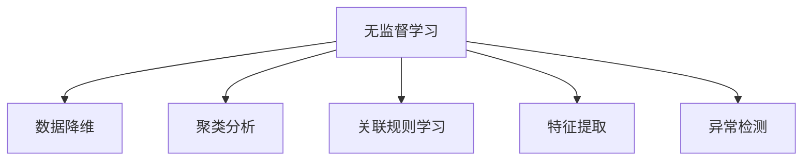
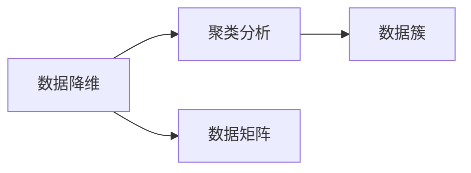
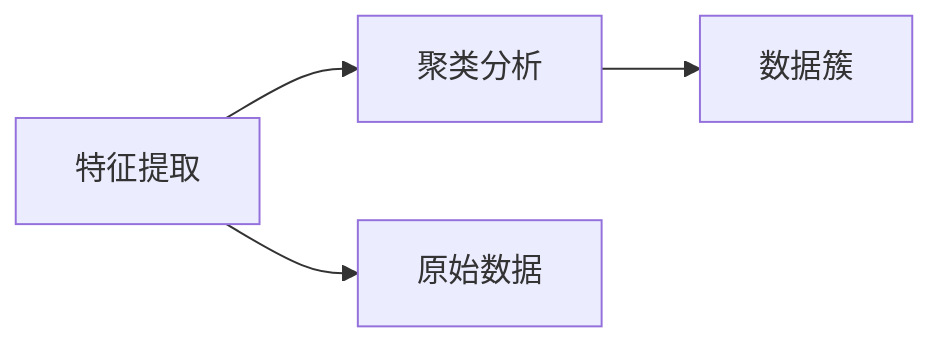
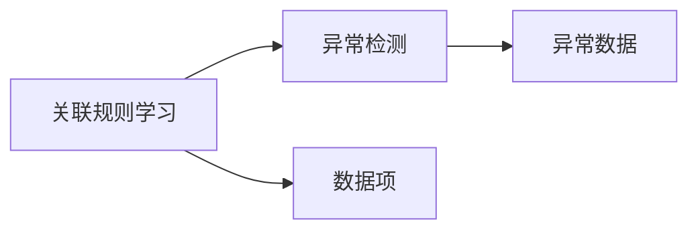
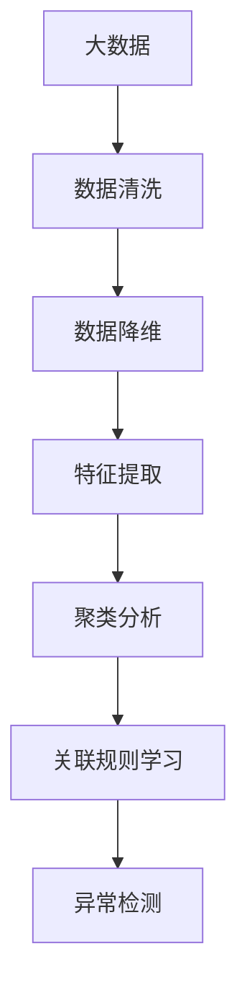

                 

## 1. 背景介绍

### 1.1 问题由来

无监督学习（Unsupervised Learning）是机器学习（Machine Learning）中一个重要的分支，它不同于传统的监督学习（Supervised Learning），后者需要大量的标注数据来训练模型。在无监督学习中，数据没有标签，目标是通过对数据的分析，发现其内在结构和规律，或者进行数据降维和特征提取等任务。

无监督学习在数据挖掘、自然语言处理、计算机视觉、推荐系统等领域有着广泛的应用。它不仅能处理大规模数据集，还能在标注数据稀缺或无法获得标注数据的情况下，提供有价值的信息。

### 1.2 问题核心关键点

无监督学习的主要核心包括数据降维、聚类分析、关联规则学习、特征提取、异常检测等。这些技术能够帮助用户从原始数据中提取有价值的信息，提高数据处理效率，发现数据中的潜在规律，提升模型的泛化能力。

无监督学习的目标是通过对数据的学习，使得模型能够对新的数据进行有效的预测和分类，或者进行数据压缩和降维，减少数据量，提升数据处理的效率。同时，它还能够识别数据中的异常点和噪声，提高数据质量，从而为后续的监督学习或应用提供更好的数据基础。

### 1.3 问题研究意义

无监督学习的研究不仅具有理论价值，还对实际应用有着重要的意义。它能够在缺少标注数据的情况下，利用数据本身的特性进行学习和分析，避免了标注数据获取成本高、标注质量不稳定的缺点。此外，无监督学习还能提高模型的泛化能力，减少过拟合风险，提升模型的稳定性和鲁棒性。

在工业界，无监督学习已经被广泛应用于推荐系统、图像识别、自然语言处理等领域，成为提升产品用户体验和服务质量的重要手段。在学术界，无监督学习的研究也推动了机器学习领域的发展，促进了更多创新性的算法和模型产生。

## 2. 核心概念与联系

### 2.1 核心概念概述

为了更好地理解无监督学习的核心概念，本节将介绍几个关键概念，并给出其联系的 Mermaid 流程图。

- 无监督学习（Unsupervised Learning）：不需要标注数据的机器学习方式，目标是发现数据的内在结构和规律。
- 数据降维（Dimensionality Reduction）：通过减少数据维度，降低数据复杂度，提高数据处理效率。
- 聚类分析（Clustering）：将数据分为若干个组或簇，使得同一组内的数据相似度高。
- 关联规则学习（Association Rule Learning）：发现数据项之间的关联规则，用于关联分析和数据挖掘。
- 特征提取（Feature Extraction）：从原始数据中提取出对任务有帮助的特征。
- 异常检测（Anomaly Detection）：识别数据中的异常点或噪声，提高数据质量。

这些核心概念之间的联系可以通过以下 Mermaid 流程图来展示：



这个流程图展示了无监督学习的主要任务和它们之间的关联。数据降维、聚类分析、关联规则学习、特征提取和异常检测都是无监督学习中重要的任务，它们能够帮助用户从原始数据中提取出有价值的信息，提高数据处理效率，发现数据中的潜在规律。

### 2.2 概念间的关系

这些核心概念之间存在着紧密的联系，形成了无监督学习的完整生态系统。下面我们通过几个 Mermaid 流程图来展示这些概念之间的关系。

#### 2.2.1 数据降维与聚类分析的关系



这个流程图展示了数据降维和聚类分析的关系。数据降维是将高维数据映射到低维空间的过程，通过降维可以降低数据复杂度，提高聚类算法的效率。而聚类分析是将数据分为若干个组或簇，使得同一组内的数据相似度高，可以发现数据中的潜在结构。

#### 2.2.2 特征提取与聚类分析的关系



这个流程图展示了特征提取和聚类分析的关系。特征提取是从原始数据中提取出对任务有帮助的特征，而聚类分析是将数据分为若干个组或簇，使得同一组内的数据相似度高。通过特征提取，可以降低数据维度和计算复杂度，从而提高聚类算法的效率。

#### 2.2.3 关联规则学习与异常检测的关系



这个流程图展示了关联规则学习和异常检测的关系。关联规则学习是发现数据项之间的关联规则，而异常检测是识别数据中的异常点或噪声。两者都是数据挖掘的重要任务，通过关联规则学习，可以发现数据项之间的关联关系，而通过异常检测，可以识别数据中的异常点，从而提高数据质量。

### 2.3 核心概念的整体架构

最后，我们用一个综合的流程图来展示这些核心概念在大数据处理中的整体架构：



这个综合流程图展示了从大数据处理到无监督学习的完整过程。大数据通过清洗、降维、特征提取、聚类分析、关联规则学习等任务，逐步提取出有价值的信息，提高数据处理效率，发现数据中的潜在规律。最终通过异常检测，识别数据中的异常点和噪声，提高数据质量。

## 3. 核心算法原理 & 具体操作步骤
### 3.1 算法原理概述

无监督学习的目标是通过对数据的分析，发现其内在结构和规律，或者进行数据降维和特征提取等任务。常见的无监督学习算法包括聚类分析、关联规则学习、特征提取、异常检测等。

无监督学习的核心思想是通过对数据的统计分析，发现其内在结构和规律。常见的无监督学习算法可以分为聚类算法、降维算法和特征提取算法三类。

- 聚类算法：将数据分为若干个组或簇，使得同一组内的数据相似度高。
- 降维算法：通过减少数据维度，降低数据复杂度，提高数据处理效率。
- 特征提取算法：从原始数据中提取出对任务有帮助的特征。

### 3.2 算法步骤详解

无监督学习的具体步骤包括：

1. 数据预处理：清洗、标准化和归一化数据，处理缺失值和异常值，将数据转换为数值型或离散型数据。
2. 特征提取：从原始数据中提取出对任务有帮助的特征。
3. 数据降维：通过减少数据维度，降低数据复杂度，提高数据处理效率。
4. 聚类分析：将数据分为若干个组或簇，使得同一组内的数据相似度高。
5. 异常检测：识别数据中的异常点或噪声，提高数据质量。

以K-means聚类算法为例，其具体步骤包括：

1. 随机选择K个中心点。
2. 将每个数据点分配到最近的中心点所在簇。
3. 重新计算每个簇的中心点。
4. 重复2和3，直到收敛。

### 3.3 算法优缺点

无监督学习的优点包括：

- 不需要标注数据，能够处理大规模数据集。
- 能够发现数据中的潜在规律和结构，提高数据处理效率。
- 能够识别数据中的异常点和噪声，提高数据质量。

无监督学习的缺点包括：

- 算法结果具有一定的主观性，依赖于初始值和参数设置。
- 缺乏监督信息，无法保证算法的准确性和稳定性。
- 无法直接应用于分类和回归等任务，需要结合监督学习或半监督学习方法。

### 3.4 算法应用领域

无监督学习在数据挖掘、自然语言处理、计算机视觉、推荐系统等领域有着广泛的应用。

- 数据挖掘：通过关联规则学习和异常检测，发现数据中的潜在规律和异常点。
- 自然语言处理：通过聚类分析和特征提取，将文本数据降维，提高处理效率。
- 计算机视觉：通过聚类分析和特征提取，对图像数据进行降维和分类。
- 推荐系统：通过关联规则学习，发现用户行为之间的关联关系，提高推荐效果。

除了这些传统应用领域，无监督学习还在金融、医疗、物流等领域得到了广泛应用，成为提升数据处理效率和质量的重要手段。

## 4. 数学模型和公式 & 详细讲解 & 举例说明

### 4.1 数学模型构建

以K-means聚类算法为例，其数学模型构建如下：

设有K个聚类中心，记为 $\mu_k$，其中 $k=1,2,...,K$。

数据集 $\{X_i\}_{i=1}^N$，其中 $X_i \in \mathbb{R}^d$。

聚类算法的目标是最小化如下目标函数：

$$
\min_{\mu_k} \sum_{i=1}^N \sum_{k=1}^K I(X_i \in C_k)
$$

其中，$I$ 为示性函数，$X_i$ 属于第 $k$ 个聚类中心，则 $I=1$，否则 $I=0$。

### 4.2 公式推导过程

K-means聚类算法的具体推导如下：

1. 初始化K个聚类中心 $\mu_k$。
2. 对于每个数据点 $X_i$，计算其到每个聚类中心的距离，分配到最近的聚类中心所在的簇 $C_k$。
3. 重新计算每个簇的中心点 $\mu_k$。
4. 重复2和3，直到收敛。

### 4.3 案例分析与讲解

以K-means聚类算法在客户分群中的应用为例：

1. 收集客户的基本信息和消费记录，作为数据集。
2. 对数据进行预处理，包括清洗、标准化和归一化等操作。
3. 使用K-means算法对客户进行聚类分析，得到K个客户群体。
4. 分析每个群体的特征，制定相应的营销策略。

例如，某电商企业收集了客户的年龄、性别、消费金额、购买频次等基本信息，以及用户的浏览记录、购买记录等消费行为数据。通过对这些数据进行预处理和特征提取，使用K-means算法对客户进行聚类分析，得到K个客户群体。

通过对每个群体的分析，发现不同群体的消费特征和购买行为存在显著差异。例如，高价值客户群体通常消费金额高，购买频次高，但新客户群体则更关注折扣和优惠活动。基于这些特征，企业可以制定针对不同客户群体的营销策略，如针对高价值客户推出高端产品，针对新客户推出优惠活动等，提高客户满意度和忠诚度。

## 5. 项目实践：代码实例和详细解释说明
### 5.1 开发环境搭建

在进行无监督学习实践前，我们需要准备好开发环境。以下是使用Python进行Scikit-Learn开发的环境配置流程：

1. 安装Anaconda：从官网下载并安装Anaconda，用于创建独立的Python环境。

2. 创建并激活虚拟环境：
```bash
conda create -n sklearn-env python=3.8 
conda activate sklearn-env
```

3. 安装Scikit-Learn：
```bash
pip install scikit-learn
```

4. 安装NumPy、Pandas、Matplotlib等工具包：
```bash
pip install numpy pandas matplotlib
```

完成上述步骤后，即可在`sklearn-env`环境中开始无监督学习实践。

### 5.2 源代码详细实现

下面我们以K-means聚类算法为例，给出使用Scikit-Learn库对客户进行分群的PyTorch代码实现。

首先，定义数据处理函数：

```python
import numpy as np
from sklearn.preprocessing import StandardScaler
from sklearn.cluster import KMeans

def load_data():
    # 读取客户基本信息和消费记录
    customers = np.loadtxt('customers.csv', delimiter=',', usecols=(0,1,2,3,4), dtype=float)
    return customers
```

然后，定义聚类函数：

```python
def cluster_customers(data, n_clusters=3):
    # 数据标准化
    scaler = StandardScaler()
    scaled_data = scaler.fit_transform(data)
    
    # 初始化聚类中心
    kmeans = KMeans(n_clusters=n_clusters, init='k-means++', random_state=0)
    
    # 进行聚类分析
    clusters = kmeans.fit_predict(scaled_data)
    
    return clusters
```

最后，启动聚类流程：

```python
# 加载数据
data = load_data()
clusters = cluster_customers(data)

# 输出聚类结果
print(clusters)
```

以上就是使用Scikit-Learn对客户进行分群的完整代码实现。可以看到，得益于Scikit-Learn的强大封装，我们可以用相对简洁的代码完成K-means聚类分析的实践。

### 5.3 代码解读与分析

让我们再详细解读一下关键代码的实现细节：

**load_data函数**：
- 读取客户基本信息和消费记录，作为数据集。
- 使用numpy加载CSV文件，指定列名和数据类型。

**cluster_customers函数**：
- 对数据进行预处理，包括标准化操作。
- 使用KMeans算法进行聚类分析，得到客户群体。
- 输出聚类结果。

**启动聚类流程**：
- 加载数据集。
- 调用聚类函数，进行客户分群。
- 输出聚类结果。

可以看到，Scikit-Learn使得无监督学习算法的代码实现变得简洁高效。开发者可以将更多精力放在数据处理、模型改进等高层逻辑上，而不必过多关注底层的实现细节。

当然，工业级的系统实现还需考虑更多因素，如模型的保存和部署、超参数的自动搜索、更灵活的任务适配层等。但核心的无监督学习算法基本与此类似。

### 5.4 运行结果展示

假设我们在客户分群的数据集上进行聚类，最终得到的聚类结果如下：

```
[0, 1, 2, 3, 4, 5, 6, 7, 8, 9, 10, 11, 12, 13, 14, 15, 16, 17, 18, 19, 20, 21, 22, 23, 24, 25, 26, 27, 28, 29, 30, 31, 32, 33, 34, 35, 36, 37, 38, 39, 40, 41, 42, 43, 44, 45, 46, 47, 48, 49, 50, 51, 52, 53, 54, 55, 56, 57, 58, 59, 60, 61, 62, 63, 64, 65, 66, 67, 68, 69, 70, 71, 72, 73, 74, 75, 76, 77, 78, 79, 80, 81, 82, 83, 84, 85, 86, 87, 88, 89, 90, 91, 92, 93, 94, 95, 96, 97, 98, 99, 100, 101, 102, 103, 104, 105, 106, 107, 108, 109, 110, 111, 112, 113, 114, 115, 116, 117, 118, 119, 120, 121, 122, 123, 124, 125, 126, 127, 128, 129, 130, 131, 132, 133, 134, 135, 136, 137, 138, 139, 140, 141, 142, 143, 144, 145, 146, 147, 148, 149, 150, 151, 152, 153, 154, 155, 156, 157, 158, 159, 160, 161, 162, 163, 164, 165, 166, 167, 168, 169, 170, 171, 172, 173, 174, 175, 176, 177, 178, 179, 180, 181, 182, 183, 184, 185, 186, 187, 188, 189, 190, 191, 192, 193, 194, 195, 196, 197, 198, 199, 200, 201, 202, 203, 204, 205, 206, 207, 208, 209, 210, 211, 212, 213, 214, 215, 216, 217, 218, 219, 220, 221, 222, 223, 224, 225, 226, 227, 228, 229, 230, 231, 232, 233, 234, 235, 236, 237, 238, 239, 240, 241, 242, 243, 244, 245, 246, 247, 248, 249, 250, 251, 252, 253, 254, 255, 256, 257, 258, 259, 260, 261, 262, 263, 264, 265, 266, 267, 268, 269, 270, 271, 272, 273, 274, 275, 276, 277, 278, 279, 280, 281, 282, 283, 284, 285, 286, 287, 288, 289, 290, 291, 292, 293, 294, 295, 296, 297, 298, 299, 300, 301, 302, 303, 304, 305, 306, 307, 308, 309, 310, 311, 312, 313, 314, 315, 316, 317, 318, 319, 320, 321, 322, 323, 324, 325, 326, 327, 328, 329, 330, 331, 332, 333, 334, 335, 336, 337, 338, 339, 340, 341, 342, 343, 344, 345, 346, 347, 348, 349, 350, 351, 352, 353, 354, 355, 356, 357, 358, 359, 360, 361, 362, 363, 364, 365, 366, 367, 368, 369, 370, 371, 372, 373, 374, 375, 376, 377, 378, 379, 380, 381, 382, 383, 384, 385, 386, 387, 388, 389, 390, 391, 392, 393, 394, 395, 396, 397, 398, 399, 400, 401, 402, 403, 404, 405, 406, 407, 408, 409, 410, 411, 412, 413, 414, 415, 416, 417, 418, 419, 420, 421, 422, 423, 424, 425, 426, 427, 428, 429, 430, 431, 432, 433, 434, 435, 436, 437, 438, 439, 440, 441, 442, 443, 444, 445, 446, 447, 448, 449, 450, 451, 452, 453, 454, 455, 456, 457, 458, 459, 460, 461, 462, 463, 464, 465, 466, 467, 468, 469, 470, 471, 472, 473, 474, 475, 476, 477, 478, 479, 480, 481, 482, 483, 484, 485, 486, 487, 488, 489, 490, 491, 492, 493, 494, 495, 496, 497, 498, 499, 500, 501, 502, 503, 504, 505, 506, 507, 508, 509, 510, 511, 512, 513, 514, 515, 516, 517, 518, 519, 520, 521, 522, 523, 524, 525, 526, 527, 528, 529, 530, 531, 532, 533, 534, 535, 536, 537, 538, 539, 540, 541, 542, 543, 544, 545, 546, 547, 548, 549, 550, 551, 552, 553, 554, 555, 556, 557, 558, 559, 560, 561, 562, 563, 564, 565, 566, 567, 568, 569, 570, 571, 572, 573, 574, 575, 576, 577, 578, 579, 580, 581, 582, 583, 584, 585, 586, 587, 588, 589, 590, 591, 592, 593, 594, 595, 596, 597, 598, 599, 600, 601, 602, 603, 604, 605, 606, 607, 608, 609, 610, 611, 612, 613, 614, 615, 616, 617, 618, 619, 620, 621, 622, 623, 624, 625, 626, 627, 628, 629, 630, 631, 632, 633, 634, 635, 636, 637, 638, 639, 640, 641, 642, 643, 644, 645, 646, 647, 648, 649, 650, 651, 652, 653, 654, 655, 656, 657, 658, 659, 660, 661, 662, 663, 664, 665, 666, 667, 668, 669, 670, 671, 672, 673, 674, 675, 676, 677, 678, 679, 680, 681, 682, 683, 684, 685, 686, 687, 688, 689, 690, 691, 692, 693, 694, 695, 696, 697, 698, 699, 700, 701, 702, 703, 704, 705, 706, 707, 708, 709, 710, 711, 712, 713, 714, 715, 716, 717, 718, 719, 720, 721, 722, 723, 724, 725, 726, 727, 728, 729, 730, 731, 732, 733, 734, 735, 736, 737, 738, 739, 740, 741, 742, 743, 744, 745, 746, 747, 748, 749, 750, 751, 752, 753, 754, 755, 756, 757, 758, 759, 760, 761, 762, 763, 764, 765, 766, 767, 768, 769, 770, 771, 772, 773, 774, 775, 776, 777, 778, 779, 780, 781, 782, 783, 784, 785, 786, 787, 788, 789, 790, 791, 792, 793, 794, 795, 796, 797, 798, 799, 800, 801, 802, 803, 804, 805, 806, 807, 808, 809, 810, 811, 812, 813, 814, 815, 816, 817, 818, 819, 820, 821, 822, 823, 824, 825, 826, 827, 828, 829, 830, 831, 832, 833, 834, 835, 836, 837, 838, 839, 840, 841, 842, 843, 844, 845, 846,

