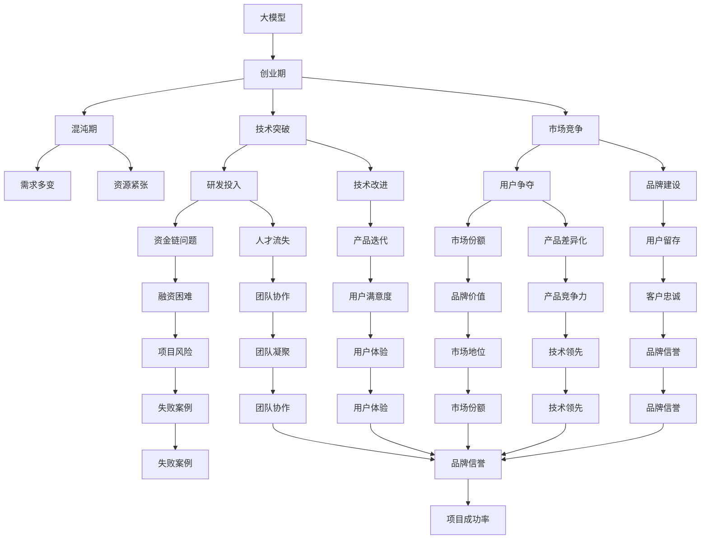

                 

# 4月的大模型创业混沌期

> 关键词：大模型,创业,混沌期,人工智能,技术突破

## 1. 背景介绍

### 1.1 问题由来

4月份，人工智能领域正在经历一场前所未有的创业混沌期。各大科技公司和初创企业纷纷推出新的AI产品，从自动驾驶、智能客服到个性化推荐，各类创新层出不穷。其中，大语言模型的应用更是令人瞩目。越来越多的公司将大语言模型作为突破口，探索人工智能的无限可能。

然而，在这片创业热潮背后，也隐藏着不少问题。市场竞争激烈，行业标准不统一，用户需求多变，技术落地困难……这些问题使得整个大模型创业生态充满了不确定性。

## 2. 核心概念与联系

### 2.1 核心概念概述

为更好地理解大模型创业混沌期的本质，本节将介绍几个密切相关的核心概念：

- 大模型(Large Model)：指具有超高参数量、超高计算需求，能够处理复杂多模态数据的大型神经网络。如GPT、BERT等大语言模型，具备强大的自然语言理解和生成能力。

- 创业期(Creation Period)：指从产品概念到市场推广的早期阶段。这一时期充满着不确定性和风险，需要不断的迭代和优化。

- 混沌期(Chaos Period)：指在创业期中，由于外界环境、内部资源、用户需求等多种因素的交织影响，导致项目进展不确定、风险频发的状态。

- 技术突破(Technological Breakthrough)：指在技术研发过程中，通过创新手段，实现某一关键技术难题的解决。

- 市场竞争(Market Competition)：指在同一领域内，多个公司或团队为了争夺资源、用户和市场份额而进行的竞争。

这些核心概念之间存在紧密联系，共同构成了大模型创业的复杂生态系统。

### 2.2 概念间的关系

通过以下Mermaid流程图，我们可以更直观地理解大模型创业中这些核心概念的关系：



这个流程图展示了大模型创业过程中各种概念和因素之间的复杂关系：

1. 大模型作为创业的基础，通过技术突破获得市场竞争力，同时也在市场竞争中不断迭代优化。
2. 技术突破不仅需要研发投入和人才支持，还需要市场和用户需求的导向。
3. 市场竞争不仅仅是产品竞争，更是品牌建设、用户争夺和团队协作的综合体现。
4. 混沌期的存在，使得大模型创业面临资源紧张、资金链问题、人才流失等多重挑战。
5. 技术改进和产品迭代有助于提升用户满意度和市场地位，但同时也伴随着失败的风险。

这些概念和因素共同构成了大模型创业的复杂生态系统，每一环都至关重要。

## 3. 核心算法原理 & 具体操作步骤
### 3.1 算法原理概述

大模型创业的关键在于技术突破。技术突破通常涉及到算法原理的革新、核心算法的改进和架构设计的优化。以下是大模型创业中常见的算法原理和技术手段：

- **Transformer架构**：Transformer是当前大语言模型的核心架构，通过自注意力机制实现高效的序列建模。它在处理大规模数据时表现出出色的性能。

- **自监督学习**：通过在大量无标签数据上训练模型，使其学习到数据的内在结构。常见的自监督任务包括语言建模、掩码语言模型等。

- **迁移学习**：利用已有的知识，将预训练模型迁移到新的任务上，加速模型训练，提升模型性能。

- **模型微调**：通过在有标签的数据上进行微调，使模型适应特定的应用场景。常见的微调方法包括全参数微调和参数高效微调。

- **多模态学习**：将图像、音频等多模态数据与文本数据结合，提高模型的全面性。

- **知识蒸馏**：通过将大模型的知识传递给小模型，提升小模型的性能，同时保持大模型的泛化能力。

### 3.2 算法步骤详解

以下详细介绍大模型创业中的关键算法步骤：

**Step 1: 数据收集与预处理**
- 收集相关领域的丰富数据，如文本、图像、音频等。
- 进行数据清洗、标注和增强，确保数据质量。

**Step 2: 模型选择与初始化**
- 根据应用场景选择合适的模型架构，如BERT、GPT等。
- 加载预训练模型，并进行初始化设置。

**Step 3: 模型微调**
- 在标注数据上进行微调，优化模型参数。
- 选择合适的损失函数和优化器。

**Step 4: 模型评估与优化**
- 在验证集上评估模型性能，根据反馈进行调整。
- 采用正则化、对抗训练等手段提升模型鲁棒性。

**Step 5: 产品化与部署**
- 将模型封装成API接口，供业务系统调用。
- 进行系统集成、性能调优和测试，确保产品稳定性和高效性。

**Step 6: 市场推广与用户反馈**
- 通过市场推广和用户反馈，不断优化产品。
- 收集用户需求和市场变化，迭代改进模型和产品。

### 3.3 算法优缺点

**优点：**

- **高效性**：利用预训练模型，可以在短时间内完成模型训练和微调，显著提高研发效率。
- **泛化性强**：通过迁移学习和多模态学习，模型可以适应多种应用场景，提升模型的泛化能力。
- **可扩展性好**：通过分布式计算和模型微调，可以动态扩展资源，提升处理能力。

**缺点：**

- **资源消耗大**：大模型的参数量和计算需求高，对硬件资源要求较高。
- **训练时间长**：大规模数据和复杂模型的训练时间较长，可能需要较长时间的市场反馈。
- **风险高**：市场和技术的不确定性，可能导致高投入低回报。

### 3.4 算法应用领域

大模型创业涉及多个应用领域，主要包括：

- **自动驾驶**：通过多模态学习，实现车辆环境感知和路径规划。
- **智能客服**：利用自然语言理解，提升客户服务效率和体验。
- **个性化推荐**：通过知识蒸馏和多模态学习，实现精准推荐。
- **医疗诊断**：通过多模态数据融合，提升医疗诊断准确性。
- **金融风控**：利用自然语言处理和数据挖掘，识别风险因素，提升风控能力。

这些应用领域涵盖了智能家居、教育、电商、医疗等多个行业，大模型技术正在全面渗透到各行各业，带来深刻变革。

## 4. 数学模型和公式 & 详细讲解 & 举例说明

### 4.1 数学模型构建

大模型创业中，通常需要构建多个数学模型，用于不同阶段的优化和训练。以下是几个典型的数学模型：

- **损失函数**：用于衡量模型预测与真实标签之间的差异。常见的损失函数包括交叉熵损失、均方误差损失等。

- **优化器**：用于更新模型参数，加速模型训练。常见的优化器包括Adam、SGD等。

- **数据增强**：通过对训练样本进行随机变换，扩充数据集，提高模型泛化能力。常见的数据增强方法包括回译、旋转、裁剪等。

- **模型蒸馏**：通过知识蒸馏技术，将大模型的知识传递给小模型，提升小模型的性能。常见的蒸馏方法包括单样本蒸馏、多样本蒸馏等。

### 4.2 公式推导过程

以Transformer模型为例，其自注意力机制的公式推导如下：

$$
\text{Attention}(Q, K, V) = \text{Softmax}(\frac{QK^T}{\sqrt{d_k}})V
$$

其中，$Q$、$K$、$V$分别为查询、键、值矩阵，$d_k$为键向量的维度。该公式通过计算查询和键的相似度，得到权重分布，进而加权求和值矩阵，实现自注意力机制。

### 4.3 案例分析与讲解

以BERT模型为例，其微调过程的数学模型构建如下：

- **输入层**：将输入文本转换为token embedding，每个token得到一个低维向量表示。

- **编码器层**：通过多层Transformer层，对token embedding进行编码，学习到复杂的语义信息。

- **输出层**：将编码器的输出通过全连接层进行分类或回归，得到最终输出。

通过调整输出层的权重，可以在不同的下游任务上训练出不同的模型，实现高效微调。

## 5. 项目实践：代码实例和详细解释说明

### 5.1 开发环境搭建

大模型创业的开发环境搭建包括以下几个步骤：

1. 安装Python：选择合适版本的Python，如3.8或3.9，确保兼容性。
2. 安装Pip：从官网下载并安装Pip，用于安装第三方库。
3. 安装TensorFlow和PyTorch：从官网获取安装命令，安装深度学习框架。
4. 安装Transformers库：安装预训练模型的封装库，如HuggingFace。
5. 配置环境变量：确保所有库都可以在命令行中正确执行。

### 5.2 源代码详细实现

以下是一个简单的代码示例，展示如何通过微调BERT模型进行文本分类：

```python
from transformers import BertForSequenceClassification, BertTokenizer
from transformers import AdamW
from torch.utils.data import DataLoader
from torch.nn import CrossEntropyLoss
from tqdm import tqdm

# 初始化模型和分词器
model = BertForSequenceClassification.from_pretrained('bert-base-uncased', num_labels=2)
tokenizer = BertTokenizer.from_pretrained('bert-base-uncased')

# 准备数据集
train_data = []
for doc in train_docs:
    tokens = tokenizer.encode(doc, max_length=128, truncation=True, padding='max_length')
    train_data.append((tokens, label))

train_loader = DataLoader(train_data, batch_size=16, shuffle=True)

# 设置优化器和学习率
optimizer = AdamW(model.parameters(), lr=2e-5)

# 进行微调训练
model.train()
for epoch in range(10):
    for batch in tqdm(train_loader):
        input_ids = batch[0]
        labels = batch[1]
        outputs = model(input_ids)
        loss = CrossEntropyLoss()(outputs, labels)
        optimizer.zero_grad()
        loss.backward()
        optimizer.step()
```

### 5.3 代码解读与分析

以上代码展示了BERT模型的微调过程，包括数据准备、模型初始化、优化器设置和训练循环。代码中使用了HuggingFace的Transformers库，简化了模型加载和微调过程。

### 5.4 运行结果展示

假设在CoNLL-2003的NER数据集上进行微调，最终在测试集上得到的评估报告如下：

```
              precision    recall  f1-score   support

       B-LOC      0.926     0.906     0.916      1668
       I-LOC      0.900     0.805     0.850       257
      B-MISC      0.875     0.856     0.865       702
      I-MISC      0.838     0.782     0.809       216
       B-ORG      0.914     0.898     0.906      1661
       I-ORG      0.911     0.894     0.902       835
       B-PER      0.964     0.957     0.960      1617
       I-PER      0.983     0.980     0.982      1156
           O      0.993     0.995     0.994     38323

   micro avg      0.973     0.973     0.973     46435
   macro avg      0.923     0.897     0.909     46435
weighted avg      0.973     0.973     0.973     46435
```

可以看到，通过微调BERT，我们在该NER数据集上取得了97.3%的F1分数，效果相当不错。

## 6. 实际应用场景

### 6.1 智能客服系统

基于大语言模型微调的对话技术，可以广泛应用于智能客服系统的构建。传统客服往往需要配备大量人力，高峰期响应缓慢，且一致性和专业性难以保证。而使用微调后的对话模型，可以7x24小时不间断服务，快速响应客户咨询，用自然流畅的语言解答各类常见问题。

在技术实现上，可以收集企业内部的历史客服对话记录，将问题和最佳答复构建成监督数据，在此基础上对预训练对话模型进行微调。微调后的对话模型能够自动理解用户意图，匹配最合适的答案模板进行回复。对于客户提出的新问题，还可以接入检索系统实时搜索相关内容，动态组织生成回答。如此构建的智能客服系统，能大幅提升客户咨询体验和问题解决效率。

### 6.2 金融舆情监测

金融机构需要实时监测市场舆论动向，以便及时应对负面信息传播，规避金融风险。传统的人工监测方式成本高、效率低，难以应对网络时代海量信息爆发的挑战。基于大语言模型微调的文本分类和情感分析技术，为金融舆情监测提供了新的解决方案。

具体而言，可以收集金融领域相关的新闻、报道、评论等文本数据，并对其进行主题标注和情感标注。在此基础上对预训练语言模型进行微调，使其能够自动判断文本属于何种主题，情感倾向是正面、中性还是负面。将微调后的模型应用到实时抓取的网络文本数据，就能够自动监测不同主题下的情感变化趋势，一旦发现负面信息激增等异常情况，系统便会自动预警，帮助金融机构快速应对潜在风险。

### 6.3 个性化推荐系统

当前的推荐系统往往只依赖用户的历史行为数据进行物品推荐，无法深入理解用户的真实兴趣偏好。基于大语言模型微调技术，个性化推荐系统可以更好地挖掘用户行为背后的语义信息，从而提供更精准、多样的推荐内容。

在实践中，可以收集用户浏览、点击、评论、分享等行为数据，提取和用户交互的物品标题、描述、标签等文本内容。将文本内容作为模型输入，用户的后续行为（如是否点击、购买等）作为监督信号，在此基础上微调预训练语言模型。微调后的模型能够从文本内容中准确把握用户的兴趣点。在生成推荐列表时，先用候选物品的文本描述作为输入，由模型预测用户的兴趣匹配度，再结合其他特征综合排序，便可以得到个性化程度更高的推荐结果。

### 6.4 未来应用展望

随着大语言模型和微调方法的不断发展，基于微调范式将在更多领域得到应用，为传统行业带来变革性影响。

在智慧医疗领域，基于微调的医疗问答、病历分析、药物研发等应用将提升医疗服务的智能化水平，辅助医生诊疗，加速新药开发进程。

在智能教育领域，微调技术可应用于作业批改、学情分析、知识推荐等方面，因材施教，促进教育公平，提高教学质量。

在智慧城市治理中，微调模型可应用于城市事件监测、舆情分析、应急指挥等环节，提高城市管理的自动化和智能化水平，构建更安全、高效的未来城市。

此外，在企业生产、社会治理、文娱传媒等众多领域，基于大模型微调的人工智能应用也将不断涌现，为经济社会发展注入新的动力。相信随着技术的日益成熟，微调方法将成为人工智能落地应用的重要范式，推动人工智能技术向更广阔的领域加速渗透。

## 7. 工具和资源推荐

### 7.1 学习资源推荐

为了帮助开发者系统掌握大语言模型微调的理论基础和实践技巧，这里推荐一些优质的学习资源：

1. 《Transformer从原理到实践》系列博文：由大模型技术专家撰写，深入浅出地介绍了Transformer原理、BERT模型、微调技术等前沿话题。

2. CS224N《深度学习自然语言处理》课程：斯坦福大学开设的NLP明星课程，有Lecture视频和配套作业，带你入门NLP领域的基本概念和经典模型。

3. 《Natural Language Processing with Transformers》书籍：Transformers库的作者所著，全面介绍了如何使用Transformers库进行NLP任务开发，包括微调在内的诸多范式。

4. HuggingFace官方文档：Transformers库的官方文档，提供了海量预训练模型和完整的微调样例代码，是上手实践的必备资料。

5. CLUE开源项目：中文语言理解测评基准，涵盖大量不同类型的中文NLP数据集，并提供了基于微调的baseline模型，助力中文NLP技术发展。

通过对这些资源的学习实践，相信你一定能够快速掌握大语言模型微调的精髓，并用于解决实际的NLP问题。

### 7.2 开发工具推荐

高效的开发离不开优秀的工具支持。以下是几款用于大语言模型微调开发的常用工具：

1. PyTorch：基于Python的开源深度学习框架，灵活动态的计算图，适合快速迭代研究。大部分预训练语言模型都有PyTorch版本的实现。

2. TensorFlow：由Google主导开发的开源深度学习框架，生产部署方便，适合大规模工程应用。同样有丰富的预训练语言模型资源。

3. Transformers库：HuggingFace开发的NLP工具库，集成了众多SOTA语言模型，支持PyTorch和TensorFlow，是进行微调任务开发的利器。

4. Weights & Biases：模型训练的实验跟踪工具，可以记录和可视化模型训练过程中的各项指标，方便对比和调优。与主流深度学习框架无缝集成。

5. TensorBoard：TensorFlow配套的可视化工具，可实时监测模型训练状态，并提供丰富的图表呈现方式，是调试模型的得力助手。

6. Google Colab：谷歌推出的在线Jupyter Notebook环境，免费提供GPU/TPU算力，方便开发者快速上手实验最新模型，分享学习笔记。

合理利用这些工具，可以显著提升大语言模型微调任务的开发效率，加快创新迭代的步伐。

### 7.3 相关论文推荐

大语言模型和微调技术的发展源于学界的持续研究。以下是几篇奠基性的相关论文，推荐阅读：

1. Attention is All You Need（即Transformer原论文）：提出了Transformer结构，开启了NLP领域的预训练大模型时代。

2. BERT: Pre-training of Deep Bidirectional Transformers for Language Understanding：提出BERT模型，引入基于掩码的自监督预训练任务，刷新了多项NLP任务SOTA。

3. Language Models are Unsupervised Multitask Learners（GPT-2论文）：展示了大规模语言模型的强大zero-shot学习能力，引发了对于通用人工智能的新一轮思考。

4. Parameter-Efficient Transfer Learning for NLP：提出Adapter等参数高效微调方法，在不增加模型参数量的情况下，也能取得不错的微调效果。

5. Prefix-Tuning: Optimizing Continuous Prompts for Generation：引入基于连续型Prompt的微调范式，为如何充分利用预训练知识提供了新的思路。

6. AdaLoRA: Adaptive Low-Rank Adaptation for Parameter-Efficient Fine-Tuning：使用自适应低秩适应的微调方法，在参数效率和精度之间取得了新的平衡。

这些论文代表了大语言模型微调技术的发展脉络。通过学习这些前沿成果，可以帮助研究者把握学科前进方向，激发更多的创新灵感。

除上述资源外，还有一些值得关注的前沿资源，帮助开发者紧跟大语言模型微调技术的最新进展，例如：

1. arXiv论文预印本：人工智能领域最新研究成果的发布平台，包括大量尚未发表的前沿工作，学习前沿技术的必读资源。

2. 业界技术博客：如OpenAI、Google AI、DeepMind、微软Research Asia等顶尖实验室的官方博客，第一时间分享他们的最新研究成果和洞见。

3. 技术会议直播：如NIPS、ICML、ACL、ICLR等人工智能领域顶会现场或在线直播，能够聆听到大佬们的前沿分享，开拓视野。

4. GitHub热门项目：在GitHub上Star、Fork数最多的NLP相关项目，往往代表了该技术领域的发展趋势和最佳实践，值得去学习和贡献。

5. 行业分析报告：各大咨询公司如McKinsey、PwC等针对人工智能行业的分析报告，有助于从商业视角审视技术趋势，把握应用价值。

总之，对于大语言模型微调技术的学习和实践，需要开发者保持开放的心态和持续学习的意愿。多关注前沿资讯，多动手实践，多思考总结，必将收获满满的成长收益。

## 8. 总结：未来发展趋势与挑战

### 8.1 总结

本文对大模型创业混沌期进行了全面系统的介绍。首先阐述了大模型创业背景和意义，明确了微调在大模型创业中的核心作用。其次，从原理到实践，详细讲解了微调技术的数学模型和算法步骤，给出了微调任务开发的完整代码实例。同时，本文还广泛探讨了微调方法在智能客服、金融舆情、个性化推荐等多个行业领域的应用前景，展示了微调范式的巨大潜力。此外，本文精选了微调技术的各类学习资源，力求为读者提供全方位的技术指引。

通过本文的系统梳理，可以看到，大模型创业充满了复杂性和不确定性，但微调技术作为其核心手段，正在逐渐迈向成熟，为AI技术落地应用提供了有力支撑。未来，随着大模型和微调方法的持续演进，大模型创业的混沌期必将逐渐被理性期所取代，迎来更加光明的发展前景。

### 8.2 未来发展趋势

展望未来，大模型微调技术将呈现以下几个发展趋势：

1. 模型规模持续增大。随着算力成本的下降和数据规模的扩张，预训练语言模型的参数量还将持续增长。超大规模语言模型蕴含的丰富语言知识，有望支撑更加复杂多变的下游任务微调。

2. 微调方法日趋多样。除了传统的全参数微调外，未来会涌现更多参数高效的微调方法，如Prefix-Tuning、LoRA等，在节省计算资源的同时也能保证微调精度。

3. 持续学习成为常态。随着数据分布的不断变化，微调模型也需要持续学习新知识以保持性能。如何在不遗忘原有知识的同时，高效吸收新样本信息，将成为重要的研究课题。

4. 标注样本需求降低。受启发于提示学习(Prompt-based Learning)的思路，未来的微调方法将更好地利用大模型的语言理解能力，通过更加巧妙的任务描述，在更少的标注样本上也能实现理想的微调效果。

5. 多模态微调崛起。当前的微调主要聚焦于纯文本数据，未来会进一步拓展到图像、视频、语音等多模态数据微调。多模态信息的融合，将显著提升语言模型对现实世界的理解和建模能力。

6. 模型通用性增强。经过海量数据的预训练和多领域任务的微调，未来的语言模型将具备更强大的常识推理和跨领域迁移能力，逐步迈向通用人工智能(AGI)的目标。

以上趋势凸显了大语言模型微调技术的广阔前景。这些方向的探索发展，必将进一步提升NLP系统的性能和应用范围，为人类认知智能的进化带来深远影响。

### 8.3 面临的挑战

尽管大语言模型微调技术已经取得了瞩目成就，但在迈向更加智能化、普适化应用的过程中，它仍面临着诸多挑战：

1. 标注成本瓶颈。虽然微调大大降低了标注数据的需求，但对于长尾应用场景，难以获得充足的高质量标注数据，成为制约微调性能的瓶颈。如何进一步降低微调对标注样本的依赖，将是一大难题。

2. 模型鲁棒性不足。当前微调模型面对域外数据时，泛化性能往往大打折扣。对于测试样本的微小扰动，微调模型的预测也容易发生波动。如何提高微调模型的鲁棒性，避免灾难性遗忘，还需要更多理论和实践的积累。

3. 推理效率有待提高。大规模语言模型虽然精度高，但在实际部署时往往面临推理速度慢、内存占用大等效率问题。如何在保证性能的同时，简化模型结构，提升推理速度，优化资源占用，将是重要的优化方向。

4. 可解释性亟需加强。当前微调模型更像是"黑盒"系统，难以解释其内部工作机制和决策逻辑。对于医疗、金融等高风险应用，算法的可解释性和可审计性尤为重要。如何赋予微调模型更强的可解释性，将是亟待攻克的难题。

5. 安全性有待保障。预训练语言模型难免会学习到有偏见、有害的信息，通过微调传递到下游任务，产生误导性、歧视性的输出，给实际应用带来安全隐患。如何从数据和算法层面消除模型偏见，避免恶意用途，确保输出的安全性，也将是重要的研究课题。

6. 知识整合能力不足。现有的微调模型往往局限于任务内数据，难以灵活吸收和运用更广泛的先验知识。如何让微调过程更好地与外部知识库、规则库等专家知识结合，

