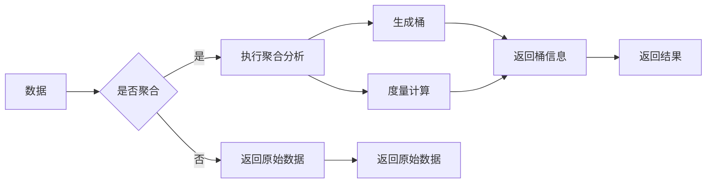

# ES聚合分析原理与代码实例讲解

> 关键词：Elasticsearch, 聚合分析, JSON, Aggregations, 度量, 桶, 阈值, 布尔查询, 时间序列分析

## 1. 背景介绍

随着大数据时代的到来，如何从海量数据中快速、准确地获取有价值的信息成为了企业和组织面临的重要挑战。Elasticsearch，作为一款强大的开源搜索引擎，提供了丰富的聚合分析功能，能够帮助用户轻松地从复杂的数据中提取结构化的统计信息。本文将深入解析Elasticsearch的聚合分析原理，并通过代码实例展示如何在实际项目中应用这一功能。

## 2. 核心概念与联系

### 2.1 核心概念

- **Elasticsearch**：一个基于Lucene构建的开源搜索引擎，适用于全文搜索、日志分析、实时应用等场景。
- **聚合分析**：Elasticsearch提供的一种数据聚合功能，可以对数据进行分组、计算、排序等操作，从而得到各种统计信息。
- **度量**：聚合分析中的一个操作，用于对数据进行计算，如求和、平均值、最大值、最小值等。
- **桶**：聚合分析中对数据进行分组的结果，每个桶代表一个分组的统计信息。
- **阈值**：在桶分析中用于过滤数据的条件，只有满足条件的桶才会被计算和返回。

### 2.2 架构的 Mermaid 流程图



## 3. 核心算法原理 & 具体操作步骤

### 3.1 算法原理概述

Elasticsearch的聚合分析基于Lucene的倒排索引结构，通过对数据进行分组和度量计算，生成桶和度量结果。整个过程可以分为以下几个步骤：

1. 对数据进行索引，建立倒排索引。
2. 对查询请求执行布尔查询，确定匹配的文档。
3. 对匹配的文档进行聚合分析，生成桶和度量结果。

### 3.2 算法步骤详解

1. **索引数据**：首先需要将数据索引到Elasticsearch中，以便进行聚合分析。
2. **执行查询**：使用Elasticsearch的查询接口，执行布尔查询，过滤出符合特定条件的文档。
3. **执行聚合分析**：在查询结果的基础上，使用聚合API执行聚合分析，生成桶和度量结果。
4. **处理结果**：根据需要，可以将聚合结果进行进一步处理，如排序、过滤、格式化等。

### 3.3 算法优缺点

**优点**：

- **灵活性强**：Elasticsearch提供了丰富的聚合类型，可以满足各种统计需求。
- **高效性**：基于Lucene的倒排索引，查询和聚合分析效率高。
- **易于使用**：聚合分析API简单易用，易于理解和实现。

**缺点**：

- **复杂性**：对于复杂的聚合分析，配置可能较为复杂。
- **资源消耗**：聚合分析可能会消耗较多的计算资源。

### 3.4 算法应用领域

- **日志分析**：对服务器日志进行聚合分析，统计访问量、错误率等指标。
- **数据分析**：对销售数据、用户行为数据等进行聚合分析，了解数据分布和趋势。
- **实时分析**：对实时数据流进行聚合分析，快速响应事件。

## 4. 数学模型和公式 & 详细讲解 & 举例说明

### 4.1 数学模型构建

Elasticsearch的聚合分析不涉及复杂的数学模型，主要基于对数据进行分组和计算。以下是一些常用的聚合类型及其对应的数学模型：

- **计数**：$N = \sum_{i=1}^n |D_i|$，其中 $D_i$ 表示第 $i$ 个桶中的文档数量。
- **平均值**：$\mu = \frac{\sum_{i=1}^n \sum_{j=1}^{N_i} X_{ij}}{\sum_{i=1}^n N_i}$，其中 $X_{ij}$ 表示第 $i$ 个桶中第 $j$ 个文档的值。
- **最大值**：$M = \max_{1 \leq i \leq n, 1 \leq j \leq N_i} X_{ij}$，其中 $X_{ij}$ 表示第 $i$ 个桶中第 $j$ 个文档的值。

### 4.2 公式推导过程

以上公式直接对应于聚合分析中的计算过程。例如，计算平均值时，需要将每个桶中所有文档的值相加，然后除以总文档数。

### 4.3 案例分析与讲解

以下是一个使用Elasticsearch进行聚合分析的示例：

假设有一个包含用户购买记录的索引，索引中有 `user_id`、`product_id`、`purchase_time`、`price` 等字段。现在需要统计每个用户的平均购买金额。

```json
POST /sales/_search
{
  "size": 0,
  "aggs": {
    "avg_purchase_price": {
      "group_by": {
        "terms": {
          "field": "user_id"
        }
      },
      "aggs": {
        "avg_price": {
          "avg": {
            "field": "price"
          }
        }
      }
    }
  }
}
```

以上查询将返回每个用户的平均购买金额。

## 5. 项目实践：代码实例和详细解释说明

### 5.1 开发环境搭建

1. 安装Java开发环境，如JDK 1.8以上版本。
2. 安装Elasticsearch，并启动服务。
3. 使用Elasticsearch Java API进行聚合分析。

### 5.2 源代码详细实现

以下是一个使用Elasticsearch Java API进行聚合分析的示例：

```java
RestHighLevelClient client = RestHighLevelClient.builder()
        .settings(settings)
        .client(transportClient)
        .build();

SearchRequest searchRequest = new SearchRequest("sales");
searchRequest.source(new SearchSourceBuilder()
        .size(0)
        .aggregation(AggregationBuilders.groupBy("user_id")
                .aggregations(AggregationBuilders.avg("avg_price")
                        .field("price"))));

SearchResponse searchResponse = client.search(searchRequest, RequestOptions.DEFAULT);
SearchHit[] hits = searchResponse.getHits().getHits();
for (SearchHit hit : hits) {
    Map<String, Aggregation> aggregations = hit.getAggregations().getAsMap();
    Map<String, BigDecimal> avgPrice = (Map<String, BigDecimal>) aggregations.get("avg_purchase_price").getAsMap().get("avg_price").getValue();
    System.out.println("User ID: " + hit.getId() + ", Average Purchase Price: " + avgPrice.get("avg_price"));
}
```

### 5.3 代码解读与分析

以上代码首先创建了一个`RestHighLevelClient`实例，用于连接到Elasticsearch服务器。然后创建了一个`SearchRequest`实例，指定了要查询的索引和聚合配置。在聚合配置中，我们使用了`groupBy`聚合对`user_id`字段进行分组，并在分组内部使用`avg`聚合计算每个用户的平均购买金额。

### 5.4 运行结果展示

运行以上代码后，将在控制台输出每个用户的平均购买金额。

## 6. 实际应用场景

### 6.1 日志分析

在日志分析场景中，可以使用聚合分析统计访问量、错误率等指标，帮助管理员了解系统的运行状况。

### 6.2 数据分析

在数据分析场景中，可以使用聚合分析对销售数据、用户行为数据等进行统计，帮助决策者了解数据分布和趋势。

### 6.3 实时分析

在实时分析场景中，可以使用聚合分析对实时数据流进行统计，帮助用户快速响应事件。

## 7. 工具和资源推荐

### 7.1 学习资源推荐

- Elasticsearch官方文档：https://www.elastic.co/guide/en/elasticsearch/reference/current/index.html
- Elasticsearch教程：https://www.elastic.co/guide/en/elasticsearch/guide/current/getting-started.html
- Elasticsearch聚合分析教程：https://www.elastic.co/guide/en/elasticsearch/guide/current/search-aggregations-basics.html

### 7.2 开发工具推荐

- Elasticsearch Java API：https://www.elastic.co/guide/en/elasticsearch/client/java-api/current/java-rest-high-level-client.html
- Kibana：https://www.elastic.co/products/kibana

### 7.3 相关论文推荐

- [Elasticsearch: The Definitive Guide](https://www.elastic.co/guide/en/elasticsearch/guide/current/getting-started.html)
- [Elasticsearch in Action](https://www.manning.com/books/elasticsearch-in-action)

## 8. 总结：未来发展趋势与挑战

### 8.1 研究成果总结

Elasticsearch的聚合分析功能为用户提供了强大的数据分析能力，能够从海量数据中提取有价值的信息。随着Elasticsearch的不断发展和完善，聚合分析功能也将变得更加丰富和强大。

### 8.2 未来发展趋势

- **更丰富的聚合类型**：Elasticsearch将推出更多实用的聚合类型，满足用户多样化的分析需求。
- **更灵活的配置**：Elasticsearch将提供更灵活的配置选项，方便用户定制聚合分析过程。
- **更高效的性能**：Elasticsearch将优化聚合分析的性能，提高数据处理效率。

### 8.3 面临的挑战

- **数据复杂性**：随着数据量的增长，数据复杂性也在增加，如何高效地处理复杂数据成为一大挑战。
- **性能优化**：随着聚合分析功能的丰富，如何优化性能成为一大挑战。

### 8.4 研究展望

未来，Elasticsearch的聚合分析功能将在以下方面进行研究和探索：

- **智能聚合分析**：通过机器学习技术，实现智能化的聚合分析，帮助用户发现数据中的隐藏模式。
- **跨模态聚合分析**：将文本、图像、视频等多模态数据进行聚合分析，提供更全面的见解。

## 9. 附录：常见问题与解答

**Q1：什么是聚合分析？**

A：聚合分析是一种对数据进行分组和计算的操作，可以生成各种统计信息，如计数、平均值、最大值、最小值等。

**Q2：如何使用Elasticsearch进行聚合分析？**

A：使用Elasticsearch的聚合API，可以指定聚合类型、字段、条件等，对数据进行聚合分析。

**Q3：聚合分析有哪些应用场景？**

A：聚合分析可以应用于日志分析、数据分析、实时分析等场景，帮助用户从海量数据中提取有价值的信息。

**Q4：如何优化聚合分析的性能？**

A：优化聚合分析的性能可以从以下几个方面入手：
- 选择合适的聚合类型。
- 使用索引模板优化索引结构。
- 使用更高效的查询语句。

作者：禅与计算机程序设计艺术 / Zen and the Art of Computer Programming