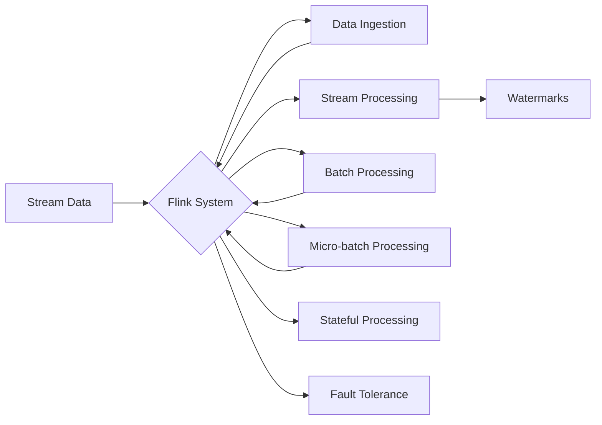

> Flink, 实时计算, 流处理, 批处理, 微批处理, 大数据处理, 源码分析, API 使用

# Flink 原理与代码实例讲解

Flink 是一个开源流处理框架，支持在所有常见集群环境中以无状态或有状态的方式高效地处理无界和有界数据流。它融合了批处理和流处理的优点，能够以毫秒级的延迟处理数据，同时保持批处理系统的高级功能和可靠性。本文将深入探讨 Flink 的原理，并通过代码实例展示如何使用 Flink 进行数据处理。

## 1. 背景介绍

### 1.1 问题的由来

在当今数据驱动的世界中，实时处理和分析数据变得越来越重要。传统的批处理系统在处理实时数据时存在以下问题：

- 延迟高：批处理系统通常以固定的时间间隔处理数据，导致延迟高，无法满足实时性要求。
- 灵活性差：批处理系统不适合处理突发流量，容易造成系统压力和性能下降。
- 复杂性高：批处理系统通常需要复杂的窗口和触发机制来处理实时数据。

为了解决这些问题，流处理框架应运而生。Apache Flink 是其中最流行的框架之一，它提供了一种新的数据处理范式，即流处理。

### 1.2 研究现状

Flink 最初由柏林工业大学和data Artisans共同开发，并于2014年成为Apache Software Foundation的一个顶级项目。Flink 支持多种数据处理模式，包括：

- **流处理**：实时处理无界数据流。
- **批处理**：高效处理有界数据集。
- **微批处理**：结合批处理和流处理的优点，适用于处理实时性要求不高的场景。

### 1.3 研究意义

Flink 的研究意义在于：

- **实时性**：提供毫秒级延迟的数据处理，满足实时性要求。
- **高效性**：利用并行计算和内存管理优化资源使用。
- **灵活性和可扩展性**：支持多种数据处理模式，易于扩展到大规模集群。

### 1.4 本文结构

本文将按照以下结构展开：

- **第2部分**：介绍 Flink 的核心概念和架构。
- **第3部分**：深入探讨 Flink 的算法原理和操作步骤。
- **第4部分**：通过数学模型和公式详细解释 Flink 的核心概念。
- **第5部分**：通过代码实例展示如何使用 Flink 进行数据处理。
- **第6部分**：探讨 Flink 在实际应用场景中的使用。
- **第7部分**：推荐 Flink 相关的学习资源和开发工具。
- **第8部分**：总结 Flink 的发展趋势与挑战。
- **第9部分**：提供常见问题与解答。

## 2. 核心概念与联系

### 2.1 Mermaid 流程图

以下是一个 Mermaid 流程图，展示了 Flink 的核心概念和它们之间的关系：



### 2.2 核心概念

- **Stream Data**：流数据是指连续流动的数据，可以是时间序列数据、日志数据等。
- **Flink System**：Flink 系统是负责处理流数据的核心组件。
- **Data Ingestion**：数据采集是指从各种数据源（如 Kafka、Kinesis、RabbitMQ 等）收集数据。
- **Stream Processing**：流处理是指在数据产生后立即进行处理，以获得实时结果。
- **Batch Processing**：批处理是指将一段时间内的数据汇总后一次性进行处理。
- **Micro-batch Processing**：微批处理是指将数据分成小批次进行处理，介于流处理和批处理之间。
- **Watermarks**：水印是用于保证事件时间和处理时间一致性的机制。
- **Stateful Processing**：有状态处理是指处理过程中需要维护状态，如计数、窗口等。
- **Fault Tolerance**：容错性是指系统在遇到故障时能够自动恢复，确保数据处理的正确性。

## 3. 核心算法原理 & 具体操作步骤

### 3.1 算法原理概述

Flink 的核心算法原理是使用事件驱动的方式处理数据流。以下是其主要步骤：

1. **数据采集**：从数据源收集数据。
2. **数据转换**：对数据进行处理，如过滤、映射、连接等。
3. **窗口操作**：对数据进行分组，如滑动窗口、固定窗口等。
4. **状态维护**：在处理过程中维护状态，如计数器、窗口等。
5. **容错性**：在遇到故障时自动恢复，确保数据处理正确性。

### 3.2 算法步骤详解

1. **数据采集**：Flink 支持多种数据源，如 Kafka、Kinesis、RabbitMQ 等。通过连接器将数据源与 Flink 系统连接。
2. **数据转换**：使用 Flink 提供的各种算子对数据进行处理，如 `map`、`filter`、`reduce` 等。
3. **窗口操作**：对数据进行分组，可以使用滑动窗口、固定窗口、会话窗口等。
4. **状态维护**：在处理过程中维护状态，可以使用 `keyed state` 和 `operator state`。
5. **容错性**：Flink 使用检查点（Checkpoint）机制保证容错性。当检测到故障时，可以从最近的检查点恢复。

### 3.3 算法优缺点

**优点**：

- **实时性**：提供毫秒级延迟的数据处理。
- **容错性**：使用检查点机制保证数据处理正确性。
- **灵活性**：支持多种数据处理模式，如流处理、批处理、微批处理。
- **可扩展性**：易于扩展到大规模集群。

**缺点**：

- **复杂性**：相对于其他数据处理框架，Flink 的学习曲线较陡。
- **资源消耗**：Flink 需要较多的计算资源，如 CPU、内存等。

### 3.4 算法应用领域

Flink 的应用领域包括：

- 实时日志分析
- 实时推荐系统
- 实时数据监控
- 实时数据导出
- 实时机器学习

## 4. 数学模型和公式 & 详细讲解 & 举例说明

### 4.1 数学模型构建

Flink 中的窗口操作可以使用数学模型进行描述。以下是一个滑动窗口的数学模型：

$$
W(t) = \{x | t - w < t_0 \leq t \}
$$

其中，$W(t)$ 表示在时间 $t$ 的滑动窗口，$w$ 表示窗口大小，$t_0$ 表示窗口的起始时间。

### 4.2 公式推导过程

滑动窗口的推导过程如下：

- **初始状态**：窗口为空。
- **新数据到来**：将新数据加入窗口，窗口大小保持不变。
- **窗口滑动**：当窗口达到最大大小 $w$ 时，将窗口中的最老数据移出窗口，并将新数据加入窗口。

### 4.3 案例分析与讲解

以下是一个使用 Flink 进行实时日志分析的示例：

```java
// 定义数据源
DataStream<String> logStream = ... // 从 Kafka 读取日志数据

// 解析日志数据
DataStream<LogEvent> parsedLogStream = logStream
    .map(new MapFunction<String, LogEvent>() {
        @Override
        public LogEvent map(String value) throws Exception {
            // 解析日志数据
            return ...
        }
    });

// 使用滑动窗口进行计数
DataStream<Long> countStream = parsedLogStream
    .keyBy(logEvent -> logEvent.hostname)
    .window(SlidingEventTimeWindows.of(Time.minutes(1)))
    .sum("count");

// 输出结果
countStream.print();
```

在上面的代码中，我们首先从 Kafka 读取日志数据，然后解析日志数据，并对每个主机名的访问次数进行计数。我们使用滑动窗口，每 1 分钟滑动一次，计算每个窗口内的访问次数，并输出结果。

## 5. 项目实践：代码实例和详细解释说明

### 5.1 开发环境搭建

要使用 Flink 进行开发，需要以下步骤：

1. 安装 Java SDK。
2. 安装 Flink SDK。
3. 创建 Maven 项目。
4. 添加 Flink 依赖。

### 5.2 源代码详细实现

以下是一个简单的 Flink 应用程序，它从 Kafka 读取数据，计算每条消息的词频，并将结果输出到控制台。

```java
// 导入必要的类
import org.apache.flink.api.common.functions.MapFunction;
import org.apache.flink.streaming.api.datastream.DataStream;
import org.apache.flink.streaming.api.environment.StreamExecutionEnvironment;
import org.apache.flink.streaming.api.functions.windowing.assigners.TumblingEventTimeWindows;
import org.apache.flink.streaming.api.functions.windowing.time.Time;

// 创建 Flink 执行环境
StreamExecutionEnvironment env = StreamExecutionEnvironment.getExecutionEnvironment();

// 从 Kafka 读取数据
DataStream<String> stream = env.addSource(new FlinkKafkaConsumer<>("input_topic", new SimpleStringSchema(), ...));

// 解析数据并计算词频
DataStream<String> wordCountStream = stream
    .map(new MapFunction<String, WordCount>() {
        @Override
        public WordCount map(String value) throws Exception {
            // 解析数据并计算词频
            return ...
        }
    })
    .keyBy(wordCount -> wordCount.word)
    .window(TumblingEventTimeWindows.of(Time.seconds(10)))
    .sum("count");

// 输出结果
wordCountStream.print();

// 执行程序
env.execute("Flink Word Count Example");
```

### 5.3 代码解读与分析

在上面的代码中，我们首先创建了一个 Flink 执行环境。然后，我们使用 FlinkKafkaConsumer 从 Kafka 读取数据。接下来，我们使用 `map` 函数解析数据并计算词频。最后，我们使用 `keyBy` 和 `window` 函数对数据进行分组和窗口操作，并将结果输出到控制台。

### 5.4 运行结果展示

当程序运行时，它将从 Kafka 读取数据，计算每条消息的词频，并每 10 秒输出一次结果。

## 6. 实际应用场景

Flink 在实际应用场景中非常广泛，以下是一些例子：

- **实时推荐系统**：使用 Flink 进行用户行为分析，实时推荐商品或内容。
- **实时监控**：使用 Flink 监控系统性能，实时发现异常情况。
- **实时广告**：使用 Flink 进行实时广告投放，提高广告点击率。
- **实时数据分析**：使用 Flink 进行实时数据分析，帮助决策者做出更快、更准确的决策。

## 7. 工具和资源推荐

### 7.1 学习资源推荐

- **Flink 官方文档**：https://flink.apache.org/zh/docs/latest/
- **Apache Flink 官方教程**：https://ci.apache.org/projects/flink/flink-docs-release-1.14/learningflink/
- **《Flink 实战》**：https://book.douban.com/subject/26859623/

### 7.2 开发工具推荐

- **IntelliJ IDEA**：支持 Flink 开发的集成开发环境。
- **Eclipse**：支持 Flink 开发的集成开发环境。
- **Docker**：使用 Docker 部署 Flink 集群。

### 7.3 相关论文推荐

- **Flink: Streaming Data Processing at Scale**：https://www.usenix.org/system/files/conference/nsdi14/nsdi14-paper-berker.pdf

## 8. 总结：未来发展趋势与挑战

### 8.1 研究成果总结

Flink 是一个功能强大、灵活高效的实时数据处理框架。它支持多种数据处理模式，具有高可用性和高可扩展性。通过本文的介绍，读者可以了解到 Flink 的原理、算法、应用场景和开发实践。

### 8.2 未来发展趋势

未来，Flink 可能会继续朝着以下方向发展：

- **更高的性能**：通过优化算法和硬件加速，进一步提高数据处理性能。
- **更广泛的生态**：与更多数据源和存储系统集成，扩展生态圈。
- **更易用的接口**：提供更简单易用的 API，降低使用门槛。

### 8.3 面临的挑战

Flink 在未来发展过程中可能面临以下挑战：

- **性能优化**：随着数据量的增长，需要不断优化算法和硬件加速，提高性能。
- **生态整合**：与更多数据源和存储系统集成，需要解决兼容性和互操作性问题。
- **易用性提升**：提供更简单易用的 API，降低使用门槛，需要不断改进用户体验。

### 8.4 研究展望

Flink 的研究展望包括：

- **更加智能的流处理**：利用机器学习技术，实现智能化的流处理。
- **跨域数据融合**：将流处理与批处理、图处理等其他数据处理范式融合。
- **边缘计算**：将 Flink 部署到边缘设备，实现边缘数据处理。

## 9. 附录：常见问题与解答

**Q1：Flink 与 Spark Streaming 之间有什么区别？**

A1：Flink 和 Spark Streaming 都是实时数据处理框架，但它们有一些关键区别：

- **数据流模型**：Flink 使用事件驱动模型，Spark Streaming 使用微批处理模型。
- **容错性**：Flink 使用检查点机制，Spark Streaming 使用容错机制。
- **延迟**：Flink 提供毫秒级延迟，Spark Streaming 的延迟通常在秒级。

**Q2：Flink 支持哪些数据源？**

A2：Flink 支持多种数据源，包括 Kafka、Kinesis、RabbitMQ、JMS、File System、Twitter、Socket、Custom Sources 等。

**Q3：如何处理 Flink 中的窗口操作？**

A3：Flink 支持多种窗口操作，包括滑动窗口、固定窗口、会话窗口等。可以使用 `TumblingEventTimeWindows`、`SlidingEventTimeWindows`、`EventTimeSessionWindows` 等类创建窗口。

**Q4：Flink 如何实现容错性？**

A4：Flink 使用检查点（Checkpoint）机制实现容错性。当检测到故障时，可以从最近的检查点恢复。

**Q5：如何使用 Flink 进行实时数据分析？**

A5：可以使用 Flink 的 API 对实时数据进行处理，如过滤、映射、连接、窗口操作等。可以将结果输出到控制台、Kafka、数据库等。

---

作者：禅与计算机程序设计艺术 / Zen and the Art of Computer Programming