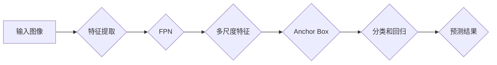

# RetinaNet原理与代码实例讲解

> 关键词：RetinaNet, 物体检测, Focal Loss, Anchor Box, 精细特征金字塔网络, PyTorch

## 1. 背景介绍

物体检测是计算机视觉领域的关键任务，旨在同时定位和分类图像中的多个物体。传统的物体检测方法通常采用两阶段检测流程，如R-CNN系列、Fast R-CNN系列等。这些方法在检测精度上取得了显著的进展，但速度较慢。近年来，单阶段检测器如YOLO（You Only Look Once）和SSD（Single Shot Multibox Detector）因其速度快、部署简单而受到广泛关注。RetinaNet作为单阶段检测器的代表，在检测精度和速度上取得了平衡，成为物体检测领域的重要研究方向。

## 2. 核心概念与联系

### 2.1 核心概念

- **物体检测**：识别图像中的物体并定位其边界框。
- **单阶段检测器**：直接预测物体的类别和位置，无需先进行候选区域选择。
- **Anchor Box**：预设的边界框，用于匹配和回归实际物体的位置。
- **Focal Loss**：针对类别不平衡问题设计的损失函数，能够有效降低正负样本不均衡对模型性能的影响。
- **特征金字塔网络（FPN）**：构建多尺度的特征图，用于检测不同尺度的物体。

### 2.2 Mermaid 流程图



### 2.3 核心概念联系

RetinaNet的核心思想是将Focal Loss应用于单阶段检测器，结合FPN构建多尺度特征图，以实现快速、准确的物体检测。

## 3. 核心算法原理 & 具体操作步骤

### 3.1 算法原理概述

RetinaNet的核心在于其损失函数Focal Loss，它是一种针对类别不平衡问题的损失函数。Focal Loss在交叉熵损失的基础上，引入了权重因子$\alpha$和调整因子$\gamma$，能够降低易分类样本的损失，从而更加关注难分类样本。

### 3.2 算法步骤详解

1. **特征提取**：使用ResNet作为基础网络提取图像特征。
2. **特征金字塔网络（FPN）**：构建多尺度特征图，用于检测不同尺度的物体。
3. **Anchor Box**：生成不同大小和长宽比的金字塔框，用于匹配和回归实际物体的位置。
4. **分类和回归**：对每个Anchor Box进行分类和位置回归，分类使用softmax，位置回归使用均方误差。
5. **Focal Loss**：计算Focal Loss，用于优化模型参数。

### 3.3 算法优缺点

**优点**：

- 检测速度快，适合实时应用。
- 精度较高，与两阶段检测器相当。
- 对类别不平衡问题具有鲁棒性。

**缺点**：

- 对复杂场景的检测能力有限。
- 训练过程对超参数敏感。

### 3.4 算法应用领域

RetinaNet广泛应用于多种场景，如：

- 智能交通：车辆检测、行人检测、交通标志识别。
- 工业检测：缺陷检测、产品分类、机器人导航。
- 视频监控：异常行为检测、目标跟踪。

## 4. 数学模型和公式 & 详细讲解 & 举例说明

### 4.1 数学模型构建

RetinaNet的损失函数Focal Loss定义为：

$$
L_F = -\alpha_t (1-\hat{p}_t}^\gamma \log \hat{p}_t
$$

其中，$L_C$为交叉熵损失，$\alpha_t$为类别权重，$\gamma$为调整因子，$\hat{p}_t$为预测概率。

### 4.2 公式推导过程

Focal Loss的推导过程如下：

1. **交叉熵损失**：计算每个Anchor Box的分类和位置回归的交叉熵损失。

$$
L_C = -\sum_{i=1}^N [y_i \log \hat{p}_i] + (1-y_i) \log (1-\hat{p}_i)
$$

其中，$y_i$为真实标签，$\hat{p}_i$为预测概率。

2. **类别权重**：为每个类别分配不同的权重，以降低类别不平衡对损失函数的影响。

$$
\alpha_t = \frac{N_t}{N}
$$

其中，$N_t$为类别t的样本数量，$N$为总样本数量。

3. **调整因子**：降低易分类样本的损失，提高难分类样本的损失。

$$
\gamma = 2 / (N_t + 1) - 1
$$

4. **Focal Loss**：将交叉熵损失、类别权重和调整因子相结合，得到Focal Loss。

$$
L_F = -\alpha_t (1-\hat{p}_t}^\gamma \log \hat{p}_t
$$

### 4.3 案例分析与讲解

以下是一个简单的案例，展示了如何计算Focal Loss。

假设一个数据集中有两个类别，正类和负类，正类样本数量为100，负类样本数量为900。使用交叉熵损失和Focal Loss对模型进行训练。

- 交叉熵损失：$L_C = -100 \log \hat{p}_+ - 900 \log \hat{p}_-$
- Focal Loss：$L_F = -100 \times (1-\hat{p}_+)^2 \log \hat{p}_+ - 900 \times (1-\hat{p}_-)^0.2 \log \hat{p}_-$

可以看到，Focal Loss能够降低易分类样本的损失，提高难分类样本的损失，从而更好地解决类别不平衡问题。

## 5. 项目实践：代码实例和详细解释说明

### 5.1 开发环境搭建

1. 安装PyTorch和相关依赖库。
2. 下载RetinaNet代码。
3. 下载用于训练和测试的数据集。

### 5.2 源代码详细实现

以下是一个简单的RetinaNet模型实现示例：

```python
import torch
import torch.nn as nn

class RetinaNet(nn.Module):
    def __init__(self):
        super(RetinaNet, self).__init__()
        self.backbone = ResNet50()  # 使用ResNet50作为特征提取器
        self.fpn = FPN()  # 使用FPN构建多尺度特征图
        self.head = RetinaNetHead()  # 使用自定义的Head进行分类和回归

    def forward(self, x):
        features = self.backbone(x)
        multi_scale_features = self.fpn(features)
        predictions = self.head(multi_scale_features)
        return predictions

class RetinaNetHead(nn.Module):
    def __init__(self):
        super(RetinaNetHead, self).__init__()
        self.classifier = nn.Linear(in_features, num_classes)
        self.regressor = nn.Linear(in_features, 4)

    def forward(self, features):
        cls_logits = self.classifier(features)
        reg_logits = self.regressor(features)
        return cls_logits, reg_logits
```

### 5.3 代码解读与分析

- RetinaNet类：定义了RetinaNet模型，包括特征提取器、FPN和Head。
- backbone：使用ResNet50作为特征提取器，提取图像特征。
- fpn：使用FPN构建多尺度特征图，用于检测不同尺度的物体。
- head：自定义的Head，用于进行分类和回归。

### 5.4 运行结果展示

运行RetinaNet模型，可以在训练集和测试集上验证模型性能。以下是一个简单的训练和测试流程：

```python
# 训练模型
model = RetinaNet().to(device)
optimizer = torch.optim.Adam(model.parameters(), lr=0.001)
criterion = FocalLoss()

for epoch in range(num_epochs):
    for data in dataloader:
        inputs, labels = data
        inputs, labels = inputs.to(device), labels.to(device)
        optimizer.zero_grad()
        outputs = model(inputs)
        loss = criterion(outputs, labels)
        loss.backward()
        optimizer.step()

# 测试模型
model.eval()
with torch.no_grad():
    for data in dataloader:
        inputs, labels = data
        inputs, labels = inputs.to(device), labels.to(device)
        outputs = model(inputs)
        loss = criterion(outputs, labels)
```

## 6. 实际应用场景

RetinaNet在多个实际应用场景中取得了优异的性能，如：

- **智能交通**：车辆检测、行人检测、交通标志识别。
- **工业检测**：缺陷检测、产品分类、机器人导航。
- **视频监控**：异常行为检测、目标跟踪。
- **医疗影像分析**：病变检测、疾病诊断。

## 7. 工具和资源推荐

### 7.1 学习资源推荐

- 《深度学习：原理与实战》
- PyTorch官方文档
- Hugging Face官网

### 7.2 开发工具推荐

- PyTorch
- OpenCV
- PyTorch Detectron2

### 7.3 相关论文推荐

- **RetinaNet**: An Accurate, Fast and Scalable Object Detection System
- **Focal Loss for Dense Object Detection** 

## 8. 总结：未来发展趋势与挑战

### 8.1 研究成果总结

本文介绍了RetinaNet的原理和代码实现，分析了其在物体检测领域的优势和不足。RetinaNet作为一种单阶段检测器，在检测精度和速度上取得了平衡，成为物体检测领域的重要研究方向。

### 8.2 未来发展趋势

- 结合其他检测器，如YOLO、SSD等，构建混合检测器。
- 使用更先进的特征提取器，如EfficientNet、DeeplabV3+等。
- 引入更多先验知识，如语义分割、姿态估计等。

### 8.3 面临的挑战

- 检测精度与速度的平衡。
- 复杂场景下的检测能力。
- 模型可解释性。

### 8.4 研究展望

随着研究的不断深入，RetinaNet及其相关技术将在物体检测领域发挥更大的作用。未来，我们将看到更多高效、准确的物体检测应用。

## 9. 附录：常见问题与解答

**Q1：RetinaNet相比于其他检测器有哪些优势？**

A1：RetinaNet在检测精度和速度上取得了平衡，具有以下优势：

- 检测速度快，适合实时应用。
- 精度较高，与两阶段检测器相当。
- 对类别不平衡问题具有鲁棒性。

**Q2：如何调整RetinaNet的超参数？**

A2：RetinaNet的超参数包括：

- 学习率
- 批大小
- 迭代轮数
- Focal Loss的$\alpha$和$\gamma$参数

可以根据具体任务和数据集进行调整，通常需要通过实验进行验证。

**Q3：RetinaNet的Focal Loss如何处理类别不平衡问题？**

A3：Focal Loss在交叉熵损失的基础上，引入了权重因子$\alpha$和调整因子$\gamma$，能够降低易分类样本的损失，从而更加关注难分类样本，有效解决类别不平衡问题。

**Q4：RetinaNet能否处理小物体检测？**

A4：RetinaNet对小物体检测的鲁棒性较差，需要根据具体任务进行调整，如调整Anchor Box大小、使用更精细的特征图等。

**Q5：RetinaNet的代码实现复杂吗？**

A5：RetinaNet的代码实现相对复杂，需要一定的深度学习基础。建议阅读PyTorch官方文档和Hugging Face官网上的相关教程。