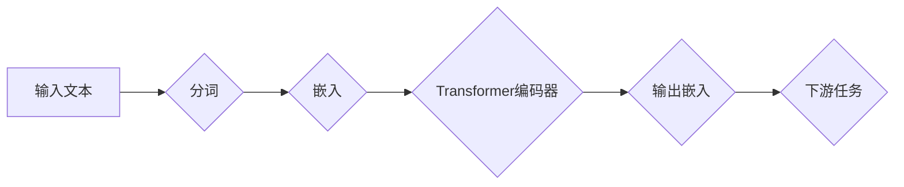

> 关键词：Transformer, BERT, 嵌入提取, 预训练, 自然语言处理, NLP, 语言模型, 预测, 模型应用

# Transformer大模型实战：从预训练的BERT模型中提取嵌入

随着深度学习在自然语言处理（NLP）领域的广泛应用，预训练语言模型如BERT（Bidirectional Encoder Representations from Transformers）等已经成为了研究和应用的热点。BERT模型通过预训练和微调，能够学习到丰富的语言特征，并应用于各种NLP任务中。本文将深入探讨如何从预训练的BERT模型中提取嵌入（Embeddings），并展示如何将这些嵌入应用于实际的NLP任务中。

## 1. 背景介绍

### 1.1 问题的由来

传统的NLP任务，如文本分类、情感分析等，通常需要手工设计特征，这不仅费时费力，而且难以捕捉到语言的深层语义信息。预训练语言模型的出现，如BERT，通过在大规模文本语料上进行预训练，能够自动学习到丰富的语言表征，为NLP任务提供了一种高效的特征提取方式。

### 1.2 研究现状

预训练语言模型在NLP领域的应用已经取得了显著的成果。BERT模型通过双向Transformer结构，能够同时捕获上下文信息，从而在多种NLP任务上取得了SOTA（State-of-the-Art）的性能。从BERT模型中提取嵌入，可以用于各种下游任务的特征表示，如文本分类、命名实体识别、机器翻译等。

### 1.3 研究意义

从预训练的BERT模型中提取嵌入，对于以下几个方面的研究具有重要意义：

- **降低特征工程难度**：无需手动设计特征，直接使用预训练模型提取的嵌入，可以大大降低特征工程的难度。
- **提高模型性能**：预训练嵌入包含丰富的语义信息，可以显著提高下游任务的性能。
- **加速模型开发**：基于预训练嵌入，可以快速构建新的NLP模型，缩短开发周期。

### 1.4 本文结构

本文将分为以下几个部分：

- 介绍Transformer和BERT模型的基本原理。
- 讲解如何从预训练的BERT模型中提取嵌入。
- 展示如何将提取的嵌入应用于实际的NLP任务中。
- 探讨预训练嵌入在NLP领域的未来应用。

## 2. 核心概念与联系

### 2.1 核心概念

- **Transformer**：一种基于自注意力机制的深度神经网络架构，能够有效地捕捉序列数据中的长距离依赖关系。
- **BERT**：一种基于Transformer的双向编码器模型，通过掩码语言建模（Masked Language Model）和下一句预测（Next Sentence Prediction）等预训练任务，学习到丰富的语言表征。
- **嵌入（Embedding）**：将文本中的单词、句子等转换为向量表示，用于神经网络处理。

### 2.2 架构流程图



在这个流程图中，输入文本经过分词后，每个单词都被转换为一个嵌入向量。这些嵌入向量随后被输入到Transformer编码器中，经过编码器处理后，输出最终的嵌入向量。这些嵌入向量可以用于各种下游任务。

## 3. 核心算法原理 & 具体操作步骤

### 3.1 算法原理概述

BERT模型由多个Transformer编码器层堆叠而成，每个编码器层由自注意力机制和前馈神经网络组成。预训练任务包括掩码语言建模和下一句预测。

- **掩码语言建模**：随机掩盖输入文本中的某些单词，模型需要预测被掩盖的单词。
- **下一句预测**：将文本分割成两个句子，模型需要预测哪一句是下一句。

通过这些预训练任务，BERT模型能够学习到丰富的语言表征。

### 3.2 算法步骤详解

1. **加载数据**：加载预训练的BERT模型和对应的分词器。
2. **分词**：将输入文本分词，并将分词结果转换为嵌入向量。
3. **编码**：将嵌入向量输入到BERT模型中，经过多个编码器层的处理后，输出最终的嵌入向量。
4. **应用**：将提取的嵌入向量用于下游任务。

### 3.3 算法优缺点

**优点**：

- **强大的特征提取能力**：BERT模型能够学习到丰富的语言表征，为下游任务提供高质量的特征。
- **参数共享**：预训练模型的参数可以在多个下游任务中共享，提高效率。

**缺点**：

- **模型复杂度高**：BERT模型包含大量的参数，训练和推理都需要较高的计算资源。
- **解释性差**：预训练模型的决策过程难以解释。

### 3.4 算法应用领域

预训练嵌入可以应用于以下NLP任务：

- **文本分类**：如新闻分类、情感分析等。
- **命名实体识别**：如人名识别、组织机构识别等。
- **机器翻译**：如英译中、中译英等。
- **问答系统**：如自动问答、知识图谱问答等。

## 4. 数学模型和公式 & 详细讲解 & 举例说明

### 4.1 数学模型构建

BERT模型的主要组成部分是Transformer编码器，其核心思想是自注意力机制。

- **自注意力机制**：对于输入序列 $X = [x_1, x_2, \ldots, x_n]$，自注意力机制通过以下公式计算每个单词的注意力权重：

$$
\text{Attention}(Q, K, V) = \text{softmax}(\frac{QK^T}{\sqrt{d_k}})V
$$

其中，$Q$、$K$ 和 $V$ 分别是查询（Query）、键（Key）和值（Value）矩阵，$d_k$ 是注意力维度。

- **前馈神经网络**：在自注意力机制之后，对每个单词的输出进行前馈神经网络处理：

$$
\text{FFN}(X) = \text{ReLU}(W_2 \text{ReLU}(W_1 X) + b_1)
$$

其中，$W_1$ 和 $W_2$ 是前馈神经网络的权重矩阵，$b_1$ 是偏置项。

### 4.2 公式推导过程

BERT模型的预训练任务包括掩码语言建模和下一句预测。以下是掩码语言建模的公式推导：

1. **输入序列**：$X = [x_1, x_2, \ldots, x_n]$，其中 $x_i \in \mathbb{R}^{d_{\text{emb}}}$ 是单词 $i$ 的嵌入向量。

2. **自注意力机制**：计算每个单词的注意力权重，并生成注意力向量：

$$
\text{Attention}(Q, K, V) = \text{softmax}(\frac{QK^T}{\sqrt{d_k}})V
$$

3. **前馈神经网络**：对注意力向量进行前馈神经网络处理：

$$
\text{FFN}(X) = \text{ReLU}(W_2 \text{ReLU}(W_1 X) + b_1)
$$

4. **输出**：将处理后的序列送入下一个编码器层。

### 4.3 案例分析与讲解

以下是一个简单的BERT模型中提取嵌入的例子：

假设我们有一个简单的BERT模型，包含两个编码器层。输入序列为 "hello world"，我们将展示如何提取每个单词的嵌入向量。

1. **分词**：将 "hello world" 分词为 ["hello", "world"]。
2. **嵌入**：将分词结果转换为嵌入向量，得到 $[h_1, h_2]$。
3. **自注意力机制**：计算每个单词的注意力权重，并生成注意力向量。
4. **前馈神经网络**：对注意力向量进行前馈神经网络处理。
5. **输出**：得到最终的嵌入向量。

## 5. 项目实践：代码实例和详细解释说明

### 5.1 开发环境搭建

为了进行BERT模型的实验，我们需要以下开发环境：

- Python 3.7+
- PyTorch 1.7+
- Transformers库

### 5.2 源代码详细实现

以下是一个简单的BERT模型中提取嵌入的Python代码示例：

```python
from transformers import BertTokenizer, BertModel

# 加载预训练的BERT模型和分词器
tokenizer = BertTokenizer.from_pretrained('bert-base-uncased')
model = BertModel.from_pretrained('bert-base-uncased')

# 输入文本
text = "hello world"

# 分词
encoded_input = tokenizer(text, return_tensors='pt')

# 编码
outputs = model(**encoded_input)

# 获取嵌入向量
embeddings = outputs.last_hidden_state[:, 0, :]
```

### 5.3 代码解读与分析

1. **加载预训练的BERT模型和分词器**：使用Transformers库加载预训练的BERT模型和分词器。
2. **输入文本**：定义输入文本。
3. **分词**：使用分词器对输入文本进行分词，并转换为模型所需的格式。
4. **编码**：将分词结果输入到BERT模型中，进行编码。
5. **获取嵌入向量**：从编码器的最后一个隐藏状态中提取每个单词的嵌入向量。

### 5.4 运行结果展示

运行上述代码，我们可以得到 "hello" 和 "world" 两个单词的嵌入向量。

## 6. 实际应用场景

### 6.1 文本分类

我们可以使用BERT模型提取的嵌入向量进行文本分类。以下是一个简单的例子：

```python
from sklearn.linear_model import LogisticRegression

# 加载预训练的BERT模型和分词器
tokenizer = BertTokenizer.from_pretrained('bert-base-uncased')
model = BertModel.from_pretrained('bert-base-uncased')

# 加载文本数据和标签
texts = ["This is a good day", "This is a bad day"]
labels = [1, 0]

# 分词
encoded_input = tokenizer(texts, padding=True, truncation=True, return_tensors='pt')

# 编码
outputs = model(**encoded_input)

# 获取嵌入向量
embeddings = outputs.last_hidden_state[:, 0, :]

# 训练逻辑回归模型
clf = LogisticRegression()
clf.fit(embeddings.detach().numpy(), labels)

# 预测新文本
new_text = "This is a great day"
encoded_input = tokenizer(new_text, return_tensors='pt')
new_embeddings = model(**encoded_input).last_hidden_state[:, 0, :]
prediction = clf.predict(new_embeddings.detach().numpy())
print("Predicted label:", prediction)
```

### 6.2 命名实体识别

我们可以使用BERT模型提取的嵌入向量进行命名实体识别。以下是一个简单的例子：

```python
from transformers import BertForTokenClassification

# 加载预训练的BERT模型和分词器
tokenizer = BertTokenizer.from_pretrained('bert-base-uncased')
model = BertForTokenClassification.from_pretrained('bert-base-uncased', num_labels=9)

# 加载文本数据和标签
texts = ["John Doe lives in New York", "Jane Smith works in San Francisco"]
labels = [[2, 0, 1, 3, 0, 0, 0, 1, 0], [1, 1, 2, 3, 2, 2, 2, 2, 2]]

# 分词
encoded_input = tokenizer(texts, padding=True, truncation=True, return_tensors='pt')

# 编码
outputs = model(**encoded_input)

# 获取嵌入向量
embeddings = outputs.logits.argmax(dim=-1)

# 预测新文本
new_text = "Alice Johnson resides in Los Angeles"
encoded_input = tokenizer(new_text, return_tensors='pt')
new_embeddings = model(**encoded_input).logits.argmax(dim=-1)
print("Predicted entities:", new_embeddings)
```

## 7. 工具和资源推荐

### 7.1 学习资源推荐

- **Transformers库官方文档**：提供了丰富的预训练模型和代码示例。
- **HuggingFace官方博客**：分享Transformers库的最新动态和研究成果。
- **《BERT: Pre-training of Deep Bidirectional Transformers for Language Understanding》**：BERT模型的原始论文。
- **《Natural Language Processing with Transformers》**：介绍了如何使用Transformers库进行NLP任务开发。

### 7.2 开发工具推荐

- **Jupyter Notebook**：便于进行实验和调试。
- **PyTorch**：强大的深度学习框架。
- **Scikit-learn**：机器学习库，用于模型训练和评估。

### 7.3 相关论文推荐

- **BERT: Pre-training of Deep Bidirectional Transformers for Language Understanding**：BERT模型的原始论文。
- **Devlin, J., Chang, M. W., Lee, K., & Toutanova, K. (2019). BERT: Pre-training of Deep Bidirectional Transformers for Language Understanding. In Proceedings of the 2019 Conference of the North American Chapter of the Association for Computational Linguistics: Human Language Technologies, Volume 1 (Long and Short Papers)**：BERT模型在多个NLP任务上的应用。

## 8. 总结：未来发展趋势与挑战

### 8.1 研究成果总结

本文深入探讨了从预训练的BERT模型中提取嵌入的方法，并展示了如何将这些嵌入应用于实际的NLP任务中。我们介绍了Transformer和BERT模型的基本原理，讲解了如何提取嵌入，并展示了如何将嵌入应用于文本分类和命名实体识别等任务。

### 8.2 未来发展趋势

未来，预训练语言模型和嵌入提取技术将在以下几个方面得到发展：

- **多模态嵌入**：将文本嵌入与其他模态数据（如图像、声音）进行融合，实现更全面的特征表示。
- **可解释性嵌入**：提高嵌入的可解释性，使模型决策过程更加透明。
- **知识增强嵌入**：将外部知识库和规则库与嵌入相结合，提高嵌入的语义丰富性。

### 8.3 面临的挑战

尽管预训练嵌入技术取得了显著进展，但仍面临以下挑战：

- **计算资源消耗**：预训练模型通常需要大量的计算资源，限制了其在边缘设备上的应用。
- **数据隐私**：预训练模型需要访问大量数据，如何保护用户隐私成为一个重要问题。
- **模型可解释性**：预训练模型的决策过程难以解释，如何提高模型的可解释性是一个挑战。

### 8.4 研究展望

未来，预训练嵌入技术将在NLP领域发挥越来越重要的作用。随着技术的不断进步，我们期待预训练嵌入能够解决更多实际问题，为人类社会带来更多福祉。

## 9. 附录：常见问题与解答

**Q1：什么是BERT模型？**

A：BERT（Bidirectional Encoder Representations from Transformers）是一种基于Transformer的双向编码器模型，通过在大规模文本语料上进行预训练，能够学习到丰富的语言表征。

**Q2：如何从BERT模型中提取嵌入？**

A：从BERT模型中提取嵌入，可以通过将输入文本输入到BERT模型中，并获取编码器的最后一个隐藏状态来实现。

**Q3：预训练嵌入有哪些应用？**

A：预训练嵌入可以应用于各种NLP任务，如文本分类、命名实体识别、机器翻译等。

**Q4：预训练嵌入有哪些优点？**

A：预训练嵌入可以降低特征工程难度，提高模型性能，加速模型开发。

**Q5：预训练嵌入有哪些缺点？**

A：预训练嵌入的模型复杂度高，解释性差。

---

作者：禅与计算机程序设计艺术 / Zen and the Art of Computer Programming