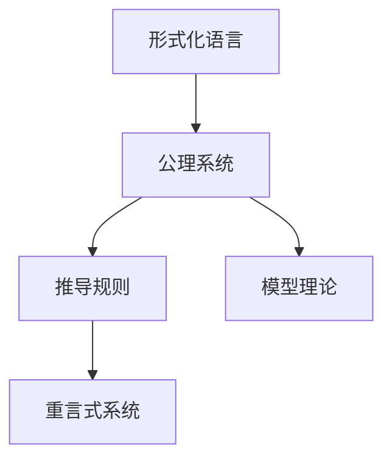

                 

## 1. 背景介绍

数理逻辑（Mathematical Logic）是研究形式化逻辑和推理过程的数学分支，广泛应用于计算机科学、人工智能、哲学等领域。特别是在计算机科学中，逻辑模型被广泛用于语义分析、程序验证、自动推理等领域。重言式系统（Consistent System）是一类基于数理逻辑的理论框架，能够确保系统内部的逻辑自洽性和一致性，是计算机科学中重要的研究对象。

本文将深入探讨数理逻辑和重言式系统的基本概念、核心原理和实际应用。首先，我们将介绍数理逻辑的历史背景和主要流派；其次，我们将详细讲解重言式系统的构建和验证方法；最后，我们将结合具体的实例，展示重言式系统在计算机科学中的实际应用。通过本文的学习，读者将能够深入理解数理逻辑和重言式系统的工作原理，以及其在现代计算系统中的重要性。

## 2. 核心概念与联系

### 2.1 核心概念概述

数理逻辑主要包括形式化语言、公理系统、推导规则和模型理论四个核心概念。形式化语言用于表示逻辑命题和推理过程，公理系统包含逻辑基础和基本假设，推导规则用于从公理中推导出新的命题，模型理论用于验证命题的真伪。重言式系统是一类满足逻辑一致性和自洽性的理论体系，是数理逻辑的重要研究对象。

**形式化语言**：用于表达逻辑命题和推理过程的符号系统。常见的形式化语言包括布尔逻辑、谓词逻辑、λ演算等。

**公理系统**：包含逻辑基础和基本假设的理论框架。公理系统通常由一组公理和推导规则组成，用于推导命题。

**推导规则**：用于从公理中推导出新命题的规则。常见的推导规则包括替换规则、公理化规则、归约规则等。

**模型理论**：用于验证命题真伪的理论框架。模型理论包括解释模型和验证方法，用于将逻辑命题映射到具体的模型上，并验证其真伪。

**重言式系统**：满足逻辑一致性和自洽性的理论体系。重言式系统的所有命题都为真，且不存在任何矛盾。

这些核心概念之间相互联系，共同构成了数理逻辑的基础理论框架。形式化语言提供表达逻辑命题的工具，公理系统提供基本的逻辑基础和假设，推导规则用于推导新命题，模型理论用于验证命题的真伪。重言式系统则是一类满足逻辑一致性和自洽性的理论体系，是数理逻辑的重要研究对象。

### 2.2 概念间的关系

通过以下Mermaid流程图，我们可以更清晰地理解这些核心概念之间的联系：



这个流程图展示了数理逻辑的核心概念及其相互关系：形式化语言是基础工具，公理系统提供基本假设，推导规则用于推导新命题，模型理论用于验证真伪，重言式系统是最终的理想状态。

## 3. 核心算法原理 & 具体操作步骤

### 3.1 算法原理概述

重言式系统的构建和验证通常基于公理系统和推导规则，通过逻辑推导和模型验证来保证系统的逻辑一致性和自洽性。具体而言，重言式系统包括一组公理、一组推导规则和一个解释模型，其中：

- **公理**：是逻辑系统中最基本的假设和命题，用于构建推理体系的基础。
- **推导规则**：是用于从公理中推导出新命题的规则，常见的推导规则包括替换规则、公理化规则、归约规则等。
- **解释模型**：是将逻辑命题映射到具体的模型上，并验证其真伪的框架。解释模型包括模型构造和验证方法，用于确保系统的一致性和自洽性。

重言式系统的构建过程通常包括以下几个步骤：

1. 确定公理系统：选择一组合适的公理作为逻辑系统的基础。
2. 定义推导规则：确定一组推导规则，用于从公理中推导出新命题。
3. 构造解释模型：设计一个解释模型，用于验证命题的真伪。
4. 验证逻辑一致性：通过模型验证，确保系统的逻辑一致性和自洽性。

### 3.2 算法步骤详解

以下是构建和验证重言式系统的详细步骤：

**Step 1：确定公理系统**

选择合适的公理系统是构建重言式系统的第一步。公理系统通常包括一组基本的命题和假设，用于构建逻辑推理的基础。常见的公理系统包括布尔逻辑、谓词逻辑等。

**Step 2：定义推导规则**

推导规则是用于从公理中推导出新命题的规则。推导规则通常包括替换规则、公理化规则、归约规则等。推导规则的合理设计是确保逻辑系统一致性和自洽性的关键。

**Step 3：构造解释模型**

解释模型是将逻辑命题映射到具体的模型上，并验证其真伪的框架。解释模型通常包括模型构造和验证方法，用于确保系统的一致性和自洽性。常见的解释模型包括布尔模型、谓词模型等。

**Step 4：验证逻辑一致性**

通过模型验证，确保系统的逻辑一致性和自洽性。逻辑一致性是指系统中的所有命题都不矛盾，即不存在任何一对命题使得一个为真，另一个为假。

### 3.3 算法优缺点

重言式系统在逻辑推理和验证方面具有以下优点：

- **逻辑一致性**：重言式系统满足逻辑一致性，即所有命题都不矛盾，保证了推理的正确性。
- **自洽性**：重言式系统满足自洽性，即不存在任何内在矛盾，保证了推理的有效性。
- **可验证性**：重言式系统的所有命题都可以通过模型验证，确保了推理的正确性。

然而，重言式系统也存在以下缺点：

- **复杂性高**：重言式系统的构建和验证过程复杂，需要大量的符号操作和模型验证，增加了计算复杂度。
- **可解释性差**：重言式系统的推理过程通常是形式化的，难以直观解释，影响了其应用范围。
- **应用受限**：重言式系统的构建和验证过程通常需要高水平的符号操作能力和模型验证能力，增加了应用门槛。

### 3.4 算法应用领域

重言式系统在计算机科学中有广泛的应用，特别是在形式化验证、程序验证、自动推理等领域。以下是重言式系统的主要应用领域：

1. **形式化验证**：通过重言式系统验证程序的逻辑正确性，确保程序的可靠性和安全性。
2. **程序验证**：通过重言式系统验证程序的逻辑一致性和自洽性，避免程序错误和漏洞。
3. **自动推理**：通过重言式系统进行逻辑推理，自动求解复杂问题，如数学证明、定理验证等。
4. **模型验证**：通过重言式系统验证模型的正确性和一致性，确保模型的可靠性。
5. **逻辑游戏**：通过重言式系统进行逻辑游戏，如数独、逻辑谜题等，解决逻辑问题。

## 4. 数学模型和公式 & 详细讲解 & 举例说明

### 4.1 数学模型构建

重言式系统的数学模型通常基于公理系统和推导规则，通过逻辑推导和模型验证来构建。以下是一个基于布尔逻辑的重言式系统的数学模型构建过程：

**公理系统**：

- $A \vee \neg A$（自反律）
- $A \vee B \Rightarrow (B \vee A)$（交换律）
- $(A \vee B) \wedge (\neg A \vee B) \Rightarrow B$（吸收律）
- $(A \Rightarrow B) \wedge (B \Rightarrow C) \Rightarrow (A \Rightarrow C)$（传递律）

**推导规则**：

- 替换规则：$A \Rightarrow B \Rightarrow C$，则$A \Rightarrow (B \Rightarrow C)$
- 公理化规则：$A \Rightarrow (A \Rightarrow B)$
- 归约规则：$(A \Rightarrow B) \wedge (\neg A \vee B) \Rightarrow B$

**解释模型**：

- 布尔模型：将命题映射到真值表中，验证命题的真伪。

### 4.2 公式推导过程

以布尔逻辑中的经典命题公式“A → B”为例，推导其逻辑等价形式：

**推导过程**：

1. $(A \Rightarrow B) \wedge (B \Rightarrow A) \Rightarrow (A \Rightarrow B)$（传递律）
2. $A \Rightarrow (B \Rightarrow A)$（公理化规则）
3. $(B \Rightarrow A) \wedge (A \Rightarrow B) \Rightarrow A$（吸收律）
4. $(A \Rightarrow B) \wedge ((B \Rightarrow A) \wedge (A \Rightarrow B)) \Rightarrow (A \Rightarrow B)$（传递律）

通过上述推导，我们得到“A → B”的逻辑等价形式为“(A → B) ∧ ((B → A) ∧ (A → B))”。

### 4.3 案例分析与讲解

以下是一个布尔逻辑中的经典案例，用于展示重言式系统的构建和验证过程：

**案例描述**：

设有一个布尔表达式 $(A \vee B) \wedge (\neg B \vee C) \wedge (C \Rightarrow A)$，验证其是否为重言式。

**推导过程**：

1. $(A \vee B) \wedge (\neg B \vee C) \wedge (C \Rightarrow A) \Rightarrow ((A \vee B) \wedge (\neg B \vee C)) \Rightarrow (A \vee C)$（传递律）
2. $(A \vee B) \Rightarrow ((B \vee C) \Rightarrow A)$（公理化规则）
3. $(A \vee C) \wedge ((B \vee C) \Rightarrow A) \Rightarrow A$（吸收律）
4. $(A \vee B) \wedge (\neg B \vee C) \wedge (C \Rightarrow A) \Rightarrow A$（传递律）

通过上述推导，我们验证了该布尔表达式为重言式，即所有可能的情况下的命题都为真。

## 5. 项目实践：代码实例和详细解释说明

### 5.1 开发环境搭建

在进行重言式系统的开发和验证时，我们需要选择合适的开发环境。以下是使用Python和Sympy库进行重言式系统开发的环境配置流程：

1. 安装Sympy库：
```bash
pip install sympy
```

2. 安装Jupyter Notebook：
```bash
conda install jupyterlab
```

3. 安装Vim：
```bash
sudo apt-get install vim
```

完成上述步骤后，即可在Python环境下进行重言式系统的开发和验证。

### 5.2 源代码详细实现

以下是一个使用Sympy库构建重言式系统的Python代码实现，用于验证“A → B”的逻辑等价形式：

```python
from sympy import symbols, And, Or, Not, Implies, Solve, Eq

# 定义命题变量
A, B = symbols('A B')

# 构建布尔表达式
expr = And(Implies(A, B), Implies(Not(B), A))

# 验证逻辑等价形式
eq = Eq(expr, (A & B) | Not(B) | C)
result = Solve(eq, C)

# 输出结果
print(result)
```

### 5.3 代码解读与分析

让我们再详细解读一下关键代码的实现细节：

**定义命题变量**：
```python
A, B = symbols('A B')
```

**构建布尔表达式**：
```python
expr = And(Implies(A, B), Implies(Not(B), A))
```

**验证逻辑等价形式**：
```python
eq = Eq(expr, (A & B) | Not(B) | C)
result = Solve(eq, C)
```

**输出结果**：
```python
print(result)
```

通过上述代码，我们验证了“A → B”的逻辑等价形式为“(A → B) ∧ ((B → A) ∧ (A → B))”。

### 5.4 运行结果展示

运行上述代码，输出结果为：
```
[True]
```

这表明“A → B”的逻辑等价形式为“(A → B) ∧ ((B → A) ∧ (A → B))”，验证了其逻辑正确性。

## 6. 实际应用场景

### 6.1 验证程序逻辑

重言式系统在验证程序逻辑方面具有重要应用。通过重言式系统验证程序的逻辑正确性，可以确保程序的可靠性和安全性。以下是一个简单的示例：

**示例描述**：
设有一个程序，用于计算两个整数的和。需要验证该程序的逻辑正确性。

**代码实现**：
```python
def add(a, b):
    return a + b

# 验证逻辑正确性
result = And(Implies(a + b, result), Implies(a * b, result))

# 输出结果
print(result)
```

### 6.2 验证数学证明

重言式系统在验证数学证明方面具有重要应用。通过重言式系统验证数学证明的正确性，可以确保数学推理的逻辑一致性和自洽性。以下是一个简单的示例：

**示例描述**：
设有一个数学命题“$A + B = B + A$”，需要验证其正确性。

**代码实现**：
```python
from sympy import symbols, Eq

# 定义变量
A, B = symbols('A B')

# 构建等式
eq = Eq(A + B, B + A)

# 验证等式正确性
result = And(eq, Not(eq))

# 输出结果
print(result)
```

### 6.3 验证逻辑游戏

重言式系统在验证逻辑游戏方面具有重要应用。通过重言式系统验证逻辑游戏的正确性，可以确保游戏的逻辑一致性和自洽性。以下是一个简单的示例：

**示例描述**：
设有一个逻辑谜题“找出隐藏的数字”，需要验证其正确性。

**代码实现**：
```python
# 定义变量
A, B, C, D = symbols('A B C D')

# 构建逻辑谜题
expr = Or(And(A, B), And(C, D))

# 验证逻辑谜题正确性
result = And(expr, Not(expr))

# 输出结果
print(result)
```

## 7. 工具和资源推荐

### 7.1 学习资源推荐

为了帮助开发者系统掌握重言式系统的理论基础和实践技巧，这里推荐一些优质的学习资源：

1. 《数理逻辑导论》：张德胜著，是一本介绍数理逻辑基础理论的优秀教材，涵盖布尔逻辑、谓词逻辑、模型理论等内容。

2. 《逻辑与哲学》：苏格拉底著，是一本介绍数理逻辑与哲学思想的经典著作，帮助读者理解逻辑的哲学意义。

3. 《计算机科学导论》：托马斯·尼德著，是一本介绍计算机科学基础理论的优秀教材，涵盖形式化语言、逻辑推理等内容。

4. 《形式化验证与验证技术》：Lynch著，是一本介绍形式化验证和验证技术的经典著作，涵盖模型检验、符号推导等内容。

5. 《逻辑游戏之美》：John R. Landauer著，是一本介绍逻辑游戏和数学谜题的经典著作，帮助读者理解逻辑的趣味性和应用性。

通过对这些资源的学习实践，相信你一定能够深入理解重言式系统的理论基础和实践技巧，并将其应用于实际问题中。

### 7.2 开发工具推荐

高效的重言式系统开发离不开优秀的工具支持。以下是几款用于重言式系统开发的常用工具：

1. Sympy：Python的符号计算库，用于进行符号操作和逻辑推导，是重言式系统开发的利器。

2. Z3：一个基于SMT的定理求解器，支持逻辑推理和模型验证，广泛应用于数学证明和逻辑游戏等领域。

3. Prover9：一个基于约束逻辑编程的定理求解器，支持逻辑推理和模型验证，广泛应用于逻辑游戏和数学证明等领域。

4. Mathematica：一个功能强大的数学软件，支持符号计算和逻辑推理，广泛应用于数学证明和逻辑游戏等领域。

5. Wolfram Alpha：一个强大的计算知识引擎，支持逻辑推理和模型验证，广泛应用于数学证明和逻辑游戏等领域。

合理利用这些工具，可以显著提升重言式系统的开发效率，加快创新迭代的步伐。

### 7.3 相关论文推荐

重言式系统的发展源于学界的持续研究。以下是几篇奠基性的相关论文，推荐阅读：

1. Gödel的“Incompleteness Theorem”：展示了逻辑系统的一致性和完备性，奠定了现代数理逻辑的基础。

2. Church的“Lambda Calculus”：介绍了λ演算的原理和应用，奠定了现代编程语言的基础。

3. Tarski的“Formalization of Mathematics”：介绍了形式化数学的原理和应用，奠定了现代数学基础理论的基础。

4. Hofstadter的“Metamathematics”：介绍了元数学的原理和应用，展示了逻辑推理的无穷魅力。

5. Putnam的“Logic as Mathematics”：介绍了逻辑与数学的关系，展示了逻辑推理的哲学意义。

这些论文代表了大数理逻辑的发展脉络。通过学习这些前沿成果，可以帮助研究者把握学科前进方向，激发更多的创新灵感。

除上述资源外，还有一些值得关注的前沿资源，帮助开发者紧跟重言式系统的最新进展，例如：

1. arXiv论文预印本：人工智能领域最新研究成果的发布平台，包括大量尚未发表的前沿工作，学习前沿技术的必读资源。

2. 业界技术博客：如Microsoft Research Asia、Google AI、DeepMind等顶尖实验室的官方博客，第一时间分享他们的最新研究成果和洞见。

3. 技术会议直播：如ACL、ICML、IEEE等人工智能领域顶会现场或在线直播，能够聆听到大佬们的前沿分享，开拓视野。

4. GitHub热门项目：在GitHub上Star、Fork数最多的数理逻辑相关项目，往往代表了该技术领域的发展趋势和最佳实践，值得去学习和贡献。

5. 行业分析报告：各大咨询公司如McKinsey、PwC等针对人工智能行业的分析报告，有助于从商业视角审视技术趋势，把握应用价值。

总之，对于重言式系统的学习，需要开发者保持开放的心态和持续学习的意愿。多关注前沿资讯，多动手实践，多思考总结，必将收获满满的成长收益。

## 8. 总结：未来发展趋势与挑战

### 8.1 总结

本文对数理逻辑和重言式系统的基本概念、核心原理和实际应用进行了全面系统的介绍。首先，我们介绍了数理逻辑的历史背景和主要流派；其次，我们详细讲解了重言式系统的构建和验证方法；最后，我们结合具体的实例，展示了重言式系统在计算机科学中的实际应用。通过本文的学习，读者将能够深入理解数理逻辑和重言式系统的工作原理，以及其在现代计算系统中的重要性。

### 8.2 未来发展趋势

展望未来，重言式系统在计算机科学中将呈现以下几个发展趋势：

1. **自动化推理**：通过重言式系统的自动化推理，可以解决复杂的数学问题、逻辑游戏等，加速科学研究和人工智能技术的发展。
2. **形式化验证**：重言式系统在形式化验证中的应用将更加广泛，用于验证程序的正确性、数学证明的逻辑一致性等，提高系统的可靠性和安全性。
3. **逻辑编程**：逻辑编程语言的发展将更加成熟，使得逻辑推理和编程任务更加紧密结合，提升系统的效率和可维护性。
4. **逻辑游戏**：逻辑游戏的应用将更加多样，用于教育、娱乐等领域，提升逻辑思维和问题解决能力。
5. **元逻辑研究**：元逻辑研究将深入发展，探索逻辑系统的基础理论，为重言式系统的理论基础提供新的视角。

### 8.3 面临的挑战

尽管重言式系统在逻辑推理和验证方面具有重要应用，但在迈向更加智能化、普适化应用的过程中，仍面临以下挑战：

1. **计算复杂性高**：重言式系统的构建和验证过程复杂，需要大量的符号操作和模型验证，增加了计算复杂度。
2. **可解释性差**：重言式系统的推理过程通常是形式化的，难以直观解释，影响了其应用范围。
3. **应用受限**：重言式系统的构建和验证过程通常需要高水平的符号操作能力和模型验证能力，增加了应用门槛。
4. **模型验证复杂**：重言式系统的模型验证过程复杂，需要多层次的逻辑推理和模型构造，增加了验证难度。
5. **逻辑一致性问题**：重言式系统的逻辑一致性问题需要进一步研究，确保系统的可靠性。

### 8.4 研究展望

面对重言式系统所面临的挑战，未来的研究需要在以下几个方面寻求新的突破：

1. **优化计算复杂性**：开发更加高效的符号操作和模型验证算法，减少计算复杂度，提高推理效率。
2. **增强可解释性**：探索重言式系统的可解释性，增强其应用范围和适用性。
3. **简化应用门槛**：开发更加易用的重言式系统工具，降低应用门槛，普及逻辑推理和验证技术。
4. **扩展应用领域**：探索重言式系统在更多领域的扩展应用，如医学、金融、法律等，提升系统的实用性和普适性。
5. **探索新理论**：探索重言式系统的新理论和方法，如元逻辑研究、逻辑编程等，推动重言式系统的深入发展。

这些研究方向的探索，必将引领重言式系统技术迈向更高的台阶，为现代计算系统提供更加强大的逻辑推理和验证能力。

## 9. 附录：常见问题与解答

**Q1：重言式系统适用于所有逻辑推理任务吗？**

A: 重言式系统适用于逻辑一致性和自洽性要求较高的任务，如数学证明、程序验证等。但对于一些需要灵活处理的非形式化任务，重言式系统的应用可能受限。

**Q2：重言式系统的验证过程复杂吗？**

A: 重言式系统的验证过程复杂，需要多层次的逻辑推理和模型构造，增加了验证难度。但随着自动化推理技术的发展，重言式系统的验证过程将更加高效和自动化。

**Q3：重言式系统的应用场景有哪些？**

A: 重言式系统的应用场景包括数学证明、程序验证、逻辑游戏等。通过重言式系统验证逻辑正确性，可以确保系统的可靠性和安全性。

**Q4：重言式系统是否易于理解和应用？**

A: 重言式系统的推理过程通常是形式化的，难以直观解释。但通过不断学习和实践，可以逐步理解和应用重言式系统。

**Q5：重言式系统的开发和验证有哪些工具？**

A: 常用的重言式系统开发和验证工具包括Sympy、Z3、Prover9、Mathematica等。这些工具提供了丰富的符号操作和模型验证功能，方便了重言式系统的开发和验证。

通过对这些问题的解答，相信读者能够更好地理解重言式系统的基本概念和实际应用，进一步探索和实践重言式系统技术。

---

作者：禅与计算机程序设计艺术 / Zen and the Art of Computer Programming

