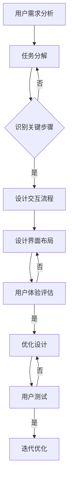

# 任务导向设计思维在CUI中的详细应用

> 关键词：任务导向设计，CUI设计，用户交互，设计流程，用户体验，界面设计，交互设计，可用性工程

## 1. 背景介绍

随着人工智能技术的发展，计算机用户界面（CUI）的设计逐渐成为用户体验的关键因素。CUI不仅包括传统的图形用户界面（GUI）和命令行界面（CLI），还涵盖了语音用户界面（VUI）和聊天机器人等新型交互方式。任务导向设计思维强调以用户为中心，关注用户的目标和任务，因此在CUI设计中具有重要意义。本文将深入探讨任务导向设计思维在CUI设计中的应用，旨在提升用户体验，创造更加高效、直观的交互方式。

### 1.1 CUI设计的发展历程

CUI设计经历了从早期基于文本的CLI到图形化的GUI，再到如今的多模态交互的发展历程。每个阶段都体现了交互方式的变化和用户体验的提升。

- **CLI时代**：用户通过键盘输入命令，交互方式较为复杂，对用户的技术背景有较高要求。
- **GUI时代**：图形界面提供了直观的视觉元素和操作方式，降低了用户的学习成本。
- **多模态交互时代**：结合语音、手势、眼动等多种交互方式，提供了更加自然、便捷的用户体验。

### 1.2 任务导向设计思维

任务导向设计思维强调以用户为中心，关注用户的任务和目标，通过设计满足用户需求的功能和流程，提升用户体验。在CUI设计中，任务导向设计思维可以帮助设计师更好地理解用户的需求，设计出更加符合用户习惯的交互方式。

## 2. 核心概念与联系

### 2.1 任务导向设计思维的核心概念

- **用户需求**：以用户为中心，深入了解用户的需求和目标。
- **任务分析**：分析用户完成任务的过程，识别关键步骤和决策点。
- **设计流程**：根据任务分析结果，设计满足用户需求的交互流程和界面布局。
- **用户体验**：关注用户在使用过程中的感受，确保交互的易用性和愉悦性。

### 2.2 Mermaid 流程图

以下是一个任务导向设计思维的Mermaid流程图：



### 2.3 核心概念之间的联系

用户需求分析是整个设计流程的起点，通过任务分解和关键步骤识别，可以设计出满足用户需求的交互流程和界面布局。用户体验评估是设计流程的循环环节，通过不断优化设计，最终达到提升用户体验的目的。

## 3. 核心算法原理 & 具体操作步骤

### 3.1 算法原理概述

任务导向设计思维在CUI设计中的应用，主要基于以下原理：

- **用户中心设计**：将用户的需求和目标放在首位，设计出符合用户习惯的交互方式。
- **任务分解**：将用户的目标分解为一系列子任务，为每个子任务设计合适的交互流程。
- **迭代优化**：通过用户测试和反馈，不断优化设计，提升用户体验。

### 3.2 算法步骤详解

1. **用户需求分析**：通过问卷调查、访谈、用户测试等方式收集用户需求。
2. **任务分解**：将用户需求分解为一系列子任务，明确每个子任务的目标和步骤。
3. **设计交互流程**：根据任务分解结果，设计每个子任务的交互流程。
4. **设计界面布局**：根据交互流程，设计界面布局，确保用户能够直观地完成每个子任务。
5. **用户体验评估**：通过用户测试和反馈，评估设计的易用性和愉悦性。
6. **迭代优化**：根据用户反馈，优化设计，提升用户体验。

### 3.3 算法优缺点

#### 优点

- **提升用户体验**：关注用户需求，设计出更加符合用户习惯的交互方式。
- **提高效率**：通过简化任务流程，提高用户完成任务的效率。
- **增强易用性**：设计简洁直观的界面，降低用户的学习成本。

#### 缺点

- **设计周期长**：需要投入较多时间和精力进行用户研究和设计迭代。
- **成本较高**：需要专业的用户研究、交互设计和测试人员。

### 3.4 算法应用领域

任务导向设计思维在以下CUI设计领域具有广泛的应用：

- **软件应用**：办公软件、教育软件、娱乐软件等。
- **移动应用**：智能手机应用、平板电脑应用等。
- **Web应用**：网站、在线服务等。
- **聊天机器人**：客服机器人、个人助理等。

## 4. 数学模型和公式 & 详细讲解 & 举例说明

### 4.1 数学模型构建

在任务导向设计思维中，可以使用以下数学模型进行用户需求分析和任务分解：

- **任务流程图**：用图形化的方式表示用户完成任务的过程，包括任务步骤、决策点和执行条件。
- **用户行为模型**：描述用户在完成任务过程中的行为和决策，包括用户的学习曲线、认知负荷等。

### 4.2 公式推导过程

以下是一个简单的用户行为模型公式：

$$
\text{用户行为} = f(\text{用户特征}, \text{任务特征}, \text{环境特征})
$$

其中，用户特征包括用户的知识、技能、经验等；任务特征包括任务的复杂度、难度、目标等；环境特征包括任务的物理环境、社会环境等。

### 4.3 案例分析与讲解

假设我们设计一个在线购物平台的CUI。首先，我们需要进行用户需求分析，了解用户在购物过程中的目标和期望。然后，我们将购物过程分解为以下子任务：

1. 搜索商品
2. 浏览商品详情
3. 添加商品到购物车
4. 下单支付

针对每个子任务，我们设计相应的交互流程和界面布局，例如：

1. **搜索商品**：提供搜索框，支持关键词搜索和高级搜索功能。
2. **浏览商品详情**：展示商品图片、描述、价格等信息，并提供用户评价、问答等模块。
3. **添加商品到购物车**：在商品详情页面提供添加到购物车的按钮。
4. **下单支付**：提供订单确认、选择支付方式、提交订单等步骤。

最后，我们通过用户测试和反馈，不断优化设计，提升用户体验。

## 5. 项目实践：代码实例和详细解释说明

### 5.1 开发环境搭建

由于CUI设计涉及多个方面，以下是一个基于Web的CUI设计项目实践的开发环境搭建步骤：

1. 安装Web开发工具，如Visual Studio Code、Sublime Text等。
2. 安装版本控制工具，如Git。
3. 安装代码编辑器和项目管理工具，如Jenkins。
4. 安装数据库和服务器，如MySQL、Apache等。

### 5.2 源代码详细实现

以下是一个简单的Web页面示例，展示了如何使用HTML和CSS进行CUI设计：

```html
<!DOCTYPE html>
<html>
<head>
    <title>在线购物平台</title>
    <style>
        body {
            font-family: Arial, sans-serif;
        }
        .search-box {
            width: 300px;
            margin: 20px;
        }
        .product-details {
            margin-top: 20px;
        }
        .add-to-cart {
            background-color: #4CAF50;
            color: white;
            padding: 10px 20px;
            text-decoration: none;
            margin-top: 10px;
        }
    </style>
</head>
<body>
    <h1>在线购物平台</h1>
    <input type="text" class="search-box" placeholder="搜索商品...">
    <div class="product-details">
        <h2>商品名称</h2>
        
        <p>商品描述...</p>
        <p>价格：$XX.00</p>
        <a href="#" class="add-to-cart">添加到购物车</a>
    </div>
</body>
</html>
```

### 5.3 代码解读与分析

以上代码展示了如何使用HTML和CSS设计一个简单的在线购物平台页面。页面包括搜索框、商品详情和添加到购物车按钮等元素。通过使用CSS样式，可以美化页面，提升用户体验。

### 5.4 运行结果展示

运行以上代码，将得到一个简单的在线购物平台页面，用户可以搜索商品、浏览商品详情并添加到购物车。

## 6. 实际应用场景

### 6.1 软件应用

任务导向设计思维在软件应用CUI设计中的应用非常广泛。以下是一些例子：

- **办公软件**：如Microsoft Office、Google Workspace等，通过设计简洁直观的界面，提高用户的工作效率。
- **教育软件**：如在线学习平台、教育软件等，通过设计适合学习场景的交互方式，提升学习效果。

### 6.2 移动应用

移动应用CUI设计同样需要考虑任务导向设计思维。以下是一些例子：

- **社交应用**：如微信、Facebook等，通过设计符合用户社交习惯的交互方式，提升用户粘性。
- **游戏应用**：如王者荣耀、和平精英等，通过设计丰富的游戏元素和交互方式，提高游戏体验。

### 6.3 Web应用

Web应用CUI设计也需要关注任务导向设计思维。以下是一些例子：

- **电子商务平台**：如淘宝、京东等，通过设计简洁的搜索和购物流程，提高用户购物体验。
- **在线服务**：如在线医疗咨询、在线教育等，通过设计便捷的交互方式，提升服务效率。

### 6.4 聊天机器人

聊天机器人CUI设计同样需要考虑任务导向设计思维。以下是一些例子：

- **客服机器人**：通过设计智能的对话流程，提供高效的客户服务。
- **个人助理**：通过设计符合用户习惯的交互方式，帮助用户完成日常任务。

## 7. 工具和资源推荐

### 7.1 学习资源推荐

- **书籍**：《设计思维》、《用户体验要素》等。
- **网站**：交互设计协会（IxDA）、用户体验设计师联盟（UXPA）等。

### 7.2 开发工具推荐

- **设计工具**：Sketch、Adobe XD、Axure RP等。
- **原型工具**：InVision、Figma、Mockplus等。

### 7.3 相关论文推荐

- **《用户体验设计》**：介绍了用户体验设计的基本概念和方法。
- **《交互设计：设计思维与设计实践》**：介绍了交互设计的基本原理和设计流程。

## 8. 总结：未来发展趋势与挑战

### 8.1 研究成果总结

任务导向设计思维在CUI设计中的应用，已经取得了显著的成果。通过关注用户需求，设计出符合用户习惯的交互方式，可以有效提升用户体验，提高用户完成任务的效率。

### 8.2 未来发展趋势

随着人工智能、大数据等技术的不断发展，CUI设计将呈现出以下趋势：

- **多模态交互**：结合语音、手势、眼动等多种交互方式，提供更加自然、便捷的用户体验。
- **个性化设计**：根据用户的行为和偏好，提供个性化的交互体验。
- **智能化设计**：利用人工智能技术，实现智能推荐、智能客服等功能。

### 8.3 面临的挑战

CUI设计在发展过程中也面临着以下挑战：

- **技术挑战**：多模态交互、个性化设计等技术实现难度较大。
- **用户体验挑战**：如何设计出既满足用户需求，又具有良好用户体验的交互方式。
- **伦理挑战**：如何确保CUI设计符合伦理道德规范。

### 8.4 研究展望

为了应对未来CUI设计面临的挑战，需要从以下几个方面进行研究和探索：

- **技术创新**：研究多模态交互、个性化设计等新技术的实现方法。
- **用户体验研究**：深入研究用户需求和行为，设计出更加符合用户习惯的交互方式。
- **伦理规范**：制定CUI设计的伦理规范，确保设计符合社会价值观。

## 9. 附录：常见问题与解答

**Q1：任务导向设计思维在CUI设计中的具体应用步骤是什么？**

A：任务导向设计思维在CUI设计中的具体应用步骤包括用户需求分析、任务分解、设计交互流程、设计界面布局、用户体验评估和迭代优化。

**Q2：如何进行用户需求分析？**

A：用户需求分析可以通过问卷调查、访谈、用户测试等方式进行。在分析过程中，需要关注用户的目标、需求、痛点和期望。

**Q3：如何设计交互流程？**

A：设计交互流程需要根据任务分解结果，将任务分解为一系列子任务，为每个子任务设计合适的交互流程。

**Q4：如何设计界面布局？**

A：设计界面布局需要根据交互流程，将界面元素进行合理的排列组合，确保用户能够直观地完成每个子任务。

**Q5：如何评估用户体验？**

A：用户体验评估可以通过用户测试、问卷调查、眼动追踪等方式进行。在评估过程中，需要关注用户的操作效率、错误率、满意度等指标。

作者：禅与计算机程序设计艺术 / Zen and the Art of Computer Programming