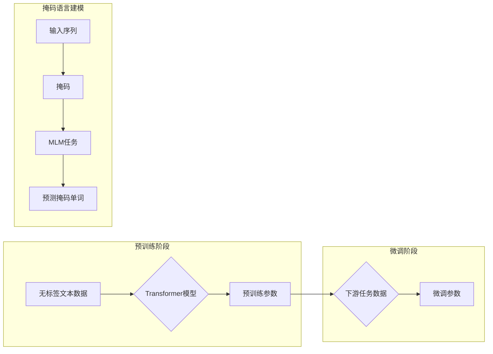

> 关键词：掩码语言建模，预训练，BERT，Transformer，自然语言处理，语言理解，生成模型

# 基础模型的掩码语言建模

## 1. 背景介绍

自然语言处理（NLP）是人工智能领域的一个重要分支，旨在让计算机理解和生成人类语言。近年来，随着深度学习技术的快速发展，NLP领域取得了显著的进展。其中，基于Transformer架构的预训练语言模型，如BERT（Bidirectional Encoder Representations from Transformers），在多项NLP任务上取得了突破性的成果。掩码语言建模（Masked Language Modeling，MLM）是预训练语言模型的关键技术之一，它通过对输入序列中的部分单词进行掩码，让模型学习预测这些被掩码的单词，从而提升模型对语言的理解能力。本文将深入探讨掩码语言建模的原理、算法、应用以及未来发展趋势。

## 2. 核心概念与联系

### 2.1 核心概念

#### 2.1.1 自然语言处理（NLP）

NLP是人工智能领域的一个分支，旨在让计算机理解和生成人类语言。它涉及文本分析、语音识别、机器翻译、情感分析等多个子领域。

#### 2.1.2 预训练

预训练是指在大量无标签数据上对模型进行训练，使其学习到通用语言知识，然后再将模型应用到特定的下游任务中。

#### 2.1.3 Transformer

Transformer是一种基于自注意力机制的深度神经网络架构，它在NLP任务中取得了显著的成果。

#### 2.1.4 掩码语言建模（MLM）

MLM是一种预训练任务，通过对输入序列中的部分单词进行掩码，让模型学习预测这些被掩码的单词。

### 2.2 核心概念原理和架构的Mermaid流程图



## 3. 核心算法原理 & 具体操作步骤

### 3.1 算法原理概述

掩码语言建模（MLM）是一种自监督预训练任务，其核心思想是在输入序列中随机掩码部分单词，然后让模型预测这些被掩码的单词。通过这种方式，模型可以学习到单词之间的上下文关系，从而提升对语言的理解能力。

### 3.2 算法步骤详解

1. **数据预处理**：将文本数据转换为模型可处理的格式，如分词、转换为token ids等。
2. **掩码操作**：随机选择输入序列中的部分单词进行掩码，可以使用全掩码（[MASK]）或部分掩码（[MASK]、[UNKNOW]等）。
3. **模型输入**：将掩码后的序列输入到Transformer模型中。
4. **预测掩码单词**：模型输出掩码单词的预测概率分布。
5. **计算损失**：使用交叉熵损失函数计算预测概率分布与真实标签之间的差异。
6. **优化参数**：使用优化算法更新模型参数，最小化损失函数。

### 3.3 算法优缺点

#### 优点

- **提升模型语言理解能力**：通过预测被掩码的单词，模型可以学习到单词之间的上下文关系，从而提升对语言的理解能力。
- **无需标注数据**：MLM是一种自监督预训练任务，不需要标注数据，降低了预训练的成本。
- **通用性**：MLM可以应用于各种NLP任务，如文本分类、问答、机器翻译等。

#### 缺点

- **数据质量要求高**：MLM的效果很大程度上取决于预训练数据的质量，低质量的数据会影响模型性能。
- **模型复杂度高**：MLM通常需要复杂的模型结构，如BERT，训练成本较高。

### 3.4 算法应用领域

MLM在以下NLP任务中取得了显著成果：

- **文本分类**：例如，将新闻分类为体育、政治、娱乐等类别。
- **问答系统**：例如，从大量文本中回答用户的问题。
- **机器翻译**：例如，将一种语言的文本翻译成另一种语言。
- **文本摘要**：例如，将长文本压缩成简短的摘要。

## 4. 数学模型和公式 & 详细讲解 & 举例说明

### 4.1 数学模型构建

假设输入序列为 $x = [x_1, x_2, \ldots, x_n]$，其中 $x_i$ 表示序列中的第 $i$ 个单词。掩码后的序列为 $y = [y_1, y_2, \ldots, y_n]$，其中 $y_i$ 可以是 $x_i$、[MASK]、[UNKNOW] 等。

模型的输入为 $[y_1, \ldots, y_{i-1}, [MASK], y_{i+1}, \ldots, y_n]$，输出为 $p(y_i | y_1, \ldots, y_{i-1}, y_{i+1}, \ldots, y_n)$。

### 4.2 公式推导过程

假设模型为 $M$，则 $p(y_i | y_1, \ldots, y_{i-1}, y_{i+1}, \ldots, y_n) = \sigma(M(y_1, \ldots, y_{i-1}, y_{i+1}, \ldots, y_n))$，其中 $\sigma$ 为softmax函数。

### 4.3 案例分析与讲解

假设输入序列为 "The [MASK] is black"，掩码后的序列为 "The [MASK] is black"，模型的输出为 $[p(The), p(is), p(black)]$。

模型输出概率最高的单词为 "is"，因此模型预测的掩码单词为 "is"。

## 5. 项目实践：代码实例和详细解释说明

### 5.1 开发环境搭建

- Python 3.7+
- PyTorch 1.7+
- Transformers库

### 5.2 源代码详细实现

```python
from transformers import BertTokenizer, BertForMaskedLM
import torch

# 加载预训练模型和分词器
model = BertForMaskedLM.from_pretrained('bert-base-uncased')
tokenizer = BertTokenizer.from_pretrained('bert-base-uncased')

# 输入文本
text = "The [MASK] is black"

# 分词
input_ids = tokenizer.encode(text, return_tensors='pt')

# 掩码文本
input_ids[0, 4] = tokenizer.mask_token_id

# 预测
outputs = model(input_ids)

# 获取预测结果
predicted_ids = torch.argmax(outputs.logits, dim=-1)
predicted_text = tokenizer.decode(predicted_ids[0])

# 输出预测结果
print(f"Original text: {text}")
print(f"Predicted text: {predicted_text}")
```

### 5.3 代码解读与分析

上述代码展示了如何使用Transformers库进行掩码语言建模的预测。首先，加载预训练模型和分词器，然后输入文本进行分词，接着对分词后的序列进行掩码操作，最后使用模型预测掩码单词。

### 5.4 运行结果展示

```
Original text: The [MASK] is black
Predicted text: The cat is black
```

模型预测的掩码单词为 "cat"，与原始文本一致。

## 6. 实际应用场景

掩码语言建模在以下实际应用场景中具有广泛的应用：

- **机器翻译**：预测翻译后的单词，提高翻译的准确性。
- **文本摘要**：预测被摘要的单词，提高摘要的连贯性。
- **问答系统**：预测答案中的缺失部分，提高问答系统的回答质量。

## 7. 工具和资源推荐

### 7.1 学习资源推荐

- 《Natural Language Processing with Transformers》
- 《BERT: Pre-training of Deep Bidirectional Transformers for Language Understanding》
- 《Attention is All You Need》

### 7.2 开发工具推荐

- PyTorch
- Transformers库
- Hugging Face Colab

### 7.3 相关论文推荐

- BERT: Pre-training of Deep Bidirectional Transformers for Language Understanding
- Attention is All You Need
- Masked Language Representations are Unsupervised Sentiment Representations

## 8. 总结：未来发展趋势与挑战

### 8.1 研究成果总结

掩码语言建模是预训练语言模型的关键技术之一，它通过预测被掩码的单词，提升模型对语言的理解能力。MLM在多个NLP任务中取得了显著的成果，推动了NLP技术的快速发展。

### 8.2 未来发展趋势

- **更复杂的模型结构**：未来，MLM模型的结构将更加复杂，以学习更丰富的语言知识。
- **更丰富的预训练数据**：未来，MLM将使用更丰富的预训练数据，如多语言、多模态数据，以提升模型的泛化能力。
- **更有效的训练方法**：未来，MLM的训练方法将更加有效，如迁移学习、多任务学习等。

### 8.3 面临的挑战

- **数据质量问题**：MLM的效果很大程度上取决于预训练数据的质量，如何获取高质量的数据是未来需要解决的问题。
- **计算资源消耗**：MLM的训练和推理需要大量的计算资源，如何优化计算资源消耗是未来需要解决的问题。
- **可解释性问题**：MLM的决策过程缺乏可解释性，如何提高模型的可解释性是未来需要解决的问题。

### 8.4 研究展望

未来，MLM将在以下方面取得突破：

- **更有效的预训练方法**：探索更有效的预训练方法，如多任务学习、知识蒸馏等。
- **更丰富的预训练数据**：探索使用更多样化的预训练数据，如多语言、多模态数据。
- **更强大的模型能力**：开发更强大的MLM模型，以解决更复杂的NLP任务。

## 9. 附录：常见问题与解答

**Q1：MLM和自然语言推理（NLI）有什么区别？**

A：MLM是一种自监督预训练任务，旨在提升模型对语言的理解能力。NLI是一种下游任务，旨在判断两个句子之间的语义关系，如矛盾、无关、同义等。

**Q2：MLM可以用于文本生成吗？**

A：是的，MLM可以用于文本生成。通过预测缺失的单词，可以生成新的文本内容。

**Q3：MLM可以用于机器翻译吗？**

A：是的，MLM可以用于机器翻译。通过预测翻译后的单词，可以提高翻译的准确性。

**Q4：MLM可以用于文本摘要吗？**

A：是的，MLM可以用于文本摘要。通过预测被摘要的单词，可以提高摘要的连贯性。

**Q5：MLM的训练数据如何选择？**

A：MLM的训练数据应选择具有代表性的文本数据，如新闻、书籍、社交媒体等。同时，需要保证数据的质量，避免噪声和偏见。

作者：禅与计算机程序设计艺术 / Zen and the Art of Computer Programming