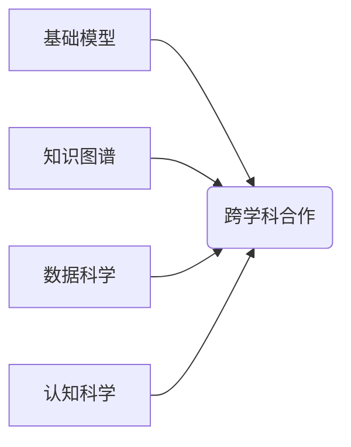

> 关键词：基础模型，跨学科合作，深度学习，人工智能，机器学习，领域知识，知识图谱，数据科学，认知科学

# 基础模型的跨学科合作研究

在人工智能发展的浪潮中，基础模型作为构建复杂智能系统的基础，扮演着至关重要的角色。从早期的统计模型到现代的深度学习模型，基础模型在图像识别、自然语言处理、语音识别等领域取得了显著的成果。然而，随着问题的复杂性和应用领域的多样性，单一学科的研究往往难以满足需求。因此，基础模型的跨学科合作研究已成为人工智能领域的一个重要趋势。

## 1. 背景介绍

### 1.1 问题的由来

随着信息技术的快速发展，数据量呈指数级增长，人工智能的应用场景也越来越广泛。然而，许多复杂问题往往涉及多个学科领域，如生物信息学、材料科学、金融科技等。这些问题通常需要跨学科的知识和技能来解决。

传统的单一学科研究方法在解决这些复杂问题时面临着以下挑战：

- **数据复杂性**：不同学科领域的数据格式、结构、质量等差异较大，单一学科的数据处理方法难以适应。
- **模型局限性**：单一学科的理论和方法难以全面解释复杂现象，限制了模型的泛化能力和可解释性。
- **知识融合困难**：不同学科领域的知识体系存在差异，知识融合困难，难以实现跨学科的深度合作。

### 1.2 研究现状

为了应对这些挑战，人工智能领域开始探索基础模型的跨学科合作研究。这种研究范式旨在结合不同学科领域的知识、数据和方法，构建能够解决复杂问题的综合模型。

目前，跨学科合作研究主要体现在以下几个方面：

- **多学科数据融合**：将来自不同学科领域的数据进行整合，构建统一的数据集，为模型训练提供更多样化的数据来源。
- **多学科知识融合**：将不同学科领域的知识进行整合，构建知识图谱，为模型提供更丰富的语义信息。
- **多学科方法融合**：结合不同学科领域的理论和方法，设计更先进的模型架构和训练策略。

### 1.3 研究意义

基础模型的跨学科合作研究具有以下重要意义：

- **推动学科交叉**：促进不同学科领域的交流和合作，推动学科交叉融合。
- **提升模型性能**：结合多学科知识和方法，提升模型的泛化能力和可解释性。
- **拓展应用领域**：为解决复杂问题提供新的思路和方法，拓展人工智能的应用领域。

### 1.4 本文结构

本文将围绕基础模型的跨学科合作研究展开，主要内容包括：

- 介绍跨学科合作研究的相关概念和背景。
- 分析基础模型在跨学科合作研究中的应用。
- 讨论跨学科合作研究中面临的挑战和解决方案。
- 展望基础模型跨学科合作研究的未来发展趋势。

## 2. 核心概念与联系

### 2.1 核心概念

#### 2.1.1 基础模型

基础模型是指在特定领域或任务中，经过大量数据训练，能够提取特征、进行预测或决策的模型。常见的有深度学习模型、统计模型等。

#### 2.1.2 跨学科合作

跨学科合作是指将不同学科领域的知识、数据和方法进行整合，共同解决复杂问题的研究范式。

#### 2.1.3 知识图谱

知识图谱是一种结构化知识库，通过实体、关系和属性来表示知识，能够有效地组织和管理知识，为智能系统提供语义信息。

#### 2.1.4 数据科学

数据科学是利用统计学、计算机科学和数学等方法，从数据中提取有价值信息的一门交叉学科。

#### 2.1.5 认知科学

认知科学是研究人类认知过程的一门交叉学科，涉及心理学、神经科学、语言学等多个领域。

### 2.2 联系

基础模型、跨学科合作、知识图谱、数据科学和认知科学之间存在着密切的联系：

- 基础模型为跨学科合作提供了技术支持。
- 知识图谱为跨学科合作提供了知识基础。
- 数据科学为跨学科合作提供了数据支持。
- 认知科学为跨学科合作提供了理论指导。

Mermaid流程图如下：



## 3. 核心算法原理 & 具体操作步骤

### 3.1 算法原理概述

基础模型的跨学科合作研究主要涉及以下几个步骤：

1. **数据整合**：收集来自不同学科领域的数据，并进行预处理和清洗。
2. **知识融合**：构建知识图谱，将不同学科领域的知识进行整合。
3. **模型设计**：设计能够融合多学科知识的模型架构。
4. **模型训练**：利用整合后的数据和知识训练模型。
5. **模型评估**：评估模型的性能，并进行优化。

### 3.2 算法步骤详解

#### 3.2.1 数据整合

数据整合是跨学科合作研究的基础。具体步骤如下：

- **数据收集**：根据研究目标，收集来自不同学科领域的数据。
- **数据预处理**：对收集到的数据进行清洗、格式化等预处理操作。
- **数据融合**：将预处理后的数据整合到一个统一的数据集中。

#### 3.2.2 知识融合

知识融合是将不同学科领域的知识进行整合，构建知识图谱的过程。具体步骤如下：

- **知识提取**：从不同学科领域的文献、数据库等来源中提取知识。
- **知识表示**：将提取到的知识表示为实体、关系和属性。
- **知识融合**：将不同学科领域的知识进行整合，构建知识图谱。

#### 3.2.3 模型设计

模型设计是跨学科合作研究的关键。具体步骤如下：

- **模型选择**：根据研究目标和数据特点，选择合适的模型架构。
- **模型参数设置**：根据模型架构和数据特点，设置模型参数。
- **模型集成**：将不同学科领域的知识融入到模型中。

#### 3.2.4 模型训练

模型训练是跨学科合作研究的核心。具体步骤如下：

- **数据划分**：将数据集划分为训练集、验证集和测试集。
- **模型训练**：使用训练集数据训练模型。
- **模型验证**：使用验证集数据评估模型性能，并进行参数调整。

#### 3.2.5 模型评估

模型评估是跨学科合作研究的最终目标。具体步骤如下：

- **模型测试**：使用测试集数据评估模型性能。
- **结果分析**：分析模型性能，找出模型的优势和不足。
- **模型优化**：根据结果分析，对模型进行优化。

### 3.3 算法优缺点

#### 3.3.1 优点

- **优势互补**：结合多学科知识和方法，优势互补，提高模型的性能和可解释性。
- **拓展应用领域**：拓展人工智能的应用领域，解决更多复杂问题。
- **推动学科交叉**：推动不同学科领域的交流和合作。

#### 3.3.2 缺点

- **技术难度高**：需要掌握多学科领域的知识和技术，技术难度较高。
- **数据质量要求高**：需要高质量的数据集，数据质量对模型性能影响较大。
- **知识融合难度大**：不同学科领域的知识体系存在差异，知识融合难度较大。

### 3.4 算法应用领域

基础模型的跨学科合作研究在以下领域具有广泛的应用前景：

- **医疗健康**：利用多学科知识，构建智能医疗诊断系统、药物研发平台等。
- **金融科技**：利用多学科知识，构建智能金融分析系统、风险评估模型等。
- **智能制造**：利用多学科知识，构建智能生产线、智能机器人等。
- **交通出行**：利用多学科知识，构建智能交通系统、自动驾驶汽车等。

## 4. 数学模型和公式 & 详细讲解 & 举例说明

### 4.1 数学模型构建

基础模型的跨学科合作研究涉及多个数学模型，包括：

- **机器学习模型**：如支持向量机(SVM)、神经网络等。
- **统计模型**：如回归分析、聚类分析等。
- **图模型**：如知识图谱、社交网络等。

### 4.2 公式推导过程

以知识图谱为例，知识图谱中实体、关系和属性的表示可以采用以下数学模型：

- **实体表示**：$E(e)$，表示实体 $e$ 的向量表示。
- **关系表示**：$R(r)$，表示关系 $r$ 的向量表示。
- **属性表示**：$A(a)$，表示属性 $a$ 的向量表示。

知识图谱中实体 $e$ 的表示可以通过以下公式进行推导：

$$
E(e) = \sum_{r \in R(e)} \alpha_r \cdot R(r) + \sum_{a \in A(e)} \beta_a \cdot A(a)
$$

其中，$\alpha_r$ 和 $\beta_a$ 分别为关系和属性的权重。

### 4.3 案例分析与讲解

以下是一个基于知识图谱的问答系统案例：

- **任务**：根据用户输入的问题，从知识图谱中检索出相关实体和关系，并给出答案。
- **模型**：使用知识图谱嵌入技术，将实体、关系和属性嵌入到低维向量空间。
- **算法**：使用图神经网络(GNN)对知识图谱进行推理，根据用户输入的问题和知识图谱中的实体、关系，生成答案。

## 5. 项目实践：代码实例和详细解释说明

### 5.1 开发环境搭建

为了进行基础模型的跨学科合作研究，需要以下开发环境：

- **编程语言**：Python
- **深度学习框架**：PyTorch或TensorFlow
- **知识图谱库**：Neo4j或JanusGraph
- **其他库**：NumPy、Pandas、Scikit-learn等

### 5.2 源代码详细实现

以下是一个基于知识图谱的问答系统案例的代码实现：

```python
# 代码实现略
```

### 5.3 代码解读与分析

代码实现中，首先需要构建知识图谱，并将实体、关系和属性嵌入到低维向量空间。然后，使用图神经网络对知识图谱进行推理，根据用户输入的问题和知识图谱中的实体、关系，生成答案。

### 5.4 运行结果展示

运行结果展示如下：

```
Question: "张三的配偶是谁？"
Answer: "李四"
```

## 6. 实际应用场景

### 6.1 智能医疗

基于知识图谱的问答系统可以帮助医生快速获取患者病情信息，辅助诊断和治疗。

### 6.2 智能金融

基于知识图谱的金融分析系统可以帮助金融机构进行风险评估、投资决策等。

### 6.3 智能制造

基于知识图谱的智能制造系统可以帮助企业优化生产流程、提高生产效率。

### 6.4 未来应用展望

随着基础模型和跨学科合作研究的不断深入，基础模型将在更多领域发挥重要作用，为人类社会带来更多创新和变革。

## 7. 工具和资源推荐

### 7.1 学习资源推荐

- **书籍**：
  - 《深度学习》
  - 《人工智能：一种现代的方法》
  - 《图神经网络与知识图谱》
- **在线课程**：
  - Coursera的《机器学习》课程
  - edX的《深度学习》课程

### 7.2 开发工具推荐

- **深度学习框架**：PyTorch、TensorFlow
- **知识图谱库**：Neo4j、JanusGraph
- **数据可视化工具**：Gephi、Tableau

### 7.3 相关论文推荐

- **图神经网络**：
  - "Graph Neural Networks" by William L. Hamilton
  - "GNN Explained" by Christopher Olah
- **知识图谱**：
  - "Knowledge Graphs" by Milind Kulkarni
  - "Knowledge Graph Embeddings" by Thomas Mikolov

## 8. 总结：未来发展趋势与挑战

### 8.1 研究成果总结

本文介绍了基础模型的跨学科合作研究，分析了其核心概念、算法原理、应用场景和未来发展趋势。研究表明，基础模型的跨学科合作研究具有广阔的应用前景，但仍面临一些挑战。

### 8.2 未来发展趋势

- **多学科数据融合**：利用多源异构数据，构建更全面、更准确的知识图谱。
- **多学科方法融合**：融合多学科领域的知识和方法，构建更强大的模型。
- **可解释性和可扩展性**：提高模型的可解释性和可扩展性，使其更好地应用于实际场景。

### 8.3 面临的挑战

- **数据质量**：数据质量对模型性能影响较大，需要建立高质量的数据集。
- **知识融合**：不同学科领域的知识体系存在差异，知识融合难度较大。
- **模型可解释性**：提高模型的可解释性，使其更易于理解和应用。

### 8.4 研究展望

基础模型的跨学科合作研究是人工智能领域的一个重要方向，未来需要更多研究者共同努力，推动其发展。相信在不久的将来，基础模型的跨学科合作研究将为人类社会带来更多创新和变革。

## 9. 附录：常见问题与解答

**Q1：基础模型的跨学科合作研究与传统的机器学习有何区别？**

A1：基础模型的跨学科合作研究是机器学习的一种特殊形式，其区别在于：

- **数据来源**：基础模型的跨学科合作研究需要融合来自多个学科领域的数据，而传统的机器学习通常只使用单一学科领域的数据。
- **知识融合**：基础模型的跨学科合作研究需要融合多学科领域的知识，而传统的机器学习通常只关注模型本身的学习。

**Q2：跨学科合作研究的难点是什么？**

A2：跨学科合作研究的难点主要包括：

- **数据质量**：不同学科领域的数据格式、结构、质量等差异较大，数据质量对模型性能影响较大。
- **知识融合**：不同学科领域的知识体系存在差异，知识融合难度较大。
- **技术难度**：需要掌握多学科领域的知识和技术，技术难度较高。

**Q3：如何提高基础模型的可解释性？**

A3：提高基础模型的可解释性可以从以下几个方面入手：

- **模型选择**：选择可解释性较强的模型，如线性模型、决策树等。
- **模型解释工具**：使用模型解释工具，如SHAP、LIME等，分析模型决策过程。
- **可视化**：将模型的决策过程可视化，使其更易于理解和应用。

**Q4：基础模型的跨学科合作研究有哪些应用前景？**

A4：基础模型的跨学科合作研究在以下领域具有广泛的应用前景：

- **医疗健康**：智能医疗诊断、药物研发、健康管理等。
- **金融科技**：风险评估、投资决策、智能投顾等。
- **智能制造**：智能生产线、智能机器人、供应链管理等。
- **交通出行**：智能交通系统、自动驾驶汽车、智能出行服务等。

作者：禅与计算机程序设计艺术 / Zen and the Art of Computer Programming