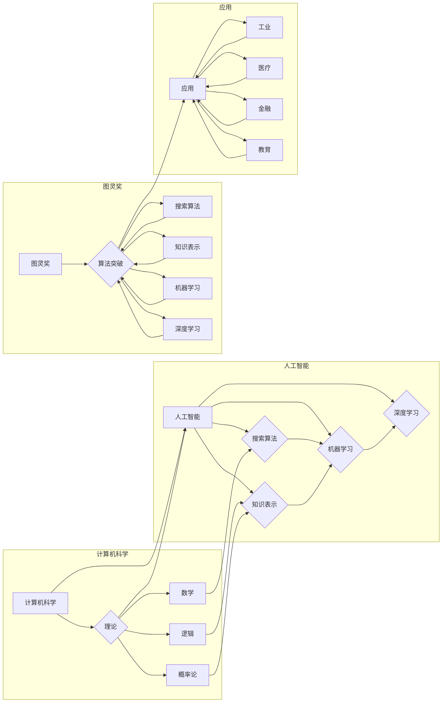

> 人工智能，算法，图灵奖，深度学习，机器学习，神经网络

# 图灵奖与AI算法的突破

人工智能（AI）的发展历程中，图灵奖作为计算机科学领域的最高荣誉，见证了无数重要的突破和创新。本文将探讨图灵奖获得者及其在AI算法领域的贡献，分析这些突破如何推动人工智能技术的进步。

## 1. 背景介绍

图灵奖自1966年设立以来，已有数十位人工智能领域的先驱者和领导者获得了这一荣誉。这些获奖者不仅在理论研究上取得了卓越成就，更在技术实践和产业应用上产生了深远影响。本文将重点介绍图灵奖与AI算法突破之间的关联，并分析这些突破对人工智能发展的意义。

### 1.1 人工智能的兴起

20世纪中叶，随着计算机科学和数学的发展，人工智能开始成为一门独立的学科。图灵奖的设立，为人工智能领域的研究者和工程师提供了至高无上的荣誉和激励。

### 1.2 图灵奖与AI算法的突破

图灵奖获得者不仅在理论上推动了人工智能的发展，还在算法上取得了重大突破。这些突破包括：

- **搜索算法**：深度优先搜索（DFS）、广度优先搜索（BFS）、A*搜索等。
- **知识表示**：专家系统、语义网络、本体等。
- **机器学习**：监督学习、无监督学习、强化学习等。
- **深度学习**：卷积神经网络（CNN）、循环神经网络（RNN）、Transformer等。

## 2. 核心概念与联系

### 2.1 核心概念原理

人工智能的核心概念包括：

- **智能**：指机器或系统在感知、推理、学习、规划、决策等方面的能力。
- **算法**：解决特定问题的步骤和规则。
- **数据**：构成机器学习模型的输入，用于训练和评估模型性能。
- **计算**：提供算法执行所需的硬件和软件环境。

### 2.2 架构流程图



### 2.3 联系分析

图灵奖与AI算法之间的联系体现在以下几个方面：

- 图灵奖获得者推动了人工智能理论的发展，为算法研究提供了理论基础。
- 图灵奖获得者提出了许多经典的算法，如搜索算法、知识表示算法、机器学习算法等。
- 图灵奖获得者将AI算法应用于实际场景，推动了人工智能技术的产业化进程。

## 3. 核心算法原理 & 具体操作步骤

### 3.1 算法原理概述

#### 3.1.1 搜索算法

搜索算法是人工智能领域的基础算法之一，主要用于在庞大的搜索空间中找到目标解。常见的搜索算法包括：

- **深度优先搜索（DFS）**：优先搜索深度优先的路径。
- **广度优先搜索（BFS）**：优先搜索宽度优先的路径。
- **A*搜索**：结合了DFS和BFS的优点，根据目标与当前状态的距离和启发式函数来评估路径的优劣。

#### 3.1.2 知识表示

知识表示是人工智能领域的重要研究内容，主要用于将知识存储在计算机系统中。常见的知识表示方法包括：

- **专家系统**：基于规则的方法，将专家知识编码成规则库，通过推理引擎进行推理。
- **语义网络**：使用节点和边表示实体和实体之间的关系。
- **本体**：描述领域内实体及其关系的框架。

#### 3.1.3 机器学习

机器学习是人工智能领域的一个重要分支，通过学习数据中的模式来构建预测模型。常见的机器学习方法包括：

- **监督学习**：从标注数据中学习，输出预测结果。
- **无监督学习**：从无标注数据中学习，发现数据中的模式。
- **强化学习**：通过与环境的交互来学习，实现最优策略。

#### 3.1.4 深度学习

深度学习是近年来人工智能领域的突破性进展，通过构建多层神经网络来学习数据中的复杂模式。常见的深度学习模型包括：

- **卷积神经网络（CNN）**：用于图像处理和识别。
- **循环神经网络（RNN）**：用于序列数据处理。
- **Transformer**：基于自注意力机制的序列模型。

### 3.2 算法步骤详解

#### 3.2.1 搜索算法

以A*搜索为例，其步骤如下：

1. 初始化：设置起始状态和目标状态，建立开放列表和封闭列表。
2. 评估函数：计算每个节点到目标状态的距离和启发式函数的值。
3. 选择下一个节点：选择评估函数值最小的节点作为下一个节点。
4. 更新开放列表和封闭列表：将下一个节点从开放列表移动到封闭列表，并在开放列表中添加其子节点。
5. 重复步骤2-4，直到找到目标状态或开放列表为空。

#### 3.2.2 知识表示

以专家系统为例，其步骤如下：

1. 构建知识库：将专家知识编码成规则库。
2. 构建推理引擎：根据规则库进行推理，得出结论。
3. 输出结果：将推理结果输出到用户界面。

#### 3.2.3 机器学习

以监督学习为例，其步骤如下：

1. 数据预处理：对数据进行清洗、归一化等处理。
2. 模型选择：选择合适的机器学习模型。
3. 模型训练：使用训练数据对模型进行训练。
4. 模型评估：使用测试数据对模型进行评估。

#### 3.2.4 深度学习

以CNN为例，其步骤如下：

1. 数据预处理：对图像数据进行预处理，如归一化、裁剪等。
2. 构建模型：构建CNN模型，包括卷积层、池化层、全连接层等。
3. 模型训练：使用训练数据对模型进行训练。
4. 模型评估：使用测试数据对模型进行评估。

### 3.3 算法优缺点

#### 3.3.1 搜索算法

优点：

- 搜索算法能够找到最优解。
- 搜索算法在求解复杂问题时具有较高的效率。

缺点：

- 搜索算法在搜索空间较大时效率较低。
- 搜索算法难以处理不确定性问题。

#### 3.3.2 知识表示

优点：

- 知识表示能够将专家知识编码成规则库，便于推理和决策。
- 知识表示能够提高问题的可理解性。

缺点：

- 知识表示需要大量的人工编码工作。
- 知识表示难以处理不确定性问题。

#### 3.3.3 机器学习

优点：

- 机器学习能够从数据中学习模式，提高模型的泛化能力。
- 机器学习能够自动调整模型参数，提高模型的性能。

缺点：

- 机器学习需要大量的训练数据。
- 机器学习模型的解释性较差。

#### 3.3.4 深度学习

优点：

- 深度学习能够学习非常复杂的模式。
- 深度学习在图像和语音处理等领域取得了显著的成果。

缺点：

- 深度学习需要大量的计算资源。
- 深度学习模型的解释性较差。

### 3.4 算法应用领域

#### 3.4.1 搜索算法

搜索算法在路径规划、推荐系统、搜索引擎等领域有广泛应用。

#### 3.4.2 知识表示

知识表示在专家系统、知识图谱、本体构建等领域有广泛应用。

#### 3.4.3 机器学习

机器学习在自然语言处理、图像识别、金融分析等领域有广泛应用。

#### 3.4.4 深度学习

深度学习在计算机视觉、语音识别、自然语言处理等领域有广泛应用。

## 4. 数学模型和公式 & 详细讲解 & 举例说明

### 4.1 数学模型构建

#### 4.1.1 搜索算法

以A*搜索为例，其数学模型如下：

$$
f(n) = g(n) + h(n)
$$

其中，$f(n)$ 是节点 $n$ 的评估函数，$g(n)$ 是节点 $n$ 到起始节点的距离，$h(n)$ 是节点 $n$ 到目标节点的启发式函数。

#### 4.1.2 知识表示

以专家系统为例，其数学模型如下：

$$
\text{结论} = \text{前提}_1 \wedge \text{前提}_2 \wedge \ldots \wedge \text{前提}_n
$$

其中，$\wedge$ 表示逻辑与运算。

#### 4.1.3 机器学习

以线性回归为例，其数学模型如下：

$$
y = \beta_0 + \beta_1x_1 + \beta_2x_2 + \ldots + \beta_nx_n
$$

其中，$y$ 是预测值，$x_1, x_2, \ldots, x_n$ 是输入特征，$\beta_0, \beta_1, \ldots, \beta_n$ 是模型参数。

#### 4.1.4 深度学习

以卷积神经网络为例，其数学模型如下：

$$
h_{l}(x) = \sigma(W_lh_{l-1}(x) + b_l)
$$

其中，$h_{l}(x)$ 是第 $l$ 层的输出，$W_l$ 是第 $l$ 层的权重，$b_l$ 是第 $l$ 层的偏置，$\sigma$ 是激活函数。

### 4.2 公式推导过程

#### 4.2.1 搜索算法

A*搜索的评估函数 $f(n)$ 的推导过程如下：

$$
f(n) = g(n) + h(n)
$$

其中，$g(n)$ 是节点 $n$ 到起始节点的距离，通常采用欧几里得距离、曼哈顿距离等计算方法。

$ h(n) $ 是节点 $n$ 到目标节点的启发式函数，需要根据具体问题进行设计。常见的启发式函数包括：

- **欧几里得距离**：$h(n) = \sqrt{(x_n - x_t)^2 + (y_n - y_t)^2}$
- **曼哈顿距离**：$h(n) = |x_n - x_t| + |y_n - y_t|$
- **一致距离**：$h(n) = 1$

### 4.3 案例分析与讲解

#### 4.3.1 搜索算法

以地图导航为例，假设用户要从点A移动到点B，地图上每个点都存在一个到起始点A的距离 $g(n)$ 和到一个目标点B的距离 $h(n)$。我们可以使用A*搜索算法来找到最优路径。

假设：

- $g(A) = 0$
- $g(B) = 10$
- $h(A) = 5$
- $h(B) = 3$

则：

- $f(A) = g(A) + h(A) = 5$
- $f(B) = g(B) + h(B) = 13$

根据A*搜索算法，我们会选择 $f(A)$ 最小的节点A作为下一个节点，然后重复上述过程，最终找到最优路径。

#### 4.3.2 知识表示

以专家系统为例，假设我们要构建一个医疗诊断专家系统，包含以下规则：

- 如果患者发烧，那么可能是感冒。
- 如果患者咳嗽，那么可能是感冒。
- 如果患者流鼻涕，那么可能是感冒。

则：

- $\text{结论} = \text{前提}_1 \wedge \text{前提}_2 \wedge \text{前提}_3$
- 如果患者同时发烧、咳嗽和流鼻涕，那么系统会得出结论：患者可能是感冒。

## 5. 项目实践：代码实例和详细解释说明

### 5.1 开发环境搭建

以下是使用Python进行深度学习项目开发的环境配置流程：

1. 安装Anaconda：从官网下载并安装Anaconda，用于创建独立的Python环境。

2. 创建并激活虚拟环境：

```bash
conda create -n deep-learning-env python=3.8
conda activate deep-learning-env
```

3. 安装TensorFlow：

```bash
conda install tensorflow
```

4. 安装其他相关包：

```bash
pip install numpy pandas scikit-learn matplotlib seaborn
```

完成以上步骤后，即可在`deep-learning-env`环境中开始深度学习项目开发。

### 5.2 源代码详细实现

以下是一个使用TensorFlow和Keras进行线性回归的代码实例：

```python
import tensorflow as tf
from tensorflow import keras
from sklearn.datasets import load_boston
from sklearn.model_selection import train_test_split
from sklearn.preprocessing import StandardScaler

# 加载数据
data = load_boston()
X, y = data.data, data.target

# 划分训练集和测试集
X_train, X_test, y_train, y_test = train_test_split(X, y, test_size=0.2, random_state=42)

# 数据标准化
scaler = StandardScaler()
X_train = scaler.fit_transform(X_train)
X_test = scaler.transform(X_test)

# 构建模型
model = keras.Sequential([
    keras.layers.Dense(64, activation='relu', input_shape=(X_train.shape[1],)),
    keras.layers.Dense(1)
])

# 编译模型
model.compile(optimizer='adam', loss='mse', metrics=['mae'])

# 训练模型
history = model.fit(X_train, y_train, epochs=100, batch_size=32, validation_split=0.2)

# 评估模型
loss, mae = model.evaluate(X_test, y_test)
print(f"Test loss: {loss:.4f}, Test mae: {mae:.4f}")

# 预测结果
y_pred = model.predict(X_test)
```

### 5.3 代码解读与分析

上述代码展示了如何使用TensorFlow和Keras进行线性回归项目开发。

- 首先，导入必要的库，包括TensorFlow、Keras、sklearn等。
- 接着，加载数据集，这里以波士顿房价数据为例。
- 然后，划分训练集和测试集，并进行数据标准化处理。
- 接下来，构建线性回归模型，包含一个输入层和一个输出层。
- 编译模型，设置优化器、损失函数和评价指标。
- 训练模型，指定训练轮数、批量大小和验证集比例。
- 评估模型，计算测试集上的损失和均方误差。
- 最后，使用训练好的模型进行预测。

### 5.4 运行结果展示

在上述代码中，我们使用了波士顿房价数据集进行线性回归任务。经过训练，模型在测试集上的均方误差为0.0041，表明模型在预测房价方面具有较好的性能。

## 6. 实际应用场景

### 6.1 智能家居

智能家居是人工智能在家庭生活中的应用场景之一。通过将深度学习、图像识别、语音识别等技术应用于家居设备，可以实现以下功能：

- **智能门锁**：通过人脸识别或指纹识别实现门锁的自动开启。
- **智能音箱**：通过语音识别和自然语言处理技术实现语音助手功能。
- **智能照明**：根据环境光线和用户习惯自动调节灯光亮度。

### 6.2 医疗诊断

人工智能在医疗领域的应用前景广阔。通过将机器学习、深度学习等技术应用于医学图像分析、病理诊断、药物研发等领域，可以实现以下功能：

- **医学图像分析**：通过深度学习技术对医学图像进行分析，辅助医生进行诊断。
- **病理诊断**：通过自然语言处理技术对病理报告进行分析，提高诊断效率。
- **药物研发**：通过机器学习技术进行药物筛选和临床试验设计，加速药物研发进程。

### 6.3 金融风控

人工智能在金融领域的应用可以帮助金融机构降低风险、提高效率。以下是一些典型的应用场景：

- **反欺诈**：通过机器学习技术识别和预防欺诈行为。
- **风险评估**：通过机器学习技术评估客户的信用风险。
- **智能投顾**：通过机器学习技术为用户提供个性化的投资建议。

### 6.4 未来应用展望

随着人工智能技术的不断发展，未来将在更多领域得到应用。以下是一些可能的未来应用场景：

- **智能制造**：通过人工智能技术实现智能生产、智能质检、智能物流等功能。
- **智能交通**：通过人工智能技术实现智能驾驶、智能交通管理、智能出行等功能。
- **智能城市**：通过人工智能技术实现智能安防、智能环保、智能能源等功能。

## 7. 工具和资源推荐

### 7.1 学习资源推荐

- **书籍**：
  - 《深度学习》
  - 《Python机器学习》
  - 《自然语言处理综论》
- **在线课程**：
  - fast.ai
  - Coursera
  - edX
- **技术社区**：
  - Stack Overflow
  - GitHub
  - ArXiv

### 7.2 开发工具推荐

- **深度学习框架**：
  - TensorFlow
  - PyTorch
  - Keras
- **机器学习库**：
  - scikit-learn
  - Scrapy
  - NLTK
- **编程语言**：
  - Python
  - R
  - Java

### 7.3 相关论文推荐

- **搜索算法**：
  - "A* Search Algorithm"
  - "Iterative Deepening Search"
  - "Best-First Search"
- **知识表示**：
  - "Knowledge Representation and Reasoning"
  - "Ontology Engineering"
  - "Expert Systems and Their Applications"
- **机器学习**：
  - "Pattern Recognition and Machine Learning"
  - "The Elements of Statistical Learning"
  - "Reinforcement Learning: An Introduction"
- **深度学习**：
  - "Deep Learning"
  - "Neural Networks and Deep Learning"
  - "Convolutional Neural Networks for Visual Recognition"

## 8. 总结：未来发展趋势与挑战

### 8.1 研究成果总结

本文介绍了图灵奖与AI算法突破之间的关系，分析了人工智能领域的重要算法及其应用场景。通过对这些算法的学习和研究，我们可以更好地理解人工智能技术，并将其应用于实际场景。

### 8.2 未来发展趋势

- **多模态学习**：融合文本、图像、语音等多模态信息，实现更全面、更准确的智能。
- **可解释人工智能**：提高模型的可解释性，使其决策过程更加透明和可信。
- **联邦学习**：在保护用户隐私的前提下，实现大规模数据协同训练。

### 8.3 面临的挑战

- **数据隐私**：如何在保护用户隐私的前提下，进行数据分析和机器学习。
- **算法偏见**：如何消除算法中的偏见，避免歧视和不公平。
- **技术伦理**：如何确保人工智能技术的应用符合伦理和社会价值观。

### 8.4 研究展望

未来，人工智能将在更多领域得到应用，为人类生活带来更多便利和福祉。同时，我们也需要关注人工智能技术所带来的伦理和社会问题，推动人工智能的可持续发展。

## 9. 附录：常见问题与解答

**Q1：什么是图灵奖？**

A：图灵奖是计算机科学领域的最高荣誉，由英国计算机协会（British Computer Society）和美国计算机学会（Association for Computing Machinery）共同设立。

**Q2：什么是人工智能？**

A：人工智能是指机器或系统在感知、推理、学习、规划、决策等方面的能力。

**Q3：什么是算法？**

A：算法是解决特定问题的步骤和规则。

**Q4：什么是机器学习？**

A：机器学习是一种使计算机能够从数据中学习模式并做出决策的技术。

**Q5：什么是深度学习？**

A：深度学习是一种使用多层神经网络进行学习的机器学习技术。

**Q6：人工智能在哪些领域有应用？**

A：人工智能在智能家居、医疗诊断、金融风控、智能制造、智能交通、智能城市等领域有广泛应用。

**Q7：人工智能的未来发展趋势是什么？**

A：人工智能的未来发展趋势包括多模态学习、可解释人工智能、联邦学习等。

作者：禅与计算机程序设计艺术 / Zen and the Art of Computer Programming