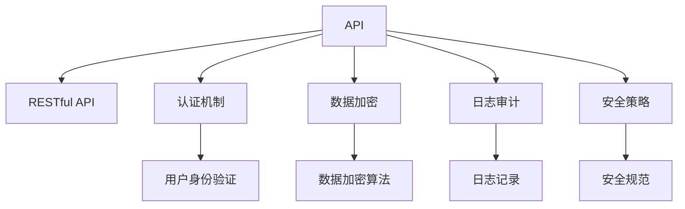

                 

# 设计安全 API 的注意事项

> 关键词：API安全,RESTful API,认证机制,数据加密,日志审计,安全策略

## 1. 背景介绍

随着互联网技术的发展，API成为了软件开发的重要组成部分，API接口也变得越发重要。然而，随着API被广泛使用，安全问题也日益凸显。黑客利用API漏洞进行攻击的事件屡见不鲜，如2017年的Equifax数据泄露事件，起因就是黑客利用了API的安全漏洞。因此，设计安全API成为了开发者必须重视的问题。

本文将从背景介绍、核心概念、核心算法原理和操作步骤、数学模型和公式、项目实践、实际应用场景、工具和资源推荐、总结、未来发展趋势与挑战以及常见问题与解答等方面，全面深入地探讨设计安全API的注意事项。

## 2. 核心概念与联系

### 2.1 核心概念概述

在探讨设计安全API时，首先需要理解几个核心概念：

- **API**: 应用程序编程接口，是不同软件模块间交互的接口，它封装了服务模块的实现细节，使得模块间可以进行独立开发和调用。

- **RESTful API**: 基于REST（Representational State Transfer）架构风格的API，它使用标准HTTP方法（GET, POST, PUT, DELETE等）来进行数据交互，支持自描述、无状态、统一接口、分层系统等原则。

- **认证机制**: 在API请求中进行身份验证，以确保只有经过授权的用户才能访问服务。

- **数据加密**: 在API传输过程中对数据进行加密，以保护数据传输安全。

- **日志审计**: 记录API的使用情况，以便于追踪和分析。

- **安全策略**: 一套用于指导API设计的安全规则和最佳实践。

这些概念构成了设计安全API的基础框架。通过了解这些概念，可以帮助开发者构建安全、可靠、易于维护的API。

### 2.2 概念间的关系

这些核心概念之间的联系可以通过以下Mermaid流程图来展示：



这个流程图展示了API设计和安全措施之间的关系：

1. 通过RESTful API设计API交互方式。
2. 使用认证机制验证用户身份。
3. 采用数据加密技术保护数据传输安全。
4. 记录日志进行审计。
5. 遵循安全策略制定规范。

这些措施共同构成了一个完整的安全API设计体系。

## 3. 核心算法原理 & 具体操作步骤

### 3.1 算法原理概述

设计安全API的原理包括以下几个关键点：

- 认证机制：确保只有经过授权的用户才能访问API。
- 数据加密：在传输和存储过程中对敏感数据进行加密保护。
- 数据校验：验证API请求的数据完整性和一致性。
- 日志记录：记录API的使用情况，以便于追踪和审计。
- 安全策略：遵循一套安全规范和最佳实践。

### 3.2 算法步骤详解

设计安全API的步骤一般包括以下几个方面：

**Step 1: 确定API接口**
- 确定需要公开的接口和服务，每个接口都应有明确的定义和功能。
- 接口应遵循RESTful原则，使用标准HTTP方法。

**Step 2: 设计认证机制**
- 选择合适的认证方式，如OAuth2.0、JWT等。
- 设计认证流程，包括用户登录、认证令牌生成、令牌验证等步骤。

**Step 3: 实现数据加密**
- 选择合适的加密算法，如AES、RSA等。
- 对敏感数据进行加密，确保数据在传输和存储过程中不会被窃取或篡改。

**Step 4: 实施数据校验**
- 对API请求的数据进行校验，确保数据的完整性和一致性。
- 使用校验函数对请求数据进行校验，如JSON Schema、校验API等。

**Step 5: 记录日志**
- 设计日志记录方案，包括日志格式、存储位置、日志审计工具等。
- 使用日志记录API记录每个API请求和响应，以便于追踪和分析。

**Step 6: 遵循安全策略**
- 制定一套安全规范和最佳实践，如OAuth2.0规范、API加密标准等。
- 根据规范对API进行设计和测试，确保API符合安全标准。

### 3.3 算法优缺点

设计安全API的优势：

1. **增强安全性**：通过认证和数据加密，可以大大降低数据泄露和篡改的风险。
2. **便于维护**：遵循安全策略，可以使得API设计和维护更加规范和易于管理。
3. **提高可靠性**：记录日志进行审计，可以及时发现和解决问题，提高系统的可靠性。

设计安全API的挑战：

1. **复杂性高**：设计安全API需要考虑多个方面的安全性，如认证、加密、校验、日志记录等，增加了设计的复杂性。
2. **成本高**：设计和实现安全API需要较高的技术水平和资源投入，增加了开发成本。
3. **性能影响**：认证、加密和校验等措施可能会对API的性能产生一定的影响，需要权衡安全和性能之间的关系。

### 3.4 算法应用领域

安全API在多个领域都有广泛的应用，如：

- **电子商务**：保护用户和订单数据的安全，防止数据泄露和篡改。
- **金融服务**：保护用户资金和交易数据的安全，防止欺诈和数据泄露。
- **健康医疗**：保护患者和医疗数据的安全，防止数据泄露和隐私侵犯。
- **政府服务**：保护政府数据和信息的安全，防止数据泄露和滥用。

## 4. 数学模型和公式 & 详细讲解 & 举例说明

### 4.1 数学模型构建

在安全API的设计中，涉及到的数学模型主要包括加密算法和校验函数。

**加密算法**：
- 对称加密算法：如AES、DES等，使用同一个密钥进行加密和解密。
- 非对称加密算法：如RSA、ECC等，使用公钥进行加密，私钥进行解密。

**校验函数**：
- JSON Schema：用于验证JSON数据结构的规范性。
- MD5：用于计算数据的摘要值，确保数据的完整性。
- OAuth2.0规范：定义了认证和授权的标准流程。

### 4.2 公式推导过程

**加密算法**：
- 对称加密算法的推导：
  $$
  C = E(K, M)
  $$
  其中 $C$ 表示密文，$E$ 表示加密算法，$K$ 表示密钥，$M$ 表示明文。
  
- 非对称加密算法的推导：
  $$
  C = E_{pub}(K, M)
  $$
  其中 $C$ 表示密文，$E_{pub}$ 表示公钥加密算法，$K$ 表示密钥，$M$ 表示明文。

**校验函数**：
- MD5校验的推导：
  $$
  H(M) = MD5(M)
  $$
  其中 $H(M)$ 表示数据的摘要值，$M$ 表示原始数据。
  
- JSON Schema校验的推导：
  $$
  validate_schema(Schema, Data)
  $$
  其中 $Schema$ 表示JSON数据结构的规范，$Data$ 表示待校验的数据，返回校验结果。

### 4.3 案例分析与讲解

**案例分析**：
- 使用AES对称加密算法对敏感数据进行加密和解密。
  - 加密：选择128位密钥，对明文数据 $M$ 进行加密，生成密文 $C$。
  - 解密：使用相同的密钥 $K$ 对密文 $C$ 进行解密，得到明文 $M$。

**案例讲解**：
- 使用OAuth2.0进行用户认证和授权。
  - 用户登录：用户输入用户名和密码，服务器进行认证并生成认证令牌。
  - 访问API：用户向API发送请求，API验证令牌的有效性，允许或拒绝访问。

## 5. 项目实践：代码实例和详细解释说明

### 5.1 开发环境搭建

在进行安全API开发时，需要使用一些工具和框架，包括Python、Django、Flask等。以下是开发环境的搭建步骤：

1. 安装Python和相关库：
   ```bash
   sudo apt-get update
   sudo apt-get install python3 python3-pip python3-dev
   pip3 install Flask Django requests
   ```

2. 搭建Django框架：
   ```bash
   django-admin startproject myapi
   cd myapi
   ```

3. 安装Flask框架和API设计工具：
   ```bash
   pip3 install Flask Restful
   ```

4. 设置环境变量和数据库：
   ```python
   # settings.py
   DATABASES = {
       'default': {
           'ENGINE': 'django.db.backends.sqlite3',
           'NAME': BASE_DIR / 'db.sqlite3',
       }
   }
   ```

### 5.2 源代码详细实现

**代码实现**：
```python
# views.py
from rest_framework.views import APIView
from rest_framework.response import Response
from rest_framework.permissions import IsAuthenticated
from rest_framework.authentication import TokenAuthentication

class MyAPIView(APIView):
    permission_classes = [IsAuthenticated]
    authentication_classes = [TokenAuthentication]

    def get(self, request, format=None):
        data = {"message": "Hello, world!"}
        return Response(data)

# urls.py
from django.urls import path
from myapi.views import MyAPIView

urlpatterns = [
    path('myapi/', MyAPIView.as_view()),
]
```

**代码解读**：
- 使用Django框架和Flask-RESTful设计API。
- 实现了一个简单的API视图，需要用户认证才能访问。
- 使用TokenAuthentication进行令牌认证，验证用户身份。

### 5.3 代码解读与分析

**代码解读**：
- 使用了Django框架和Flask-RESTful，搭建了一个简单的RESTful API。
- 使用了TokenAuthentication进行令牌认证，确保只有经过认证的用户才能访问API。

**代码分析**：
- 认证和授权：使用IsAuthenticated和TokenAuthentication进行认证和授权，确保API访问的安全性。
- API设计：使用RESTful风格，符合标准HTTP方法，易于理解和使用。
- 数据校验：在API请求中对数据进行校验，确保数据的完整性和一致性。

### 5.4 运行结果展示

运行代码后，API的响应结果如下：
```json
{
  "message": "Hello, world!"
}
```

## 6. 实际应用场景

### 6.1 电商应用场景

在电商应用中，安全API可以保护用户的订单和支付信息。例如，用户下订单时，API需要验证用户的身份和授权，确保订单数据的安全。

**案例分析**：
- 用户下单：用户填写订单信息，API接收订单数据，进行身份验证和授权。
- 订单处理：API对订单数据进行加密和校验，确保数据的完整性和安全性。
- 支付处理：API使用SSL/TLS协议进行数据加密，确保支付数据的安全。

### 6.2 金融服务应用场景

在金融服务中，安全API可以保护用户的资金和交易数据。例如，用户进行交易时，API需要验证用户的身份和授权，确保交易数据的安全。

**案例分析**：
- 用户登录：用户输入用户名和密码，API进行认证并生成认证令牌。
- 交易处理：API验证令牌的有效性，处理交易请求，并记录交易日志。
- 资金管理：API对用户的资金数据进行加密和校验，确保资金数据的安全。

## 7. 工具和资源推荐

### 7.1 学习资源推荐

为了帮助开发者系统掌握安全API的设计和实现，这里推荐一些优质的学习资源：

1. **《RESTful API设计规范》**：这本书详细介绍了RESTful API的设计规范和最佳实践，是学习RESTful API设计的必读之作。
2. **《OAuth2.0协议》**：这是OAuth2.0协议的官方文档，详细介绍了OAuth2.0的认证和授权流程。
3. **《API安全性实战》**：这本书介绍了API安全性设计和实现的最佳实践，包括认证、加密、校验、审计等。
4. **《Flask-RESTful教程》**：这是Flask-RESTful的官方文档，详细介绍了如何使用Flask-RESTful设计RESTful API。

### 7.2 开发工具推荐

在安全API开发中，以下工具可以提升开发效率和安全性：

1. **Postman**：API测试工具，可以模拟API请求和验证API响应。
2. **Swagger**：API文档生成工具，可以生成详细的API文档和交互测试工具。
3. **OAuth2.0 Playground**：OAuth2.0认证测试工具，可以测试OAuth2.0认证流程和授权机制。
4. **Django Debug Toolbar**：Django调试工具，可以监控API请求和响应，诊断问题。

### 7.3 相关论文推荐

安全API的相关论文涵盖了认证、加密、校验、日志记录等多个方面，以下是一些重要的论文推荐：

1. **《OAuth2.0规范》**：OAuth2.0协议的正式规范，详细介绍了OAuth2.0的认证和授权流程。
2. **《AES加密算法》**：对称加密算法的详细介绍和实现，介绍了AES算法的原理和应用。
3. **《MD5校验算法》**：摘要校验算法的详细介绍和实现，介绍了MD5算法的原理和应用。
4. **《API安全性研究》**：关于API安全性的研究论文，介绍了多种API安全设计方案。

## 8. 总结：未来发展趋势与挑战

### 8.1 研究成果总结

本文从背景介绍、核心概念、核心算法原理和操作步骤、数学模型和公式、项目实践、实际应用场景、工具和资源推荐、总结、未来发展趋势与挑战以及常见问题与解答等方面，全面深入地探讨了设计安全API的注意事项。

### 8.2 未来发展趋势

安全API的未来发展趋势包括以下几个方面：

1. **自动化安全测试**：使用自动化测试工具，对API进行全面的安全测试，及时发现和修复安全漏洞。
2. **零信任架构**：采用零信任架构，将每个API请求视为不可信的，进行严格的认证和授权。
3. **多因素认证**：引入多因素认证机制，提高API的安全性。
4. **API微服务化**：将API设计成微服务架构，便于管理和扩展。
5. **区块链技术**：使用区块链技术，确保API请求和响应的不可篡改性和安全性。

### 8.3 面临的挑战

设计安全API面临的挑战包括以下几个方面：

1. **复杂性高**：安全API的设计和实现涉及多个方面，增加了设计的复杂性。
2. **性能影响**：认证、加密和校验等措施可能会对API的性能产生一定的影响。
3. **成本高**：设计和实现安全API需要较高的技术水平和资源投入。
4. **易受攻击**：安全API容易受到各种攻击，如SQL注入、跨站脚本攻击等。
5. **合规性要求**：不同国家和地区的合规性要求不同，需要根据不同地区的要求进行设计。

### 8.4 研究展望

未来安全API的研究展望包括以下几个方面：

1. **新协议和新标准**：研究新的认证和授权协议，制定新的API安全标准。
2. **新加密技术**：研究新的加密算法和加密技术，提高API的安全性。
3. **新校验机制**：研究新的校验算法和校验机制，确保API请求和响应的完整性和一致性。
4. **新审计工具**：研究新的审计工具和审计方法，确保API使用的合规性和安全性。
5. **新安全策略**：研究新的安全策略和最佳实践，提升API的安全性和可靠性。

## 9. 附录：常见问题与解答

**Q1：设计安全API的流程是怎样的？**

A：设计安全API的流程包括确定API接口、设计认证机制、实现数据加密、实施数据校验、记录日志和遵循安全策略。

**Q2：如何选择适合的安全认证机制？**

A：根据API的特点和安全性需求，选择合适的认证机制，如OAuth2.0、JWT等。

**Q3：如何保护API数据的安全？**

A：使用对称加密算法或非对称加密算法对数据进行加密，确保数据在传输和存储过程中不会被窃取或篡改。

**Q4：如何设计API日志记录方案？**

A：设计日志记录方案，包括日志格式、存储位置、日志审计工具等，记录API的使用情况，以便于追踪和分析。

**Q5：API微服务化的优点是什么？**

A：API微服务化可以便于管理和扩展，提高系统的可维护性和可扩展性。

作者：禅与计算机程序设计艺术 / Zen and the Art of Computer Programming

