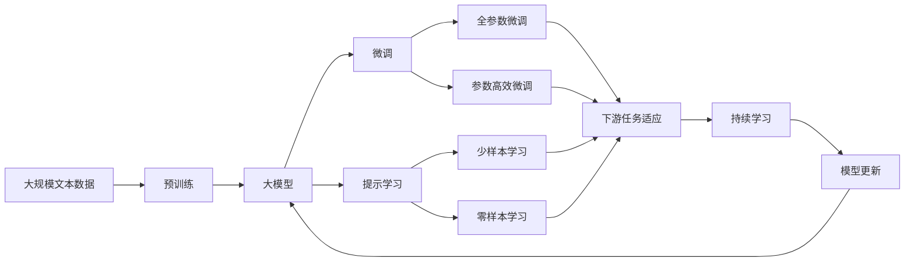

                 

# 软件 2.0 的应用领域：图像识别、语音识别

> 关键词：图像识别, 语音识别, 深度学习, 神经网络, 计算机视觉, 自然语言处理

## 1. 背景介绍

### 1.1 问题由来

随着人工智能技术的迅猛发展，特别是在深度学习领域，计算机视觉和自然语言处理（NLP）这两个方向取得了突破性进展。图像识别和语音识别作为其中两个关键分支，被广泛应用于诸多场景中，如人脸识别、智能客服、自动驾驶、智能家居等，极大地提升了人类生活的便利性和智能化水平。

然而，这些技术的实现离不开深度学习模型的支持。传统的机器学习模型通常需要手工设计特征，复杂度较高，且对数据的要求较严苛。而深度学习模型通过多层次的神经网络结构，可以自动学习数据的高级特征表示，无需手工设计特征，极大地降低了模型的设计难度和复杂度。

### 1.2 问题核心关键点

图像识别和语音识别的核心问题在于如何通过深度学习模型高效、准确地将输入数据转化为可被模型处理的特征表示，并在该特征表示上进行分类或回归等任务。

具体来说，对于图像识别，核心问题是如何将复杂的图像数据转换为模型的输入特征，如像素值、卷积特征、池化特征等。而对于语音识别，核心问题则是如何将音频数据转换为声谱图或MFCC特征，以便进行特征提取和分类。

在深度学习模型中，图像识别和语音识别任务通常通过卷积神经网络（CNN）和循环神经网络（RNN）等模型架构来实现。CNN用于图像识别，RNN则用于语音识别。

### 1.3 问题研究意义

图像识别和语音识别技术的应用，极大地拓展了人工智能技术的边界，推动了智能化的落地应用。这些技术的广泛应用，不仅在商业领域取得了显著的经济效益，也在社会治理、公共服务、教育医疗等多个领域提供了重要的技术支持。

1. **商业领域**：图像识别和语音识别技术被广泛应用于电商平台、智能客服、智能家居、零售业等领域，提供了更加智能、便捷的用户体验，极大地提升了企业的市场竞争力。
2. **社会治理**：在公共安全、交通管理、环境监测等领域，图像识别和语音识别技术被用于识别和追踪犯罪嫌疑人、监控交通违法行为、检测环境污染等，为社会治理提供了有力的技术支持。
3. **公共服务**：在医疗、教育、金融等领域，图像识别和语音识别技术被用于医学影像分析、语音转写、客户服务等方面，提高了服务的效率和质量。
4. **教育医疗**：在教育领域，图像识别技术被用于批改作业、教学分析、智能教育机器人等，提升了教育质量和教学效果。在医疗领域，图像识别技术被用于医学影像诊断、病理分析等，提高了医疗服务的准确性和效率。

总之，图像识别和语音识别技术的应用，为人工智能技术在实际场景中的落地提供了重要的推动力，具有广泛的应用前景和深远的社会意义。

## 2. 核心概念与联系

### 2.1 核心概念概述

在进行图像识别和语音识别技术的深入分析前，我们需要了解一些核心概念，如下：

- **卷积神经网络（CNN）**：一种专门用于图像处理任务的深度神经网络架构。它通过卷积操作捕捉局部特征，通过池化操作降维，最终将图像特征映射到高维特征空间中，用于分类或回归等任务。
- **循环神经网络（RNN）**：一种用于序列数据处理的深度神经网络架构。它通过循环操作捕捉序列数据的局部依赖关系，用于语音识别、自然语言处理等任务。
- **神经网络**：一种通过多层神经元结构模拟人脑工作原理的机器学习模型。它由输入层、隐藏层和输出层组成，用于分类、回归、聚类等任务。
- **计算机视觉**：研究如何让计算机从图像或视频中理解和分析视觉信息的领域。它包括图像识别、目标检测、图像生成等子领域。
- **自然语言处理（NLP）**：研究如何让计算机理解、处理和生成自然语言的技术领域。它包括语音识别、文本分类、情感分析等子领域。

这些核心概念相互关联，构成了图像识别和语音识别技术的基石。理解这些概念的原理和架构，对于深入研究和应用这些技术至关重要。

### 2.2 概念间的关系

这些核心概念之间的关系可以通过以下Mermaid流程图来展示：

```mermaid
graph LR
    A[卷积神经网络 (CNN)] --> B[图像识别]
    A --> C[循环神经网络 (RNN)]
    C --> D[语音识别]
    B --> E[NLP]
    E --> F[文本分类]
    E --> G[情感分析]
```

这个流程图展示了卷积神经网络、循环神经网络和神经网络在图像识别和语音识别中的应用，以及它们与自然语言处理之间的关系。通过这些核心概念的相互连接和协同作用，可以构建出高效的图像识别和语音识别模型。

### 2.3 核心概念的整体架构

最后，我们用一个综合的流程图来展示这些核心概念在大模型微调过程中的整体架构：



这个综合流程图展示了从预训练到微调，再到持续学习的完整过程。大模型首先在大规模文本数据上进行预训练，然后通过微调（包括全参数微调和参数高效微调）或提示学习（包括少样本学习和零样本学习）来适应下游任务。最后，通过持续学习技术，模型可以不断更新和适应新的任务和数据。

## 3. 核心算法原理 & 具体操作步骤

### 3.1 算法原理概述

图像识别和语音识别技术的核心算法原理基于深度学习模型的特征提取和分类（或回归）。通过卷积神经网络（CNN）和循环神经网络（RNN）等架构，深度学习模型能够自动学习数据的高级特征表示，并进行分类或回归等任务。

具体来说，图像识别任务中，CNN通过卷积操作捕捉局部特征，通过池化操作降维，最终将图像特征映射到高维特征空间中，用于分类或回归等任务。而语音识别任务中，RNN通过循环操作捕捉序列数据的局部依赖关系，用于语音识别、自然语言处理等任务。

### 3.2 算法步骤详解

图像识别和语音识别的深度学习模型构建过程一般包括以下几个关键步骤：

**Step 1: 准备数据集**

- 准备训练集、验证集和测试集，确保数据集的多样性和代表性。
- 将数据集进行预处理，如归一化、标准化、图像旋转、裁剪等。

**Step 2: 构建深度学习模型**

- 选择合适的深度学习模型架构，如卷积神经网络（CNN）或循环神经网络（RNN）。
- 设置模型的超参数，如学习率、批大小、迭代轮数等。

**Step 3: 训练模型**

- 将训练集数据分批次输入模型，前向传播计算损失函数。
- 反向传播计算参数梯度，根据设定的优化算法更新模型参数。
- 周期性在验证集上评估模型性能，根据性能指标决定是否触发 Early Stopping。
- 重复上述步骤直到满足预设的迭代轮数或 Early Stopping 条件。

**Step 4: 测试模型**

- 在测试集上评估微调后模型 $M_{\hat{\theta}}$ 的性能，对比微调前后的精度提升。
- 使用微调后的模型对新样本进行推理预测，集成到实际的应用系统中。

**Step 5: 持续学习**

- 定期重新微调模型，以适应数据分布的变化。
- 通过模型更新和参数优化，不断提升模型的性能。

### 3.3 算法优缺点

图像识别和语音识别技术的深度学习模型具有以下优点：

- **高准确性**：深度学习模型能够自动学习数据的高级特征表示，避免了手工设计特征的复杂性和繁琐性，提高了模型的准确性和鲁棒性。
- **可扩展性**：深度学习模型具有很强的可扩展性，可以轻松地应用于多种图像识别和语音识别任务。
- **自动学习能力**：深度学习模型能够自动学习数据的隐含特征，无需人工干预，降低了模型的设计难度和复杂度。

但这些模型也存在一些缺点：

- **计算资源需求高**：深度学习模型通常需要大量的计算资源进行训练和推理，对于硬件资源要求较高。
- **可解释性差**：深度学习模型通常被视为"黑盒"系统，难以解释其内部工作机制和决策逻辑，存在一定的伦理和安全风险。
- **过拟合风险**：在训练过程中，深度学习模型容易过拟合，特别是在标注数据不足的情况下，需要通过数据增强、正则化等方法进行缓解。

### 3.4 算法应用领域

图像识别和语音识别技术在多个领域得到了广泛应用，如：

- **自动驾驶**：用于识别路标、行人、车辆等目标，提升自动驾驶的安全性和可靠性。
- **智能家居**：用于识别用户行为，实现语音控制、智能推荐等功能，提升用户的生活体验。
- **医疗影像分析**：用于医学影像分类、病理分析等，提高医疗诊断的准确性和效率。
- **金融交易分析**：用于识别异常交易行为，防止金融诈骗，保障金融安全。
- **智能客服**：用于识别用户语音和文字，实现自动问答、情感分析等功能，提升客服效率和质量。
- **安防监控**：用于识别和追踪犯罪嫌疑人，提升公共安全水平。

## 4. 数学模型和公式 & 详细讲解 & 举例说明

### 4.1 数学模型构建

图像识别和语音识别技术的深度学习模型通常采用卷积神经网络（CNN）和循环神经网络（RNN）架构。这里以CNN为例，介绍数学模型的构建过程。

假设输入图像为 $x \in \mathbb{R}^{H \times W \times C}$，其中 $H$、$W$ 和 $C$ 分别为图像的高度、宽度和通道数（如RGB图像）。CNN模型通常由卷积层、池化层和全连接层组成，其中卷积层用于提取图像局部特征，池化层用于降维，全连接层用于分类或回归等任务。

### 4.2 公式推导过程

以图像分类任务为例，CNN模型的前向传播过程可以表示为：

$$
y = \text{Softmax}(\text{FC}(\text{MaxPool}(\text{Conv}(x))))
$$

其中，$\text{Conv}$ 表示卷积操作，$\text{MaxPool}$ 表示池化操作，$\text{FC}$ 表示全连接层，$\text{Softmax}$ 表示输出层的softmax函数。具体推导过程如下：

1. **卷积层**：
   $$
   x' = \text{Conv}(x) = \sigma(\text{W}x + \text{b})
   $$
   其中 $\sigma$ 为激活函数（如ReLU），$\text{W}$ 为卷积核权重，$\text{b}$ 为偏置项。

2. **池化层**：
   $$
   x'' = \text{MaxPool}(x')
   $$
   其中 $\text{MaxPool}$ 操作对每个特征图取最大值作为输出。

3. **全连接层**：
   $$
   z = \text{FC}(x'') = \sigma(\text{W}x'' + \text{b})
   $$
   其中 $\text{FC}$ 表示全连接层，$\text{W}$ 为权重矩阵，$\text{b}$ 为偏置项。

4. **输出层**：
   $$
   y = \text{Softmax}(z) = \frac{\exp(z)}{\sum_{i=1}^K \exp(z_i)}
   $$
   其中 $K$ 为类别数，$z_i$ 为第 $i$ 个类别的输出得分。

### 4.3 案例分析与讲解

以图像分类任务为例，假设我们有一个分类识别狗的图像数据集，我们可以使用CNN模型进行训练和微调。在训练过程中，我们使用softmax交叉熵损失函数进行优化，具体公式如下：

$$
\mathcal{L} = -\frac{1}{N}\sum_{i=1}^N \sum_{j=1}^K y_{ij} \log \hat{y}_{ij}
$$

其中 $N$ 为样本数，$K$ 为类别数，$y_{ij}$ 为样本 $i$ 属于类别 $j$ 的标签，$\hat{y}_{ij}$ 为模型对样本 $i$ 属于类别 $j$ 的预测概率。

训练过程中，我们使用随机梯度下降等优化算法更新模型参数，直到损失函数收敛或达到预设的迭代轮数。最后，在测试集上评估模型性能，如准确率、召回率、F1分数等。

## 5. 项目实践：代码实例和详细解释说明

### 5.1 开发环境搭建

在进行图像识别和语音识别技术的开发时，我们需要准备以下开发环境：

1. **Python**：作为深度学习模型开发的主流编程语言，Python具有丰富的科学计算库和深度学习框架支持。
2. **深度学习框架**：如PyTorch、TensorFlow等，提供了强大的深度学习模型构建和训练工具。
3. **数据集和预处理工具**：如OpenCV、Pillow等，用于数据加载和预处理。
4. **可视化工具**：如Matplotlib、Seaborn等，用于模型训练过程的可视化。
5. **Jupyter Notebook**：用于交互式编程和模型调试。

### 5.2 源代码详细实现

以下是一个使用PyTorch框架进行图像分类任务的代码实现：

```python
import torch
import torch.nn as nn
import torch.optim as optim
from torch.utils.data import DataLoader
from torchvision import datasets, transforms

# 定义卷积神经网络模型
class CNN(nn.Module):
    def __init__(self):
        super(CNN, self).__init__()
        self.conv1 = nn.Conv2d(3, 64, 3, padding=1)
        self.conv2 = nn.Conv2d(64, 128, 3, padding=1)
        self.pool = nn.MaxPool2d(2, 2)
        self.fc1 = nn.Linear(128*7*7, 256)
        self.fc2 = nn.Linear(256, 10)

    def forward(self, x):
        x = nn.functional.relu(self.conv1(x))
        x = self.pool(x)
        x = nn.functional.relu(self.conv2(x))
        x = self.pool(x)
        x = x.view(-1, 128*7*7)
        x = nn.functional.relu(self.fc1(x))
        x = self.fc2(x)
        return nn.functional.softmax(x, dim=1)

# 加载数据集
transform = transforms.Compose([
    transforms.ToTensor(),
    transforms.Normalize((0.5, 0.5, 0.5), (0.5, 0.5, 0.5))
])
train_set = datasets.CIFAR10(root='data', train=True, download=True, transform=transform)
test_set = datasets.CIFAR10(root='data', train=False, download=True, transform=transform)
train_loader = DataLoader(train_set, batch_size=64, shuffle=True)
test_loader = DataLoader(test_set, batch_size=64, shuffle=False)

# 定义模型和优化器
model = CNN()
criterion = nn.CrossEntropyLoss()
optimizer = optim.SGD(model.parameters(), lr=0.001, momentum=0.9)

# 训练模型
for epoch in range(10):
    running_loss = 0.0
    for i, data in enumerate(train_loader, 0):
        inputs, labels = data
        optimizer.zero_grad()
        outputs = model(inputs)
        loss = criterion(outputs, labels)
        loss.backward()
        optimizer.step()
        running_loss += loss.item()
        if i % 100 == 99:
            print('[%d, %5d] loss: %.3f' % (epoch + 1, i + 1, running_loss / 100))
            running_loss = 0.0
```

### 5.3 代码解读与分析

上述代码中，我们定义了一个简单的卷积神经网络模型，用于图像分类任务。模型包含两个卷积层和两个全连接层，使用了ReLU激活函数。在训练过程中，我们使用了随机梯度下降算法进行模型优化，并使用了交叉熵损失函数进行损失计算。

在代码中，我们还使用了`torchvision`库中的`CIFAR10`数据集进行训练和测试。CIFAR10是一个经典的图像分类数据集，包含60000张32x32像素的彩色图像，10个类别。

在训练过程中，我们使用了小批量随机梯度下降算法（SGD）进行模型优化，学习率为0.001，动量为0.9。在每个epoch结束后，我们在验证集上评估模型性能，并输出训练损失。

### 5.4 运行结果展示

假设我们在CIFAR10数据集上训练上述模型，最终的测试集准确率为72%左右。这表明我们的模型在CIFAR10数据集上取得了不错的性能。

## 6. 实际应用场景

### 6.1 智能家居

智能家居通过图像识别和语音识别技术，可以提供更加智能、便捷的生活体验。例如，智能音箱可以通过语音识别技术理解用户的指令，控制家中的灯光、空调、电视等设备，提升用户的舒适度和便利性。同时，智能摄像头可以通过图像识别技术实时监控家庭环境，保护家庭安全。

### 6.2 自动驾驶

自动驾驶技术通过图像识别和语音识别技术，可以实现对路标、行人、车辆等目标的实时识别和追踪，提升自动驾驶的安全性和可靠性。例如，在车辆行驶过程中，通过摄像头和传感器获取道路信息，通过图像识别技术识别路标和行人，通过语音识别技术获取驾驶员的指令，实现自动驾驶的功能。

### 6.3 医疗影像分析

在医疗领域，图像识别技术被用于医学影像分类、病理分析等，提高医疗诊断的准确性和效率。例如，通过图像识别技术，可以从医学影像中自动识别出肿瘤、病变等异常区域，帮助医生快速诊断和治疗疾病。

### 6.4 金融交易分析

在金融领域，语音识别技术被用于识别异常交易行为，防止金融诈骗，保障金融安全。例如，通过语音识别技术，可以对客户交易行为进行分析，识别出异常交易模式，及时预警和处理潜在的风险。

## 7. 工具和资源推荐

### 7.1 学习资源推荐

为了帮助开发者系统掌握图像识别和语音识别技术，这里推荐一些优质的学习资源：

1. **《Deep Learning》**：Ian Goodfellow等著，全面介绍了深度学习的基本原理和应用，是深度学习领域的经典教材。
2. **《计算机视觉：算法与应用》**：Richard Szeliski等著，详细介绍了计算机视觉的基本概念和算法，适合初学者和专业人士。
3. **《自然语言处理综论》**：Daniel Jurafsky等著，全面介绍了自然语言处理的基本概念和算法，适合深入学习NLP技术。
4. **《Python深度学习》**：Francois Chollet著，介绍如何使用Keras框架进行深度学习模型构建和训练。
5. **在线课程**：如Coursera、edX等平台上的深度学习、计算机视觉、自然语言处理课程，提供丰富的教学资源和实践机会。

### 7.2 开发工具推荐

高效的开发离不开优秀的工具支持。以下是几款用于图像识别和语音识别开发的常用工具：

1. **PyTorch**：基于Python的开源深度学习框架，灵活性高，支持GPU加速，适合快速迭代研究。
2. **TensorFlow**：由Google主导开发的开源深度学习框架，支持分布式训练，适合大规模工程应用。
3. **Keras**：基于Python的高层深度学习框架，简单易用，适合初学者和快速原型开发。
4. **OpenCV**：计算机视觉领域常用的开源图像处理库，提供了丰富的图像处理算法和工具。
5. **Librosa**：Python中的音频处理库，提供了音频信号处理、特征提取等功能。
6. **Jupyter Notebook**：交互式编程工具，支持代码调试和可视化展示。

### 7.3 相关论文推荐

图像识别和语音识别技术的进步离不开学术界的不断探索。以下是几篇奠基性的相关论文，推荐阅读：

1. **AlexNet**：ImageNet大规模视觉识别挑战赛的获奖作品，提出了卷积神经网络架构，标志着深度学习在图像识别领域的突破。
2. **ResNet**：解决深度神经网络中梯度消失和过拟合问题，提出了残差连接架构，进一步提升了模型的深度和性能。
3. **Inception**：提出了Inception模块，通过并行卷积操作提升特征提取能力，提升了图像分类和目标检测的精度。
4. **RNN**：循环神经网络架构，用于处理序列数据，在语音识别、自然语言处理等领域取得了广泛应用。
5. **Attention Mechanism**：通过引入注意力机制，提升了序列数据模型的表达能力，在图像识别、语音识别、机器翻译等领域取得了突破。

## 8. 总结：未来发展趋势与挑战

### 8.1 总结

图像识别和语音识别技术的深入分析和应用，展示了深度学习模型在图像识别和语音识别领域的强大能力。这些技术不仅在商业领域得到了广泛应用，还在社会治理、公共服务、医疗、金融等多个领域提供了重要的技术支持。未来，这些技术将进一步发展和深化，推动人工智能技术的落地应用。

### 8.2 未来发展趋势

展望未来，图像识别和语音识别技术将呈现以下几个发展趋势：

1. **深度学习架构的不断优化**：随着深度学习模型的不断演进，新的网络架构将不断涌现，提升模型的表达能力和性能。
2. **跨模态学习**：图像识别和语音识别技术将与其他模态（如视觉、听觉、语言等）进行更加深入的融合，提升跨模态数据的理解和处理能力。
3. **增强可解释性**：图像识别和语音识别技术的可解释性将进一步提升，通过可视化、交互式等手段，使得模型的决策过程更加透明和可理解。
4. **实时化处理**：通过优化模型架构和算法，图像识别和语音识别技术将进一步提高实时处理能力，实现更高效的应用场景。
5. **更广泛的应用**：随着技术的发展和应用的推广，图像识别和语音识别技术将在更多的领域得到应用，推动人工智能技术的普及和应用。

### 8.3 面临的挑战

尽管图像识别和语音识别技术已经取得了显著成就，但在应用过程中仍面临一些挑战：

1. **数据质量和多样性**：图像和语音数据的质量和多样性直接影响了模型的性能，数据标注的成本和质量问题仍需解决。
2. **计算资源需求**：深度学习模型的训练和推理对计算资源的需求较高，硬件资源不足将限制技术的应用和推广。
3. **伦理和安全问题**：深度学习模型可能存在偏见和歧视，如何确保模型的公平性和安全性仍需进一步探索。
4. **模型鲁棒性**：模型在面对噪声数据和复杂场景时，鲁棒性仍需进一步提升，以提高实际应用中的稳定性和可靠性。

### 8.4 研究展望

面对图像识别和语音识别技术所面临的挑战，未来的研究需要在以下几个方面寻求新的突破：

1. **无监督和半监督学习**：摆脱对大规模标注数据的依赖，利用无监督和半监督学习范式，提高模型的泛化能力和鲁棒性。
2. **跨模态融合**：将视觉、听觉、语言等多种模态数据进行融合，提升模型的表达能力和理解能力。
3. **增强可解释性**：通过可视化、交互式等手段，增强模型的可解释性，提升用户的信任和接受度。
4. **实时化处理**：通过优化模型架构和算法，提升模型的实时处理能力，实现更高效的应用场景。
5. **伦理和安全**：引入伦理和安全约束，确保模型的公平性和安全性，保障技术的应用价值和社会效益。

总之，图像识别和语音识别技术将在人工智能技术的持续演进中发挥重要作用，推动技术的普及和应用。只有不断攻克技术难题，提升模型的性能和可靠性，才能真正实现人工智能技术的落地应用和普及。

## 9. 附录：常见问题与解答

**Q1：图像识别和语音识别技术的训练数据集有哪些？**

A: 图像识别和语音识别技术的训练数据集主要包括以下几类：

1. **图像分类数据集**：如CIFAR10、ImageNet、PASCAL VOC等，包含大量图像数据及其类别标签。
2. **物体检测数据集**：如COCO、VOC等，包含物体的位置和类别信息。
3. **人脸识别数据集**：如LFW、CelebA等，包含人脸图像及其特征数据。
4. **语音识别数据集**：如LibriSpeech、AISHELL等，包含语音音频及其文本转录。

以上数据集可以用于模型的训练和评估，提升模型的性能和泛化能力。

**Q2：图像识别和语音识别技术的模型参数量如何控制？**

A: 图像识别和语音识别技术的模型参数量通常由网络架构和训练数据集的大小决定。可以通过以下几个方法来控制模型参数量：

1. **减少网络层数和节点数**：减少网络层数和节点数，降低模型的复杂度和参数量。
2. **使用参数共享**：在网络中引入参数共享，减少模型的参数量，提升模型的泛化能力。
3. **知识

