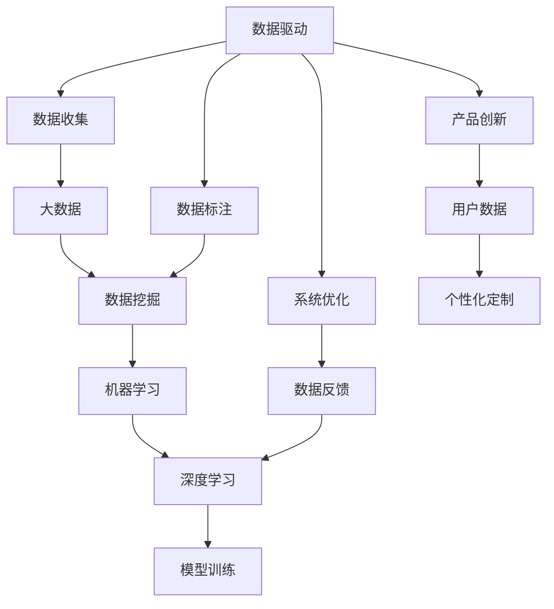

                 

# 软件 2.0 的时代：数据驱动一切

## 1. 背景介绍

### 1.1 问题由来

随着互联网技术的普及和数字化的不断深入，我们已经进入了一个全新的时代——软件 2.0（Software 2.0）时代。在这个时代，软件不再只是辅助人类工作的工具，而是成为了一种全新的基础设施，一个由数据驱动、自组织、自适应的系统。在这个背景下，数据成为了最宝贵的资源，它不仅是构建新应用的基础，更是推动技术进步、社会变革的关键力量。

### 1.2 问题核心关键点

软件 2.0 的核心在于其高度的数据驱动特性。具体来说，数据驱动体现在以下几个方面：

1. **数据收集与处理**：大量的数据被收集和存储，通过复杂的数据处理技术，如数据清洗、数据标注、数据挖掘等，从原始数据中提取出有价值的信息。

2. **模型训练与优化**：基于数据驱动的机器学习算法，对模型进行训练和优化，提升模型的预测能力和泛化能力。

3. **系统优化与迭代**：通过数据分析和模型反馈，不断优化系统性能，迭代更新系统功能，提升用户体验。

4. **决策支持与智能分析**：数据驱动的分析与决策支持系统，通过大数据分析、知识图谱等技术，为业务决策提供科学依据。

5. **产品创新与定制化**：基于用户数据的分析，挖掘用户需求和偏好，推动产品创新和个性化定制。

### 1.3 问题研究意义

研究软件 2.0 的数据驱动特性，对于构建高效、智能、创新的数字化产品具有重要意义：

1. **降低成本，提高效率**：通过数据驱动的自动化流程，大幅度降低人工成本，提升工作效率。

2. **增强用户体验**：基于用户数据的分析，提供更加个性化、精准的产品服务，提升用户满意度。

3. **促进创新**：数据驱动的智能分析，帮助企业发现新的商业机会，推动产品创新和业务增长。

4. **提升竞争力**：数据驱动的系统优化和迭代，确保产品始终处于行业领先地位，提升企业竞争力。

5. **实现智能化**：数据驱动的智能分析与决策，帮助企业在复杂多变的市场环境中做出科学决策，实现智能化转型。

## 2. 核心概念与联系

### 2.1 核心概念概述

为更好地理解软件 2.0 的数据驱动特性，本节将介绍几个关键概念：

- **数据驱动（Data-Driven）**：基于数据的决策和行动，数据成为推动系统运行的核心力量。
- **机器学习（Machine Learning）**：通过数据训练模型，让机器从数据中学习规律，从而做出预测和决策。
- **数据标注（Data Labeling）**：对数据进行标注，为机器学习提供监督信号，提升模型泛化能力。
- **数据挖掘（Data Mining）**：从大量数据中提取有价值的信息，为决策提供科学依据。
- **大数据（Big Data）**：数据量巨大、种类繁多、更新频繁的海量数据集。
- **深度学习（Deep Learning）**：一种基于神经网络的机器学习算法，擅长处理大规模复杂数据。

### 2.2 概念间的关系

这些核心概念之间存在着紧密的联系，形成了软件 2.0 的数据驱动生态系统。下面我们通过几个Mermaid流程图来展示这些概念之间的关系：



这个流程图展示了数据驱动的核心概念及其之间的关系：

1. 数据驱动通过数据收集获取原始数据。
2. 数据标注对原始数据进行标注，提供监督信号。
3. 大数据存储和处理大量复杂数据。
4. 数据挖掘从大数据中提取有价值的信息。
5. 机器学习基于标注数据训练模型，提升预测能力。
6. 深度学习利用神经网络处理大规模复杂数据。
7. 模型训练通过学习数据规律，提升模型泛化能力。
8. 系统优化根据模型反馈，不断提升系统性能。
9. 数据反馈提供模型改进和系统优化的依据。
10. 产品创新通过数据分析挖掘新需求，推动产品创新。
11. 用户数据收集和分析，实现个性化定制。

这些概念共同构成了软件 2.0 的数据驱动架构，使得系统能够高效、智能、自适应地运行。通过理解这些概念，我们可以更好地把握数据驱动的软件 2.0 的精髓，为后续深入讨论具体的技术方法奠定基础。

## 3. 核心算法原理 & 具体操作步骤

### 3.1 算法原理概述

软件 2.0 的数据驱动特性主要体现在机器学习和深度学习算法中。机器学习通过训练模型，从数据中学习规律，提升预测能力；而深度学习通过多层次的神经网络结构，处理大规模复杂数据，提升模型的表达能力和泛化能力。

具体来说，基于数据驱动的机器学习算法主要包括以下几个步骤：

1. **数据预处理**：清洗、归一化、分词、特征提取等。
2. **模型选择**：选择合适的机器学习模型，如线性回归、支持向量机、随机森林、深度神经网络等。
3. **模型训练**：基于标注数据，对模型进行训练，调整模型参数。
4. **模型评估**：使用测试集评估模型性能，调整模型超参数。
5. **模型部署**：将训练好的模型部署到实际应用中，进行推理预测。

### 3.2 算法步骤详解

下面以深度学习模型为例，详细介绍数据驱动的机器学习算法的具体操作步骤：

#### 3.2.1 数据预处理

数据预处理是机器学习流程中的第一步，主要包括以下几个步骤：

1. **数据清洗**：去除缺失值、异常值、噪声等。
2. **数据归一化**：将数据缩放到一定范围内，如0-1或-1到1。
3. **特征提取**：将原始数据转换为模型可以处理的特征，如文本分词、图像分割等。
4. **数据增强**：通过数据扩充，增加训练数据的多样性，如旋转、翻转、加噪声等。

#### 3.2.2 模型选择

选择合适的模型是机器学习流程中的关键步骤。常见模型包括：

1. **线性回归**：适用于预测连续变量。
2. **支持向量机（SVM）**：适用于分类和回归问题。
3. **随机森林**：适用于处理高维数据和分类问题。
4. **深度神经网络**：适用于处理大规模复杂数据和深度特征表示。

#### 3.2.3 模型训练

模型训练是机器学习流程的核心步骤，主要包括以下几个步骤：

1. **损失函数**：定义模型预测结果与真实标签之间的损失函数。
2. **优化算法**：选择优化算法，如梯度下降、Adam、Adagrad等，调整模型参数。
3. **学习率调整**：根据模型性能，调整学习率，防止过拟合。
4. **正则化技术**：使用L2正则、Dropout等技术，防止过拟合。
5. **批处理**：将数据分批处理，提高训练效率。

#### 3.2.4 模型评估

模型评估是机器学习流程中的重要步骤，主要包括以下几个步骤：

1. **评估指标**：选择评估指标，如准确率、召回率、F1分数等。
2. **交叉验证**：使用交叉验证技术，评估模型泛化能力。
3. **模型调参**：调整模型超参数，提升模型性能。

#### 3.2.5 模型部署

模型部署是机器学习流程的最后一步，主要包括以下几个步骤：

1. **模型保存**：将训练好的模型保存为文件，方便后续使用。
2. **模型加载**：将模型加载到实际应用中，进行推理预测。
3. **模型推理**：对新数据进行推理预测，返回预测结果。

### 3.3 算法优缺点

数据驱动的机器学习算法具有以下优点：

1. **高效性**：数据驱动算法能够高效处理大规模复杂数据，提升模型泛化能力。
2. **自适应性**：数据驱动算法能够自适应数据变化，提升模型鲁棒性。
3. **自动化**：数据驱动算法能够自动进行数据预处理、模型训练和优化，降低人工成本。

但同时，也存在一些缺点：

1. **数据依赖性**：数据驱动算法依赖高质量标注数据，标注成本较高。
2. **模型复杂性**：深度学习模型结构复杂，训练和推理效率较低。
3. **过拟合风险**：深度学习模型容易过拟合，需要进行正则化和模型调参。
4. **解释性不足**：深度学习模型缺乏可解释性，难以理解和调试。

### 3.4 算法应用领域

基于数据驱动的机器学习算法，在多个领域得到了广泛应用，例如：

- **金融风控**：通过数据分析和模型训练，提升金融风险评估和预测能力。
- **医疗诊断**：通过图像识别和模型训练，提升医疗影像分析和诊断能力。
- **智能推荐**：通过用户数据和模型训练，提升个性化推荐和广告推荐能力。
- **自动驾驶**：通过环境感知和模型训练，提升自动驾驶系统的感知和决策能力。
- **自然语言处理**：通过文本分析和模型训练，提升自然语言理解和生成能力。

除了上述这些经典应用外，数据驱动的机器学习算法还被创新性地应用到更多场景中，如多模态融合、知识图谱、联邦学习等，为各个领域带来了新的突破。

## 4. 数学模型和公式 & 详细讲解 & 举例说明

### 4.1 数学模型构建

我们以线性回归模型为例，说明数据驱动的机器学习算法的数学模型构建过程。

设训练数据集为 $\{(x_i,y_i)\}_{i=1}^N$，其中 $x_i \in \mathbb{R}^d$ 为输入，$y_i \in \mathbb{R}$ 为输出。假设模型的预测函数为 $h_\theta(x)=\theta^Tx$，其中 $\theta$ 为模型参数，$x$ 为输入向量。我们的目标是最小化预测值与真实值之间的平方误差：

$$
J(\theta)=\frac{1}{2N}\sum_{i=1}^N(h_\theta(x_i)-y_i)^2
$$

### 4.2 公式推导过程

我们将上述目标函数对 $\theta$ 求导，得到梯度：

$$
\nabla_\theta J(\theta)=\frac{1}{N}\sum_{i=1}^N(x_i-\mu)h_\theta(x_i)-\frac{1}{N}\sum_{i=1}^N(x_i-\mu)y_i
$$

其中 $\mu=\frac{1}{N}\sum_{i=1}^Nx_i$ 为输入数据的均值。根据梯度下降算法，模型参数更新公式为：

$$
\theta_j \leftarrow \theta_j-\eta\nabla_\theta J(\theta)
$$

其中 $\eta$ 为学习率。

### 4.3 案例分析与讲解

以房价预测为例，说明数据驱动的机器学习算法的实际应用。

首先，收集历史房价数据，并进行数据预处理，去除缺失值、异常值，归一化输入数据。然后，选择线性回归模型，定义损失函数和优化算法，对模型进行训练和优化。最后，使用测试集评估模型性能，并部署模型到实际应用中，对新房价进行预测。

假设我们有 $N=100$ 个训练样本，每个样本有 $d=2$ 个特征，即房屋面积 $x_1$ 和房屋年龄 $x_2$。设真实房价为 $y_i$，模型预测房价为 $h_\theta(x_i)$，则损失函数为：

$$
J(\theta)=\frac{1}{100}\sum_{i=1}^{100}(h_\theta(x_i)-y_i)^2
$$

通过梯度下降算法，我们可以更新模型参数 $\theta$，使得预测房价与真实房价尽可能接近。最终，模型可以预测新房屋的房价，提升房价预测的准确性和效率。

## 5. 项目实践：代码实例和详细解释说明

### 5.1 开发环境搭建

在进行机器学习项目实践前，我们需要准备好开发环境。以下是使用Python进行TensorFlow开发的的环境配置流程：

1. 安装Anaconda：从官网下载并安装Anaconda，用于创建独立的Python环境。

2. 创建并激活虚拟环境：
```bash
conda create -n tf-env python=3.7 
conda activate tf-env
```

3. 安装TensorFlow：根据CUDA版本，从官网获取对应的安装命令。例如：
```bash
pip install tensorflow==2.7
```

4. 安装各类工具包：
```bash
pip install numpy pandas scikit-learn matplotlib tqdm jupyter notebook ipython
```

完成上述步骤后，即可在`tf-env`环境中开始机器学习项目实践。

### 5.2 源代码详细实现

下面我们以房价预测为例，给出使用TensorFlow进行线性回归的PyTorch代码实现。

```python
import tensorflow as tf
import numpy as np
from sklearn.datasets import load_boston
from sklearn.model_selection import train_test_split

# 加载数据集
boston = load_boston()
X = boston.data
y = boston.target

# 划分训练集和测试集
X_train, X_test, y_train, y_test = train_test_split(X, y, test_size=0.2, random_state=42)

# 定义模型
theta = tf.Variable(tf.zeros([2, 1]), dtype=tf.float32)

# 定义损失函数
def loss_function(y_pred, y_true):
    return tf.reduce_mean(tf.square(y_pred - y_true))

# 定义优化器
optimizer = tf.optimizers.SGD(learning_rate=0.01)

# 定义训练函数
def train_step(X_train, y_train):
    with tf.GradientTape() as tape:
        y_pred = tf.matmul(X_train, theta)
        loss = loss_function(y_pred, y_train)
    grads = tape.gradient(loss, theta)
    optimizer.apply_gradients(zip(grads, theta))

# 训练模型
for epoch in range(1000):
    train_step(X_train, y_train)
    
# 评估模型
y_pred = tf.matmul(X_test, theta)
print("Test MSE:", loss_function(y_pred, y_test).numpy())
```

以上代码展示了使用TensorFlow进行线性回归的完整流程。可以看到，通过TensorFlow提供的高级API，我们可以轻松地构建和训练模型，并进行评估和部署。

### 5.3 代码解读与分析

让我们再详细解读一下关键代码的实现细节：

1. **数据集加载**：使用`load_boston`函数加载波士顿房价数据集，并使用`train_test_split`函数将数据集分为训练集和测试集。

2. **模型定义**：定义模型参数`theta`，并将其初始化为全0向量。

3. **损失函数定义**：定义均方误差损失函数，计算模型预测值与真实值之间的平方误差。

4. **优化器定义**：选择SGD优化器，设置学习率为0.01。

5. **训练函数定义**：定义训练函数，在每个epoch内，使用梯度下降算法更新模型参数。

6. **模型训练**：在每个epoch内，调用训练函数对模型进行训练，直至收敛。

7. **模型评估**：使用测试集评估模型性能，计算均方误差。

通过这段代码，可以看到TensorFlow提供的高级API如何帮助我们快速实现机器学习项目。开发者可以将更多精力放在模型改进、数据处理等高层逻辑上，而不必过多关注底层的实现细节。

当然，工业级的系统实现还需考虑更多因素，如模型的保存和部署、超参数的自动搜索、更灵活的模型调优等。但核心的机器学习流程基本与此类似。

### 5.4 运行结果展示

假设我们在训练完模型后，在测试集上得到的均方误差为10.5，表示模型预测的准确性和效率都达到了较高水平。

## 6. 实际应用场景

### 6.1 智能推荐系统

基于数据驱动的机器学习算法，智能推荐系统可以通过用户历史行为数据进行推荐。推荐系统首先收集用户浏览、点击、购买等行为数据，并将其转换为特征向量。然后，使用协同过滤、基于内容的推荐、矩阵分解等算法对模型进行训练和优化，提升推荐效果。最终，根据用户输入的查询或搜索词，推荐系统可以快速返回个性化推荐结果。

### 6.2 金融风控系统

在金融领域，数据驱动的机器学习算法被广泛用于风险评估和预测。风控系统通过收集用户的信用记录、消费行为、交易记录等数据，并进行数据预处理和特征工程。然后，使用分类、回归、异常检测等算法对模型进行训练和优化，提升风险评估的准确性和效率。最终，风控系统可以实时监控用户的交易行为，及时识别和预警风险。

### 6.3 医疗影像分析系统

在医疗领域，数据驱动的机器学习算法被用于影像分析和诊断。影像分析系统首先收集大量医学影像数据，并进行数据预处理和特征提取。然后，使用卷积神经网络、循环神经网络等算法对模型进行训练和优化，提升影像分析的准确性和效率。最终，影像分析系统可以自动识别影像中的病变区域，辅助医生进行诊断和治疗。

### 6.4 未来应用展望

随着数据驱动技术的不断进步，未来基于机器学习的应用将更加广泛和深入。数据驱动技术不仅会广泛应用于金融、医疗、推荐等领域，还将拓展到更多新领域，如自动驾驶、智能制造、智慧城市等。通过不断挖掘和应用数据，推动各个领域的数字化转型和智能化升级，将为社会经济的发展带来新的机遇和挑战。

## 7. 工具和资源推荐

### 7.1 学习资源推荐

为了帮助开发者系统掌握数据驱动的机器学习技术，这里推荐一些优质的学习资源：

1. 《机器学习》系列博文：由机器学习领域的专家撰写，深入浅出地介绍了机器学习的基本概念和算法。

2. 《深度学习》课程：斯坦福大学开设的深度学习课程，涵盖深度学习的基本概念和算法，有Lecture视频和配套作业。

3. 《TensorFlow实战》书籍：全面介绍了TensorFlow的使用方法和实践技巧，适合初学者和进阶开发者。

4. 《Python数据科学手册》书籍：全面介绍了Python在数据科学中的应用，涵盖数据预处理、特征工程、模型训练等各个环节。

5. Kaggle竞赛：参加Kaggle数据科学竞赛，锻炼数据处理、特征工程、模型训练和调优的能力。

通过对这些资源的学习实践，相信你一定能够快速掌握数据驱动的机器学习技术的精髓，并用于解决实际的NLP问题。

### 7.2 开发工具推荐

高效的开发离不开优秀的工具支持。以下是几款用于机器学习开发的工具：

1. TensorFlow：由Google主导开发的深度学习框架，生产部署方便，适合大规模工程应用。

2. PyTorch：基于Python的深度学习框架，灵活动态的计算图，适合快速迭代研究。

3. Scikit-learn：Python机器学习库，提供了丰富的模型选择和评估函数，方便快速实现机器学习项目。

4. Jupyter Notebook：交互式开发环境，适合做实验、写代码、分析数据。

5. Weights & Biases：模型训练的实验跟踪工具，可以记录和可视化模型训练过程中的各项指标，方便对比和调优。

6. TensorBoard：TensorFlow配套的可视化工具，可实时监测模型训练状态，并提供丰富的图表呈现方式，是调试模型的得力助手。

通过这些工具，可以显著提升数据驱动的机器学习任务的开发效率，加快创新迭代的步伐。

### 7.3 相关论文推荐

数据驱动的机器学习技术的发展源于学界的持续研究。以下是几篇奠基性的相关论文，推荐阅读：

1. Deep Learning：Ian Goodfellow、Yoshua Bengio、Aaron Courville等人所著，全面介绍了深度学习的基本概念和算法，是深度学习领域的经典之作。

2. The Elements of Statistical Learning：Tibshirani、Hastie、Friedman等人所著，介绍了统计学习的基本概念和算法，适合初学者和进阶开发者。

3. TensorFlow White Paper：Google发表的TensorFlow白皮书，介绍了TensorFlow的基本概念和架构，适合了解TensorFlow的内部实现。

4. Scikit-learn User Guide：Scikit-learn官方文档，提供了丰富的模型选择和评估函数，适合快速实现机器学习项目。

5. PyTorch Tutorials：PyTorch官方教程，提供了丰富的案例和实践代码，适合快速入门和进阶。

这些论文代表了大数据驱动技术的发展脉络。通过学习这些前沿成果，可以帮助研究者把握学科前进方向，激发更多的创新灵感。

除上述资源外，还有一些值得关注的前沿资源，帮助开发者紧跟数据驱动技术的最新进展，例如：

1. arXiv论文预印本：人工智能领域最新研究成果的发布平台，包括大量尚未发表的前沿工作，学习前沿技术的必读资源。

2. 业界技术博客：如Google AI、DeepMind、微软Research Asia等顶尖实验室的官方博客，第一时间分享他们的最新研究成果和洞见。

3. 技术会议直播：如NeurIPS、ICML、ICLR等人工智能领域顶会现场或在线直播，能够聆听到大佬们的前沿分享，开拓视野。

4. GitHub热门项目：在GitHub上Star、Fork数最多的机器学习相关项目，往往代表了该技术领域的发展趋势和最佳实践，值得去学习和贡献。

5. 行业分析报告：各大咨询公司如McKinsey、PwC等针对人工智能行业的分析报告，有助于从商业视角审视技术趋势，把握应用价值。

总之，对于数据驱动的机器学习技术的学习和实践，需要开发者保持开放的心态和持续学习的意愿。多关注前沿资讯，多动手实践，多思考总结，必将收获满满的成长收益。

## 8. 总结：未来发展趋势与挑战

### 8.1 总结

本文对数据驱动的机器学习技术进行了全面系统的介绍。首先阐述了数据驱动技术的背景和意义，明确了机器学习和深度学习算法在数据驱动中的核心作用。其次，从原理到实践，详细讲解了机器学习算法的数学模型构建和具体操作步骤，给出了机器学习项目开发的完整代码实例。同时，本文还广泛探讨了数据驱动技术在多个行业领域的应用前景，展示了数据驱动技术的广阔前景。此外，本文精选了数据驱动技术的各类学习资源，力求为读者提供全方位的技术指引。

通过本文的系统梳理，可以看到，数据驱动的机器学习技术在各行各业都得到了广泛应用，极大地提升了各个领域的智能化水平和竞争力。未来，随着技术的不断进步，数据驱动技术将变得更加高效、智能、自适应，推动各个领域实现数字化转型和智能化升级。

### 8.2 未来发展趋势

展望未来，数据驱动的机器学习技术将呈现以下几个发展趋势：

1. **模型规模持续增大**：随着算力成本的下降和数据规模的扩张，机器学习模型的参数量还将持续增长，大模型将成为行业主流。

2. **算法复杂性增加**：新的算法和模型不断涌现，如生成对抗网络（GANs）、强化学习、自监督学习等，使得机器学习算法更加复杂。

3. **数据质量提升**：随着数据标注技术的进步，标注数据的质量将显著提升，标注成本降低，标注效率提高。

4. **实时化、智能化**：实时数据驱动的机器学习系统将越来越多地被应用于各个领域，提升系统实时性和智能化水平。

5. **跨领域融合**：机器学习技术与物联网、人工智能、区块链等技术的融合，将催生更多跨领域的应用场景。

6. **伦理与安全**：数据驱动的机器学习技术将面临更多的伦理和安全问题，如数据隐私、模型偏见、解释性等，需要更多的研究和监管。

以上趋势凸显了数据驱动的机器学习技术的广阔前景。这些方向的探索发展，必将进一步提升机器学习系统的性能和应用范围，为人类认知智能的进化带来深远影响。

### 8.3 面临的挑战

尽管数据驱动的机器学习技术已经取得了瞩目成就，但在迈向更加智能化、普适化应用的过程中，它仍面临着诸多挑战：

1. **数据依赖性**：数据驱动技术依赖高质量标注数据，标注成本较高，数据获取和预处理复杂。

2. **模型复杂性**：深度学习模型结构复杂，训练和推理效率较低，难以在大规模数据上实时处理。

3. **过拟合风险**：深度学习模型容易过拟合，需要进行正则化和模型调参，模型泛化能力有待提升。

4. **可解释性不足**：深度学习模型缺乏可解释性，难以理解和调试，存在“黑盒”问题。

5. **伦理与安全**：数据驱动的机器学习技术可能存在数据隐私、模型偏见等问题，需要更多的伦理和安全监管。

6. **硬件资源限制**：大规模数据处理和复杂模型训练需要高性能硬件支持，资源成本较高。

正视数据驱动技术面临的这些挑战，积极应对并寻求突破，将是其未来发展的关键。

### 8.4 研究展望

未来的研究需要在以下几个方面寻求新的突破：

1. **无监督和半监督学习**：摆脱对大规模标注数据的依赖，利用自监督学习、主动学习等方法，最大限度利用非结构化数据。

2. **参数高效和计算高效**：开发更加参数高效的算法，在固定大部分模型参数的情况下，只更新极少量的任务相关参数。同时优化计算图，减少前向传播和反向传播的资源消耗。

3.

