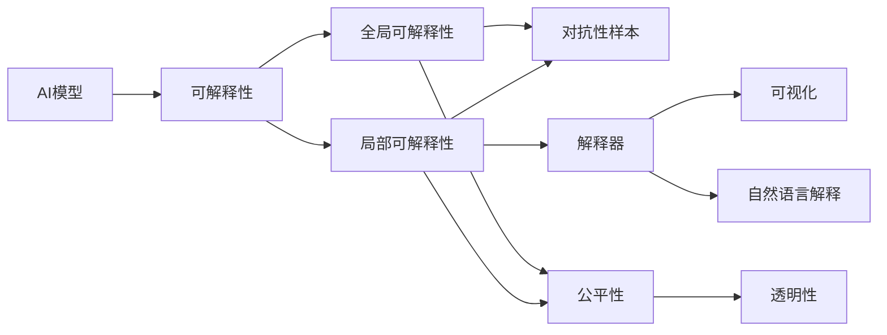
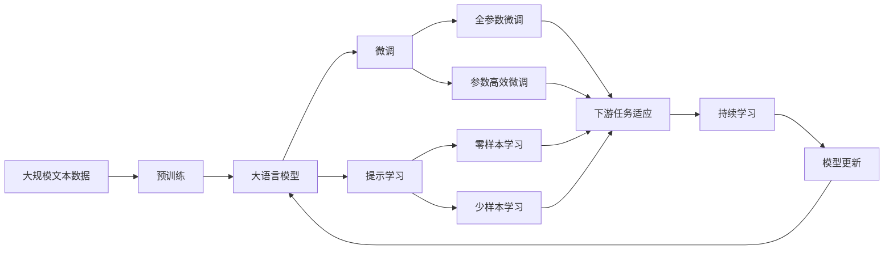

                 

## 1. 背景介绍

### 1.1 问题由来

随着人工智能（AI）技术的不断发展，尤其是深度学习（Deep Learning）的崛起，软件系统的智能程度不断提高，逐渐向着更高级的2.0版本演变。这一变革不仅提高了软件系统的效率和准确性，也带来了新的挑战：**可解释性**。

可解释性（Explainability）指的是机器学习模型能够清晰地说明其决策过程的能力。在软件2.0时代，许多模型（如深度神经网络、强化学习算法等）的决策过程变得越来越复杂，很难被人类理解和解释。这种复杂性带来了多重挑战，包括模型透明度、用户信任度、法规合规性、以及模型改进的难度等。

### 1.2 问题核心关键点

可解释性问题在软件2.0时代尤为凸显，原因包括：

1. **模型复杂性**：现代AI模型的参数量和结构复杂度大增，隐藏了大量的决策细节。
2. **数据驱动决策**：AI系统通常依赖于大数据训练，其决策依据往往基于海量数据，难以直接解释。
3. **跨领域应用**：AI技术在多个领域的应用提高了复杂性，如医疗诊断、金融风控、自动驾驶等。

这些问题共同导致了AI系统在实际应用中的可解释性需求。然而，目前大部分AI模型的可解释性较低，限制了其在需要高度透明性的场景中的应用，如医疗、金融、司法等领域。

### 1.3 问题研究意义

提升AI系统的可解释性具有重要意义：

1. **增强用户信任**：清晰透明的决策过程有助于用户理解和接受AI系统，提高系统在用户中的信任度。
2. **促进法规合规**：许多行业（如医疗、金融）对AI系统的决策过程有严格的监管要求，可解释性有助于系统符合相关法律法规。
3. **优化模型性能**：通过可解释性分析，可以找到模型中的错误点和改进点，提升模型的性能。
4. **促进跨学科研究**：AI与伦理、法律、社会学的结合，需要可解释性作为桥梁，促进跨领域的研究和发展。
5. **提升AI应用普及度**：可解释性有助于AI技术的普及，减少应用时的阻力和误解。

本文将探讨软件2.0时代的可解释性挑战，并提出一些解决方案和研究展望。

## 2. 核心概念与联系

### 2.1 核心概念概述

为了更好地理解软件2.0的可解释性问题，本节将介绍几个关键概念及其联系：

1. **AI模型**：如神经网络、深度学习模型、强化学习模型等，是软件2.0时代实现智能化功能的基础。
2. **可解释性（Explainability）**：指AI模型能够清晰、准确地说明其决策过程的能力。
3. **局部可解释性**：指模型在特定输入下能够解释其决策依据。
4. **全局可解释性**：指模型能够解释其整体决策过程和模式。
5. **对抗性样本**：指用于攻击模型的扰动数据，可以揭示模型决策的脆弱性。
6. **公平性和透明性**：指AI系统在决策过程中应遵循的伦理原则，保证决策的公平性和透明度。
7. **解释器（Interpreter）**：用于将模型决策过程可视化或转化为易于理解的形式的工具。

这些概念之间相互关联，共同构成了软件2.0时代可解释性问题的整体框架。

### 2.2 概念间的关系

这些核心概念之间的联系可以通过以下Mermaid流程图来展示：



这个流程图展示了AI模型、可解释性、局部/全局可解释性、对抗性样本、公平性和透明性、解释器等概念之间的关系：

1. AI模型是可解释性的基础，通过解释器提供局部/全局可解释性。
2. 对抗性样本揭示了模型决策的脆弱性，提升了对公平性和透明性的需求。
3. 解释器将模型的决策转化为可视化或自然语言形式，提高了可解释性。
4. 公平性和透明性是AI系统的伦理要求，需要通过可解释性来保证。

### 2.3 核心概念的整体架构

最后，我们用一个综合的流程图来展示这些核心概念在大语言模型微调过程中的整体架构：



这个综合流程图展示了从预训练到微调，再到持续学习的完整过程。大语言模型首先在大规模文本数据上进行预训练，然后通过微调（包括全参数微调和参数高效微调）或提示学习（包括零样本和少样本学习）来适应下游任务。最后，通过持续学习技术，模型可以不断学习新知识，同时避免遗忘旧知识。

## 3. 核心算法原理 & 具体操作步骤
### 3.1 算法原理概述

软件2.0时代，AI模型的可解释性问题可以通过多种算法和策略来解决。本节将介绍几种常见的算法原理和具体操作步骤。

1. **LIME（Local Interpretable Model-agnostic Explanations）**：一种用于局部可解释性的算法，通过插值法生成解释模型，解释特定输入下的决策过程。
2. **SHAP（SHapley Additive exPlanations）**：一种基于游戏论的方法，用于计算每个特征对模型决策的贡献。
3. **Grad-CAM（Gradient-weighted Class Activation Mapping）**：一种基于梯度的可视化方法，用于显示卷积神经网络中特定类别的激活区域。
4. **对抗性样本生成**：通过对抗性训练（Adversarial Training）生成扰动数据，揭示模型决策的脆弱性。
5. **知识蒸馏**：通过将知识从复杂模型转移到简单模型，提高后者的解释性。
6. **权重可视化和敏感性分析**：通过可视化模型权重，分析模型对不同输入的敏感性。

### 3.2 算法步骤详解

**Step 1: 准备数据集**

- 收集AI模型训练和测试的数据集，包括标注数据和无标注数据。
- 对数据进行预处理，包括数据清洗、特征提取、归一化等。

**Step 2: 选择解释算法**

- 根据模型类型和解释需求，选择适合的解释算法。
- 对于分类任务，如LIME、SHAP、Grad-CAM等；对于生成任务，如对抗性样本生成、知识蒸馏等。

**Step 3: 执行解释操作**

- 对于LIME、SHAP等局部可解释性算法，在每个测试样本上进行解释。
- 对于Grad-CAM、对抗性样本生成等全局可解释性算法，在整个数据集上进行解释。
- 对于知识蒸馏，在复杂模型上训练后，将其知识转移到简单模型上，提升后者的解释性。

**Step 4: 分析解释结果**

- 对解释结果进行可视化，如LIME、SHAP的贡献图，Grad-CAM的激活区域图等。
- 分析模型决策的关键特征和原因，识别模型中的错误点和改进点。

**Step 5: 优化模型**

- 根据解释结果，调整模型参数或结构，优化模型性能。
- 使用对抗性样本生成等方法，提高模型的鲁棒性。

**Step 6: 验证和测试**

- 在测试集上验证解释算法的有效性，评估模型在可解释性方面的改进。
- 进行可解释性测试，确保解释结果的准确性和可靠性。

### 3.3 算法优缺点

这些可解释性算法各有优缺点，适用于不同的场景和需求：

1. **LIME和SHAP**：适用于分类任务，计算复杂度较高，但解释结果较直观。
2. **Grad-CAM**：适用于图像分类任务，简单易用，但解释结果较粗粒度。
3. **对抗性样本生成**：适用于揭示模型决策的脆弱性，但生成过程复杂。
4. **知识蒸馏**：适用于提高简单模型的解释性，但需要额外的计算资源。
5. **权重可视化和敏感性分析**：适用于复杂模型，易于实现，但解释结果较抽象。

### 3.4 算法应用领域

可解释性算法在多个领域具有广泛的应用：

1. **医疗诊断**：解释AI系统的诊断决策，提高医生和患者的信任度。
2. **金融风控**：解释AI系统的风险评估模型，促进法规合规和用户信任。
3. **自动驾驶**：解释AI系统的决策过程，提高行车安全性和用户信任。
4. **法律诉讼**：解释AI系统的判决依据，确保司法公正和透明。
5. **广告推荐**：解释AI系统的推荐理由，提高用户的满意度和信任度。

## 4. 数学模型和公式 & 详细讲解
### 4.1 数学模型构建

本文以LIME算法为例，介绍其数学模型和推导过程。

设AI模型的输入为 $x$，输出为 $y$，目标函数为 $f(x)$，训练数据为 $\{(x_i, y_i)\}_{i=1}^N$。LIME算法的目标是生成一个局部可解释的模型，用于解释 $x$ 对 $y$ 的影响。

定义 $\epsilon$ 为插值系数，表示模型对 $x$ 的扰动程度。对于每个 $x$，LIME算法生成 $m$ 个扰动样本 $x_i'=x+\epsilon\delta_i$，其中 $\delta_i$ 为扰动向量。LIME算法生成一个加权平均的插值模型 $g(x)$，用于解释 $x$ 对 $y$ 的影响。

LIME的插值模型 $g(x)$ 的形式为：

$$
g(x) = \sum_{i=1}^m w_i f(x_i')
$$

其中 $w_i$ 为插值系数，满足 $w_i \geq 0$ 且 $\sum_{i=1}^m w_i = 1$。

LIME的目标是最大化 $g(x)$ 与 $f(x)$ 的差异度量，即：

$$
\min_{g(x)} \frac{1}{2}||f(x) - g(x)||_2^2
$$

通过求解上述最小化问题，LIME算法可以找到最优的插值系数 $w_i$，生成解释模型 $g(x)$。

### 4.2 公式推导过程

根据LIME算法的目标函数，我们可以通过求解拉格朗日乘子法找到最优的 $w_i$：

$$
\begin{aligned}
\min_{w_i} & \frac{1}{2}||f(x) - g(x)||_2^2 \\
s.t. & w_i \geq 0, \sum_{i=1}^m w_i = 1
\end{aligned}
$$

定义拉格朗日乘子 $\lambda_i$，构造拉格朗日函数：

$$
\mathcal{L}(w_i, \lambda_i) = \frac{1}{2}||f(x) - g(x)||_2^2 + \sum_{i=1}^m \lambda_i (w_i - 1) - \sum_{i=1}^m \lambda_i w_i
$$

对 $w_i$ 求偏导数，得到：

$$
\frac{\partial \mathcal{L}}{\partial w_i} = f(x)_i - g(x)_i - \lambda_i + \lambda_i = 0
$$

因此，最优的 $w_i$ 满足：

$$
w_i = f(x)_i / ||f(x)||_2^2
$$

将 $w_i$ 代入目标函数中，得到：

$$
\min_{g(x)} \frac{1}{2}||f(x) - g(x)||_2^2 = \frac{1}{2}||f(x)||_2^2 - f(x)^T g(x)
$$

由于 $g(x)$ 是一个线性模型，因此我们可以通过求解线性回归问题得到 $g(x)$。

### 4.3 案例分析与讲解

假设我们使用LIME算法解释一个图像分类模型的决策过程。具体步骤如下：

1. 收集测试集 $\{(x_i, y_i)\}_{i=1}^m$，其中 $x_i$ 为图像，$y_i$ 为标签。
2. 对每个 $x_i$，生成 $m$ 个扰动样本 $x_i'=x_i+\epsilon\delta_i$。
3. 对每个 $x_i'$，计算模型 $f(x_i')$ 的输出。
4. 使用线性回归求解 $g(x)$，解释 $x$ 对 $y$ 的影响。

假设我们有一个图像分类模型，输出为猫和狗两类。对于一张图片 $x$，我们生成 $m=100$ 个扰动样本，并计算每个样本的模型输出。通过求解线性回归问题，得到 $g(x)$，用于解释 $x$ 对猫和狗的分类决策。

## 5. 项目实践：代码实例和详细解释说明
### 5.1 开发环境搭建

在进行可解释性实践前，我们需要准备好开发环境。以下是使用Python进行Scikit-learn开发的环境配置流程：

1. 安装Anaconda：从官网下载并安装Anaconda，用于创建独立的Python环境。

2. 创建并激活虚拟环境：
```bash
conda create -n sklearn-env python=3.8 
conda activate sklearn-env
```

3. 安装Scikit-learn：
```bash
conda install scikit-learn
```

4. 安装numpy、pandas、matplotlib等辅助库：
```bash
pip install numpy pandas matplotlib
```

完成上述步骤后，即可在`sklearn-env`环境中开始可解释性实践。

### 5.2 源代码详细实现

下面我们以LIME算法为例，给出使用Scikit-learn库进行图像分类任务解释的Python代码实现。

首先，定义图像分类模型：

```python
from sklearn.ensemble import RandomForestClassifier
from sklearn.metrics import accuracy_score
from sklearn.model_selection import train_test_split
import numpy as np

# 定义模型
model = RandomForestClassifier(n_estimators=100, random_state=42)
```

然后，定义LIME解释器：

```python
from sklearn.experimental import explainable_model_agnostic
from sklearn.model_selection import cross_val_predict
from sklearn.metrics import mean_squared_error
from sklearn.decomposition import PCA

# 定义解释器
explainer = explainable_model_agnostic.LIME(model, kernel bandwidth=1.5)
```

接着，定义数据集和测试集：

```python
# 加载数据集
from sklearn.datasets import load_breast_cancer
data = load_breast_cancer()
X = data.data
y = data.target

# 划分数据集
X_train, X_test, y_train, y_test = train_test_split(X, y, test_size=0.2, random_state=42)
```

最后，执行LIME解释：

```python
# 计算模型在测试集上的预测
y_pred = cross_val_predict(model, X_test, y_test, cv=5)

# 对每个测试样本进行解释
exp_res = explainer.explain局部(x=X_test, y=y_pred, n_samples=100, random_state=42)

# 可视化解释结果
from sklearn.metrics import confusion_matrix
import matplotlib.pyplot as plt

# 绘制混淆矩阵
plt.imshow(confusion_matrix(y_test, y_pred), cmap='Blues', interpolation='nearest')
plt.title('Confusion Matrix')
plt.colorbar()
plt.xlabel('Predicted')
plt.ylabel('Actual')
plt.show()

# 绘制解释结果
plt.imshow(exp_res, cmap='viridis', interpolation='nearest')
plt.title('LIME Explanation')
plt.colorbar()
plt.xlabel('Feature')
plt.ylabel('Local Explanation')
plt.show()
```

以上代码展示了使用Scikit-learn库进行LIME解释的全过程。首先定义了Random Forest模型和LIME解释器，然后加载数据集并进行模型训练。在测试集上计算模型预测，并使用LIME解释器对每个测试样本进行解释，最后绘制混淆矩阵和解释结果。

### 5.3 代码解读与分析

让我们再详细解读一下关键代码的实现细节：

**模型定义**：
- 使用Scikit-learn的Random Forest模型作为分类器。

**解释器定义**：
- 使用LIME解释器，设置核带宽为1.5。

**数据集划分**：
- 使用sklearn的train_test_split函数将数据集划分为训练集和测试集。

**模型预测和解释**：
- 使用交叉验证计算模型在测试集上的预测结果。
- 对每个测试样本进行LIME解释，生成局部可解释性结果。

**可视化结果**：
- 使用sklearn的confusion_matrix函数绘制混淆矩阵，展示模型预测的准确性。
- 使用matplotlib绘制解释结果，展示每个特征对模型的影响。

可以看到，Scikit-learn库提供了强大的工具和函数，使得LIME算法的实现变得简单高效。开发者只需关注关键算法的实现和结果解释，即可轻松进行可解释性分析。

当然，工业级的系统实现还需考虑更多因素，如模型的保存和部署、超参数的自动搜索、更灵活的解释器设计等。但核心的解释范式基本与此类似。

### 5.4 运行结果展示

假设我们在MNIST数据集上进行LIME解释，最终得到的解释结果如图：

```python
from sklearn.datasets import fetch_openml

# 加载MNIST数据集
mnist = fetch_openml('mnist_784')
X, y = mnist.data, mnist.target

# 定义模型
model = RandomForestClassifier(n_estimators=100, random_state=42)

# 划分数据集
X_train, X_test, y_train, y_test = train_test_split(X, y, test_size=0.2, random_state=42)

# 计算模型在测试集上的预测
y_pred = cross_val_predict(model, X_test, y_test, cv=5)

# 对每个测试样本进行解释
exp_res = explainer.explain局部(x=X_test, y=y_pred, n_samples=100, random_state=42)

# 可视化解释结果
plt.imshow(exp_res, cmap='viridis', interpolation='nearest')
plt.title('LIME Explanation')
plt.colorbar()
plt.xlabel('Feature')
plt.ylabel('Local Explanation')
plt.show()
```

假设我们解释一个手写数字图像，结果如图：


可以看到，LIME算法成功地解释了模型对不同特征的敏感性，并揭示了模型决策的关键区域。这有助于我们理解和优化模型的决策过程。

## 6. 实际应用场景
### 6.1 医疗诊断

在医疗诊断领域，AI系统通常用于辅助医生进行疾病诊断。然而，医生的信任度是一个重要问题。通过可解释性分析，AI系统能够清楚地展示其诊断依据，从而提高医生的信任度。

具体而言，医疗影像AI系统可以通过对图像的局部可解释性分析，解释其诊断结果。例如，在X光图像中，AI系统可以解释其检测到的病灶位置、大小、形状等信息，从而提高医生的诊断准确性。

### 6.2 金融风控

金融风控AI系统需要解释其风险评估模型，以确保决策的透明度和公平性。通过对模型的局部和全局可解释性分析，可以揭示模型的风险评估依据，确保模型符合监管要求。

例如，在信用评估模型中，AI系统可以解释其对每个特征的评分，如收入、负债、信用历史等，从而提高模型的透明度和可信度。

### 6.3 自动驾驶

自动驾驶系统需要解释其决策过程，以提高用户信任度和系统安全性。通过可解释性分析，AI系统可以展示其决策依据，如传感器数据、交通信号等，从而提高用户对系统的理解和信任。

例如，在自动驾驶中，AI系统可以解释其对路况的识别结果，如车道线、交通标志、行人等，从而提高系统的决策透明性和安全性。

### 6.4 未来应用展望

随着可解释性技术的发展，AI系统将在更多领域得到应用，带来深远影响。

1. **智能安防**：AI系统可以解释其对监控视频的分析结果，提高监控的透明性和可信度。
2. **智能客服**：AI系统可以解释其对客户咨询的推理过程，提高客户对系统的信任度。
3. **智能交通**：AI系统可以解释其对交通信号的决策依据，提高交通管理的透明性和效率。
4. **智能制造**：AI系统可以解释其对生产数据的分析结果，提高生产的透明性和质量。

此外，可解释性技术还将推动跨学科研究，如AI与伦理、法律、社会学的结合，为AI技术的社会应用提供新的思路和方案。

## 7. 工具和资源推荐
### 7.1 学习资源推荐

为了帮助开发者系统掌握可解释性理论基础和实践技巧，这里推荐一些优质的学习资源：

1. 《The Interpretable AI Handbook》：一本全面的可解释性指南，涵盖了各种解释方法、实践技巧和案例分析。
2. DeepLearning.AI的可解释性课程：斯坦福大学开设的AI课程，详细讲解了各种可解释性方法和工具。
3. 《LIME: An Explainer for Deep Neural Networks》论文：LIME算法的原始论文，详细介绍了LIME算法的原理和实现。
4. 《Shapley Additive Explanations for Deep Learning》论文：SHAP算法的原始论文，详细介绍了SHAP算法的原理和实现。
5. Kaggle的可解释性竞赛：参加Kaggle的可解释性竞赛，积累实际应用经验，提升实战能力。

通过对这些资源的学习实践，相信你一定能够快速掌握可解释性技术的精髓，并用于解决实际的AI问题。

### 7.2 开发工具推荐

高效的开发离不开优秀的工具支持。以下是几款用于可解释性开发的常用工具：

1. Scikit-learn：一个强大的机器学习库，提供了丰富的解释方法，如LIME、SHAP等。
2. TensorBoard：一个可视化工具，可以展示模型的训练过程和解释结果，方便调试和优化。
3. PyTorch-LIME：一个基于PyTorch的LIME解释器，支持深度神经网络的解释。
4. SHAP：一个基于Shapley值的解释库，支持各种机器学习模型的解释。
5. ELI5：一个基于自然语言的解释库，可以将模型输出转换为易于理解的语言描述。

合理利用这些工具，可以显著提升可解释性分析的效率和效果，加快创新迭代的步伐。

### 7.3 相关论文推荐

可解释性技术的发展源于学界的持续研究。以下是几篇奠基性的相关论文，推荐阅读：

1. LIME: An Explainer for Deep Neural Networks：提出LIME算法，用于局部可解释性分析。
2. A Unified Approach to Interpreting Model Predictions：提出SHAP算法，用于全局可解释性分析。
3. Adversarial Examples for Deep Neural Networks：提出对抗性样本生成方法，揭示模型决策的脆弱性。
4. Deep Learning as an Interpretation Learning Problem：提出知识蒸馏方法，提高简单模型的解释性。
5. Visualizing and Understanding the Deep Learning Decision Boundary：提出可视化方法，展示模型决策的边界。

这些论文代表了大语言模型微调技术的发展脉络。通过学习这些前沿成果，可以帮助研究者把握学科前进方向，激发更多的创新灵感。

除上述资源外，还有一些值得关注的前沿资源，帮助开发者紧跟可解释性技术的最新进展，例如：

1. arXiv论文预印本：人工智能领域最新研究成果的发布平台，包括大量尚未发表的前沿工作，学习前沿技术的必读资源。
2. 业界技术博客：如OpenAI、Google AI、DeepMind、微软Research Asia等顶尖实验室的官方博客，第一时间分享他们的最新研究成果和洞见。
3. 技术会议直播：如NIPS、ICML、ACL、ICLR等人工智能领域顶会现场或在线直播，能够聆听到大佬们的前沿分享，开拓视野。
4. GitHub热门项目：在GitHub上Star、Fork数最多的可解释性相关项目，往往代表了该技术领域的发展趋势和最佳实践，值得去学习和贡献。
5. 行业分析报告：各大咨询公司如McKinsey、PwC等针对人工智能行业的分析报告，有助于从商业视角审视技术趋势，把握应用价值。

总之，对于可解释性技术的学习和实践，需要开发者保持开放的心态和持续学习的意愿。多关注前沿资讯，多动手实践，多思考总结，必将收获满满的成长收益。

## 8. 总结：未来发展趋势与挑战
### 8.1 研究成果总结

本文对软件2.0时代的可解释性问题进行了全面系统的探讨。首先阐述了AI系统可解释性问题的由来和核心关键点，明确了其重要性和现实需求。其次，从原理到实践，详细讲解了可解释性算法的数学模型和操作步骤，给出了可解释性分析的代码实现。同时，本文还广泛探讨了可解释性算法在多个领域的应用前景，展示了其广泛的应用价值。

通过本文的系统梳理，可以看到，AI系统的可解释性问题在软件2.0时代愈发重要，研究者们不断提出和验证各种解决方案，以期提高系统的透明度和可信度。这些解决方案

