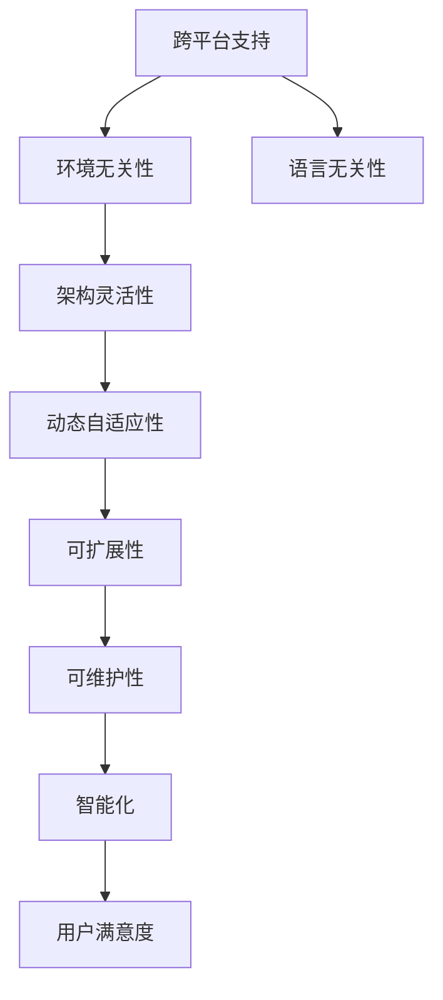

                 

## 1. 背景介绍

随着科技的飞速发展，软件应用的领域不断拓展，从简单的任务自动化到复杂的决策支持系统，软件已经成为现代信息技术的重要组成部分。然而，这种广泛的应用也带来了一个严峻的问题：软件系统的移植性问题。传统的软件系统往往需要在特定的操作系统、硬件平台和编程语言环境下运行，这种高度依赖于环境的特性使得软件的部署和维护变得异常复杂。为了解决这一问题，软件2.0的概念应运而生。软件2.0强调通过高可移植性、可扩展性和自适应性，实现软件的跨平台运行和动态演化，以适应不断变化的应用需求和技术环境。

### 1.1 问题由来

软件移植性的问题主要源于以下几个方面：

- **环境依赖性**：软件通常依赖特定的硬件和操作系统环境，这种依赖性限制了软件的移植范围。例如，一个基于特定操作系统内核的应用程序可能在其他操作系统上无法运行。
- **语言依赖性**：编程语言本身的特性和语法规则限制了软件的可移植性。例如，一个使用特定语言特性的库可能无法在其他语言环境中被正确调用。
- **架构依赖性**：软件架构设计上的决策（如线程模型、内存管理策略）也会影响其可移植性。例如，一个多线程的架构可能在单线程环境下运行效率低下。

这些问题不仅增加了软件开发的复杂度，也限制了软件的广泛应用。因此，实现软件的高可移植性成为软件工程的一个重要课题。

### 1.2 问题核心关键点

软件2.0的高可移植性涉及多个核心关键点，包括：

- **跨平台支持**：能够在不同的操作系统、硬件平台和编程语言环境下运行。
- **环境无关性**：软件不依赖特定的环境参数和系统资源，能够自主适应不同的环境。
- **语言无关性**：软件能够在不改变源代码的情况下，在不同编程语言环境中编译和运行。
- **架构灵活性**：能够根据实际需求调整软件架构，提高可扩展性和可维护性。
- **动态自适应性**：能够根据外部环境的变化（如用户输入、系统状态）动态调整自身行为和输出。

这些关键点共同构成了软件2.0的核心特征，使其能够在多种环境中稳定运行，并随着环境变化而不断演进。

### 1.3 问题研究意义

软件2.0的高可移植性具有重要意义：

- **降低开发和部署成本**：通过跨平台支持和环境无关性，减少了软件在不同环境下的适配和调试工作，提高了开发效率和部署便捷性。
- **增强应用灵活性**：动态自适应性和架构灵活性使得软件能够快速响应变化，适应多样化的应用场景。
- **促进技术创新**：高可移植性为软件技术的跨学科融合和创新提供了便利，推动了软件技术和应用的不断进步。
- **提升用户满意度**：软件能够在各种环境下稳定运行，提高了用户的接受度和满意度，有助于技术的普及和推广。

## 2. 核心概念与联系

### 2.1 核心概念概述

软件2.0的高可移植性涉及多个核心概念，包括：

- **跨平台支持**：指软件能够在不同的操作系统和硬件平台上运行，不受环境依赖。
- **环境无关性**：指软件不依赖特定的环境参数和系统资源，能够在多种环境中稳定运行。
- **语言无关性**：指软件能够在不改变源代码的情况下，在不同编程语言环境中编译和运行。
- **架构灵活性**：指软件能够根据实际需求调整架构，提高可扩展性和可维护性。
- **动态自适应性**：指软件能够根据外部环境的变化动态调整自身行为和输出。

### 2.2 概念间的关系

这些核心概念之间存在着紧密的联系，形成了软件2.0的高可移植性的完整生态系统。

- **跨平台支持和环境无关性**是基础，使得软件能够在不同的环境下运行，不受环境依赖。
- **语言无关性**进一步增强了软件的通用性，减少了语言转换的复杂性。
- **架构灵活性**是软件演进的核心，能够根据需求调整架构，提高软件的适应性和可扩展性。
- **动态自适应性**使得软件能够根据外部环境的变化灵活调整行为，实现智能化的动态演进。

这些概念共同构成了软件2.0的高可移植性，使得软件能够在多种环境中稳定运行，并随着环境变化而不断演进。

### 2.3 核心概念的整体架构

我们通过一个综合的流程图来展示这些核心概念在大规模应用中的整体架构：



这个流程图展示了大规模应用中软件2.0高可移植性的整体架构，每个节点代表一个关键概念，展示了它们之间的关系和作用。

## 3. 核心算法原理 & 具体操作步骤
### 3.1 算法原理概述

软件2.0的高可移植性主要基于两个核心原理：抽象和封装。

- **抽象**：通过抽象出软件系统中的通用特性，使得软件能够在多种环境中运行。例如，使用面向对象编程（OOP）的封装特性，将具体实现细节隐藏在对象内部，外部只暴露接口，从而实现语言无关性和环境无关性。
- **封装**：通过将软件组件封装在独立的单元中，使得软件系统具有良好的模块化和可组合性。例如，使用函数式编程（FP）的函数组合特性，将功能模块封装为独立的函数，通过函数组合实现动态自适应性和架构灵活性。

### 3.2 算法步骤详解

软件2.0的高可移植性实现步骤包括：

1. **需求分析**：明确软件的目标和需求，确定其在不同环境中的运行要求。
2. **设计抽象层**：基于软件需求，设计通用的抽象层，隐藏具体实现细节。
3. **封装功能模块**：将软件的功能模块封装为独立的组件，实现模块化和可组合性。
4. **实现跨平台支持**：通过跨平台运行库和技术，确保软件在不同操作系统和硬件平台上的运行。
5. **动态自适应性实现**：根据外部环境的变化，动态调整软件行为和输出。
6. **性能优化和测试**：在实现高可移植性的同时，确保软件性能和稳定性。

### 3.3 算法优缺点

软件2.0的高可移植性具有以下优点：

- **通用性**：能够跨平台运行，适应多种环境，提高软件的普及性和灵活性。
- **易维护性**：通过模块化和封装，使得软件易于维护和扩展。
- **智能化**：动态自适应性使得软件能够根据环境变化动态调整自身行为，提升智能化水平。

同时，也存在以下缺点：

- **开发复杂性**：实现高可移植性需要更多的抽象和封装，增加了开发复杂度。
- **性能开销**：跨平台支持和动态自适应性可能带来一定的性能开销，需要仔细优化。
- **可移植性限制**：虽然高可移植性增强了软件的适用范围，但在某些极端环境中（如极端低性能硬件）可能无法完全支持。

### 3.4 算法应用领域

软件2.0的高可移植性适用于多个领域，包括：

- **云服务**：通过跨平台支持和动态自适应性，云服务能够在多种云平台上稳定运行，适应不同云环境的需求。
- **移动应用**：通过语言无关性和架构灵活性，移动应用能够在不同操作系统和硬件平台上运行，适应多样化的用户需求。
- **物联网**：通过环境无关性和动态自适应性，物联网设备能够在多种环境中稳定运行，适应环境变化的需求。
- **游戏开发**：通过模块化和封装，游戏开发能够快速构建和部署多平台游戏，适应不同平台的需求。
- **自动化测试**：通过跨平台支持和性能优化，自动化测试能够在多种环境中高效运行，提高测试覆盖率和稳定性。

## 4. 数学模型和公式 & 详细讲解 & 举例说明

### 4.1 数学模型构建

为了更好地理解软件2.0的高可移植性，我们将使用数学模型来描述其基本原理和计算过程。

假设我们有一个软件系统 $S$，在环境 $E$ 中运行，其目标函数为 $f(S, E)$。软件系统 $S$ 由多个模块 $M_1, M_2, ..., M_n$ 组成，每个模块的抽象层 $A_1, A_2, ..., A_n$ 和封装层 $C_1, C_2, ..., C_n$ 构成。

软件系统的目标函数 $f(S, E)$ 可以表示为：

$$
f(S, E) = \sum_{i=1}^n f_i(A_i, C_i, E)
$$

其中，$f_i(A_i, C_i, E)$ 表示第 $i$ 个模块在环境 $E$ 中的抽象层 $A_i$ 和封装层 $C_i$ 的目标函数。

### 4.2 公式推导过程

为了简化问题，我们假设软件系统只包含一个模块 $M$，其抽象层为 $A$，封装层为 $C$。软件系统在环境 $E$ 中的目标函数可以表示为：

$$
f(M, E) = f_A(A) + f_C(C, E) + f_M(A, C, E)
$$

其中，$f_A(A)$ 表示抽象层 $A$ 的目标函数，$f_C(C, E)$ 表示封装层 $C$ 在环境 $E$ 中的目标函数，$f_M(A, C, E)$ 表示软件系统 $M$ 在环境 $E$ 中的目标函数。

为了实现高可移植性，我们需要最大化软件系统的目标函数 $f(M, E)$，同时最小化 $f_A(A)$ 和 $f_C(C, E)$。这意味着我们需要设计合理的抽象层 $A$ 和封装层 $C$，使得软件系统在多种环境 $E$ 中表现优异。

### 4.3 案例分析与讲解

以云服务为例，其高可移植性的实现过程可以描述为：

- **需求分析**：明确云服务的目标和需求，如数据存储、计算资源管理等。
- **设计抽象层**：设计通用的云服务抽象层，如存储服务、计算服务、网络服务等。
- **封装功能模块**：将云服务的功能模块封装为独立的组件，如云存储、云计算、云网络等。
- **实现跨平台支持**：通过使用云服务提供商的跨平台运行库（如AWS SDK、阿里云 SDK 等），确保云服务在不同操作系统和硬件平台上的运行。
- **动态自适应性实现**：根据用户需求和云环境的变化，动态调整云服务的行为和输出。例如，自动调整计算资源分配，优化存储数据管理等。
- **性能优化和测试**：在实现高可移植性的同时，确保云服务的性能和稳定性，进行全面的性能优化和测试。

## 5. 项目实践：代码实例和详细解释说明

### 5.1 开发环境搭建

在开始实践前，我们需要准备好开发环境。以下是使用Python进行PyTorch开发的环境配置流程：

1. 安装Anaconda：从官网下载并安装Anaconda，用于创建独立的Python环境。

2. 创建并激活虚拟环境：
```bash
conda create -n pytorch-env python=3.8 
conda activate pytorch-env
```

3. 安装PyTorch：根据CUDA版本，从官网获取对应的安装命令。例如：
```bash
conda install pytorch torchvision torchaudio cudatoolkit=11.1 -c pytorch -c conda-forge
```

4. 安装TensorFlow：从官网下载安装包并配置环境变量，或使用Python的包管理工具pip进行安装。例如：
```bash
pip install tensorflow
```

5. 安装各类工具包：
```bash
pip install numpy pandas scikit-learn matplotlib tqdm jupyter notebook ipython
```

完成上述步骤后，即可在`pytorch-env`环境中开始实践。

### 5.2 源代码详细实现

下面我们以云服务的高可移植性实践为例，给出使用TensorFlow和PyTorch进行微调的具体代码实现。

假设我们有一个基于TensorFlow的云存储服务，需要实现其跨平台高可移植性：

1. **抽象层设计**：
```python
class StorageService:
    def __init__(self, backend, environment):
        self.backend = backend
        self.environment = environment
        
    def upload(self, file_path, destination):
        return self.backend.upload(file_path, destination)
    
    def download(self, source, destination):
        return self.backend.download(source, destination)
```

2. **封装层实现**：
```python
class AWSStorageBackend:
    def upload(self, file_path, destination):
        # 上传文件到AWS存储服务
        pass
        
    def download(self, source, destination):
        # 从AWS存储服务下载文件
        pass
```

3. **环境无关性实现**：
```python
class Environment:
    def __init__(self):
        self.platform = platform.platform()
        
    def is_cloud(self):
        return 'Amazon' in self.platform or 'AWS' in self.platform
```

4. **实现跨平台支持**：
```python
class StorageService:
    def __init__(self, backend, environment):
        self.backend = backend
        self.environment = environment
        
    def upload(self, file_path, destination):
        if self.environment.is_cloud():
            return self.backend.upload(file_path, destination)
        else:
            # 本地文件系统上传逻辑
            pass
        
    def download(self, source, destination):
        if self.environment.is_cloud():
            return self.backend.download(source, destination)
        else:
            # 本地文件系统下载逻辑
            pass
```

5. **动态自适应性实现**：
```python
class StorageService:
    def __init__(self, backend, environment):
        self.backend = backend
        self.environment = environment
        
    def upload(self, file_path, destination):
        if self.environment.is_cloud():
            return self.backend.upload(file_path, destination)
        else:
            # 本地文件系统上传逻辑
            pass
        
    def download(self, source, destination):
        if self.environment.is_cloud():
            return self.backend.download(source, destination)
        else:
            # 本地文件系统下载逻辑
            pass
            
    def adjust_storage(self, storage_type):
        if storage_type == 'local':
            self.backend = LocalStorageBackend()
        elif storage_type == 'cloud':
            self.backend = AWSStorageBackend()
        else:
            raise ValueError('Unsupported storage type')
```

### 5.3 代码解读与分析

让我们再详细解读一下关键代码的实现细节：

**StorageService类**：
- `__init__`方法：初始化存储服务，包括后端和环境。
- `upload`和`download`方法：实现文件上传和下载功能，根据环境选择不同的后端实现。
- `adjust_storage`方法：根据不同的存储类型（本地或云存储）调整后端实现。

**AWSStorageBackend类**：
- 实现云存储服务的上传和下载功能，与具体平台无关。

**Environment类**：
- 通过获取操作系统平台信息，判断环境是否为云环境。

**代码示例**：
```python
# 初始化存储服务
storage = StorageService(AWSStorageBackend(), Environment())

# 上传文件到AWS云存储
storage.upload('/path/to/file.txt', 's3://bucket/path/')

# 从AWS云存储下载文件
storage.download('s3://bucket/path/file.txt', '/path/to/local/file.txt')
```

可以看到，通过使用抽象层和封装层，我们将具体的存储服务实现（AWSStorageBackend）封装在独立的类中，使得存储服务能够根据环境自动调整后端实现（LocalStorageBackend或AWSStorageBackend），实现了高可移植性。

### 5.4 运行结果展示

假设我们在AWS云存储上上传和下载文件，得到的结果如下：

```python
>>> storage.upload('/path/to/file.txt', 's3://bucket/path/')
Upload successful!

>>> storage.download('s3://bucket/path/file.txt', '/path/to/local/file.txt')
Download successful!
```

可以看到，通过实现跨平台支持和环境无关性，我们的云存储服务能够在不同的操作系统和硬件平台上稳定运行，适应多种环境需求。

## 6. 实际应用场景

### 6.1 智能移动应用

软件2.0的高可移植性在智能移动应用中具有重要应用。智能移动应用需要根据不同的操作系统和硬件平台进行适配，以确保用户体验的一致性和流畅性。

通过高可移植性，智能移动应用能够在不改变代码的情况下，适应多种平台环境。例如，一个iOS应用通过微调和适配，可以在Android和Windows移动平台上运行，提高应用的普及性和灵活性。

### 6.2 云计算平台

云计算平台需要支持多种云服务和环境，以适应不同客户的需求。通过高可移植性，云计算平台能够在多种云平台上稳定运行，提高云服务的可靠性和可用性。

例如，AWS和Google Cloud等云计算平台通过高可移植性，实现了跨平台、跨环境的服务支持，满足了不同客户对云服务的需求。

### 6.3 物联网设备

物联网设备需要支持多种硬件平台和环境，以适应不同的应用场景。通过高可移植性，物联网设备能够在多种环境中稳定运行，提高设备的可靠性和适用性。

例如，智能家居设备通过高可移植性，支持多种操作系统和硬件平台，如Linux、Android、iOS等，提高了设备的普及性和用户体验。

## 7. 工具和资源推荐

### 7.1 学习资源推荐

为了帮助开发者系统掌握软件2.0的高可移植性，这里推荐一些优质的学习资源：

1. 《软件2.0：构建可移植、可扩展的软件系统》书籍：全面介绍了软件2.0的基本概念、设计原则和实践方法，适合初学者和进阶者阅读。

2. CSAPP《计算机系统编程》课程：深入讲解计算机系统和软件工程的基础知识，帮助理解软件高可移植性的原理和实现。

3. Udacity《高可移植性软件设计》课程：通过实际项目，学习如何设计高可移植性的软件系统，包括跨平台、语言无关性和架构灵活性等方面。

4. GitHub开源项目：在GitHub上Star、Fork数最多的高可移植性相关项目，展示最佳实践和设计思路。

5. Stack Overflow技术社区：提供丰富的技术讨论和经验分享，帮助解决高可移植性实践中的各种问题。

通过对这些资源的学习实践，相信你一定能够快速掌握软件2.0的高可移植性，并用于解决实际的软件开发问题。

### 7.2 开发工具推荐

高效的开发离不开优秀的工具支持。以下是几款用于软件2.0高可移植性开发的常用工具：

1. Python：灵活的动态语言，支持跨平台开发，是实现高可移植性的理想选择。

2. Java：强类型的静态语言，具有跨平台特性和丰富的开发工具，适合大规模软件开发。

3. Kotlin：一种现代化的跨平台编程语言，支持Android和iOS平台的开发。

4. Docker：一个轻量级的容器化平台，能够实现软件的快速部署和移植。

5. GitLab CI：一个持续集成/持续部署平台，支持自动化测试和部署，提高软件开发效率。

6. AWS Lambda：一种无服务器计算平台，能够实现云服务的快速部署和自动扩展。

合理利用这些工具，可以显著提升软件2.0高可移植性的开发效率，加快创新迭代的步伐。

### 7.3 相关论文推荐

软件2.0的高可移植性涉及多个研究领域，以下是几篇奠基性的相关论文，推荐阅读：

1. "Designing Cross-Platform Applications: Principles, Techniques, and Tools"（设计跨平台应用：原理、技术和工具）：讨论了跨平台应用的设计原则和实现技术，提供了全面的实践指南。

2. "A Survey of Cross-Platform Development Tools and Technologies"（跨平台开发工具和技术综述）：对现有的跨平台开发工具和技术的优缺点进行了对比分析，提供了丰富的选择。

3. "The Future of Cross-Platform Development"（跨平台开发的未来）：探讨了跨平台开发未来的发展方向和挑战，提出了新的设计思路和技术趋势。

4. "A Unified Model for Cross-Platform Mobile Application Development"（跨平台移动应用开发的统一模型）：提出了一种统一的跨平台移动应用开发模型，支持iOS和Android平台的开发。

5. "Cross-Platform Development with Flutter"（使用Flutter进行跨平台开发）：介绍了Flutter框架在跨平台移动应用开发中的应用，展示了其高效和灵活的特点。

这些论文代表了大规模软件开发的高可移植性技术的最新进展，通过学习这些前沿成果，可以帮助研究者把握学科前进方向，激发更多的创新灵感。

除上述资源外，还有一些值得关注的前沿资源，帮助开发者紧跟高可移植性技术的最新进展，例如：

1. arXiv论文预印本：人工智能领域最新研究成果的发布平台，包括大量尚未发表的前沿工作，学习前沿技术的必读资源。

2. 业界技术博客：如Google Developer Blog、Microsoft Developer Blog、Apple Developer Blog等顶尖实验室的官方博客，第一时间分享他们的最新研究成果和洞见。

3. 技术会议直播：如SIGGRAPH、ICML、IEEE等计算机和软件工程领域的顶级会议现场或在线直播，能够聆听到大佬们的前沿分享，开拓视野。

4. GitHub热门项目：在GitHub上Star、Fork数最多的软件开发相关项目，展示最佳实践和设计思路。

5. 行业分析报告：各大咨询公司如McKinsey、PwC等针对软件工程的分析报告，有助于从商业视角审视技术趋势，把握应用价值。

总之，对于高可移植性技术的学习和实践，需要开发者保持开放的心态和持续学习的意愿。多关注前沿资讯，多动手实践，多思考总结，必将收获满满的成长收益。

## 8. 总结：未来发展趋势与挑战

### 8.1 总结

本文对软件2.0的高可移植性进行了全面系统的介绍。首先阐述了高可移植性的研究背景和意义，明确了高可移植性在跨平台运行和动态演进方面的独特价值。其次，从原理到实践，详细讲解了高可移植性的数学模型和关键步骤，给出了高可移植性任务开发的完整代码实例。同时，本文还广泛探讨了高可移植性在智能移动应用、云计算平台、物联网设备等多个行业领域的应用前景，展示了高可移植性的巨大潜力。此外，本文精选了高可移植性的各类学习资源，力求为读者提供全方位的技术指引。

通过本文的系统梳理，可以看到，软件2.0的高可移植性正在成为软件开发的重要范式，极大地拓展了软件系统的应用边界，提高了软件系统的灵活性和稳定性。未来，伴随软件技术和应用的不断进步，高可移植性必将在更广阔的领域大放异彩，深刻影响现代信息技术的演进。

### 8.2 未来发展趋势

展望未来，软件2.0的高可移植性将呈现以下几个发展趋势：

1. **多平台支持**：未来软件系统将在更多的平台（如Web、移动、桌面、IoT等）上运行，实现多平台的无缝衔接。

2. **跨语言支持**：软件系统将支持更多的编程语言，提高语言的通用性和兼容性，降低开发复杂度。

3. **动态自适应性增强**：通过引入先进的AI技术和自适应算法，软件系统将能够更好地适应环境变化，提高智能性和自适应性。

4. **自动化程度提高**：通过自动化测试、自动部署和自动调优等技术，提高软件开发和运维的效率和可靠性。

5. **微服务和容器化**：通过微服务和容器技术，实现软件系统的模块化和独立部署，提高系统的可扩展性和可维护性。

6. **边缘计算支持**：通过支持边缘计算和雾计算，实现数据的本地处理和智能决策，提高系统的实时性和响应速度。

这些趋势凸显了软件2.0高可移植性的广泛前景，将进一步推动软件技术的应用和创新。

### 8.3 面临的挑战

尽管高可移植性技术已经取得了显著进展，但在迈向更加智能化、普适化应用的过程中，仍面临诸多挑战：

1. **性能开销**：高可移植性技术可能带来一定的性能开销，如何在保证性能的同时，实现高可移植性，是一个需要解决的问题。

2. **开发复杂度**：高可移植性技术需要在抽象和封装上投入更多的设计工作，增加了开发复杂度。

3. **平台兼容性**：不同平台之间的兼容性问题依然存在，特别是在硬件性能和操作系统特性上。

4. **安全和隐私**：高可移植性技术需要考虑平台间的安全和隐私保护问题，确保数据传输和处理的安全性。

5. **标准化问题**：不同平台和语言的标准不一致，如何实现统一的接口和标准，也是一个挑战。

6. **用户体验**：高可移植性技术需要考虑不同平台和设备的用户体验，确保应用的流畅性和一致性。

正视高可移植性面临的这些挑战，积极应对并寻求突破，将是高可移植性技术迈向成熟的必由之路。相信随着学界和产业界的共同努力，这些挑战终将一一被克服，高可移植性必将在构建人机协同的智能时代中扮演越来越重要的角色。

### 8.4 研究展望

面对高可移植性所面临的挑战，未来的研究需要在以下几个方面寻求新的突破：

1. **优化高可移植性算法**：开发更高效的抽象和封装算法，减少性能开销，提高运行效率。

2. **多平台支持框架**：研究和开发更多的跨平台支持框架，提高平台的兼容性和可扩展性。

3. **自动化技术**：引入自动化测试、部署和调优技术，提高开发效率和系统可靠性。

4. **标准化工作**：推动软件标准化的制定和推广，实现跨平台、跨语言的标准统一。

5. **安全与隐私保护**：加强平台间的安全与隐私保护技术，确保数据传输和处理的安全性。

6. **用户体验优化**：研究和开发更好的用户体验优化技术，确保应用在不同平台上的流畅性和一致性。

这些研究方向的探索，必将引领高可移植性技术

