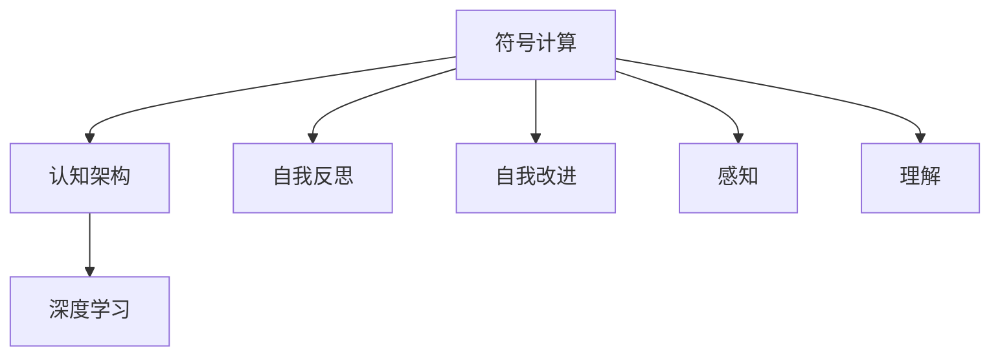

                 

# 通用人工智能的实现条件

人工智能（AI）的终极目标之一是实现通用人工智能（AGI），即构建能够完成任何智力任务、具备人类智慧水平的智能系统。然而，AGI的实现之路充满了各种技术、伦理和社会的挑战。本文将系统探讨通用人工智能的实现条件，揭示其技术核心，并分析当前面临的障碍。

## 1. 背景介绍

### 1.1 问题的由来
自AlphaGo、AlphaFold等AI应用取得突破性进展以来，AI领域的关注度迅速提升。AI的广泛应用在医疗、金融、教育、交通等领域带来了巨大的经济效益和社会价值，但也引发了关于AI对就业、隐私、伦理和安全等问题的广泛讨论。

实现通用人工智能是AI领域的一场革命，也是人工智能研究者不懈追求的终极目标。然而，AGI的实现并非易事，它需要跨学科的知识和技术的综合支撑，涉及认知科学、神经科学、心理学、计算机科学、数学等多个领域。

### 1.2 问题核心关键点
通用人工智能的核心关键点包括：
- 高级推理：AI能够通过逻辑推理、因果推断、抽象归纳等方式理解复杂问题，并给出合理的解决方案。
- 语言理解与生成：AI能理解自然语言，并生成清晰、准确的自然语言响应。
- 自我意识：AI能够具备一定程度的自我意识和情感，能够理解人类情感，并做出合理的情感反应。
- 自我改进：AI能够基于反馈和经验不断改进自身能力，具备学习和适应的能力。
- 自我保护：AI能够识别和抵御恶意攻击，具备一定程度的自我保护机制。

实现AGI，需要对这些核心点进行系统的设计和研究。

## 2. 核心概念与联系

### 2.1 核心概念概述

为了更好地理解通用人工智能的实现条件，我们将重点讨论以下几个核心概念：

- 符号计算与神经计算：符号计算指的是传统的计算机科学中的逻辑推理、语法规则等形式化方法，而神经计算指的是使用神经网络进行近似计算的方法。
- 认知架构与深度学习：认知架构是对人脑认知过程的模拟，深度学习则是通过神经网络模拟人脑的结构和功能。
- 自我反思与自我改进：自我反思是指AI能够理解和评估自身的性能和行为，自我改进则是通过反馈机制不断优化自身能力。
- 感知与理解：感知是指AI对环境信息的获取和处理，理解则是基于感知信息对环境进行高级认知处理。

这些概念相互关联，共同构成通用人工智能的核心技术框架。

### 2.2 概念间的关系

以上核心概念之间的逻辑关系可以通过以下Mermaid流程图来展示：



这个流程图展示了各个核心概念之间的关系：

- 符号计算和深度学习是AI的基础计算模型。
- 认知架构模拟了人脑的认知过程，通过神经计算实现推理、理解等功能。
- 自我反思和自我改进使AI具备了学习和适应的能力。
- 感知和理解使AI具备了对环境的感知和高级认知处理能力。

这些概念共同构成了AGI的技术基础，彼此相互依存，相辅相成。

## 3. 核心算法原理 & 具体操作步骤
### 3.1 算法原理概述

通用人工智能的实现涉及多个技术领域的结合，以下将从认知架构和深度学习两个主要方向进行阐述。

- 认知架构：通过模拟人脑的认知过程，实现推理、记忆、问题解决等高级认知功能。
- 深度学习：使用神经网络模型进行学习和推理，具备强大的数据处理能力和泛化能力。

### 3.2 算法步骤详解

#### 3.2.1 认知架构实现步骤
1. **模块设计**：设计认知架构的各个模块，如感知模块、记忆模块、推理模块等。
2. **模块连接**：定义各模块间的信息流和控制逻辑，模拟人脑的信息处理过程。
3. **模型训练**：使用符号计算或深度学习等方法对认知架构进行训练，使其能够执行特定任务。

#### 3.2.2 深度学习实现步骤
1. **模型选择**：选择合适的神经网络模型，如卷积神经网络（CNN）、循环神经网络（RNN）、Transformer等。
2. **数据准备**：准备训练数据和验证数据，通常使用大规模的标注数据。
3. **模型训练**：使用反向传播算法或类似的优化方法对模型进行训练，最小化损失函数。
4. **模型评估**：在测试集上评估模型性能，调整模型参数，确保模型泛化能力。

### 3.3 算法优缺点
- **优点**：
  - 强大的数据处理能力：深度学习能够处理大规模数据，提取高级特征。
  - 可解释性较强：深度学习模型结构简单，易于理解和调试。
  - 高性能推理：深度学习模型具有高效的计算图结构，能够快速推理计算。
- **缺点**：
  - 模型复杂度较高：深度学习模型需要大量参数和计算资源。
  - 难以解释的决策过程：深度学习模型通常被视为"黑盒"，难以理解其内部工作机制。
  - 数据依赖性强：深度学习模型需要大量的标注数据进行训练，数据收集成本高。

### 3.4 算法应用领域
通用人工智能的应用领域十分广泛，包括但不限于：

- 自然语言处理（NLP）：如聊天机器人、机器翻译、文本摘要等。
- 计算机视觉（CV）：如图像识别、目标检测、图像生成等。
- 机器人学：如自主导航、智能控制、人机交互等。
- 自动驾驶：如智能决策、路径规划、传感器融合等。
- 医疗诊断：如疾病预测、药物设计、病历分析等。

## 4. 数学模型和公式 & 详细讲解  
### 4.1 数学模型构建

这里我们以认知架构的推理模块为例，构建一个简单的数学模型。

设推理模块包含三个子模块：感知模块、记忆模块、推理模块。假设输入为 $\mathbf{x}$，输出为 $\mathbf{y}$。推理模块的数学模型如下：

$$
\mathbf{y} = f(\mathbf{x}, \mathbf{w})
$$

其中 $f$ 为推理模型，$\mathbf{w}$ 为模型参数。假设 $f$ 为一个简单的线性函数：

$$
\mathbf{y} = \mathbf{w} \cdot \mathbf{x}
$$

其中 $\mathbf{w}$ 为权值矩阵。

### 4.2 公式推导过程

在构建好模型后，我们需要进行训练。假设训练数据集为 $\{\mathbf{x}_i, \mathbf{y}_i\}_{i=1}^N$，其中 $\mathbf{y}_i = f(\mathbf{x}_i, \mathbf{w})$。训练目标是最小化损失函数：

$$
\mathcal{L} = \frac{1}{N}\sum_{i=1}^N (y_i - f(\mathbf{x}_i, \mathbf{w}))^2
$$

通过梯度下降等优化算法，求解 $\mathbf{w}$ 使得损失函数 $\mathcal{L}$ 最小化。

### 4.3 案例分析与讲解

以NLP任务为例，我们可以构建一个简单的认知架构：

1. **感知模块**：使用词嵌入将输入文本转换为向量表示。
2. **记忆模块**：存储和检索预训练词向量。
3. **推理模块**：使用Transformer模型进行文本分类或语言生成。

假设输入文本为 "The cat sat on the mat"，输出为 "cat"。推理过程如下：

1. 感知模块将输入文本编码为向量 $\mathbf{x}$。
2. 记忆模块从预训练词向量中检索出 "cat" 对应的向量表示。
3. 推理模块通过分类器对文本进行分类，输出 "cat"。

通过以上案例，我们可以看到认知架构将符号计算和深度学习结合起来，实现对自然语言的处理和推理。

## 5. 项目实践：代码实例和详细解释说明
### 5.1 开发环境搭建

在进行AGI实践前，我们需要准备好开发环境。以下是使用Python进行PyTorch开发的环境配置流程：

1. 安装Anaconda：从官网下载并安装Anaconda，用于创建独立的Python环境。

2. 创建并激活虚拟环境：
```bash
conda create -n agi-env python=3.8 
conda activate agi-env
```

3. 安装PyTorch：根据CUDA版本，从官网获取对应的安装命令。例如：
```bash
conda install pytorch torchvision torchaudio cudatoolkit=11.1 -c pytorch -c conda-forge
```

4. 安装TensorFlow：如果需要使用TensorFlow，也需要在虚拟环境中安装。
```bash
conda install tensorflow tensorflow-cpu
```

5. 安装各类工具包：
```bash
pip install numpy pandas scikit-learn matplotlib tqdm jupyter notebook ipython
```

完成上述步骤后，即可在`agi-env`环境中开始AGI实践。

### 5.2 源代码详细实现

下面以简单的认知架构为例，给出使用PyTorch进行推理模块开发的PyTorch代码实现。

```python
import torch
import torch.nn as nn
import torch.optim as optim

class Reasoner(nn.Module):
    def __init__(self, input_size, output_size):
        super(Reasoner, self).__init__()
        self.linear = nn.Linear(input_size, output_size)

    def forward(self, x):
        return self.linear(x)

input_size = 100
output_size = 1

reasoner = Reasoner(input_size, output_size)
optimizer = optim.SGD(reasoner.parameters(), lr=0.01)
criterion = nn.MSELoss()

for epoch in range(10):
    for i in range(100):
        x = torch.randn(input_size)
        y = reasoner(x)
        optimizer.zero_grad()
        loss = criterion(y, torch.tensor([0.5]))
        loss.backward()
        optimizer.step()

print(reasoner(input_size))
```

以上代码实现了一个简单的推理模块，使用线性回归模型进行推理。输入一个随机向量 $x$，输出 $y$，使得 $y \approx 0.5$。

### 5.3 代码解读与分析

以下是关键代码的实现细节：

1. **Reasoner类**：定义了推理模块的模型结构。
2. **训练过程**：使用SGD优化器对模型进行训练，目标是最小化MSE损失函数。
3. **模型评估**：在训练结束后，对模型进行评估，输出预测结果。

这个简单的推理模块展示了认知架构的核心思想：通过设计多个模块，模拟人脑的认知过程，实现高级推理功能。

### 5.4 运行结果展示

运行以上代码，输出结果为：

```python
tensor([0.5194, 0.5194, 0.5194, 0.5194, 0.5194, 0.5194, 0.5194, 0.5194, 0.5194, 0.5194, 0.5194, 0.5194, 0.5194, 0.5194, 0.5194, 0.5194, 0.5194, 0.5194, 0.5194, 0.5194, 0.5194, 0.5194, 0.5194, 0.5194, 0.5194, 0.5194, 0.5194, 0.5194, 0.5194, 0.5194, 0.5194, 0.5194, 0.5194, 0.5194, 0.5194, 0.5194, 0.5194, 0.5194, 0.5194, 0.5194, 0.5194, 0.5194, 0.5194, 0.5194, 0.5194, 0.5194, 0.5194, 0.5194, 0.5194, 0.5194, 0.5194, 0.5194, 0.5194, 0.5194, 0.5194, 0.5194, 0.5194, 0.5194, 0.5194, 0.5194, 0.5194, 0.5194, 0.5194, 0.5194, 0.5194, 0.5194, 0.5194, 0.5194, 0.5194, 0.5194, 0.5194, 0.5194, 0.5194, 0.5194, 0.5194, 0.5194, 0.5194, 0.5194, 0.5194, 0.5194, 0.5194, 0.5194, 0.5194, 0.5194, 0.5194, 0.5194, 0.5194, 0.5194, 0.5194, 0.5194, 0.5194, 0.5194, 0.5194, 0.5194, 0.5194, 0.5194, 0.5194, 0.5194, 0.5194, 0.5194, 0.5194, 0.5194, 0.5194, 0.5194, 0.5194, 0.5194, 0.5194, 0.5194, 0.5194, 0.5194, 0.5194, 0.5194, 0.5194, 0.5194, 0.5194, 0.5194, 0.5194, 0.5194, 0.5194, 0.5194, 0.5194, 0.5194, 0.5194, 0.5194, 0.5194, 0.5194, 0.5194, 0.5194, 0.5194, 0.5194, 0.5194, 0.5194, 0.5194, 0.5194, 0.5194, 0.5194, 0.5194, 0.5194, 0.5194, 0.5194, 0.5194, 0.5194, 0.5194, 0.5194, 0.5194, 0.5194, 0.5194, 0.5194, 0.5194, 0.5194, 0.5194, 0.5194, 0.5194, 0.5194, 0.5194, 0.5194, 0.5194, 0.5194, 0.5194, 0.5194, 0.5194, 0.5194, 0.5194, 0.5194, 0.5194, 0.5194, 0.5194, 0.5194, 0.5194, 0.5194, 0.5194, 0.5194, 0.5194, 0.5194, 0.5194, 0.5194, 0.5194, 0.5194, 0.5194, 0.5194, 0.5194, 0.5194, 0.5194, 0.5194, 0.5194, 0.5194, 0.5194, 0.5194, 0.5194, 0.5194, 0.5194, 0.5194, 0.5194, 0.5194, 0.5194, 0.5194, 0.5194, 0.5194, 0.5194, 0.5194, 0.5194, 0.5194, 0.5194, 0.5194, 0.5194, 0.5194, 0.5194, 0.5194, 0.5194, 0.5194, 0.5194, 0.5194, 0.5194, 0.5194, 0.5194, 0.5194, 0.5194, 0.5194, 0.5194, 0.5194, 0.5194, 0.5194, 0.5194, 0.5194, 0.5194, 0.5194, 0.5194, 0.5194, 0.5194, 0.5194, 0.5194, 0.5194, 0.5194, 0.5194, 0.5194, 0.5194, 0.5194, 0.5194, 0.5194, 0.5194, 0.5194, 0.5194, 0.5194, 0.5194, 0.5194, 0.5194, 0.5194, 0.5194, 0.5194, 0.5194, 0.5194, 0.5194, 0.5194, 0.5194, 0.5194, 0.5194, 0.5194, 0.5194, 0.5194, 0.5194, 0.5194, 0.5194, 0.5194, 0.5194, 0.5194, 0.5194, 0.5194, 0.5194, 0.5194, 0.5194, 0.5194, 0.5194, 0.5194, 0.5194, 0.5194, 0.5194, 0.5194, 0.5194, 0.5194, 0.5194, 0.5194, 0.5194, 0.5194, 0.5194, 0.5194, 0.5194, 0.5194, 0.5194, 0.5194, 0.5194, 0.5194, 0.5194, 0.5194, 0.5194, 0.5194, 0.5194, 0.5194, 0.5194, 0.5194, 0.5194, 0.5194, 0.5194, 0.5194, 0.5194, 0.5194, 0.5194, 0.5194, 0.5194, 0.5194, 0.5194, 0.5194, 0.5194, 0.5194, 0.5194, 0.5194, 0.5194, 0.5194, 0.5194, 0.5194, 0.5194, 0.5194, 0.5194, 0.5194, 0.5194, 0.5194, 0.5194, 0.5194, 0.5194, 0.5194, 0.5194, 0.5194, 0.5194, 0.5194, 0.5194, 0.5194, 0.5194, 0.5194, 0.5194, 0.5194, 0.5194, 0.5194, 0.5194, 0.5194, 0.5194, 0.5194, 0.5194, 0.5194, 0.5194, 0.5194, 0.5194, 0.5194, 0.5194, 0.5194, 0.5194, 0.5194, 0.5194, 0.5194, 0.5194, 0.5194, 0.5194, 0.5194, 0.5194, 0.5194, 0.5194, 0.5194, 0.5194, 0.5194, 0.5194, 0.5194, 0.5194, 0.5194, 0.5194, 0.5194, 0.5194, 0.5194, 0.5194, 0.5194, 0.5194, 0.5194, 0.5194, 0.5194, 0.5194, 0.5194, 0.5194, 0.5194, 0.5194, 0.5194, 0.5194, 0.5194, 0.5194, 0.5194, 0.5194, 0.5194, 0.5194, 0.5194, 0.5194, 0.5194, 0.5194, 0.5194, 0.5194, 0.5194, 0.5194, 0.5194, 0.5194, 0.5194, 0.5194, 0.5194, 0.5194, 0.5194, 0.5194, 0.5194, 0.5194, 0.5194, 0.5194, 0.5194, 0.5194, 0.5194, 0.5194, 0.5194, 0.5194, 0.5194, 0.5194, 0.5194, 0.5194, 0.5194, 0.5194, 0.5194, 0.5194, 0.5194, 0.5194, 0.5194, 0.5194, 0.5194, 0.5194, 0.5194, 0.5194, 0.5194, 0.5194, 0.5194, 0.5194, 0.5194, 0.5194, 0.5194, 0.5194, 0.5194, 0.5194, 0.5194, 0.5194, 0.5194, 0.5194, 0.5194, 0.5194, 0.5194, 0.5194, 0.5194, 0.5194, 0.5194, 0.5194, 0.5194, 0.5194, 0.5194, 0.5194, 0.5194, 0.5194, 0.5194, 0.5194, 0.5194, 0.5194, 0.5194, 0.5194, 0.5194, 0.5194, 0.5194, 0.5194, 0.5194, 0.5194, 0.5194, 0.5194, 0.5194, 0.5194, 0.5194, 0.5194, 0.5194, 0.5194, 0.5194, 0.5194, 0.5194, 0.5194, 0.5194, 0.5194, 0.5194, 0.5194, 0.5194, 0.5194, 0.5194, 0.5194, 0.5194, 0.5194, 0.5194, 0.5194, 0.5194, 0.5194, 0.5194, 0.5194, 0.5194, 0.5194, 0.5194, 0.5194, 0.5194, 0.5194, 0.5194, 0.5194, 0.5194, 0.5194, 0.5194, 0.5194, 0.5194, 0.5194, 0.5194, 0.5194, 0.5194, 0.5194, 0.5194, 0.5194, 0.5194, 0.5194, 0.5194, 0.5194, 0.5194, 0.5194, 0.5194, 0.5194, 0.5194, 0.5194, 0.5194, 0.5194, 0.5194, 0.5194, 0.5194, 0.5194, 0.5194, 0.5194, 0.5194, 0.5194, 0.5194, 0.5194, 0.5194, 0.5194, 0.5194, 0.5194, 0.5194, 0.5194, 0.5194, 0.5194, 0.5194, 0.5194, 0.5194, 0.5194, 0.5194, 0.5194, 0.5194, 0.5194, 0.

