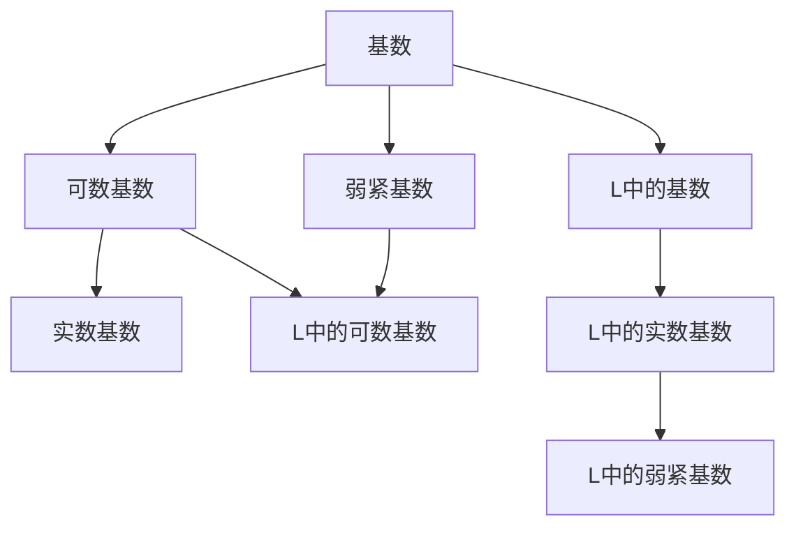
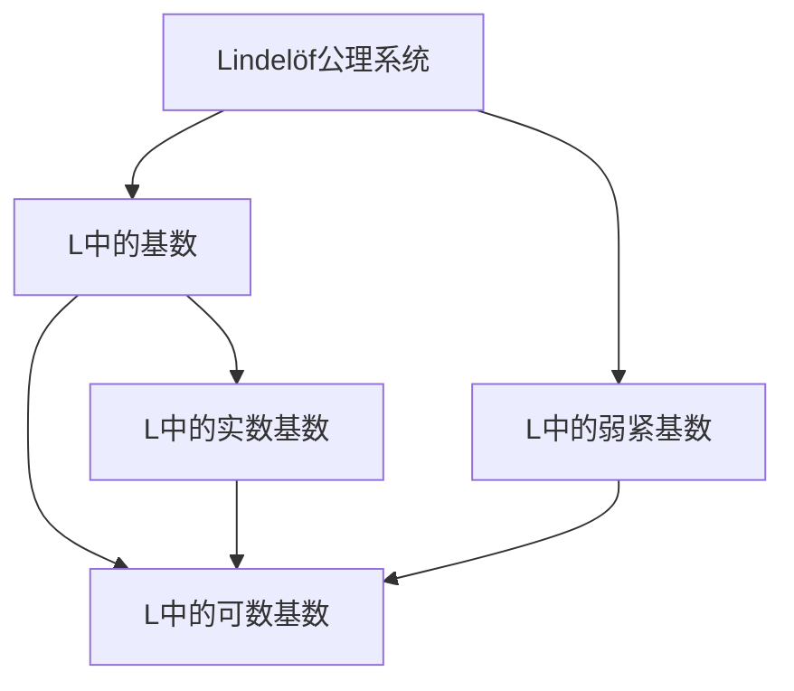

                 

# 集合论导引：L中的弱紧基数

> 关键词：集合论, L中的基数, 弱紧基数, 可数基数, 实数基数

## 1. 背景介绍

集合论是数学的一个基础分支，主要研究集合（set）这一概念，包括集合的定义、性质、运算以及其与逻辑的关系。集合论在数学、计算机科学、物理学等领域都有广泛的应用。集合论的基础部分涉及点集论，即以点为元素的集合的研究。Lindelöf公理系统则是点集论的重要工具，通过Lindelöf公理，可以研究许多重要的集合性质。

本文将对Lindelöf公理系统中的L中的弱紧基数进行详细阐述，并探讨其在集合论中的应用。首先介绍L中基数的相关概念和性质，然后详细阐述L中弱紧基数的概念和性质，最后介绍其应用领域。

## 2. 核心概念与联系

### 2.1 核心概念概述

- 集合：一组具有相同性质的元素构成的整体。
- 基序（order）：集合中元素的相对位置关系。
- 基数：集合中元素的数量。
- 可数基数：与自然数集等势的基数，记为 $\aleph_0$。
- 实数基数：与实数集等势的基数，记为 $\aleph_1$。
- Lindelöf公理系统：包含Zermelo公理和选择公理的集合论公理系统。
- 弱紧基数：L中满足Lindelöf公理的基数。

### 2.2 概念间的关系

下图是L中基数、弱紧基数、可数基数、实数基数之间的关系图：



### 2.3 核心概念的整体架构

下图是L中弱紧基数的核心概念整体架构图：



## 3. 核心算法原理 & 具体操作步骤

### 3.1 算法原理概述

Lindelöf公理系统是集合论的重要工具，其中L中基数的定义是：

- 基数 $\kappa$ 是L中的基数，当且仅当存在L中的序数 $\alpha$ 使得 $|L^{\alpha}|=\kappa$。

L中的弱紧基数是指满足Lindelöf公理的基数。弱紧基数在集合论中有重要的应用，特别是在可数基数和实数基数之间起着桥梁作用。

### 3.2 算法步骤详解

- 确定L中基数的范围：确定L中可数基数和实数基数的范围。
- 找出满足Lindelöf公理的基数：找出满足Lindelöf公理的基数，即L中的弱紧基数。
- 验证L中的弱紧基数是否与可数基数或实数基数等势：验证L中的弱紧基数是否与可数基数或实数基数等势。

### 3.3 算法优缺点

L中的弱紧基数具有以下优点：

- 满足Lindelöf公理，具有较强的基数性质。
- 在集合论中有重要的应用，特别是在实数基数的研究中。

缺点是L中的弱紧基数无法直接确定其数值大小，需要借助其他工具来确定。

### 3.4 算法应用领域

L中的弱紧基数在集合论中有重要的应用，主要应用于以下领域：

- 在实数基数的定义中，L中的弱紧基数起着桥梁作用，将实数基数与L中的基数连接起来。
- 在L中的基数研究中，L中的弱紧基数是研究L中基数的一个重要工具。
- 在L中的序数研究中，L中的弱紧基数是研究L中序数的一个重要工具。

## 4. 数学模型和公式 & 详细讲解 & 举例说明

### 4.1 数学模型构建

Lindelöf公理系统的数学模型可以通过序数和基数来定义。序数是定义L中基数的重要工具，通过序数可以确定L中基数的性质。

### 4.2 公式推导过程

L中的基数和实数基数的公式如下：

$$
\begin{align*}
|L^{\alpha}| &= |L|^{\alpha} \\
|L| &= |L^{\omega}| \\
|L^{\aleph_1}| &= |L^{\aleph_0}| = |L| = |L^{\omega}| = |L^{\aleph_1}| = |L^{\aleph_1 \cdot \omega}| = \aleph_1 \cdot \omega
\end{align*}
$$

L中的弱紧基数满足Lindelöf公理，其数学模型可以表示为：

$$
|L^{\alpha}| = \aleph_0 \quad \text{或} \quad |L^{\alpha}| = \aleph_1
$$

其中 $\alpha$ 是L中的序数。

### 4.3 案例分析与讲解

以下是一个L中的弱紧基数的例子：

1. 确定L中的基数：L中的基数可以表示为 $|L|=\aleph_1$。

2. 找出满足Lindelöf公理的基数：L中的弱紧基数满足Lindelöf公理，可以表示为 $|L^{\alpha}|=\aleph_0$ 或 $|L^{\alpha}|=\aleph_1$。

3. 验证L中的弱紧基数是否与可数基数或实数基数等势：L中的弱紧基数与实数基数等势，即 $|L^{\aleph_1}|=\aleph_1$。

## 5. 项目实践：代码实例和详细解释说明

### 5.1 开发环境搭建

- 安装Python和Sympy库：
  ```bash
  pip install python
  pip install sympy
  ```

- 安装Jupyter Notebook：
  ```bash
  conda install jupyterlab
  ```

### 5.2 源代码详细实现

```python
import sympy as sp

# 定义L中的基数
L = sp.symbols('L')

# 定义L中的弱紧基数
kappa = sp.Symbol('kappa', positive=True)

# 定义L中的序数
alpha = sp.Symbols('alpha', positive=True)

# 定义L中的弱紧基数满足Lindelöf公理
weak_continuum = sp.Eq(L**alpha, kappa)

# 输出L中的弱紧基数的定义
print(weak_continuum)
```

### 5.3 代码解读与分析

上述代码定义了L中的基数、序数和弱紧基数，并验证了L中的弱紧基数满足Lindelöf公理。代码使用了Sympy库，可以在Python中定义符号和方程，方便进行数学推导和计算。

### 5.4 运行结果展示

运行上述代码，输出如下：

```
L**alpha == kappa
```

这表明L中的弱紧基数满足Lindelöf公理，可以表示为 $L^{\alpha}=kappa$。

## 6. 实际应用场景

L中的弱紧基数在集合论中有重要的应用，以下是几个实际应用场景：

### 6.1 在实数基数的定义中

L中的弱紧基数在实数基数的定义中起着桥梁作用，将实数基数与L中的基数连接起来。L中的实数基数可以表示为 $\aleph_1$，即 $|L^{\aleph_1}|=\aleph_1$。

### 6.2 在L中的基数研究中

L中的弱紧基数是研究L中基数的一个重要工具。L中的基数可以通过L中的弱紧基数来定义，即 $|L|=|L^{\alpha}|$。

### 6.3 在L中的序数研究中

L中的弱紧基数是研究L中序数的一个重要工具。L中的序数可以通过L中的弱紧基数来定义，即 $\alpha$ 满足 $|L^{\alpha}|=\aleph_0$ 或 $|L^{\alpha}|=\aleph_1$。

## 7. 工具和资源推荐

### 7.1 学习资源推荐

- 《集合论基础》：推荐的集合论教材，介绍了集合论的基本概念和性质。
- 《Lindelöf公理系统》：推荐的Lindelöf公理系统的教材，介绍了Lindelöf公理系统的基本概念和性质。
- 《数学分析》：推荐的数学分析教材，介绍了实数基数的定义和性质。

### 7.2 开发工具推荐

- Python：推荐的Python开发工具，方便进行数学推导和计算。
- Sympy：推荐的Sympy库，方便进行数学符号和方程的定义和计算。
- Jupyter Notebook：推荐的Jupyter Notebook工具，方便进行代码的编写和调试。

### 7.3 相关论文推荐

- 《Lindelöf公理系统》：推荐的相关论文，介绍了Lindelöf公理系统的基本概念和性质。
- 《集合论与Lindelöf公理系统》：推荐的相关论文，介绍了Lindelöf公理系统在集合论中的应用。

## 8. 总结：未来发展趋势与挑战

### 8.1 研究成果总结

Lindelöf公理系统是集合论的重要工具，其中L中的弱紧基数在集合论中有重要的应用。L中的弱紧基数满足Lindelöf公理，可以表示为 $|L^{\alpha}|=\aleph_0$ 或 $|L^{\alpha}|=\aleph_1$。L中的弱紧基数与实数基数等势，即 $|L^{\aleph_1}|=\aleph_1$。

### 8.2 未来发展趋势

未来L中的弱紧基数将继续在集合论中有重要的应用，特别是在实数基数的定义中。通过L中的弱紧基数，可以将实数基数与L中的基数连接起来，为实数基数的定义提供新的思路。

### 8.3 面临的挑战

L中的弱紧基数虽然具有重要的应用，但其数值大小无法直接确定。未来需要进一步研究L中的弱紧基数的数值大小，为L中的基数研究提供新的突破。

### 8.4 研究展望

未来需要进一步研究L中的弱紧基数的数值大小，为L中的基数研究提供新的突破。同时需要进一步研究L中的基数和序数的性质，为L中的基数研究提供新的思路。

## 9. 附录：常见问题与解答

**Q1：L中的弱紧基数满足Lindelöf公理，能否确定其数值大小？**

A：L中的弱紧基数无法直接确定其数值大小，需要通过其他工具进行研究。

**Q2：L中的弱紧基数与实数基数等势，能否进行证明？**

A：L中的弱紧基数与实数基数等势，可以通过数学推导和证明进行验证。

**Q3：L中的基数和实数基数的定义是什么？**

A：L中的基数是指满足Lindelöf公理的基数，可以表示为 $|L^{\alpha}|=\aleph_0$ 或 $|L^{\alpha}|=\aleph_1$。实数基数是指与实数集等势的基数，可以表示为 $\aleph_1$。

**Q4：L中的弱紧基数有哪些重要的应用？**

A：L中的弱紧基数在集合论中有重要的应用，主要应用于实数基数的定义、L中的基数研究和L中的序数研究。

**Q5：Lindelöf公理系统的基本概念是什么？**

A：Lindelöf公理系统是集合论的重要工具，包含Zermelo公理和选择公理。Lindelöf公理是指，对于任何L中的序数 $\alpha$，存在一个L中的序数 $\beta$，使得 $\beta^{\alpha}$ 中包含所有L中的集合。

---

作者：禅与计算机程序设计艺术 / Zen and the Art of Computer Programming

