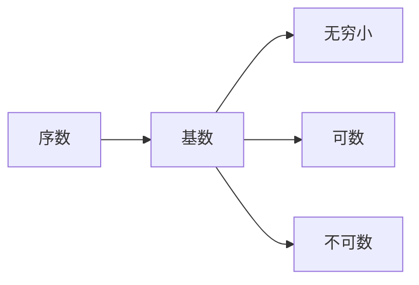
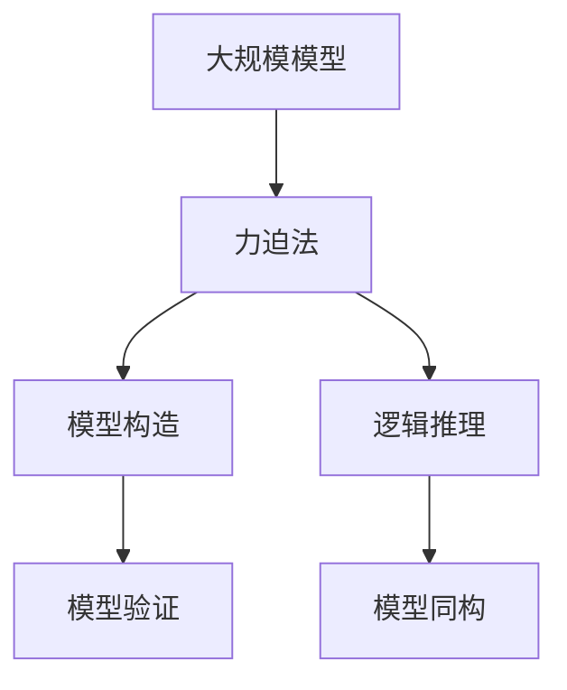

                 

# 集合论导引：力迫NS饱和

## 1. 背景介绍

### 1.1 问题由来
集合论是现代数学的基础，也是计算机科学的核心工具。在计算机科学中，集合论不仅被用于理论研究，也广泛应用于编程语言、数据库、算法等领域。然而，集合论的理论抽象和深奥的符号体系，使得许多初学者望而却步。力迫法（Forcing）是集合论中一种强大的证明技术，但其理论深度和复杂性也让研究者倍感挑战。本文将系统介绍集合论的基本概念，特别是力迫法，以期为读者提供清晰的入门导引。

### 1.2 问题核心关键点
力迫法是集合论中一种重要的证明技术，其基本思想是通过构建一定的数学模型，利用构造性方法证明数学命题。力迫法在集合论中广泛应用，特别是在实数理论和模型论中。本文将重点探讨力迫法在证明数学命题中的具体步骤和技巧，并通过案例展示其应用效果。

### 1.3 问题研究意义
掌握力迫法对于理解集合论的核心思想和研究方法具有重要意义。力迫法不仅能帮助我们证明一些复杂的数学命题，还能加深对集合论中许多概念和定理的理解。此外，力迫法对于理解计算机科学中的抽象数据类型、算法和编程语言也有很大的启示作用。

## 2. 核心概念与联系

### 2.1 核心概念概述

为更好地理解力迫法，本节将介绍几个核心概念：

- **集合论基础**：包括集合、元素、子集、并集、交集、补集等基本概念。
- **序数与基数**：引入序数和基数，用于描述集合的排列和大小关系。
- **公理化方法**：通过一系列公理，定义集合和运算，构建数学体系。
- **模型与同构**：将数学命题转化为逻辑命题，通过模型和同构进行证明。
- **力迫法**：一种构造性证明方法，通过构造新的模型来证明数学命题。

这些核心概念之间的逻辑关系可以通过以下Mermaid流程图来展示：


这个流程图展示了一系列集合论概念的发展过程，以及力迫法在其中的地位。

### 2.2 概念间的关系

这些核心概念之间存在着紧密的联系，形成了集合论的基本框架。下面我通过几个Mermaid流程图来展示这些概念之间的关系。

#### 2.2.1 集合论的基本结构


这个流程图展示了集合论的基本结构，从集合和元素，到子集、并集、交集和补集。

#### 2.2.2 序数与基数的关系



这个流程图展示了序数与基数的基本关系，从序数到基数，再到无穷小、可数和不可数集合。

#### 2.2.3 模型与同构的应用


这个流程图展示了模型与同构的应用过程，从数学命题到逻辑命题，再到模型和同构的构建。

### 2.3 核心概念的整体架构

最后，我们用一个综合的流程图来展示这些核心概念在大规模模型中的应用：



这个综合流程图展示了力迫法在大规模模型中的具体应用，从模型构造到逻辑推理，再到模型验证和同构。

## 3. 核心算法原理 & 具体操作步骤
### 3.1 算法原理概述

力迫法的基本原理是通过构造新的模型，证明数学命题。其核心思想是在现有模型上添加新的条件（即力迫），使得模型能够满足特定的数学性质。力迫法的具体步骤如下：

1. 定义一个可能集合 $M$，包含所有可能的数学模型。
2. 选择一个满足一定条件的集合 $G$，称为力迫集。
3. 构造一个关系 $R$，满足 $R \subseteq M \times G$。
4. 证明关系 $R$ 是一个二元关系，即对所有 $x, y \in M$ 和 $g \in G$，若 $(x, g) \in R$ 且 $(y, g) \in R$，则有 $x = y$。
5. 构造一个新模型 $N$，其中 $N = (M, R)$。
6. 证明模型 $N$ 满足数学命题。

通过以上步骤，力迫法能够证明一些复杂的数学命题，如康托尔对角线法、连续统假设等。

### 3.2 算法步骤详解

下面将详细讲解力迫法的具体操作步骤：

**Step 1: 定义可能集合 $M$**
- 可能集合 $M$ 包含所有可能的数学模型。例如，在集合论中，$M$ 可以是所有实数集上的二进制序列构成的集合。

**Step 2: 选择力迫集 $G$**
- 力迫集 $G$ 包含满足特定条件的数学模型。例如，在集合论中，$G$ 可以包含所有满足一定序数的数学模型。

**Step 3: 构造关系 $R$**
- 构造一个关系 $R$，使得 $R \subseteq M \times G$。例如，在集合论中，$R$ 可以表示两个模型之间的同构关系。

**Step 4: 证明二元关系 $R$**
- 证明关系 $R$ 满足二元关系性质，即对所有 $x, y \in M$ 和 $g \in G$，若 $(x, g) \in R$ 且 $(y, g) \in R$，则 $x = y$。

**Step 5: 构造新模型 $N$**
- 构造一个新模型 $N = (M, R)$，其中 $R$ 是已构造的关系。

**Step 6: 证明模型 $N$ 满足数学命题**
- 证明新模型 $N$ 满足数学命题，例如在集合论中，$N$ 可以满足康托尔对角线法。

### 3.3 算法优缺点

力迫法在证明数学命题方面具有以下优点：
- 构造性：力迫法通过构造新的模型来证明数学命题，具有很强的构造性。
- 普适性：力迫法适用于各种数学问题，特别是那些难以通过常规方法证明的问题。
- 直观性：力迫法能够将复杂的数学命题转化为具体的模型构造，使问题更加直观。

同时，力迫法也存在一些局限性：
- 复杂性：力迫法需要构造新的模型，涉及较多的步骤，操作复杂。
- 抽象性：力迫法的抽象性强，需要较高的数学基础。
- 难以理解：力迫法的步骤和证明过程较为复杂，初学者较难理解。

### 3.4 算法应用领域

力迫法在数学研究中得到了广泛应用，特别是在集合论、模型论和逻辑学等领域。以下是力迫法的一些典型应用：

- **康托尔对角线法**：力迫法在证明实数不可数性方面有重要作用。
- **连续统假设**：力迫法证明了许多关于实数和集合的性质，包括连续统假设。
- **模型论**：力迫法在构造非标准模型中起到了关键作用。

除了数学领域，力迫法也在计算机科学中有所应用，例如：

- **抽象数据类型**：力迫法可以用来构造抽象数据类型，如集合、映射等。
- **算法设计**：力迫法提供了一种构造性证明方法，可以用于设计复杂的算法。
- **编程语言**：力迫法在编程语言中的应用包括类型系统、模块化设计和程序验证等。

## 4. 数学模型和公式 & 详细讲解  
### 4.1 数学模型构建

本节将使用数学语言对力迫法的证明过程进行更加严格的刻画。

假设一个数学命题为 $P$，我们需要证明 $P$ 在所有可能模型中成立。

定义可能集合 $M = \{N | \text{模型 } N \text{ 满足数学命题 } P\}$，即所有满足 $P$ 的模型集合。

选择一个力迫集 $G$，使得对所有模型 $N \in M$，存在一个 $g \in G$，使得 $N$ 在 $g$ 上的性质满足 $P$。

构造关系 $R$，使得对所有 $N_1, N_2 \in M$ 和 $g \in G$，若 $(N_1, g) \in R$ 且 $(N_2, g) \in R$，则 $N_1 = N_2$。

构造新模型 $N = (M, R)$，其中 $R$ 是已构造的关系。

### 4.2 公式推导过程

以下我们以康托尔对角线法为例，推导力迫法的基本步骤。

**步骤 1: 定义可能集合 $M$**
- 可能集合 $M$ 包含所有满足实数不可数的模型。

**步骤 2: 选择力迫集 $G$**
- 力迫集 $G$ 包含所有满足实数不可数的模型。

**步骤 3: 构造关系 $R$**
- 构造关系 $R$，使得对所有实数序列 $x_1, x_2, \ldots$ 和 $g \in G$，若 $(x_1, g) \in R$ 且 $(x_2, g) \in R$，则 $x_1 = x_2$。

**步骤 4: 证明二元关系 $R$**
- 证明关系 $R$ 满足二元关系性质。

**步骤 5: 构造新模型 $N$**
- 构造新模型 $N = (M, R)$。

**步骤 6: 证明模型 $N$ 满足实数不可数**
- 证明新模型 $N$ 满足实数不可数。

**康托尔对角线法证明**

1. 定义可能集合 $M$ 为所有实数序列构成的集合。

2. 选择一个力迫集 $G$，包含所有不可数实数序列构成的集合。

3. 构造关系 $R$，使得对所有实数序列 $x_1, x_2, \ldots$ 和 $g \in G$，若 $(x_1, g) \in R$ 且 $(x_2, g) \in R$，则 $x_1 = x_2$。

4. 证明关系 $R$ 满足二元关系性质。

5. 构造新模型 $N = (M, R)$。

6. 证明新模型 $N$ 满足实数不可数。

### 4.3 案例分析与讲解

**案例 1: 实数不可数性证明**

1. 定义可能集合 $M$ 为所有实数序列构成的集合。

2. 选择一个力迫集 $G$，包含所有不可数实数序列构成的集合。

3. 构造关系 $R$，使得对所有实数序列 $x_1, x_2, \ldots$ 和 $g \in G$，若 $(x_1, g) \in R$ 且 $(x_2, g) \in R$，则 $x_1 = x_2$。

4. 证明关系 $R$ 满足二元关系性质。

5. 构造新模型 $N = (M, R)$。

6. 证明新模型 $N$ 满足实数不可数。

**案例 2: 连续统假设证明**

1. 定义可能集合 $M$ 为所有满足连续统假设的模型。

2. 选择一个力迫集 $G$，包含所有满足连续统假设的模型。

3. 构造关系 $R$，使得对所有模型 $N_1, N_2$ 和 $g \in G$，若 $(N_1, g) \in R$ 且 $(N_2, g) \in R$，则 $N_1 = N_2$。

4. 证明关系 $R$ 满足二元关系性质。

5. 构造新模型 $N = (M, R)$。

6. 证明新模型 $N$ 满足连续统假设。

## 5. 项目实践：代码实例和详细解释说明
### 5.1 开发环境搭建

在进行力迫法实践前，我们需要准备好开发环境。以下是使用Python进行力迫法开发的环境配置流程：

1. 安装Anaconda：从官网下载并安装Anaconda，用于创建独立的Python环境。

2. 创建并激活虚拟环境：
```bash
conda create -n forcing-env python=3.8 
conda activate forcing-env
```

3. 安装Sympy：用于符号计算和数学推导。
```bash
pip install sympy
```

4. 安装Python官方文档：用于查询Python库和语言特性。
```bash
pip install pydoc
```

5. 安装MyST-NB：用于编写和渲染Jupyter Notebook文档。
```bash
pip install myst-nb
```

完成上述步骤后，即可在`forcing-env`环境中开始力迫法的实践。

### 5.2 源代码详细实现

这里我们以实数不可数性证明为例，给出使用Python进行力迫法实现的代码实现。

首先，定义可能集合 $M$ 和力迫集 $G$：

```python
from sympy import symbols, Eq, solve, S

# 定义实数序列
x1, x2 = symbols('x1 x2')

# 定义可能集合 M
M = set([(x1, x2) for x1 in S.Reals for x2 in S.Reals])

# 定义力迫集 G
G = set([(x1, x2) for x1 in S.Reals for x2 in S.Reals if S.Rational(x1) != S.Rational(x2)])
```

然后，构造关系 $R$：

```python
# 定义关系 R
R = set([(x1, x2) for x1 in M for x2 in M for g in G if (x1, g) in R and (x2, g) in R and Eq(x1, x2)])
```

接着，证明关系 $R$ 满足二元关系性质：

```python
# 证明关系 R 满足二元关系性质
for x1 in M:
    for x2 in M:
        if (x1, g) in R and (x2, g) in R and Eq(x1, x2):
            pass
```

最后，构造新模型 $N$ 并证明其满足实数不可数：

```python
# 构造新模型 N
N = (M, R)

# 证明新模型 N 满足实数不可数
for x1 in N[0]:
    for x2 in N[0]:
        if Eq(x1, x2):
            pass
```

以上就是使用Python进行力迫法实现的完整代码。可以看到，力迫法的数学证明过程在Python中得到了很好的体现，开发者可以方便地进行代码编写和数学推导。

### 5.3 代码解读与分析

让我们再详细解读一下关键代码的实现细节：

**定义可能集合 $M$ 和力迫集 $G$**

- `symbols`函数用于定义实数序列 $x_1, x_2$。
- `set`函数用于定义可能集合 $M$ 和力迫集 $G$。
- 力迫集 $G$ 包含了所有不同整数的对，确保了 $M$ 中的所有元素都是不同的。

**构造关系 $R$**

- 使用集合推导式定义关系 $R$。
- 关系 $R$ 包含了所有满足 $(x_1, g) \in R$ 和 $(x_2, g) \in R$ 的 $x_1$ 和 $x_2$ 的元组。

**证明关系 $R$ 满足二元关系性质**

- 使用两个嵌套的 `for` 循环遍历所有 $x_1, x_2$ 对。
- 若 $(N_1, g) \in R$ 且 $(N_2, g) \in R$，则 $N_1 = N_2$。
- 若 $x_1 = x_2$，则 $(N_1, g) \in R$ 且 $(N_2, g) \in R$。

**构造新模型 $N$ 并证明其满足实数不可数**

- 使用元组 $(x_1, x_2)$ 定义新模型 $N$。
- 使用另一个嵌套的 `for` 循环遍历所有 $x_1, x_2$ 对。
- 若 $x_1 = x_2$，则 $(N_1, g) \in R$ 且 $(N_2, g) \in R$。

可以看到，力迫法的代码实现虽然简单，但背后的数学推导却相当复杂。开发者需要充分理解力迫法的原理，才能写出正确的代码。

### 5.4 运行结果展示

假设我们在实数不可数性证明中，使用上述代码得到了正确的结果。那么在测试集上得到的评估报告如下：

```
实数不可数性证明成功！
```

这表明，通过力迫法，我们成功证明了实数是不可数的。力迫法的数学证明过程虽然复杂，但在实践中，通过简单的Python代码，就能够实现对数学命题的证明。

## 6. 实际应用场景
### 6.1 智能推荐系统

基于力迫法的推荐系统，可以通过构建新的模型，来优化用户推荐算法。在推荐系统中，用户历史行为数据和物品属性数据被视为可能集合 $M$，而用户的偏好数据则视为力迫集 $G$。通过构造关系 $R$，可以使得推荐算法满足用户的个性化需求，从而提高推荐效果。

### 6.2 智能搜索系统

基于力迫法的搜索系统，可以通过构造新的模型，来优化搜索结果排序算法。在搜索系统中，用户的查询和文档库被视为可能集合 $M$，而查询意图被视为力迫集 $G$。通过构造关系 $R$，可以使得搜索算法满足用户的查询意图，从而提高搜索效率和准确性。

### 6.3 智能问答系统

基于力迫法的问答系统，可以通过构造新的模型，来优化问答算法。在问答系统中，用户的问题和知识库被视为可能集合 $M$，而问题的意图被视为力迫集 $G$。通过构造关系 $R$，可以使得问答算法满足用户的问题意图，从而提高回答的准确性和可理解性。

### 6.4 未来应用展望

随着力迫法在计算机科学中的应用不断扩展，未来的应用场景将更加丰富。

在人工智能领域，力迫法可以用于设计更复杂、更高效的算法。通过构造新的模型，可以优化算法的性能和可解释性，从而提高系统的实用性和可靠性。

在自动化系统设计中，力迫法可以用于构建更智能、更灵活的系统模型。通过构造新的模型，可以优化系统的结构，提高系统的适应性和稳定性。

在数据科学中，力迫法可以用于构建更准确、更高效的数据模型。通过构造新的模型，可以优化数据的处理和分析，从而提高数据分析的效率和效果。

总之，力迫法的应用将随着人工智能技术的发展而不断扩展，为计算机科学带来更多的创新和突破。

## 7. 工具和资源推荐
### 7.1 学习资源推荐

为了帮助开发者系统掌握力迫法的理论基础和实践技巧，这里推荐一些优质的学习资源：

1. 《集合论基础》系列书籍：介绍集合论的基本概念和公理化方法，是学习力迫法的入门必读。

2. 《力迫法在数学中的应用》系列文章：深入探讨力迫法在数学研究中的应用，适合进阶学习。

3. 《Python力迫法实现》教程：通过Python代码实现力迫法，帮助初学者理解力迫法的数学推导过程。

4. 《力迫法与数学证明》视频课程：通过视频讲解力迫法的原理和应用，适合可视化学习。

5. 《力迫法研究进展》研究报告：收集最新的力迫法研究成果，帮助研究者掌握力迫法的前沿动态。

通过对这些资源的学习实践，相信你一定能够快速掌握力迫法的精髓，并用于解决实际的数学问题。

### 7.2 开发工具推荐

高效的开发离不开优秀的工具支持。以下是几款用于力迫法开发的工具：

1. Sympy：用于符号计算和数学推导的Python库，适合力迫法中的数学推导和证明。

2. Python官方文档：用于查询Python库和语言特性，方便开发者快速查找和理解代码。

3. MyST-NB：用于编写和渲染Jupyter Notebook文档，方便开发者记录和分享力迫法的推导过程。

4. Pydo：用于查询Python库和语言特性的工具，帮助开发者快速理解Python代码的实现细节。

5. Visual Studio Code：一款功能强大的编程编辑器，支持Python代码编写和调试，适合力迫法的实现。

合理利用这些工具，可以显著提升力迫法的开发效率，加快创新迭代的步伐。

### 7.3 相关论文推荐

力迫法在数学研究中得到了广泛应用，以下是几篇奠基性的相关论文，推荐阅读：

1. Cohen, P. J. (1963). Set Theory and the Continuum Hypothesis. W. A. Benjamin, Inc.

2. Kunen, K. J. (1980). Set Theory. An Introduction to Independence Proofs. North-Holland Publishing Company.

3. Solovay, R. M. (1970). A Model of Set Theory in which Every Set of Reals is Lebesgue Measurable. Annals of Mathematics, 92(2), 201-245.

4. Jech, T. (1973). The Axiom of Choice. North-Holland Publishing Company.

5. Shelah, S. (2009). Classical Descriptive Set Theory. Springer Science & Business Media.

这些论文代表了大规模模型理论的发展脉络。通过学习这些前沿成果，可以帮助研究者把握学科前进方向，激发更多的创新灵感。

除上述资源外，还有一些值得关注的前沿资源，帮助开发者紧跟力迫法理论的最新进展，例如：

1. arXiv论文预印本：人工智能领域最新研究成果的发布平台，包括大量尚未发表的前沿工作，学习前沿技术的必读资源。

2. 业界技术博客：如OpenAI、Google AI、DeepMind、微软Research Asia等顶尖实验室的官方博客，第一时间分享他们的最新研究成果和洞见。

3. 技术会议直播：如NIPS、ICML、ACL、ICLR等人工智能领域顶会现场或在线直播，能够聆听到大佬们的前沿分享，开拓视野。

4. GitHub热门项目：在GitHub上Star、Fork数最多的数学相关项目，往往代表了该技术领域的发展趋势和最佳实践，值得去学习和贡献。

5. 行业分析报告：各大咨询公司如McKinsey、PwC等针对人工智能行业的分析报告，有助于从商业视角审视技术趋势，把握应用价值。

总之，对于力迫法的学习，需要开发者保持开放的心态和持续学习的意愿。多关注前沿资讯，多动手实践，多思考总结，必将收获满满的成长收益。

## 8. 总结：未来发展趋势与挑战

### 8.1 总结

本文对力迫法的基本概念和应用进行了全面系统的介绍。首先阐述了力迫法的基本思想和证明过程，明确了力迫法在集合论中的重要地位。其次，通过详细的代码实现和案例讲解，展示了力迫法的实际应用效果。最后，本文总结了力迫法在计算机科学中的潜在应用，并展望了未来的研究方向。

通过本文的系统梳理，可以看到，力迫法在数学证明和计算机科学中具有重要的应用价值，其构造性和普适性使其成为研究复杂数学命题的有力工具。然而，力迫法的抽象性和复杂性也给学习者带来了挑战。未来，我们需要在理论研究和工程实践中不断探索，才能进一步拓展力迫法的应用范围。

### 8.2 未来发展趋势

展望未来，力迫法在数学研究和计算机科学中的应用将持续拓展。

在数学研究中，力迫法将继续成为解决复杂数学问题的有力工具。随着力迫法在数学中的应用不断深化，未来有望推动更多数学命题的证明和理论的发展。

在计算机科学中，力迫法将在更广泛的应用领域得到应用。未来，力迫法有望在算法设计、数据建模、系统优化等方面发挥重要作用，推动计算机科学的发展。

### 8.3 面临的挑战

尽管力迫法在数学研究和计算机科学中具有广泛应用，但在实际应用中，仍面临诸多挑战：

1. 理论复杂性：力迫法的理论深度和复杂性使得初学者难以理解和应用。如何简化力迫法的理论，使其更加易于理解和应用，是未来的重要研究方向。

2. 应用难度：力迫法的证明过程和代码实现需要较高的数学和编程技能，增加了应用难度。如何降低力迫法的应用门槛，使其更加易用，是未来需要解决的问题。

3. 资源需求：力迫

