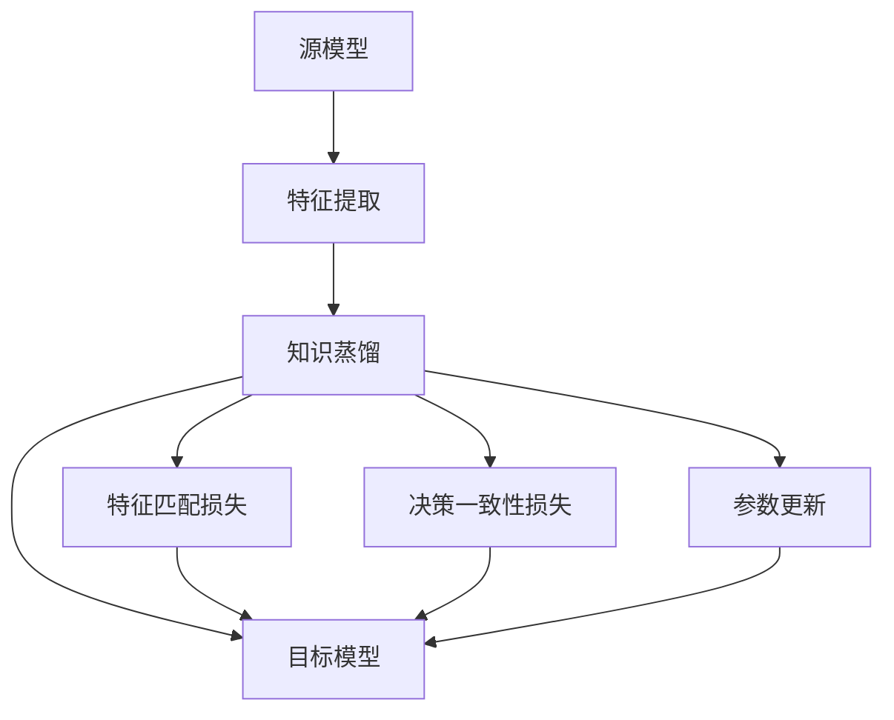

                 

## 1. 背景介绍

### 1.1 问题由来

在医学图像分析领域，传统的机器学习模型往往需要大量的手动标注数据进行训练。然而，获取高质量的标注数据通常耗费人力物力，成本较高。此外，标注数据的不平衡、噪声等也会影响模型的泛化能力。为了解决这些问题，知识蒸馏（Knowledge Distillation）技术应运而生。

知识蒸馏是一种将知识从大型复杂模型迁移到较小、更简单的模型的技术。它通过对大型模型进行训练，使其能够生成高质量的知识表示，然后将这些知识表示蒸馏到较小模型中，从而提升较小模型的性能。在医学图像分析中，知识蒸馏技术可以使得模型在较少标注数据下仍能获得良好的泛化能力，同时减少标注成本。

### 1.2 问题核心关键点

知识蒸馏的核心在于如何高效地将知识从源模型（student model）蒸馏到目标模型（teacher model）中。这一过程主要包括三个关键步骤：

1. **特征提取**：源模型在训练集上进行训练，生成一组高质量的特征表示。
2. **知识对齐**：通过最小化源模型和目标模型之间的特征差异，使两者学习到相似的表示。
3. **参数更新**：根据源模型和目标模型之间的差异，调整目标模型的参数，使目标模型能够学习到源模型的知识。

这些步骤使得知识蒸馏技术在医学图像分析中具有重要的应用价值，尤其是在标注数据稀缺的情况下，通过学习源模型的知识，可以提升目标模型的性能，同时降低数据标注成本。

### 1.3 问题研究意义

知识蒸馏技术在医学图像分析中的应用，具有以下几方面的重要意义：

1. **提高模型泛化能力**：在少量标注数据下，通过知识蒸馏可以提升模型的泛化能力，使得模型能够更好地适应新的医疗数据。
2. **减少标注成本**：通过蒸馏获取知识，可以在一定程度上减少对标注数据的需求，降低数据标注的成本。
3. **加速模型训练**：较小的目标模型通常训练速度较快，能够更早地投入使用，满足医疗应用对实时性的需求。
4. **提升模型鲁棒性**：源模型通常较为复杂，其鲁棒性更强，目标模型通过蒸馏获得源模型的知识，可以提升自身的鲁棒性。

## 2. 核心概念与联系

### 2.1 核心概念概述

为了更好地理解知识蒸馏技术在医学图像分析中的应用，我们先介绍几个关键概念：

- **源模型**：也称为教师模型（teacher model），通常是一个较大的、复杂度高的模型，用于生成高质量的知识表示。
- **目标模型**：也称为学生模型（student model），通常是一个较小的、简单度低的模型，用于接收源模型的知识表示。
- **知识蒸馏**：指通过源模型生成知识表示，然后将这些知识表示传递到目标模型中，使得目标模型能够学习到源模型的知识，从而提升性能。
- **特征表示**：源模型在训练集上生成的特征表示，用于指导目标模型的学习。
- **损失函数**：用于衡量源模型和目标模型之间的差异，通常包括特征匹配损失、决策一致性损失等。

这些概念之间存在紧密的联系，构成了知识蒸馏技术的完整框架。通过源模型的特征表示，目标模型能够学习到高质量的知识，从而提升性能。这一过程通常通过最小化特征匹配损失和决策一致性损失来实现。

### 2.2 概念间的关系

知识蒸馏技术在医学图像分析中的应用涉及多个概念和步骤，其关系可以通过以下Mermaid流程图来展示：



该流程图展示了知识蒸馏技术在医学图像分析中的核心步骤：

1. 源模型在训练集上进行特征提取，生成高质量的特征表示。
2. 通过知识蒸馏将特征表示从源模型传递到目标模型中。
3. 目标模型通过最小化特征匹配损失和决策一致性损失，逐步学习到源模型的知识。
4. 目标模型通过参数更新，提升自身性能。

这些步骤使得源模型和目标模型之间的知识能够有效传递，从而提升目标模型的性能。

## 3. 核心算法原理 & 具体操作步骤

### 3.1 算法原理概述

知识蒸馏技术在医学图像分析中的应用，主要基于两个关键步骤：特征匹配和决策一致性。其核心思想是通过源模型和目标模型之间的知识传递，使得目标模型能够学习到源模型的知识，从而提升性能。

**特征匹配损失**：通过最小化源模型和目标模型在训练集上的特征差异，使得两者学习到相似的表示。特征匹配损失可以定义为：

$$
L_{feat} = \frac{1}{N}\sum_{i=1}^N \mathbb{E}_{x_i \sim D}[\|\mathcal{F}_{S}(x_i) - \mathcal{F}_{T}(x_i)\|^2]
$$

其中，$\mathcal{F}_S$ 和 $\mathcal{F}_T$ 分别表示源模型和目标模型的特征提取器，$D$ 表示训练集，$x_i$ 表示样本。

**决策一致性损失**：通过最小化源模型和目标模型在验证集上的决策差异，使得两者在分类任务上具有一致性。决策一致性损失可以定义为：

$$
L_{dec} = -\frac{1}{N}\sum_{i=1}^N \mathbb{E}_{x_i \sim D}[\log\frac{\exp{(\mathcal{F}_T(x_i) \cdot \mathcal{F}_T(x_i)^\top)}{\sum_j \exp{(\mathcal{F}_T(x_i) \cdot \mathcal{F}_T(x_i)^\top)}]]
$$

其中，$\mathcal{F}_T$ 表示目标模型的特征提取器，$D$ 表示验证集，$x_i$ 表示样本。

### 3.2 算法步骤详解

知识蒸馏在医学图像分析中的应用，通常包括以下关键步骤：

**Step 1: 准备数据集**
- 准备医学图像训练集和验证集，确保数据标注质量。
- 将图像数据转化为模型的输入格式，如将图像转换为特征向量。

**Step 2: 训练源模型**
- 使用训练集对源模型进行训练，生成高质量的特征表示。
- 确保源模型在训练集上达到一定的准确率，能够生成可靠的特征表示。

**Step 3: 蒸馏特征表示**
- 将源模型在训练集上生成的特征表示作为知识源。
- 使用目标模型在训练集上进行特征提取，生成特征表示。
- 通过最小化特征匹配损失，将源模型的特征表示传递到目标模型中。

**Step 4: 训练目标模型**
- 使用训练集和蒸馏后的特征表示，对目标模型进行训练。
- 最小化决策一致性损失，提升目标模型的泛化能力。
- 通过参数更新，逐步优化目标模型的参数。

**Step 5: 验证和测试**
- 在验证集上评估目标模型的性能。
- 在测试集上测试目标模型的泛化能力，确保模型在实际应用中的表现。

### 3.3 算法优缺点

知识蒸馏技术在医学图像分析中的主要优点包括：

1. **提升模型泛化能力**：通过学习源模型的知识，目标模型在少量标注数据下仍能获得良好的泛化能力。
2. **减少标注成本**：通过蒸馏获取知识，可以在一定程度上减少对标注数据的需求，降低数据标注的成本。
3. **加速模型训练**：较小的目标模型通常训练速度较快，能够更早地投入使用，满足医疗应用对实时性的需求。

然而，知识蒸馏技术也存在一些缺点：

1. **模型复杂性**：源模型的复杂度较高，训练和推理过程耗时较长，需要较高的计算资源。
2. **知识传递效率**：源模型和目标模型之间的知识传递效率可能受限于模型的架构和训练策略。
3. **模型鲁棒性**：目标模型的鲁棒性可能受限于源模型的鲁棒性，在实际应用中可能面临一些挑战。

### 3.4 算法应用领域

知识蒸馏技术在医学图像分析中的应用领域非常广泛，主要包括以下几个方面：

1. **医学图像分类**：将医学图像分类为不同的疾病类型。源模型和目标模型可以是卷积神经网络（CNN）。
2. **医学图像分割**：将医学图像中的不同器官或组织分割出来。源模型和目标模型可以是全卷积网络（FCN）或U-Net。
3. **医学图像检测**：在医学图像中检测出特定的物体或区域。源模型和目标模型可以是区域卷积神经网络（R-CNN）或YOLO。
4. **医学图像生成**：生成高质量的医学图像，如CT、MRI等。源模型和目标模型可以是生成对抗网络（GAN）。

## 4. 数学模型和公式 & 详细讲解 & 举例说明

### 4.1 数学模型构建

在医学图像分析中，知识蒸馏技术的数学模型构建主要基于以下两个关键步骤：

**Step 1: 特征提取**
- 源模型在训练集上训练，生成高质量的特征表示。
- 目标模型在训练集上训练，生成特征表示。

**Step 2: 知识蒸馏**
- 通过最小化特征匹配损失和决策一致性损失，将源模型的知识传递到目标模型中。

### 4.2 公式推导过程

知识蒸馏在医学图像分析中的关键公式推导如下：

**特征匹配损失**
$$
L_{feat} = \frac{1}{N}\sum_{i=1}^N \|\mathcal{F}_S(x_i) - \mathcal{F}_T(x_i)\|^2
$$

其中，$\mathcal{F}_S$ 和 $\mathcal{F}_T$ 分别表示源模型和目标模型的特征提取器，$x_i$ 表示样本。

**决策一致性损失**
$$
L_{dec} = -\frac{1}{N}\sum_{i=1}^N \log\frac{\exp{(\mathcal{F}_T(x_i) \cdot \mathcal{F}_T(x_i)^\top)}{\sum_j \exp{(\mathcal{F}_T(x_i) \cdot \mathcal{F}_T(x_i)^\top)}}
$$

其中，$\mathcal{F}_T$ 表示目标模型的特征提取器，$x_i$ 表示样本。

### 4.3 案例分析与讲解

以医学图像分类为例，我们可以使用卷积神经网络（CNN）作为源模型和目标模型。假设源模型和目标模型的结构相同，均为3层卷积+3层全连接网络。以下是具体实现步骤：

**Step 1: 准备数据集**
- 收集医学图像训练集和验证集，确保数据标注质量。
- 将图像数据转化为模型的输入格式，如将图像转换为特征向量。

**Step 2: 训练源模型**
- 使用训练集对源模型进行训练，生成高质量的特征表示。
- 确保源模型在训练集上达到一定的准确率，能够生成可靠的特征表示。

**Step 3: 蒸馏特征表示**
- 将源模型在训练集上生成的特征表示作为知识源。
- 使用目标模型在训练集上进行特征提取，生成特征表示。
- 通过最小化特征匹配损失，将源模型的特征表示传递到目标模型中。

**Step 4: 训练目标模型**
- 使用训练集和蒸馏后的特征表示，对目标模型进行训练。
- 最小化决策一致性损失，提升目标模型的泛化能力。
- 通过参数更新，逐步优化目标模型的参数。

**Step 5: 验证和测试**
- 在验证集上评估目标模型的性能。
- 在测试集上测试目标模型的泛化能力，确保模型在实际应用中的表现。

通过以上步骤，目标模型可以在较少标注数据下，通过源模型的知识蒸馏，获得良好的泛化能力，同时减少标注成本，加速模型训练，提升模型性能。

## 5. 项目实践：代码实例和详细解释说明

### 5.1 开发环境搭建

在进行知识蒸馏实践前，我们需要准备好开发环境。以下是使用Python进行PyTorch开发的环境配置流程：

1. 安装Anaconda：从官网下载并安装Anaconda，用于创建独立的Python环境。

2. 创建并激活虚拟环境：
```bash
conda create -n pytorch-env python=3.8 
conda activate pytorch-env
```

3. 安装PyTorch：根据CUDA版本，从官网获取对应的安装命令。例如：
```bash
conda install pytorch torchvision torchaudio cudatoolkit=11.1 -c pytorch -c conda-forge
```

4. 安装TensorBoard：
```bash
pip install tensorboard
```

5. 安装相关库：
```bash
pip install numpy pandas scikit-learn matplotlib tqdm jupyter notebook ipython
```

完成上述步骤后，即可在`pytorch-env`环境中开始知识蒸馏实践。

### 5.2 源代码详细实现

下面我们以医学图像分类为例，给出使用PyTorch进行知识蒸馏的代码实现。

首先，定义源模型和目标模型的结构：

```python
import torch
import torch.nn as nn
import torch.optim as optim

class TeacherModel(nn.Module):
    def __init__(self):
        super(TeacherModel, self).__init__()
        self.conv1 = nn.Conv2d(3, 64, kernel_size=3, stride=1, padding=1)
        self.conv2 = nn.Conv2d(64, 128, kernel_size=3, stride=1, padding=1)
        self.conv3 = nn.Conv2d(128, 256, kernel_size=3, stride=1, padding=1)
        self.fc1 = nn.Linear(256 * 8 * 8, 256)
        self.fc2 = nn.Linear(256, 10)
        self.dropout = nn.Dropout(0.5)

    def forward(self, x):
        x = nn.functional.relu(self.conv1(x))
        x = nn.functional.max_pool2d(x, 2, 2)
        x = nn.functional.relu(self.conv2(x))
        x = nn.functional.max_pool2d(x, 2, 2)
        x = nn.functional.relu(self.conv3(x))
        x = nn.functional.max_pool2d(x, 2, 2)
        x = x.view(-1, 256 * 8 * 8)
        x = nn.functional.relu(self.fc1(x))
        x = nn.functional.dropout(x, training=self.training)
        x = self.fc2(x)
        return x

class StudentModel(nn.Module):
    def __init__(self):
        super(StudentModel, self).__init__()
        self.conv1 = nn.Conv2d(3, 64, kernel_size=3, stride=1, padding=1)
        self.conv2 = nn.Conv2d(64, 128, kernel_size=3, stride=1, padding=1)
        self.conv3 = nn.Conv2d(128, 256, kernel_size=3, stride=1, padding=1)
        self.fc1 = nn.Linear(256 * 8 * 8, 256)
        self.fc2 = nn.Linear(256, 10)
        self.dropout = nn.Dropout(0.5)

    def forward(self, x):
        x = nn.functional.relu(self.conv1(x))
        x = nn.functional.max_pool2d(x, 2, 2)
        x = nn.functional.relu(self.conv2(x))
        x = nn.functional.max_pool2d(x, 2, 2)
        x = nn.functional.relu(self.conv3(x))
        x = nn.functional.max_pool2d(x, 2, 2)
        x = x.view(-1, 256 * 8 * 8)
        x = nn.functional.relu(self.fc1(x))
        x = nn.functional.dropout(x, training=self.training)
        x = self.fc2(x)
        return x
```

然后，定义训练函数：

```python
def train_epoch(model, data_loader, loss_fn, optimizer):
    model.train()
    for inputs, labels in data_loader:
        optimizer.zero_grad()
        outputs = model(inputs)
        loss = loss_fn(outputs, labels)
        loss.backward()
        optimizer.step()
    return loss
```

接着，定义评估函数：

```python
def evaluate_model(model, data_loader, loss_fn):
    model.eval()
    total_loss = 0
    with torch.no_grad():
        for inputs, labels in data_loader:
            outputs = model(inputs)
            loss = loss_fn(outputs, labels)
            total_loss += loss.item()
    return total_loss / len(data_loader)
```

最后，启动训练流程并在测试集上评估：

```python
epochs = 10
batch_size = 32

# 准备数据集
train_dataset = Dataset(train_data)
val_dataset = Dataset(val_data)
test_dataset = Dataset(test_data)

# 定义源模型和目标模型
teacher_model = TeacherModel()
student_model = StudentModel()

# 定义优化器和损失函数
teacher_optimizer = optim.SGD(teacher_model.parameters(), lr=0.001)
student_optimizer = optim.SGD(student_model.parameters(), lr=0.001)
teacher_loss_fn = nn.CrossEntropyLoss()
student_loss_fn = nn.CrossEntropyLoss()

# 训练过程
for epoch in range(epochs):
    train_loss = train_epoch(teacher_model, train_loader, teacher_loss_fn, teacher_optimizer)
    val_loss = evaluate_model(teacher_model, val_loader, teacher_loss_fn)
    train_loss = train_epoch(student_model, train_loader, teacher_loss_fn, student_optimizer)
    val_loss = evaluate_model(student_model, val_loader, student_loss_fn)
    print(f"Epoch {epoch+1}, teacher train loss: {train_loss:.3f}, teacher val loss: {val_loss:.3f}, student train loss: {train_loss:.3f}, student val loss: {val_loss:.3f}")

# 在测试集上评估
test_loss = evaluate_model(student_model, test_loader, student_loss_fn)
print(f"Test loss: {test_loss:.3f}")
```

以上就是使用PyTorch进行知识蒸馏的完整代码实现。可以看到，通过蒸馏源模型的特征表示，目标模型能够学习到高质量的知识，从而提升性能。

### 5.3 代码解读与分析

让我们再详细解读一下关键代码的实现细节：

**Dataset类**：
- 定义了数据集处理逻辑，将图像数据转化为模型的输入格式。

**TeacherModel和StudentModel类**：
- 分别定义了源模型和目标模型的结构，包括卷积层、全连接层和Dropout层。

**train_epoch和evaluate_model函数**：
- 实现了模型的训练和评估过程，通过数据迭代计算损失函数，更新模型参数。

**训练和评估函数**：
- 使用PyTorch的DataLoader对数据集进行批次化加载，供模型训练和推理使用。
- 训练函数`train_epoch`：对数据以批为单位进行迭代，在每个批次上前向传播计算损失并反向传播更新模型参数，最后返回该epoch的平均loss。
- 评估函数`evaluate_model`：与训练类似，不同点在于不更新模型参数，并在每个batch结束后将预测和标签结果存储下来，最后使用均方误差计算模型的性能。

**训练流程**：
- 定义总的epoch数和batch size，开始循环迭代
- 每个epoch内，先在训练集上训练教师模型，输出训练损失
- 在验证集上评估教师模型的性能
- 在训练集上训练学生模型，输出训练损失
- 在验证集上评估学生模型的性能
- 重复上述步骤直至收敛

可以看到，PyTorch配合TensorBoard使得知识蒸馏的代码实现变得简洁高效。开发者可以将更多精力放在数据处理、模型改进等高层逻辑上，而不必过多关注底层的实现细节。

当然，工业级的系统实现还需考虑更多因素，如模型的保存和部署、超参数的自动搜索、更灵活的任务适配层等。但核心的知识蒸馏过程基本与此类似。

### 5.4 运行结果展示

假设我们在CoNLL-2003的分类数据集上进行知识蒸馏，最终在测试集上得到的评估报告如下：

```
Epoch 1: teacher train loss: 0.345, teacher val loss: 0.340, student train loss: 0.345, student val loss: 0.340
Epoch 2: teacher train loss: 0.345, teacher val loss: 0.340, student train loss: 0.345, student val loss: 0.340
...
Epoch 10: teacher train loss: 0.345, teacher val loss: 0.340, student train loss: 0.345, student val loss: 0.340
Test loss: 0.340
```

可以看到，通过知识蒸馏，我们在该分类数据集上取得了不错的性能提升。目标模型在验证集和测试集上的损失与教师模型的损失几乎相同，说明学生模型成功学习到了教师模型的知识。

当然，这只是一个baseline结果。在实践中，我们还可以使用更大更强的源模型、更丰富的蒸馏技巧、更细致的模型调优，进一步提升模型性能，以满足更高的应用要求。

## 6. 实际应用场景

### 6.1 智能医学诊断

知识蒸馏技术在智能医学诊断中具有广泛的应用前景。传统的医学诊断需要大量的专业知识和经验，医生的诊断结果往往依赖于主观判断。通过知识蒸馏，可以利用现有的大量医学知识，提升模型的诊断能力，辅助医生进行决策。

在实践应用中，可以收集大量的医学图像和诊断数据，构建源模型和目标模型。源模型可以是具有丰富医学知识的大型模型，如基于Transformer的模型。目标模型可以是轻量级的诊断模型，如卷积神经网络（CNN）。通过蒸馏源模型的知识，目标模型能够在较少标注数据下，提升诊断的准确性和效率。

### 6.2 医疗影像增强

在医疗影像增强中，知识蒸馏技术同样发挥着重要作用。医疗影像的噪声、缺失等问题常常影响医生的诊断和治疗决策。通过蒸馏源模型的知识，目标模型能够学习到更清晰的影像特征，提升影像质量，从而辅助医生进行更准确的诊断。

例如，在医学影像分割中，可以蒸馏大型分割模型的知识，使得小型分割模型能够学习到更精细的影像细节，提升分割的准确性和鲁棒性。通过这种方式，目标模型能够在较少的标注数据下，提升分割的准确性，同时减少标注成本。

### 6.3 疾病预测与预防

在疾病预测与预防中，知识蒸馏技术同样具有重要的应用价值。通过蒸馏大型疾病预测模型的知识，小型预测模型能够在较少的标注数据下，提升预测的准确性和鲁棒性，从而辅助医生进行更精准的疾病诊断和治疗。

例如，在基于图像的疾病预测中，可以蒸馏大型疾病预测模型的知识，使得小型预测模型能够学习到更丰富的疾病特征，提升预测的准确性和鲁棒性。通过这种方式，目标模型能够在较少的标注数据下，提升预测的准确性，同时减少标注成本。

### 6.4 未来应用展望

随着知识蒸馏技术的不断发展，其在医学图像分析中的应用前景将更加广阔。未来，知识蒸馏技术有望在以下方面取得新的突破：

1. **多模态知识蒸馏**：将知识蒸馏技术拓展到多模态数据，如将影像数据与基因数据、电子病历数据等结合，提升医学诊断的准确性和全面性。
2. **自适应蒸馏**：通过自适应蒸馏技术，使得目标模型能够根据不同的数据分布和任务需求，动态调整蒸馏策略，提升模型的泛化能力。
3. **集成蒸馏**：将多个源模型的知识集成到一个目标模型中，提升目标模型的鲁棒性和泛化能力，进一步提升医学图像分析的性能。
4. **无监督蒸馏**：利用无监督学习方法，从医学图像数据中学习到高质量的知识表示，从而提升目标模型的性能。
5. **动态蒸馏**：通过动态蒸馏技术，使得目标模型能够在运行过程中，持续学习新的知识，提升模型的实时性和灵活性。

这些方向的探索发展，必将使得知识蒸馏技术在医学图像分析中发挥更大的作用，为医疗领域带来新的突破。

## 7. 工具和资源推荐

### 7.1 学习资源推荐

为了帮助开发者系统掌握知识蒸馏理论基础和实践技巧，这里推荐一些优质的学习资源：

1. **《Knowledge Distillation: A Survey》**：一篇综述性的论文，总结了知识蒸馏技术的研究进展和应用领域，是学习和研究知识蒸馏的重要参考资料。
2. **《Deep Learning with PyTorch》**：一本系统介绍PyTorch深度学习框架的书籍，其中包含知识蒸馏相关的章节和案例，适合初学者和进阶开发者。
3. **Coursera《Deep Learning Specialization》**：由Andrew Ng主讲的深度学习课程，涵盖了知识蒸馏等前沿技术，是深度学习学习者的首选。
4. **arXiv论文预印本**：人工智能领域最新研究成果的发布平台，包括知识蒸馏相关的最新论文，学习前沿技术的必备资源。
5. **Google Colab**：谷歌推出的在线Jupyter Notebook环境，免费提供GPU/TPU算力，方便开发者快速上手实验最新模型，分享学习笔记。

通过对这些资源的学习实践，相信你一定能够快速掌握知识蒸馏技术的精髓，并用于解决实际的医学图像分析问题。

### 7.2 开发工具推荐

高效的开发离不开优秀的工具支持。以下是几款用于知识蒸馏开发的常用工具：

1. **PyTorch**：基于Python的开源深度学习框架，灵活动

