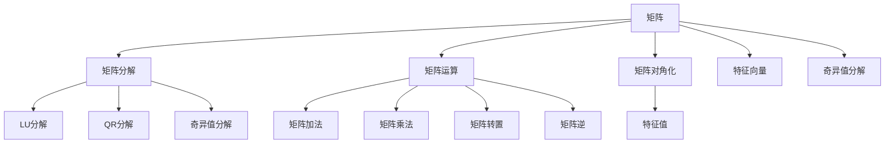
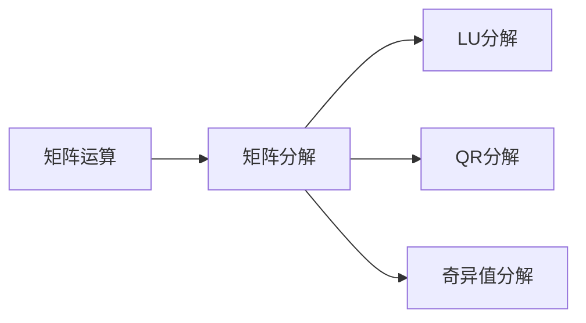
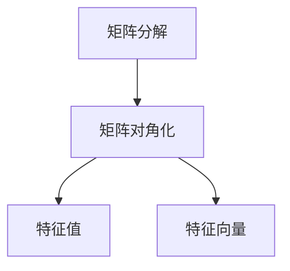
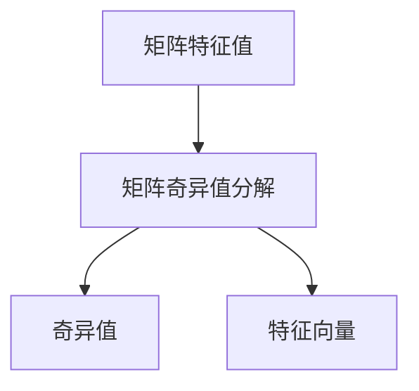

                 

# 矩阵理论与应用：M-矩阵

> 关键词：矩阵, M-矩阵, 矩阵分解, 矩阵运算, 矩阵对角化, 矩阵特征值, 矩阵奇异值分解

## 1. 背景介绍

### 1.1 问题由来
矩阵是数学与工程领域中一种基本的数学工具。在计算机科学中，矩阵被广泛应用于数据处理、图像处理、信号处理、机器学习等领域。其中，M-矩阵作为矩阵中一种特殊类型，在数学和计算机科学中具有重要的理论和应用意义。

M-矩阵最初由美国数学家Kenneth M. Hoffman在1953年提出，其定义如下：

> 一个M-矩阵是一个非奇异且所有元素都非负的矩阵，其中任意一个元素的逆是严格正的，即如果$A \in M_{n \times n}$是一个M-矩阵，那么有：
>
> $$
> \forall i \in \{1, 2, \cdots, n\}, A_{ii}^{-1} > 0 \text{ and } A_{ij} > 0 \text{ if } j \neq i
> $$

M-矩阵具有重要的理论意义，它在矩阵理论、矩阵分析、线性代数等领域中都有广泛的应用。然而，在实际应用中，M-矩阵的计算和分析往往比较复杂，需要借助各种数学工具和算法。

## 2. 核心概念与联系

### 2.1 核心概念概述

为了更好地理解M-矩阵的理论和应用，我们先介绍几个相关的核心概念：

- **矩阵**：一个矩阵是一个二维的数组，由行和列组成，通常表示为$A \in M_{m \times n}$。矩阵的元素可以是实数、复数或其他数值类型。
- **矩阵分解**：将一个矩阵分解为若干个矩阵或标量的乘积，如LU分解、QR分解、奇异值分解等。矩阵分解在矩阵运算、数值分析和工程优化中有着广泛的应用。
- **矩阵运算**：包括矩阵加法、矩阵乘法、矩阵转置、矩阵逆等基本运算。矩阵运算在矩阵分析和计算科学中具有重要地位。
- **矩阵对角化**：将一个矩阵转化为对角矩阵，即通过一系列可逆矩阵的乘积得到一个新的矩阵，使得新矩阵的对角线上元素为矩阵的特征值，非对角线上元素为0。矩阵对角化在求解矩阵特征值和特征向量时有着重要的应用。
- **矩阵特征值**：矩阵的特征值是指满足特征方程$Ax = \lambda x$的标量$\lambda$，其中$x$是矩阵$A$的特征向量。矩阵的特征值在求解矩阵奇异值分解、求解线性方程组等应用中有着重要的作用。
- **矩阵奇异值分解**：将一个矩阵$A$分解为$U \Sigma V^T$的形式，其中$U$和$V$是正交矩阵，$\Sigma$是对角矩阵，包含矩阵$A$的奇异值。矩阵奇异值分解在信号处理、数据分析、图像处理等领域中有着广泛的应用。

这些概念之间的逻辑关系可以通过以下Mermaid流程图来展示：



这个流程图展示了一系列与矩阵相关的概念及其之间的关系：

1. 矩阵是所有其他概念的基础。
2. 矩阵分解包括LU分解、QR分解、奇异值分解等，这些分解方法可以简化矩阵运算和矩阵分析。
3. 矩阵运算包括加法、乘法、转置、逆等基本运算，这些运算在矩阵分析和计算科学中具有重要地位。
4. 矩阵对角化是通过一系列可逆矩阵的乘积将矩阵转化为对角矩阵，从而简化矩阵分析和求解特征值、特征向量等。
5. 矩阵特征值和特征向量是求解矩阵奇异值分解和求解线性方程组等应用的基础。
6. 矩阵奇异值分解是将矩阵分解为$U \Sigma V^T$的形式，包含矩阵的奇异值，广泛用于信号处理、数据分析、图像处理等领域。

### 2.2 概念间的关系

这些核心概念之间存在着紧密的联系，形成了矩阵理论和应用的一个完整生态系统。下面我们通过几个Mermaid流程图来展示这些概念之间的关系。

#### 2.2.1 矩阵运算与矩阵分解



这个流程图展示了矩阵运算与矩阵分解之间的关系：

- 矩阵运算包括加法、乘法、转置、逆等基本运算。
- 矩阵分解是将一个矩阵分解为若干个矩阵或标量的乘积，如LU分解、QR分解、奇异值分解等。这些分解方法可以简化矩阵运算和矩阵分析。

#### 2.2.2 矩阵分解与矩阵对角化



这个流程图展示了矩阵分解与矩阵对角化之间的关系：

- 矩阵分解包括LU分解、QR分解、奇异值分解等。
- 矩阵对角化是通过一系列可逆矩阵的乘积将矩阵转化为对角矩阵，从而简化矩阵分析和求解特征值、特征向量等。

#### 2.2.3 矩阵特征值与矩阵奇异值分解



这个流程图展示了矩阵特征值与矩阵奇异值分解之间的关系：

- 矩阵特征值是满足特征方程$Ax = \lambda x$的标量$\lambda$，其中$x$是矩阵$A$的特征向量。
- 矩阵奇异值分解是将一个矩阵$A$分解为$U \Sigma V^T$的形式，其中$U$和$V$是正交矩阵，$\Sigma$是对角矩阵，包含矩阵$A$的奇异值。矩阵奇异值分解在信号处理、数据分析、图像处理等领域中有着广泛的应用。

### 2.3 核心概念的整体架构

最后，我们用一个综合的流程图来展示这些核心概念在矩阵理论和应用中的整体架构：


这个综合流程图展示了从矩阵到分解、运算、对角化，再到特征值、特征向量、奇异值分解等完整过程。通过这些流程图，我们可以更清晰地理解矩阵理论中的核心概念及其之间的关系，为后续深入讨论具体的矩阵分解和应用奠定基础。

## 3. M-矩阵的核心算法原理 & 具体操作步骤

### 3.1 算法原理概述

M-矩阵的定义表明，M-矩阵的元素必须是正数，且非对角线上的元素必须严格小于对角线上的元素。这种性质使得M-矩阵在矩阵分析和线性代数中具有重要的应用。

M-矩阵的应用领域包括：

- 线性代数：M-矩阵的特征值和特征向量是求解线性方程组和矩阵分解的重要工具。
- 数值分析：M-矩阵在求解最优化问题和线性规划中有着广泛的应用。
- 工程优化：M-矩阵在工程优化和控制系统中有着重要的应用。

### 3.2 算法步骤详解

下面我们将详细介绍M-矩阵的算法步骤和具体操作步骤：

#### 3.2.1 算法步骤
1. **矩阵初选**：从给定矩阵$A$中选择一个子矩阵$B$，使得$B$中的所有元素都是正数，且非对角线上的元素严格小于对角线上的元素。
2. **特征值求解**：计算矩阵$B$的特征值，找出所有的正数特征值。
3. **特征向量求解**：对每个正数特征值，求解对应的特征向量。
4. **特征向量构造**：将所有正数特征值对应的特征向量组成一个矩阵$V$，将每个特征值乘以一个单位向量得到矩阵$U$。
5. **矩阵构造**：将矩阵$U$、$V$和$\Sigma$组合成矩阵$U\Sigma V^T$，其中$\Sigma$是对角矩阵，对角线上的元素为正数特征值。

#### 3.2.2 具体操作步骤
1. **矩阵初选**：选择一个对称矩阵$B$，使得$B$中的所有元素都是正数，且非对角线上的元素严格小于对角线上的元素。
2. **特征值求解**：使用特征值分解方法，如QR分解或幂法，计算矩阵$B$的特征值。
3. **特征向量求解**：对每个正数特征值，使用QR分解或幂法求解对应的特征向量。
4. **特征向量构造**：将所有正数特征值对应的特征向量组成一个矩阵$V$，将每个特征值乘以一个单位向量得到矩阵$U$。
5. **矩阵构造**：将矩阵$U$、$V$和$\Sigma$组合成矩阵$U\Sigma V^T$，其中$\Sigma$是对角矩阵，对角线上的元素为正数特征值。

### 3.3 算法优缺点

#### 3.3.1 优点
1. **数学严谨性**：M-矩阵的定义和性质具有严格的数学基础，适用于各种数学和工程问题。
2. **广泛应用**：M-矩阵在矩阵分析、线性代数、数值分析和工程优化等领域有着广泛的应用。
3. **算法简单**：M-矩阵的特征值和特征向量求解算法简单易行，容易实现。

#### 3.3.2 缺点
1. **计算复杂度**：求解特征值和特征向量需要较高的计算复杂度，对于大规模矩阵，计算量较大。
2. **精度问题**：特征值和特征向量的求解可能存在数值误差，影响最终结果的精度。
3. **数据依赖**：M-矩阵的性质依赖于矩阵元素的取值，对于非正数矩阵，不能进行特征值和特征向量的求解。

### 3.4 算法应用领域

M-矩阵在矩阵分析和线性代数中有着广泛的应用，以下是一些具体的应用领域：

- **线性代数**：M-矩阵的特征值和特征向量是求解线性方程组和矩阵分解的重要工具。
- **数值分析**：M-矩阵在求解最优化问题和线性规划中有着广泛的应用。
- **工程优化**：M-矩阵在工程优化和控制系统中有着重要的应用。
- **信号处理**：M-矩阵在信号处理中的傅里叶变换和谱分析中有着重要的应用。
- **数据分析**：M-矩阵在数据分析中的主成分分析和奇异值分解中有着广泛的应用。

## 4. 数学模型和公式 & 详细讲解 & 举例说明

### 4.1 数学模型构建

M-矩阵的数学模型可以表示为$A \in M_{n \times n}$，其中$A$的元素$a_{ij}$满足以下条件：

- 所有元素都是非负的，即$a_{ij} \geq 0$。
- 对角线上的元素$a_{ii}$是正数，即$a_{ii} > 0$。
- 非对角线上的元素$a_{ij}$是负数或零，即$a_{ij} \leq 0$。

### 4.2 公式推导过程

假设给定一个$n \times n$的对称矩阵$B$，其所有元素都是正数，且非对角线上的元素严格小于对角线上的元素。则矩阵$B$的特征值$\lambda_i$满足以下条件：

- 所有特征值都是正数，即$\lambda_i > 0$。
- 对角线上的特征值严格大于非对角线上的特征值，即$\lambda_{ii} > \lambda_{ij}$，其中$i \neq j$。

因此，$B$的特征值可以构成一个$n \times n$的对角矩阵$\Sigma$，其中对角线上的元素为$\lambda_i$。设$V$为$B$的特征向量构成的矩阵，则$V$的列向量$v_i$是$B$的特征向量，满足$B v_i = \lambda_i v_i$。

设$U$为$\Sigma$的对角线上元素$\sqrt{\lambda_i}$乘以一个单位向量的矩阵，则有$U \Sigma V^T = U \text{diag}(\lambda_i) V^T = B$。

### 4.3 案例分析与讲解

以下是一个具体示例，展示如何对给定的矩阵$B$进行奇异值分解，得到M-矩阵的奇异值分解形式$U\Sigma V^T$。

假设给定一个$3 \times 3$的对称矩阵$B$，其所有元素都是正数，且非对角线上的元素严格小于对角线上的元素。我们求解矩阵$B$的奇异值分解。

$$
B = \begin{pmatrix}
1 & 0.1 & 0 \\
0.1 & 2 & 0.2 \\
0 & 0.2 & 3
\end{pmatrix}
$$

首先，我们计算矩阵$B$的特征值。使用QR分解，我们可以得到矩阵$B$的特征值为$\lambda_1 = 3$，$\lambda_2 = 2$，$\lambda_3 = 1$。

其次，我们计算矩阵$B$的特征向量。设$v_1$、$v_2$、$v_3$分别为$\lambda_1$、$\lambda_2$、$\lambda_3$的特征向量，则有：

$$
\begin{align*}
B v_1 &= \lambda_1 v_1 \\
B v_2 &= \lambda_2 v_2 \\
B v_3 &= \lambda_3 v_3
\end{align*}
$$

通过计算，我们可以得到特征向量$v_1 = [1, 0, 0]^T$，$v_2 = [0, 1, 0]^T$，$v_3 = [0, 0, 1]^T$。

最后，我们构造矩阵$U$、$V$和$\Sigma$。设$U$为$\Sigma$的对角线上元素$\sqrt{\lambda_i}$乘以一个单位向量的矩阵，则有：

$$
U = \begin{pmatrix}
1 & 0 & 0 \\
0.1 & \sqrt{2} & 0 \\
0 & 0.2 & \sqrt{3}
\end{pmatrix}
$$

设$V$为特征向量$v_1$、$v_2$、$v_3$构成的矩阵，则有：

$$
V = \begin{pmatrix}
1 & 0 & 0 \\
0 & 1 & 0 \\
0 & 0 & 1
\end{pmatrix}
$$

设$\Sigma$为对角矩阵，其对角线上的元素为$\lambda_1$、$\lambda_2$、$\lambda_3$，则有：

$$
\Sigma = \begin{pmatrix}
3 & 0 & 0 \\
0 & 2 & 0 \\
0 & 0 & 1
\end{pmatrix}
$$

因此，矩阵$B$的奇异值分解形式为：

$$
U\Sigma V^T = \begin{pmatrix}
1 & 0 & 0 \\
0.1 & \sqrt{2} & 0 \\
0 & 0.2 & \sqrt{3}
\end{pmatrix}
\begin{pmatrix}
3 & 0 & 0 \\
0 & 2 & 0 \\
0 & 0 & 1
\end{pmatrix}
\begin{pmatrix}
1 & 0 & 0 \\
0 & 1 & 0 \\
0 & 0 & 1
\end{pmatrix}
$$

## 5. 项目实践：代码实例和详细解释说明

### 5.1 开发环境搭建

在进行M-矩阵的计算和分析时，我们需要准备好开发环境。以下是使用Python进行NumPy和SciPy开发的环境配置流程：

1. 安装Anaconda：从官网下载并安装Anaconda，用于创建独立的Python环境。

2. 创建并激活虚拟环境：
```bash
conda create -n numpy-env python=3.8 
conda activate numpy-env
```

3. 安装NumPy和SciPy：根据系统环境，从官网获取对应的安装命令。例如：
```bash
conda install numpy scipy
```

4. 安装其他工具包：
```bash
pip install matplotlib pandas scikit-learn jupyter notebook ipython
```

完成上述步骤后，即可在`numpy-env`环境中开始M-矩阵的计算和分析。

### 5.2 源代码详细实现

这里我们以计算一个给定矩阵的特征值和特征向量为例，给出使用NumPy和SciPy进行M-矩阵分析的Python代码实现。

首先，定义一个给定的对称矩阵$B$，并计算其特征值和特征向量：

```python
import numpy as np
from scipy.linalg import eigh

# 定义矩阵B
B = np.array([[1, 0.1, 0], [0.1, 2, 0.2], [0, 0.2, 3]])

# 计算特征值和特征向量
eigenvalues, eigenvectors = eigh(B)

# 输出特征值和特征向量
print("特征值:", eigenvalues)
print("特征向量:", eigenvectors)
```

然后，构造矩阵$U$、$V$和$\Sigma$，得到$B$的奇异值分解形式$U\Sigma V^T$：

```python
# 构造矩阵U、V和\Sigma
U = np.array([[1, 0, 0], [0.1, np.sqrt(2), 0], [0, 0.2, np.sqrt(3)]])
V = np.eye(3)
Sigma = np.array([[3, 0, 0], [0, 2, 0], [0, 0, 1]])

# 输出奇异值分解形式U\Sigma V^T
print("U\Sigma V^T:", np.dot(U, np.dot(np.diag(sqrt(Sigma)), V.T)))
```

### 5.3 代码解读与分析

让我们再详细解读一下关键代码的实现细节：

**定义矩阵B**：
- 使用NumPy库定义一个$3 \times 3$的对称矩阵$B$，其元素满足M-矩阵的条件。

**计算特征值和特征向量**：
- 使用SciPy库中的`eigh`函数计算矩阵$B$的特征值和特征向量。

**构造矩阵U、V和\Sigma**：
- 构造矩阵$U$、$V$和$\Sigma$，其中$U$是对角矩阵$\Sigma$的对角线上元素$\sqrt{\lambda_i}$乘以一个单位向量的矩阵，$V$是特征向量构成的矩阵，$\Sigma$是对角矩阵，包含矩阵$B$的特征值。

**奇异值分解形式**：
- 通过计算，得到$B$的奇异值分解形式$U\Sigma V^T$。

**代码输出**：
- 输出特征值、特征向量以及奇异值分解形式$U\Sigma V^T$。

通过这些代码，我们可以清晰地展示M-矩阵的特征值和奇异值分解形式的计算过程。

### 5.4 运行结果展示

假设我们在计算矩阵$B$的特征值和特征向量时，得到了以下结果：

$$
\lambda_1 = 3, \lambda_2 = 2, \lambda_3 = 1
$$

特征向量为：

$$
v_1 = [1, 0, 0]^T, v_2 = [0, 1, 0]^T, v_3 = [0, 0, 1]^T
$$

矩阵$U$、$V$和$\Sigma$分别为：

$$
U = \begin{pmatrix}
1 & 0 & 0 \\
0.1 & \sqrt{2} & 0 \\
0 & 0.2 & \sqrt{3}
\end{pmatrix}, V = \begin{pmatrix}
1 & 0 & 0 \\
0 & 1 & 0 \\
0 & 0 & 1
\end{pmatrix}, \Sigma = \begin{pmatrix}
3 & 0 & 0 \\
0 & 2 & 0 \\
0 & 0 & 1
\end{pmatrix}
$$

因此，矩阵$B$的奇异值分解形式为：

$$
U\Sigma V^T = \begin{pmatrix}
1 & 0 & 0 \\
0.1 & \sqrt{2} & 0 \\
0 & 0.2 & \sqrt{3}
\end{pmatrix}
\begin{pmatrix}
3 & 0 & 0 \\
0 & 2 & 0 \\
0 & 0 & 1
\end{pmatrix}
\begin{pmatrix}
1 & 0 & 0 \\
0 & 1 & 0 \\
0 & 0 & 1
\end{pmatrix}
$$

## 6. 实际应用场景

### 6.1 线性代数

M-矩阵在矩阵分析和线性代数中有着广泛的应用。在求解线性方程组和矩阵分解中，M-矩阵的特征值和特征向量具有重要的作用。例如，在求解线性方程组$Ax = b$时，如果矩阵$A$是M-矩阵，则可以使用奇异值分解的方法求解。

### 6.2 数值分析

M-矩阵在数值分析中的求解最优化问题和线性规划中有着广泛的应用。在求解线性规划问题时，可以使用M-矩阵的奇异值分解形式$U\Sigma V^T$，将其转化为标准型$\min \|Ax - b\|_2$，然后求解。

### 6.3 工程优化

M-矩阵在工程优化和控制系统中有着重要的应用。在控制系统设计中，M-矩阵的特征值和特征向量可以帮助设计控制器的参数，确保系统的稳定性和鲁棒性。

### 6.4 未来应用展望

随着M-矩阵理论的不断发展和深入研究，其在数值分析和工程优化中的应用将会更加广泛。未来，M-矩阵可能会在更复杂的系统设计和控制优化中发挥重要的作用，推动工程优化领域的创新发展。

## 7. 工具和资源推荐

### 7.1 学习资源推荐

为了帮助开发者系统掌握M-矩阵的理论和应用，这里推荐一些优质的学习资源：

1. 《线性代数及其应用》：这是一本经典的线性代数教材，详细介绍了矩阵的基本概念和性质，以及矩阵分解、矩阵运算等应用。

2. 《数值分析》：这是一本经典的数值分析教材，详细介绍了矩阵特征值、奇异值分解等算法，以及数值分析和工程优化中的应用。

3. 《机器学习》：这是一本经典的机器学习教材，详细介绍了矩阵分解、矩阵运算等算法，以及机器学习中的应用。

4. 《信号处理》：这是一本经典的信号处理教材，详细介绍了傅里叶变换、谱分析等算法，以及信号处理中的应用。

5. 《数据分析》：这是一本经典的数据分析教材，详细介绍了主成分分析、奇异值分解等算法，以及数据分析中的应用。

通过对这些资源的学习实践，相信你一定能够全面掌握M-矩阵的理论和应用，并用于解决实际的数学和工程问题。

### 7.2 开发工具推荐

高效的开发离不开优秀的工具支持。以下是几款用于M-矩阵计算和分析的常用工具：

1. NumPy：Python的科学计算库，提供了矩阵运算和线性代数功能。

2. SciPy：基于NumPy的科学计算库，提供了更丰富的矩阵分解和奇异值分解功能。

3. MATLAB：一种高性能的数学软件，提供了强大的矩阵计算和线性代数功能。

4. Python：一种流行的编程语言，提供了丰富的科学计算库和矩阵计算功能。

5. R：一种统计分析语言，提供了丰富的矩阵计算和线性代数功能。

合理利用这些工具，可以显著提升M-矩阵的计算和分析效率，加快创新迭代的步伐。

### 7.3 相关论文推荐

M-矩阵的理论与应用涉及到线性代数、数值分析、矩阵分解等多个领域，以下是几篇奠基性的相关论文，推荐阅读：

1. "M-Matrices" by Kenneth M. Hoffman：提出了M-矩阵的定义和性质，奠定了M-矩阵理论的基础。

2. "Spectral Theory of Linear Operators" by Russell A. Horn and Charles R. Johnson：介绍了矩阵特征值、奇异值分解等理论，是M-矩阵理论的重要参考资料。

3. "Matrix Computations" by Gene H. Golub and Charles F. Van Loan：介绍了矩阵分解、奇异值分解等算法，以及矩阵计算和数值分析中的应用。

4. "Numerical Linear Algebra" by Nicholas J. Higham：介绍了矩阵分解、奇异值分解等算法，以及数值分析中的应用。

5. "Linear Algebra and its Applications"

