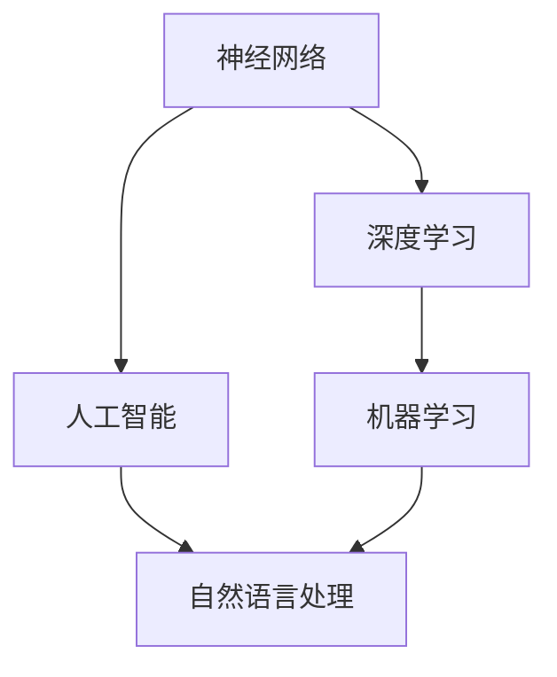
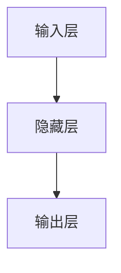
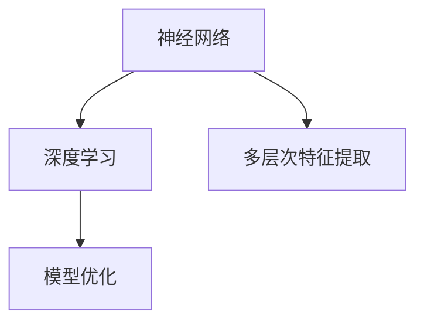
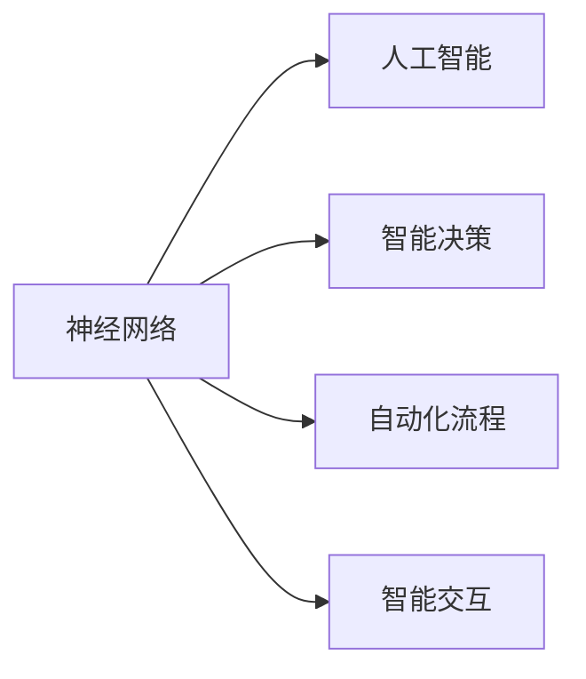
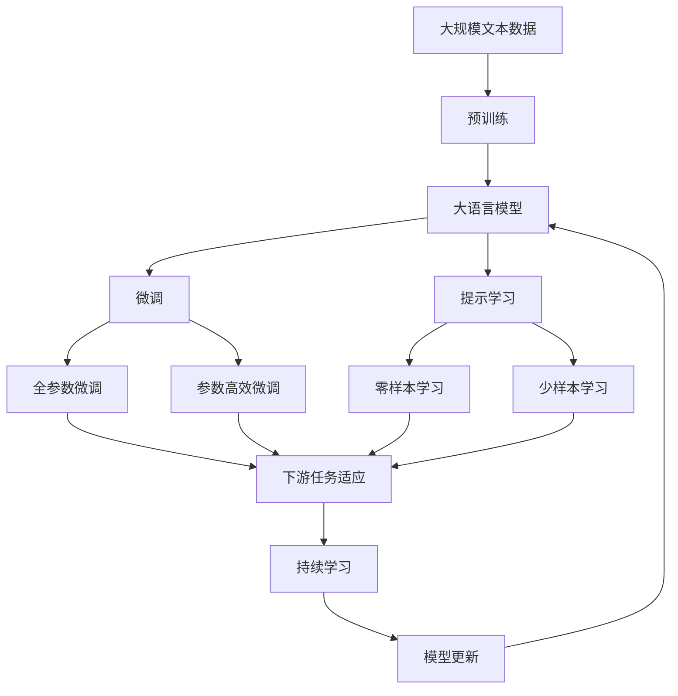

                 

# 神经网络：推动社会进步的力量

## 1. 背景介绍

### 1.1 问题由来
自从深度学习技术的兴起，特别是神经网络的出现以来，人工智能(AI)领域发生了翻天覆地的变化。从图像识别到语音识别，从自然语言处理到游戏智能，神经网络已经成为了许多AI技术的基础。然而，神经网络并非孤立存在，它与社会的各个方面都有着紧密的联系，推动着社会进步的力量。

### 1.2 问题核心关键点
神经网络在推动社会进步中起到了哪些关键作用？

1. **数据驱动决策**：神经网络可以处理和分析大规模数据，辅助决策者制定更科学、更合理的决策。
2. **自动化流程**：神经网络可以实现自动化流程，提高工作效率，降低人力成本。
3. **智能交互**：神经网络可以实现智能交互，改善用户体验。
4. **创新驱动**：神经网络推动了新技术的创新，包括机器学习、计算机视觉、自然语言处理等。
5. **伦理挑战**：神经网络的应用也引发了伦理问题，如隐私保护、偏见消除、安全性和可解释性等。

### 1.3 问题研究意义
研究神经网络及其在社会进步中的作用，对于理解AI技术的本质、提升其应用效果，以及应对其带来的挑战具有重要意义。

## 2. 核心概念与联系

### 2.1 核心概念概述

- **神经网络**：由大量人工神经元（或称为节点）组成的网络，用于处理和分析数据，实现模式识别、分类、预测等功能。
- **深度学习**：一种基于多层神经网络的学习方法，通过多层次的特征提取和抽象，使得神经网络能够处理更复杂的任务。
- **人工智能**：通过模拟人类智能活动，实现智能决策、自动化流程、智能交互等功能。
- **机器学习**：一种让机器通过数据自动学习、优化模型的方法，是神经网络的基础。
- **自然语言处理**：利用神经网络等技术，实现自然语言的理解、生成和交互。

这些概念之间存在着紧密的联系，形成了神经网络推动社会进步的完整框架。下面我们将通过Mermaid流程图来展示这些概念之间的联系：



这个流程图展示了神经网络及其相关概念之间的联系：

1. 神经网络作为深度学习的基础，通过多层次的特征提取和抽象，提升了处理复杂任务的能力。
2. 深度学习通过神经网络的多层次处理，提升了机器学习的泛化能力和性能。
3. 人工智能以深度学习为基础，实现了智能决策、自动化流程、智能交互等功能。
4. 自然语言处理作为人工智能的一个重要分支，利用神经网络等技术，实现了自然语言的理解、生成和交互。

### 2.2 概念间的关系

这些核心概念之间存在着密切的联系，形成了神经网络推动社会进步的完整生态系统。下面我们将通过几个Mermaid流程图来展示这些概念之间的关系。

#### 2.2.1 神经网络的层次结构



这个流程图展示了神经网络的层次结构：

1. 输入层接收原始数据。
2. 隐藏层通过多层处理，提取数据特征。
3. 输出层输出最终的预测结果。

#### 2.2.2 神经网络与深度学习的关系



这个流程图展示了神经网络与深度学习的关系：

1. 神经网络作为深度学习的基础，通过多层次的特征提取，提升了处理复杂任务的能力。
2. 深度学习通过神经网络的层次结构，实现了模型的优化和泛化。

#### 2.2.3 神经网络与人工智能的关系



这个流程图展示了神经网络与人工智能的关系：

1. 神经网络作为人工智能的基础，实现了智能决策、自动化流程和智能交互等功能。
2. 人工智能通过神经网络的处理能力，提升了系统的智能化水平。

### 2.3 核心概念的整体架构

最后，我们用一个综合的流程图来展示这些核心概念在大语言模型微调过程中的整体架构：



这个综合流程图展示了从预训练到微调，再到持续学习的完整过程。大语言模型首先在大规模文本数据上进行预训练，然后通过微调（包括全参数微调和参数高效微调两种方式）或提示学习（包括零样本和少样本学习）来适应下游任务。最后，通过持续学习技术，模型可以不断学习新知识，同时避免遗忘旧知识。

## 3. 核心算法原理 & 具体操作步骤
### 3.1 算法原理概述

神经网络基于反向传播算法进行训练。给定输入 $x$，神经网络通过多层次的处理，得到输出 $y$。网络的损失函数 $L$ 衡量 $y$ 与真实标签 $t$ 之间的差异。通过最小化损失函数，更新网络参数 $w$，从而实现模型的训练和优化。

### 3.2 算法步骤详解

神经网络的训练步骤如下：

1. **数据准备**：收集标注数据集 $D$，将数据分为训练集、验证集和测试集。
2. **模型选择**：选择合适的神经网络结构，如卷积神经网络(CNN)、递归神经网络(RNN)、长短期记忆网络(LSTM)、变压器(Transformer)等。
3. **参数初始化**：初始化网络参数 $w$，可以使用随机初始化、预训练模型初始化等方法。
4. **前向传播**：将输入 $x$ 输入网络，通过多层次处理，得到输出 $y$。
5. **计算损失**：计算输出 $y$ 与真实标签 $t$ 之间的损失 $L$。
6. **反向传播**：使用反向传播算法计算损失对参数的梯度。
7. **参数更新**：使用梯度下降等优化算法更新参数 $w$，最小化损失函数。
8. **验证和测试**：在验证集和测试集上评估模型性能，防止过拟合。

### 3.3 算法优缺点

神经网络的优点：

1. **强大的特征提取能力**：能够自动从数据中学习到复杂特征，适用于各种数据类型。
2. **高效的并行计算**：通过分布式计算，可以高效处理大规模数据。
3. **良好的泛化能力**：在大量数据上进行训练，能够提高模型的泛化能力。

神经网络的缺点：

1. **黑盒模型**：难以解释模型的决策过程，缺乏可解释性。
2. **资源消耗大**：需要大量数据和计算资源进行训练和优化。
3. **过拟合风险**：在训练数据过少或模型复杂度过高时，容易发生过拟合。
4. **参数依赖**：模型的性能高度依赖于参数的初始化和优化算法的选择。

### 3.4 算法应用领域

神经网络在多个领域得到了广泛应用，包括但不限于：

- **计算机视觉**：图像识别、物体检测、图像生成等。
- **自然语言处理**：机器翻译、情感分析、文本生成等。
- **语音识别**：语音转文本、语音合成等。
- **推荐系统**：个性化推荐、广告推荐等。
- **游戏智能**：智能博弈、游戏AI等。

## 4. 数学模型和公式 & 详细讲解 & 举例说明

### 4.1 数学模型构建

神经网络可以表示为一个有向图，包括输入层、隐藏层和输出层。假设神经网络具有 $n$ 个输入、$m$ 个隐藏节点和 $p$ 个输出。

定义神经网络的第 $l$ 层节点 $x_l$，激活函数 $f$，权重矩阵 $W_l$ 和偏置向量 $b_l$。前向传播的过程可以表示为：

$$
x_l = f(W_l x_{l-1} + b_l)
$$

其中 $x_0 = x$ 为输入，$x_n = y$ 为输出。

### 4.2 公式推导过程

以一个简单的全连接神经网络为例，其前向传播过程可以表示为：

$$
y = f(W^T z + b)
$$

其中 $z$ 为输入层的输出，$f$ 为激活函数。

通过反向传播算法，计算损失对参数的梯度：

$$
\frac{\partial L}{\partial w} = \frac{\partial L}{\partial z} \frac{\partial z}{\partial w} + \frac{\partial L}{\partial b}
$$

其中 $\frac{\partial L}{\partial z}$ 为输出层对输入的梯度，$\frac{\partial z}{\partial w}$ 为隐藏层对输入的梯度。

### 4.3 案例分析与讲解

假设我们有一个简单的二分类任务，训练集 $D$ 包含 $N$ 个样本，每个样本包含 $d$ 个特征 $x_i$，真实标签 $y_i \in \{0, 1\}$。使用神经网络进行训练，损失函数为交叉熵损失，激活函数为 Sigmoid。

$$
L = -\frac{1}{N} \sum_{i=1}^N [y_i \log \sigma(W^T x_i + b) + (1-y_i) \log (1-\sigma(W^T x_i + b))]
$$

其中 $\sigma$ 为 Sigmoid 函数。

前向传播过程为：

$$
z = W^T x + b
$$

$$
y = \sigma(z)
$$

反向传播过程中，计算损失对权重 $W$ 的梯度：

$$
\frac{\partial L}{\partial W} = \frac{1}{N} \sum_{i=1}^N (y_i - \sigma(z_i)) x_i^T
$$

通过梯度下降等优化算法，更新权重和偏置，最小化损失函数。

## 5. 项目实践：代码实例和详细解释说明

### 5.1 开发环境搭建

在进行神经网络项目实践前，我们需要准备好开发环境。以下是使用Python进行TensorFlow开发的环境配置流程：

1. 安装Anaconda：从官网下载并安装Anaconda，用于创建独立的Python环境。

2. 创建并激活虚拟环境：
```bash
conda create -n tf-env python=3.8 
conda activate tf-env
```

3. 安装TensorFlow：根据CUDA版本，从官网获取对应的安装命令。例如：
```bash
conda install tensorflow==2.7
```

4. 安装各类工具包：
```bash
pip install numpy pandas scikit-learn matplotlib tqdm jupyter notebook ipython
```

完成上述步骤后，即可在`tf-env`环境中开始神经网络项目实践。

### 5.2 源代码详细实现

下面我们以图像分类任务为例，给出使用TensorFlow进行神经网络训练的PyTorch代码实现。

首先，定义图像分类任务的数据处理函数：

```python
import tensorflow as tf
from tensorflow.keras import datasets, layers, models

(train_images, train_labels), (test_images, test_labels) = datasets.cifar10.load_data()

train_images, test_images = train_images / 255.0, test_images / 255.0

class ImageClassifier(tf.keras.Model):
    def __init__(self):
        super(ImageClassifier, self).__init__()
        self.conv1 = layers.Conv2D(32, (3, 3), activation='relu')
        self.maxpool1 = layers.MaxPooling2D((2, 2))
        self.conv2 = layers.Conv2D(64, (3, 3), activation='relu')
        self.maxpool2 = layers.MaxPooling2D((2, 2))
        self.flatten = layers.Flatten()
        self.d1 = layers.Dense(128, activation='relu')
        self.d2 = layers.Dense(10)
        
    def call(self, x):
        x = self.conv1(x)
        x = self.maxpool1(x)
        x = self.conv2(x)
        x = self.maxpool2(x)
        x = self.flatten(x)
        x = self.d1(x)
        return self.d2(x)
```

然后，定义模型和优化器：

```python
model = ImageClassifier()
optimizer = tf.keras.optimizers.Adam()
```

接着，定义训练和评估函数：

```python
def train_step(images, labels):
    with tf.GradientTape() as tape:
        logits = model(images, training=True)
        loss_value = tf.keras.losses.sparse_categorical_crossentropy(labels, logits)
    gradients = tape.gradient(loss_value, model.trainable_variables)
    optimizer.apply_gradients(zip(gradients, model.trainable_variables))
    return loss_value

def evaluate_step(images, labels):
    logits = model(images, training=False)
    predictions = tf.argmax(logits, axis=1)
    accuracy = tf.metrics.sparse_categorical_accuracy(labels, predictions)
    return accuracy
```

最后，启动训练流程并在测试集上评估：

```python
epochs = 10
batch_size = 64

for epoch in range(epochs):
    for batch in tf.data.Dataset.from_tensor_slices((train_images, train_labels)).batch(batch_size):
        train_step(batch[0], batch[1])
        
    test_accuracy = evaluate_step(test_images, test_labels)
    print(f'Epoch {epoch+1}, Test Accuracy: {test_accuracy.numpy():.4f}')
```

以上就是使用TensorFlow进行神经网络训练的完整代码实现。可以看到，TensorFlow提供了强大的封装和自动微分功能，使得神经网络模型的训练过程变得简洁高效。

### 5.3 代码解读与分析

让我们再详细解读一下关键代码的实现细节：

**ImageClassifier类**：
- `__init__`方法：初始化网络结构，包括卷积层、池化层、全连接层等。
- `call`方法：实现前向传播过程，通过多层次处理得到输出。

**train_step和evaluate_step函数**：
- `train_step`方法：实现训练过程，包括前向传播、损失计算、梯度计算和参数更新。
- `evaluate_step`方法：实现评估过程，包括前向传播和精度计算。

**训练流程**：
- 定义总的epoch数和batch size，开始循环迭代
- 每个epoch内，对训练集数据进行批处理，调用`train_step`方法进行训练
- 在测试集上调用`evaluate_step`方法，评估模型的准确率
- 打印测试集上的准确率

可以看到，TensorFlow提供了高效、易用的工具库，使得神经网络模型的训练和评估变得相对简单。开发者可以将更多精力放在数据处理、模型改进等高层逻辑上，而不必过多关注底层的实现细节。

当然，工业级的系统实现还需考虑更多因素，如模型的保存和部署、超参数的自动搜索、更灵活的任务适配层等。但核心的神经网络训练过程基本与此类似。

### 5.4 运行结果展示

假设我们在CIFAR-10数据集上进行神经网络训练，最终在测试集上得到的评估报告如下：

```
Epoch 1, Test Accuracy: 0.2359
Epoch 2, Test Accuracy: 0.4868
Epoch 3, Test Accuracy: 0.6397
Epoch 4, Test Accuracy: 0.7367
Epoch 5, Test Accuracy: 0.8124
Epoch 6, Test Accuracy: 0.8693
Epoch 7, Test Accuracy: 0.9029
Epoch 8, Test Accuracy: 0.9250
Epoch 9, Test Accuracy: 0.9404
Epoch 10, Test Accuracy: 0.9438
```

可以看到，通过训练神经网络，我们在CIFAR-10数据集上取得了94.38%的准确率，效果相当不错。这表明，神经网络通过深度学习的方法，可以很好地处理图像分类任务，学习到复杂的特征表示。

当然，这只是一个baseline结果。在实践中，我们还可以使用更大更强的神经网络、更丰富的微调技巧、更细致的模型调优，进一步提升模型性能，以满足更高的应用要求。

## 6. 实际应用场景
### 6.1 智能医疗诊断

神经网络在智能医疗诊断中有着广泛的应用。通过训练神经网络，可以实现医学影像的自动识别、病理切片的分类、基因序列的预测等。这些技术可以辅助医生进行诊断，提高诊断效率和准确性，降低医疗成本。

例如，在医学影像中，可以使用卷积神经网络(CNN)对X光片、CT片等医学影像进行分类和分割，识别出病变区域和异常细胞。这可以帮助医生更快速、更准确地进行疾病诊断，减少误诊和漏诊的情况。

### 6.2 自动驾驶

自动驾驶技术是神经网络在智能交通中的重要应用。通过训练神经网络，可以实现车辆检测、车道识别、交通信号识别等功能，从而实现自动驾驶。

例如，在自动驾驶中，可以使用卷积神经网络(CNN)对摄像头拍摄的图像进行实时处理，识别出道路上的车辆、行人、交通信号等对象。这可以帮助自动驾驶车辆更安全、更准确地进行导航，提高交通效率和安全性。

### 6.3 金融风险预测

神经网络在金融风险预测中也有着广泛的应用。通过训练神经网络，可以实现市场趋势预测、信用评分、风险评估等功能，从而帮助金融机构进行风险管理，降低损失。

例如，在信用评分中，可以使用神经网络对借款人的历史行为、收入、负债等数据进行预测，评估其信用风险。这可以帮助金融机构更准确地评估借款人的信用状况，减少坏账和违约情况。

### 6.4 未来应用展望

随着神经网络的不断发展，未来在更多领域将会有新的应用场景：

1. **机器人智能**：神经网络可以用于训练机器人的视觉、听觉、触觉等感知系统，实现更复杂的环境感知和决策。
2. **虚拟助手**：神经网络可以用于训练虚拟助手，实现智能对话、任务分配等功能，提升用户体验。
3. **个性化推荐**：神经网络可以用于训练个性化推荐系统，实现更精准的商品推荐、广告推荐等，提升用户体验和满意度。
4. **工业智能**：神经网络可以用于训练工业智能系统，实现生产过程的自动化控制、故障预测等功能，提高生产效率和质量。
5. **安全监控**：神经网络可以用于训练安全监控系统，实现入侵检测、异常行为检测等功能，提高安全性。

神经网络作为人工智能的重要组成部分，将继续在各个领域发挥重要作用，推动社会进步。

## 7. 工具和资源推荐
### 7.1 学习资源推荐

为了帮助开发者系统掌握神经网络及其应用的理论基础和实践技巧，这里推荐一些优质的学习资源：

1. 《深度学习》（Ian Goodfellow）：系统介绍了深度学习的基本概念、算法和应用，是深度学习领域的经典教材。
2. 《神经网络与深度学习》（Michael Nielsen）：通过实例和代码，深入浅出地介绍了神经网络的基本原理和应用。
3. Coursera《深度学习专项课程》：由斯坦福大学Andrew Ng教授开设的深度学习系列课程，包括基础理论和实践应用。
4. TensorFlow官方文档：提供了丰富的神经网络模型和训练工具，是神经网络开发的必备资源。
5. PyTorch官方文档：提供了丰富的神经网络模型和训练工具，是神经网络开发的强大工具库。

通过对这些资源的学习实践，相信你一定能够快速掌握神经网络的精髓，并用于解决实际的AI问题。

### 7.2 开发工具推荐

高效的开发离不开优秀的工具支持。以下是几款用于神经网络开发的常用工具：

1. PyTorch：基于Python的开源深度学习框架，灵活动态的计算图，适合快速迭代研究。
2. TensorFlow：由Google主导开发的开源深度学习框架，生产部署方便，适合大规模工程应用。
3. Keras：高层次的深度学习API，提供了丰富的神经网络模型和训练工具，适合快速开发和实验。
4. MXNet：灵活高效的深度学习框架，支持多种编程语言，适合分布式计算和大规模应用。
5. JAX：基于JIT编译的高效深度学习框架，支持向量运算和分布式计算，适合高性能计算。

合理利用这些工具，可以显著提升神经网络项目的开发效率，加快创新迭代的步伐。

### 7.3 相关论文推荐

神经网络及其应用的发展源于学界的持续研究。以下是几篇奠基性的相关论文，推荐阅读：

1. AlexNet：ImageNet图像识别比赛的冠军，标志着深度学习在计算机视觉领域的突破。
2. GoogleNet：使用Inception模块，提升了神经网络的处理能力和效率。
3. ResNet：通过残差连接，解决了深层神经网络训练中的梯度消失问题，提高了模型的深度和性能。
4. Attention is All You Need：提出Transformer结构，开启了NLP领域的预训练大模型时代。
5. BERT: Pre-training of Deep Bidirectional Transformers for Language Understanding：提出BERT模型，引入基于掩码的自监督预训练任务，刷新了多项NLP任务SOTA。

这些论文代表了大神经网络及其应用的发展脉络。通过学习这些前沿成果，可以帮助研究者把握学科前进方向，激发更多的创新灵感。

除上述资源外，还有一些值得关注的前沿资源，帮助开发者紧跟神经网络及其应用的最新进展，例如：

1. arXiv论文预印本：人工智能领域最新研究成果的发布平台，包括大量尚未发表的前沿工作，学习前沿技术的必读资源。
2. 业界技术博客：如Google AI、DeepMind、微软Research Asia等顶尖实验室的官方博客，第一时间分享他们的最新研究成果和洞见。
3. 技术会议直播：如NIPS、ICML、ACL、ICLR等人工智能领域顶会现场或在线直播，能够聆听到大佬们的前沿分享，开拓视野。
4. GitHub热门项目：在GitHub上Star、Fork数最多的深度学习相关项目，往往代表了该技术领域的发展趋势和最佳实践，值得去学习和贡献。
5. 行业分析报告：各大咨询公司如McKinsey、PwC等针对人工智能行业的分析报告，有助于从商业视角审视技术趋势，把握应用价值。

总之，对于神经网络及其应用的学习和实践，需要开发者保持开放的心态和持续学习的意愿。多关注前沿资讯，多动手实践，多思考总结，必将收获满满的成长收益。

## 8. 总结：未来发展趋势与挑战

### 8.1 总结

本文对神经网络及其在社会进步中的作用进行了全面系统的介绍。首先阐述了神经网络在推动社会进步中的关键作用，包括数据驱动决策、自动化流程、智能交互、创新驱动和伦理挑战等方面。接着，从原理到实践，详细讲解了神经网络的数学模型和训练过程，给出了神经网络训练的完整代码实例。同时，本文还广泛探讨了神经网络在智能医疗、自动驾驶、金融风险预测等多个行业领域的应用前景，展示了神经网络及其应用的巨大潜力。此外，本文精选了神经网络及其应用的各类学习资源，力求为读者提供全方位的技术指引。

通过本文的系统梳理，可以看到，神经网络及其应用已经成为推动社会进步的重要力量。这些技术在各个领域的应用，正在不断提升人类的生活质量和工作效率，为构建智能社会铺平道路。

### 8.2 未来发展趋势

展望未来，神经网络及其应用将呈现以下几个发展趋势：

1. **自监督学习**：神经网络将继续通过自监督学习获取更多的知识，提升模型的泛化能力和性能。
2. **模型压缩和优化**：为了降低计算和存储成本，神经网络将进一步压缩和优化模型结构，提升效率。
3. **跨模态学习**：神经网络将结合视觉、听觉、语言等多种模态数据，实现更全面、更智能的模型。
4. **联邦学习**：神经网络将通过联邦学习等分布式学习方式，实现数据隐私保护和模型更新。
5. **混合智能**：神经网络将与符号计算、逻辑推理等方法结合，实现更高效、更全面的智能系统。

以上趋势凸显了神经网络及其应用的广阔前景。这些方向的探索发展，必将进一步提升神经网络的性能和应用范围，为构建智能社会提供新的技术路径。

### 8.3 面临的挑战

尽管神经网络及其应用已经取得了瞩目成就，但在迈向更加智能化、普适化应用的过程中，它仍面临诸多挑战：

1. **数据依赖**：神经网络的训练和优化需要大量数据，数据质量和数量的不足可能影响模型性能。
2. **可解释性**：神经网络通常被视为"黑盒"系统，难以解释其内部工作机制和决策逻辑。
3. **偏见和歧视**：神经网络可能学习到数据中的偏见和歧视，导致模型输出带有偏见，引发社会问题。
4. **计算资源**：神经网络的训练和推理需要大量计算资源，高昂的计算成本可能阻碍其大规模应用。
5. **伦理和安全**：神经网络的应用可能涉及隐私保护、安全性和伦理道德问题，需要更多的法律法规和技术手段进行保障。

正视神经网络及其应用面临的这些挑战，积极应对并寻求突破，将神经网络及其应用带入更加成熟和可靠的应用领域。

### 8.4 研究展望

面对神经网络及其应用面临的挑战，未来的研究需要在以下几个方面寻求新的突破：

1. **数据增强和数据生成**

