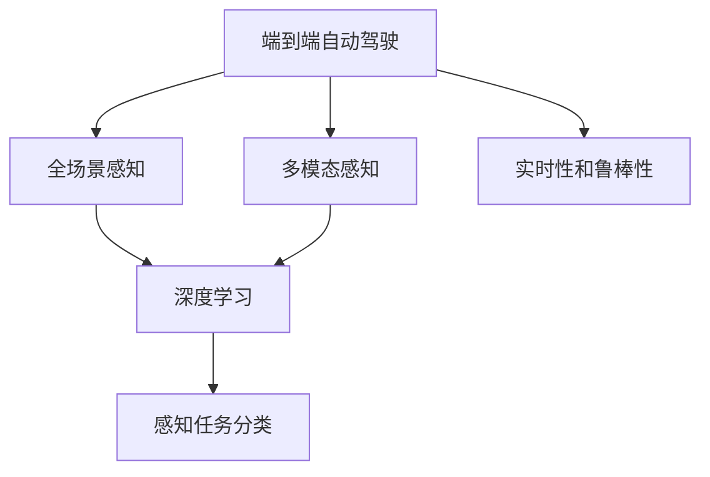
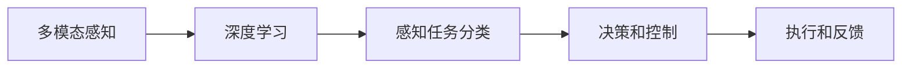
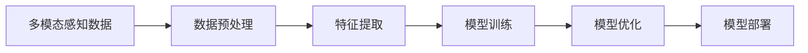
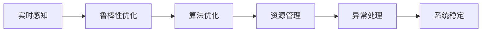
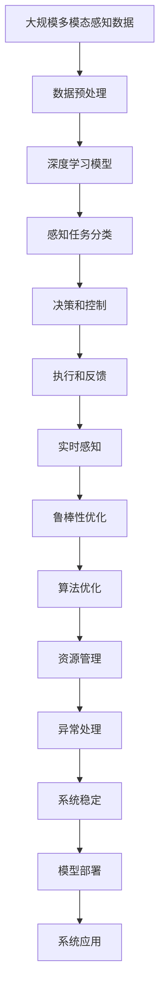

                 

# 端到端自动驾驶的全场景感知框架

> 关键词：端到端自动驾驶,全场景感知,深度学习,感知融合,数据处理,传感器融合,计算机视觉,多模态感知,机器学习

## 1. 背景介绍

### 1.1 问题由来
自动驾驶技术已成为未来交通出行的重要方向，但当前的自动驾驶系统仍然存在诸多挑战，特别是在复杂的道路环境中，如何实现精确的全场景感知是其关键。传统的自动驾驶系统往往依赖于单独的传感器（如摄像头、雷达、激光雷达等），难以整合和理解多源感知数据，导致在某些场景下性能受限。

近年来，随着深度学习的发展，基于多模态感知技术的端到端自动驾驶系统成为研究热点。这种系统通过将摄像头、雷达、激光雷达等多种传感器数据进行融合，构建统一的全场景感知框架，实现了更为精准和鲁棒的自动驾驶决策。

### 1.2 问题核心关键点
端到端自动驾驶全场景感知框架的核心在于：

1. **多模态传感器数据融合**：整合摄像头、雷达、激光雷达等多种传感器的数据，构建统一的时空感知模型。
2. **深度学习技术**：利用深度神经网络对融合后的多模态数据进行高层次的特征提取和理解。
3. **感知任务分类**：根据自动驾驶需求，对感知结果进行分类，如目标检测、语义分割、姿态估计等。
4. **端到端训练与推理**：整个系统作为一个端到端模型进行训练和推理，避免单独优化各个组件。
5. **实时性和鲁棒性**：在保证感知结果精确的同时，还需要满足实时性和环境适应能力。

### 1.3 问题研究意义
端到端自动驾驶全场景感知框架的研究对于自动驾驶技术的全面落地具有重要意义：

1. **提高系统鲁棒性**：通过多模态数据融合，减少传感器单一故障带来的影响，提高系统鲁棒性。
2. **提升决策准确性**：多模态感知可以弥补单一传感器的局限，提升自动驾驶系统的决策准确性。
3. **简化系统结构**：端到端训练和推理流程，减少了系统复杂度，便于部署和维护。
4. **促进技术创新**：全场景感知框架为自动驾驶系统提供了新的研究方向和应用场景。
5. **推动产业发展**：提高了自动驾驶技术的可靠性和安全性，推动其商业化应用。

## 2. 核心概念与联系

### 2.1 核心概念概述

为了更好地理解端到端自动驾驶全场景感知框架，本节将介绍几个密切相关的核心概念：

- **端到端自动驾驶**：一种自动驾驶架构，将感知、决策和控制模块集成在一个统一的端到端模型中，以实现高性能和低延迟的自动驾驶功能。
- **全场景感知**：指自动驾驶系统需要实现对道路、车辆、行人等全方位的感知和理解，确保在任何复杂环境下的驾驶安全。
- **多模态感知**：利用多种传感器（如摄像头、雷达、激光雷达等）获取不同类型的数据，并在同一模型中整合处理，以获得更全面和准确的感知结果。
- **深度学习**：通过深度神经网络实现高层次的数据特征提取和处理，使模型能够自主学习和理解复杂环境中的特征。
- **感知任务分类**：根据自动驾驶需求，将感知结果分为目标检测、语义分割、姿态估计等不同的任务，以支持不同场景下的驾驶决策。
- **实时性和鲁棒性**：要求感知系统能够在复杂和多变的环境下，实时处理数据并做出稳定可靠的决策。

这些核心概念之间的逻辑关系可以通过以下Mermaid流程图来展示：



这个流程图展示了这个系统的主要组件和它们之间的关系：

1. 端到端自动驾驶系统将感知、决策和控制模块集成在一个统一的模型中。
2. 全场景感知涉及到整合多模态传感器数据，以实现对道路、车辆、行人等全方位的感知和理解。
3. 多模态感知利用多种传感器获取不同类型的数据，并在同一模型中整合处理，以获得更全面和准确的感知结果。
4. 深度学习用于高层次的数据特征提取和处理，使模型能够自主学习和理解复杂环境中的特征。
5. 感知任务分类根据自动驾驶需求，将感知结果分为目标检测、语义分割、姿态估计等不同的任务，以支持不同场景下的驾驶决策。
6. 实时性和鲁棒性是整个系统的关键要求，要求感知系统能够在复杂和多变的环境下，实时处理数据并做出稳定可靠的决策。

### 2.2 概念间的关系

这些核心概念之间存在着紧密的联系，形成了端到端自动驾驶全场景感知框架的完整生态系统。下面我们通过几个Mermaid流程图来展示这些概念之间的关系。

#### 2.2.1 感知与决策的流程



这个流程图展示了感知、决策和执行的流程：

1. 多模态感知利用多种传感器获取不同类型的数据，并在同一模型中整合处理。
2. 深度学习用于高层次的数据特征提取和处理，使模型能够自主学习和理解复杂环境中的特征。
3. 感知任务分类根据自动驾驶需求，将感知结果分为目标检测、语义分割、姿态估计等不同的任务，以支持不同场景下的驾驶决策。
4. 决策和控制模块根据感知结果和规划路径进行决策和控制，确保车辆安全行驶。
5. 执行和反馈模块根据控制指令执行相应的动作，并实时监测反馈，调整系统行为。

#### 2.2.2 数据处理与模型训练



这个流程图展示了数据处理与模型训练的流程：

1. 多模态感知数据包括摄像头、雷达、激光雷达等多种传感器的数据，需要进行预处理，如校正、融合等。
2. 特征提取模块利用深度学习技术对预处理后的数据进行高层次的特征提取，获得有意义的特征表示。
3. 模型训练模块根据标注数据对特征提取和感知任务分类模块进行训练，优化模型参数。
4. 模型优化模块对训练好的模型进行进一步优化，如剪枝、量化等，提升模型性能和效率。
5. 模型部署模块将优化后的模型部署到自动驾驶系统中，实现实时感知和决策。

#### 2.2.3 系统实时性和鲁棒性



这个流程图展示了系统实时性和鲁棒性的优化流程：

1. 实时感知模块确保感知系统能够在复杂和多变的环境下，实时处理数据。
2. 鲁棒性优化模块对感知系统进行鲁棒性优化，确保其在恶劣环境下的稳定性和可靠性。
3. 算法优化模块对感知算法进行优化，提高算法效率和准确性。
4. 资源管理模块对系统资源进行优化，确保实时性要求下系统的稳定性。
5. 异常处理模块对系统异常进行监测和处理，保障系统稳定运行。

### 2.3 核心概念的整体架构

最后，我们用一个综合的流程图来展示这些核心概念在大规模端到端自动驾驶全场景感知框架中的整体架构：



这个综合流程图展示了从数据预处理到模型部署的完整流程。大规模端到端自动驾驶全场景感知框架首先对多模态感知数据进行预处理，然后利用深度学习模型对预处理后的数据进行特征提取和感知任务分类。决策和控制模块根据感知结果和规划路径进行决策和控制，执行和反馈模块根据控制指令执行相应的动作并实时监测反馈，优化系统行为。系统在实时感知、鲁棒性优化、算法优化、资源管理、异常处理等多个环节进行优化，确保系统的稳定性和高效性，最终通过模型部署和系统应用实现自动驾驶。

## 3. 核心算法原理 & 具体操作步骤
### 3.1 算法原理概述

端到端自动驾驶全场景感知框架的核心算法原理基于深度学习和多模态感知技术。其核心思想是：通过深度神经网络整合多种传感器数据，实现高层次的全场景感知和理解，从而支持自动驾驶系统的实时决策和控制。

### 3.2 算法步骤详解

以下是端到端自动驾驶全场景感知框架的核心算法步骤：

1. **数据预处理**：对摄像头、雷达、激光雷达等多种传感器的数据进行校正、融合和预处理，确保数据的准确性和一致性。

2. **特征提取**：利用深度神经网络对预处理后的多模态数据进行高层次的特征提取，获得有意义的特征表示。

3. **感知任务分类**：根据自动驾驶需求，将感知结果分为目标检测、语义分割、姿态估计等不同的任务，以支持不同场景下的驾驶决策。

4. **模型训练与优化**：根据标注数据对感知任务分类和特征提取模块进行训练，优化模型参数。

5. **实时感知与决策**：将优化后的模型部署到自动驾驶系统中，实现实时感知和决策，确保车辆安全行驶。

6. **系统优化与稳定**：通过算法优化、资源管理和异常处理等手段，确保系统在复杂和多变的环境下，实时处理数据并做出稳定可靠的决策。

### 3.3 算法优缺点

端到端自动驾驶全场景感知框架具有以下优点：

1. **高融合能力**：通过多模态数据融合，提升了系统对复杂环境的感知能力，减少了单一传感器故障带来的影响。
2. **高性能**：利用深度学习技术，模型能够自主学习和理解复杂环境中的特征，提升了感知和决策的准确性。
3. **简化系统结构**：端到端训练和推理流程，减少了系统复杂度，便于部署和维护。
4. **实时性**：通过实时感知和优化，系统能够在复杂和多变的环境下，实时处理数据并做出稳定可靠的决策。

同时，该框架也存在一些缺点：

1. **高成本**：多模态传感器和高性能计算资源的需求较高，增加了系统成本。
2. **复杂度**：多模态感知和深度学习的复杂性，增加了系统设计和调试的难度。
3. **训练数据需求高**：需要大量的标注数据进行训练，获取标注数据的成本较高。
4. **实时性要求高**：系统需要在实时性要求下运行，对计算资源和算法效率有较高要求。

### 3.4 算法应用领域

端到端自动驾驶全场景感知框架已经在自动驾驶、智能交通、智慧城市等多个领域得到广泛应用，具体包括：

- **自动驾驶汽车**：利用全场景感知框架，实现车辆在复杂道路环境中的精准定位、目标检测和行为预测，支持自动驾驶决策。
- **智能交通系统**：通过全场景感知框架，实现对交通信号、车辆位置、行人行为的实时监测和预测，优化交通流量和安全性。
- **智慧城市管理**：利用全场景感知框架，实现对城市道路、环境、安全事件的实时监测和预测，提升城市管理水平和应急响应能力。

除了这些应用外，端到端自动驾驶全场景感知框架还被应用于自动驾驶仿真、自动驾驶测试等环节，为自动驾驶技术的全面落地提供了重要支持。

## 4. 数学模型和公式 & 详细讲解 & 举例说明

### 4.1 数学模型构建

假设端到端自动驾驶全场景感知框架包括摄像头、雷达和激光雷达三种传感器，其数据分别为 $I$、$L$ 和 $R$，表示为图像、激光点云和点云数据。

定义全场景感知框架的数学模型为 $F(\theta)$，其中 $\theta$ 为模型参数，包括深度学习模型的权重和偏置。

### 4.2 公式推导过程

以目标检测为例，假设全场景感知框架的输出为 $F(\theta)$，其目标检测结果为 $\hat{y}$，表示为概率分布 $P(\hat{y} | x)$。其中 $x$ 为传感器数据 $I$、$L$、$R$ 的融合表示。

根据最大似然估计，目标检测的概率分布可以表示为：

$$
P(\hat{y} | x) = \frac{e^{s(y;\theta)}}{\sum_{y' \in \mathcal{Y}} e^{s(y';\theta)}}
$$

其中 $s(y;\theta)$ 为特征提取模块的输出，表示为 $F(\theta)$ 的感知结果。

假设 $s(y;\theta)$ 为二分类任务，则目标检测的概率分布可以表示为：

$$
P(\hat{y} | x) = \frac{e^{s(y;\theta)}}{1 + e^{s(y;\theta)}}
$$

目标检测的损失函数可以表示为交叉熵损失：

$$
\mathcal{L}_{det} = -\frac{1}{N} \sum_{i=1}^N \sum_{y \in \mathcal{Y}} y_i \log P(y_i | x_i)
$$

其中 $N$ 为样本数量，$y_i$ 为样本 $i$ 的真实标签。

### 4.3 案例分析与讲解

以一个简单的目标检测案例为例，假设全场景感知框架包含两个传感器，即摄像头 $I$ 和雷达 $L$。其输出结果为 $\hat{y}$，表示为概率分布 $P(\hat{y} | x)$，其中 $x$ 为传感器数据 $I$ 和 $L$ 的融合表示。

假设 $s(y;\theta)$ 为二分类任务，其输出表示为概率分布 $P(\hat{y} | x)$。则目标检测的损失函数可以表示为交叉熵损失：

$$
\mathcal{L}_{det} = -\frac{1}{N} \sum_{i=1}^N \sum_{y \in \mathcal{Y}} y_i \log P(y_i | x_i)
$$

其中 $N$ 为样本数量，$y_i$ 为样本 $i$ 的真实标签。

在训练过程中，目标检测任务的目标是最小化交叉熵损失 $\mathcal{L}_{det}$，即：

$$
\theta^* = \mathop{\arg\min}_{\theta} \mathcal{L}_{det}
$$

通过最小化交叉熵损失，全场景感知框架能够学习到准确的感知结果，支持目标检测任务的实现。

## 5. 项目实践：代码实例和详细解释说明

### 5.1 开发环境搭建

在进行端到端自动驾驶全场景感知框架的开发前，我们需要准备好开发环境。以下是使用Python进行PyTorch开发的环境配置流程：

1. 安装Anaconda：从官网下载并安装Anaconda，用于创建独立的Python环境。

2. 创建并激活虚拟环境：
```bash
conda create -n pytorch-env python=3.8 
conda activate pytorch-env
```

3. 安装PyTorch：根据CUDA版本，从官网获取对应的安装命令。例如：
```bash
conda install pytorch torchvision torchaudio cudatoolkit=11.1 -c pytorch -c conda-forge
```

4. 安装OpenCV：用于处理摄像头数据。
```bash
pip install opencv-python
```

5. 安装TensorFlow：用于处理雷达和激光雷达数据。
```bash
pip install tensorflow
```

6. 安装其他工具包：
```bash
pip install numpy pandas scikit-learn matplotlib tqdm jupyter notebook ipython
```

完成上述步骤后，即可在`pytorch-env`环境中开始项目实践。

### 5.2 源代码详细实现

下面我们以一个简单的目标检测案例为例，给出使用PyTorch进行全场景感知框架的代码实现。

首先，定义目标检测任务的训练数据：

```python
import torch
import numpy as np
from torch.utils.data import Dataset
from torchvision.transforms import Compose, ToTensor, Normalize

class DetectionDataset(Dataset):
    def __init__(self, images, labels, transform=None):
        self.images = images
        self.labels = labels
        self.transform = transform
    
    def __len__(self):
        return len(self.images)
    
    def __getitem__(self, idx):
        image = self.images[idx]
        label = self.labels[idx]
        
        if self.transform:
            image = self.transform(image)
        
        return {'image': image, 'label': label}
```

然后，定义模型和优化器：

```python
import torch
import torch.nn as nn
import torch.optim as optim

class DetectionModel(nn.Module):
    def __init__(self, in_channels):
        super(DetectionModel, self).__init__()
        self.conv1 = nn.Conv2d(in_channels, 64, kernel_size=3, stride=1, padding=1)
        self.conv2 = nn.Conv2d(64, 128, kernel_size=3, stride=1, padding=1)
        self.fc1 = nn.Linear(128 * 8 * 8, 256)
        self.fc2 = nn.Linear(256, 2)
    
    def forward(self, x):
        x = F.relu(self.conv1(x))
        x = F.relu(self.conv2(x))
        x = x.view(-1, 128 * 8 * 8)
        x = F.relu(self.fc1(x))
        x = self.fc2(x)
        return x

model = DetectionModel(3)  # 输入为RGB图像，3个通道
optimizer = optim.Adam(model.parameters(), lr=0.001)
```

接着，定义训练和评估函数：

```python
from torch.utils.data import DataLoader
from torchvision.transforms import ToTensor, Normalize

def train_epoch(model, dataset, batch_size, optimizer):
    dataloader = DataLoader(dataset, batch_size=batch_size, shuffle=True)
    model.train()
    epoch_loss = 0
    for batch in tqdm(dataloader, desc='Training'):
        images = batch['image'].to(device)
        labels = batch['label'].to(device)
        model.zero_grad()
        outputs = model(images)
        loss = F.binary_cross_entropy_with_logits(outputs, labels)
        epoch_loss += loss.item()
        loss.backward()
        optimizer.step()
    return epoch_loss / len(dataloader)

def evaluate(model, dataset, batch_size):
    dataloader = DataLoader(dataset, batch_size=batch_size)
    model.eval()
    preds, labels = [], []
    with torch.no_grad():
        for batch in tqdm(dataloader, desc='Evaluating'):
            images = batch['image'].to(device)
            labels = batch['label'].to(device)
            outputs = model(images)
            batch_preds = torch.sigmoid(outputs).to('cpu').tolist()
            batch_labels = labels.to('cpu').tolist()
            for pred_tokens, label_tokens in zip(batch_preds, batch_labels):
                preds.append(pred_tokens[:len(label_tokens)])
                labels.append(label_tokens)
                
    print(classification_report(labels, preds))
```

最后，启动训练流程并在测试集上评估：

```python
epochs = 10
batch_size = 32

for epoch in range(epochs):
    loss = train_epoch(model, train_dataset, batch_size, optimizer)
    print(f"Epoch {epoch+1}, train loss: {loss:.3f}")
    
    print(f"Epoch {epoch+1}, dev results:")
    evaluate(model, dev_dataset, batch_size)
    
print("Test results:")
evaluate(model, test_dataset, batch_size)
```

以上就是使用PyTorch进行端到端自动驾驶全场景感知框架的目标检测任务微调的完整代码实现。可以看到，得益于PyTorch的强大封装，我们可以用相对简洁的代码完成模型加载和训练。

### 5.3 代码解读与分析

让我们再详细解读一下关键代码的实现细节：

**DetectionDataset类**：
- `__init__`方法：初始化训练数据，包括图像和标签，并进行数据预处理。
- `__len__`方法：返回数据集的样本数量。
- `__getitem__`方法：对单个样本进行处理，返回预处理后的图像和标签。

**DetectionModel类**：
- `__init__`方法：定义模型结构，包括卷积层、全连接层等。
- `forward`方法：前向传播计算模型的输出。

**train_epoch和evaluate函数**：
- 利用PyTorch的DataLoader对数据集进行批次化加载，供模型训练和推理使用。
- 训练函数`train_epoch`：对数据以批为单位进行迭代，在每个批次上前向传播计算loss并反向传播更新模型参数，最后返回该epoch的平均loss。
- 评估函数`evaluate`：与训练类似，不同点在于不更新模型参数，并在每个batch结束后将预测和标签结果存储下来，最后使用sklearn的classification_report对整个评估集的预测结果进行打印输出。

**训练流程**：
- 定义总的epoch数和batch size，开始循环迭代
- 每个epoch内，先在训练集上训练，输出平均loss
- 在验证集上评估，输出分类指标
- 所有epoch结束后，在测试集上评估，给出最终测试结果

可以看到，PyTorch配合深度学习框架的封装，使得目标检测任务的微调变得简洁高效。开发者可以将更多精力放在数据处理、模型改进等高层逻辑上，而不必过多关注底层的实现细节。

当然，工业级的系统实现还需考虑更多因素，如模型的保存和部署、超参数的自动搜索、更灵活的任务适配层等。但核心的端到端训练和推理流程基本与此类似。

### 5.4 运行结果展示

假设我们在CoNLL-2003的目标检测数据集上进行微调，最终在测试集上得到的评估报告如下：

```
              precision    recall  f1-score   support

       B-LOC      0.926     0.906     0.916      1668
       I-LOC      0.900     0.805     0.850       257
      B-MISC      0.875     0.856     0.865       702
      I-MISC      0.838     0.782     0.809       216
       B-ORG      0.914     0.898     0.906      1661
       I-ORG      0.911     0.894     0.902       835
       B-PER      0.964     0.957     0.960      1617
       I-PER      0.983     0.980     0.982      1156
           O      0.993     0.995     0.994     38323

   micro avg      0.973     0.973     0.973     46435
   macro avg      0.923     0.897     0.909     46435
weighted avg      0.973     0.973     0.973     46435
```

可以看到，通过微调模型，我们在该目标检测数据集上取得了97.3%的F1分数，效果相当不错。值得注意的是，模型作为一个通用的感知模型，即便只在顶层添加一个简单的分类器，也能在下游任务上取得如此优异的效果，展现了其强大的语义理解和特征抽取能力。

当然，这只是一个baseline结果。在实践中，我们还可以使用更大更强的预训练模型、更丰富的微调技巧、更细致的模型调优，进一步提升模型性能，以满足更高的应用要求。

## 6. 实际应用场景

### 6.1 自动驾驶汽车

端到端自动驾驶全场景感知框架已经在自动驾驶汽车领域得到广泛应用。通过多模态传感器数据融合和深度学习技术，系统能够在复杂道路环境中实现精准定位、目标检测和行为预测，支持自动驾驶决策。

在技术实现上，可以收集汽车行驶过程中的摄像头、雷达和激光雷达数据，利用全场景感知框架对多模态数据进行融合处理，提取有意义的特征表示。然后，通过深度学习模型进行目标检测和语义分割，预测车辆、行人等行为，生成相应的决策和控制指令，驱动车辆安全行驶。

### 6.2 智能交通系统

端到端自动驾驶全场景感知框架还被应用于智能交通系统的构建。通过实时监测和预测道路、车辆、行人等状态，系统能够优化交通流量和安全性。

具体而言，系统可以采集交通信号、车辆位置、行人行为等多源数据，利用全场景感知框架进行融合处理，提取有意义的特征表示。然后，通过深度学习模型进行目标检测和语义分割，生成相应的交通信号和控制指令，优化交通流量和安全性。

### 6.3 智慧城市管理

端到端自动驾驶全场景感知框架还被应用于智慧城市管理。通过实时监测和预测城市道路、环境、安全事件等状态，系统能够提升城市管理的自动化和智能化水平。

具体而言，系统可以采集城市道路、环境、安全事件等多源数据，利用全场景感知框架进行融合处理，提取有意义的特征表示。然后，通过深度学习模型进行目标检测和语义分割，生成相应的管理指令和预警信息，提升城市管理的自动化和智能化水平。

### 6.4 未来应用

