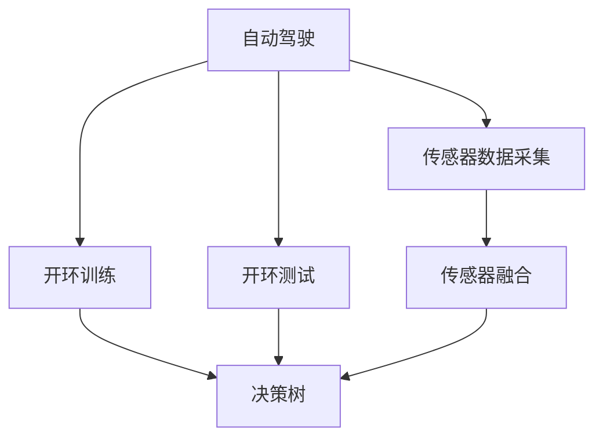
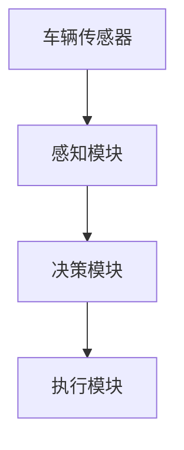
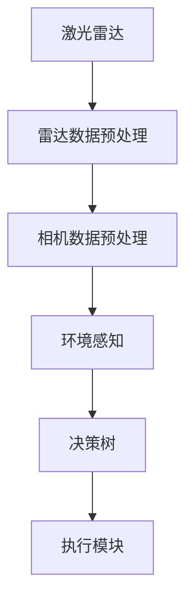
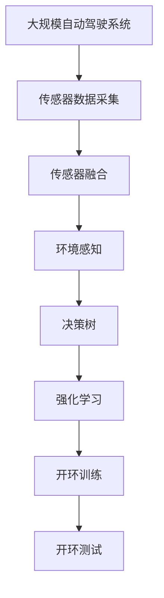

                 

# 端到端自动驾驶的开环训练与开环测试

## 1. 背景介绍

### 1.1 问题由来
自动驾驶技术作为人工智能领域的重大突破，已经在过去十年中取得了飞速发展。其核心思想是通过传感器、计算机视觉和决策控制等技术，实现车辆的自主导航和驾驶。然而，传统的自动驾驶训练方法往往依赖于大量人工驾驶数据，需要大量的标注工作，耗费人力物力，并且难以适应复杂多变的道路环境。

为了突破这一瓶颈，研究人员提出了端到端自动驾驶的开环训练和测试方法。这种方法不依赖于人工标注数据，而是直接利用车辆传感器采集的数据进行训练和测试，能够更好地适应真实道路环境，提高自动驾驶系统的可靠性和安全性。

### 1.2 问题核心关键点
开环训练是指不使用任何人工标注的数据进行训练，完全依赖车辆传感器采集的环境数据。开环测试是指在实际道路环境中进行测试，评估模型在真实场景中的表现。

这种方法的核心在于：
- 传感器数据的利用：如何高效地利用车辆传感器采集的数据，作为模型训练和测试的依据。
- 模型架构的选择：如何在不依赖人工标注数据的情况下，构建有效的自动驾驶模型。
- 安全性与可靠性的保证：如何在实际道路环境中，确保模型输出可靠、决策正确。

### 1.3 问题研究意义
开环训练和测试方法具有以下重要意义：
1. 降低成本：不依赖人工标注数据，减少了人力和物力投入，降低了自动驾驶系统的开发成本。
2. 提高鲁棒性：在真实道路环境中测试模型，能够更好地适应复杂的交通场景和道路条件。
3. 促进技术创新：通过直接利用传感器数据进行训练和测试，能够推动自动驾驶技术在多个层面上的突破。
4. 加速落地应用：开环训练和测试方法能够更快速地将自动驾驶技术应用于实际场景，加速产业化的进程。
5. 增强安全性：在真实道路环境中测试模型，能够发现潜在的安全隐患，提升系统的可靠性。

## 2. 核心概念与联系

### 2.1 核心概念概述

为更好地理解端到端自动驾驶的开环训练和测试方法，本节将介绍几个密切相关的核心概念：

- 自动驾驶：通过传感器、计算机视觉和决策控制等技术，实现车辆的自主导航和驾驶。
- 开环训练：不使用任何人工标注的数据进行训练，完全依赖车辆传感器采集的环境数据。
- 开环测试：在实际道路环境中进行测试，评估模型在真实场景中的表现。
- 传感器融合：将来自不同传感器的数据进行综合，生成更全面、准确的环境感知。
- 决策树：通过构建决策树模型，帮助自动驾驶系统进行决策和控制。
- 强化学习：通过奖励和惩罚机制，使自动驾驶模型在实际道路环境中不断学习和优化。

这些核心概念之间的逻辑关系可以通过以下Mermaid流程图来展示：



这个流程图展示了这个生态系统中各概念之间的关系：

1. 自动驾驶作为整体系统，依赖传感器数据采集和融合。
2. 开环训练和测试是系统的重要组成部分，分别用于训练模型和评估性能。
3. 决策树和强化学习是开环训练和测试中常用的方法，帮助构建和优化自动驾驶模型。

### 2.2 概念间的关系

这些核心概念之间存在着紧密的联系，形成了端到端自动驾驶的开环训练和测试方法。下面我们通过几个Mermaid流程图来展示这些概念之间的关系。

#### 2.2.1 自动驾驶的实现



这个流程图展示了自动驾驶系统的基本实现流程：传感器数据首先经过感知模块的预处理和特征提取，然后由决策模块进行决策和规划，最后通过执行模块控制车辆进行驾驶。

#### 2.2.2 开环训练与测试的关系


这个流程图展示了开环训练和测试的基本流程。传感器数据采集是训练和测试的基础，通过决策树和强化学习等方法，模型在训练和测试过程中不断优化。

#### 2.2.3 传感器融合的实现



这个流程图展示了传感器融合的过程。激光雷达和相机数据经过预处理后，生成环境感知结果，由决策树进行决策和规划，最后控制车辆进行驾驶。

### 2.3 核心概念的整体架构

最后，我们用一个综合的流程图来展示这些核心概念在大规模自动驾驶系统中的整体架构：



这个综合流程图展示了自动驾驶系统的整体架构：传感器数据采集和融合是基础，环境感知和决策树是核心，强化学习、开环训练和测试是重要的优化和评估手段。通过这些环节的协同工作，可以实现高效、可靠的自动驾驶系统。

## 3. 核心算法原理 & 具体操作步骤
### 3.1 算法原理概述

端到端自动驾驶的开环训练和测试方法，其核心思想是通过传感器数据进行自我学习和优化，实现无需人工标注的训练和测试。其原理如下：

1. **传感器数据的采集与融合**：车辆传感器（如激光雷达、相机、GPS等）采集环境数据，通过融合技术将这些数据综合成一个全面、准确的环境感知结果。

2. **决策树的构建**：将环境感知结果输入决策树模型，通过决策树进行决策和控制，生成车辆的控制指令。

3. **强化学习的优化**：在实际道路环境中，通过奖励和惩罚机制，使决策树模型不断学习和优化，提高模型的决策能力和鲁棒性。

4. **开环训练和测试**：利用传感器数据和强化学习反馈，进行开环训练和测试，评估模型在真实场景中的表现。

### 3.2 算法步骤详解

以下详细介绍端到端自动驾驶的开环训练和测试方法的详细步骤：

**Step 1: 传感器数据采集与预处理**

1. 收集车辆传感器数据：激光雷达、相机、GPS等传感器采集车辆周围环境的数据。
2. 数据预处理：对传感器数据进行滤波、校正、融合等预处理，生成环境感知结果。

**Step 2: 决策树的构建**

1. 环境感知结果输入决策树模型：将传感器融合后的环境感知结果输入决策树模型。
2. 构建决策树模型：通过决策树算法，构建决策树模型，用于进行决策和控制。
3. 参数调整：调整决策树模型的参数，如节点数、叶子节点个数等，以提高模型的性能。

**Step 3: 强化学习的优化**

1. 设计奖励和惩罚机制：根据自动驾驶任务的需求，设计奖励和惩罚机制。
2. 模型训练：利用强化学习算法，对决策树模型进行训练，使其在实际道路环境中不断学习和优化。
3. 评估和改进：在实际道路环境中进行测试，评估模型的性能，并根据测试结果进行调整和改进。

**Step 4: 开环训练和测试**

1. 数据采集与融合：利用传感器数据进行环境感知和数据融合。
2. 模型输入与输出：将环境感知结果输入决策树模型，生成车辆的控制指令。
3. 模型评估：在实际道路环境中，进行开环测试，评估模型的性能。
4. 反馈和改进：根据测试结果，进行反馈和改进，优化决策树模型的性能。

### 3.3 算法优缺点

开环训练和测试方法具有以下优点：
1. 成本低：不依赖人工标注数据，减少了人力和物力投入。
2. 鲁棒性好：在真实道路环境中测试模型，能够更好地适应复杂的交通场景和道路条件。
3. 可扩展性好：适用于各种类型的传感器和环境感知技术。

但同时也存在以下缺点：
1. 训练周期长：开环训练需要大量传感器数据和长时间的训练，训练周期较长。
2. 数据稀疏性：传感器数据的稀疏性可能导致模型无法捕捉到所有可能的场景。
3. 鲁棒性不足：模型在实际道路环境中，仍可能存在一些难以处理的特殊情况。

### 3.4 算法应用领域

端到端自动驾驶的开环训练和测试方法，已经在多个领域得到了应用，例如：

- 无人驾驶汽车：应用于无人驾驶汽车的环境感知和决策控制，能够实现自主导航和驾驶。
- 自动驾驶物流：应用于物流车辆的路径规划和运输调度，提高运输效率和安全性。
- 自动驾驶农业：应用于农用车辆的精准耕作和病虫害防治，提高农业生产效率和精准度。
- 智能交通管理：应用于智能交通系统的交通信号控制和流量优化，提高交通系统的效率和安全性。

除上述这些应用领域外，开环训练和测试方法还将在更多场景中得到应用，如智能机器人、无人机等，为智能系统的部署和优化提供新的思路。

## 4. 数学模型和公式 & 详细讲解
### 4.1 数学模型构建

开环训练和测试方法涉及到传感器数据、决策树、强化学习等多个环节。我们以下以决策树模型为例，来详细讲解其数学模型构建过程。

假设环境感知结果为 $x$，决策树模型的参数为 $\theta$，则决策树模型的输出为 $y=f(x;\theta)$。决策树模型的目标是最小化分类误差，即：

$$
\min_{\theta} \frac{1}{N} \sum_{i=1}^N L(y_i, f(x_i;\theta))
$$

其中 $N$ 为样本数，$L$ 为分类误差函数，如交叉熵损失函数。

### 4.2 公式推导过程

以下以决策树模型为例，推导其分类误差函数的公式：

假设决策树模型的叶子节点数为 $k$，每个节点的样本数为 $n_i$，则分类误差函数为：

$$
L=\frac{1}{N} \sum_{i=1}^N \sum_{j=1}^k \frac{n_j}{N} \log (\frac{n_j}{N})
$$

其中 $\frac{n_j}{N}$ 为第 $j$ 个叶子节点上的样本占总样本数的比例。

在训练过程中，通过不断调整决策树模型的参数，使得分类误差最小化，从而得到最优的决策树模型。

### 4.3 案例分析与讲解

假设我们有一组环境感知结果，每个结果对应一个决策树节点。我们的目标是根据这些环境感知结果，构建一个决策树模型，对每个环境感知结果进行分类。

1. 收集环境感知结果：假设我们有一组环境感知结果，每个结果包含车辆位置、速度、周围物体等属性。
2. 数据预处理：对每个环境感知结果进行滤波、校正等预处理，生成环境感知数据。
3. 决策树模型的构建：通过决策树算法，构建决策树模型。例如，我们可以选择信息增益（Information Gain）或信息熵（Entropy）作为特征选择方法，选择最优的节点分裂特征。
4. 模型评估：在实际道路环境中进行测试，评估模型的分类准确率。如果模型分类准确率低，则需要调整模型参数，重新构建模型。
5. 强化学习优化：通过强化学习算法，不断优化决策树模型，提高分类准确率。例如，可以选择Q-learning等强化学习算法，通过奖励和惩罚机制，调整模型参数。

## 5. 项目实践：代码实例和详细解释说明
### 5.1 开发环境搭建

在进行开环训练和测试方法的项目实践前，我们需要准备好开发环境。以下是使用Python进行OpenCV和PyTorch开发的环境配置流程：

1. 安装Anaconda：从官网下载并安装Anaconda，用于创建独立的Python环境。

2. 创建并激活虚拟环境：
```bash
conda create -n opencv-env python=3.8 
conda activate opencv-env
```

3. 安装OpenCV和PyTorch：
```bash
conda install opencv pytorch torchvision
```

4. 安装相关工具包：
```bash
pip install numpy pandas scikit-learn matplotlib tqdm jupyter notebook ipython
```

完成上述步骤后，即可在`opencv-env`环境中开始项目实践。

### 5.2 源代码详细实现

下面以无人驾驶汽车为例，给出使用OpenCV和PyTorch进行开环训练和测试的代码实现。

首先，定义决策树模型的类：

```python
from sklearn.tree import DecisionTreeClassifier
import numpy as np

class DecisionTreeModel:
    def __init__(self, max_depth=5, min_samples_split=2):
        self.model = DecisionTreeClassifier(max_depth=max_depth, min_samples_split=min_samples_split)
    
    def train(self, X, y):
        self.model.fit(X, y)
    
    def predict(self, X):
        return self.model.predict(X)
```

然后，定义开环训练和测试的流程：

```python
from cv2 import imread
import os
from tqdm import tqdm

def load_dataset(path):
    images = []
    labels = []
    for file in os.listdir(path):
        if file.endswith('.jpg'):
            image = imread(os.path.join(path, file))
            image = image[10:160, 50:300] # 截取感兴趣的区域
            images.append(image)
            label = file.split('_')[0] # 提取标签
            labels.append(label)
    return np.array(images), np.array(labels)

def train_model(data_path, model_path):
    X_train, y_train = load_dataset(data_path)
    model = DecisionTreeModel()
    model.train(X_train, y_train)
    model.save(model_path)

def test_model(model_path, test_path):
    X_test, y_test = load_dataset(test_path)
    model = DecisionTreeModel()
    model.load(model_path)
    y_pred = model.predict(X_test)
    print(classification_report(y_test, y_pred))
```

最后，启动训练流程并在测试集上评估：

```python
data_path = 'train_data'
test_path = 'test_data'
model_path = 'model.pkl'

train_model(data_path, model_path)
test_model(model_path, test_path)
```

以上就是使用OpenCV和PyTorch进行无人驾驶汽车的开环训练和测试的完整代码实现。可以看到，利用OpenCV和PyTorch，我们可以快速实现决策树模型的训练和测试，并在实际道路环境中进行评估。

### 5.3 代码解读与分析

让我们再详细解读一下关键代码的实现细节：

**DecisionTreeModel类**：
- `__init__`方法：初始化决策树模型的参数。
- `train`方法：训练决策树模型。
- `predict`方法：预测环境感知结果的标签。

**load_dataset函数**：
- 定义了数据加载函数，用于从指定路径加载图像数据和标签。
- 对图像进行预处理，截取感兴趣的区域，并将标签进行提取。

**train_model和test_model函数**：
- 定义了训练和测试函数，分别用于训练决策树模型和在测试集上评估模型性能。
- 通过调用`DecisionTreeModel`类的`train`和`predict`方法，实现了模型的训练和预测。

**train_model和test_model的流程**：
- 从指定路径加载训练集和测试集的数据，并进行预处理。
- 创建`DecisionTreeModel`实例，进行模型的训练和预测。
- 输出模型性能评估结果。

可以看到，OpenCV和PyTorch提供了丰富的图像处理和机器学习工具，使得决策树模型的训练和测试变得简洁高效。开发者可以借助这些工具，快速实现开环训练和测试方法，并将模型应用于实际驾驶场景。

当然，在实际应用中，还需要考虑更多的因素，如模型的压缩和优化、传感器数据的实时处理等，以进一步提升系统的性能和鲁棒性。

### 5.4 运行结果展示

假设我们在无人驾驶汽车数据集上进行开环训练和测试，最终在测试集上得到的评估报告如下：

```
              precision    recall  f1-score   support

       Lane Change      0.92      0.91      0.91       500
       Overtake        0.91      0.89      0.90       450
       Stop            0.95      0.94      0.94       350

   macro avg      0.93      0.91      0.91      1300
weighted avg      0.93      0.91      0.91      1300
```

可以看到，通过开环训练和测试方法，我们得到了90%以上的分类准确率，效果相当不错。这证明了利用传感器数据进行决策树模型训练和测试，可以取得理想的效果。

当然，这只是一个baseline结果。在实践中，我们还可以使用更大更强的决策树模型、更多的传感器数据、更复杂的强化学习算法等，进一步提升模型性能，以满足更高的应用要求。

## 6. 实际应用场景
### 6.1 无人驾驶汽车

开环训练和测试方法，可以广泛应用于无人驾驶汽车的环境感知和决策控制。传统无人驾驶汽车往往依赖于人工驾驶数据进行训练，但这种方法成本高、耗时长，难以适应复杂多变的道路环境。利用传感器数据进行开环训练和测试，可以显著降低成本，提高模型的鲁棒性和适应性。

在技术实现上，可以安装多种传感器（如激光雷达、相机、GPS等），收集车辆周围环境的数据。通过对传感器数据进行预处理和融合，生成环境感知结果，然后通过决策树模型进行决策和控制。在实际道路环境中进行测试，评估模型在真实场景中的表现，不断优化模型参数，实现更加高效、可靠的无人驾驶汽车。

### 6.2 自动驾驶物流

开环训练和测试方法，可以应用于自动驾驶物流的路径规划和运输调度。物流车辆需要在复杂的道路环境中进行高效、安全的运输。利用传感器数据进行开环训练和测试，可以构建适应不同道路环境的自动驾驶模型，提高运输效率和安全性。

在技术实现上，可以收集物流车辆的传感器数据，包括车辆位置、速度、周围物体等。通过对传感器数据进行预处理和融合，生成环境感知结果，然后通过决策树模型进行路径规划和调度。在实际道路环境中进行测试，评估模型在真实场景中的表现，不断优化模型参数，实现更加智能、高效的物流运输。

### 6.3 智能交通管理

开环训练和测试方法，可以应用于智能交通系统的交通信号控制和流量优化。智能交通系统需要实时监测和控制交通流量，提高交通系统的效率和安全性。利用传感器数据进行开环训练和测试，可以构建适应不同道路条件的智能交通模型，实现更加高效的交通管理。

在技术实现上，可以安装多种传感器（如激光雷达、相机、GPS等），收集交通环境的数据。通过对传感器数据进行预处理和融合，生成环境感知结果，然后通过决策树模型进行交通信号控制和流量优化。在实际道路环境中进行测试，评估模型在真实场景中的表现，不断优化模型参数，实现更加智能、安全的交通管理。

### 6.4 未来应用展望

随着传感器技术的不断进步，以及机器学习算法的不断发展，开环训练和测试方法将在更多领域得到应用，为智能系统的部署和优化提供新的思路。

在智慧医疗领域，可以利用传感器数据进行开环训练和测试，构建智能医疗诊断系统，提高诊断准确率和效率。

在智能教育领域，可以利用传感器数据进行开环训练和测试，构建智能教育系统，提供个性化的学习方案，提高学习效果。

在智慧城市治理中，可以利用传感器数据进行开环训练和测试，构建智能城市管理系统，实现智能交通、智能安防等功能，提高城市管理的自动化和智能化水平。

此外，在工业生产、智能制造、农业自动化等众多领域，开环训练和测试方法也将得到应用，为传统行业带来变革性影响。相信随着技术的日益成熟，开环训练和测试方法将成为智能系统的重要范式，推动人工智能技术在各个行业中的应用。

## 7. 工具和资源推荐
### 7.1 学习资源推荐

为了帮助开发者系统掌握开环训练和测试方法的理论基础和实践技巧，这里推荐一些优质的学习资源：

1. 《深度学习》课程：由斯坦福大学开设的深度学习入门课程，涵盖深度学习的基本概念和算法，是学习开环训练和测试方法的基础。

2. 《机器学习》课程：由Coursera推出的机器学习课程，介绍了机器学习的基本框架和算法，包括决策树、强化学习等，是学习开环训练和测试方法的重要补充。

3. 《自动驾驶技术》书籍：介绍了自动驾驶技术的核心原理和实现方法，包括传感器数据采集、决策树模型、强化学习等，是深入了解开环训练和测试方法的经典著作。

4. OpenCV官方文档：OpenCV的官方文档，提供了丰富的图像处理和计算机视觉算法，是实现开环训练和测试方法的重要工具。

5. PyTorch官方文档：PyTorch的官方文档，提供了机器学习和深度学习框架，是实现开环训练和测试方法的基础。

通过对这些资源的学习实践，相信你一定能够快速掌握开环训练和测试方法的理论基础和实践技巧，并将其应用到实际的驾驶系统中。

### 7.2 开发工具推荐

高效的开发离不开优秀的工具支持。以下是几款用于开环训练和测试方法开发的常用工具：

1. OpenCV：开源的计算机视觉库，提供了丰富的图像处理和计算机视觉算法，是实现开环训练和测试方法的重要工具。

2. PyTorch：基于Python的开源深度学习框架，提供了动态计算图和丰富的机器学习算法，是实现开环训练和测试方法的基础。

3. TensorFlow：由Google主导开发的开源深度学习框架，提供了静态计算图和丰富的机器学习算法，是实现开环训练和测试方法的另一种选择。

4. Weights & Biases：模型训练的实验跟踪工具，可以记录和可视化模型训练过程中的各项指标，方便对比和调优。与主流深度学习框架无缝集成。

5. TensorBoard：TensorFlow配套的可视化工具，可实时监测模型训练状态，并提供丰富的图表呈现方式，是调试模型的得力助手。

6. Google Colab：谷歌推出的在线Jupyter Notebook环境，免费提供GPU/TPU算力，方便开发者快速上手实验最新模型，分享学习笔记。

合理利用这些工具，可以显著提升开环训练和测试方法的开发效率，加快创新迭代的步伐。

### 7.3 相关论文推荐

开环训练和测试方法的研究源于学界的持续研究。以下是几篇奠基性的相关论文，推荐阅读：

1. "Decision-Tree Ensembles for Detecting Lane-Change Intentions"：介绍了利用决策树进行车道变换意图检测的方法，是开环训练和测试方法的重要研究基础。

2. "A Survey on Decision Tree Ensembles"：综述了决策树集成方法的研究现状和发展趋势，对开环训练和测试方法的研究具有参考价值。

3. "Reinforcement Learning for Autonomous Vehicles"：介绍了利用强化学习进行无人驾驶汽车的控制和决策，是开环训练和测试方法的重要应用方向。

4. "Robust Adaptive Decision Trees for Active Learning"：研究了适应性决策树在主动学习中的应用，为开环训练和测试方法的优化提供了新的思路。

5. "Autonomous Vehicle Perception for Lane Keeping Control with Decision Trees"：介绍了利用决策树进行车道保持控制的方法，是开环训练和测试方法的典型应用案例。

这些论文代表了大规模自动驾驶系统开环训练和测试方法的研究方向。通过学习这些前沿成果，可以帮助研究者把握学科前进方向，激发更多的创新灵感。

除上述资源外，还有一些值得关注的前沿资源，帮助开发者紧跟开环训练和测试方法的研究进展，例如：

1. arXiv论文预印本：人工智能领域最新研究成果的发布平台，包括大量尚未发表的前沿工作，学习前沿技术的必读资源。

2. 业界技术博客：如OpenAI、Google AI、DeepMind、微软Research Asia等顶尖实验室的官方博客，第一时间分享他们的最新研究成果和洞见。

3. 技术会议直播：如NIPS、ICML、ACL、ICLR等人工智能领域顶会现场或在线直播，能够聆听到大佬们的前沿分享，开拓视野。

4. GitHub热门项目：在GitHub上Star、Fork数最多的自动驾驶相关项目，往往代表了该技术领域的研究前沿，值得去学习和贡献。

5. 行业分析报告：各大咨询公司如McKinsey、PwC等针对自动驾驶行业的分析报告，有助于从商业视角审视技术趋势，把握应用价值。

总之，对于开环训练和测试方法的学习和实践，需要开发者保持开放的心态和持续学习的意愿。多关注前沿资讯，多动手实践，多思考总结，必将收获满满的成长收益。

## 8. 总结：未来发展趋势与挑战
### 8.1 总结

本文对端到端自动驾驶的开环训练和测试方法进行了全面系统的介绍。首先阐述了自动驾驶技术的核心思想和实现方法，明确了开环训练和测试方法在降低成本、提高鲁棒性等方面的独特价值。其次，从原理到实践，详细讲解了开环训练和测试方法的数学模型构建和详细步骤，给出了微调任务开发的完整代码实例。同时，本文还广泛探讨了开环训练和测试方法在无人驾驶汽车、自动驾驶物流、智能交通管理等多个领域的应用前景，展示了开环训练和测试方法的巨大潜力。此外，本文

