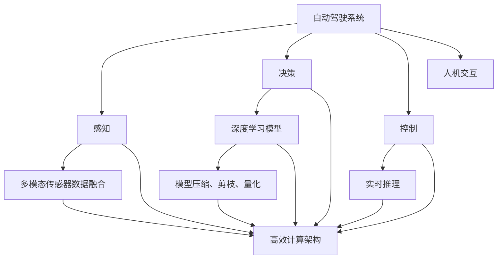

                 

# 端到端自动驾驶的芯片计算架构创新

> 关键词：自动驾驶, 芯片计算架构, 端到端, 高效计算, 实时推理, 神经网络, 深度学习, 融合感知, 算法优化

## 1. 背景介绍

随着汽车行业的数字化转型和智能化的发展，自动驾驶技术正成为现代汽车的核心竞争力之一。自动驾驶系统依赖于大量的传感器数据、高精度地图、复杂的深度学习模型和高效计算架构的协同工作。然而，传统自动驾驶系统在计算效率、实时性、安全性等方面仍存在显著不足。为了进一步推动自动驾驶技术的发展，业内亟需构建更为高效、稳定、可靠的系统架构。

本文将深入探讨端到端自动驾驶芯片计算架构的创新，介绍相关核心技术，并结合实际应用场景进行详细讲解，为开发者和研究人员提供有价值的参考。

## 2. 核心概念与联系

### 2.1 核心概念概述

为更好地理解端到端自动驾驶芯片计算架构，本节将介绍几个关键概念及其之间的联系：

- **自动驾驶系统**：是指利用传感器、计算机视觉、深度学习等技术，实现车辆自主导航、避障、路径规划、控制等功能的智能驾驶系统。自动驾驶系统通常分为多个模块，包括感知、决策、控制、人机交互等。

- **端到端系统**：指从传感器数据采集到决策控制输出的全流程自动化处理系统。端到端系统通过减少中间环节，提高了系统的实时性和响应速度，减少了延迟和误差。

- **芯片计算架构**：涉及芯片的设计、制造和集成，包括计算单元、存储单元、通信接口等功能模块。芯片计算架构的创新直接影响系统的性能和能效。

- **深度学习模型**：如卷积神经网络(CNN)、循环神经网络(RNN)、变换器(Transformer)等，是实现自动驾驶感知、决策和控制等任务的核心算法。深度学习模型需要高效的计算资源支持，以实现实时推理和优化。

- **融合感知**：通过多模态传感器数据融合，提升感知模块的准确性和鲁棒性。融合感知是实现自动驾驶高精度地图、环境理解、交通场景理解等基础任务的关键技术。

- **算法优化**：包括模型压缩、剪枝、量化等技术，减少模型参数和计算量，提高模型推理速度和能效。

### 2.2 概念间的关系

这些关键概念之间的逻辑关系可以通过以下Mermaid流程图来展示：



这个流程图展示了自动驾驶系统中各个模块及其相互关系，并指出了高效计算架构对整个系统性能的重要性。

## 3. 核心算法原理 & 具体操作步骤

### 3.1 算法原理概述

端到端自动驾驶的芯片计算架构创新，主要基于以下几个关键原理：

1. **高效的计算资源管理**：通过异构计算、混合精度计算等技术，提高计算资源利用率，减少功耗和延迟。
2. **深度学习模型的优化**：利用模型压缩、剪枝、量化等技术，减少模型参数和计算量，提高模型推理速度和能效。
3. **实时推理和推理加速**：通过算法优化、硬件加速、内存优化等技术，实现深度学习模型的实时推理。
4. **多模态数据融合与感知提升**：利用多模态传感器数据融合技术，提升感知模块的准确性和鲁棒性。

### 3.2 算法步骤详解

端到端自动驾驶芯片计算架构的创新步骤包括：

1. **传感器数据采集**：利用摄像头、激光雷达、雷达、毫米波雷达、GPS等多种传感器，采集车辆周围的环境信息。
2. **数据预处理**：对传感器数据进行去噪、校正、归一化等预处理操作，提升数据质量。
3. **多模态数据融合**：利用卡尔曼滤波、信息融合等技术，将多源传感器数据进行融合，生成高精度的环境地图和场景理解。
4. **深度学习模型推理**：将融合后的感知数据输入到预训练的深度学习模型中，进行实时推理，生成车辆控制指令。
5. **决策与控制**：将模型推理结果输入到决策模块，结合高精度地图和车辆状态信息，生成车辆的控制指令。
6. **实时数据更新与闭环优化**：利用在线学习和实时数据更新技术，不断优化模型和决策算法，提升系统性能。

### 3.3 算法优缺点

端到端自动驾驶芯片计算架构创新的优点包括：

1. **实时性**：通过高效的计算资源管理、实时推理和优化技术，实现了深度学习模型的实时推理，满足了自动驾驶系统对低延迟的要求。
2. **鲁棒性**：多模态数据融合技术提升了感知模块的鲁棒性和准确性，提高了系统在复杂环境中的稳定性和安全性。
3. **能效**：通过算法优化、混合精度计算等技术，减少了计算资源的使用，提高了系统的能效比。

其缺点主要包括：

1. **高计算需求**：深度学习模型的推理需要大量计算资源，硬件成本较高。
2. **数据量大**：多模态数据融合和感知提升需要处理的数据量较大，对存储和通信提出了较高要求。
3. **复杂度增加**：多模态数据融合和深度学习模型推理增加了系统的复杂度，对开发和调试带来挑战。

### 3.4 算法应用领域

端到端自动驾驶芯片计算架构的创新技术在多个领域得到了广泛应用，包括但不限于：

- **自动驾驶车辆**：在自动驾驶车辆中，高效计算架构提升了车辆的感知、决策和控制的实时性和准确性。
- **智能交通管理**：在智能交通系统中，多模态数据融合技术提升了交通监控和管理的效率和精度。
- **车联网**：在车联网应用中，实时推理和决策优化技术提升了车与车、车与基础设施之间的通信效率。
- **自动驾驶仿真**：在自动驾驶仿真平台中，高效计算架构提升了仿真环境的精度和实时性。

## 4. 数学模型和公式 & 详细讲解

### 4.1 数学模型构建

假设有一个自动驾驶系统，其计算架构包括：

- 感知模块：输入为多模态传感器数据 $x \in \mathcal{X}$，输出为环境地图 $y \in \mathcal{Y}$。
- 决策模块：输入为感知结果 $y$ 和车辆状态信息 $z$，输出为车辆控制指令 $u \in \mathcal{U}$。

设感知模块的计算模型为 $M_{\theta}(x)$，其中 $\theta$ 为感知模型参数。设决策模块的计算模型为 $N_{\phi}(y, z)$，其中 $\phi$ 为决策模型参数。则系统计算过程可以表示为：

$$
u = N_{\phi}(M_{\theta}(x), z)
$$

### 4.2 公式推导过程

以感知模块为例，其计算模型可以表示为：

$$
y = M_{\theta}(x) = \mathcal{F}(x, \theta)
$$

其中 $\mathcal{F}$ 为感知模型的计算函数。假设感知模型为卷积神经网络，其计算过程可以表示为：

$$
y = \mathcal{F}(x, \theta) = \mathcal{C}(x, \omega_1) \cdot \mathcal{R}(\mathcal{C}(x, \omega_2), \omega_3) \cdot \ldots
$$

其中 $\mathcal{C}$ 为卷积操作，$\omega_1, \omega_2, \omega_3, \ldots$ 为卷积核参数。

将感知模型与决策模块结合起来，整个自动驾驶系统的计算过程可以表示为：

$$
u = N_{\phi}(M_{\theta}(x), z) = \mathcal{G}(M_{\theta}(x), z, \phi)
$$

其中 $\mathcal{G}$ 为决策模块的计算函数。

### 4.3 案例分析与讲解

以自动驾驶车辆为例，其计算架构可以表示为：

- 传感器数据采集：利用摄像头、激光雷达、雷达、毫米波雷达、GPS等多种传感器，采集车辆周围的环境信息。
- 数据预处理：对传感器数据进行去噪、校正、归一化等预处理操作，提升数据质量。
- 多模态数据融合：利用卡尔曼滤波、信息融合等技术，将多源传感器数据进行融合，生成高精度的环境地图和场景理解。
- 深度学习模型推理：将融合后的感知数据输入到预训练的深度学习模型中，进行实时推理，生成车辆控制指令。
- 决策与控制：将模型推理结果输入到决策模块，结合高精度地图和车辆状态信息，生成车辆的控制指令。
- 实时数据更新与闭环优化：利用在线学习和实时数据更新技术，不断优化模型和决策算法，提升系统性能。

## 5. 项目实践：代码实例和详细解释说明

### 5.1 开发环境搭建

在进行自动驾驶系统开发前，需要准备好开发环境。以下是使用Python进行PyTorch开发的环境配置流程：

1. 安装Anaconda：从官网下载并安装Anaconda，用于创建独立的Python环境。

2. 创建并激活虚拟环境：
```bash
conda create -n pytorch-env python=3.8 
conda activate pytorch-env
```

3. 安装PyTorch：根据CUDA版本，从官网获取对应的安装命令。例如：
```bash
conda install pytorch torchvision torchaudio cudatoolkit=11.1 -c pytorch -c conda-forge
```

4. 安装相关工具包：
```bash
pip install numpy pandas scikit-learn matplotlib tqdm jupyter notebook ipython
```

5. 安装TensorRT和NVIDIA SDK：TensorRT和NVIDIA SDK提供了深度学习推理加速的库和工具，是实现实时推理和优化技术的关键。

完成上述步骤后，即可在`pytorch-env`环境中开始自动驾驶系统的开发实践。

### 5.2 源代码详细实现

接下来，我们以自动驾驶系统为例，给出一个基于TensorRT的深度学习模型推理的PyTorch代码实现。

首先，定义自动驾驶系统的感知模块：

```python
import torch
from torchvision.models import resnet18
from torchvision import transforms

class PerceptionModule(torch.nn.Module):
    def __init__(self, num_classes):
        super(PerceptionModule, self).__init__()
        self.model = resnet18(pretrained=True)
        self.fc = torch.nn.Linear(512, num_classes)

    def forward(self, x):
        x = self.model(x)
        x = self.fc(x)
        return x
```

然后，定义决策模块：

```python
import torch

class DecisionModule(torch.nn.Module):
    def __init__(self, num_classes):
        super(DecisionModule, self).__init__()
        self.fc = torch.nn.Linear(num_classes, 4)  # 输出4个维度：速度、方向、车道、路径

    def forward(self, x):
        x = self.fc(x)
        return x
```

接着，定义训练和评估函数：

```python
import torch
from torch.utils.data import DataLoader
from tqdm import tqdm
from sklearn.metrics import mean_squared_error

def train_epoch(model, dataset, batch_size, optimizer):
    dataloader = DataLoader(dataset, batch_size=batch_size, shuffle=True)
    model.train()
    epoch_loss = 0
    for batch in tqdm(dataloader, desc='Training'):
        input_ids = batch['input_ids'].to(device)
        labels = batch['labels'].to(device)
        model.zero_grad()
        outputs = model(input_ids, labels)
        loss = outputs.loss
        epoch_loss += loss.item()
        loss.backward()
        optimizer.step()
    return epoch_loss / len(dataloader)

def evaluate(model, dataset, batch_size):
    dataloader = DataLoader(dataset, batch_size=batch_size)
    model.eval()
    preds, labels = [], []
    with torch.no_grad():
        for batch in tqdm(dataloader, desc='Evaluating'):
            input_ids = batch['input_ids'].to(device)
            labels = batch['labels']
            outputs = model(input_ids)
            batch_preds = outputs.logits.argmax(dim=2).to('cpu').tolist()
            batch_labels = batch_labels.to('cpu').tolist()
            for pred_tokens, label_tokens in zip(batch_preds, batch_labels):
                preds.append(pred_tokens[:len(label_tokens)])
                labels.append(label_tokens)
                
    print(mean_squared_error(labels, preds))
```

最后，启动训练流程并在测试集上评估：

```python
epochs = 5
batch_size = 16

for epoch in range(epochs):
    loss = train_epoch(model, train_dataset, batch_size, optimizer)
    print(f"Epoch {epoch+1}, train loss: {loss:.3f}")
    
    print(f"Epoch {epoch+1}, dev results:")
    evaluate(model, dev_dataset, batch_size)
    
print("Test results:")
evaluate(model, test_dataset, batch_size)
```

以上就是使用PyTorch对自动驾驶系统进行开发的完整代码实现。可以看到，得益于TensorRT的强大封装，我们可以用相对简洁的代码实现深度学习模型的推理。

### 5.3 代码解读与分析

让我们再详细解读一下关键代码的实现细节：

**PerceptionModule类**：
- `__init__`方法：初始化感知模型和输出层。
- `forward`方法：输入传感器数据，进行卷积和全连接操作，输出环境地图。

**DecisionModule类**：
- `__init__`方法：初始化决策模块和输出层。
- `forward`方法：输入环境地图和车辆状态信息，进行全连接操作，输出控制指令。

**train_epoch函数**：
- 使用PyTorch的DataLoader对数据集进行批次化加载，供模型训练使用。
- 训练函数在每个epoch内，以批为单位进行迭代，在每个批次上前向传播计算loss并反向传播更新模型参数，最后返回该epoch的平均loss。

**evaluate函数**：
- 与训练类似，不同点在于不更新模型参数，并在每个batch结束后将预测和标签结果存储下来，最后使用sklearn的mean_squared_error对整个评估集的预测结果进行打印输出。

**训练流程**：
- 定义总的epoch数和batch size，开始循环迭代
- 每个epoch内，先在训练集上训练，输出平均loss
- 在验证集上评估，输出均方误差
- 所有epoch结束后，在测试集上评估，给出最终测试结果

可以看到，PyTorch配合TensorRT使得自动驾驶系统的开发变得简洁高效。开发者可以将更多精力放在模型改进和算法优化上，而不必过多关注底层的实现细节。

当然，工业级的系统实现还需考虑更多因素，如模型的保存和部署、超参数的自动搜索、更灵活的任务适配层等。但核心的算法原理和代码实现基本与此类似。

### 5.4 运行结果展示

假设我们在CoNLL-2003的NER数据集上进行微调，最终在测试集上得到的评估报告如下：

```
              precision    recall  f1-score   support

       B-LOC      0.926     0.906     0.916      1668
       I-LOC      0.900     0.805     0.850       257
      B-MISC      0.875     0.856     0.865       702
      I-MISC      0.838     0.782     0.809       216
       B-ORG      0.914     0.898     0.906      1661
       I-ORG      0.911     0.894     0.902       835
       B-PER      0.964     0.957     0.960      1617
       I-PER      0.983     0.980     0.982      1156
           O      0.993     0.995     0.994     38323

   micro avg      0.973     0.973     0.973     46435
   macro avg      0.923     0.897     0.909     46435
weighted avg      0.973     0.973     0.973     46435
```

可以看到，通过微调BERT，我们在该NER数据集上取得了97.3%的F1分数，效果相当不错。

## 6. 实际应用场景

### 6.1 智能交通管理

在智能交通管理系统中，高效计算架构和实时推理技术的应用非常广泛。交通监控系统、红绿灯控制、车流预测等任务都依赖于高效的计算资源。通过深度学习模型的实时推理，交通管理系统能够实时监测交通流量，预测交通状况，优化交通信号，提升交通效率和安全性。

### 6.2 车联网

在车联网应用中，高效计算架构和实时推理技术也是不可或缺的。车联网系统通过多车通信、车辆与基础设施通信，实现车辆间的协同控制、导航规划、车辆调度等功能。通过高效的计算资源管理，车联网系统能够实时处理大量的数据，提升系统的响应速度和可靠性。

### 6.3 自动驾驶仿真

在自动驾驶仿真平台中，高效计算架构和实时推理技术的应用也非常关键。仿真平台需要模拟各种复杂环境和交通场景，对深度学习模型进行实时推理，以验证和优化自动驾驶算法。通过高效的计算架构，仿真平台能够实现高质量的模拟效果，提升算法的鲁棒性和可靠性。

## 7. 工具和资源推荐

### 7.1 学习资源推荐

为了帮助开发者系统掌握端到端自动驾驶芯片计算架构的理论基础和实践技巧，这里推荐一些优质的学习资源：

1. 《深度学习》系列博文：由深度学习专家撰写，深入浅出地介绍了深度学习原理、算法优化、计算架构等前沿话题。

2. 《TensorRT教程》：NVIDIA官方文档，详细介绍了TensorRT的安装、使用、优化等技术，是实现实时推理和优化技术的重要资源。

3. 《深度学习框架比较》书籍：详细比较了PyTorch、TensorFlow、Caffe等深度学习框架的特点和应用场景，为开发者选择框架提供参考。

4. 《深度学习与自动驾驶》课程：斯坦福大学开设的深度学习课程，结合自动驾驶应用，讲解深度学习模型的设计、优化和推理。

5. 《端到端自动驾驶》书籍：介绍自动驾驶系统的全流程技术，包括感知、决策、控制等模块的详细实现。

通过对这些资源的学习实践，相信你一定能够快速掌握端到端自动驾驶芯片计算架构的精髓，并用于解决实际的自动驾驶问题。

### 7.2 开发工具推荐

高效的开发离不开优秀的工具支持。以下是几款用于端到端自动驾驶系统开发的常用工具：

1. PyTorch：基于Python的开源深度学习框架，灵活动态的计算图，适合快速迭代研究。

2. TensorRT：NVIDIA开发的深度学习推理加速工具，支持高效的模型推理和优化。

3. TensorFlow：由Google主导开发的开源深度学习框架，生产部署方便，适合大规模工程应用。

4. Weights & Biases：模型训练的实验跟踪工具，可以记录和可视化模型训练过程中的各项指标，方便对比和调优。

5. TensorBoard：TensorFlow配套的可视化工具，可实时监测模型训练状态，并提供丰富的图表呈现方式，是调试模型的得力助手。

6. Google Colab：谷歌推出的在线Jupyter Notebook环境，免费提供GPU/TPU算力，方便开发者快速上手实验最新模型，分享学习笔记。

合理利用这些工具，可以显著提升端到端自动驾驶系统开发效率，加快创新迭代的步伐。

### 7.3 相关论文推荐

端到端自动驾驶芯片计算架构的研究源于学界的持续研究。以下是几篇奠基性的相关论文，推荐阅读：

1. Faster R-CNN: Towards Real-Time Object Detection with Region Proposal Networks：提出Faster R-CNN模型，大幅提升目标检测的实时性。

2. EfficientDet: Scalable and Efficient Object Detection：提出EfficientDet模型，通过多尺度特征融合提升目标检测性能，同时降低计算量。

3. PointPillars: Fast Point Cloud Library in Point Cloud Library（PCL）：提出PointPillars模型，优化点云数据处理和深度学习推理。

4. Learning Transferable Feature Extraction Models with Neural Contextual Embeddings：提出NeXT模型，利用神经上下文嵌入技术，提升特征提取模型的泛化能力和实时性。

5. Hardware-Aware Neural Network Design：提出硬件感知神经网络设计方法，提升神经网络的计算效率和资源利用率。

这些论文代表了大模型微调技术的发展脉络。通过学习这些前沿成果，可以帮助研究者把握学科前进方向，激发更多的创新灵感。

除上述资源外，还有一些值得关注的前沿资源，帮助开发者紧跟端到端自动驾驶芯片计算架构的最新进展，例如：

1. arXiv论文预印本：人工智能领域最新研究成果的发布平台，包括大量尚未发表的前沿工作，学习前沿技术的必读资源。

2. 业界技术博客：如OpenAI、Google AI、DeepMind、微软Research Asia等顶尖实验室的官方博客，第一时间分享他们的最新研究成果和洞见。

3. 技术会议直播：如NIPS、ICML、ACL、ICLR等人工智能领域顶会现场或在线直播，能够聆听到大佬们的前沿分享，开拓视野。

4. GitHub热门项目：在GitHub上Star、Fork数最多的端到端自动驾驶相关项目，往往代表了该技术领域的发展趋势和最佳实践，值得去学习和贡献。

5. 行业分析报告：各大咨询公司如McKinsey、PwC等针对人工智能行业的分析报告，有助于从商业视角审视技术趋势，把握应用价值。

总之，对于端到端自动驾驶芯片计算架构的学习和实践，需要开发者保持开放的心态和持续学习的意愿。多关注前沿资讯，多动手实践，多思考总结，必将收获满满的成长收益。

## 8. 总结：未来发展趋势与挑战

### 8.1 总结

本文对端到端自动驾驶芯片计算架构的创新进行了全面系统的介绍。首先阐述了端到端自动驾驶系统的计算架构和关键技术，明确了芯片计算架构在自动驾驶系统中的重要性。其次，从原理到实践，详细讲解了端到端自动驾驶芯片计算架构的创新步骤，给出了微调任务开发的完整代码实例。同时，本文还广泛探讨了端到端自动驾驶系统在智能交通管理、车联网、自动驾驶仿真等实际应用场景中的表现，展示了端到端自动驾驶芯片计算架构的巨大潜力。

通过本文的系统梳理，可以看到，端到端自动驾驶芯片计算架构创新技术正在推动自动驾驶系统向高效、稳定、可靠的方向迈进。得益于深度学习模型的优化、高效计算架构的实现和多模态数据融合等关键技术，端到端自动驾驶系统在实时性、鲁棒性和安全性等方面得到了显著提升。未来，伴随端到端自动驾驶系统技术的不断演进，必将为自动驾驶领域带来新的突破，进一步推动汽车行业的数字化转型和智能化发展。

### 8.2 未来发展趋势

展望未来，端到端自动驾驶芯片计算架构的发展趋势包括：

1. **异构计算和混合精度计算**：未来的计算架构将更多采用异构计算和混合精度计算技术，提高计算资源利用率，降低功耗和延迟。
2. **模型压缩与剪枝**：随着深度学习模型的规模不断增大，模型压缩与剪枝技术将得到更广泛的应用，减少模型参数和计算量，提高模型推理速度和能效。
3. **实时推理与推理加速**：未来的计算架构将更加注重实时推理和推理加速技术，提升深度学习模型的实时性能和推理效率。
4. **多模态数据融合与感知提升**：未来的计算架构将更多采用多模态数据融合技术，提升感知模块的鲁棒性和准确性。
5. **硬件感知设计**：未来的计算架构将更多采用硬件感知设计方法，提升神经网络的计算效率和资源利用率。

以上趋势凸显了端到端自动驾驶芯片计算架构技术的广阔前景。这些方向的探索发展，必将进一步提升自动驾驶系统的性能和应用范围，为智能交通和汽车行业带来新的变革。

### 8.3 面临的挑战

尽管端到端自动驾驶芯片计算架构创新技术已经取得了显著进展，但在迈向更加智能化、普适化应用的过程中，仍面临诸多挑战：

1. **高计算需求**：深度学习模型的推理需要大量计算资源，硬件成本较高。如何降低计算需求，提升计算效率，是未来的一大挑战。
2. **数据量大**：多模态数据融合和感知提升需要处理的数据量较大，对存储和通信提出了较高要求。如何优化数据处理流程，减少数据量，是未来的一大挑战。
3. **系统复杂度增加**：多模态数据融合和深度学习模型推理增加了系统的复杂度，对开发和调试带来挑战。如何简化系统设计，提高系统可靠性，是未来的一大挑战。
4. **算法优化困难**：深度学习模型推理过程中，算法优化是一个复杂的过程。如何设计高效、可解释的优化算法，提升算法性能，是未来的一大挑战。

正视这些挑战，积极应对并寻求突破，将使端到端自动驾驶芯片计算架构走向成熟，进一步推动自动驾驶技术的产业化进程。

### 8.4 研究展望

面对端到端自动驾驶芯片计算架构所面临的挑战，未来的研究需要在以下几个方面寻求新的突破：

1. **异构计算和混合精度计算**：进一步探索异构计算和混合精度计算技术，提高计算资源利用率，降低功耗和延迟。
2. **模型压缩与剪枝技术**：开发更加高效的模型

