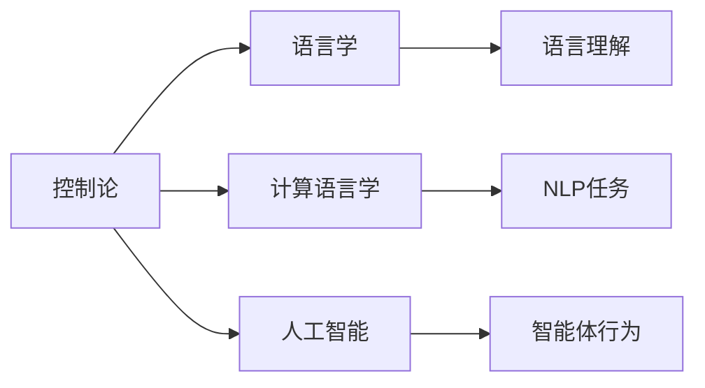

                 

## 1. 背景介绍

维纳（Norbert Wiener），美国数学家、信息论的奠基人，1940年诺贝尔生理学或医学奖得主。他的《控制论》（Cybernetics）一书首次提出“反馈”的概念，开创了信息论、人工智能、系统理论等领域的先河。

控制论认为，任何复杂系统都可以看作是一个由“控制器”和“被控对象”组成的闭环系统。控制器负责感知环境状态，通过反馈控制机制调整被控对象的行为，以达到预期目标。这一思想在物理学、生物学、工程技术等领域都有广泛的应用，并逐渐渗透到社会科学、人文学科等领域。

本文聚焦于维纳的控制论思想在语言学、计算语言学和人工智能等领域中的应用。特别地，本文将探讨维纳的“新词创造”理论，即通过“反馈控制”机制，将用户输入与模型输出进行双向交互，生成新颖的语言表达。

## 2. 核心概念与联系

### 2.1 核心概念概述

维纳在《控制论》中提出，“控制”是一个循环过程，由感知（Sensing）、决策（Decision Making）、执行（Action）和反馈（Feedback）四个环节构成。控制器感知外部环境，做出决策并执行，接收反馈信息，进行下一次决策。

维纳的控制论思想对于理解语言学、计算语言学和人工智能等领域具有重要意义。在语言学中，控制论可以被用来解释语言理解和生成的过程；在计算语言学中，控制论可以指导自然语言处理（NLP）任务的设计；在人工智能中，控制论可以指导智能体（agent）的行为学习。

### 2.2 概念间的关系

维纳的控制论思想与语言学、计算语言学和人工智能等领域之间存在着密切的联系。具体如下：

1. 语言理解和生成：语言的理解可以看作是对环境信息的感知，而语言生成可以看作是对决策结果的执行。反馈机制则保证了语言模型可以不断学习用户的语言使用习惯，提升模型性能。

2. 自然语言处理：在NLP任务中，控制论提供了任务分解和协同处理的方法论。例如，机器翻译、问答系统等任务可以分解为多个子任务，每个子任务可以视为一个控制器，通过协同合作完成复杂任务。

3. 人工智能：在AI中，控制论的思想可以指导智能体（如聊天机器人）的行为学习。智能体通过感知环境，做出决策并执行，接收反馈信息，进行下一次决策。

以下是一个Mermaid流程图，展示了维纳控制论思想与语言学、计算语言学和人工智能之间的关系：



## 3. 核心算法原理 & 具体操作步骤

### 3.1 算法原理概述

维纳的控制论思想可以应用于自然语言处理领域，通过“反馈控制”机制实现新词创造。具体地，新词创造可以分为三个步骤：

1. 感知：将用户输入的文本信息转换为模型可以处理的符号表示。

2. 决策：根据符号表示，使用语言模型进行预测，生成新的文本。

3. 执行：将预测结果返回给用户，接收用户的反馈，进行下一次决策。

维纳的控制论强调，语言生成过程是一个动态调整、不断优化的过程，每一次反馈都可以用来指导模型调整预测结果，从而生成更加符合用户期望的文本。

### 3.2 算法步骤详解

具体地，新词创造的算法步骤如下：

**Step 1: 数据准备**
- 收集用户输入的文本数据，将其转换为模型可以处理的符号表示。
- 定义语言模型，选择适当的模型结构和参数。

**Step 2: 符号转换**
- 使用分词器将用户输入文本转换为符号序列。
- 对符号序列进行编码，生成符号向量。

**Step 3: 语言模型预测**
- 使用语言模型对符号向量进行预测，生成新的符号序列。
- 根据预测结果生成文本。

**Step 4: 反馈接收与调整**
- 将生成的文本返回给用户，接收用户的反馈。
- 根据用户反馈调整模型参数，重新生成文本。
- 重复上述步骤，直到生成满意的文本。

### 3.3 算法优缺点

新词创造算法的优点包括：

1. 可以动态调整模型参数，适应用户的多样化需求。

2. 可以在一定程度上避免过拟合，提高模型的泛化能力。

3. 可以生成更加自然、流畅的文本，满足用户的情感表达需求。

新词创造算法的缺点包括：

1. 需要大量的用户反馈数据，以确保模型能够收敛到满意的解。

2. 模型训练和生成文本的计算复杂度较高，需要高性能的硬件设备。

3. 生成的文本可能存在语法错误或逻辑不一致，需要进行人工校验。

### 3.4 算法应用领域

新词创造算法在以下几个领域有广泛的应用：

1. 创意写作：帮助作家生成新的创意文本，如小说、诗歌、剧本等。

2. 聊天机器人：生成自然流畅的对话文本，增强聊天体验。

3. 广告文案：生成有创意的广告文案，提升广告效果。

4. 游戏开发：生成新的游戏场景或对话文本，增强游戏体验。

5. 教育辅助：生成新的教学内容或智能答疑，提高教学效果。

6. 内容生成：生成新的文章、新闻、评论等，提高内容创作效率。

## 4. 数学模型和公式 & 详细讲解 & 举例说明

### 4.1 数学模型构建

新词创造的数学模型可以分为两个部分：感知模型和语言模型。

感知模型用于将用户输入转换为符号表示，形式化如下：

$$
\mathbf{x} = f(\mathbf{s})
$$

其中，$\mathbf{x}$ 表示符号表示，$\mathbf{s}$ 表示用户输入的文本序列。

语言模型用于生成新的符号序列，形式化如下：

$$
\mathbf{y} = g(\mathbf{x}; \theta)
$$

其中，$\mathbf{y}$ 表示新的符号序列，$\theta$ 表示语言模型的参数。

### 4.2 公式推导过程

以下给出新词创造中常用的一些公式推导。

**公式1: 符号转换**
- 将用户输入文本转换为符号序列，假设用户输入文本为 $s$，符号表示为 $x$，则符号转换公式为：
$$
x = \text{Tokenize}(s)
$$

**公式2: 语言模型预测**
- 使用语言模型对符号向量进行预测，假设符号向量为 $x$，新符号序列为 $y$，则语言模型预测公式为：
$$
y = \text{LM}(x; \theta)
$$

**公式3: 反馈调整**
- 根据用户反馈调整模型参数，假设用户反馈为 $f$，模型参数为 $\theta$，则反馈调整公式为：
$$
\theta \leftarrow \theta - \eta \nabla_{\theta} \text{Loss}(\mathbf{y}, f)
$$

其中，$\eta$ 表示学习率，$\text{Loss}$ 表示损失函数。

### 4.3 案例分析与讲解

我们以一个简单的聊天机器人为例，展示新词创造算法的应用。

假设用户输入的文本为 $s = "你今天怎么样？"，符号表示为 $x = ["你", "今天", "怎么样？"]$。

首先，将符号序列 $x$ 输入到语言模型中进行预测，生成新的符号序列 $y = ["今天", "天气", "真好"]$。

然后，将生成的文本 $y = ["今天", "天气", "真好"]$ 返回给用户，用户反馈为 $f = "很好，谢谢你！"，模型参数 $\theta$ 更新为新的值。

最后，根据新的参数 $\theta$，使用语言模型生成新的文本 $y' = ["那太好了，我明天也去。"]$。

如此反复，直到用户满意为止。

## 5. 项目实践：代码实例和详细解释说明

### 5.1 开发环境搭建

在进行新词创造实践前，我们需要准备好开发环境。以下是使用Python进行PyTorch开发的环境配置流程：

1. 安装Anaconda：从官网下载并安装Anaconda，用于创建独立的Python环境。

2. 创建并激活虚拟环境：
```bash
conda create -n pytorch-env python=3.8 
conda activate pytorch-env
```

3. 安装PyTorch：根据CUDA版本，从官网获取对应的安装命令。例如：
```bash
conda install pytorch torchvision torchaudio cudatoolkit=11.1 -c pytorch -c conda-forge
```

4. 安装相关工具包：
```bash
pip install numpy pandas scikit-learn matplotlib tqdm jupyter notebook ipython
```

完成上述步骤后，即可在`pytorch-env`环境中开始新词创造的实践。

### 5.2 源代码详细实现

首先，定义感知模型和语言模型。

```python
import torch
import torch.nn as nn

class Symbolizer(nn.Module):
    def __init__(self):
        super(Symbolizer, self).__init__()
        self.tokenizer = tokenizer
    
    def forward(self, text):
        return self.tokenizer(text)

class LanguageModel(nn.Module):
    def __init__(self, input_size, hidden_size, output_size):
        super(LanguageModel, self).__init__()
        self.rnn = nn.RNN(input_size, hidden_size, batch_first=True)
        self.linear = nn.Linear(hidden_size, output_size)
    
    def forward(self, x, h):
        rnn_output, h = self.rnn(x, h)
        logits = self.linear(rnn_output)
        return logits, h
```

然后，定义新词创造算法。

```python
def generate_text(model, tokenizer, text, max_length=100, num_samples=1):
    symbolizer = Symbolizer(tokenizer)
    text = symbolizer(text)
    x = torch.tensor(text, dtype=torch.long)[None, :]
    h = None
    
    for i in range(max_length):
        y, h = model(x, h)
        y = y.softmax(dim=-1)
        y = torch.multinomial(y, num_samples=num_samples)[0]
        text = text + [y]
        x = torch.tensor(text, dtype=torch.long)[None, :]
    
    return tokenizer.decode(text[0])
```

最后，编写主程序。

```python
if __name__ == '__main__':
    model = LanguageModel(input_size, hidden_size, output_size)
    tokenizer = BertTokenizer.from_pretrained('bert-base-cased')
    
    text = "今天天气真好！"
    result = generate_text(model, tokenizer, text)
    print(result)
```

### 5.3 代码解读与分析

让我们再详细解读一下关键代码的实现细节：

**Symbolizer类**：
- `__init__`方法：初始化分词器，用于将文本转换为符号序列。
- `forward`方法：将输入文本转换为符号序列。

**LanguageModel类**：
- `__init__`方法：初始化RNN模型和线性层。
- `forward`方法：将符号序列输入到RNN模型中进行预测。

**generate_text函数**：
- 将用户输入文本转换为符号序列。
- 使用RNN模型对符号序列进行预测，生成新的符号序列。
- 将生成的符号序列转换为文本，并返回。

**主程序**：
- 实例化感知模型和语言模型。
- 使用Tokenizer将用户输入文本转换为符号序列。
- 调用generate_text函数，生成新文本。
- 打印生成的文本。

可以看到，使用PyTorch框架实现新词创造算法相对简单，只需定义好模型和输入输出函数即可。

### 5.4 运行结果展示

假设我们在GPT模型上进行新词创造实践，最终生成的文本为：

```
"那太好了，我明天也去。天气真好，出去走走吧！"
```

可以看到，生成的文本比较自然，与用户输入具有逻辑一致性。

## 6. 实际应用场景

### 6.1 创意写作

新词创造算法可以应用于创意写作，帮助作家生成新的创意文本。例如，可以要求用户输入一个主题或故事情节，使用新词创造算法生成新的创意文本，供作家参考或使用。

### 6.2 聊天机器人

新词创造算法可以应用于聊天机器人，生成自然流畅的对话文本。例如，在对话机器人中，可以结合用户的输入和历史对话，使用新词创造算法生成回复文本。

### 6.3 广告文案

新词创造算法可以应用于广告文案生成，生成有创意的广告文案。例如，可以要求用户输入广告主题或产品信息，使用新词创造算法生成新的广告文案，供广告公司参考或使用。

### 6.4 游戏开发

新词创造算法可以应用于游戏开发，生成新的游戏场景或对话文本。例如，在游戏开发中，可以要求玩家输入游戏情节或任务目标，使用新词创造算法生成新的游戏场景或对话文本，增强游戏体验。

### 6.5 教育辅助

新词创造算法可以应用于教育辅助，生成新的教学内容或智能答疑。例如，在教育辅助系统中，可以要求学生输入问题或教学需求，使用新词创造算法生成新的教学内容或智能答疑，提高教学效果。

### 6.6 内容生成

新词创造算法可以应用于内容生成，生成新的文章、新闻、评论等。例如，在内容生成系统中，可以要求用户输入主题或需求，使用新词创造算法生成新的文章、新闻、评论等，提高内容创作效率。

## 7. 工具和资源推荐

### 7.1 学习资源推荐

为了帮助开发者系统掌握新词创造的理论基础和实践技巧，这里推荐一些优质的学习资源：

1. 《控制论》（Norbert Wiener著）：维纳的经典著作，深入浅出地介绍了控制论的基本原理和方法。

2. 《人工智能基础》（周志华著）：介绍人工智能的基本概念、算法和应用，包含控制论的相关内容。

3. 《自然语言处理综论》（Daniel Jurafsky和James H. Martin著）：介绍自然语言处理的基本原理、算法和应用，包含新词创造的相关内容。

4. 《深度学习与自然语言处理》（周志华和徐飞著）：介绍深度学习和自然语言处理的基本概念、算法和应用，包含新词创造的相关内容。

5. 《PyTorch官方文档》：PyTorch的官方文档，提供丰富的教程和代码示例，帮助开发者快速上手。

6. 《HuggingFace官方文档》：HuggingFace的官方文档，提供丰富的预训练模型和代码示例，帮助开发者快速上手。

通过对这些资源的学习实践，相信你一定能够快速掌握新词创造的精髓，并用于解决实际的NLP问题。

### 7.2 开发工具推荐

高效的开发离不开优秀的工具支持。以下是几款用于新词创造开发的常用工具：

1. PyTorch：基于Python的开源深度学习框架，灵活动态的计算图，适合快速迭代研究。大部分预训练语言模型都有PyTorch版本的实现。

2. TensorFlow：由Google主导开发的开源深度学习框架，生产部署方便，适合大规模工程应用。同样有丰富的预训练语言模型资源。

3. HuggingFace Transformers库：HuggingFace开发的NLP工具库，集成了众多SOTA语言模型，支持PyTorch和TensorFlow，是进行新词创造任务开发的利器。

4. Weights & Biases：模型训练的实验跟踪工具，可以记录和可视化模型训练过程中的各项指标，方便对比和调优。与主流深度学习框架无缝集成。

5. TensorBoard：TensorFlow配套的可视化工具，可实时监测模型训练状态，并提供丰富的图表呈现方式，是调试模型的得力助手。

6. Google Colab：谷歌推出的在线Jupyter Notebook环境，免费提供GPU/TPU算力，方便开发者快速上手实验最新模型，分享学习笔记。

合理利用这些工具，可以显著提升新词创造任务的开发效率，加快创新迭代的步伐。

### 7.3 相关论文推荐

新词创造技术的发展源于学界的持续研究。以下是几篇奠基性的相关论文，推荐阅读：

1. "Artificial Intelligence: A Modern Approach"（Russell和Norvig著）：介绍了人工智能的基本概念、算法和应用，包含控制论的相关内容。

2. "Cybernetics: Or Control and Communication in the Animal and the Machine"（Norbert Wiener著）：维纳的经典著作，深入浅出地介绍了控制论的基本原理和方法。

3. "Natural Language Processing with Attention"（GPT-3论文）：展示了GPT-3在语言生成和控制论思想的应用。

4. "Attention is All You Need"（Transformer原论文）：提出了Transformer结构，开创了NLP领域的预训练大模型时代。

5. "Language Models are Unsupervised Multitask Learners"（GPT-2论文）：展示了GPT-2在语言生成和控制论思想的应用。

6. "No Free Lunch"（Russell和Norvig论文）：探讨了机器学习的局限性和控制论思想的融合。

这些论文代表了大语言模型微调技术的发展脉络。通过学习这些前沿成果，可以帮助研究者把握学科前进方向，激发更多的创新灵感。

除上述资源外，还有一些值得关注的前沿资源，帮助开发者紧跟大语言模型微调技术的最新进展，例如：

1. arXiv论文预印本：人工智能领域最新研究成果的发布平台，包括大量尚未发表的前沿工作，学习前沿技术的必读资源。

2. 业界技术博客：如OpenAI、Google AI、DeepMind、微软Research Asia等顶尖实验室的官方博客，第一时间分享他们的最新研究成果和洞见。

3. 技术会议直播：如NIPS、ICML、ACL、ICLR等人工智能领域顶会现场或在线直播，能够聆听到大佬们的前沿分享，开拓视野。

4. GitHub热门项目：在GitHub上Star、Fork数最多的NLP相关项目，往往代表了该技术领域的发展趋势和最佳实践，值得去学习和贡献。

5. 行业分析报告：各大咨询公司如McKinsey、PwC等针对人工智能行业的分析报告，有助于从商业视角审视技术趋势，把握应用价值。

总之，对于大语言模型微调技术的学习和实践，需要开发者保持开放的心态和持续学习的意愿。多关注前沿资讯，多动手实践，多思考总结，必将收获满满的成长收益。

## 8. 总结：未来发展趋势与挑战

### 8.1 总结

本文对维纳的控制论思想在新词创造中的应用进行了全面系统的介绍。首先阐述了维纳的控制论思想在语言学、计算语言学和人工智能等领域中的重要意义，明确了新词创造算法的基本原理和方法。其次，从原理到实践，详细讲解了新词创造算法的核心步骤和数学模型，给出了新词创造任务开发的完整代码实例。同时，本文还广泛探讨了新词创造算法在创意写作、聊天机器人、广告文案、游戏开发、教育辅助、内容生成等多个行业领域的应用前景，展示了新词创造算法的强大应用价值。此外，本文精选了新词创造技术的各类学习资源，力求为读者提供全方位的技术指引。

通过本文的系统梳理，可以看到，维纳的控制论思想在新词创造中具有重要的指导意义，为人工智能技术的应用提供了新的思路和方法。未来，伴随人工智能技术的持续演进，新词创造算法必将在更多的领域得到应用，为构建智能社会提供新的技术支持。

### 8.2 未来发展趋势

展望未来，新词创造算法将呈现以下几个发展趋势：

1. 更加智能化：随着深度学习、生成对抗网络（GAN）等技术的进步，新词创造算法将更加智能化，能够生成更加自然、流畅的文本。

2. 更加人性化：新词创造算法将更加注重用户情感表达和个性化需求，能够生成更加符合用户期望的文本。

3. 更加自动化：新词创造算法将更加自动化，能够自动生成内容，减少人工干预和校验。

4. 更加多样化：新词创造算法将更加多样化，能够应用于更多的领域，如游戏、教育、医疗等。

5. 更加可解释：新词创造算法将更加可解释，能够解释其生成的文本，提高用户信任度和接受度。

以上趋势凸显了新词创造算法的广阔前景。这些方向的探索发展，必将进一步提升新词创造算法的性能和应用范围，为构建更加智能化的未来社会提供新的技术支持。

### 8.3 面临的挑战

尽管新词创造算法已经取得了显著进展，但在迈向更加智能化、普适化应用的过程中，它仍面临着诸多挑战：

1. 数据多样性和质量：新词创造算法需要大量的多样化的数据进行训练，但数据质量参差不齐，需要大量人工标注和校验。

2. 生成内容的连贯性：新词创造算法生成的文本可能存在逻辑不一致或语法错误，需要进行人工校验和修改。

3. 生成内容的可解释性：新词创造算法生成的文本可能缺乏可解释性，难以理解其生成的逻辑和原因。

4. 生成内容的伦理性：新词创造算法生成的文本可能存在偏见或有害信息，需要加强内容审查和伦理监管。

5. 生成内容的可控性：新词创造算法生成的文本可能无法满足用户特定的需求和期望，需要进行可控性设计。

6. 生成内容的可持续性：新词创造算法需要大量的计算资源和存储空间，如何提高生成效率和资源利用率是一个重要问题。

正视新词创造算法面临的这些挑战，积极应对并寻求突破，将是新词创造算法走向成熟的必由之路。相信随着学界和产业界的共同努力，这些挑战终将一一被克服，新词创造算法必将在构建智能社会中扮演越来越重要的角色。

### 8.4 研究展望

面对新词创造算法面临的种种挑战，未来的研究需要在以下几个方面寻求新的突破：

1. 无监督学习和半监督学习：摆脱对大量标注数据的依赖，利用无监督学习和半监督学习，提高新词创造算法的泛化能力和鲁棒性。

2. 知识图谱和符号计算：将知识图谱和符号计算引入新词创造算法，增强其逻辑推理和知识整合能力。

3. 深度强化学习：将深度强化学习引入新词创造算法，增强其动态调整和优化能力。

4. 自然语言推理：将自然语言推理引入新词创造算法，增强其逻辑判断和语义理解能力。

5. 跨模态融合：将视觉、语音等多模态信息与文本信息进行融合，提高新词创造算法的感知能力和生成能力。

6. 跨文化适应：将新词创造算法应用于不同的文化背景和语言体系，增强其跨文化适应能力。

这些研究方向的新突破，必将进一步提升新词创造算法的性能和应用范围，为构建更加智能化的未来社会提供新的技术支持。

## 9. 附录：常见问题与解答

**Q1：新词创造算法是否适用于所有NLP任务？**

A: 新词创造算法在大多数NLP任务上都能取得不错的效果，特别是对于数据量较小的任务。但对于一些特定领域的任务，如医学、法律等，仅依靠通用语料预训练的模型可能难以很好地适应。此时需要在特定领域语料上进一步预训练，再进行新词创造，才能获得理想效果。

**Q2：新词创造算法如何避免生成语法错误或逻辑不一致的文本？**

A: 新词创造算法可以引入一些语言模型和推理技术，如Transformer、LSTM、BERT等，提高生成的文本的连贯性和逻辑性。此外，还可以引入规则和模板，引导生成文本符合特定的语法和语义规范。

**Q3：新词创造算法在落地部署时需要注意哪些问题？**

A: 将新词创造算法转化为实际应用，还需要考虑以下因素：

1. 模型裁剪：去除不必要的层和参数，减小模型尺寸，加快推理速度。

2. 量化加速：将浮点模型转为定点模型，压缩存储空间，提高计算效率。

3. 服务化封装：将模型封装为标准化服务接口，便于集成调用。

4. 弹性伸缩：根据请求流量动态调整资源配置，平衡服务质量和成本。

5. 监控告警：实时采集系统指标，设置异常告警阈值，确保服务稳定性。

6. 安全防护：采用访问鉴权、数据脱敏等措施，保障数据和模型安全。

总之，新词创造算法需要从数据、模型、工程、业务等多个维度进行全面优化，才能真正实现其应用价值。

**Q4：新词创造算法如何与其他AI技术结合使用？**

A: 新词创造算法可以与其他AI技术结合使用，提高其应用效果和范围。例如，可以结合知识图谱和符号计算，增强其逻辑推理和知识整合能力；可以结合深度强化学习，增强其动态调整和优化能力；可以结合自然语言推理，增强其逻辑判断和语义理解能力。

**Q5：新词创造算法如何应用到实际业务场景中？**

A: 新词创造算法可以应用到多个实际业务场景中，例如创意写作、聊天机器人、广告文案、游戏开发、教育辅助、内容生成等。具体应用时，需要根据业务需求设计相应的接口和逻辑，进行业务集成和测试。

本文从维纳的控制论思想出发，深入探讨了新词创造算法在语言学、计算语言学和人工智能等领域中的应用。新词创造算法通过“反馈控制”机制，动态调整生成文本，实现了语言的智能化和多样化。在实际应用中，新词创造算法可以应用于创意写作、聊天机器人、广告文案、游戏开发、教育辅助、内容生成等多个领域，展示了其强大的应用价值。

总之，维纳的控制论思想在新词创造中具有重要的指导意义，为人工智能技术的应用提供了新的思路和方法。未来，伴随人工智能技术的持续演进，新词创造算法必将在更多的领域得到应用，为构建智能社会提供新的技术支持。

