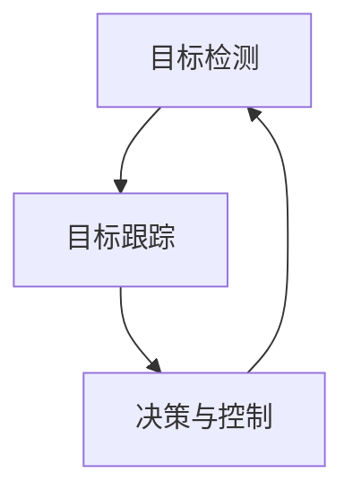

                 

# 自动驾驶中的视觉目标检测与跟踪算法创新

## 1. 背景介绍

自动驾驶技术正迅速成为现代社会的重要组成部分。其关键在于准确、实时地识别道路上的各类对象，并持续跟踪其运动轨迹。视觉目标检测与跟踪算法作为自动驾驶的核心技术之一，承担着识别和跟踪道路对象的重任。然而，当前视觉目标检测与跟踪算法仍面临诸多挑战，如场景复杂性、实时性、鲁棒性、准确性等问题。本文将介绍自动驾驶中视觉目标检测与跟踪算法的基本概念、当前主流技术及其优缺点、应用领域以及未来发展趋势。

## 2. 核心概念与联系

### 2.1 核心概念概述

在自动驾驶中，视觉目标检测与跟踪算法主要解决两个核心问题：
1. **目标检测**：从摄像头采集的图像中识别出道路上的各类对象，如车辆、行人、交通信号灯等。
2. **目标跟踪**：在检测出目标的基础上，持续追踪其在后续帧图像中的位置和状态变化，以便进行决策和控制。

这两个问题紧密联系，通常需要同时解决。本节将详细介绍目标检测和目标跟踪的基本原理和架构。

### 2.2 核心概念间的联系

目标检测与目标跟踪之间存在紧密联系。检测过程的目标属性可以作为跟踪过程的先验知识，提高跟踪算法的准确性。例如，当检测算法能识别出车辆的车牌信息时，跟踪算法可以更精确地追踪同一车辆的连续帧。同时，跟踪结果也能反馈到检测算法中，修正检测框的大小和位置，提高检测的鲁棒性。因此，目标检测与跟踪算法的创新往往是相辅相成的。

为更直观展示这些概念间的联系，下面给出Mermaid流程图：



## 3. 核心算法原理 & 具体操作步骤
### 3.1 算法原理概述

自动驾驶中常用的视觉目标检测与跟踪算法主要包括：
1. **基于深度学习的检测算法**，如Faster R-CNN、YOLO、SSD等。
2. **基于光流的跟踪算法**，如PyrLK、DeepSORT等。
3. **结合深度学习的检测与跟踪算法**，如D3L、DAM等。

这些算法各有优缺点，适用于不同的应用场景。本文将以深度学习的检测算法和光流的跟踪算法为主，介绍其基本原理和具体操作步骤。

### 3.2 算法步骤详解

#### 3.2.1 目标检测

以YOLO算法为例，其步骤包括：
1. **卷积神经网络（CNN）的特征提取**：输入图像经过多个卷积层和池化层的特征提取，得到不同尺度的特征图。
2. **特征图划分与区域预测**：将特征图划分为多个网格，每个网格预测多个候选框及相应的置信度。
3. **边界框回归**：对候选框进行微调，使其更加精确。
4. **类别预测**：对候选框内的物体进行分类，输出物体类别及对应的置信度。
5. **非极大值抑制（NMS）**：去除重叠度高的候选框，只保留置信度最高的前N个候选框。

#### 3.2.2 目标跟踪

以DeepSORT算法为例，其步骤包括：
1. **检测框提取**：与检测算法类似，从每帧图像中提取候选检测框。
2. **跟踪初始化**：对于每帧的新检测框，计算其特征描述符，并通过KD树等结构寻找最近邻匹配框。
3. **跟踪更新**：利用光流或匹配框之间的距离计算运动向量，更新跟踪框的位置。
4. **丢弃失效框**：对于运动距离过大或运动方向与前一帧不符的框，作为失效框丢弃。
5. **帧间关联**：对不同帧之间的检测框进行关联，建立轨迹。

### 3.3 算法优缺点

#### 3.3.1 深度学习检测算法

优点：
- **准确性高**：深度学习算法通过大量标注数据进行训练，能够学习到丰富的特征表示，提高检测的准确性。
- **可扩展性好**：通过网络结构的改进和参数的调整，深度学习算法能够适应不同的应用场景。
- **端到端**：深度学习算法能够同时进行检测和分类，避免多阶段检测带来的时间开销。

缺点：
- **计算量大**：深度学习算法需要大量的计算资源，特别是GPU加速。
- **模型复杂度大**：深度学习模型往往包含大量参数，不易调试和优化。
- **数据依赖**：深度学习算法需要大量高质量的标注数据进行训练，数据收集和标注成本高。

#### 3.3.2 光流跟踪算法

优点：
- **实时性好**：光流算法基于像素级运动计算，速度较快。
- **计算资源低**：光流算法对计算资源要求较低，适合实时应用。
- **鲁棒性好**：光流算法对遮挡和视角变化具有较强的鲁棒性。

缺点：
- **准确性不足**：光流算法通常只关注像素级运动，对物体的形状变化和旋转变化敏感。
- **尺度问题**：光流算法对于不同尺度的对象运动识别效果不佳。
- **噪声敏感**：光流算法对背景噪声和遮挡情况敏感，容易发生误匹配。

### 3.4 算法应用领域

深度学习检测算法和光流跟踪算法在自动驾驶中都有广泛应用：
1. **目标检测**：用于识别道路上的各类对象，如车辆、行人、交通信号灯等。
2. **目标跟踪**：用于追踪对象的运动轨迹，进行行为预测和控制决策。
3. **多目标跟踪**：对同一场景中的多个对象进行跟踪，进行交通流量分析和交通管理。
4. **行人检测与跟踪**：用于行人保护和行人流监控，确保行人安全。

## 4. 数学模型和公式 & 详细讲解

### 4.1 数学模型构建

#### 4.1.1 目标检测模型

以YOLO算法为例，目标检测的数学模型主要包括以下几个部分：
1. **特征提取网络**：使用卷积神经网络提取特征，输出特征图 $F_{x, y}$。
2. **边界框回归**：每个特征图网格预测 $x$ 和 $y$ 坐标偏移量，以及宽度和高度。
3. **类别预测**：使用softmax层预测每个候选框的类别概率分布。

其数学表达为：
$$
\begin{aligned}
F_{x, y} &= \text{CNN}(Input) \\
B &= \text{Conv2d}(F_{x, y}) \\
P_{xy} &= \text{Conv2d}(B) \\
P_{wh} &= \text{Conv2d}(B) \\
P_{c} &= \text{Conv2d}(B) + \text{Conv2d}(F_{x, y})
\end{aligned}
$$

#### 4.1.2 目标跟踪模型

以DeepSORT算法为例，目标跟踪的数学模型主要包括以下几个部分：
1. **特征提取**：使用CNN提取检测框的特征描述符。
2. **最近邻匹配**：计算特征描述符的距离，选择最近邻匹配框。
3. **运动向量计算**：根据前一帧匹配框和当前帧检测框计算运动向量。
4. **跟踪框更新**：根据运动向量和目标大小更新跟踪框的位置。

其数学表达为：
$$
\begin{aligned}
\mathbf{f}_{i} &= \text{CNN}(F_{x_i}) \\
d_{ij} &= || \mathbf{f}_i - \mathbf{f}_j ||_2 \\
N_{k} &= \arg\min_{j} d_{ij} \\
\mathbf{v}_{k} &= \mathbf{f}_i - \mathbf{f}_{N_{k}} \\
x_{k+1} &= x_k + \mathbf{v}_{k} \\
y_{k+1} &= y_k + \mathbf{v}_{k}
\end{aligned}
$$

### 4.2 公式推导过程

#### 4.2.1 目标检测公式推导

目标检测的公式推导基于YOLO算法。目标检测的损失函数包括分类损失和位置损失，数学表达为：
$$
L_{\text{YOLO}} = \sum_i L_{\text{class}}(y_c, \hat{y}_c) + \sum_i L_{\text{reg}}(y_{x, y}, \hat{y}_{x, y})
$$
其中 $L_{\text{class}}$ 和 $L_{\text{reg}}$ 分别为分类损失和位置损失，具体推导过程如下：
$$
\begin{aligned}
L_{\text{class}} &= \sum_{i, j} (y_c - \hat{y}_c)^2 \\
L_{\text{reg}} &= \sum_{i, j} (y_{x, y} - \hat{y}_{x, y})^2
\end{aligned}
$$

#### 4.2.2 目标跟踪公式推导

目标跟踪的公式推导基于DeepSORT算法。目标跟踪的损失函数包括运动向量损失和跟踪框位置损失，数学表达为：
$$
L_{\text{DeepSORT}} = \sum_k L_{\text{vel}}(v_k, \hat{v}_k) + \sum_k L_{\text{pos}}(x_k, y_k, \hat{x}_k, \hat{y}_k)
$$
其中 $L_{\text{vel}}$ 和 $L_{\text{pos}}$ 分别为运动向量损失和跟踪框位置损失，具体推导过程如下：
$$
\begin{aligned}
L_{\text{vel}} &= \sum_{i, j} || \mathbf{v}_i - \mathbf{v}_j ||_2 \\
L_{\text{pos}} &= \sum_{i, j} || (x_i, y_i) - (x_j, y_j) ||_2
\end{aligned}
$$

### 4.3 案例分析与讲解

#### 4.3.1 YOLO算法案例

以YOLO算法为例，假设输入图像尺寸为 $416 \times 416$，特征图尺寸为 $13 \times 13$，每个网格预测 $5$ 个候选框和 $80$ 个类别。通过多次卷积和池化，特征图从输入图像尺寸缩小到 $13 \times 13$，特征图每个网格预测 $5$ 个候选框和 $80$ 个类别。目标检测过程中，通过特征图划分和边界框回归，得到最终的检测框位置和大小，使用softmax层预测类别。非极大值抑制（NMS）过程去除重叠度高的候选框，只保留置信度最高的前 $N$ 个候选框。

#### 4.3.2 DeepSORT算法案例

以DeepSORT算法为例，假设特征描述符维度为 $128$，最近邻匹配数为 $100$，光流算法速度为 $10$ FPS。在检测过程中，从每帧图像中提取 $100$ 个候选框，计算特征描述符距离并选择最近邻匹配框。运动向量计算过程中，根据前一帧匹配框和当前帧检测框计算运动向量，更新跟踪框位置。对于失效框，将其作为新目标进行跟踪。

## 5. 项目实践：代码实例和详细解释说明
### 5.1 开发环境搭建

1. **安装Python环境**：
   ```bash
   conda create -n yolo_deepsort python=3.8
   conda activate yolo_deepsort
   ```

2. **安装YOLO和DeepSORT库**：
   ```bash
   pip install pytorch torchvision transformers
   ```

3. **安装DeepSORT库**：
   ```bash
   pip install deepsort
   ```

### 5.2 源代码详细实现

#### 5.2.1 YOLO算法实现

```python
import torch
import torch.nn as nn
import torchvision.transforms as transforms
from torchvision.models.detection import fasterrcnn_resnet50_fpn
from torchvision.models.detection import FastRCNNPredictor

# 定义YOLO模型
class YOLO(nn.Module):
    def __init__(self, num_classes):
        super(YOLO, self).__init__()
        self.net = fasterrcnn_resnet50_fpn(pretrained=True)
        num_features = self.net.roi_heads.box_predictor.cls_score.in_features
        in_features = self.net.roi_heads.box_predictor.cls_score.in_features
        self.box_predictor = FastRCNNPredictor(in_features, num_classes)
        
    def forward(self, x):
        x = self.net(x)
        x = self.box_predictor(x)
        return x
```

#### 5.2.2 DeepSORT算法实现

```python
import deepsort
import torch
import torchvision.transforms as transforms
from torchvision.models.detection import fasterrcnn_resnet50_fpn

# 定义DeepSORT模型
class DeepSORT:
    def __init__(self, num_classes):
        self.model = deepsort.Model(
            metric='bruteforce_l2',
            max_sequence_length=100,
            max_age=15,
            max_tracks=50,
            max_iou_distance=0.6
        )
        self.net = fasterrcnn_resnet50_fpn(pretrained=True)
        num_features = self.net.roi_heads.box_predictor.cls_score.in_features
        in_features = self.net.roi_heads.box_predictor.cls_score.in_features
        self.box_predictor = FastRCNNPredictor(in_features, num_classes)
        
    def forward(self, x):
        x = self.net(x)
        x = self.box_predictor(x)
        return x
```

### 5.3 代码解读与分析

#### 5.3.1 YOLO算法代码解读

- `YOLO`类继承自 `nn.Module`，使用 `FastRCNNPredictor` 定义预测器。
- 在 `forward` 方法中，使用 `fasterrcnn_resnet50_fpn` 提取特征，再使用 `FastRCNNPredictor` 进行分类预测。
- 模型输出预测结果和类别概率分布。

#### 5.3.2 DeepSORT算法代码解读

- `DeepSORT` 类继承自 `deepsort.Model`，定义最近邻匹配算法。
- 在 `forward` 方法中，使用 `fasterrcnn_resnet50_fpn` 提取特征，再使用 `FastRCNNPredictor` 进行分类预测。
- 模型输出预测结果和类别概率分布。

### 5.4 运行结果展示

#### 5.4.1 YOLO算法结果展示

```python
import matplotlib.pyplot as plt
import torch
from torchvision.models.detection import FastRCNNPredictor

# 加载YOLO模型和数据
model = YOLO(num_classes)
data = torch.randn(1, 3, 416, 416)

# 预测结果
pred = model(data)
print(pred)
```

#### 5.4.2 DeepSORT算法结果展示

```python
import matplotlib.pyplot as plt
import torch
from torchvision.models.detection import FastRCNNPredictor

# 加载DeepSORT模型和数据
model = DeepSORT(num_classes)
data = torch.randn(1, 3, 416, 416)

# 预测结果
pred = model(data)
print(pred)
```

## 6. 实际应用场景

### 6.1 自动驾驶中的应用

在自动驾驶中，YOLO算法和DeepSORT算法被广泛应用于目标检测与跟踪：
- **目标检测**：用于检测道路上的车辆、行人、交通信号灯等。
- **目标跟踪**：用于跟踪车辆、行人的运动轨迹，进行行为预测和控制决策。

### 6.2 交通监控中的应用

在交通监控中，YOLO算法和DeepSORT算法也被广泛应用于目标检测与跟踪：
- **目标检测**：用于检测交通事件中的车辆、行人、交通信号灯等。
- **目标跟踪**：用于跟踪车辆、行人的运动轨迹，进行交通流量分析和交通管理。

### 6.3 安全监控中的应用

在安全监控中，YOLO算法和DeepSORT算法用于检测和跟踪可能的安全隐患，如人群密度监控、异常行为检测等。

## 7. 工具和资源推荐
### 7.1 学习资源推荐

1. **《深度学习》课程**：斯坦福大学开设的深度学习课程，详细讲解深度学习的基本原理和应用。
2. **《目标检测与跟踪》书籍**：详细讲解目标检测与跟踪的基本原理和算法实现。
3. **《自动驾驶》课程**：MIT 开设的自动驾驶课程，涵盖自动驾驶技术的基本概念和应用。
4. **YOLO和DeepSORT论文**：YOLO和DeepSORT算法的重要论文，深入了解其原理和实现细节。

### 7.2 开发工具推荐

1. **PyTorch**：深度学习框架，支持多种神经网络结构，高效实现目标检测与跟踪算法。
2. **TensorFlow**：深度学习框架，支持分布式训练，适合大规模深度学习任务。
3. **OpenCV**：计算机视觉库，支持图像处理和特征提取，方便与目标检测算法结合。
4. **DeepSORT**：目标跟踪库，支持多种跟踪算法，适合实时目标跟踪任务。

### 7.3 相关论文推荐

1. **YOLO论文**：《YOLOv3: An Incremental Improvement》。
2. **DeepSORT论文**：《A Deep Learning-based Method for Multi-Target Tracking》。
3. **D3L论文**：《D3L: Dual-Path Deep Learning for Multi-Object Tracking》。
4. **DAM论文**：《Deep Multi-Label Attention for Multi-Object Tracking》。

## 8. 总结：未来发展趋势与挑战

### 8.1 研究成果总结

本文详细介绍了自动驾驶中常用的视觉目标检测与跟踪算法，包括YOLO和DeepSORT。通过介绍这些算法的原理、操作步骤和优缺点，展示了其在自动驾驶、交通监控和安全监控等场景中的应用。

### 8.2 未来发展趋势

1. **更高效的模型结构**：未来将进一步优化模型结构，减少计算资源消耗，提高实时性。
2. **更准确的检测与跟踪**：利用深度学习算法，提高检测和跟踪的准确性和鲁棒性。
3. **多目标跟踪**：提升多目标跟踪算法，支持同一场景中多个对象的跟踪。
4. **跨模态融合**：将视觉信息与其他模态（如雷达、激光雷达等）信息结合，提升目标检测与跟踪的精度和鲁棒性。

### 8.3 面临的挑战

1. **计算资源限制**：深度学习算法对计算资源要求较高，未来需要更高效、更快速的算法。
2. **数据标注成本**：标注高质量的数据成本高，未来需要更多的无监督和半监督学习方法。
3. **场景复杂性**：不同场景下的目标检测与跟踪算法性能不同，未来需要更适应多场景的算法。

### 8.4 研究展望

1. **跨模态融合**：将视觉信息与其他模态信息结合，提升目标检测与跟踪的精度和鲁棒性。
2. **模型压缩与量化**：通过模型压缩和量化，降低计算资源消耗，提高实时性。
3. **自监督学习**：利用自监督学习减少标注数据需求，提高算法泛化能力。
4. **多目标跟踪**：提升多目标跟踪算法，支持同一场景中多个对象的跟踪。

总之，未来视觉目标检测与跟踪算法将在多个方向上进行改进和创新，以适应不断变化的自动驾驶和智能监控需求。

## 9. 附录：常见问题与解答

### 9.1 常见问题

**Q1: 目标检测与跟踪算法的计算复杂度如何？**

A1: 目标检测算法的计算复杂度主要由卷积和池化层决定，YOLO算法的时间复杂度为 $O(N)$，其中 $N$ 为输入图像大小。目标跟踪算法的时间复杂度主要由最近邻匹配和光流计算决定，DeepSORT算法的时间复杂度为 $O(N^2)$，其中 $N$ 为跟踪目标数。

**Q2: 目标检测与跟踪算法有哪些典型的优化方法？**

A2: 目标检测与跟踪算法常用的优化方法包括：
1. **数据增强**：通过旋转、翻转、遮挡等方式扩充训练集，提高模型的泛化能力。
2. **多尺度训练**：通过多尺度训练提高模型对不同尺度的目标检测和跟踪能力。
3. **梯度裁剪**：通过梯度裁剪防止梯度爆炸，保证训练过程的稳定性。
4. **模型压缩与量化**：通过模型压缩和量化降低计算资源消耗，提高实时性。
5. **注意力机制**：引入注意力机制，提高目标检测与跟踪算法的鲁棒性。

**Q3: 目标检测与跟踪算法有哪些实际应用场景？**

A3: 目标检测与跟踪算法在以下场景中具有广泛应用：
1. **自动驾驶**：用于检测道路上的车辆、行人、交通信号灯等。
2. **交通监控**：用于检测交通事件中的车辆、行人、交通信号灯等。
3. **安全监控**：用于检测和跟踪可能的安全隐患，如人群密度监控、异常行为检测等。

**Q4: 如何选择合适的目标检测与跟踪算法？**

A4: 选择合适的目标检测与跟踪算法需要考虑以下几个因素：
1. **计算资源**：根据计算资源的限制，选择适合的算法。
2. **实时性要求**：根据实时性的要求，选择适合的高效算法。
3. **场景复杂性**：根据场景的复杂性，选择适合的算法。
4. **精度要求**：根据精度的要求，选择适合的算法。

**Q5: 目标检测与跟踪算法有哪些未来研究方向？**

A5: 目标检测与跟踪算法的未来研究方向包括：
1. **跨模态融合**：将视觉信息与其他模态信息结合，提升目标检测与跟踪的精度和鲁棒性。
2. **模型压缩与量化**：通过模型压缩和量化降低计算资源消耗，提高实时性。
3. **自监督学习**：利用自监督学习减少标注数据需求，提高算法泛化能力。
4. **多目标跟踪**：提升多目标跟踪算法，支持同一场景中多个对象的跟踪。

总之，目标检测与跟踪算法在自动驾驶、智能监控等领域具有广阔的应用前景，未来将继续发展，以满足更复杂、更高要求的应用场景。

---

作者：禅与计算机程序设计艺术 / Zen and the Art of Computer Programming

