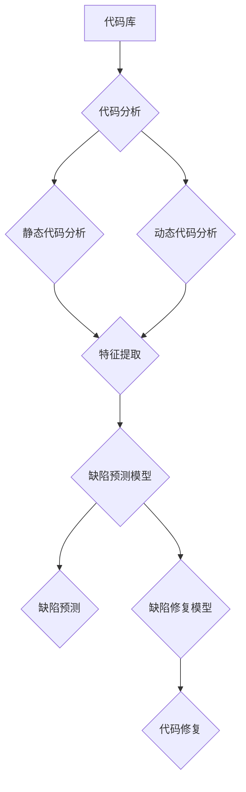

# AI驱动的软件缺陷预测与修复

> 关键词：AI，软件缺陷预测，代码分析，机器学习，数据科学，代码修复，持续集成

## 1. 背景介绍

随着软件系统的复杂性日益增加，软件缺陷（bug）的数量也随之上升。传统的软件缺陷修复方法通常依赖于开发者的经验和对代码的深入理解。然而，这种方法效率低下，且难以应对快速迭代的软件开发环境。近年来，人工智能（AI）技术的快速发展为软件缺陷预测与修复提供了新的解决方案。本文将探讨AI在软件缺陷预测与修复中的应用，包括其原理、算法、实践案例以及未来发展趋势。

### 1.1 问题的由来

软件缺陷是软件生命周期中不可避免的问题。它们可能导致系统崩溃、数据损坏或用户体验下降。传统的软件缺陷修复方法主要包括：

- 人工代码审查：通过人工审查代码来发现潜在的缺陷。
- 单元测试：编写测试用例来检测代码的特定功能。
- 集成测试：将多个模块组合在一起进行测试。

尽管这些方法在一定程度上能够发现缺陷，但它们存在以下局限性：

- 人工代码审查效率低，成本高。
- 单元测试难以覆盖所有可能的场景。
- 缺乏对复杂系统动态行为的理解。

### 1.2 研究现状

随着机器学习技术的发展，AI开始被广泛应用于软件缺陷预测与修复。以下是一些主要的研究方向：

- 软件缺陷预测：使用机器学习算法从代码和项目历史中预测缺陷的出现。
- 代码修复：使用AI技术自动修复已识别的缺陷。
- 持续集成（CI）：将AI集成到持续集成流程中，实现自动化缺陷检测和修复。

### 1.3 研究意义

AI驱动的软件缺陷预测与修复具有以下意义：

- 提高软件开发效率：自动化缺陷检测和修复过程，减少人工工作量。
- 降低开发成本：减少缺陷修复时间，降低维护成本。
- 提升软件质量：减少缺陷数量，提高软件质量。

## 2. 核心概念与联系

### 2.1 核心概念原理和架构的 Mermaid 流程图



### 2.2 核心概念

- **代码库**：存储源代码和版本控制系统的集合。
- **代码分析**：分析代码的结构、内容和行为，提取有用信息。
- **静态代码分析**：在不执行代码的情况下分析代码。
- **动态代码分析**：在代码运行时分析代码。
- **特征提取**：从代码中提取有助于预测缺陷的特征。
- **缺陷预测模型**：使用机器学习算法预测缺陷的出现。
- **缺陷预测**：根据特征和模型预测缺陷。
- **缺陷修复模型**：使用机器学习算法自动修复缺陷。
- **代码修复**：根据修复模型自动修改代码。

## 3. 核心算法原理 & 具体操作步骤

### 3.1 算法原理概述

AI驱动的软件缺陷预测与修复主要基于以下原理：

- **机器学习**：使用历史缺陷数据和正常代码数据训练模型，预测缺陷。
- **数据科学**：从代码和项目历史中提取特征，构建高质量的缺陷预测模型。
- **自然语言处理（NLP）**：处理代码注释、文档等非结构化数据。

### 3.2 算法步骤详解

1. **数据收集**：收集历史缺陷数据和正常代码数据。
2. **特征提取**：从代码和项目历史中提取特征。
3. **模型训练**：使用机器学习算法训练缺陷预测模型和缺陷修复模型。
4. **缺陷预测**：使用训练好的模型预测缺陷。
5. **代码修复**：使用训练好的模型修复缺陷。

### 3.3 算法优缺点

#### 优点：

- 高效：自动化缺陷检测和修复过程，提高软件开发效率。
- 准确：使用历史数据训练模型，提高缺陷预测的准确性。
- 可扩展：可以应用于大型项目。

#### 缺点：

- 数据依赖：需要大量历史缺陷数据。
- 模型复杂：需要复杂的机器学习模型。
- 解释性差：模型的决策过程难以解释。

### 3.4 算法应用领域

AI驱动的软件缺陷预测与修复可以应用于以下领域：

- **开源项目**：如GitHub、GitLab等。
- **商业软件**：如企业级应用、移动应用等。
- **物联网（IoT）**：如智能家居、智能汽车等。

## 4. 数学模型和公式 & 详细讲解 & 举例说明

### 4.1 数学模型构建

#### 4.1.1 缺陷预测模型

假设我们使用支持向量机（SVM）进行缺陷预测。SVM的目标是找到一个超平面，将正常代码和缺陷代码分开。数学公式如下：

$$
\max_{\omega, b} \ \frac{1}{2} \|\omega\|^2 - \sum_{i=1}^n \xi_i
$$

其中，$\omega$ 是权重向量，$b$ 是偏置，$\xi_i$ 是松弛变量。

#### 4.1.2 缺陷修复模型

假设我们使用深度学习进行代码修复。深度学习模型通常使用损失函数来评估预测结果和真实结果之间的差异。常见的损失函数包括：

- **交叉熵损失**：

  $$
  L(y, \hat{y}) = -\sum_{i=1}^n [y_i \log(\hat{y}_i) + (1-y_i) \log(1-\hat{y}_i)]
  $$

  其中，$y$ 是真实标签，$\hat{y}$ 是预测标签。

- **均方误差损失**：

  $$
  L(y, \hat{y}) = \frac{1}{2} \sum_{i=1}^n (y_i - \hat{y}_i)^2
  $$

### 4.2 公式推导过程

#### 4.2.1 交叉熵损失

交叉熵损失是分类任务中最常用的损失函数之一。其目的是最小化预测概率与真实概率之间的差异。

#### 4.2.2 均方误差损失

均方误差损失通常用于回归任务。其目的是最小化预测值与真实值之间的差异。

### 4.3 案例分析与讲解

#### 4.3.1 缺陷预测案例

假设我们使用SVM进行缺陷预测。以下是一个简单的案例：

- 训练数据集：包含正常代码和缺陷代码的样本。
- 特征：代码复杂度、代码行数、函数调用次数等。
- 标签：0（正常代码）、1（缺陷代码）。

使用SVM训练模型后，我们可以对新的代码样本进行预测，判断其是否为缺陷代码。

#### 4.3.2 缺陷修复案例

假设我们使用深度学习进行代码修复。以下是一个简单的案例：

- 训练数据集：包含缺陷代码和修复代码的样本。
- 特征：缺陷代码的输入和输出。
- 标签：修复代码的输出。

使用深度学习模型训练后，我们可以对缺陷代码进行修复。

## 5. 项目实践：代码实例和详细解释说明

### 5.1 开发环境搭建

为了进行AI驱动的软件缺陷预测与修复，我们需要以下开发环境：

- Python 3.x
- Jupyter Notebook或PyCharm
- TensorFlow或PyTorch
- Scikit-learn
- Pandas
- NumPy

### 5.2 源代码详细实现

以下是一个使用PyTorch进行缺陷预测的简单示例：

```python
import torch
import torch.nn as nn
import torch.optim as optim
from torch.utils.data import DataLoader, TensorDataset

# 创建数据集
def create_dataset():
    # 这里是创建数据集的代码，包括特征和标签
    pass

# 定义模型
class DefectPredictionModel(nn.Module):
    def __init__(self):
        super(DefectPredictionModel, self).__init__()
        self.fc = nn.Linear(10, 1)

    def forward(self, x):
        return self.fc(x)

# 训练模型
def train_model():
    # 加载数据集
    train_dataset = TensorDataset(features, labels)
    train_loader = DataLoader(train_dataset, batch_size=16, shuffle=True)

    # 初始化模型和优化器
    model = DefectPredictionModel()
    optimizer = optim.Adam(model.parameters(), lr=0.001)

    # 训练过程
    for epoch in range(10):
        for data, target in train_loader:
            optimizer.zero_grad()
            output = model(data)
            loss = nn.BCELoss(output, target)
            loss.backward()
            optimizer.step()

# 评估模型
def evaluate_model():
    # 这里是评估模型的代码
    pass

# 主函数
if __name__ == '__main__':
    train_model()
    evaluate_model()
```

### 5.3 代码解读与分析

上述代码定义了一个简单的缺陷预测模型，并实现了训练和评估过程。在实际应用中，需要根据具体任务和数据集进行调整。

### 5.4 运行结果展示

在训练和评估模型后，我们可以得到模型的性能指标，如准确率、召回率、F1值等。

## 6. 实际应用场景

AI驱动的软件缺陷预测与修复可以应用于以下实际场景：

- **持续集成**：在持续集成流程中，自动检测和修复代码缺陷。
- **代码审查**：辅助代码审查人员发现潜在缺陷。
- **自动化测试**：自动生成测试用例，检测代码缺陷。

## 7. 工具和资源推荐

### 7.1 学习资源推荐

- 《Python机器学习基础教程》
- 《深度学习入门》
- 《Scikit-learn机器学习》
- 《Pandas数据分析》

### 7.2 开发工具推荐

- TensorFlow
- PyTorch
- Scikit-learn
- Jupyter Notebook

### 7.3 相关论文推荐

- "Predicting Software Defects using Machine Learning"
- "Automated Program Repair with Neural Networks"
- "Neural Code Comprehension for Software Engineering"

## 8. 总结：未来发展趋势与挑战

### 8.1 研究成果总结

AI驱动的软件缺陷预测与修复技术近年来取得了显著的进展。通过机器学习、数据科学和自然语言处理技术的结合，AI已经能够有效地预测和修复软件缺陷。

### 8.2 未来发展趋势

- **多模态分析**：结合代码、文档、测试用例等多模态数据，提高缺陷预测的准确性。
- **可解释性AI**：提高模型的可解释性，使开发者能够理解模型的决策过程。
- **自动化修复**：开发更加高效的自动化修复算法，减少人工干预。

### 8.3 面临的挑战

- **数据质量**：需要高质量的数据集来训练模型。
- **模型可解释性**：提高模型的可解释性，使开发者能够理解模型的决策过程。
- **安全性**：确保AI驱动的软件缺陷预测与修复过程的安全性。

### 8.4 研究展望

AI驱动的软件缺陷预测与修复技术将在软件工程领域发挥越来越重要的作用。未来，随着技术的不断发展和应用场景的不断拓展，AI驱动的软件缺陷预测与修复技术将为软件开发带来更多可能性。

## 9. 附录：常见问题与解答

**Q1：AI驱动的软件缺陷预测与修复是否适用于所有类型的代码？**

A1：AI驱动的软件缺陷预测与修复技术主要适用于结构化代码，如Java、Python等。对于无结构化代码，如自然语言文本，可能需要其他类型的AI技术。

**Q2：AI驱动的软件缺陷预测与修复如何保证安全性？**

A2：为了保证安全性，需要确保：

- 模型训练数据的质量和准确性。
- 模型的可解释性，使开发者能够理解模型的决策过程。
- 模型的安全性测试，确保模型不会产生有害的输出。

**Q3：AI驱动的软件缺陷预测与修复是否能够完全替代人工？**

A3：AI驱动的软件缺陷预测与修复技术可以辅助开发人员发现和修复缺陷，但不能完全替代人工。开发者仍然需要参与缺陷的确认和修复过程。

**Q4：AI驱动的软件缺陷预测与修复的成本如何？**

A4：AI驱动的软件缺陷预测与修复的成本取决于多个因素，如数据质量、模型复杂度、硬件设备等。一般来说，使用开源工具和框架可以降低成本。

作者：禅与计算机程序设计艺术 / Zen and the Art of Computer Programming