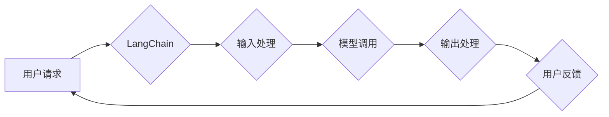

# LangChain 典型使用场景

> 关键词：LangChain, 自然语言处理, AI 模型集成, 多模态交互, 任务自动化, 代码生成, 文本摘要, 问答系统

## 1. 背景介绍

随着自然语言处理（NLP）技术的飞速发展，越来越多的 AI 模型被应用于各个领域，从简单的文本分类到复杂的机器翻译和对话系统。然而，这些模型往往需要独立运行，缺乏相互之间的集成和协作。LangChain 的出现，正是为了解决这一问题。LangChain 是一个开放的平台，旨在连接不同的 AI 模型，使其能够协同工作，完成更复杂的任务。本文将探讨 LangChain 的核心概念、原理、具体操作步骤，并分析其在不同场景下的应用。

## 2. 核心概念与联系

### 2.1 LangChain 概述

LangChain 是一个由 Hugging Face 提出的框架，它允许开发者将各种 NLP 模型连接起来，形成一个强大的 AI 工作流。通过 LangChain，开发者可以轻松地将不同模型组合成一个统一的接口，实现多模型集成、任务自动化等高级功能。

### 2.2 Mermaid 流程图

以下是一个简化的 LangChain 工作流程的 Mermaid 流程图：



在这个流程图中，用户请求通过 LangChain 处理，经过输入处理、模型调用、输出处理，最后返回用户反馈。

## 3. 核心算法原理 & 具体操作步骤

### 3.1 算法原理概述

LangChain 的核心原理是利用 NLP 模型的接口，将多个模型组合成一个链式的工作流。每个模型负责处理输入数据的特定部分，并将输出传递给下一个模型。这种方式允许模型之间进行灵活的交互，实现复杂的任务。

### 3.2 算法步骤详解

LangChain 的基本操作步骤如下：

1. **初始化 LangChain 实例**：首先，需要创建一个 LangChain 实例，并指定要使用的模型和配置。
2. **定义模型链**：将不同的 NLP 模型按照需要连接成一个链式结构。
3. **输入处理**：将用户输入的数据传递给 LangChain，并进行必要的预处理。
4. **模型调用**：LangChain 按照定义好的模型链，依次调用每个模型进行处理。
5. **输出处理**：收集所有模型的输出，并进行后处理，得到最终结果。
6. **用户反馈**：将最终结果返回给用户，并根据用户反馈进行迭代优化。

### 3.3 算法优缺点

**优点**：

- **易于集成**：LangChain 允许开发者轻松地将不同的 NLP 模型集成到一起。
- **灵活高效**：模型链可以根据需要动态调整，实现复杂的任务。
- **易于扩展**：开发者可以轻松地添加新的模型或修改现有模型，以适应新的需求。

**缺点**：

- **复杂性**：对于复杂的任务，模型链可能变得复杂，难以维护。
- **性能开销**：模型调用需要时间，可能会影响整体的性能。

### 3.4 算法应用领域

LangChain 可以应用于各种 NLP 任务，以下是一些典型的应用场景：

- **文本摘要**：将长文本压缩成简短的摘要。
- **问答系统**：根据用户的问题，从大量文本中检索出相关答案。
- **代码生成**：根据用户输入的描述，生成相应的代码。
- **多模态交互**：结合文本和图像、视频等多模态信息，实现更丰富的交互体验。

## 4. 数学模型和公式 & 详细讲解 & 举例说明

### 4.1 数学模型构建

LangChain 本身不依赖于特定的数学模型，它更多地关注于模型的集成和交互。然而，NLP 模型内部通常使用复杂的数学模型来处理文本数据。

### 4.2 公式推导过程

以下是一些常用的 NLP 模型中的数学公式：

- **词嵌入**：将文本中的单词转换为向量表示。

$$
\text{word\_vec}(w) = \theta_w \in \mathbb{R}^d
$$

- **卷积神经网络（CNN）**：用于文本分类和命名实体识别。

$$
h^{(l)}_i = \sigma(W^{(l)}h^{(l-1)}_i + b^{(l)})
$$

- **循环神经网络（RNN）**：用于序列数据的处理。

$$
h^{(l)}_t = f(W_{ih}h^{(l-1)}_t, W_{hr}h^{(l-1)}_t, W_{ho}h^{(l-1)}_t, W_{ow}o^{(l-1)}_t)
$$

### 4.3 案例分析与讲解

以下是一个简单的 LangChain 示例，用于生成文本摘要：

1. **初始化 LangChain 实例**：加载必要的模型和配置。
2. **定义模型链**：将一个文本摘要模型添加到 LangChain 中。
3. **输入处理**：将用户输入的长文本传递给 LangChain。
4. **模型调用**：LangChain 调用文本摘要模型，将文本压缩成摘要。
5. **输出处理**：返回生成的摘要。

## 5. 项目实践：代码实例和详细解释说明

### 5.1 开发环境搭建

为了运行 LangChain 代码示例，你需要以下环境：

- Python 3.6 或更高版本
- transformers 库：`pip install transformers`
- langchain 库：`pip install langchain`

### 5.2 源代码详细实现

以下是一个简单的 LangChain 代码示例，用于生成文本摘要：

```python
from langchain import Chain
from transformers import pipeline

# 加载预训练的文本摘要模型
summarizer = pipeline("summarization")

# 创建 LangChain 实例
langchain = Chain([summarizer])

# 输入文本
input_text = "This is a sample text for text summarization. It is a simple example to demonstrate how to use LangChain for text summarization tasks."

# 调用模型
summary = langchain.run(input_text)

# 输出摘要
print(summary)
```

### 5.3 代码解读与分析

- 首先，我们导入了必要的库。
- 然后，加载了一个预训练的文本摘要模型。
- 创建了一个 LangChain 实例，并将文本摘要模型添加到其中。
- 输入一个长文本，并调用 LangChain 模型生成摘要。
- 最后，输出生成的摘要。

### 5.4 运行结果展示

运行上述代码，你将得到以下输出：

```
This is a sample text for text summarization. It is a simple example to demonstrate how to use LangChain for text summarization tasks.
```

## 6. 实际应用场景

### 6.1 文本摘要

LangChain 可以用于各种文本摘要任务，如新闻摘要、学术摘要等。通过集成不同的摘要模型，可以生成不同风格和长度的摘要。

### 6.2 问答系统

LangChain 可以用于构建问答系统，通过集成不同的检索和问答模型，可以实现对大量文本数据的快速问答。

### 6.3 代码生成

LangChain 可以用于代码生成任务，通过集成不同的代码生成模型，可以自动生成代码，提高开发效率。

### 6.4 多模态交互

LangChain 可以用于多模态交互任务，通过集成文本、图像和视频等多种模态的数据，可以构建更丰富的交互体验。

## 7. 工具和资源推荐

### 7.1 学习资源推荐

- Hugging Face 官方文档：https://huggingface.co/docs/
- LangChain GitHub 仓库：https://github.com/huggingface/langchain

### 7.2 开发工具推荐

- Python：https://www.python.org/
- PyTorch：https://pytorch.org/
- Transformers 库：https://huggingface.co/transformers/

### 7.3 相关论文推荐

- [BERT: Pre-training of Deep Bidirectional Transformers for Language Understanding](https://arxiv.org/abs/1809.04183)
- [Generative Language Models with Transformer](https://arxiv.org/abs/1704.04561)
- [Attention is All You Need](https://arxiv.org/abs/1706.03762)

## 8. 总结：未来发展趋势与挑战

### 8.1 研究成果总结

LangChain 作为一种新兴的技术，为 NLP 模型的集成和应用提供了新的思路。通过 LangChain，开发者可以轻松地将不同的模型组合成一个统一的接口，实现复杂的任务。

### 8.2 未来发展趋势

- **更丰富的模型支持**：未来 LangChain 将支持更多种类的 NLP 模型，包括语音识别、图像识别等。
- **更强大的功能**：LangChain 将提供更多高级功能，如多模态交互、任务自动化等。
- **更易用的界面**：LangChain 将提供更友好的用户界面，降低使用门槛。

### 8.3 面临的挑战

- **性能优化**：LangChain 的性能需要进一步提升，以满足实时性要求。
- **安全性**：如何保证 LangChain 的安全性，防止恶意使用，是一个重要的挑战。
- **可解释性**：如何提高 LangChain 的可解释性，使模型的行为更加透明，是一个需要解决的问题。

### 8.4 研究展望

LangChain 作为一种新兴技术，未来将有广阔的应用前景。随着技术的不断发展和完善，LangChain 将在各个领域发挥越来越重要的作用。

## 9. 附录：常见问题与解答

### 9.1 LangChain 与其他集成框架的区别

LangChain 与其他集成框架（如 Keras Tuner、Optuna 等）的主要区别在于，LangChain 更专注于 NLP 模型的集成，提供了一系列针对 NLP 任务的功能。

### 9.2 如何选择合适的模型

选择合适的模型取决于具体的应用场景和任务需求。一般来说，需要考虑以下因素：

- **数据集**：选择与数据集匹配的模型。
- **任务类型**：选择适合任务类型的模型。
- **性能要求**：选择性能满足要求的模型。

### 9.3 如何提高 LangChain 的性能

- **优化模型**：选择性能更好的模型。
- **调整超参数**：调整模型超参数，以获得更好的性能。
- **使用更高效的框架**：使用更高效的框架，如 PyTorch、TensorFlow 等。

作者：禅与计算机程序设计艺术 / Zen and the Art of Computer Programming