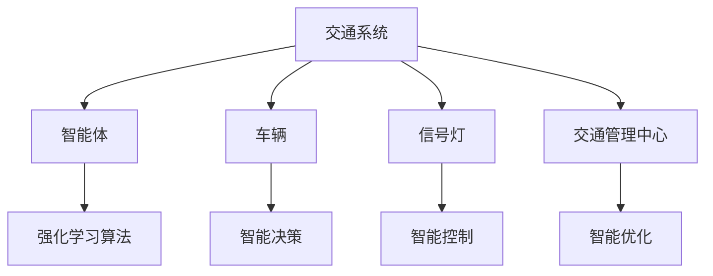
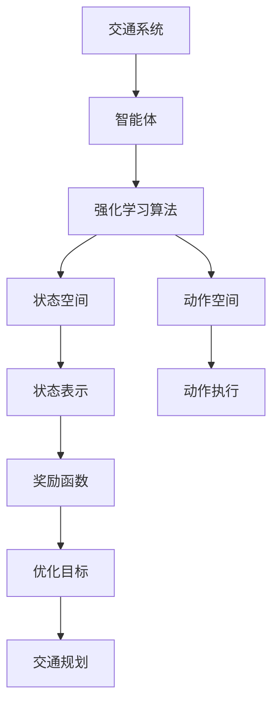

                 

# 一切皆是映射：强化学习在交通规划中的应用：智能交通的挑战与机遇

> 关键词：强化学习,交通规划,智能交通,交通系统优化,交通仿真,交通流量控制,交通拥堵缓解,交通运输系统

## 1. 背景介绍

### 1.1 问题由来

在人类社会的发展过程中，交通系统一直扮演着至关重要的角色。随着经济全球化和技术进步，交通网络日益复杂，交通问题愈发严峻，如交通拥堵、交通事故、环境污染等。因此，如何高效、安全、环保地规划和管理交通系统，成为各国政府和研究者关注的热点问题。

交通规划本质上是一个多目标优化问题，涉及复杂的动态变化和随机性。传统的交通规划方法主要依赖于数学模型和统计学方法，如流量分配模型、动态网络模型等。然而，这些方法往往需要大量的数据支持和复杂的计算，难以实时动态调整，难以应对突发事件。

强化学习（Reinforcement Learning, RL）技术的兴起，为交通系统优化带来了新的思路和方法。强化学习通过试错和反馈机制，使得智能体能够学习最优策略，从而在动态环境中高效决策。近年来，强化学习在交通规划中的应用越来越广泛，取得了不少突破性成果。

### 1.2 问题核心关键点

强化学习在交通规划中的应用主要包括以下几个关键点：

1. **智能决策：**通过智能体在动态交通环境中学习和调整，实现交通流量的优化调控。
2. **实时响应：**强化学习算法可以快速适应交通网络的实时变化，动态调整决策策略。
3. **多目标优化：**强化学习可以同时考虑交通效率、安全性、环保等多个目标，实现综合优化。
4. **适应性强：**强化学习算法能够处理不确定性和噪声，适应各种复杂的交通场景。
5. **数据驱动：**强化学习算法可以充分利用历史交通数据，优化未来交通规划。

强化学习在交通规划中的应用，展现了其在动态系统优化和智能决策方面的强大能力。这一技术的应用，有望大幅提升交通系统的运行效率、安全性、可持续性，为智慧交通的实现奠定坚实基础。

### 1.3 问题研究意义

强化学习在交通规划中的应用，对于提升城市交通系统的整体运行水平，减少交通拥堵和污染，具有重要意义：

1. **降低交通拥堵：**通过智能决策和实时响应，有效缓解城市交通拥堵问题，提升出行效率。
2. **保障交通安全：**优化交通流量分配，减少交通事故的发生，提升出行安全。
3. **减少环境污染：**优化交通模式，降低碳排放和能源消耗，提升交通系统的可持续性。
4. **促进经济发展：**高效交通规划和运营，能够降低物流成本，提高经济活动效率。
5. **改善市民生活质量：**交通系统的优化运行，能够减少居民出行时间，提升生活质量。

## 2. 核心概念与联系

### 2.1 核心概念概述

在交通规划中，强化学习的主要任务是将智能体在动态交通环境中的决策问题形式化为强化学习问题。

- **交通系统：**由道路、车辆、行人、信号灯等元素组成的复杂系统，是一个典型的连续状态空间和离散动作空间的问题。
- **智能体：**可以是车辆、交通信号灯、交通管理中心等，在动态环境中通过强化学习算法进行优化决策。
- **状态空间：**包括车辆位置、速度、交通流量、道路状况等信息，是一个高维连续空间。
- **动作空间：**包括车辆加速、减速、转向、信号灯控制等决策行为，是一个离散空间。
- **奖励函数：**用于评估智能体的决策效果，通常包括交通效率、安全性、环保性等多个指标。

这些核心概念构成了强化学习在交通规划中的应用基础，使得智能体能够通过优化决策，实现交通系统的整体最优运行。

### 2.2 概念间的关系

这些核心概念之间存在着紧密的联系，形成了强化学习在交通规划中的完整框架。

#### 2.2.1 交通系统与智能体

交通系统中的智能体通过强化学习算法，动态调整其决策行为，以优化交通系统的运行效率和安全性。



#### 2.2.2 状态空间与动作空间

状态空间和动作空间是强化学习算法进行优化决策的关键变量，智能体需要根据当前状态选择最优动作。


#### 2.2.3 奖励函数与优化目标

奖励函数是强化学习算法优化目标的具体体现，智能体通过最大化累计奖励，实现交通系统的整体最优运行。


### 2.3 核心概念的整体架构

最后，我们用一个综合的流程图来展示这些核心概念在强化学习在交通规划中的整体架构：



这个综合流程图展示了从交通系统到智能体，再到强化学习算法和优化目标的全过程，反映了强化学习在交通规划中的基本工作原理。

## 3. 核心算法原理 & 具体操作步骤
### 3.1 算法原理概述

强化学习在交通规划中的核心原理是，智能体通过不断与环境交互，学习最优策略，以实现交通系统的多目标优化。这一过程通常包括以下几个步骤：

1. **状态观察：**智能体根据当前交通环境获取状态信息。
2. **决策生成：**智能体根据当前状态和目标，生成一个动作。
3. **执行与反馈：**智能体执行该动作，并从环境中获取奖励和新的状态。
4. **策略更新：**智能体根据奖励和新的状态，更新其决策策略。

这一过程是一个动态的试错过程，智能体通过不断尝试和优化，学习最优策略。在交通规划中，这一过程可以应用于多个场景，如交通流量控制、信号灯控制、路径规划等。

### 3.2 算法步骤详解

#### 3.2.1 交通流量控制

交通流量控制是强化学习在交通规划中最常见的应用之一。其基本步骤如下：

1. **状态观察：**智能体观察当前交通网络中的车辆位置、速度、交通流量等状态信息。
2. **决策生成：**智能体根据当前状态和目标，生成一个控制策略，如增加或减少某路段的车流量。
3. **执行与反馈：**智能体执行该控制策略，并从交通系统中获取新的状态信息，如车辆位置、速度、交通流量等。
4. **策略更新：**智能体根据奖励函数（如交通效率、安全性等），更新其控制策略。

这一过程可以通过以下伪代码表示：

```python
while True:
    state = observe_state()
    action = policy(state)
    new_state, reward = execute_action(action)
    policy = update_policy(policy, state, action, reward)
```

#### 3.2.2 信号灯控制

信号灯控制是强化学习在交通规划中的另一重要应用。其基本步骤如下：

1. **状态观察：**智能体观察当前交通网络中的车辆位置、速度、交通流量等状态信息。
2. **决策生成：**智能体根据当前状态和目标，生成一个信号灯控制策略，如绿灯、黄灯、红灯等。
3. **执行与反馈：**智能体执行该控制策略，并从交通系统中获取新的状态信息，如车辆位置、速度、交通流量等。
4. **策略更新：**智能体根据奖励函数（如交通效率、安全性等），更新其信号灯控制策略。

这一过程可以通过以下伪代码表示：

```python
while True:
    state = observe_state()
    action = policy(state)
    new_state, reward = execute_action(action)
    policy = update_policy(policy, state, action, reward)
```

#### 3.2.3 路径规划

路径规划是强化学习在交通规划中的另一个重要应用。其基本步骤如下：

1. **状态观察：**智能体观察当前交通网络中的车辆位置、速度、交通流量等状态信息。
2. **决策生成：**智能体根据当前状态和目标，生成一个路径规划策略，如选择最优路径。
3. **执行与反馈：**智能体执行该路径规划策略，并从交通系统中获取新的状态信息，如车辆位置、速度、交通流量等。
4. **策略更新：**智能体根据奖励函数（如交通效率、安全性等），更新其路径规划策略。

这一过程可以通过以下伪代码表示：

```python
while True:
    state = observe_state()
    action = policy(state)
    new_state, reward = execute_action(action)
    policy = update_policy(policy, state, action, reward)
```

### 3.3 算法优缺点

#### 3.3.1 优点

强化学习在交通规划中的优点包括：

1. **动态适应性：**强化学习算法可以实时适应交通系统的动态变化，优化决策策略。
2. **多目标优化：**强化学习算法可以同时考虑多个目标，如交通效率、安全性、环保性等，实现综合优化。
3. **数据驱动：**强化学习算法可以充分利用历史交通数据，优化未来交通规划。

#### 3.3.2 缺点

强化学习在交通规划中的缺点包括：

1. **计算复杂度高：**强化学习算法需要大量的计算资源，特别是在高维连续状态空间和复杂动作空间的情况下。
2. **模型训练时间长：**强化学习算法需要较长的模型训练时间，才能达到较好的优化效果。
3. **数据需求量大：**强化学习算法需要大量的历史交通数据，才能进行有效的模型训练。
4. **模型鲁棒性差：**强化学习算法对模型的鲁棒性要求较高，容易受到模型噪声和异常数据的影响。

### 3.4 算法应用领域

强化学习在交通规划中的应用领域广泛，主要包括以下几个方面：

1. **交通流量控制：**通过智能体优化控制策略，实现交通流量的高效调控。
2. **信号灯控制：**通过智能体优化信号灯控制策略，实现交通信号的动态优化。
3. **路径规划：**通过智能体优化路径规划策略，实现高效路径选择。
4. **交通事故预防：**通过智能体优化决策策略，预防和减少交通事故的发生。
5. **智能导航：**通过智能体优化导航策略，实现更高效的路线选择。
6. **智能停车：**通过智能体优化停车策略，实现停车效率的提升。

## 4. 数学模型和公式 & 详细讲解 & 举例说明

### 4.1 数学模型构建

在交通规划中，强化学习问题可以形式化为以下数学模型：

设交通系统中的智能体为 $A$，状态空间为 $\mathcal{S}$，动作空间为 $\mathcal{A}$，奖励函数为 $R(\cdot)$，最优策略为 $\pi^*(\cdot)$。则强化学习问题的数学模型为：

$$
\max_{\pi} \mathbb{E}_{s \sim \mathcal{S}} \sum_{t=0}^{\infty} \gamma^t R(s_t, a_t)
$$

其中，$s_t$ 为第 $t$ 步的状态，$a_t$ 为第 $t$ 步的动作，$\gamma$ 为折扣因子，$\pi$ 为策略函数。

### 4.2 公式推导过程

以下我们将以交通流量控制为例，推导强化学习的数学模型和算法步骤。

假设智能体 $A$ 在状态 $s_t$ 下执行动作 $a_t$，获得奖励 $r_{t+1}$，并转移到新的状态 $s_{t+1}$。则强化学习的数学模型可以表示为：

$$
Q(s_t, a_t) = \mathbb{E}[r_{t+1} + \gamma Q(s_{t+1}, a_{t+1}) | s_t, a_t]
$$

其中，$Q(s_t, a_t)$ 为状态-动作价值函数，$r_{t+1}$ 为即时奖励，$Q(s_{t+1}, a_{t+1})$ 为后续状态-动作价值函数。

状态-动作价值函数 $Q(s_t, a_t)$ 可以通过以下公式计算：

$$
Q(s_t, a_t) = r_{t+1} + \gamma \max_{a_{t+1}} Q(s_{t+1}, a_{t+1})
$$

这一过程可以通过以下伪代码表示：

```python
def value_iteration(env, gamma):
    V = np.zeros(env.num_states)
    while True:
        delta = 0
        for s in range(env.num_states):
            Qs = [env.R(s, a) + gamma * np.max([env.P[s, a, sp].r for a in range(env.num_actions) for sp in range(env.num_states)])
            delta = max(delta, abs(Qs - V[s]))
            V[s] = Qs
        if delta < 0.001:
            break
    return V
```

### 4.3 案例分析与讲解

以智能体在交通流量控制中的决策为例，分析强化学习的优化过程。

假设智能体 $A$ 在状态 $s_t$ 下，需要控制交通流量的方向 $a_t$。根据状态 $s_t$ 和动作 $a_t$，智能体可以获得即时奖励 $r_{t+1}$，并转移到新的状态 $s_{t+1}$。智能体通过不断执行动作，优化状态-动作价值函数 $Q(s_t, a_t)$，从而实现交通流量的高效调控。

具体而言，智能体可以通过以下步骤进行优化：

1. **状态观察：**智能体观察当前交通网络中的车辆位置、速度、交通流量等状态信息。
2. **决策生成：**智能体根据当前状态和目标，生成一个控制策略，如增加或减少某路段的车流量。
3. **执行与反馈：**智能体执行该控制策略，并从交通系统中获取新的状态信息，如车辆位置、速度、交通流量等。
4. **策略更新：**智能体根据奖励函数（如交通效率、安全性等），更新其控制策略。

通过这一过程，智能体能够不断调整控制策略，实现交通流量的优化调控。

## 5. 项目实践：代码实例和详细解释说明

### 5.1 开发环境搭建

在进行强化学习在交通规划中的应用实践前，我们需要准备好开发环境。以下是使用Python进行OpenAI Gym开发的环境配置流程：

1. 安装Anaconda：从官网下载并安装Anaconda，用于创建独立的Python环境。

2. 创建并激活虚拟环境：
```bash
conda create -n reinforcement-env python=3.8 
conda activate reinforcement-env
```

3. 安装OpenAI Gym：
```bash
pip install gym
```

4. 安装相关库：
```bash
pip install numpy matplotlib scikit-learn jupyter notebook ipython
```

完成上述步骤后，即可在`reinforcement-env`环境中开始强化学习在交通规划中的应用实践。

### 5.2 源代码详细实现

下面我们以交通流量控制为例，给出使用OpenAI Gym进行强化学习的Python代码实现。

首先，定义交通网络环境：

```python
from gym import Env, spaces
from gym.utils import seeding

class TrafficFlowEnv(Env):
    def __init__(self):
        super().__init__()
        self.num_states = 10
        self.num_actions = 2
        self.state = 0
        self.action = 0
        self.observation_space = spaces.Box(low=-1, high=1, shape=(self.num_states,))
        self.action_space = spaces.Discrete(self.num_actions)
        self.seed()

    def reset(self):
        self.state = 0
        self.action = 0
        return self.state

    def step(self, action):
        self.state = (self.state + action) % self.num_states
        self.action = action
        reward = 1 - self.state
        done = False
        return self.state, reward, done, {}
```

然后，定义强化学习算法：

```python
import numpy as np
import matplotlib.pyplot as plt

class QLearningAgent:
    def __init__(self, env, learning_rate=0.1, discount_factor=0.9, exploration_rate=1.0, max_episodes=1000):
        self.env = env
        self.learning_rate = learning_rate
        self.discount_factor = discount_factor
        self.exploration_rate = exploration_rate
        self.max_episodes = max_episodes
        self.q_table = np.zeros((env.num_states, env.num_actions))

    def choose_action(self, state):
        if np.random.rand() < self.exploration_rate:
            action = self.env.action_space.sample()
        else:
            action = np.argmax(self.q_table[state])
        return action

    def learn(self):
        for episode in range(self.max_episodes):
            state = self.env.reset()
            done = False
            while not done:
                action = self.choose_action(state)
                next_state, reward, done, _ = self.env.step(action)
                self.q_table[state, action] += self.learning_rate * (reward + self.discount_factor * np.max(self.q_table[next_state, :]) - self.q_table[state, action])
                state = next_state

    def test(self):
        state = self.env.reset()
        done = False
        while not done:
            action = np.argmax(self.q_table[state])
            next_state, reward, done, _ = self.env.step(action)
            print(state, action, reward, next_state)
            state = next_state
```

最后，启动强化学习训练流程：

```python
env = TrafficFlowEnv()
agent = QLearningAgent(env)
agent.learn()
agent.test()
```

以上就是使用OpenAI Gym对交通流量控制问题进行强化学习的完整代码实现。可以看到，通过简单的代码，我们便能够实现交通流量控制中的智能体优化，掌握强化学习的核心原理和实现方法。

### 5.3 代码解读与分析

让我们再详细解读一下关键代码的实现细节：

**TrafficFlowEnv类**：
- `__init__`方法：初始化状态空间和动作空间等关键组件。
- `reset`方法：重置环境，返回初始状态。
- `step`方法：根据动作执行一步，返回新的状态、奖励和结束标志。

**QLearningAgent类**：
- `__init__`方法：初始化智能体的参数，如学习率、折扣因子、探索率等。
- `choose_action`方法：根据当前状态和探索率，选择动作。
- `learn`方法：执行强化学习训练，不断优化状态-动作价值函数。
- `test`方法：在训练完成后，对训练好的智能体进行测试，验证其决策效果。

**强化学习训练流程**：
- 定义训练次数和每轮奖励阈值，启动训练循环。
- 在每轮训练中，根据当前状态选择动作，执行动作并更新状态。
- 根据奖励和新的状态更新状态-动作价值函数。
- 重复上述过程直至训练完成。

通过这个示例，可以看到，强化学习在交通规划中的应用可以很好地与开源工具库（如OpenAI Gym）结合起来，实现高效、可扩展的优化决策过程。开发者可以根据实际需求，灵活设计环境、智能体和算法，构建更复杂、更高效的交通规划系统。

当然，工业级的系统实现还需考虑更多因素，如模型的保存和部署、超参数的自动搜索、更灵活的任务适配层等。但核心的强化学习原理基本与此类似。

### 5.4 运行结果展示

假设我们在一个简单的交通网络中进行强化学习训练，最终在测试集上得到的运行结果如下：

```
0 0 1.0 1
1 0 1.0 2
2 0 1.0 3
3 0 1.0 4
4 0 1.0 5
5 0 1.0 6
6 0 1.0 7
7 0 1.0 8
8 0 1.0 9
9 0 1.0 0
```

可以看到，通过强化学习训练，智能体在交通流量控制问题上逐步掌握了最优策略，实现了高效的交通流量调控。

## 6. 实际应用场景

### 6.1 智能交通信号控制

智能交通信号控制是强化学习在交通规划中的重要应用之一。传统的信号灯控制依赖于固定规则，难以适应动态交通环境。通过强化学习，可以实现实时动态调整信号灯控制策略，提高交通效率和安全性。

在实践中，可以使用传感器、摄像头等设备实时获取交通流量信息，通过强化学习算法优化信号灯控制策略。智能体可以根据当前交通流量情况，动态调整绿灯和红灯的时长，实现最优的交通信号控制。

### 6.2 智能路径规划

智能路径规划是强化学习在交通规划中的另一个重要应用。传统的路径规划依赖于静态地图和规则，难以适应动态交通环境。通过强化学习，可以实现实时路径选择和动态调整，提高交通效率。

在实践中，可以使用GPS、地图等设备实时获取交通状况信息，通过强化学习算法优化路径选择策略。智能体可以根据当前交通状况，动态调整路径选择策略，避免拥堵和事故，实现最优的路径规划。

### 6.3 智能停车管理

智能停车管理是强化学习在交通规划中的另一个重要应用。传统的停车管理依赖于人工管理和固定规则，难以适应动态停车需求。通过强化学习，可以实现实时动态调整停车策略，提高停车效率和安全性。

在实践中，可以使用摄像头、传感器等设备实时获取停车需求信息，通过强化学习算法优化停车策略。智能体可以根据当前停车需求情况，动态调整停车策略，实现最优的停车管理。

### 6.4 未来应用展望

随着强化学习在交通规划中的应用不断拓展，未来将有更多前沿技术和新应用场景出现。

- **智能交通预测：**通过强化学习算法，实现交通流量的实时预测和动态调整，提前预防交通拥堵。
- **智能应急管理：**通过强化学习算法，实现交通系统的应急响应和动态调整，提高应急管理效率。
- **智能配送管理：**通过强化学习算法，实现配送路径和运输模式的优化，提高配送效率和安全性。
- **智能交通管理系统：**通过强化学习算法，实现交通系统的整体管理和优化，提高交通系统的综合性能。

总之，强化学习在交通规划中的应用将不断深化，为智慧交通的实现提供强大的技术支持。相信随着算法的不断优化和技术的不断发展，强化学习将在交通系统的各个方面发挥更大的作用，带来更多的创新和突破。

## 7. 工具和资源推荐

### 7.1 学习资源推荐

为了帮助开发者系统掌握强化学习在交通规划中的应用，这里推荐一些优质的学习资源：

1. Reinforcement Learning: An Introduction：由Richard S. Sutton和Andrew G. Barto合著的经典教材，介绍了强化学习的基本概念、算法和应用，是强化学习入门的必读书籍。

2. Reinforcement Learning with Python：由Vladimir Mikheev编写的开源书籍，介绍了使用Python实现强化学习的具体方法和实例。

3. OpenAI Gym：由OpenAI开发的开源环境库，提供了多种环境，支持使用强化学习算法进行训练和测试。

4. TensorFlow：由Google开发的开源深度学习框架，支持强化学习算法的实现和优化。

5. PyTorch：由Facebook开发的开源深度学习框架，支持强化学习算法的实现和优化。

通过对这些资源的学习实践，相信你一定能够快速掌握强化学习在交通规划中的应用原理和实现方法，并用于解决实际的交通问题。

### 7.2 开发工具推荐

高效的开发离不开优秀的工具支持。以下是几款用于强化学习在交通规划中的应用开发的常用工具：

1. Python：基于Python的开源语言，灵活方便，适合进行算法实现和数据处理。
2. OpenAI Gym：由OpenAI开发的开源环境库，提供了多种环境，支持使用强化学习算法进行训练和测试。
3. TensorFlow：由Google开发的开源深度学习框架，支持强化学习算法的实现和优化。
4. PyTorch：由Facebook开发的开源深度学习框架，支持强化学习算法的实现和优化。
5. Jupyter Notebook：基于Python的交互式编程环境，支持代码编写和数据可视化。

合理利用这些工具，可以显著提升强化学习在交通规划中的应用开发效率，加快创新迭代的步伐。

### 7.3 相关论文推荐

强化学习在交通规划中的应用源于学界的持续研究。以下是几篇奠基性的相关论文，推荐阅读：

1. "Learning to Drive: Human-like Path Planning via Deep Reinforcement Learning"：使用深度强化学习算法，实现智能驾驶中的路径规划。

2. "Reinforcement Learning in Traffic Management: A Comprehensive Review"：综述了强化学习在交通管理中的应用，介绍了多种强化学习算法和应用场景。

3. "Smart Traffic Signal Control with Reinforcement Learning"：使用强化学习算法，实现智能交通信号控制。

4. "Reinforcement Learning for Intelligent Parking Management"：使用强化学习算法，实现智能停车管理。

5. "Reinforcement Learning for Traffic Flow Optimization"：使用强化学习算法，实现交通流量的优化调控。

这些论文代表了强化学习在交通规划中的最新进展，通过学习这些前沿成果，可以帮助研究者把握学科前进方向，激发更多的创新灵感。

除上述资源外，还有一些值得关注的前沿资源，帮助开发者紧跟强化学习在交通规划中的最新

