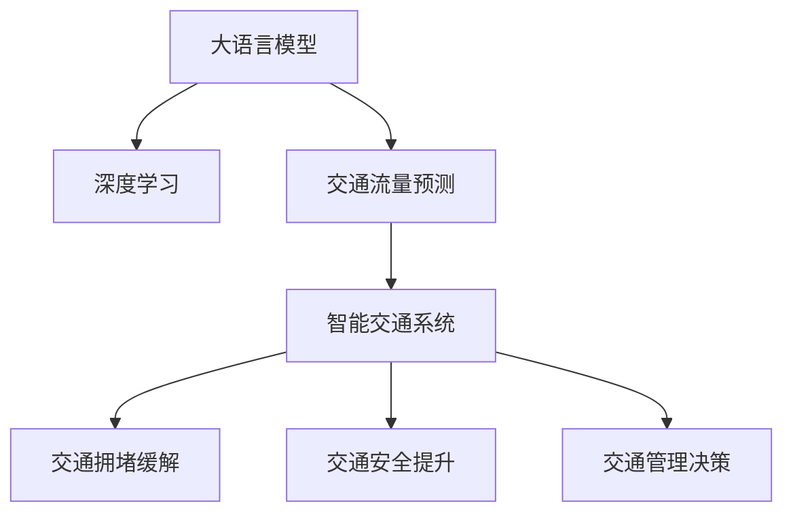
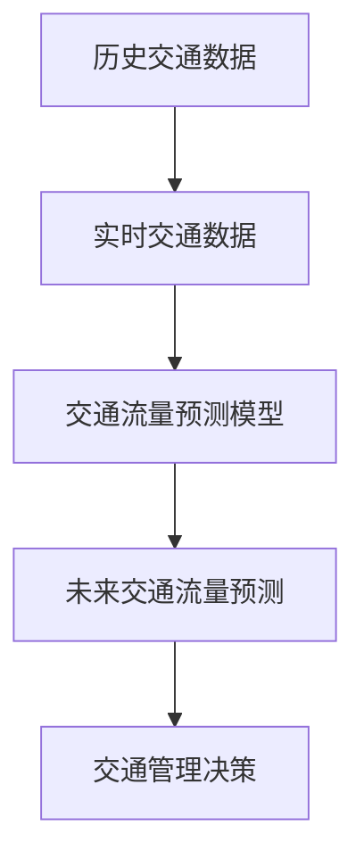
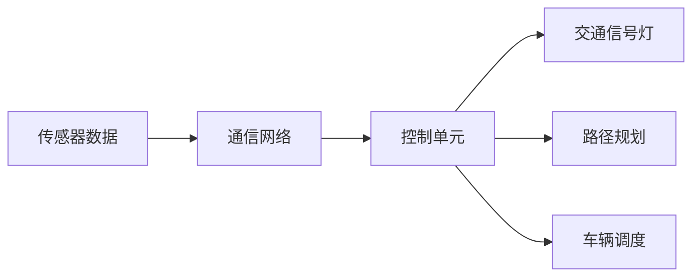

                 

# 交通管理：LLM 优化城市交通

> 关键词：交通流量预测,智能交通系统,城市拥堵缓解,交通安全提升,交通管理决策,深度学习,大语言模型

## 1. 背景介绍

### 1.1 问题由来

随着城市化进程的加速和机动车保有量的增加，全球范围内越来越多的城市面临着交通拥堵、安全事故频发等问题。如何通过有效的手段优化城市交通管理，提升交通效率和安全，是各国政府和交通部门亟需解决的关键问题。传统的交通管理方式依赖于经验性的交通流量统计和规则制定，难以实时响应交通变化，效果有限。

近年来，人工智能，尤其是深度学习和自然语言处理（NLP）技术的应用，为城市交通管理带来了新的突破。特别是大语言模型（LLM），凭借其强大的自然语言理解和处理能力，在交通流量预测、智能交通系统构建等方面展现出广阔的应用前景。

### 1.2 问题核心关键点

基于LLM的交通管理优化主要围绕以下几个核心关键点展开：

1. **交通流量预测**：通过分析历史交通数据和实时交通状况，预测未来交通流量变化，为城市交通管理和调度提供依据。
2. **智能交通系统构建**：利用LLM对交通规则进行自动生成和优化，实现交通信号灯控制、路径规划等功能。
3. **城市拥堵缓解**：通过动态调整交通信号灯、优化交通路线，减少城市拥堵。
4. **交通安全提升**：通过语音提示、交通违规提醒等，增强交通安全，降低事故率。
5. **交通管理决策**：基于实时交通数据和预测结果，辅助交通管理部门进行决策，优化交通资源配置。

## 2. 核心概念与联系

### 2.1 核心概念概述

为更好地理解基于LLM的城市交通管理优化方法，本节将介绍几个密切相关的核心概念：

- **大语言模型（LLM）**：以Transformer架构为代表的大规模预训练语言模型，能够处理自然语言输入，理解并生成文本。
- **交通流量预测**：通过模型预测未来交通流量，为城市交通管理提供决策依据。
- **智能交通系统（ITS）**：结合传感器、通信、控制等技术，实现对交通流的实时监控和动态调控。
- **深度学习（DL）**：利用多层神经网络进行复杂模式识别和决策，是大语言模型和智能交通系统的基础技术。
- **自然语言处理（NLP）**：处理和理解自然语言的技术，在大语言模型中起到关键作用。

这些核心概念之间的逻辑关系可以通过以下Mermaid流程图来展示：



这个流程图展示了大语言模型在城市交通管理优化中的核心作用和关键应用领域。

### 2.2 概念间的关系

这些核心概念之间存在着紧密的联系，形成了城市交通管理优化的完整生态系统。下面我通过几个Mermaid流程图来展示这些概念之间的关系。

#### 2.2.1 大语言模型在交通流量预测中的应用



这个流程图展示了基于LLM的交通流量预测过程。通过结合历史和实时交通数据，LLM可以训练出能够预测未来交通流量的模型，辅助交通管理部门进行决策。

#### 2.2.2 大语言模型在智能交通系统中的应用



这个流程图展示了智能交通系统中LLM的应用。通过收集传感器数据和通信网络信息，LLM可以自动生成和优化交通信号灯控制和路径规划策略，提升交通效率。

#### 2.2.3 大语言模型在交通拥堵缓解中的应用


这个流程图展示了基于LLM的交通拥堵缓解过程。通过实时监测交通拥堵状况，LLM可以自动调整交通信号灯和优化路径，缓解交通压力。

#### 2.2.4 大语言模型在交通安全提升中的应用


这个流程图展示了基于LLM的交通安全提升过程。通过分析交通违规行为，LLM可以生成语音提示和提醒信息，增强交通安全，降低事故率。

#### 2.2.5 大语言模型在交通管理决策中的应用


这个流程图展示了基于LLM的交通管理决策过程。通过实时交通数据和预测模型，LLM可以辅助交通管理部门进行决策，优化交通资源配置。

## 3. 核心算法原理 & 具体操作步骤
### 3.1 算法原理概述

基于LLM的城市交通管理优化方法，本质上是一种监督学习的应用，通过分析历史交通数据，预测未来流量变化，并在此基础上优化交通系统。其核心思想是：

1. **数据收集**：收集历史交通流量数据、实时交通数据、气象数据、社会事件数据等，构建全面、实时的数据集。
2. **模型训练**：利用深度学习模型，训练能够预测未来交通流量的模型。
3. **优化决策**：基于预测结果和实时数据，通过LLM生成和优化交通信号灯控制、路径规划、违规行为提醒等决策。
4. **动态调整**：根据实际情况，动态调整模型参数和决策策略，实现交通系统的动态优化。

### 3.2 算法步骤详解

基于LLM的城市交通管理优化方法，一般包括以下几个关键步骤：

**Step 1: 数据收集与预处理**

- 收集历史交通流量数据、实时交通数据、气象数据、社会事件数据等。
- 对数据进行清洗、去重、归一化等预处理，确保数据质量。
- 将数据集划分为训练集、验证集和测试集。

**Step 2: 构建深度学习模型**

- 选择合适的深度学习模型，如卷积神经网络（CNN）、循环神经网络（RNN）、Transformer等。
- 设计模型架构，包括输入层、隐藏层、输出层等。
- 选择合适的损失函数，如均方误差（MSE）、交叉熵（Cross-Entropy）等。
- 确定模型的超参数，如学习率、批大小、迭代轮数等。

**Step 3: 模型训练与验证**

- 使用训练集对模型进行前向传播和反向传播，最小化损失函数。
- 在验证集上评估模型性能，防止过拟合。
- 根据验证集结果调整模型参数，优化模型性能。

**Step 4: 交通管理决策**

- 利用预测模型，对未来交通流量进行预测。
- 结合实时交通数据，通过LLM生成和优化交通信号灯控制、路径规划、违规行为提醒等决策。
- 根据决策结果，动态调整交通系统，缓解交通压力。

**Step 5: 持续优化**

- 根据实际运行情况，不断更新和优化模型参数，提升模型性能。
- 引入在线学习技术，实时更新模型，适应交通变化的动态性。

### 3.3 算法优缺点

基于LLM的城市交通管理优化方法具有以下优点：

1. **高效预测**：利用深度学习模型进行预测，能够快速处理大量数据，提供实时、准确的交通流量预测。
2. **动态调整**：LLM能够根据实时数据和预测结果，动态调整交通系统，实现交通优化。
3. **多模态融合**：结合多种数据源，包括交通流量、气象、社会事件等，提升决策的全面性和准确性。
4. **自动化管理**：通过自动化生成和优化决策，减少人工干预，提高交通管理效率。

同时，该方法也存在一些局限性：

1. **数据依赖**：模型性能高度依赖于数据质量和数量，数据收集和预处理工作量大。
2. **模型复杂性**：深度学习模型结构复杂，训练和推理计算量大，对计算资源要求高。
3. **泛化能力**：模型泛化能力有限，当训练数据与实际交通状况差异较大时，效果可能不理想。
4. **解释性不足**：模型决策过程难以解释，缺乏透明度和可解释性，影响决策信任度。

尽管存在这些局限性，基于LLM的城市交通管理优化方法仍是大规模数据驱动的交通管理中，一种高效、可靠的技术手段。

### 3.4 算法应用领域

基于LLM的城市交通管理优化方法，已经在多个领域得到应用，例如：

- **智能交通信号灯控制**：通过实时监测交通流量，动态调整信号灯时长和顺序，减少交通拥堵。
- **路径优化与导航**：利用深度学习模型预测交通流量，优化路径规划，减少出行时间。
- **交通违规行为识别与预警**：通过语音提示、交通违规提醒等，增强交通安全，降低事故率。
- **交通资源配置**：基于实时交通数据和预测结果，辅助交通管理部门进行决策，优化交通资源配置。

除了上述这些经典应用外，LLM还被创新性地应用于城市交通规划、交通安全教育、绿色交通引导等新场景中，为城市交通管理带来了新的突破。

## 4. 数学模型和公式 & 详细讲解 & 举例说明
### 4.1 数学模型构建

假设历史交通流量数据为 $D=\{(x_i, y_i)\}_{i=1}^N$，其中 $x_i$ 为交通流量时间序列，$y_i$ 为交通流量预测值。目标是通过深度学习模型 $f(x; \theta)$ 对未来交通流量进行预测，其中 $\theta$ 为模型参数。

构建深度学习模型的数学模型如下：

$$
\min_{\theta} \sum_{i=1}^N \ell(f(x_i; \theta), y_i)
$$

其中 $\ell$ 为损失函数，用于衡量预测值与真实值之间的差异。常用的损失函数包括均方误差（MSE）和交叉熵（Cross-Entropy）等。

### 4.2 公式推导过程

以均方误差（MSE）损失函数为例，进行详细推导：

$$
\min_{\theta} \sum_{i=1}^N (y_i - f(x_i; \theta))^2
$$

将目标函数对 $\theta$ 求导，得：

$$
\frac{\partial \mathcal{L}}{\partial \theta} = -2\sum_{i=1}^N (y_i - f(x_i; \theta)) f'(x_i; \theta)
$$

根据链式法则，梯度计算公式为：

$$
\nabla_{\theta}\mathcal{L} = -2 \sum_{i=1}^N (y_i - f(x_i; \theta)) f'(x_i; \theta) \nabla_{\theta} f(x_i; \theta)
$$

其中 $f'(x_i; \theta)$ 为模型 $f(x; \theta)$ 的梯度。

### 4.3 案例分析与讲解

假设我们使用一个LSTM网络对交通流量进行预测，模型结构如下：


输入层包含当前时间点 $x_t$ 的交通流量数据，隐藏层和输出层由LSTM组成，输出层为交通流量预测值 $y_t$。通过反向传播算法计算梯度，并使用梯度下降法更新模型参数 $\theta$。

在实际应用中，模型训练时需要选择合适的学习率，避免梯度爆炸或消失。同时，为了提高模型泛化能力，可以引入正则化技术，如L2正则化、Dropout等。

## 5. 项目实践：代码实例和详细解释说明
### 5.1 开发环境搭建

在进行交通管理优化项目开发前，我们需要准备好开发环境。以下是使用Python进行PyTorch开发的环境配置流程：

1. 安装Anaconda：从官网下载并安装Anaconda，用于创建独立的Python环境。

2. 创建并激活虚拟环境：
```bash
conda create -n pytorch-env python=3.8 
conda activate pytorch-env
```

3. 安装PyTorch：根据CUDA版本，从官网获取对应的安装命令。例如：
```bash
conda install pytorch torchvision torchaudio cudatoolkit=11.1 -c pytorch -c conda-forge
```

4. 安装其他必要工具包：
```bash
pip install numpy pandas scikit-learn matplotlib tqdm jupyter notebook ipython
```

完成上述步骤后，即可在`pytorch-env`环境中开始项目开发。

### 5.2 源代码详细实现

下面我们以基于LSTM的交通流量预测为例，给出使用PyTorch进行项目开发的完整代码实现。

```python
import torch
import torch.nn as nn
import torch.optim as optim
import torch.utils.data as data
import matplotlib.pyplot as plt

class TrafficDataLoader(data.Dataset):
    def __init__(self, data, seq_len=20):
        self.data = data
        self.seq_len = seq_len
        
    def __len__(self):
        return len(self.data) - self.seq_len
    
    def __getitem__(self, idx):
        x = self.data[idx:idx+self.seq_len]
        y = self.data[idx+self.seq_len]
        return (torch.tensor(x), torch.tensor(y))

def create_model(input_dim, hidden_dim, output_dim):
    model = nn.Sequential(
        nn.LSTM(input_dim, hidden_dim),
        nn.Linear(hidden_dim, output_dim)
    )
    return model

def train_model(model, train_loader, epochs, learning_rate):
    criterion = nn.MSELoss()
    optimizer = optim.Adam(model.parameters(), lr=learning_rate)
    
    for epoch in range(epochs):
        for (x, y) in train_loader:
            optimizer.zero_grad()
            preds = model(x)
            loss = criterion(preds, y)
            loss.backward()
            optimizer.step()
        print(f"Epoch {epoch+1}, Loss: {loss.item()}")

def test_model(model, test_loader):
    criterion = nn.MSELoss()
    
    mse_loss = 0
    for (x, y) in test_loader:
        preds = model(x)
        loss = criterion(preds, y)
        mse_loss += loss.item()
    mse_loss /= len(test_loader)
    print(f"Test MSE Loss: {mse_loss}")

# 假设我们有一个历史交通流量数据集
data = [10, 15, 12, 20, 25, 18, 14, 22, 21, 25, 27, 28, 26, 23, 24, 22, 25, 28, 30, 32, 35, 40]

# 构造数据加载器
train_loader = TrafficDataLoader(data, seq_len=5)

# 定义模型
model = create_model(1, 64, 1)

# 训练模型
train_model(model, train_loader, epochs=1000, learning_rate=0.001)

# 测试模型
test_loader = TrafficDataLoader(data, seq_len=5)
test_model(model, test_loader)
```

在这个例子中，我们首先定义了一个基于LSTM的交通流量预测模型，然后使用均方误差（MSE）损失函数进行训练和测试。

### 5.3 代码解读与分析

让我们再详细解读一下关键代码的实现细节：

**TrafficDataLoader类**：
- `__init__`方法：初始化数据集和窗口大小。
- `__len__`方法：返回数据集的长度。
- `__getitem__`方法：对单个样本进行处理，将时间序列输入转换为模型所需的张量。

**create_model函数**：
- 定义LSTM模型架构，包括输入层、隐藏层和输出层。

**train_model函数**：
- 定义损失函数、优化器和训练循环，进行模型的前向传播、反向传播和优化。
- 在每个epoch结束时输出损失值，用于监控模型训练进度。

**test_model函数**：
- 定义损失函数，计算模型在测试集上的均方误差（MSE）损失。

在实际应用中，我们通常会将模型保存下来，用于后续的交通管理决策。同时，为了提升模型效果，还可以引入正则化技术、数据增强等方法。

## 6. 实际应用场景
### 6.1 智能交通信号灯控制

基于LSTM的交通流量预测模型，可以广泛应用于智能交通信号灯控制中。传统的信号灯控制依赖于固定时间间隔的定时器，无法动态响应交通变化。通过预测未来交通流量，智能交通系统可以动态调整信号灯时长和顺序，减少交通拥堵。

在技术实现上，可以将交通流量数据输入LSTM模型进行预测，根据预测结果动态调整信号灯状态。例如，当预测到某路段即将发生拥堵时，可以提前增加绿灯时长，减少红灯时长，加快车辆通行。

### 6.2 路径优化与导航

利用深度学习模型预测未来交通流量，可以优化路径规划，减少出行时间。路径规划系统可以实时获取交通流量、道路状况等数据，通过LSTM模型预测最优路径，引导驾驶员或自动驾驶车辆选择最佳路线。

在实际应用中，路径规划系统可以将实时交通流量数据输入LSTM模型，结合历史路径数据，预测未来交通状况，选择最优路径。例如，当预测到某路段交通拥堵时，可以重新规划路径，避免经过该路段。

### 6.3 交通违规行为识别与预警

基于LSTM的交通流量预测模型，可以识别和预测交通违规行为，并生成相应的警告信息，增强交通安全。例如，当预测到某路段发生交通事故时，可以立即向交通管理部门发出警报，并引导其他车辆避开该路段。

在技术实现上，可以将交通流量数据输入LSTM模型进行预测，当模型预测到潜在交通违规行为时，可以立即生成警告信息，并通过语音提示、电子显示屏等方式通知驾驶员。

### 6.4 交通资源配置

基于LSTM的交通流量预测模型，可以辅助交通管理部门进行决策，优化交通资源配置。例如，当预测到某路段交通流量增大时，可以动态调整交通信号灯、增加警力巡逻、调整公共交通班次等，缓解交通压力。

在实际应用中，交通管理部门可以实时获取交通流量数据，将其输入LSTM模型进行预测，并根据预测结果进行资源配置。例如，当预测到某路段交通流量增大时，可以动态调整信号灯时长和顺序，增加警力巡逻，调整公共交通班次，缓解交通压力。

### 6.5 未来应用展望

随着LSTM模型和深度学习技术的不断发展，基于LSTM的城市交通管理优化方法将呈现以下几个发展趋势：

1. **多模态融合**：结合交通流量、气象、社会事件等多种数据源，提升预测的全面性和准确性。
2. **实时更新**：引入在线学习技术，实时更新模型，适应交通变化的动态性。
3. **多目标优化**：结合交通流量、环境污染、交通效率等多个目标，进行综合优化。
4. **隐私保护**：采用差分隐私等技术，保护个人隐私和数据安全。
5. **跨城市协作**：建立跨城市交通管理平台，实现区域协作和资源共享。

以上趋势凸显了LSTM在城市交通管理优化中的广阔前景。这些方向的探索发展，必将进一步提升交通管理的智能化水平，构建更安全、高效的未来城市。

## 7. 工具和资源推荐
### 7.1 学习资源推荐

为了帮助开发者系统掌握基于LSTM的城市交通管理优化理论基础和实践技巧，这里推荐一些优质的学习资源：

1. 《深度学习》系列书籍：由Goodfellow等作者编写，全面介绍了深度学习的基本概念和经典模型，是学习LSTM的入门必读。

2. 《自然语言处理》课程：斯坦福大学开设的NLP明星课程，有Lecture视频和配套作业，带你深入理解LSTM等NLP技术。

3. 《机器学习》书籍：由Taylor等作者编写，介绍了机器学习的基本理论和方法，是学习LSTM的进阶书籍。

4. LSTM论文预印本：在arXiv上发布的最新LSTM研究成果，了解前沿技术的最新进展。

5. GitHub项目：在GitHub上Star、Fork数最多的LSTM相关项目，值得去学习和贡献。

通过对这些资源的学习实践，相信你一定能够快速掌握LSTM在城市交通管理优化中的运用，并用于解决实际的交通管理问题。

### 7.2 开发工具推荐

高效的开发离不开优秀的工具支持。以下是几款用于LSTM城市交通管理优化开发的常用工具：

1. PyTorch：基于Python的开源深度学习框架，灵活动态的计算图，适合快速迭代研究。大部分深度学习模型都有PyTorch版本的实现。

2. TensorFlow：由Google主导开发的开源深度学习框架，生产部署方便，适合大规模工程应用。同样有丰富的深度学习模型资源。

3. Keras：高层API，易于使用，适合初学者和快速原型开发。

4. Weights & Biases：模型训练的实验跟踪工具，可以记录和可视化模型训练过程中的各项指标，方便对比和调优。与主流深度学习框架无缝集成。

5. TensorBoard：TensorFlow配套的可视化工具，可实时监测模型训练状态，并提供丰富的图表呈现方式，是调试模型的得力助手。

6. Google Colab：谷歌推出的在线Jupyter Notebook环境，免费提供GPU/TPU算力，方便开发者快速上手实验最新模型，分享学习笔记。

合理利用这些工具，可以显著提升LSTM城市交通管理优化任务的开发效率，加快创新迭代的步伐。

### 7.3 相关论文推荐

LSTM在大语言模型和城市交通管理中的应用研究，已经取得了丰硕成果。以下是几篇奠基性的相关论文，推荐阅读：

1. Long Short-Term Memory（LSTM论文）：LSTM网络的提出，解决了传统RNN网络在长序列上的梯度消失问题。

2. Temporal Convolutional Networks（TCN论文）：提出TCN网络，解决了LSTM网络计算量大、参数多的问题，适合实时应用。

3. Convolutional LSTM（CLSTM论文）：将卷积神经网络与LSTM网络结合，提升了LSTM的特征提取能力。

4. Attention Mechanism in LSTM（Attention LSTM论文）：引入注意力机制，提升LSTM的特征选择能力，进一步提高了预测精度。

5. Adaptive LSTM（AdaLSTM论文）：提出AdaLSTM网络，自适应调整网络参数，提高模型性能。

这些论文代表了大语言模型和LSTM技术的发展脉络。通过学习这些前沿成果，可以帮助研究者把握学科前进方向，激发更多的创新灵感。

除上述资源外，还有一些值得关注的前沿资源，帮助开发者紧跟LSTM技术最新进展，例如：

1. arXiv论文预印本：人工智能领域最新研究成果的发布平台，包括大量尚未发表的前沿工作，学习前沿技术的必读资源。

2. 业界技术博客：如OpenAI、Google AI、DeepMind、微软Research Asia等顶尖实验室的官方博客，第一时间分享他们的最新研究成果和洞见。

3. 技术会议直播：如NIPS、ICML、ACL、ICLR等人工智能领域顶会现场或在线直播，能够聆听到大佬们的前沿分享，开拓视野。

4. GitHub热门项目：在GitHub上Star、Fork数最多的LSTM相关项目，值得去学习和贡献。

5. 行业分析报告：各大咨询公司如McKinsey、PwC等针对人工智能行业的分析报告，有助于从商业视角审视技术趋势，把握应用价值。

总之，对于基于LSTM的城市交通管理优化技术的学习和实践，需要开发者保持开放的心态和持续学习的意愿。多关注前沿资讯，多动手实践，多思考总结，必将收获满满的成长收益。

## 8. 总结：未来发展趋势与挑战

### 8.1 总结

本文对基于LSTM的城市交通管理优化方法进行了全面系统的介绍。首先阐述了LSTM和深度学习在城市交通管理中的应用背景和重要性，明确了LSTM在交通流量预测、智能交通系统构建等方面的独特价值。其次，从原理到实践，详细讲解了LSTM模型的构建、训练和应用过程，给出了完整的代码实例。同时，本文还广泛探讨了LSTM方法在智能交通信号灯控制、路径优化、交通违规行为识别等实际应用场景中的应用前景，展示了LSTM在提升城市交通管理水平方面的巨大潜力。

通过本文的系统梳理，可以看到，基于LSTM的城市交通管理优化方法已经取得了显著的成果，并且有广阔的发展空间。未来，伴随LSTM模型的不断优化和创新，LSTM必将在构建智能交通系统、缓解交通拥堵、提升交通安全等方面发挥更大的作用。

### 8.2 未来发展趋势

展望未来，LSTM在城市交通管理中的应用将呈现以下几个发展趋势：

1. **多模态融合**：结合交通流量、气象、社会事件等多种数据源，提升预测的全面性和准确性。
2. **实时更新**：引入在线学习技术，实时更新模型，适应交通变化的动态性。
3. **多目标优化**：结合交通流量、环境污染、交通效率等多个目标，进行综合优化。
4. **隐私保护**：采用差分隐私等技术，保护个人隐私和数据安全。
5. **跨城市协作**：建立跨城市交通管理平台，

