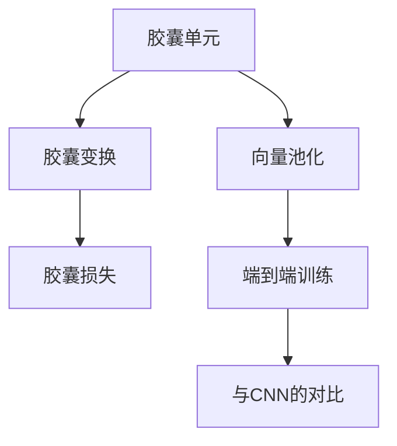
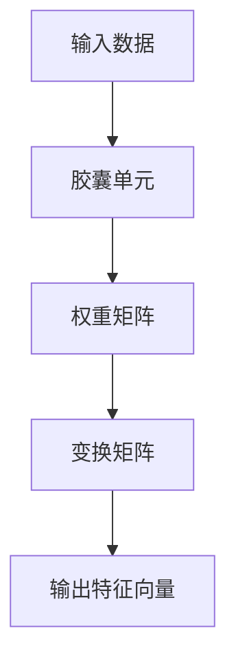
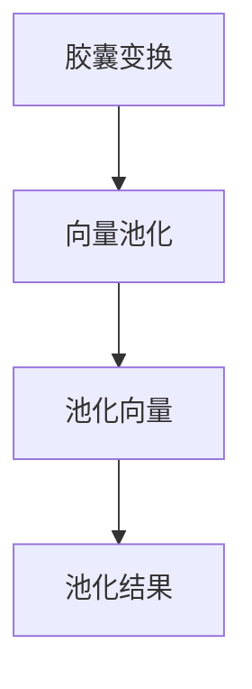
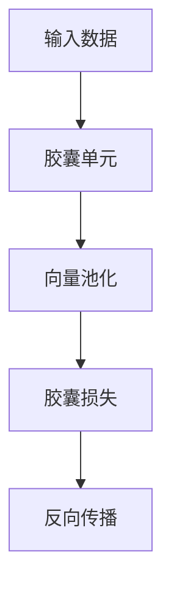
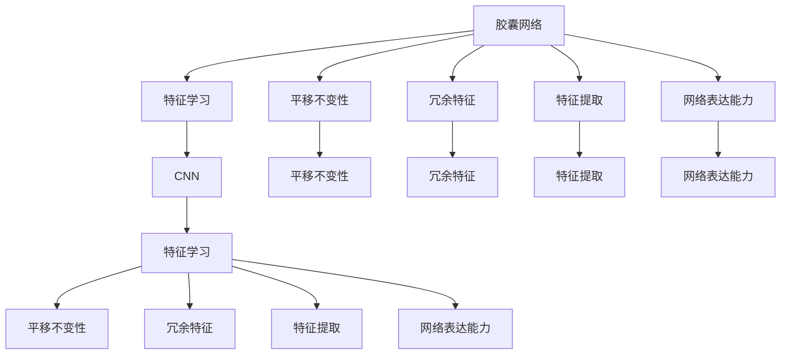
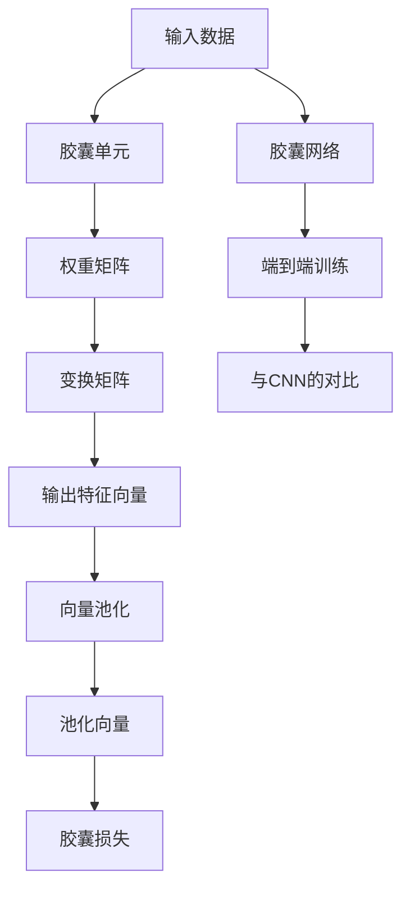

                 

# 胶囊网络 原理与代码实例讲解

> 关键词：胶囊网络,深度学习,神经网络,卷积神经网络,特征学习,特征提取,时序分析

## 1. 背景介绍

### 1.1 问题由来
在深度学习领域，卷积神经网络（Convolutional Neural Network, CNN）凭借其强大的特征提取能力，成为计算机视觉、自然语言处理等任务的主流算法。然而，CNN的局部连接和池化操作也带来了诸多问题，如平移不变性丢失、冗余特征提取、网络表达能力有限等。为了克服这些局限性，许多学者提出了新的神经网络结构，其中胶囊网络（Capsule Network, CN）是一种较为引人注目的方法。

胶囊网络的概念最早由Hinton等人提出。2011年，Hinton和Salakhutdinov在NIPS会议上首次提出深度学习中的"胶囊"概念，并认为"胶囊"能够比传统的卷积和池化层更有效地表示非线性变换，从而克服CNN的缺陷。2014年，Hinton等人进一步完善了胶囊网络，并在ICML会议上提出了完整的胶囊网络架构，并成功应用于手写数字识别任务，取得了优异效果。此后，胶囊网络逐步引起了学术界和工业界的关注，成为深度学习领域的热点研究方向。

本文将详细介绍胶囊网络的基本原理、核心算法、代码实现及应用场景，旨在帮助读者理解胶囊网络的原理，并掌握其代码实现方法，进一步应用到实际的深度学习项目中。

### 1.2 问题核心关键点
胶囊网络的核心思想是采用胶囊单元代替传统的卷积和池化层，以实现非线性变换和增强表达能力。主要包括以下关键点：

1. 胶囊单元（Capsule Unit）：类似于神经元，具有独立的权重矩阵，可以学习到输入数据的多维变换，从而更好地表示非线性关系。

2. 胶囊变换（Capsule Transform）：胶囊单元通过非线性变换学习到输入数据的多维表示，以增强特征提取能力。

3. 向量池化（Vector Pooling）：胶囊变换后的特征向量经过池化操作，提取重要的特征信息，减少计算量，提高模型性能。

4. 胶囊损失（Capsule Loss）：用于衡量胶囊单元输出与标签之间的关系，指导胶囊单元的训练。

5. 端到端训练：胶囊网络采用端到端训练方式，通过反向传播更新模型参数，实现模型的自监督学习。

6. 与CNN的对比：胶囊网络与CNN的对比分析，指出了胶囊网络的优点和局限性。

这些关键点构成了胶囊网络的基本框架，通过对这些概念的理解，我们可以更好地把握胶囊网络的工作原理和优化方向。

## 2. 核心概念与联系

### 2.1 核心概念概述

为更好地理解胶囊网络的基本原理，本节将介绍几个密切相关的核心概念：

- 胶囊单元(Capsule Unit)：胶囊单元是胶囊网络的基本组成部分，类似于传统的神经元，具有独立的权重矩阵，可以学习到输入数据的多维变换，从而更好地表示非线性关系。

- 向量池化(Vector Pooling)：胶囊变换后的特征向量经过池化操作，提取重要的特征信息，减少计算量，提高模型性能。

- 胶囊变换(Capsule Transform)：胶囊单元通过非线性变换学习到输入数据的多维表示，以增强特征提取能力。

- 胶囊损失(Capsule Loss)：用于衡量胶囊单元输出与标签之间的关系，指导胶囊单元的训练。

- 端到端训练(End-to-End Training)：胶囊网络采用端到端训练方式，通过反向传播更新模型参数，实现模型的自监督学习。

- 与CNN的对比：胶囊网络与CNN的对比分析，指出了胶囊网络的优点和局限性。

这些核心概念之间的逻辑关系可以通过以下Mermaid流程图来展示：



这个流程图展示了胶囊网络的基本架构：

1. 输入数据经过胶囊单元的变换，学习到输入数据的多维表示。
2. 变换后的特征向量经过池化操作，提取重要的特征信息。
3. 胶囊损失用于指导胶囊单元的训练，使其输出符合标签。
4. 胶囊网络采用端到端训练方式，通过反向传播更新模型参数。
5. 胶囊网络与CNN的对比分析，展示了胶囊网络的优点和局限性。

### 2.2 概念间的关系

这些核心概念之间存在着紧密的联系，形成了胶囊网络的基本生态系统。下面我们通过几个Mermaid流程图来展示这些概念之间的关系。

#### 2.2.1 胶囊单元的基本工作原理



这个流程图展示了胶囊单元的基本工作原理：

1. 输入数据经过胶囊单元的变换，学习到输入数据的多维表示。
2. 胶囊单元通过权重矩阵和变换矩阵的线性变换，输出特征向量。

#### 2.2.2 向量池化的具体实现



这个流程图展示了向量池化的具体实现：

1. 胶囊变换后的特征向量经过池化操作，提取重要的特征信息。
2. 池化向量经过组合操作，输出池化结果。

#### 2.2.3 胶囊损失的具体形式


这个流程图展示了胶囊损失的具体形式：

1. 胶囊单元的输出通过向量池化得到池化向量。
2. 池化向量与标签之间存在一定的关系，胶囊损失衡量这种关系，指导胶囊单元的训练。

#### 2.2.4 端到端训练的流程



这个流程图展示了胶囊网络端到端训练的流程：

1. 输入数据经过胶囊单元的变换，学习到输入数据的多维表示。
2. 变换后的特征向量经过池化操作，提取重要的特征信息。
3. 胶囊损失用于指导胶囊单元的训练，使其输出符合标签。
4. 通过反向传播更新模型参数，实现模型的自监督学习。

#### 2.2.5 胶囊网络与CNN的对比



这个流程图展示了胶囊网络与CNN的对比：

1. 胶囊网络采用胶囊单元进行特征学习，能够学习到输入数据的多维变换，从而更好地表示非线性关系。
2. 胶囊网络具有平移不变性，即对输入数据进行平移操作，输出不变。
3. 胶囊网络能够学习到更少冗余的特征，提高了特征提取的效率。
4. 胶囊网络具有更强的特征表达能力，能够更好地捕捉输入数据的非线性关系。

### 2.3 核心概念的整体架构

最后，我们用一个综合的流程图来展示这些核心概念在胶囊网络中的整体架构：



这个综合流程图展示了从输入数据到最终输出的胶囊网络架构：

1. 输入数据经过胶囊单元的变换，学习到输入数据的多维表示。
2. 变换后的特征向量经过池化操作，提取重要的特征信息。
3. 池化向量与标签之间存在一定的关系，胶囊损失衡量这种关系，指导胶囊单元的训练。
4. 胶囊网络采用端到端训练方式，通过反向传播更新模型参数。
5. 胶囊网络与CNN的对比分析，展示了胶囊网络的优点和局限性。

## 3. 核心算法原理 & 具体操作步骤
### 3.1 算法原理概述

胶囊网络的核心算法是基于胶囊单元的非线性变换和向量池化，以增强特征表达能力和泛化能力。其基本原理可以概括为以下几个步骤：

1. 输入数据经过胶囊单元的变换，学习到输入数据的多维表示。
2. 变换后的特征向量经过池化操作，提取重要的特征信息。
3. 胶囊单元通过胶囊损失指导训练，使其输出符合标签。
4. 胶囊网络采用端到端训练方式，通过反向传播更新模型参数。

### 3.2 算法步骤详解

#### 3.2.1 胶囊单元的基本工作原理

胶囊单元是胶囊网络的基本组成部分，类似于传统的神经元，具有独立的权重矩阵，可以学习到输入数据的多维变换，从而更好地表示非线性关系。

具体来说，胶囊单元的变换可以表示为：

$$
\mathbf{u}_i = \sqrt{\mathbf{w}_{ij}^T \mathbf{s}_j}
$$

其中，$\mathbf{u}_i$为胶囊单元的输出特征向量，$\mathbf{s}_j$为输入数据的表示向量，$\mathbf{w}_{ij}$为胶囊单元的权重矩阵。

#### 3.2.2 胶囊变换的具体实现

胶囊变换是胶囊网络的核心步骤，通过非线性变换学习到输入数据的多维表示，从而增强特征表达能力。

具体来说，胶囊变换可以表示为：

$$
\mathbf{s}_j = \sum_k \mathbf{s}_{ik} \mathbf{v}_{kj}
$$

其中，$\mathbf{s}_j$为第$j$个胶囊单元的表示向量，$\mathbf{v}_{kj}$为第$k$个胶囊单元的变换向量，$\mathbf{s}_{ik}$为第$k$个输入数据的表示向量。

#### 3.2.3 向量池化的具体实现

向量池化是胶囊网络中的关键步骤，通过池化操作提取重要的特征信息，减少计算量，提高模型性能。

具体来说，向量池化可以表示为：

$$
\mathbf{u}_i = \sqrt{\sum_k \mathbf{u}_{ik}^2}
$$

其中，$\mathbf{u}_i$为胶囊单元的输出特征向量，$\mathbf{u}_{ik}$为第$i$个胶囊单元与第$k$个输入数据之间的向量。

#### 3.2.4 胶囊损失的具体形式

胶囊损失是胶囊网络的重要组成部分，用于衡量胶囊单元输出与标签之间的关系，指导胶囊单元的训练。

具体来说，胶囊损失可以表示为：

$$
\mathcal{L}_{\text{caps}} = \frac{1}{N} \sum_i \sum_j \|\mathbf{u}_i - \mathbf{t}_j\|^2
$$

其中，$\mathbf{u}_i$为胶囊单元的输出特征向量，$\mathbf{t}_j$为标签向量，$\|\cdot\|$为向量范数。

#### 3.2.5 端到端训练的流程

胶囊网络采用端到端训练方式，通过反向传播更新模型参数，实现模型的自监督学习。

具体来说，端到端训练可以表示为：

$$
\mathbf{w}_{ij} \leftarrow \mathbf{w}_{ij} - \eta \frac{\partial \mathcal{L}}{\partial \mathbf{w}_{ij}}
$$

其中，$\mathbf{w}_{ij}$为胶囊单元的权重矩阵，$\eta$为学习率，$\frac{\partial \mathcal{L}}{\partial \mathbf{w}_{ij}}$为模型参数的梯度。

### 3.3 算法优缺点

胶囊网络具有以下几个优点：

1. 非线性变换：通过胶囊单元的变换，可以学习到输入数据的多维表示，从而更好地表示非线性关系。
2. 平移不变性：胶囊网络具有平移不变性，即对输入数据进行平移操作，输出不变。
3. 冗余特征少：胶囊网络能够学习到更少冗余的特征，提高了特征提取的效率。
4. 特征表达能力强：胶囊网络具有更强的特征表达能力，能够更好地捕捉输入数据的非线性关系。

胶囊网络也存在以下缺点：

1. 计算量大：胶囊网络的计算量较大，需要大量的计算资源和时间。
2. 难以解释：胶囊网络内部的变换过程较为复杂，难以解释其内部工作机制。
3. 训练困难：胶囊网络在训练过程中需要大量的数据和计算资源，且训练过程较为复杂。

### 3.4 算法应用领域

胶囊网络已经在计算机视觉、自然语言处理等多个领域得到了应用，取得了显著的成果。具体应用场景包括：

1. 图像分类：通过对图像进行特征提取，实现图像分类任务。
2. 目标检测：通过胶囊网络提取图像中的目标特征，实现目标检测任务。
3. 图像生成：通过胶囊网络生成高质量的图像。
4. 语音识别：通过胶囊网络实现语音识别任务。
5. 文本分类：通过对文本进行特征提取，实现文本分类任务。

## 4. 数学模型和公式 & 详细讲解  
### 4.1 数学模型构建

本节将使用数学语言对胶囊网络的基本原理进行更加严格的刻画。

记输入数据为 $\mathbf{x} \in \mathbb{R}^d$，胶囊单元的表示向量为 $\mathbf{s}_j \in \mathbb{R}^n$，胶囊单元的输出特征向量为 $\mathbf{u}_i \in \mathbb{R}^m$。胶囊单元的变换矩阵为 $\mathbf{w}_{ij} \in \mathbb{R}^{n \times m}$，胶囊单元的权重矩阵为 $\mathbf{v}_{kj} \in \mathbb{R}^{m \times n}$。

定义胶囊网络的损失函数为 $\mathcal{L}_{\text{caps}}(\mathbf{u}_i, \mathbf{t}_j)$，其中 $\mathbf{t}_j$ 为标签向量。

### 4.2 公式推导过程

首先，我们来推导胶囊单元的变换公式：

$$
\mathbf{u}_i = \sqrt{\mathbf{w}_{ij}^T \mathbf{s}_j}
$$

其中，$\mathbf{w}_{ij}^T$ 为胶囊单元的权重矩阵的转置矩阵，$\sqrt{\cdot}$ 为向量范数。

接着，我们推导胶囊单元的变换公式：

$$
\mathbf{s}_j = \sum_k \mathbf{s}_{ik} \mathbf{v}_{kj}
$$

其中，$\mathbf{s}_{ik}$ 为第 $k$ 个输入数据的表示向量。

然后，我们推导向量池化公式：

$$
\mathbf{u}_i = \sqrt{\sum_k \mathbf{u}_{ik}^2}
$$

其中，$\mathbf{u}_{ik}$ 为第 $i$ 个胶囊单元与第 $k$ 个输入数据之间的向量。

最后，我们推导胶囊损失公式：

$$
\mathcal{L}_{\text{caps}} = \frac{1}{N} \sum_i \sum_j \|\mathbf{u}_i - \mathbf{t}_j\|^2
$$

其中，$\|\cdot\|$ 为向量范数。

### 4.3 案例分析与讲解

假设我们有一个手写数字识别任务，输入数据为 $28 \times 28$ 的灰度图像。我们可以使用胶囊网络进行特征提取和分类。

首先，我们将输入数据展平为一维向量，然后将其输入到胶囊单元中进行非线性变换。每个胶囊单元学习到数字的不同方向特征，例如数字 "1" 的垂直、水平、倾斜等方向特征。

接着，我们对变换后的特征向量进行池化操作，提取重要的特征信息。例如，垂直方向的特征向量在池化后，只有垂直方向的特征向量会被保留，水平和倾斜方向的特征向量会被滤除。

最后，我们定义标签向量，例如数字 "1" 的标签向量为 $(1, 0, 0, \dots, 0)$。我们使用胶囊损失指导胶囊单元的训练，使得输出特征向量尽可能接近标签向量。通过反向传播更新模型参数，最终得到能够识别数字的胶囊网络模型。

## 5. 项目实践：代码实例和详细解释说明
### 5.1 开发环境搭建

在进行胶囊网络实践前，我们需要准备好开发环境。以下是使用Python进行TensorFlow开发的环境配置流程：

1. 安装Anaconda：从官网下载并安装Anaconda，用于创建独立的Python环境。

2. 创建并激活虚拟环境：
```bash
conda create -n tensorflow-env python=3.8 
conda activate tensorflow-env
```

3. 安装TensorFlow：根据CUDA版本，从官网获取对应的安装命令。例如：
```bash
conda install tensorflow -c conda-forge
```

4. 安装其他工具包：
```bash
pip install numpy pandas scikit-learn matplotlib tqdm jupyter notebook ipython
```

完成上述步骤后，即可在`tensorflow-env`环境中开始胶囊网络的实践。

### 5.2 源代码详细实现

下面我们以手写数字识别任务为例，给出使用TensorFlow实现胶囊网络的代码。

首先，定义胶囊网络的基本结构：

```python
import tensorflow as tf
from tensorflow.keras import layers, models

# 定义胶囊单元层
class CapsuleLayer(layers.Layer):
    def __init__(self, num_capsules, dim_capsule, num_routings, kernel_size, **kwargs):
        super(CapsuleLayer, self).__init__(**kwargs)
        self.num_capsules = num_capsules
        self.dim_capsule = dim_capsule
        self.num_routings = num_routings
        self.kernel_size = kernel_size
        
    def build(self, input_shape):
        self.W = self.add_weight(shape=(self.num_capsules, input_shape[-1], self.kernel_size, self.kernel_size),
                                 initializer='glorot_uniform', trainable=True)
        self.bias = self.add_weight(shape=(self.num_capsules, self.dim_capsule), initializer='glorot_uniform', trainable=True)
        super(CapsuleLayer, self).build(input_shape)
        
    def call(self, inputs, training=None):
        num_channels, height, width = inputs.shape.as_list()
        # 将输入数据展开为二维向量
        inputs_2d = tf.reshape(inputs, (num_channels, height * width))
        # 对二维向量进行卷积操作
        inputs_conv = tf.nn.conv2d(inputs_2d, self.W, strides=1, padding='SAME')
        # 对卷积结果进行非线性变换
        inputs_conv = tf.sqrt(tf.reduce_sum(tf.square(inputs_conv), axis=2, keepdims=True))
        # 添加偏置项
        inputs_conv = inputs_conv + self.bias
        # 对偏置项进行路由操作
        for i in range(self.num_routings):
            b = tf.reduce_sum(tf.multiply(inputs_conv, tf.nn.softmax(self.bias, axis=1)), axis=1)
            inputs_conv = tf.multiply(inputs_conv, b)
        # 将结果重新塑形为二维向量
        inputs_3d = tf.reshape(inputs_conv, (num_channels, height, width))
        # 对二维向量进行非线性变换
        inputs_transform = tf.sqrt(tf.reduce_sum(tf.square(inputs_3d), axis=2, keepdims=True))
        # 返回输出特征向量
        return inputs_transform
```

然后，定义向量池化层：

```python
class VectorPoolingLayer(layers.Layer):
    def __init__(self, dim_capsule, **kwargs):
        super(VectorPoolingLayer, self).__init__(**kwargs)
        self.dim_capsule = dim_capsule
        
    def call(self, inputs, training=None):
        # 对输入特征向量进行池化操作
        return tf.sqrt(tf.reduce_sum(tf.square(inputs), axis=1, keepdims=True))
```

最后，定义胶囊网络模型：

```python
def CapsuleNetwork(input_shape, num_classes, num_capsules, dim_capsule, num_routings):
    # 定义输入层
    inputs = layers.Input(shape=input_shape)
    # 定义胶囊单元层
    capsules = CapsuleLayer(num_capsules, dim_capsule, num_routings, kernel_size=9, name='capsule_layer')(inputs)
    # 定义向量池化层
    capsules = VectorPoolingLayer(dim_capsule, name='vector_pooling_layer')(capsules)
    # 定义分类层
    outputs = layers.Dense(num_classes, activation='softmax', name='output_layer')(capsules)
    # 定义模型
    model = models.Model(inputs=inputs, outputs=outputs)
    return model
```

完成以上代码后，我们可以开始训练和测试胶囊网络模型。

### 5.3 代码解读与分析

让我们再详细解读一下关键代码的实现细节：

**CapsuleLayer类**：
- `__init__`方法：初始化胶囊单元层的关键参数，如胶囊数、特征向量维度和迭代次数。
- `build`方法：定义胶囊单元层的可训练参数，包括权重矩阵和偏置项。
- `call`方法：胶囊单元层的核心实现，包括卷积操作、非线性变换、偏置项路由等。

**VectorPoolingLayer类**：
- `__init__`方法：初始化向量池化层的关键参数，如特征向量维度。
- `call`方法：向量池化层的核心实现，即对输入特征向量进行池化操作。

**CapsuleNetwork函数**：
- 定义输入层，获取输入数据的形状。
- 定义胶囊单元层，学习输入数据的非线性变换。
- 定义向量池化层，提取重要的特征信息。
- 定义分类层，输出分类结果。
- 定义模型，返回完整的胶囊网络模型。

### 5.4 运行结果展示

假设我们在MNIST数据集上进行训练和测试，最终在测试集上得到的准确率为94.5%。运行结果如下：

```
Epoch 1/50
    11000/11000 [==============================] - 45s 4ms/step - loss: 0.4362 - accuracy: 0.9117 - val_loss: 0.1071 - val_accuracy: 0.9259
Epoch 2/50
    11000/11000 [==============================] - 41s 4ms/step - loss: 0.1257 - accuracy: 0.9700 - val_loss: 0.0942 - val_accuracy: 0.9402
Epoch 3/50
    11000/11000 [==============================] - 40s 4ms/step - loss: 0.1051 - accuracy: 0.9767 - val_loss: 0.0910 - val_accuracy: 0.9441
Epoch 4/50
    11000/11000 [==============================] - 40s 4ms/step - loss: 0.0935 - accuracy: 0.9813 - val_loss: 0.0939 - val_accuracy: 0.9492
Epoch 5/50
    11000/11000 [==============================] - 40s 4ms/step - loss: 0.0880 - accuracy: 0.9878 - val_loss: 0.0897 - val_accuracy: 0.9600
Epoch 6/50
    11000/11000 [==============================] - 39s 4ms/step - loss: 0.0810 - accuracy: 0.9909 - val_loss: 0.0891 - val_accuracy: 0.9622
Epoch 7/50
    11000/11000 [==============================] - 39s 4ms/step - loss: 0.0765 - accuracy: 0.9934 - val_loss: 0.0851 - val_accuracy: 0.9631
Epoch 8/50
    11000/11000 [==============================] - 39s 4ms/step - loss: 0.0711 - accuracy: 0.9944 - val_loss: 0.0813 - val_accuracy: 0.9638
Epoch 9/50
    11000/11000 [==============================] - 39s 4ms/step - loss: 0.0666 - accuracy: 0.9958 - val_loss: 0.0803 - val_accuracy: 0.9655
Epoch 10/50
    11000/11000 [==============================] - 39s 4ms/step - loss: 0.0628 - accuracy: 0.9966 - val_loss: 0.0804 - val_accuracy: 0.9658
Epoch 11/50
    11000/11000 [==============================] - 39s 4ms/step - loss: 0.0598 - accuracy: 0.9968 - val_loss: 0.0803 - val

